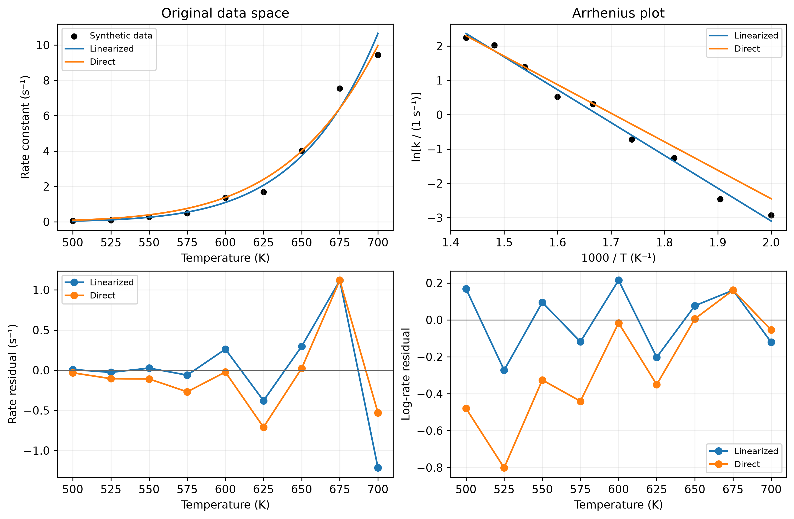

::: {.callout-note}
## Central question

**If a function cannot pass through every data point, how do we choose the coefficients that best represent the data?**
:::

## Learning outcomes

By the end of this lecture, you should be able to:

1. **Formulate** a fitting problem by identifying the known data, unknown parameters, residuals, and objective to minimize.
2. **Fit** a straight line, a low-degree polynomial, and an Arrhenius relation using NumPy or SciPy.
3. **Compare** a linearized Arrhenius fit with direct nonlinear least squares by the residuals each method minimizes.
4. **Assess** a fitted model using residual patterns, parameter units, data range, and independent checks.

## From interpolation to an overall fit

In [L08](../L08), we constructed functions that passed through every supplied data point using **interpolation**. Given the **exact data points** $(P,T)$ on a phase diagram boundary, we can carefully choose an interpolation method and infer the gas–liquid coexistence pressure at another temperature $T$.

What if the data measurement is not exact? In many real-world engineering scenarios, even repeating the same condition produces fluctuating measurements. For a measured quantity $y$ that depends on one input $x$, we might write

$$
 y_{\mathrm{measured}}(x)=f_{\mathrm{true}}(x)+\text{systematic measurement error}+\text{random noise}.
$$

For example, when measuring the coexistence pressure, a poorly calibrated pressure sensor can shift all readings in the same direction, while small temperature fluctuations can cause the pressure to vary between readings. Interpolating these measurements exactly forces the curve to reproduce both the physical trend and the experimental errors.

### Interpolation or curve fitting?

Recall that a straight line can pass through two points, and a quadratic can pass through three. More generally, $N$ points with distinct inputs determine one polynomial of degree **at most $N-1$**, whether we write it in Lagrange or Newton form. That polynomial has $N$ adjustable coefficients to satisfy the $N$ data values. As we add noisy data, insisting on an exact match can give us an increasingly complicated curve.

The idea of **curve fitting** is to use a formula with fewer parameters, often just a few, to reproduce the overall trend. We first choose the form of the function, often called a **function family**, then adjust its parameters to represent the data overall. The fitted curve may pass through some points, but it is not required to pass through all of them ([Kiusalaas, 2013](../references.qmd#ref-kiusalaas2013), §3.4).

For example, bitumen becomes less viscous as its temperature increases. The synthetic data below illustrate how sample-to-sample differences, small temperature offsets, and measurement noise can obscure this trend. Here weuse one [experimental study of bitumen viscosity](https://www.mdpi.com/1996-1073/12/12/2390) to demonstrate the difference between interpolation and curve fitting. For the curve fitting, we choose a decreasing power law to describe the viscosity:

$$
\mu(T)=\alpha T^{-p},
$$

where the **known data** are measured temperatures $T$ and viscosities $\mu$, and the **unknown parameters** are the scale $\alpha$ and exponent $p$. We use absolute temperature in kelvin and viscosity in $\mathrm{Pa\cdot s}$. A positive $p$ makes the viscosity decrease as temperature increases. The plotted values are generated for this illustration, and the power law describes their trend over the displayed temperature range.

{#fig-viscosity-fitting fig-alt="Three panels show four noisy synthetic viscosity series, an oscillating cubic spline through every point, and a smooth fitted decreasing power law."}

Two decisions are involved when we perform curve fitting:

1. **Choose a model:** a straight line, a polynomial, an Arrhenius law, or another function justified by the problem. An unsuitable function form introduces the [model-form error discussed in L02](../../01/L02/index.qmd#what-errors-appear-in-this-comparison), even if we find its best-fitting parameters.
2. **Choose a measure of mismatch:** what does “best fit” mean for these data?

Curve fitting also offers some benefits compared with exact interpolation:

1. **Physical insights:** when the parameters have physical meaning, fitting estimates properties of the system. For example, fitting the van der Waals parameters $a$ and $b$ to pressure–volume–temperature data estimates the strength of intermolecular attraction and the excluded volume.
2. **Capturing the general trend:** rounding the fitted exponent to $p\approx8$, increasing temperature from $298$ to $308\ \mathrm{K}$ gives $\mu(308)/\mu(298)=(308/298)^{-8}\approx0.77$, a decrease of about **23%**, even when individual measurements look scattered and messy.
3. **Extrapolation:** in [L08, “What does Python return outside the supplied temperature range?”](../L08/index.qmd#what-does-python-return-outside-the-supplied-temperature-range), we saw why extending an interpolant can be unreliable. A fitted model gives a stronger basis for extrapolation when its physical assumptions remain valid beyond the data. For example, early in the COVID-19 pandemic, models fitted to case counts were used to predict growth or decline under current prevention measures. Those predictions depended on assumptions about transmission and behaviour continuing to hold.

::: {.callout-note}
## Two uses of the word interpolation

We can use a fitted curve to predict a value **inside** the sampled input range. That is interpolation in the sense of where the prediction lies. An **interpolating function**, as constructed in L08, has the additional requirement that it pass through every supplied point.
:::

### Underfitting and overfitting

Curve fitting typically uses a few parameters to represent many data points. If the result looks poor, we need to distinguish two possible causes:

1. **The fitting procedure has not converged.** Within the chosen function family, another set of parameters still gives a smaller mismatch. For example, adjusting the slope and intercept of a poorly positioned line can bring it closer to the data.
2. **The function family has unsuitable flexibility.** Even after finding the parameters that minimize the chosen mismatch, a model with too few adjustable features may miss the overall shape (**underfitting**). A model with too much flexibility may follow the noise and predict poorly between measurements or for new data (**overfitting**).

{#fig-fitting-diagnostics fig-alt="Two panels distinguish an unfinished straight-line fit from model choice: a constant underfits curved data, a quadratic captures the trend, and a high-degree polynomial overfits."}

In general, we should check whether the chosen function can reproduce the shape of the data, then consider how many parameters that shape needs. A smaller mismatch on the fitted data alone cannot tell us whether extra parameters capture useful structure. Measurements held out of the fit help us judge whether the improvement carries over to new data.

::: {.callout-tip}
## Von Neumann's elephant

John von Neumann is credited with the remark, “With four parameters I can fit an elephant, and with five I can make him wiggle his trunk.” [The elephant example](https://en.wikipedia.org/wiki/Von_Neumann%27s_elephant) illustrates how adjustable parameters can reproduce an impressive shape without establishing a physical explanation.
:::

## First example: linear regression

<I will remove everything about tensile from there, remember the fitting function is always called hat f, not hat y. x, y only refer to the data>

The first example we will see is the linear regression, which you might already seen in other context. Our purpose is to use a linear equtation (first-order polynomial)

$$
\hat f(x)=a_0+a_1x.
$$

- **What are our data**? We are given a series of {x_i, y_i} points as given data, they are known to us
- **what are the unknowns**? the a0 and a1, they are the unknowwn / paramteres we need to determine?

Two points at distinct inputs determine a line exactly. With more than two points, the data may not lie on one line. We then need a criterion for selecting one line from all possible lines. 

In other words: linear regression become the following task
1) given function to fit: \hat f(x)=a_0+a_1x. 2 parameters
2) define a measurement of the data and function mismatch
3) **minimize** the mismatch by adjusting a0 and a1
4) return the best parameters a0 and a1, as well as the function hat f

This is basically an optimization problem! (similar to our lecture 06), but with a0 and a1 as the variables!!

### How do we measure the mismatch?

At each point, define the **residual** per data point

$$
\boxed{r_i=y_i-\hat f(x_i).}
$$

A positive residual means the observation is above the fitted curve, and its magnitude has the same units as $y$. This tells us how far the measurement is from our model, while the true experimental error would require knowledge of the true value. In these examples, we treat the input values as accurately known and fit the discrepancies in the output.

How do we measure the mismatch over all data points? A naive way is to write

E_naive = sum r_i

Will this work? Not really. at some point there will be data points with both positive and negative residuals, they can cancel each other!
 Two useful alternatives are

- Absolute error

$$
E_{\mathrm{abs}}=\sum_{i=1}^{N}|r_i| = sum yi - (a0 + a1x_i)
$$

- Squared error

$$
E_{\mathrm{sq}}=\sum_{i=1}^{N}r_i^2. = <expand to full term>
$$

**Quick check:** residuals of $+10$ and $-10$ have a sum of zero. What are their absolute-error and squared-error sums? Would you call either point an exact match?

<answer as collapsable>

We commonly use just the squared error $E_sq$ as the mismatch measurement, this forms the basic of least-squares regression (LSR). Without more discussions, we typically just refer overall mismatch $E$ to the squared form.

::: {.callout-important} <collapsable>
## Why square the residuals?

Squaring prevents cancellation and gives a smooth objective when the model is differentiable. It also penalizes large residuals strongly, so an outlier can pull the fit toward itself.

We can also minimize the absolute residuals, which often reduces the influence of large outliers. The absolute-value function has a corner at zero, so this objective requires different optimization tools. The choice between the objectives depends on what we know about the measurements and the prediction we need.
:::


The linear LSR criterion chooses the parameters that minimize the sum of squared residuals:

$$
\boxed{\min_{a_0,a_1} E(a_0,a_1),\qquad
E(a_0,a_1)=\sum_{i=1}^{N}(y_i-a_0-a_1x_i)^2.}
$$


## The basics of least squares

### Solution to linear least square problem

For a straight line, $E$ is a **quadratic function** of the two unknown
coefficients. Provided the inputs are not all identical, it has **one
minimum** in 2-dimensions. How do we find the minimum? We can set the partial derivative of E with respect to a0 and a1, to be both 0.

<must show the equation below!, use the chain rule >

E = sum [(yi - (a0 + a1x_i))^2]

convert to solve

partial Epartial a0 = -sum 2 (yi -  a0 - a1x_i) = 0
partial Epartial a1 = -sum 2(y1 - a0 - a1x_i)x_i = 0

How many equations? Just 2 (yes this is 2 parameter problem). This question isn't particularly to solve:

Let's rewrite both equations

- partial E / partial a0 

--> n a_0 + (\sum x_1) a1 = \sum_i y_i

partial E/ partial a1

\sum x_1 a0 + \sum x_i^2 a_1 = \sum_i xiyi


Lets note <fix all to use capital N above and below>, S_x, Sy, Sxx, Sxy <with definition>


$$
\begin{aligned}
S_x&=x_1+x_2+\cdots+x_N, & S_y&=y_1+y_2+\cdots+y_N,\\
S_{xx}&=x_1^2+x_2^2+\cdots+x_N^2, & S_{xy}&=x_1y_1+x_2y_2+\cdots+x_Ny_N.
\end{aligned}
$$

The equations and their matrix form are

$$
\begin{cases}
na_0+S_xa_1=S_y,\\
S_xa_0+S_{xx}a_1=S_{xy},
\end{cases}
\qquad\Longleftrightarrow\qquad
\underbrace{\begin{bmatrix}N&S_x\\S_x&S_{xx}\end{bmatrix}}_{\text{known }2\times2\text{ matrix}}
\underbrace{\begin{bmatrix}a_0\\a_1\end{bmatrix}}_{\text{unknown coefficients}}
=
\underbrace{\begin{bmatrix}S_y\\S_{xy}\end{bmatrix}}_{\text{known sums}}.
$$

This system of equations problem can be solved using basica algebra, given

a0 = SxxSy - Sxy Sx/nSxx - Sx^2
a1 = nSxy - ....

<more details to show in next unit>

::: {.callout-important}
## The measurements are fixed while we solve for the coefficients

The $n$ pairs $(x_i,y_i)$ are known, so every entry in the matrix and on the right-hand side can already be calculated. We have chosen the function form $\hat y=a_0+a_1x$, and the only unknowns are its two coefficients. Collecting more measurements changes the sums but leaves us with two unknowns.

This gives another connection to **systems of equations**. In L08, the equations required the curve to match each point. Here they express the condition that the overall squared error is minimized.
:::

{#fig-lsr-objective fig-alt="Contours of squared stress residuals as a function of intercept and slope, with a star marking the minimum." width="80%"}

The sum-of-squares objective is nonlinear in the coefficients, but its first-derivative equations are linear. This is why a straight-line fit can be calculated directly, without choosing an iterative starting guess.


<although I have taken out the derivatives above, we should still keep the below block, just in case>
::: {.callout-note collapse="true"}
## Derivation of the two least-squares equations and their solution

All $x_i$ and $y_i$ are known. Differentiating with respect to the two unknowns gives

$$
\frac{\partial E}{\partial a_0}
=-2\sum_{i=1}^{N}(y_i-a_0-a_1x_i)=0,
$$

$$
\frac{\partial E}{\partial a_1}
=-2\sum_{i=1}^{N}x_i(y_i-a_0-a_1x_i)=0.
$$

Using the four data sums defined above, the equations become

$$
Na_0+S_xa_1=S_y,\qquad S_xa_0+S_{xx}a_1=S_{xy}.
$$

Solving gives

$$
\boxed{
a_1=\frac{NS_{xy}-S_xS_y}{NS_{xx}-S_x^2},\qquad
a_0=\frac{S_{xx}S_y-S_{xy}S_x}{NS_{xx}-S_x^2}.
}
$$

The denominator is zero when all inputs coincide. In that case, the data cannot determine an independent slope and intercept.

For hand calculation these formulas are useful. With large input offsets, subtraction of nearly equal sums can lose precision. The equivalent centred form is preferable:

$$
a_1=\frac{\sum_i(x_i-\bar x)(y_i-\bar y)}{\sum_i(x_i-\bar x)^2},
\qquad a_0=\bar y-a_1\bar x.
$$

Notice that the fitted line passes through $(\bar x,\bar y)$.
:::

### Fit the line in Python

Practically, we don't need to always calculate the factors Sx, Sy Sxx and Sxy. Python's numerical libraires provides an exllect entrypoint for polynomial fitting, to get the best coefficients

If you have seen older tutorials in numpy, you might be familiar with `numpy.polyfit` function, which looks like this:

```{.python code-fold="false"}
slope, intercept = np.polyfit(x, y, deg=1)
y_hat = slope*x + intercept # Can also use the poly1d to reconstruct
residual = y - y_hat
```

`np.polyfit` returns coefficients from **highest power to constant** (i.e. a1, a0 in the case of linear regression)

NumPy's newer `Polynomial.fit` interface also handles domain scaling and returns an object that we can evaluate like a function, which comes as handy and is the recommended way

```{.python code-fold="false"}
from numpy.polynomial import Polynomial

fitted = Polynomial.fit(x, y, deg=1)
intercept, slope = fitted.convert().coef
y_hat = fitted(x) # just use the fitted as a normal function

```

The `.convert()` step expresses the coefficients in the original input coordinate. Its coefficients are ordered from **constant to highest power**(i.e. from a0, a1, ... so on, which are more natural). Check the convention before assigning physical meaning to an array of numbers.

Below is a simple linear regression test using numpy, <remove all the units in this text, keep them in the demo is fine!>

::: {.quarto-wasm-local notebook="l09_least_squares.edit.py" view="edit" title="Fit synthetic tensile data and inspect the residuals" height="840" loading="lazy" fullscreen="true"}
```{.python code-fold="false"}
import numpy as np
from numpy.polynomial import Polynomial

strain = np.array([0., 0.5, 1., 1.5, 2., 2.5, 3.])  # mm/m
stress = np.array([2., 33., 73., 102., 143., 172., 214.])  # MPa
fitted = Polynomial.fit(strain, stress, deg=1)
residual = stress - fitted(strain)
print(fitted.convert().coef)
print(np.sqrt(np.mean(residual**2)))
```

You can futher use plotting libraries to output the residual from the test data above, like follows

<do not need to say it's stress, just a test data>
{fig-alt="Linear regression of synthetic elastic data beside a residual plot."}
:::


### How good is the fit?

The residual at each point $r_i$ may need to be convert to a single scalar output to tell us, how good is our ^f(x) on the current data? A natural choise is the squared error (the same overall error used for LSR optimization)

- SSE

definition, expanded

However SSE increase with number of data, so not very easy to tell if function works on diff datasets, we can use the mean squared error (MSE)

- MSE, definition, expanded

We can also report the root mean squared error RMSE to have the same unit

- RMSE, definition

Similarly, MAE could also be used 

- MAE 

Although we don't use MAE for the LSR optimization.

Once the coefficients are known, we can summarize the residuals:


RMSE and MAE have the units of the measured output. MSE and SSE have squared units. 

Other formats may also be used, for example the mean absolute percentage error (MAPE) if the data magnitude is small or ranging.

For linear regression, the familiar **coefficient of determination**, or **R-square** compares the squared error with the error from predicting the mean:

$$
\boxed{R^2=1-\frac{\sum_i(y_i-\hat y_i)^2}{\sum_i(y_i-\bar y)^2}.}
$$

For ordinary least squares with an intercept, evaluated on the fitted data, $R^2$ lies between 0 and 1 when the data have nonzero variance. A value near 1 means that little squared variation remains relative to the mean-only prediction.

::: {.callout-warning}
## Check physical meaning as well as $R^2$

The same formula can be calculated for nonlinear models, but its usual linear-regression interpretation does not automatically carry over. It can be negative for a poor prediction or on new data, and is undefined when every observed $y_i$ is identical.

An $R^2$ calculated for $\ln y$ measures a different quantity from one calculated for $y$. Neither establishes that a fitted activation energy is physically meaningful.
:::

**Rule of thumb: always plot the residuals as well**

- A curved pattern suggests that the chosen model misses a systematic trend.
- A growing spread suggests that the measurement uncertainty changes with the output or input.
- One unusually large residual invites a check of that measurement and the model assumptions.

A residual is small only relative to the accuracy the application needs. Data not used for fitting provide a stronger prediction check than the same data used to choose the coefficients.

## Use linear regression on a nonlinear relation

A curved relation can sometimes be transformed into a straight line. You have already met one example in L02: a power-law error trend $E(N)=CN^{-p}$ appears as a straight line on log–log axes.

In each row below, fit $Y=a_0+a_1X$ and then recover the original parameters.

| Original relation | $X$ | $Y$ | Recover the parameters |
|---|---|---|---|
| $y=bx^m$ | $\ln x$ | $\ln y$ | $b=e^{a_0}$, $m=a_1$ |
| $y=be^{mx}$ | $x$ | $\ln y$ | $b=e^{a_0}$, $m=a_1$ |
| $y=1/(mx+b)$ | $x$ | $1/y$ | $b=a_0$, $m=a_1$ |
| $y=mx/(b+x)$ | $1/x$ | $1/y$ | $m=1/a_0$, $b=a_1/a_0$ |
| $k=Ae^{-E_a/(RT)}$ | $1/T$ | $\ln k$ | $A=e^{a_0}$, $E_a=-Ra_1$ |

We can take logarithms only for positive inputs and reciprocals only for nonzero inputs. The recovered parameters must also keep the original model defined in its intended range. For dimensional quantities, take logarithms of numerical values in stated reference units, such as $\ln[k/(1\ \mathrm{s}^{-1})]$.

### Arrhenius fitting: what does the slope mean?

For a thermally activated process,

$$
k(T)=A\exp\!\left(-\frac{E_a}{RT}\right),
\qquad
\ln k=\ln A-\frac{E_a}{R}\frac{1}{T}.
$$

A graph of $\ln k$ against $1/T$ is an **Arrhenius plot**. The slope gives $-E_a/R$ and the intercept gives $\ln A$. Temperature must be in kelvin, and $E_a$ and $R$ must use consistent energy units.

```{.python code-fold="false"}
R = 8.314462618  # J mol⁻¹ K⁻¹
slope, log_A = np.polyfit(1/T, np.log(k), deg=1)
A = np.exp(log_A)
Ea = -R*slope  # J/mol
y_hat = A*np.exp(-Ea/(R*T))
```

**Quick check:** if the horizontal axis is $1000/T$ instead, how does the fitted slope relate to $E_a$? A plotting scale changes the numerical slope.

### Does taking a logarithm preserve the fitting problem?

The linearized fit minimizes

$$
E_{\log}=\sum_i\left[\ln k_i-\ln\hat k(T_i)\right]^2.
$$

A direct fit in the original rate units minimizes

$$
E_k=\sum_i\left[k_i-\hat k(T_i)\right]^2.
$$

These are **different objectives**, so they generally give different parameters. When relative residuals are small,

$$
\ln k_i-\ln\hat k_i
=\ln\!\left(\frac{k_i}{\hat k_i}\right)
\approx\frac{k_i-\hat k_i}{k_i}.
$$

Thus an unweighted log-space fit approximately emphasizes **relative** discrepancies. An unweighted original-space fit emphasizes **absolute** discrepancies. A change of 1 s⁻¹ matters very differently for rates of 0.1 s⁻¹ and 100 s⁻¹.

## Direct nonlinear least squares in Python

If a function is nonlinear in its unknown parameters, SciPy's [`curve_fit`](https://docs.scipy.org/doc/scipy/reference/generated/scipy.optimize.curve_fit.html) can fit the original data directly. Supply a function with the input coordinate first and unknown parameters afterwards:

```{.python code-fold="false"}
from scipy.optimize import curve_fit

R_kJ = 0.008314462618  # kJ mol⁻¹ K⁻¹

def arrhenius(T, log_prefactor, Q):
    return np.exp(log_prefactor - Q/(R_kJ*T))

parameters, covariance = curve_fit(
    arrhenius, T, k, p0=(np.log(1e7), 80.),
)
A = np.exp(parameters[0])  # s⁻¹ for these rate data
Ea_kJ = parameters[1]     # kJ/mol
```

Here we fit $\ln A$ and $Q=E_a$ in kJ/mol to keep the parameter scales manageable. The function still predicts **$k$**, so the residuals are in the original rate units. Reparameterizing the coefficients does not itself transform the observations.

The argument `p0` supplies the starting guesses for the nonlinear iteration. Since the objective can have several minima or be very flat in some parameter directions, it is worth trying more than one physically reasonable starting point and comparing the resulting curves and residuals. SciPy also returns a covariance array that estimates local parameter uncertainty under assumptions about the model and measurement errors. Interpreting the parameters as evidence for a physical mechanism requires checking those assumptions against the experiment.

### Compare the two Arrhenius fits

The demo uses synthetic rates generated with $E_a=80$ kJ/mol and fixed relative scatter. Both fits use the same points and the same Arrhenius function. Only the objective changes.

**Predict:** which fit should have the smaller rate-space SSE? Which should have the smaller log-space SSE?

::: {.quarto-wasm-local notebook="l09_arrhenius.edit.py" view="edit" title="Compare linearized and direct nonlinear Arrhenius least-squares fits" height="1100" loading="lazy" fullscreen="true"}
{fig-alt="Rate versus temperature and an Arrhenius plot above absolute and logarithmic residual comparisons."}

**Static result.** The linearized fit gives $E_a\approx79.46$ kJ/mol, while the unweighted direct fit gives about 69.07 kJ/mol. Rate-space SSE falls from about 3.031 to 2.135 s⁻², while log-space SSE rises from 0.259 to 1.324. Each fit reduces the mismatch in its chosen representation.
:::

1. Compare the fitted $A$ and $E_a$. Both curves can look plausible, so how can their different objectives explain the different parameters?
2. Inspect both residual plots. Which temperature range most influences the unweighted direct fit?
3. Switch the direct fit to **equal relative uncertainty**. Why does it move closer to the log-space fit without necessarily becoming identical?
4. Edit the starting guess or one rate measurement. Can you explain the resulting change in the fitted parameters?

### If the measurements have different uncertainties

If the standard deviation of observation $i$ is $\sigma_i$, a common objective is

$$
\boxed{E_w=\sum_i\left(\frac{y_i-\hat y_i}{\sigma_i}\right)^2.}
$$

Smaller uncertainty gives a measurement more influence. In `curve_fit`, pass `sigma=sigma_y`. Use `absolute_sigma=True` when these are known absolute standard deviations and you want the covariance scaled accordingly.

The demo's relative-uncertainty option uses $\sigma_i=0.15k_i$ as an illustrative estimate. In an experiment, we would estimate these uncertainties from repeated measurements or knowledge of the measurement process. If errors are additive with approximately constant variance, fitting in the original units is a natural choice. If the scatter is multiplicative and approximately log-normal, a log-space fit reflects that error model.

::: {.callout-note collapse="true"}
## What if I want to write the residual or objective myself?

[`least_squares`](https://docs.scipy.org/doc/scipy/reference/generated/scipy.optimize.least_squares.html) accepts a **vector of residuals**:

```{.python code-fold="false"}
from scipy.optimize import least_squares

def residuals(theta):
    return (k - arrhenius(T, *theta)) / sigma_y

result = least_squares(residuals, x0=[np.log(1e7), 80.])
print(result.x, result.success, result.message)
```

Its default cost is $\tfrac12\sum_i r_i^2$. The factor $1/2$ changes the reported cost, but not its minimizer.

A general optimizer instead accepts a **scalar objective**:

```{.python code-fold="false"}
from scipy.optimize import minimize

result = minimize(
    lambda theta: np.sum(residuals(theta)**2),
    x0=[np.log(1e7), 80.],
)
```

Here `T`, `k`, `arrhenius`, and the positive uncertainty array `sigma_y` are supplied first. We still have to define what “good” means. For a sum-of-squares problem, a dedicated least-squares solver can exploit the residual structure. Use a general optimizer when the objective has a different form.
:::

## General linear least squares

A model can curve with $x$ and still be **linear in its unknown coefficients**. For example,

$$
\hat y(x)=a_0+a_1x+a_2x^2
$$

is linear in $a_0,a_1,a_2$. More generally,

$$
\boxed{\hat y(x)=a_0\phi_0(x)+a_1\phi_1(x)+\cdots+a_{p-1}\phi_{p-1}(x)
=\sum_{j=0}^{p-1}a_j\phi_j(x).}
$$

The **basis functions** $\phi_j$ are completely specified before fitting. We adjust only their coefficients. Examples include $1,x,x^2$, or $1,\sin x,\cos x$ for a periodic trend.

**Quick check:** which is linear in its unknowns: $a_0+a_1e^{-2x}$, or $a_0e^{-a_1x}$?

### How large is the system?

With $N$ data points and $p$ unknown coefficients, form a **design matrix** with one row per point and one column per basis function:

$$
\Phi_{ij}=\phi_j(x_i),\qquad
\Phi\text{ has shape }N\times p.
$$

The predicted data are $\Phi\mathbf a$. We minimize the same sum of squared residuals as before, now with $p$ adjustable coefficients. Usually $N>p$, so there are more observations than coefficients.

NumPy's [`lstsq`](https://numpy.org/doc/stable/reference/generated/numpy.linalg.lstsq.html) handles this general linear problem:

```{.python code-fold="false"}
Phi = np.column_stack([np.ones_like(x), x, x**2])
coefficients, _, rank, singular_values = np.linalg.lstsq(Phi, y, rcond=None)
y_hat = Phi @ coefficients
residual = y - y_hat
```

This quadratic has three coefficients, regardless of how many data points we collect. `rank == 3` indicates three independent columns at the solver's numerical threshold. If the columns are dependent, the data cannot determine all coefficients independently.

::: {.callout-note collapse="true"}
## From minimization to the normal equations

Taking the derivative with respect to each coefficient gives

$$
\sum_{j=0}^{p-1}\left[\sum_{i=1}^{N}\phi_k(x_i)\phi_j(x_i)\right]a_j
=\sum_{i=1}^{N}\phi_k(x_i)y_i,
\qquad k=0,\ldots,p-1.
$$

In matrix notation,

$$
\boxed{\Phi^\mathsf T\Phi\,\mathbf a=\Phi^\mathsf T\mathbf y.}
$$

These are the **normal equations**, a $p\times p$ system. For a degree-$m$ polynomial, $p=m+1$ and $\phi_j(x)=x^j$. A quadratic gives

$$
\begin{bmatrix}
N & \sum x_i & \sum x_i^2\\
\sum x_i & \sum x_i^2 & \sum x_i^3\\
\sum x_i^2 & \sum x_i^3 & \sum x_i^4
\end{bmatrix}
\begin{bmatrix}a_0\\a_1\\a_2\end{bmatrix}
=
\begin{bmatrix}\sum y_i\\\sum x_i y_i\\\sum x_i^2 y_i\end{bmatrix}.
$$

Every sum on the left and right can be calculated from the supplied data. The three unknown coefficients remain in the central column, giving a $3\times3$ system for this quadratic fit.

For computation, use `lstsq` rather than explicitly forming an inverse of $\Phi^\mathsf T\Phi$. Forming the normal matrix squares the 2-norm condition number for a full-column-rank design matrix, making an already sensitive problem harder to solve accurately.
:::

### Polynomial regression: how much flexibility do we need?

Return to the tensile notebook and change `degree` from 1 to 2, then to 6. There are seven distinct inputs. A degree-six polynomial has seven coefficients and can interpolate all seven measurements.

**Does a smaller residual on the fitted measurements give a better estimate of the elastic modulus?**

The measurements used to determine the coefficients are often called the **training data**. Increasing the degree gives the polynomial more freedom, so its minimum SSE on these same data cannot increase in exact arithmetic. That extra freedom can reproduce measurement scatter, however, leading to poor predictions between or beyond the measured inputs. This is **overfitting**.

There is also a numerical concern. High powers of poorly scaled inputs can make the coefficient calculation ill-conditioned, meaning small perturbations can have large effects on the calculated coefficients. Scaling the inputs can improve this calculation, but deciding whether the flexible polynomial represents the material still requires physical reasoning and additional data.

Use a low-degree model justified by the trend, inspect the residuals, and test predictions on additional data where possible. There is no universal degree cutoff that makes every polynomial fit reliable.

## Which Python function should I call?

| Model or task | Function | What you supply |
|---|---|---|
| Straight line or low-degree polynomial | `Polynomial.fit` or `np.polyfit` | Data and degree |
| Specified linear combination of basis functions | `np.linalg.lstsq` | Design matrix and observations |
| Parameterized nonlinear curve | `scipy.optimize.curve_fit` | Model, data, starting parameters; optional uncertainties and bounds |
| Custom residual vector | `scipy.optimize.least_squares` | Residual function and starting parameters |
| General scalar objective | `scipy.optimize.minimize` | Objective function and starting parameters |

A full-column-rank linear least-squares problem has a unique global minimum. Nonlinear least squares generally needs iterative search and a starting guess. In either case, **a minimum does not require the residuals to be zero**.

## Back to the phase diagram, and the rest of the unit

For a table of carefully calculated coexistence pressures, interpolation preserves the computed points. For scattered experimental measurements, a fitted relation can summarize the trend and estimate parameters.

::: {.callout-note collapse="true"}
## A possible phase-boundary fit

Over a limited temperature range, a constant-latent-heat Clausius–Clapeyron approximation suggests

$$
\ln P\approx C-\frac{\Delta H_{\mathrm{vap}}}{RT}.
$$

This resembles the Arrhenius fit. A straight line in $\ln P$ versus $1/T$ gives an effective latent heat under the assumptions of ideal vapour, negligible liquid volume, and approximately constant latent heat. Those assumptions become poor near the critical point, where the fitted relation needs a separate physical check.
:::

Across Unit 02, the computational questions now connect:

| Task | What do we vary? | What do we ask for? |
|---|---|---|
| Root finding | State variable, such as volume | A physical residual equal to zero |
| Optimization | State variable, such as volume | Lowest objective, such as free energy |
| Interpolation | Coefficients of a chosen function | Zero mismatch at every supplied point |
| Regression | Parameters of a chosen model | Minimum overall mismatch with the data |

The next step is to handle **several unknowns together**. The spline coefficients in L08 and the regression coefficients here have already given us examples of systems of equations.

## Before the next lecture

1. Write a least-squares objective for fitting $y=a_0+a_1x+a_2x^2$. Identify every known quantity and unknown coefficient.
2. Explain why fitting $\ln k$ and fitting $k$ directly can give different activation energies, even with the same Arrhenius law and data.
3. A degree-six polynomial gives nearly zero residual on seven noisy measurements. What evidence would you need before using it for prediction?
4. You have 100 measurements and a quadratic model. What are the shapes of the design matrix and the normal-equation matrix? Which Python function would you call?
