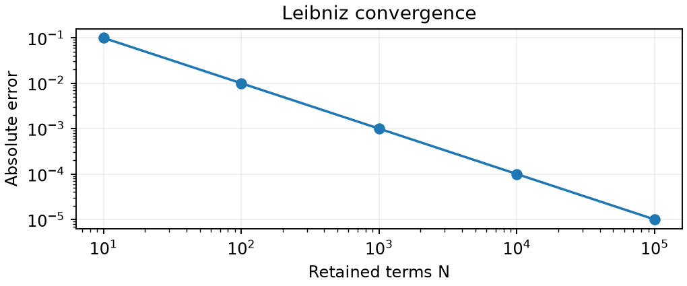
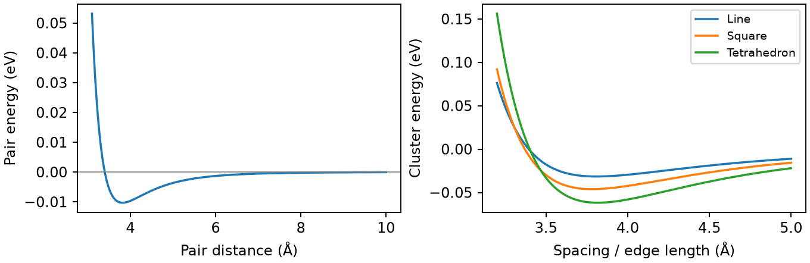

## Q1 · Error and computational effort

**1.1** Any three distinct, correctly explained sources with examples are acceptable:

- **Model error:** omitted physics; e.g. using an isotropic pair potential for directional bonding.
- **Truncation error:** omitted terms or finite discretization; e.g. retaining only $N$ terms of an infinite series.
- **Round-off error:** finite-precision storage or arithmetic; e.g. `float32(1) + float32(1e-8)` equals 1.
- **Sampling error:** finite random samples fluctuate; e.g. different Buffon seeds give different estimates.

**1.2** Fewer calls do not guarantee lower runtime. Estimate $T\approx\sum_j t_j(\text{input size})+T_{\mathrm{overhead}}$ using representative benchmarks on the same hardware. Memory and parallelism also matter. For 10, 100, or 10,000 atoms, overhead and scaling can change the ranking; the question gives too little timing information to decide.

For example, assume $T_A=c_A n^2$ and $T_B=c_B n^3$, as can occur for all-pairs and conventional electronic-structure calculations. With suitable prefactors, their runtimes could be comparable at $n=10$, while A is faster at sufficiently large $n$. These are illustrative cost models, not a claim that molecular dynamics and electronic structure normally calculate the same energy.

## Q2 · Binary and floating-point numbers

**2.1** Repeated integer division:

| Dividend | Quotient | Remainder |
|---:|---:|---:|
| 2026 | 1013 | 0 |
| 1013 | 506 | 1 |
| 506 | 253 | 0 |
| 253 | 126 | 1 |
| 126 | 63 | 0 |
| 63 | 31 | 1 |
| 31 | 15 | 1 |
| 15 | 7 | 1 |
| 7 | 3 | 1 |
| 3 | 1 | 1 |
| 1 | 0 | 1 |

The remainder sequence read **from bottom to top** will become the binary representation, e.g.:

$(2026)_{10}=(11111101010)_2$.

Conversely, $(1100111)_2=64+32+4+2+1=103$.

**2.2**

- **0.75:** $0.75\times2=1.5$, then $0.5\times2=1$. Read the integer parts in order: $(0.75)_{10}=(0.11)_2$.
- **0.10:** The successive products are $0.2,0.4,0.8,1.6,1.2,0.4,0.8,1.6$, keeping only the fractional remainder for the next multiplication. The integer parts give the first eight bits, `00011001`. Hence

$$
x_{\mathrm{approx}}=\frac{1}{16}+\frac{1}{32}+\frac{1}{256}
=\frac{25}{256}=0.09765625,
\qquad |x_{\mathrm{approx}}-0.10|=0.00234375.
$$

**2.3** Every case has sign bit $s=0$ and exponent $p=1$. The stored exponent is $E=p+b$: for `float32`, $b=127$ gives $E=128$ (`10000000`); for `float64`, $b=1023$ gives $E=1024$ (`10000000000`). The significands are:

```text
3.75, both: 1.111
3.14, float32: 1.10010001111010111000011
3.14, float64: 1.1001000111101011100001010001111010111000010100011111
```

Trailing zero bits are omitted. 

- **3.75:** Both formats store $3.75=(1.111)_2\times2^1$ exactly. Wider precision cannot improve an already exact representation.
- **3.14:** Absolute storage errors are approximately $1.04904\times10^{-7}$ (`float32`) and $1.24345\times10^{-16}$ (`float64`). Wider precision improves accuracy, but neither format stores $3.14=157/50$ exactly.


## Q3 · A method for estimating $\pi$

**3.1** The [Leibniz series](https://en.wikipedia.org/wiki/Leibniz_formula_for_%CF%80) gives

$$
\pi_N=4\sum_{k=0}^{N-1}\frac{(-1)^k}{2k+1}.
$$

- **$N$:** the number of retained terms.
- **Origin:** the power series $\arctan x=x-x^3/3+x^5/5-\cdots$, evaluated at $x=1$, where $\arctan(1)=\pi/4$.

**3.2** Implementation:

```python
def estimate_pi(N: int, **parameters):
    total = 0.0
    for k in range(N):
        total += (-1.0)**k / (2*k + 1)
    return 4.0 * total
```

Checks: $\pi_1=4$ and $\pi_2=8/3$. The mathematical truncation error satisfies $|\pi_N-\pi|\le4/(2N+1)$. The Leibniz series converges slowly.

**3.3** Errors against `np.pi`:

| $N$ | Estimate | Absolute error | Relative error |
|---:|---:|---:|---:|
| 10 | 3.041839618929403 | $9.97530\times10^{-2}$ | $3.17524\times10^{-2}$ |
| 100 | 3.131592903558554 | $9.99975\times10^{-3}$ | $3.18302\times10^{-3}$ |
| 1,000 | 3.140592653839794 | $1.00000\times10^{-3}$ | $3.18310\times10^{-4}$ |
| 10,000 | 3.141492653590034 | $1.00000\times10^{-4}$ | $3.18310\times10^{-5}$ |
| 100,000 | 3.141582653589720 | $1.00000\times10^{-5}$ | $3.18310\times10^{-6}$ |

{width="62%" fig-alt="Leibniz absolute error decreases approximately as one over the number of retained terms."}

Error decreases approximately as $N^{-1}$. There is no visible round-off-limited plateau or rise over this range; truncation dominates, although rounding is present. The optional comparison shows different convergence patterns, but equal $N$ does not mean equal work across methods. Zero error against `np.pi` would only establish agreement with that finite-precision reference.


## Q4 · Lennard-Jones clusters

**4.1** With $\varepsilon=0.0103$ eV and $\sigma=3.40$ Å:

```python
def calculate_LJ(r):
    return 4 * epsilon * ((sigma/r)**12 - (sigma/r)**6)
```

Alternatively, compute `q = (sigma/r)**6` once and return `4 * epsilon * (q*q - q)`. This avoids repeated exponentiation; benchmark to determine whether it meaningfully reduces runtime in your implementation.

**4.2** For the finite positive root, $(\sigma/r_0)^6=1$, so $r_0=\sigma=3.40$ Å. Differentiating,

$$
V'(r)=4\varepsilon[-12\sigma^{12}/r^{13}+6\sigma^6/r^7]=0
\quad\Rightarrow\quad r_m=2^{1/6}\sigma=3.816370964\ \text{Å}.
$$

At $r_m$, $V=-\varepsilon=-0.0103$ eV and $V''=72\varepsilon/r_m^2>0$, confirming a minimum.
The demo checks a finite set of sampled points for the zero crossing and minimum. Its results are close to the analytical values, but their accuracy is limited by the sampling grid. Root-finding and optimization methods in L05–L08 will let us refine such estimates to a chosen tolerance.

| Points | Nearest crossing sample (Å) | Sampled minimum (Å) | Minimum energy (eV) |
|---:|---:|---:|---:|
| 400 | 3.393985 | 3.809023 | −0.010298607 |
| 2,000 | 3.400300 | 3.817959 | −0.010299936 |


**4.3** Both implementations count each pair once using $j<i$.

**Python lists or tuples:**

```python
from math import sqrt

def calculate_LJ_cluster(coords):
    total = 0.0
    for i in range(len(coords)):
        xi, yi, zi = coords[i]
        for j in range(i):
            xj, yj, zj = coords[j]
            r = sqrt((xi-xj)**2 + (yi-yj)**2 + (zi-zj)**2)
            total += calculate_LJ(r)
    return total
```

**NumPy arrays, with the same pair-counting loops:**

```python
import numpy as np

def calculate_LJ_cluster(coords):
    coords = np.asarray(coords, dtype=float)
    total = 0.0
    for i in range(len(coords)):
        for j in range(i):
            r = np.linalg.norm(coords[i] - coords[j])
            total += calculate_LJ(r)
    return total
```

You could manually calculate the pairwise energies and verify your results.

| Pair | Distance (Å) | Pair energy (eV) |
|---|---:|---:|
| 1–2 | 4.000000 | −0.009678199650 |
| 1–3 | 4.500000 | −0.006238792005 |
| 2–3 | $\sqrt{36.25}=6.020797$ | −0.001292793011 |

Total: **−0.017209784665 eV**.

**4.4** On the supplied $a=3.2$–$5.0$ Å grid (spacing 0.005 Å):

| Shape | Best sampled $a$ (Å) | Lowest sampled energy (eV) |
|---|---:|---:|
| Line | 3.810 | −0.031570491 |
| Square | 3.785 | −0.046149881 |
| Tetrahedron | 3.815 | −0.061799712 |

{width="85%" fig-alt="Pair potential and energy-versus-spacing curves for line, square, and tetrahedral four-atom clusters."}

The **tetrahedron** is lowest among these candidates, because all six pair distances can simultaneously equal $r_m$, giving an exact optimum of $-6\varepsilon=-0.0618$ eV. The line and square have unequal pair distances, so not every pair can sit at the pair-potential minimum. 

**4.5** Representative results from the supplied optimizer with seven atoms:

| Seed | Initial energy (eV) | Final energy (eV) | Success |
|---:|---:|---:|---|
| 1 | −0.064661010 | −0.164130944 | True |
| 2 | −0.054905673 | −0.170005457 | True |
| 3 | −0.087036310 | −0.164130944 | True |

Your results may differ slightly. Here seeds 1 and 3 reach the same energy within numerical tolerance; seed 2 reaches a **lower** one. Different starting structures can lead to different local minima.

Solver “success” means a stopping criterion was met; it does not by itself certify even a local minimum, let alone the lowest energy among all possible configurations. Searching for the most stable geometry requires **global optimization**, which we will discuss later.

For four atoms, the tested seeds converge to the tetrahedron. As the cluster grows, finding the lowest-energy structure generally becomes harder because there are more competing configurations. Global structure searches remain an active research area.


**4.6** Possible improvements:

1. **NumPy vectorization:** evaluate many pair distances and energies together, reducing Python-loop overhead at the cost of additional memory.
2. **Numba JIT compilation:** compile the pair-counting loops, as in L04, while preserving the all-pairs calculation.
3. **Distance cutoff:** omit pairs with $r_{ij}>r_c$, since individual distant-pair energies are small. This changes the calculation and introduces truncation error; many small omitted contributions can add up. Benchmark against the full calculation and use neighbour lists or spatial bins to avoid checking every pair. For optimization, an abrupt cutoff can also disrupt forces, so the cutoff treatment must be chosen carefully.
