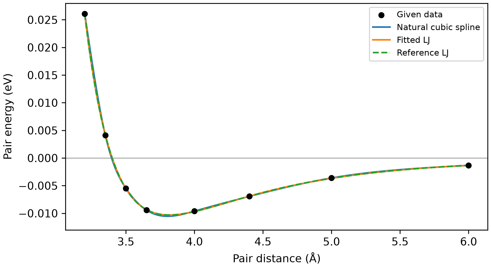

## Q1 · Short answers

**1.** Assuming $f$ is continuous on the interval, $f(x_i)f(x_{i+1})<0$ guarantees at least one root between the points. It does not determine how many roots are present. A zero endpoint is itself a root. Two function values alone generally cannot establish an interior maximum or minimum. Multiple possibilities: inspect derivative signs, or use additional sampled points to locate a candidate extremum. Opposite signs of a continuous derivative guarantee an interior extremum, though they need not identify a unique one. For a continuous function, a middle sampled value above both neighboring values guarantees an interior maximum somewhere between the neighbors, but does not locate it exactly.

**2.** A differentiable map is locally convergent if $|g'(x_s)|<1$, with a sufficiently close initial guess. It is locally repelling if $|g'(x_s)|>1$; equality requires further analysis. One practical check is to plot $y=x$ and $y=g(x)$, estimate their intersection, and inspect the slope nearby. More systematically, find an interval mapped into itself with $|g'(x)|\le q<1$ throughout.

**3.** Low-degree pieces avoid the strong oscillations that can occur in a single high-degree polynomial, especially near the ends of the data range. The spline equations are sparse and structured, so more coefficients do not necessarily mean a more expensive calculation.

**4.** Multiple possibilities. The residual depends on the units and scale of $y$: an error of $10^{-3}$ contributes only $10^{-6}$ after squaring, but may be large relative to the data. Alternatively, an overfitted curve can match the sampled values closely and still behave poorly between them.

## Q2 · Fixed-point iteration for a binary alloy

**2.1** Substituting $x=0.5$ gives $F(0.5)=\ln 1+H(0)=0$ for every $H$.

**2.2** Rearranging gives

$$
\ln\frac{x}{1-x}=H(2x-1),\qquad
\frac{x}{1-x}=e^{H(2x-1)},\qquad
x=g(x)=\frac{1}{1+e^{H(1-2x)}}.
$$

```python
def g(x, H):
    return 1 / (1 + np.exp(H * (1 - 2*x)))
```

For $H>0$, this is an increasing S-shaped curve between 0 and 1, with $g(0.5)=0.5$. Its derivative is

$$
g'(x)=2H\,g(x)[1-g(x)].
$$

**2.3** For $H=1.5$, the only intersection is at $0.5$. For $H=2.5$, two additional intersections appear, symmetrically placed about $0.5$. More generally,

$$
F'(x)=\frac{1}{x(1-x)}-2H.
$$

Since $x(1-x)\le1/4$, $F$ is strictly increasing for $H<2$ and has only the central root. At $H=2$, the central root remains the only root, with zero derivative there. For $H>2$, $F'(0.5)<0$, while $F$ tends to $-\infty$ as $x\to0^+$ and $+\infty$ as $x\to1^-$. The symmetry $F(1-x)=-F(x)$ gives two outer roots.

For the symmetric regular-solution model, the outer roots are the coexisting compositions when $H>2$; the central stationary point is then unstable. At $H<2$, the central composition is stable. The central root alone therefore does not identify a miscibility gap.

```{=latex}
\newpage
```

**2.4** Starting at $x_0=0.9$:

```python
x = 0.9
for step in range(1, 101):
    new = g(x, 2.5)
    if step <= 5:
        print(step, new)
    if abs(new - x) < 1e-4:
        break
    x = new
else:
    raise RuntimeError("No convergence")
x_beta = new
```

| Update $n$ | $x_n$ |
|---:|---:|
| 1 | 0.8807970780 |
| 2 | 0.8703419285 |
| 3 | 0.8643277097 |
| 4 | 0.8607626237 |
| 5 | 0.8586124699 |

The step tolerance is met after **12 updates**, giving $x_{12}=0.855322904921$. To five significant figures, $x_\beta=0.85532$. The original-equation residual at the unrounded iterate is $F(x_{12})\approx+3.6021\times10^{-4}$.

```{=latex}
\newpage
```

## Q3 · Fitting an atomistic energy curve

**3.1** With the specified natural cubic spline:

| Quantity | Interpolation result | Reference |
|---|---:|---:|
| Zero crossing $r_0$ (Å) | 3.395540 | 3.400000 |
| Minimum location $r_m$ (Å) | 3.804324 | 3.816371 |
| $\sigma$ from $r_0$ (Å) | 3.395540 | 3.400000 |
| $\sigma$ from $r_m/2^{1/6}$ (Å) | 3.389268 | 3.400000 |
| $\varepsilon=-V_{\mathrm{spline}}(r_m)$ (eV) | 0.01053457 | 0.01030000 |

The zero-crossing estimate of $\sigma$ is closer for these data: its absolute error is about $0.00446$ Å, compared with $0.01073$ Å from the minimum. The zero crossing is closely bracketed by the sampled distances 3.35 and 3.50 Å. The minimum lies in the wider gap between 3.65 and 4.00 Å, where its location depends on the interpolated shape. Noise also changes the spline's slopes and minimum. A different set of points or noise could reverse this comparison.

The interpolated well depth is about 2.28% too large. A spline passes through the noisy data and does not enforce the LJ form. Even tight solver tolerances only locate the spline's root and minimum more accurately, without removing interpolation error.

**3.2** Residual function and fit:

```python
def pair_residual(parameters, r, V):
    epsilon, sigma = parameters
    predicted = calculate_LJ(r, epsilon, sigma)
    return np.sum((V - predicted)**2)

fit = minimize(pair_residual, [epsilon0, sigma0], args=(r, V),
               method="Nelder-Mead",
               bounds=[(1e-6, 0.1), (2.5, 4.5)],
               options={"xatol": 1e-11, "fatol": 1e-18,
                        "maxiter": 10000})
```

Starting from $\varepsilon_0=0.01053457$ eV and $\sigma_0=3.389268$ Å gives

$$
\boxed{\varepsilon_{\mathrm{fit}}=0.01031780\ \mathrm{eV},\qquad
\sigma_{\mathrm{fit}}=3.400026\ \text{Å}.}
$$

The solver reports success, with a total squared residual of $2.81986\times10^{-8}$ eV$^2$. The relative parameter errors are about 0.173% and 0.000769%, respectively. Small differences in the last digits are acceptable.

{width="65%" fig-alt="Noisy pair-energy data compared with a natural cubic spline, fitted Lennard-Jones curve, and reference curve."}

Both fitted parameters are closer to their reference values than the interpolation estimates. Fitting uses all eight points to determine two parameters and imposes the same functional form that generated the data. This reduces the influence of individual noisy points. Exact recovery is not expected after noise has been added.

```{=latex}
\newpage
```

## Q4 · Fitting LJ parameters to quantum cluster energies

**4.1** Each term is the squared difference between the quantum and LJ energies per atom for one cluster. Dividing by $n_k$ puts clusters of different sizes on a per-atom scale, so a larger total energy alone does not give a larger cluster more weight. Every cluster contributes one squared per-atom error. The unknowns are the two shared parameters $\varepsilon$ and $\sigma$, with coordinates and quantum reference energies held fixed.

**4.2** One implementation is:

```python
def cluster_residual(parameters, clusters):
    epsilon, sigma = parameters
    total = 0.0
    for cluster in clusters:
        coords = cluster["coords"]
        n = len(coords)
        predicted = calculate_cluster_energy(coords, epsilon, sigma)
        difference = (cluster["energy_eV"] - predicted) / n
        total += difference**2
    return total
```

The division by $n$ occurs **before squaring**. The numerical check for the first two quantum clusters remains pending the dataset.

**4.3** Fit the first ten entries, passing `args=(clusters[:10],)` to `minimize`. Report the solver status and recompute the unscaled residual at its returned parameters. The fitted values and parameter bounds will depend on the chosen element and dataset.

**4.4** Repeat with nested subsets in the supplied order. Compare parameters and $\sqrt{E/N}$, because total squared residual alone is not a fair measure of fit quality across different numbers of data. There is no requirement for the parameters or RMSE to change monotonically. Optimizer convergence concerns one fixed objective and its stopping criterion. Parameter stability across growing datasets concerns how sensitive the fit is to the included configurations. Different positive starting pairs help check sensitivity to initialization.

**4.5** Plot $E_k^{\mathrm{QM}}/n_k$ horizontally and $E_k^{\mathrm{LJ}}/n_k$ vertically, with equal axis scales and a diagonal. Points above the diagonal have LJ energies that are too high, and points below have LJ energies that are too low. Curvature or clusters of deviations can reveal configurations that a single LJ pair potential describes poorly. Quantum interactions can include effects beyond an isotropic pair sum. A conclusion about this particular fit awaits the data. This plot assesses agreement on the fitted clusters; prediction for new geometries would require additional clusters excluded from fitting.
