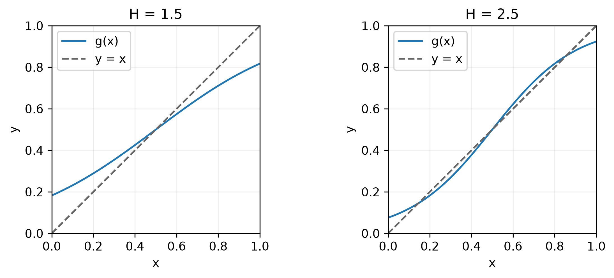
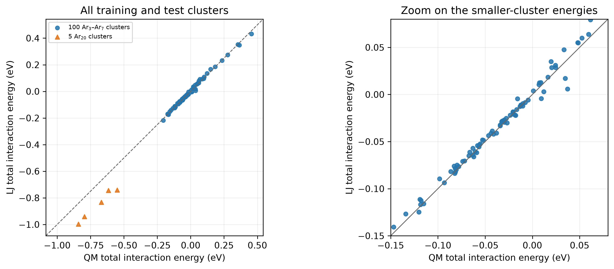

## Completed reference notebooks

- [Q2 · Fixed-point iteration](https://tiangroup-uofa.github.io/mate374-cmpt-methods-mate/completed-notebooks/8f7c2e91/a2_q2_completed.html)
- [Q3 · Fitting LJ parameters to quantum cluster energies](https://tiangroup-uofa.github.io/mate374-cmpt-methods-mate/completed-notebooks/8f7c2e91/a2_q3_completed.html)

These notebooks contain the completed functions and reproduce the calculations shown here. Small differences in the last digits are acceptable when solver tolerances differ.

## Q1 · Short answers

**1.1** For a continuous function, opposite signs, $f(x_i)f(x_{i+1})<0$, guarantee at least one root between the points. A zero endpoint is itself a root. Two function values alone do not establish an interior maximum or minimum. Additional information, such as derivative signs or a third sampled point, is needed.

**1.2** A differentiable fixed-point map is locally convergent when $|g'(x_s)|<1$ and the starting value is sufficiently close. If $|g'(x_s)|>1$, the fixed point is repelling; equality is inconclusive. In practice, plot $g(x)$ and $x$ to estimate the intersection and check the slope nearby, analytically or by finite differences. A stronger check is to find an interval mapped into itself with $|g'(x)|\le q<1$ throughout.

**1.3** Low-degree pieces reduce the large oscillations that can occur with a single high-degree polynomial, especially near the endpoints. The spline equations are sparse and structured, so having more coefficients does not require solving a general dense system.

**1.4** The data may be small in the chosen units. An error that is large relative to a measured value can still have a small square. The absolute squared residual must therefore be interpreted relative to the data scale.

## Q2 · Fixed-point iteration for a binary alloy

### 2.1 Central root

Substitution gives $F(0.5)=\ln 1+H(0)=0$ for every $H$.

### 2.2 Fixed-point form

Rearrange the equation:

$$
\ln\frac{x}{1-x}=H(2x-1),\qquad
\frac{x}{1-x}=e^{H(2x-1)},\qquad
\boxed{g(x)=\frac{1}{1+e^{H(1-2x)}}.}
$$

Here `H` is a global parameter and NumPy is imported as `np`.

```python
H = 2.5

def g(x):
    return 1 / (1 + np.exp(H * (1 - 2 * x)))
```

The map satisfies $g(0.5)=0.5$, so its graph intersects $y=x$ at the central root.

### 2.3 Additional roots

- **$H=1.5$:** no intersection in $0.5<x<1$.
- **$H=2.5$:** one additional intersection in $0.5<x<1$, with a symmetric partner below $0.5$.

{width="90%"}

For this map, $g'(x)=2H g(x)[1-g(x)]$. At the central root, $g'(0.5)=H/2$, which changes from less than one to greater than one as $H$ passes through 2. For $H=2.5$, the upper fixed point is attracting and can be reached from $x_0=0.9$.

### 2.4 Fixed-point solution

The optional loop returns the complete sequence, including $x_0$:

```python
def fixed_point(g, x0, tol=0.0001, maxiter=100):
    sequence = [x0]
    for _ in range(maxiter):
        next_x = g(sequence[-1])
        step = abs(next_x - sequence[-1])
        sequence.append(next_x)
        if step < tol:
            return sequence
    raise RuntimeError('Step tolerance not reached')
```

With `H = 2.5`, call `sequence = fixed_point(g, 0.9)`.

| Update $n$ | $x_n$ | $|x_n-x_{n-1}|$ |
| --- | --- | --- |
| 0 | 0.900000000000 | — |
| 1 | 0.880797077978 | 0.0192029 |
| 2 | 0.870341928535 | 0.0104551 |
| 3 | 0.864327709689 | 0.00601422 |
| 4 | 0.860762623720 | 0.00356509 |
| 5 | 0.858612469916 | 0.00215015 |
| 6 | 0.857302319290 | 0.00131015 |
| 7 | 0.856499055314 | 0.000803264 |
| 8 | 0.856004708622 | 0.000494347 |
| 9 | 0.855699772982 | 0.000304936 |
| 10 | 0.855511407149 | 0.000188366 |
| 11 | 0.855394947116 | 0.00011646 |
| 12 | 0.855322904921 | 7.20422e-05 |

The step tolerance is first met after **12 updates**, giving $x_{12}=0.855322904921$, or **$x_\beta=0.85532$** to five significant digits. The final step is $7.20422e-05$ and the residual at the unrounded iterate is $F(x_{12})=+0.00036021$.

The stopping rule concerns the change in composition, so the residual need not be smaller than $10^{-4}$.

```{=latex}
\newpage
```

## Q3 · Fitting LJ parameters to quantum cluster energies

### 3.1 Squared residual

Each term measures the squared mismatch between the QM and LJ **energy per atom** for one cluster. The unknowns are the two shared parameters $\sigma$ and $\varepsilon$. The coordinates, cluster sizes, and QM energies are known. Each cluster contributes one squared per-atom error.

### 3.2 Implement the residual

```python
def cluster_residual(sigma, epsilon, clusters):
    total = 0.0
    for cluster in clusters:
        coords = cluster['coords']
        E_QM = cluster['energy_eV']
        k = cluster['n_atoms']
        E_LJ = calculate_cluster_energy(coords, epsilon, sigma)
        difference = (E_QM - E_LJ) / k
        total += difference ** 2
    return total
```

The energy difference is divided by $k$ **before squaring**. Thus the squared total-energy difference is effectively divided by $k^2$, not by $k$. This implementation passes the checks on the three separate synthetic clusters.

### 3.3 Fit ten clusters

The supplied function varies $\sigma$ and $\varepsilon$ to minimize the sum of squared per-atom energy differences over the selected clusters. Nelder–Mead evaluates trial parameter pairs and adjusts them until its stopping criteria are met. It returns an optimizer result containing the fitted values and convergence status.

```python
def fit_LJ(clusters):
    result = minimize(
        lambda values: cluster_residual(values[0], values[1], clusters),
        x0=[3.4, 0.01], method='Nelder-Mead',
        bounds=[(2.5, 4.5), (1e-06, 0.1)],
        options={'xatol': 1e-09, 'fatol': 1e-14, 'maxiter': 3000})
    return result
```

For ten clusters, the first row of the table in Q3.4 gives the parameters and MAE. The objective is a **sum of squared errors**, while the reported MAE is the **mean absolute error**; these are different measures.

### 3.4 Increase the dataset

The results below use the notebook's fixed random order and the supplied solver settings. Every fit reports success.

| Clusters $N$ | $\sigma$ (Å) | $\varepsilon$ (eV) | MAE (meV/atom) |
| --- | --- | --- | --- |
| 10 | 3.38415121 | 0.013907454 | 0.682968 |
| 20 | 3.38898783 | 0.013682988 | 1.088557 |
| 40 | 3.39090858 | 0.013538130 | 1.105877 |
| 60 | 3.38906459 | 0.013417985 | 1.203182 |
| 80 | 3.38724419 | 0.013648534 | 1.069892 |
| 100 | 3.38564792 | 0.013707774 | 1.019545 |

The parameters are approximately stable: $\sigma$ stays near 3.39 Å and $\varepsilon$ near 0.0137 eV. Their changes are not monotonic. The MAE also need not decrease as more clusters are added, because each fit is evaluated on a different set of structures. The low ten-cluster MAE does not by itself make that fit preferable for predicting new clusters.

### 3.5 Extrapolation to larger clusters

Use the 100-cluster fit as the reference choice because it uses all available fitting data. Other choices from Q3.4 are acceptable if the dataset size is stated and the corresponding errors are calculated consistently.

Using the **100-cluster fit**, the five Ar₂₀ clusters have a mean absolute total-energy difference of **0.15683187 eV/cluster** and a mean absolute per-atom difference of **7.841594 meV/atom**. The corresponding fitting-set MAE is **1.019545 meV/atom**.

| Ar₂₀ cluster | $E^{\mathrm{QM}}$ (eV) | $E^{\mathrm{LJ}}$ (eV) | Absolute error (meV/atom) |
| --- | --- | --- | --- |
| 1 | -0.84079017 | -0.99776044 | 7.84851 |
| 2 | -0.79537023 | -0.94071967 | 7.26747 |
| 3 | -0.66961730 | -0.83342848 | 8.19056 |
| 4 | -0.55100223 | -0.74056039 | 9.47791 |
| 5 | -0.61639127 | -0.74486159 | 6.42352 |

For these 20-atom clusters, the per-atom MAE is the total-energy MAE divided by 20 and multiplied by 1000 to convert eV to meV. The extrapolation error is about **7.7 times** the fitting-set MAE. The LJ energies are too negative for all five larger clusters: the model overestimates their binding relative to the QM calculation.

### 3.6 Parity plot

The plot uses **total energies**, so there is no division by the number of atoms in this function:

```python
def parity_energies(sigma, epsilon, clusters):
    qm_energies = []
    lj_energies = []
    for cluster in clusters:
        coords = cluster['coords']
        E_QM = cluster['energy_eV']
        E_LJ = calculate_cluster_energy(coords, epsilon, sigma)
        qm_energies.append(E_QM)
        lj_energies.append(E_LJ)
    return (qm_energies, lj_energies)
```

{width="80%"}

The Ar₃–Ar₇ points lie close to the diagonal, with visible scatter on the enlarged scale. All five Ar₂₀ points lie below it, showing systematically more negative LJ predictions. A good fit to small clusters therefore does not establish accuracy for larger clusters. The larger-cluster errors remain substantially larger even after normalization per atom.
