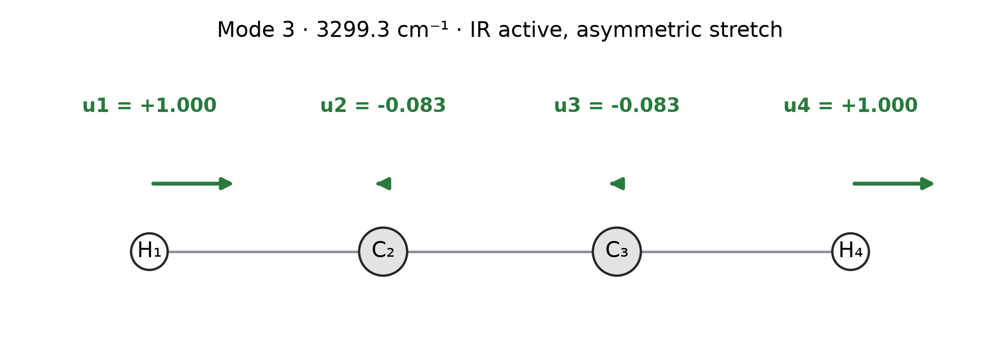

## Completed reference notebooks

- [Q2 · Direct methods and triangular solves](https://tiangroup-uofa.github.io/mate374-cmpt-methods-mate/completed-notebooks/8f7c2e91/a3_q2_linear_systems_completed.html)
- [Q3 · Least-squares fit to nutrition labels](https://tiangroup-uofa.github.io/mate374-cmpt-methods-mate/completed-notebooks/8f7c2e91/a3_q3_food_energy_completed.html)
- [Q4 · Acetylene vibrational modes](https://tiangroup-uofa.github.io/mate374-cmpt-methods-mate/completed-notebooks/8f7c2e91/a3_q4_acetylene_completed.html)

## Problem 1 · Short answers — 20 marks

**1.1** When the atoms can move freely, translating the whole chain stretches no spring and produces no restoring force. If $\mathbf K\mathbf u=\mathbf f$ has one solution $\mathbf u$, adding the same displacement to every atom gives another, so the system has infinitely many possible $\mathbf u$. The stiffness matrix $\mathbf K$ therefore must be singular.

**1.2** **The statement is false.** Even when $\mathbf A$ is well-conditioned, round-off error can still occur during a direct solution.

**1.3** No. A matrix with many zero entries, such as a banded matrix, needs far fewer operations because many of the steps in dense elimination would only operate on zeros. Taking advantage of this requires a specialized solver for banded or sparse matrices.

**1.4** We both agree and disagree with the student. **Agree:** if $\mathbf A^{-1}$ is already given, calculating $\mathbf x=\mathbf A^{-1}\mathbf b$ for each new right-hand side is equivalent to reusing the LU factors. **Disagree:** computing the inverse in the first place is costly and numerically less stable, especially for very large matrices. When $\mathbf A$ has many zero entries, a direct solve can exploit its special structure, such as a narrow band, and is typically much cheaper. The inverse of such a matrix is usually dense, so that structure is lost. In general, we do not recommend computing the inverse for large systems. LU factorization is the more mature and safer route.

## Problem 2 · Direct methods — 20 marks

### 2.1 Gaussian elimination with partial pivoting

The initial augmented matrix is

$$
\left[\begin{array}{rrrr|r}
0&2&1&-1&-3/2\\
4&2&0&2&7\\
2&1&3&1&11/2\\
0&4&0&2&1
\end{array}\right].
$$

Swap $R_1\leftrightarrow R_2$. The first nonzero multiplier is $m_{31}=1/2$. Apply $R_3\leftarrow R_3-\tfrac12R_1$:

$$
\left[\begin{array}{rrrr|r}
4&2&0&2&7\\
0&2&1&-1&-3/2\\
0&0&3&0&2\\
0&4&0&2&1
\end{array}\right].
$$

The following route applies largest-magnitude pivoting at every stage. In column 2, the largest available entry is 4. Swap the current $R_2\leftrightarrow R_4$, then use $m_{42}=1/2$ and $R_4\leftarrow R_4-\tfrac12R_2$:

$$
\left[\begin{array}{rrrr|r}
4&2&0&2&7\\
0&4&0&2&1\\
0&0&3&0&2\\
0&0&1&-2&-2
\end{array}\right].
$$

The third pivot is already the largest available entry. With $m_{43}=1/3$, apply $R_4\leftarrow R_4-\tfrac13R_3$:

$$
\left[\begin{array}{rrrr|r}
4&2&0&2&7\\
0&4&0&2&1\\
0&0&3&0&2\\
0&0&0&-2&-8/3
\end{array}\right].
$$

Backward substitution gives

$$
\begin{aligned}
x_4&=\frac{-8/3}{-2}=\frac43,\\
x_3&=\frac23,\\
x_2&=\frac{1-2x_4}{4}=-\frac5{12},\\
x_1&=\frac{7-2x_2-2x_4}{4}=\frac{31}{24}.
\end{aligned}
$$

Thus

$$
\boxed{\mathbf x=(1.292,-0.417,0.667,1.333)^{\mathsf T}}
$$

to three decimal places. Substitution of the exact fractions gives zero residual. Substitution of the rounded vector gives $(0,0,0.001,-0.002)^{\mathsf T}$, up to floating-point noise.

For this particular problem, performing the $R_2\leftrightarrow R_4$ swap of partial pivoting or not does not affect the accuracy of the solution.

### 2.2 LU factorization

**(a)** Multiplication gives

$$
\mathbf L\mathbf U=
\begin{bmatrix}
4&2&-2\\
2&1+3&-1+1\\
-2&-1+3&1+1+2
\end{bmatrix}
=\begin{bmatrix}4&2&-2\\2&4&0\\-2&2&4\end{bmatrix}=\mathbf A.
$$

**(b)** For $\mathbf b_1=(5.5,4,-2)^{\mathsf T}$, forward substitution solves

$$
\mathbf L\mathbf y_1=\mathbf b_1:\qquad
\begin{bmatrix}1&0&0\\0.5&1&0\\-0.5&1&1\end{bmatrix}
\begin{bmatrix}y_{1,1}\\y_{1,2}\\y_{1,3}\end{bmatrix}
=\begin{bmatrix}5.5\\4\\-2\end{bmatrix}.
$$

Here the first subscript labels the right-hand side and the second labels the component. Working from the top row down,

$$
\begin{aligned}
y_{1,1}&=5.5,\\
y_{1,2}&=4-0.5(5.5)=1.25,\\
y_{1,3}&=-2+0.5(5.5)-1.25=-0.5.
\end{aligned}
$$

Backward substitution then solves

$$
\mathbf U\mathbf x_1=\mathbf y_1:\qquad
\begin{bmatrix}4&2&-2\\0&3&1\\0&0&2\end{bmatrix}
\begin{bmatrix}x_{1,1}\\x_{1,2}\\x_{1,3}\end{bmatrix}
=\begin{bmatrix}5.5\\1.25\\-0.5\end{bmatrix},
$$

working from the bottom row up:

$$
\begin{aligned}
x_{1,3}&=\frac{-0.5}{2}=-0.25,\\
x_{1,2}&=\frac{1.25-(-0.25)}3=0.5,\\
x_{1,1}&=\frac{5.5-2(0.5)+2(-0.25)}4=1.
\end{aligned}
$$

Therefore $\mathbf y_1=(5.5,1.25,-0.5)^{\mathsf T}$ and $\mathbf x_1=(1,0.5,-0.25)^{\mathsf T}$. Direct multiplication gives $\mathbf A\mathbf x_1=(5.5,4,-2)^{\mathsf T}=\mathbf b_1$.

**(c)** For $\mathbf b_2=(-1,4,6.5)^{\mathsf T}$, forward substitution solves

$$
\mathbf L\mathbf y_2=\mathbf b_2:\qquad
\begin{bmatrix}1&0&0\\0.5&1&0\\-0.5&1&1\end{bmatrix}
\begin{bmatrix}y_{2,1}\\y_{2,2}\\y_{2,3}\end{bmatrix}
=\begin{bmatrix}-1\\4\\6.5\end{bmatrix},
$$

giving

$$
\begin{aligned}
y_{2,1}&=-1,\\
y_{2,2}&=4-0.5(-1)=4.5,\\
y_{2,3}&=6.5+0.5(-1)-4.5=1.5.
\end{aligned}
$$

Backward substitution then solves

$$
\mathbf U\mathbf x_2=\mathbf y_2:\qquad
\begin{bmatrix}4&2&-2\\0&3&1\\0&0&2\end{bmatrix}
\begin{bmatrix}x_{2,1}\\x_{2,2}\\x_{2,3}\end{bmatrix}
=\begin{bmatrix}-1\\4.5\\1.5\end{bmatrix},
$$

giving

$$
\begin{aligned}
x_{2,3}&=\frac{1.5}{2}=0.75,\\
x_{2,2}&=\frac{4.5-0.75}3=1.25,\\
x_{2,1}&=\frac{-1-2(1.25)+2(0.75)}4=-0.5.
\end{aligned}
$$

Thus $\mathbf y_2=(-1,4.5,1.5)^{\mathsf T}$, $\mathbf x_2=(-0.5,1.25,0.75)^{\mathsf T}$, and $\mathbf A\mathbf x_2=(-1,4,6.5)^{\mathsf T}=\mathbf b_2$.

`scipy.linalg.solve_triangular` can be used to solve the lower- and upper-triangular systems in (b) and (c).

**(d)** For 1,000 different right-hand-side vectors $\mathbf b$, each full Gaussian elimination costs $\tfrac23n^3$ for the elimination plus about $2n^2$ for updating $\mathbf b$ and backward substitution. Reusing LU costs $\tfrac23n^3$ once, plus $2n^2$ for the forward and backward substitutions of each $\mathbf b$. The totals are

$$
\begin{aligned}
C_{\mathrm{repeated}}&\approx1000\left(\tfrac23n^3+2n^2\right)\approx667n^3+2000n^2,\\
C_{\mathrm{reuse}}&\approx\tfrac23n^3+1000(2n^2)\approx0.67n^3+2000n^2.
\end{aligned}
$$

Plugging in three matrix sizes gives:

| $n$ | $C_{\mathrm{repeated}}$ | $C_{\mathrm{reuse}}$ | $C_{\mathrm{repeated}}/C_{\mathrm{reuse}}$ |
|--:|--:|--:|--:|
| 10 | $8.7\times10^{5}$ | $2.0\times10^{5}$ | 4.3 |
| 100 | $6.9\times10^{8}$ | $2.1\times10^{7}$ | 33 |
| 1000 | $6.7\times10^{11}$ | $2.7\times10^{9}$ | 251 |

The substitution work is the same in both routes, but repeated elimination performs the cubic work 1,000 times instead of once. Reusing LU is more efficient, and its advantage grows with $n$.

## Problem 3 · Food energy — 30 marks

### 3.1 Solving three labels

The supplied panel gives:

| Label | Fat (g) | Protein (g) | Total carbohydrate (g) | Energy (kcal) |
|:--|--:|--:|--:|--:|
| 1 | 30.0 | 3.6 | 51.6 | 490 |
| 2 | 0 | 8 | 15 | 90 |
| 3 | 0.5 | 1 | 3 | 20 |
| Held out | 23 | 3 | 15 | 270 |

For each label, use the nutrient amounts and energy from the same reported basis. Labels 1–3 give

$$
\begin{aligned}
30.0c_f+3.6c_p+51.6c_c&=490,\\
8c_p+15c_c&=90,\\
0.5c_f+c_p+3c_c&=20.
\end{aligned}
$$

Thus

$$
\boxed{\mathbf A_3=\begin{bmatrix}30.0&3.6&51.6\\0&8&15\\0.5&1&3\end{bmatrix},\quad
\mathbf C=\begin{bmatrix}c_f\\c_p\\c_c\end{bmatrix},\quad
\mathbf E_3=\begin{bmatrix}490\\90\\20\end{bmatrix}.}
$$

Entries of $\mathbf A_3$ are in g, coefficients in kcal/g, and entries of $\mathbf E_3$ in kcal, all on the corresponding label's basis.

The second and third equations give

$$
c_p=11.25-1.875c_c,\qquad c_f=17.5-2.25c_c.
$$

Substitution into the first equation gives $565.5-22.65c_c=490$, so $c_c=75.5/22.65=10/3$. Therefore

$$
\boxed{\mathbf C_3=(10.000,\ 5.000,\ 3.333)^{\mathsf T}\ \mathrm{kcal/g}.}
$$

Using the unrounded coefficients $(10,5,10/3)^{\mathsf T}$ reproduces all three printed energies exactly. The matrix has determinant 90.6 and rank 3, so the solution is unique. Its 2-norm condition number is approximately 426.189, indicating sensitivity to small changes in the label data.

A condensed version of the demo calculation, without its comments and boilerplate code, looks like this:

```python
import numpy as np

A_first_three = np.array([[30.0, 3.6, 51.6],
                          [0.0, 8.0, 15.0],
                          [0.5, 1.0, 3.0]])
E_first_three = np.array([490.0, 90.0, 20.0])
a_held_out, e_held_out = np.array([23.0, 3.0, 15.0]), 270.0

C_first_three = np.linalg.solve(A_first_three, E_first_three)
e_prediction_first_three = a_held_out @ C_first_three
abs_error_first_three = abs(e_prediction_first_three - e_held_out)
rel_error_first_three = abs_error_first_three / e_held_out
print(C_first_three, A_first_three @ C_first_three - E_first_three)
print(e_prediction_first_three, abs_error_first_three, rel_error_first_three)
```

The outputs are:

- Coefficients: **(10, 5, 3.333) kcal/g**
- Residuals: **0** to floating-point precision
- Held-out prediction: **295.000 kcal**
- Absolute error: **25.000 kcal**
- Relative error: **0.0926** (9.26%)

### 3.2 Predicting the held-out label

Using the unrounded coefficients,

$$
E_{\mathrm{held\ out,predicted}}=23(10)+3(5)+15\left(\frac{10}{3}\right)
=230+15+50=\boxed{295.000\ \mathrm{kcal}}.
$$

The printed energy is 270 kcal, so

$$
\Delta E_{\mathrm{held\ out}}=|295-270|=\boxed{25.000\ \mathrm{kcal}}.
$$

The relative error is $25/270\times100\%=9.26\%$. This large error means that the coefficients obtained by solving exactly three equations are not enough, because:

1. The printed energies are rounded to the nearest 5 or 10 kcal ([Canadian Food Inspection Agency](https://inspection.canada.ca/en/food-labels/labelling/industry/nutrition-labelling/nutrition-facts-table)).
2. Producers may calculate the nutrient compositions differently.
3. The held-out label is rich in fat, so overestimating the fat coefficient dominates the error.

### 3.3 Adding more data

The dimensions are $\mathbf A:n\times3$, $\mathbf C:3\times1$, and $\mathbf E:n\times1$. `np.linalg.solve` requires a square coefficient matrix, so it cannot solve this rectangular system directly.

### 3.4 Least squares

The fitted coefficients depend on your own photographs. A snippet for the least-squares calculation is:

```python
C_fit, residuals, rank, singular_values = np.linalg.lstsq(A_total, E_total, rcond=None)
e_prediction_fit = a_held_out @ C_fit
abs_error_fit = abs(e_prediction_fit - e_held_out)
rel_error_fit = abs_error_fit / e_held_out
```

Here `A_total` and `E_total` stack all fitting rows. Setting `rcond=None` ensures that NumPy uses its default cutoff for treating tiny singular values as zero, which is machine precision times the larger matrix dimension.

The reference notebook adds five instructor labels to labels 1–3:

| Label | Fat (g) | Protein (g) | Total carbohydrate (g) | Energy (kcal) |
|:--|--:|--:|--:|--:|
| 4 | 0.5 | 0 | 2 | 15 |
| 5 | 11 | 5 | 33 | 250 |
| 6 | 45 | 25 | 19 | 580 |
| 7 | 0.7 | 0 | 26.1 | 115 |
| 8 | 30 | 6 | 64 | 550 |

With all eight labels, the fit gives:

- Fitted coefficients: **(8.987, 3.933, 4.016) kcal/g**
- Largest residual magnitude: **3.90 kcal**
- Held-out label:
  - Prediction: **278.734 kcal**
  - Absolute error: **8.734 kcal** (down from 25.000 kcal)
  - Relative error: **3.23%** (down from 9.26%)

Our result is very close to the 9–4–4 rule, the Atwater factors used by the UN Food and Agriculture Organization ([FAO 2003, §3.5.1](https://www.fao.org/4/y5022e/y5022e00.htm)). Both the nutrient grams and the total energies on the labels are rounded, and the energies in our fit differ by orders of magnitude, from 15 to 580 kcal. Getting such a result is remarkable. In fact, what you just did can be called a quick machine-learning demo!

## Problem 4 · Acetylene stretching vibrations — 30 marks

### 4.1 Eigenvalues

An eigenvalue satisfies $\mathbf D\mathbf u=\lambda\mathbf u$ for a nonzero vector $\mathbf u$. Comparing this with $\mathbf D\mathbf u=\omega^2\mathbf u$ identifies $\lambda=\omega^2$. Each eigenvector gives the relative atomic displacements of a normal mode.

### 4.2 Eigensolver

An example of the matrix in Python, using `k_CH`, `k_CC`, `m_H`, and `m_C`, is:

```python
D = np.array([
    [k_CH / m_H, -k_CH / m_H, 0, 0],
    [-k_CH / m_C, (k_CH + k_CC) / m_C, -k_CC / m_C, 0],
    [0, -k_CC / m_C, (k_CC + k_CH) / m_C, -k_CH / m_C],
    [0, 0, -k_CH / m_H, k_CH / m_H],
])
```

With $k_{\mathrm{CH}}=592\ \mathrm{N/m}$, $k_{\mathrm{CC}}=1580\ \mathrm{N/m}$, $m_{\mathrm H}=1\ \mathrm{a.u.}$, and $m_{\mathrm C}=12\ \mathrm{a.u.}$, its values are

$$
\mathbf D=
\begin{bmatrix}
592&-592&0&0\\
-49.333&181&-131.667&0\\
0&-131.667&181&-49.333\\
0&0&-592&592
\end{bmatrix}\quad\mathrm{N/(m\,a.u.)}.
$$

The demo then calls `np.linalg.eig`:

```python
eigenvalues_complex, eigenvectors_complex = np.linalg.eig(D)
```

`np.linalg.eig` returns the eigenvalues in no particular order and stores each eigenvector as a column of `eigenvectors_complex`. The demo keeps the real parts, sorts the modes from the smallest eigenvalue to the largest, and scales each eigenvector so that its largest component is 1 and $u_1$ is positive. The eigenvalues and angular frequencies are:

| Mode | $\omega^2$ ($\mathrm{N/(m\,a.u.)}$) | $\omega$ ($[\mathrm{N/(m\,a.u.)}]^{1/2}$) |
|:--|--:|--:|
| 1 | 0.000000 | 0.000000 |
| 2 | 231.625130 | 15.219236 |
| 3 | 641.333333 | 25.324560 |
| 4 | 673.041537 | 25.943044 |

The eigenvectors are dimensionless relative amplitudes. In order, $u_1,u_2,u_3,u_4$ belong to H$_1$, C$_2$, C$_3$, and H$_4$:

| Mode | $u_1$ | $u_2$ | $u_3$ | $u_4$ | Arrow directions |
|:--|--:|--:|--:|--:|:--|
| 1 | 1 | 1 | 1 | 1 | $\rightarrow\ \rightarrow\ \rightarrow\ \rightarrow$ |
| 2 | 1 | 0.608741 | $-0.608741$ | $-1$ | $\rightarrow\ \rightarrow\ \leftarrow\ \leftarrow$ |
| 3 | 1 | $-1/12$ | $-1/12$ | 1 | $\rightarrow\ \leftarrow\ \leftarrow\ \rightarrow$ |
| 4 | 1 | $-0.136894$ | 0.136894 | $-1$ | $\rightarrow\ \leftarrow\ \rightarrow\ \leftarrow$ |

### 4.3 Wavenumbers

The conversion block to add in the demo is:

```python
wavenumbers_cm = omega_model / (2 * np.pi * 1.2216313e-3)
```

The resulting wavenumbers and motions are:

| Mode | $\nu$ ($\mathrm{cm^{-1}}$) | Atomic motion | IR active |
|:--|--:|:--|:--|
| 1 | 0.000 | Rigid translation | No |
| 2 | 1982.772 | Symmetric C$\equiv$C stretch | No |
| 3 | 3299.301 | Asymmetric C–H stretch | Yes |
| 4 | 3379.877 | Symmetric C–H stretch | No |

Mode 1 is rigid translation: all four atoms have equal displacements, so no spring length changes. Every row of $\mathbf D$ sums to zero, giving $\mathbf D\mathbf1=\mathbf0$.

### 4.4 Infrared spectrum

**Mode 3**, at $3299.301\ \mathrm{cm^{-1}}$, explains the stretching band near $3258\ \mathrm{cm^{-1}}$. Our notebook identifies it as the only IR-active mode.

{width="80%"}

A vibration absorbs infrared light only when it changes the net dipole moment of the molecule. Each C–H bond carries a small dipole, and in linear acetylene the two bond dipoles point in opposite directions and cancel. In a symmetric stretch, both C–H bonds change length by the same amount, so their dipoles still cancel and the net dipole stays zero. In the asymmetric stretch, one C–H bond contracts while the other extends, so the two dipoles no longer cancel and the molecule develops an oscillating net dipole that couples to infrared light.

### 4.5 Additional peaks

The current model misses a few points:

1. The atoms should be able to move in all three directions, so bending and wiggling motions are also valid vibrations. In fact, the strongest band, near $730\ \mathrm{cm^{-1}}$, may be explained by bending motion.
2. In chemical spectroscopy, the number of degrees of freedom determines how many vibrational modes a molecule has. A linear molecule with $N$ atoms has $3N-5$ vibrational modes, so C$_2$H$_2$ has $3(4)-5=7$.
