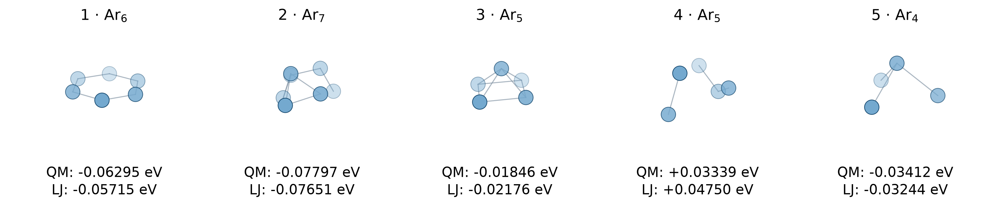
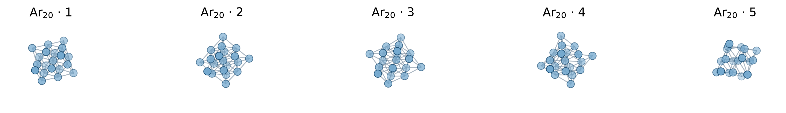

**Due:** Wednesday, October 7, 2026, at 12:00 pm (noon) via Canvas

::: {.content-visible when-format="html"}
[Download the PDF handout](index.pdf)
:::

Submit **one PDF answering all three problems** (100 marks), including calculations, requested code snippets, plots, and concise explanations. Keep your full Python scripts; do not submit them.


## Problem 1 · Short answers — 20 marks

Keep your answers concise. Don't overthink! If you use AI to answer these questions, clearly state which model you used.


1. **Closed-domain methods**: For a continuous function $f(x)$, consider two neighboring sampled points $(x_i,f(x_i))$ and $(x_{i+1},f(x_{i+1}))$. How can you tell whether they bracket a root of $f(x)=0$? Can the same two function values tell you whether they bracket a maximum or minimum?

```{=latex}
\vspace{1em}
```

2. **Fixed-point iteration**: For a fixed-point iteration written as $x_{n+1}=g(x_n)$, what condition near the fixed point $x_s$ determines whether the iteration converges? Since the fixed point is not known beforehand, how could you check this condition in practice?

```{=latex}
\vspace{1em}
```

3. **Interpolation**: With $N$ data points at distinct $x$ values, Lagrange interpolation gives a single polynomial directly, without solving for its coefficients through a large system of equations. In contrast, piecewise cubic interpolation introduces $4(N-1)$ coefficients. Why is the piecewise approach still usually preferred when $N$ is large?

```{=latex}
\vspace{1em}
```

4. **Curve fitting**: After fitting a curve to your experimental data, the total squared residual $E=\sum_i\left[y_i-\hat f(x_i)\right]^2$ is a very small number, for example $10^{-5}$ in the chosen units. However, a plot of the data and the fitted function $\hat f(x)$ shows poor agreement. What is one possible reason? (Hint: consider the magnitude of the measured $y_i$ values.)

```{=latex}
\newpage
```

## Problem 2 · Fixed-point iteration for a binary alloy — 30 marks

::: {.content-visible when-format="pdf"}
```{=latex}
\begin{wrapfigure}{r}{0.45\linewidth}
  \centering
  \includegraphics[width=\linewidth]{../../assets/A02-miscibility-gap.png}
\end{wrapfigure}
```
:::

::: {.content-visible when-format="html"}
{width="45%" fig-align="right"}
:::

A binary alloy can separate into two phases with different compositions when mixing is energetically unfavorable. We describe this behavior using a symmetric regular-solution model. Here, $x$ is the atomic fraction of A in the A–B alloy ($0<x<1$). When a miscibility gap exists, the two equilibrium phase compositions are $x_{\alpha}$ and $x_{\beta}$, with $x_{\alpha}=1-x_{\beta}$. They are the outer roots of the following equation:

$$
F(x)=\ln\frac{x}{1-x}+H(1-2x)=0.
$$

Here, $H$ is a dimensionless parameter measuring the energetic penalty for mixing A and B relative to the thermal contribution. Treat $H$ as constant while solving $F(x)=0$; its value changes between the cases below. Use the [A2 Q2 interactive demo](https://tiangroup-uofa.github.io/mate374-cmpt-methods-mate/wasm-local/a2_q2_miscibility.html) to check your rearrangement and carry out the numerical updates.

### 2.1 Central root

Show that $x=0.5$ is always a root of $F(x)=0$, regardless of $H$.

### 2.2 Fixed-point form

Rearrange $F(x)=0$ into $x=g(x)$, treating $H$ as a constant. Write down your expression and enter it as `g(x)` (using the global parameter `H`) in the demo's Q2.2 cell, replacing `...`. Use the plot immediately below the cell to check whether $y=g(x)$ and $y=x$ intersect at $x=0.5$.


### 2.3 Additional roots

Move the slider in the demo's Q2.3 section to compare the following cases:

1. Set $H=1.5$. Do the curves $y=g(x)$ and $y=x$ intersect for $x\in(0.5,1.0)$?
2. Set $H=2.5$. Do the curves $y=g(x)$ and $y=x$ intersect for $x\in(0.5,1.0)$?

Physically, $H>2.0$ is the condition for two additional roots to appear, corresponding to the miscibility-gap region.


### 2.4 Fixed-point solution

For $H=2.5$, find the upper root $x_{\beta}$ ($x_{\beta}\in(0.5,1.0)$) using fixed-point iteration, starting from $x_0=0.9$. Stop when $|x_{n+1}-x_n|<10^{-4}$. Report the number of updates, the final value of $x_{\beta}$ to **five significant digits**, and the residual $F(x_{\beta})$. The demo's Q2.4 calculator performs one update at a time. Record each iterate and copy the next value into the input to continue. You may optionally complete the demo's `fixed_point` function to return the full sequence. If you write your own iteration code, include it in your submission.


::: {.content-visible when-format="html"}

### Q2 interactive demo {#q2-interactive-demo}

::: {.quarto-wasm-local notebook="a2_q2_miscibility.edit.py" view="edit" title="A2 Q2 · Your fixed-point map and one-update calculator" height="1180" loading="lazy" fullscreen="true"}
Enter your own fixed-point map in Q2.2, compare the plots in Q2.3, and use the one-update calculator in Q2.4 to record your iterates.
:::
:::


```{=latex}
\newpage
```


```{=latex}
\newpage
```

## Problem 3 · Fitting LJ parameters to quantum cluster energies — 50 marks

In the last question of Assignment 1, we calculated the total LJ energy of an atomic cluster by adding the energies of all unique pairs. We can use the same calculation to estimate the LJ parameters for an element when we know the energies of many clusters. Here, those energies come from quantum chemistry calculations using density functional theory (DFT), which we will cover later in the course.

An argon cluster $\mathrm{Ar}_k$ contains $k$ atoms at positions $(x_1,y_1,z_1),\ldots,(x_k,y_k,z_k)$. Each DFT calculation gives one total interaction energy relative to separated atoms. A calculation can take up to two hours on a single CPU, so obtaining these energy data is expensive!

The five structures below are examples from the fixed random order used in the demo. Their QM and LJ interaction energies are listed beneath each structure; the LJ values use the fit to all 100 training clusters. In 3.6, you will compare the full dataset in a parity plot.

{width="100%" fig-align="center"}

Label the different clusters by $c=1,\ldots,N$, and let $k_c$ be the number of atoms in cluster $c$. Within that cluster, $i$ and $j$ label atoms. Its LJ energy is

$$
E_c^{\mathrm{LJ}}(\varepsilon,\sigma)
=\sum_{i=1}^{k_c-1}\sum_{j=i+1}^{k_c}
4\varepsilon\left[\left(\frac{\sigma}{r_{c,ij}}\right)^{12}-\left(\frac{\sigma}{r_{c,ij}}\right)^6\right],
\qquad r_{c,ij}=\lVert\mathbf r_{c,i}-\mathbf r_{c,j}\rVert.
$$

Here, $\mathbf r_{c,i}$ is the position of atom $i$ in cluster $c$. We assume that $\varepsilon$ and $\sigma$ do not change with cluster size.

We have pre-calculated the DFT energies of 100 randomly generated Ar₃–Ar₇ clusters. Use the [A2 Q3 interactive demo](https://tiangroup-uofa.github.io/mate374-cmpt-methods-mate/wasm-local/a2_q3_lj_fit.html) to fit the LJ model to these data by nonlinear least squares.

### 3.1 Squared residual

For $N$ clusters, define

$$
E(\varepsilon,\sigma)=\sum_{c=1}^{N}\left[\frac{E_c^{\mathrm{QM}}}{k_c}-\frac{E_c^{\mathrm{LJ}}(\varepsilon,\sigma)}{k_c}\right]^2.
$$

In your own words, describe what the residual measures: what is the mismatch between the data and the predictions?^[Dividing each energy by the number of atoms puts clusters of different sizes on a per-atom basis, reducing the tendency of larger clusters to dominate the fit simply because their total energies are larger.] What are the unknowns we need to determine?

### 3.2 Implement the residual

`calculate_cluster_energy` and the loop over clusters are supplied. Complete `cluster_residual(sigma, epsilon, clusters)` to add each squared per-atom energy difference and return the scalar sum.

The function is checked on three synthetic clusters before fitting unlocks. Copy your working code into your answer report.

### 3.3 Fit ten clusters

Read `fit_LJ` and briefly describe its `minimize` call. Set the dataset-size slider to **10 clusters**. Record $\varepsilon$, $\sigma$, and the **mean absolute energy error per atom** (MAE):

$$
\mathrm{MAE}=\frac{1}{N}\sum_{c=1}^{N}\left|\frac{E_c^{\mathrm{LJ}}-E_c^{\mathrm{QM}}}{k_c}\right|.
$$

The demo reports this error in meV/atom, where $1\ \mathrm{meV}=10^{-3}\ \mathrm{eV}$.

### 3.4 Increase the dataset

Repeat Q3.3 using **20, 40, 60, 80, and 100 clusters**. Write down the fitted parameters and MAE per atom for all six dataset sizes. Do the parameters become approximately stable as more clusters are included?

### 3.5 Extrapolation to larger clusters

Can parameters fitted to Ar₃–Ar₇ describe larger clusters? These five Ar₂₀ structures were held out from fitting:

{width="100%" fig-align="center"}

In Q3.5, enter your fitted $\varepsilon$ and $\sigma$ from Q3.4 and state the dataset size. Record mean absolute **total-energy** (eV/cluster) and **per-atom** (meV/atom) errors for these five clusters. Compare the per-atom error with your Q3.4 MAE. What do you observe?

### 3.6 Parity plot

A **parity plot** places each cluster's QM total energy on the horizontal axis and LJ total energy on the vertical axis. Perfect agreement lies on $y=x$.

Complete the marked loop to collect and return one QM and LJ total energy per cluster. Use the parameters from Q3.5 for the 100 training clusters and five Ar₂₀ test clusters. Copy your working code and plot into your report. Compare both groups with the diagonal. With the 100-cluster fit, training predictions should lie close to $y=x$, while the Ar₂₀ points fall below it, as in the example.

{width="80%" fig-align="center"}

::: {.content-visible when-format="html"}

### Q3 interactive demo {#q3-interactive-demo}

::: {.quarto-wasm-local notebook="a2_q3_lj_fit.edit.py" view="edit" title="A2 Q3 · Fit LJ parameters to quantum cluster energies" height="1250" loading="lazy" fullscreen="true"}
Complete the residual and parity-plot loops, compare fits at different dataset sizes, and test your chosen parameters on five larger clusters.
:::
:::
