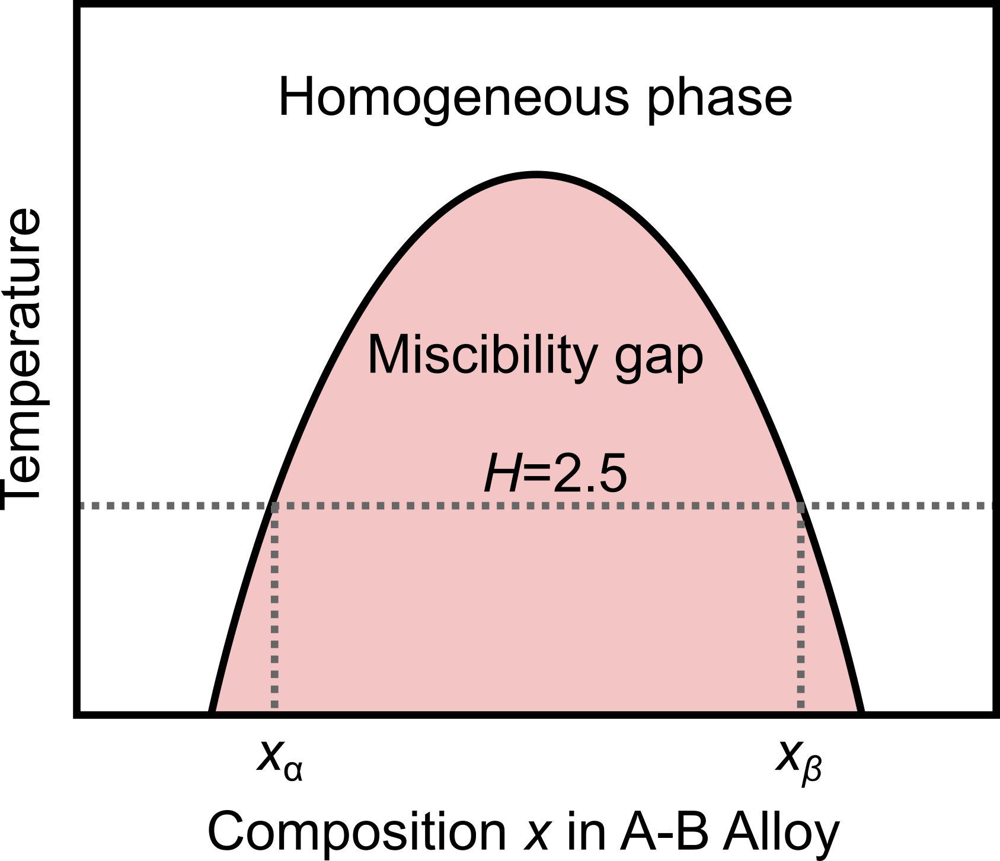

**Due:** Wednesday, October 7, 2026, at 12:00 pm (noon) via Canvas

::: {.content-visible when-format="html"}
[Download the PDF handout](index.pdf)
:::

Submit **one PDF answering all four problems** (100 marks), including calculations, requested code snippets, plots, and concise explanations. Keep your full Python scripts; do not submit them.


## Problem 1 · Short answers — 20 marks

Keep your answers concise. Don't overthink! If you use AI to answer these questions, clearly state which model you used.


1. **Closed-domain methods**: For a continuous function $f(x)$, consider two neighboring sampled points $(x_i,f(x_i))$ and $(x_{i+1},f(x_{i+1}))$. How can you tell whether they bracket a root? Can the same two function values tell you whether they bracket a maximum or minimum?

```{=latex}
\vspace{1em}
```

2. **Fixed-point iteration**: For a fixed-point iteration written as $x_{n+1}=g(x_n)$, what condition near the fixed point $x_s$ determines whether the iteration converges? Since the fixed point is not known beforehand, how could you check this condition in practice?

```{=latex}
\vspace{1em}
```

3. **Interpolation**: With $N$ data points at distinct $x$ values, Lagrange interpolation gives a single polynomial directly, without solving for its coefficients through a large system of equations. In contrast, piecewise cubic interpolation introduces $4(N-1)$ coefficients. Why is the piecewise approach still usually preferred when $N$ is large?

```{=latex}
\vspace{1em}
```

4. **Curve fitting**: After fitting a curve to your experimental data, the total squared residual $E=\sum_i\left[y_i-\hat f(x_i)\right]^2$ is a very small number, for example $10^{-5}$ in the chosen units. However, a plot of the data and the fitted function $\hat f(x)$ shows poor agreement. What is one possible reason? (Hint: consider the magnitude of the measured $y_i$ values.)

```{=latex}
\newpage
```

## Problem 2 · Fixed-point iteration for a binary alloy — 30 marks

::: {.content-visible when-format="pdf"}
```{=latex}
\begin{wrapfigure}{r}{0.45\linewidth}
  \centering
  \includegraphics[width=\linewidth]{../../assets/A02-miscibility-gap.png}
\end{wrapfigure}
```
:::

::: {.content-visible when-format="html"}
{width="45%" fig-align="right"}
:::

A binary alloy can separate into two phases with different compositions when mixing is energetically unfavorable. We describe this behavior using a symmetric regular-solution model. Here, $x$ is the atomic fraction of A in the A–B alloy ($0<x<1$). When a miscibility gap exists, the two equilibrium phase compositions are $x_{\alpha}$ and $x_{\beta}$, with $x_{\alpha}=1-x_{\beta}$. They are the outer roots of the following equation:

$$
F(x)=\ln\frac{x}{1-x}+H(1-2x)=0.
$$

Here, $H$ is a dimensionless parameter measuring the energetic penalty for mixing A and B relative to the thermal contribution. Use the [A2 Q2 interactive demo](https://tiangroup-uofa.github.io/mate374-cmpt-methods-mate/wasm-local/a2_q2_miscibility.html) to check your rearrangement and carry out the numerical updates.

### 2.1 Central root

Show that $x=0.5$ is always a root of $F(x)=0$, regardless of $H$.

### 2.2 Fixed-point form

Rearrange $F(x)=0$ into $x=g(x;H)$, treating $H$ as a constant. Write down your expression and enter it as `g(x)` (using the global parameter `H`) in the demo's Q2.2 cell, replacing `...`. Use the plot immediately below the cell to check whether $y=g(x;H)$ and $y=x$ intersect at $x=0.5$.


### 2.3 Additional roots

Move the slider in the demo's Q2.3 section to compare the following cases:

1. Set $H=1.5$. Do the curves $y=g(x;H)$ and $y=x$ intersect for $x\in(0.5,1.0)$?
2. Set $H=2.5$. Do the curves $y=g(x;H)$ and $y=x$ intersect for $x\in(0.5,1.0)$?

Physically, $H>2.0$ is the condition for two additional roots to appear, corresponding to the miscibility-gap region.


### 2.4 Fixed-point solution

For $H=2.5$, find the upper root $x_{\beta}$ ($x_{\beta}\in(0.5,1.0)$) using fixed-point iteration, starting from $x_0=0.9$. Stop when $|x_{n+1}-x_n|<10^{-4}$. Report the number of updates, the final value of $x_{\beta}$ to **five significant digits**, and the residual $F(x_{\beta})$. The demo's Q2.4 calculator performs one update at a time. Record each iterate and copy the next value into the input to continue. You may optionally complete the demo's `fixed_point` function to return the full sequence. If you write your own iteration code, include it in your submission.


::: {.content-visible when-format="html"}

### Q2 interactive demo {#q2-interactive-demo}

::: {.quarto-wasm-local notebook="a2_q2_miscibility.edit.py" view="edit" title="A2 Q2 · Your fixed-point map and one-update calculator" height="1180" loading="lazy" fullscreen="true"}
Enter your own fixed-point map in Q2.2, compare the plots in Q2.3, and use the one-update calculator in Q2.4 to record your iterates.
:::
:::


```{=latex}
\newpage
```

## Problem 3 · Fitting an atomistic energy curve — 20 marks

In Assignment 1, we used the Lennard-Jones pair potential

$$
V(r;\varepsilon,\sigma)=4\varepsilon\left[\left(\frac{\sigma}{r}\right)^{12}-\left(\frac{\sigma}{r}\right)^6\right].
$$

How can we use sampled energies to determine $\varepsilon$ and $\sigma$? The following eight points were generated from the argon model, with small added noise. Use the [A2 Q3 interactive demo](https://tiangroup-uofa.github.io/mate374-cmpt-methods-mate/wasm-local/a2_q3_lj_estimation.html) to compare estimates from interpolation with a least-squares fit.

::: {.small}
| $r$ (Å) | 3.20 | 3.35 | 3.50 | 3.65 | 4.00 | 4.40 | 5.00 | 6.00 |
|:---|---:|---:|---:|---:|---:|---:|---:|---:|
| $V(r)$ ($10^{-3}$ eV) | 26.084565 | 4.126033 | −5.477196 | −9.421694 | −9.608200 | −6.943821 | −3.610619 | −1.348986 |
:::

The reference values $\varepsilon_{\mathrm{ref}}=0.0103$ eV and $\sigma_{\mathrm{ref}}=3.40$ Å will be used to check your answers.

The demo includes the data in eV and the LJ function from Assignment 1, so your focus is on interpolation and fitting.

### 3.1 Estimates from interpolation

An interpolated curve lets us estimate the zero crossing and minimum between sampled distances. The demo offers three methods: natural cubic spline, shape-preserving cubic (PCHIP), and piecewise linear interpolation. The plot updates when you change the method.

The function `estimate_by_interpolation(method)` is a scaffold. We provide the code that selects the method and creates `f_interp(r)`. Change only the code below the marked line to complete these tasks:

1. Find the zero-crossing distance $r_0$ in $[3.35,3.50]$ Å using `root_scalar`.
2. Find the minimum-energy distance $r_m$ in $[3.50,4.40]$ Å using `minimize_scalar`, and evaluate $V_m=\texttt{f\_interp}(r_m)$.
3. Return the three scalar values `(r_zero, r_min, V_min)` in that order.

The function initially returns zeros. Once your values pass the checks, the demo converts them into parameter estimates using the A1 relations:

$$
\sigma_{\text{root}}=r_0,\qquad
\sigma_{\text{min}}=\frac{r_m}{2^{1/6}},\qquad
\varepsilon_{\text{min}}=-V_m.
$$

Copy your working code for `estimate_by_interpolation` into your answer report, including the results from all three interpolation methods. Which estimates are closest to the reference values?

### 3.2 Least-squares fitting

We can also determine $\varepsilon$ and $\sigma$ by fitting the LJ function to all eight energies. Complete the scaffold `squared_residual(sigma, epsilon)`. The arrays `r_data` and `V_data` are already defined outside the function. Use `lj(r, epsilon, sigma)` to calculate the model energies at these distances and return the total squared residual as **one scalar**:

$$
E(\varepsilon,\sigma)=\sum_{i=1}^{8}\left[V_i-V(r_i;\varepsilon,\sigma)\right]^2.
$$

Once your objective passes the checks, the demo runs the supplied `minimize` call and displays the fitted parameters and a comparison plot.

Copy your working code for `squared_residual` into your answer report, including the fitted $\varepsilon$ and $\sigma$. Compare them with the reference values and your interpolation estimates.

::: {.content-visible when-format="html"}

### Q3 interactive demo {#q3-interactive-demo}

::: {.quarto-wasm-local notebook="a2_q3_lj_estimation.edit.py" view="edit" title="A2 Q3 · Interpolation estimates and least-squares fitting" height="1180" loading="lazy" fullscreen="true"}
Complete the interpolation-estimation and scalar-objective functions to compare the two methods.
:::
:::

```{=latex}
\newpage
```

## Problem 4 · Fitting LJ parameters to quantum cluster energies — 30 marks

In the last question of Assignment 1, we calculated the total LJ energy of an atomic cluster by adding the energies of all unique pairs. We can use the same calculation to estimate the LJ parameters for an element when we know the energies of many clusters. Here, those energies come from quantum chemistry calculations using density functional theory (DFT), which we will cover later in the course.

An argon cluster $\mathrm{Ar}_k$ contains $k$ atoms at positions $(x_1,y_1,z_1),\ldots,(x_k,y_k,z_k)$. Each DFT calculation gives one total interaction energy relative to separated atoms. A calculation can take up to two hours on a single CPU, so obtaining these energy data is expensive!

Label the different clusters by $c=1,\ldots,N$, and let $k_c$ be the number of atoms in cluster $c$. Within that cluster, $i$ and $j$ label atoms. Its LJ energy is

$$
E_c^{\mathrm{LJ}}(\varepsilon,\sigma)
=\sum_{i=1}^{k_c-1}\sum_{j=i+1}^{k_c}
4\varepsilon\left[\left(\frac{\sigma}{r_{c,ij}}\right)^{12}-\left(\frac{\sigma}{r_{c,ij}}\right)^6\right],
\qquad r_{c,ij}=\lVert\mathbf r_{c,i}-\mathbf r_{c,j}\rVert.
$$

Here, $\mathbf r_{c,i}$ is the position of atom $i$ in cluster $c$. We assume that $\varepsilon$ and $\sigma$ do not change with cluster size.

We have pre-calculated the DFT energies of 100 randomly generated Ar₃–Ar₇ clusters. Use the [A2 Q4 interactive demo](https://tiangroup-uofa.github.io/mate374-cmpt-methods-mate/wasm-local/a2_q4_lj_fit.html) to fit the LJ model to these data by nonlinear least squares.

### 4.1 Squared residual

For $N$ clusters, define

$$
E(\varepsilon,\sigma)=\sum_{c=1}^{N}\left[\frac{E_c^{\mathrm{QM}}}{k_c}-\frac{E_c^{\mathrm{LJ}}(\varepsilon,\sigma)}{k_c}\right]^2.
$$

In your own words, describe what the residual measures: what is the mismatch between the data and the predictions?^[Dividing each energy by the number of atoms puts clusters of different sizes on a per-atom basis, reducing the tendency of larger clusters to dominate the fit simply because their total energies are larger.] What are the unknowns we need to determine?

### 4.2 Implement the residual

The function `calculate_cluster_energy` is already implemented using the Assignment 1 answer. Your task is to complete the scaffold `cluster_residual(sigma, epsilon, clusters)`. The scaffold includes the loop over clusters and extracts each cluster's coordinates, QM energy, and number of atoms. Complete the marked part to add up the squared per-atom energy differences and return one scalar.

Your function is checked on three synthetic clusters with arbitrary coordinates and dummy reference energies, separate from the DFT dataset. Passing these checks unlocks the fitting calculation.

Copy your working code for `cluster_residual` into your answer report.

### 4.3 Fit ten clusters

Read the supplied `fit_LJ` function and briefly describe what its `minimize` call does. Set the dataset-size slider to **10 clusters**.

Record the fitted $\varepsilon$ and $\sigma$ and the **mean absolute energy error per atom** (MAE):

$$
\mathrm{MAE}=\frac{1}{N}\sum_{c=1}^{N}\left|\frac{E_c^{\mathrm{LJ}}-E_c^{\mathrm{QM}}}{k_c}\right|.
$$

The demo reports this error in meV/atom, where $1\ \mathrm{meV}=10^{-3}\ \mathrm{eV}$.

### 4.4 Increase the dataset

Repeat Q4.3 using **20, 40, 60, 80, and 100 clusters**. Write down the fitted parameters and MAE per atom for all six dataset sizes. Do the parameters become approximately stable as more clusters are included?

### 4.5 Extrapolation to larger clusters

Can the parameters fitted to Ar₃–Ar₇ describe larger clusters? In the demo's Q4.5 section, enter your chosen best-fit $\varepsilon$ and $\sigma$ from Q4.4 and state which dataset size you used. The demo evaluates five Ar₂₀ clusters that were excluded from fitting, testing extrapolation beyond the fitted cluster sizes.

Record the mean absolute **total-energy difference** in eV/cluster and the mean absolute **per-atom energy difference** in meV/atom across these five clusters. Compare the per-atom error with the corresponding value from Q4.4. What do you observe?

### 4.6 Parity plot

A **parity plot** compares reference and predicted values: each point represents a cluster, with $E^{\mathrm{QM}}$ on the horizontal axis and $E^{\mathrm{LJ}}$ on the vertical axis. Perfect agreement lies on the diagonal $y=x$.

Complete the marked part inside the scaffold's `for` loop to collect the QM and LJ total energies. The demo then plots all 100 Ar₃–Ar₇ clusters and the five Ar₂₀ clusters with different markers, using the parameters you entered in Q4.5.

Copy your working code for `parity_energies` and the plot into your answer report. Compare how the two groups lie relative to the diagonal. Do you see a systematic difference between predictions for the smaller clusters and the extrapolated Ar₂₀ clusters?

::: {.content-visible when-format="html"}

### Q4 interactive demo {#q4-interactive-demo}

::: {.quarto-wasm-local notebook="a2_q4_lj_fit.edit.py" view="edit" title="A2 Q4 · Fit LJ parameters to quantum cluster energies" height="1250" loading="lazy" fullscreen="true"}
Complete the residual and parity-plot loops, compare fits at different dataset sizes, and test your chosen parameters on five larger clusters.
:::
:::
