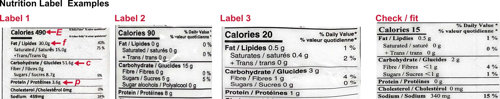
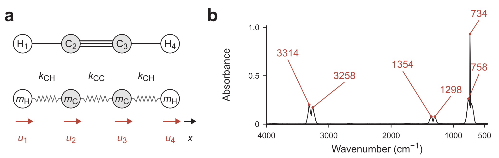

**Released:** Wednesday, October 7, 2026\
**Due:** Wednesday, October 21, 2026, at 12:00 pm (noon) via Canvas

::: {.content-visible when-format="html"}
[Download the PDF handout](index.pdf)
:::

Submit **one PDF answering all four problems**. You may use [https://marimo.app](https://marimo.app) or your local Python environment for short calculations, and our provided demos for Q3 and Q4.

## Problem 1 · Short answers — 20 marks

Keep your answers concise. If you use AI to help with these questions, clearly state which model you used.

1. **A free atomic chain** (Lectures [11](https://tiangroup-uofa.github.io/mate374-cmpt-methods-mate/units/03/L11/index.html) and [12](https://tiangroup-uofa.github.io/mate374-cmpt-methods-mate/units/03/L12/index.html)). Consider $N$ atoms arranged in a line, with each neighboring pair connected by a spring with positive spring constant $k$. All atoms can move freely in space. Without writing the stiffness matrix $\mathbf K$, explain why this matrix **must be singular**. **Hint:** How many solutions can $\mathbf K\mathbf x=\mathbf f$ have?

```{=latex}
\vspace{1em}
```

2. **Conditioning and round-off** (Lectures [12](https://tiangroup-uofa.github.io/mate374-cmpt-methods-mate/units/03/L12/index.html) and [13](https://tiangroup-uofa.github.io/mate374-cmpt-methods-mate/units/03/L13/index.html)). A square matrix $\mathbf{A}$ has condition number $\kappa(\mathbf A)\approx10$, so it is well-conditioned. A student concludes: “Round-off error cannot be a problem when solving $\mathbf A\mathbf x=\mathbf b$, regardless of the solution method.” Is this statement true? Briefly explain your reasoning.

```{=latex}
\vspace{1em}
```

3. **The cost of elimination** ([Lecture 13](https://tiangroup-uofa.github.io/mate374-cmpt-methods-mate/units/03/L13/index.html)). For a dense $n\times n$ matrix, Gaussian elimination takes approximately $\tfrac23n^3$ mathematical operations in the elimination stage. Must every matrix require this much work? **Hint:** Consider a **banded matrix**, whose nonzero entries lie only near its diagonal.

```{=latex}
\vspace{1em}
```

4. **Reusing a matrix factorization** ([Lecture 13](https://tiangroup-uofa.github.io/mate374-cmpt-methods-mate/units/03/L13/index.html)). In Lecture 13, we learned that after factoring $\mathbf A=\mathbf L\mathbf U$, we can reuse the factors to solve $\mathbf L\mathbf y=\mathbf b$ and then $\mathbf U\mathbf x=\mathbf y$ for each new right-hand side. A student argues: “If we already know $\mathbf A^{-1}$, we can just calculate $\mathbf x=\mathbf A^{-1}\mathbf b$. So reusing $\mathbf A^{-1}$ is enough.” To what extent do you agree? Briefly compare the mathematical validity of this approach with its computational and numerical merits.

```{=latex}
\newpage
```

## Problem 2 · Manual workout of direct methods — 20 marks

### 2.1 Gaussian elimination with partial pivoting

Solve $\mathbf A\mathbf x=\mathbf b$ by hand, where

$$
\mathbf A=
\begin{bmatrix}
0&2&1&-1\\
4&2&0&2\\
2&1&3&1\\
0&4&0&2
\end{bmatrix},\qquad
\mathbf b=\begin{bmatrix}-1.5\\7.0\\5.5\\1.0\end{bmatrix}.
$$

At each stage, use partial pivoting: choose the remaining entry of largest absolute value in the pivot column and swap its row into the pivot position.

Record your solution steps, including intermediate matrices. Report $\mathbf x$, either as exact fractions or as numbers to three decimal places. You may use `np.linalg.solve` in the [Q2 notebook](https://tiangroup-uofa.github.io/mate374-cmpt-methods-mate/wasm-local/a3_q2_linear_systems.html) to verify your result.

### 2.2 LU factorization in a nutshell

Read the [LU factorization section of Lecture 13](https://tiangroup-uofa.github.io/mate374-cmpt-methods-mate/units/03/L13/index.html#lu-factorization-reading-material). Writing $\mathbf A=\mathbf L\mathbf U$ lets us retain the elimination work on $\mathbf A$. For each new right-hand side, we solve $\mathbf L\mathbf y=\mathbf b$ by forward substitution and then $\mathbf U\mathbf x=\mathbf y$ by backward substitution.

For this problem, please use the $3\times{}3$ matrices shown below:

$$
\mathbf A=\begin{bmatrix}4&2&-2\\2&4&0\\-2&2&4\end{bmatrix},\quad
\mathbf L=\begin{bmatrix}1&0&0\\0.5&1&0\\-0.5&1&1\end{bmatrix},\quad
\mathbf U=\begin{bmatrix}4&2&-2\\0&3&1\\0&0&2\end{bmatrix}.
$$

Parts (a)–(c) may be done manually or with code.

(a) Verify that $\mathbf L\mathbf U=\mathbf A$ (manually or using Python).

(b) For $\mathbf b_1=(5.5,4, -2)^{\mathsf T}$, solve $\mathbf L\mathbf y_1=\mathbf b_1$ to get $\mathbf y_1$, and then $\mathbf U\mathbf x_1=\mathbf y_1$ to get $\mathbf x_1$. Record $\mathbf x_1$ and $\mathbf y_1$, and verify $\mathbf A\mathbf x_1=\mathbf b_1$.

(c) Repeat part (b) for $\mathbf b_2=(-1,4,6.5)^{\mathsf T}$.

(d) For a general dense $n\times n$ matrix, we estimate $\tfrac23n^3$ mathematical operations for Gaussian elimination or LU factorization and $n^2$ operations for each substitution (either forward or backward). Compare the total number of mathematical operations for solving **1,000 different right-hand-side vectors $\mathbf b$ with the same matrix** by:

- repeating the full Gaussian elimination for each right-hand-side vector $\mathbf b$;
- computing $\mathbf L$ and $\mathbf U$ once, and reusing them for all forward and backward substitutions.

Which approach is more efficient?

```{=latex}
\newpage
```

## Problem 3 · How much energy is in a gram of food? — 30 marks

A nutrition label reports energy $E$ per serving in **kcal** (often called “Calories”), together with the grams of **fat**, **protein**, and **total carbohydrate** in that serving. We approximate this energy by

$$
E=c_f f+c_p p+c_c c,
$$

where $f$, $p$, and $c$ are the masses of fat, protein, and total carbohydrate in grams, respectively. The unknown coefficients $c_f$, $c_p$, and $c_c$ have units of kcal/g. The four supplied Canadian nutrition-label photographs below were taken from the instructor's household. Use the first three to determine an initial model and check that prediction against the fourth. In the least-squares fit, all four supplied labels are training data; hold out the highest-energy label among your additional photographs for the final test. Parts 3.3 and 3.4 can be done using our [Q3 demo](https://tiangroup-uofa.github.io/mate374-cmpt-methods-mate/wasm-local/a3_q3_food_energy.html).

{width=100% fig-alt="Four instructor-supplied labels. Labels 1–3 determine the initial fit: label 1 has 30.0 g fat, 3.6 g protein, 51.6 g carbohydrate, 490 kcal; label 2 has 0 g fat, 8 g protein, 15 g carbohydrate, 90 kcal; label 3 has 0.5 g fat, 1 g protein, 3 g carbohydrate, 20 kcal. The fourth label has 0.5 g fat, 0 g protein, 2 g carbohydrate, 15 kcal. It first checks the initial prediction and is included in the later least-squares fit."}

**3.1 Solving three labels.** With three unknown coefficients, three independent equations give a unique solution. Use products 1–3 in the figure to solve for $\mathbf C=(c_f,c_p,c_c)^{\mathsf T}$. First write down the equations. For example, label 1 gives

$$
30.0c_f+3.6c_p+51.6c_c=490.
$$

Write the equations for labels 2 and 3 and convert the system to matrix form $\mathbf A\mathbf C=\mathbf E$. Solve it by hand or with Python, and report $\mathbf C$ in kcal/g to three decimal places.

**3.2 Checking the initial model.** Use $\mathbf C$ from 3.1 to predict the energy of the fourth supplied label. Report the absolute error $|E_{\mathrm{predicted}}-E_{\mathrm{label}}|$ in kcal and the relative error $|E_{\mathrm{predicted}}-E_{\mathrm{label}}|/E_{\mathrm{label}}$ as a percentage. Does the prediction reproduce the printed energy?

**3.3 Adding more data.** With $n$ labels ($n>3$), $\mathbf A\mathbf C=\mathbf E$ still describes the system of equations. What are the dimensions of $\mathbf A$, $\mathbf C$, and $\mathbf E$? Explain why `np.linalg.solve` cannot solve this rectangular system. A direct call will raise a `LinAlgError`.

**3.4 Least squares.** Take pictures of **3–5 additional nutrition labels** from your kitchen or a supermarket shelf (*no purchase is required*). If obtaining photographs is difficult, ask the instructor for an alternative label set. Enter them in the table. The notebook uses least squares (`np.linalg.lstsq`) to find the best-fitting $\mathbf C=(c_f,c_p,c_c)^{\mathsf T}$ using all four supplied labels and all but the highest-energy one of your additional labels. The highest-energy additional label is held out to test the fit. Report:

- the new $\mathbf A$ and $\mathbf E$ used for the fit (food photographs need not be submitted);
- the three fitted coefficients $(c_f,c_p,c_c)$ in kcal/g to three decimal places;
- the absolute prediction error $|E_{\mathrm{predicted}}-E_{\mathrm{label}}|$ in kcal for the highest-energy additional label;
- the relative prediction error $|E_{\mathrm{predicted}}-E_{\mathrm{label}}|/E_{\mathrm{label}}$ for that label, as a percentage.

:::: {.content-visible when-format="html"}
::: {.quarto-wasm-local notebook="a3_q3_food_energy.edit.py" view="edit" title="A3 Q3 · Enter nutrition labels, fit coefficients, and test a held-out label" height="1100" loading="lazy" fullscreen="true"}
The [Q3 notebook](https://tiangroup-uofa.github.io/mate374-cmpt-methods-mate/wasm-local/a3_q3_food_energy.html) first solves the system from labels 1–3. For least squares, it includes all four supplied labels and holds out the highest-energy additional label.
:::
::::

```{=latex}
\newpage
```

## Problem 4 · Stretching vibrations of H–C$\equiv$C–H — 30 marks

Acetylene ($\mathrm{C_2H_2}$), an important industrial chemical, can be represented by a chain of four masses linked by three springs. Both ends are free, and the atoms move along the molecular axis with displacement vector $\mathbf u=(u_1,u_2,u_3,u_4)^{\mathsf T}$. The figure compares this model with the measured gas-phase infrared spectrum.^[IR data: [NIST Chemistry WebBook](https://webbook.nist.gov/cgi/cbook.cgi?ID=C74862&Units=SI&Mask=880), Sadtler Research Labs [@nistacetylene].]

Use $k_{\mathrm{CH}}=592\ \mathrm{N/m}$, $k_{\mathrm{CC}}=1580\ \mathrm{N/m}$, $m_{\mathrm H}=1\ \mathrm{a.u.}$, and $m_{\mathrm C}=12\ \mathrm{a.u.}$, with a.u. denoting the atomic mass unit. The [Q4 demo](https://tiangroup-uofa.github.io/mate374-cmpt-methods-mate/wasm-local/a3_q4_acetylene.html) calculates the modes and displays their atomic motions.

{width=100% fig-alt="Left: H1–C2 triple-bond C3–H4 and four free masses joined by CH, CC, and CH springs, with positive displacements to the right. Right: measured IR absorbance, with labelled peaks at 3258, 3314, 1298, 1354, 734, and 758 inverse centimetres."}

At room temperature, the atoms vibrate about their equilibrium positions, changing the bond lengths. A **normal mode** has a fixed pattern of relative atomic displacements and an angular frequency $\omega$. Newton's law gives

$$
\mathbf D\mathbf u=\omega^2\mathbf u,\qquad
\mathbf D=\begin{bmatrix}
\frac{k_{\mathrm{CH}}}{m_{\mathrm H}}&-\frac{k_{\mathrm{CH}}}{m_{\mathrm H}}&0&0\\
-\frac{k_{\mathrm{CH}}}{m_{\mathrm C}}&\frac{k_{\mathrm{CH}}+k_{\mathrm{CC}}}{m_{\mathrm C}}&-\frac{k_{\mathrm{CC}}}{m_{\mathrm C}}&0\\
0&-\frac{k_{\mathrm{CC}}}{m_{\mathrm C}}&\frac{k_{\mathrm{CH}}+k_{\mathrm{CC}}}{m_{\mathrm C}}&-\frac{k_{\mathrm{CH}}}{m_{\mathrm C}}\\
0&0&-\frac{k_{\mathrm{CH}}}{m_{\mathrm H}}&\frac{k_{\mathrm{CH}}}{m_{\mathrm H}}
\end{bmatrix}.
$$

**4.1 Eigenvalues.** Explain why $\omega^2$ is an eigenvalue of $\mathbf D$.

**4.2 Eigensolver.** Write out $\mathbf D$ using the spring constants and masses above directly. Use `np.linalg.eig` to obtain **all four** eigenvalues $\omega^2$ and their corresponding vectors $\mathbf u$. The eigenvalues have units $\mathrm{N/(m\,a.u.)}$, and their square roots have units $[\mathrm{N/(m\,a.u.)}]^{1/2}$. The eigenvectors give relative atomic displacements.

**4.3 Wavenumbers.** Spectroscopy commonly reports molecular vibrations as wavenumbers $\nu$. Convert each numerical angular frequency $\omega$ from 4.2 using

$$
\nu=\frac{\omega}{2\pi\,(1.2216313\times10^{-3})}\quad(\mathrm{cm^{-1}}).
$$

where $\omega$ uses the unit $[\mathrm{N/(m\,a.u.)}]^{1/2}$. Larger wavenumbers correspond to larger angular frequencies. Report all four wavenumbers and describe their corresponding atomic motions.

**4.4 Infrared spectrum.** Which calculated mode explains the measured stretching band with a peak near $3258\ \mathrm{cm^{-1}}$? Identify its wavenumber and atomic motion. **Hint:** The demo shows the symmetry of each mode and whether it is IR-active (i.e. if it will appear in IR spectrum).

**4.5 Additional peaks.** The measured spectrum contains other bands that the axial model cannot reproduce. How would you modify the bead-and-spring model to give acetylene more vibrational modes? **Hint:** Can atoms move in directions other than along the molecular axis?

:::: {.content-visible when-format="html"}
::: {.quarto-wasm-local notebook="a3_q4_acetylene.edit.py" view="edit" title="A3 Q4 · Eigenvalues, wavenumbers, and atomic motions" height="1100" loading="lazy" fullscreen="true"}
The [Q4 notebook](https://tiangroup-uofa.github.io/mate374-cmpt-methods-mate/wasm-local/a3_q4_acetylene.html) calculates the four modes and displays their atomic motions, symmetry, and IR activity.
:::
::::
