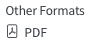

::: {.callout-note}
## Purpose of this page

This page welcomes you to MATE 374 and introduces the course website and its interactive materials. For official dates, assessments, policies, accommodations, and support information, refer to the [course syllabus](../syllabus/index.qmd). Course announcements and assignment submissions will be handled through Canvas.
:::

## Land acknowledgement

The University of Alberta acknowledges that we are located on Treaty 6 territory, and respects the histories, languages, and cultures of First Nations, Métis, Inuit, and all First Peoples of Canada, whose presence continues to enrich our vibrant community.

## Welcome to MATE 374

Welcome to MATE 374. You and I will learn together this semester through in-class lectures, mathematical foundations, and interactive code demonstrations that enrich your understanding of the numerical and computational techniques used in materials engineering.

### The instructor's philosophy

- **Equations as executable explanations.** Most equations in engineering and science become easier to explain when they are translated into computer programs.
- **This is not a Python-for-engineering course.** We use Python because it is an accessible, student-friendly language for both general-purpose and scientific computing. Python is our entry point, not the learning objective.
- **Do not be intimidated by programming.** Many activities provide the computation for you through interactive controls. Start by dragging a slider, changing an input, and observing what happens.

::: {.callout-tip}
## Equations → code → interaction

Whenever practical, I will connect an equation to code and then to an interactive or visual explanation. You will be able to change inputs and see what the mathematics predicts rather than treating the equation as a static expression to memorize.
:::

## How to use the course website

1. **Open a printable PDF.** Select the following link in the right-hand column of a lecture page. Canvas will also include links to the lecture PDFs.

   {width=95px fig-alt="The Other Formats menu showing the PDF link"}

2. **Switch between reading and class views.** Select the following button in the lower-right corner of the page. The presentation-screen icon switches to **class view**, which removes most navigation and enlarges the lesson content. In class view, the icon changes to a book; select it to return to **reading view**.

   {width=57px fig-alt="The yellow class-view button showing a presentation screen"}

3. **Try the browser-based code.** Most lectures include small marimo notebooks that run directly in your browser.[^marimo] They require no local Python installation. Depending on the activity, you can hide or reveal the code, change an input, and see dependent results update automatically. Interactive controls such as sliders, text boxes, and buttons let you explore the calculation without first writing the full program.

[^marimo]: For more background and a comparison with common Jupyter workflows, see marimo's official announcement, [*Introducing marimo*](https://marimo.io/blog/introducing-marimo), and Marie-Hélène Burle's 2025 SFU Research Computing/WestDRI tutorial, [*The next generation of Python notebooks*](https://mint.westdri.ca/tools/wb_marimo).

## Try your first browser notebook

Enter your name and move the entirely unofficial GPA slider. The result should update automatically.

Use **Edit code** above the notebook to reveal the Python cells. Select **App view** to hide the cells and return to the interactive display. You can also click inside the notebook and press <kbd>⌘.</kbd> on macOS or <kbd>Ctrl+.</kbd> on Windows or Linux to switch views.

::: {.quarto-wasm-local notebook="welcome_mate374.edit.py" title="Welcome to MATE 374: browser-notebook check" height="620" loading="eager"}
**Printable fallback.** In the browser version, enter a preferred name and move the unofficial GPA slider. The greeting should update immediately. The GPA control is only a joke and has no connection to assessment.
:::

## Continue to Lecture 1

If the greeting changed when you used the controls, your browser is ready for the first activity. Continue to [L01 · A numerical mindset for materials engineers](../units/01/L01/index.qmd), where we will introduce mathematical modeling, numerical methods, and computational materials simulation.
