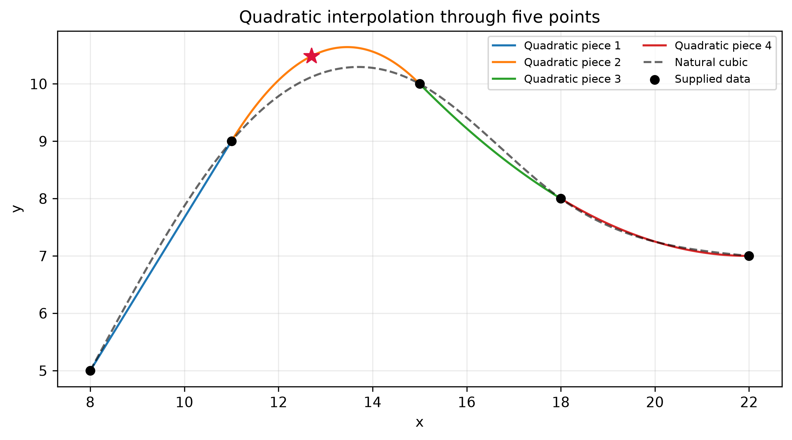
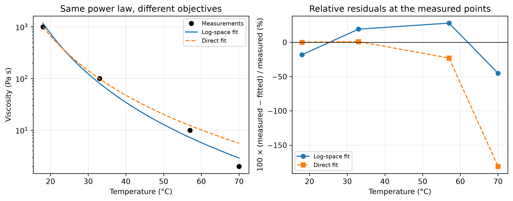

## Learning outcomes

By the end of this seminar, you should be able to:

1. **Formulate** a quadratic spline as a system of endpoint, slope-matching, and boundary equations.
2. **Calculate** spline coefficients and interpolated values in Python, checking the conditions that define the spline.
3. **Fit** a power-law viscosity model using linearized and direct nonlinear least squares.
4. **Compare** the two fits using residuals in viscosity and logarithmic units.

## Today's calculations

In [L08](../../units/02/L08/index.qmd), we required a curve to pass through each supplied point. In [L09](../../units/02/L09/index.qmd), we chose coefficients that minimized an overall mismatch. Today we will turn both kinds of conditions into calculations you can type and run.


## Example 1. A quadratic spline through five points

::: {.callout-note}
## Exam preparation

Exam questions may follow this format more closely than the assignments. You should understand how the interpolation conditions determine the equations. Memorizing a hand-solution procedure for the full system is not required.
:::

Estimate $y$ at $x=12.7$ from the following table:

| $x$ | 8 | 11 | 15 | 18 | 22 |
|---|---:|---:|---:|---:|---:|
| $y$ | 5 | 9 | 10 | 8 | 7 |

Use piecewise quadratic interpolation $\hat f(x)$ for the data. You need to construct quadratic pieces with matching first derivatives at the interior data points. **Set the second derivative at the first point to zero:** $\hat f_1''(8)=0$.

### Count the unknowns

The five points define four intervals. On interval $i$, choose

$$
\hat f_i(x)=a_i x^2+b_i x+c_i.
$$

The overall interpolating function $\hat f$ contains four pieces:

| Piece | Interval | Unknown coefficients |
|---|---|---|
| $\hat f_1$ | $8\le x\le11$ | $a_1,b_1,c_1$ |
| $\hat f_2$ | $11\le x\le15$ | $a_2,b_2,c_2$ |
| $\hat f_3$ | $15\le x\le18$ | $a_3,b_3,c_3$ |
| $\hat f_4$ | $18\le x\le22$ | $a_4,b_4,c_4$ |

There are **five known data pairs**. Each quadratic piece has three unknown coefficients, giving **twelve unknowns** in total.


**Before calculating:** which piece will you use at $x=12.7$? How many equations do twelve unknown coefficients need? Can we solve that specific piece alone?

::: {.callout-note collapse="true"}
## Piece selection and required equations

Use $\hat f_2$ because $11<12.7<15$. Twelve unknown coefficients require twelve independent equations. The second piece's endpoint values alone give only two equations for three coefficients. Its slope conditions connect it to neighbouring pieces, so those conditions must also be used.
:::

### Eight endpoint equations

Each piece must pass through both ends of its own interval. For the first piece,

$$
\hat f_1(8)=5,\quad \hat f_1(11)=9
\quad\Longrightarrow\quad
\begin{cases}
64a_1+8b_1+c_1=5,\\
121a_1+11b_1+c_1=9.
\end{cases}
$$

**Your turn:** write the two equations for $\hat f_2$, then complete the equations for $\hat f_3$ and $\hat f_4$. The second piece uses $x=11$ and $x=15$.

::: {.callout-note collapse="true"}
## All eight endpoint equations

$$
\begin{aligned}
64a_1+8b_1+c_1&=5, &121a_1+11b_1+c_1&=9,\\
121a_2+11b_2+c_2&=9, &225a_2+15b_2+c_2&=10,\\
225a_3+15b_3+c_3&=10, &324a_3+18b_3+c_3&=8,\\
324a_4+18b_4+c_4&=8, &484a_4+22b_4+c_4&=7.
\end{aligned}
$$

At an interior point, two different polynomials must reach the same supplied value. For example, $\hat f_1(11)=9$ and $\hat f_2(11)=9$ constrain different coefficients, so both equations are needed.
:::

### Three slope equations and one boundary equation

The derivative of piece $i$ is

$$
\hat f_i'(x)=2a_i x+b_i.
$$

Matching the slopes at the three interior points gives

$$
\begin{aligned}
\hat f_1'(11)=\hat f_2'(11)&\quad\Rightarrow\quad22a_1+b_1-22a_2-b_2=0,\\
\hat f_2'(15)=\hat f_3'(15)&\quad\Rightarrow\quad30a_2+b_2-30a_3-b_3=0,\\
\hat f_3'(18)=\hat f_4'(18)&\quad\Rightarrow\quad36a_3+b_3-36a_4-b_4=0.
\end{aligned}
$$

We now have eleven equations. Our chosen boundary condition supplies the twelfth:

$$
\hat f_1''(8)=2a_1=0\quad\Longrightarrow\quad\boxed{a_1=0.}
$$


### The complete matrix

Put the unknowns in a fixed order:

$$
\mathbf c=[a_1,b_1,c_1,\ a_2,b_2,c_2,\ a_3,b_3,c_3,\ a_4,b_4,c_4]^{\mathsf T}.
$$

The superscript $\mathsf T$ turns this row into a column. Collecting the coefficients of each equation gives $A\mathbf c=\mathbf d$:

$$
{\small
\left[\begin{array}{rrr|rrr|rrr|rrr}
64&8&1&0&0&0&0&0&0&0&0&0\\
121&11&1&0&0&0&0&0&0&0&0&0\\
0&0&0&121&11&1&0&0&0&0&0&0\\
0&0&0&225&15&1&0&0&0&0&0&0\\
0&0&0&0&0&0&225&15&1&0&0&0\\
0&0&0&0&0&0&324&18&1&0&0&0\\
0&0&0&0&0&0&0&0&0&324&18&1\\
0&0&0&0&0&0&0&0&0&484&22&1\\ \hline
22&1&0&-22&-1&0&0&0&0&0&0&0\\
0&0&0&30&1&0&-30&-1&0&0&0&0\\
0&0&0&0&0&0&36&1&0&-36&-1&0\\ \hline
2&0&0&0&0&0&0&0&0&0&0&0
\end{array}\right]
\mathbf c=
\begin{bmatrix}5\\9\\9\\10\\10\\8\\8\\7\\0\\0\\0\\0\end{bmatrix}.
}
$$

Each group of three columns belongs to one polynomial. The first eight rows impose endpoint values, the next three match slopes, and the last imposes the boundary condition.

### Type the system into Python

We will study methods for solving systems of equations in Unit 3. Gaussian elimination could solve these twelve equations by hand. Today, [`np.linalg.solve`](https://numpy.org/doc/stable/reference/generated/numpy.linalg.solve.html) handles the arithmetic once we supply the matrix and right-hand side.

In the notebook, enter the following matrix in the `A` cell. Commas separate entries in a row, and square brackets enclose each row. Keep the column order consistent with $\mathbf c$.

```{.python code-fold="false"}
# Columns: a1, b1, c1, a2, b2, c2, a3, b3, c3, a4, b4, c4
A = np.array([
    [64, 8, 1,   0, 0, 0,     0, 0, 0,     0, 0, 0],
    [121, 11, 1, 0, 0, 0,     0, 0, 0,     0, 0, 0],
    [0, 0, 0,    121, 11, 1,  0, 0, 0,     0, 0, 0],
    [0, 0, 0,    225, 15, 1,  0, 0, 0,     0, 0, 0],
    [0, 0, 0,    0, 0, 0,     225, 15, 1,  0, 0, 0],
    [0, 0, 0,    0, 0, 0,     324, 18, 1,  0, 0, 0],
    [0, 0, 0,    0, 0, 0,     0, 0, 0,     324, 18, 1],
    [0, 0, 0,    0, 0, 0,     0, 0, 0,     484, 22, 1],
    [22, 1, 0,   -22, -1, 0,  0, 0, 0,     0, 0, 0],
    [0, 0, 0,    30, 1, 0,    -30, -1, 0,  0, 0, 0],
    [0, 0, 0,    0, 0, 0,     36, 1, 0,    -36, -1, 0],
    [2, 0, 0,    0, 0, 0,     0, 0, 0,     0, 0, 0],
], dtype=float)
```

The supplied data cell defines `x` and `y`. Enter the right-hand side in its own cell:

```{.python code-fold="false"}
rhs = np.array([y[0], y[1], y[1], y[2], y[2], y[3], y[3], y[4], 0, 0, 0, 0])
```

Now type the solve and print the result:

```{.python code-fold="false"}
coefficients = np.linalg.solve(A, rhs)
pieces = coefficients.reshape(4, 3)
print(pieces)
print("Largest equation residual:", np.max(np.abs(A @ coefficients - rhs)))
```

`reshape(4, 3)` arranges the twelve coefficients into four rows, one $[a_i,b_i,c_i]$ row per piece. The `@` operator performs matrix multiplication, so `A @ coefficients - rhs` checks the twelve equations we entered. This check should be close to zero, with small differences from floating-point arithmetic.

::: {.quarto-wasm-local notebook="s04_quadratic_spline.edit.py" view="edit" title="Enter and solve the twelve quadratic-spline equations" height="1000" loading="lazy" fullscreen="true"}
{fig-alt="Four coloured quadratic pieces through five points, with a straight first piece and a dashed natural cubic curve. A star marks the quadratic estimate at x equals 12.7."}

**Offline calculation.** Use the code blocks on this page with `import numpy as np`, `from scipy.interpolate import CubicSpline`, and the tabulated data stored as arrays `x` and `y`. The worked coefficients and interpolation value follow.
:::


### Evaluate the correct piece

Since $11<12.7<15$, use $\hat f_2$. Python counts rows from zero, so its coefficients are in `pieces[1]`. [`np.polyval`](https://numpy.org/doc/stable/reference/generated/numpy.polyval.html) evaluates coefficients ordered from the highest power to the constant:

```{.python code-fold="false"}
x_new = 12.7
piece_index = 1
estimate = np.polyval(pieces[piece_index], x_new)
print(f"f_hat_{piece_index + 1}({x_new:g}) = {estimate:.8f}")
```

**Your turn:** change the evaluation cell to calculate $y$ at $x=20$. Change both `x_new` and `piece_index`. Then evaluate at $x=15$ using each of its two neighbouring pieces. Do the values agree?

::: {.callout-note collapse="true"}
## Worked coefficients and interpolation values

The pieces are

$$
\begin{aligned}
\hat f_1(x)&=\tfrac43x-\tfrac{17}{3}, &&8\le x\le11,\\
\hat f_2(x)&=-\tfrac{13}{48}x^2+\tfrac{175}{24}x-\tfrac{615}{16}, &&11\le x\le15,\\
\hat f_3(x)&=\tfrac1{18}x^2-\tfrac52x+35, &&15\le x\le18,\\
\hat f_4(x)&=\tfrac1{16}x^2-\tfrac{11}{4}x+\tfrac{149}{4}, &&18\le x\le22.
\end{aligned}
$$

The corresponding coefficient rows, rounded for display, are

```text
[[ 0.          1.33333333 -5.66666667]
 [-0.27083333  7.29166667 -38.43750000]
 [ 0.05555556 -2.50000000 35.00000000]
 [ 0.06250000 -2.75000000 37.25000000]]
```

A computed $a_1$ of order $10^{-16}$ is numerical roundoff around zero. Using the unrounded coefficients gives

$$
\boxed{\hat f_2(12.7)=10.48395833\ldots,\qquad \hat f_4(20)=7.25.}
$$

Both $\hat f_2(15)$ and $\hat f_3(15)$ equal 10. Keep full precision in the code: substituting the rounded coefficients $-0.2708$, $7.2917$, and $-38.4375$ instead gives about 10.4898 at 12.7.
:::


### Compare with a SciPy spline

SciPy can construct a spline directly from the data. Enter this in the library-comparison cell:

```{.python code-fold="false"}
cubic = CubicSpline(x, y, bc_type="natural", extrapolate=False)
print(float(cubic(x_new)))
```

At `x_new = 12.7`, the natural cubic gives about **10.11890**. It uses cubic pieces, matches first and second derivatives at interior points, and sets the second derivative to zero at **both** ends. Our quadratic construction uses different conditions, so the two estimates need not agree. Both interpolate the supplied data.


## Example 2. Fit a power law to bitumen viscosity

A bitumen sample has the following viscosity data, a simplified version of the example in L09:

| Temperature, $T$ (°C) | 18 | 33 | 57 | 70 |
|---|---:|---:|---:|---:|
| Viscosity, $\mu$ (Pa·s) | 1000 | 100 | 10 | 2 |

Fit the empirical relation

$$
\mu=bT^m.
$$

Enter $T$ as the **Celsius temperature**, as specified in this exercise, and $\mu$ as the numerical viscosity in Pa·s. Use this empirical power law over the supplied positive-temperature range. Use linearization and least squares regression.

### Turn the power law into a straight line

Taking natural logarithms gives

$$
\ln\mu=\ln b+m\ln T.
$$

Define $X=\ln T$, $Y=\ln\mu$, and $\alpha=\ln b$. The transformed model is

$$
\boxed{\hat Y=\alpha+mX,\qquad b=e^\alpha.}
$$

The **known data** are four $X_i,Y_i$ pairs. The **unknown coefficients** are $\alpha$ and $m$. We choose them to minimize

$$
E_{\log}=(Y_1-\alpha-mX_1)^2+(Y_2-\alpha-mX_2)^2
+(Y_3-\alpha-mX_3)^2+(Y_4-\alpha-mX_4)^2.
$$


### Solve the linear least-squares fit manually

Use the four sums from L09, applied to the logarithms of the data:

$$
\begin{aligned}
S_x&=X_1+X_2+X_3+X_4, & S_y&=Y_1+Y_2+Y_3+Y_4,\\
S_{xx}&=X_1^2+X_2^2+X_3^2+X_4^2, & S_{xy}&=X_1Y_1+X_2Y_2+X_3Y_3+X_4Y_4.
\end{aligned}
$$

For $N=4$ measurements, the slope and intercept are

$$
m=\frac{NS_{xy}-S_xS_y}{NS_{xx}-S_x^2},\qquad
\alpha=\frac{S_y-mS_x}{N},\qquad b=e^\alpha.
$$

The notebook supplies `T` and `mu`. Its linear-fit cell evaluates these formulas:

```{.python code-fold="false"}
X = np.log(T)
Y = np.log(mu)
N = len(X)
Sx = np.sum(X)
Sy = np.sum(Y)
Sxx = np.sum(X**2)
Sxy = np.sum(X * Y)
m_log = (N * Sxy - Sx * Sy) / (N * Sxx - Sx**2)
alpha_log = (Sy - m_log * Sx) / N
b_log = np.exp(alpha_log)
log_parameters = np.array([alpha_log, m_log])
print("Sx, Sy, Sxx, Sxy:", Sx, Sy, Sxx, Sxy)
print("alpha, m, b:", alpha_log, m_log, b_log)
```

Here `np.sum` adds the four entries of an array. The two fitted coefficients are collected in `log_parameters` for the prediction and direct-fit cells below.

::: {.quarto-wasm-local notebook="s04_viscosity_fitting.edit.py" view="edit" title="Type linearized and direct least-squares fits for bitumen viscosity" height="1100" loading="lazy" fullscreen="true"}
{fig-alt="Viscosity on a logarithmic vertical axis versus Celsius temperature for both fits. A second panel shows that the direct fit has a large negative relative residual at 70 degrees Celsius."}

**Offline calculation.** The code blocks reproduce both fits with `import numpy as np`, `from scipy.optimize import curve_fit`, and the tabulated data stored as arrays `T` and `mu`. The parameter and residual tables below provide reference values.
:::

### Where is the square system of equations?

An exact straight-line fit would require

$$
\begin{aligned}
\alpha+m\ln18&=\ln1000,\\
\alpha+m\ln33&=\ln100,\\
\alpha+m\ln57&=\ln10,\\
\alpha+m\ln70&=\ln2.
\end{aligned}
$$

These are four equations for only two unknowns, $\alpha$ and $m$, so an exact fit is generally impossible. As in L09, setting the two derivatives of $E_{\log}$ to zero gives **two normal equations**:

$$
\begin{bmatrix}
4&X_1+X_2+X_3+X_4\\
X_1+X_2+X_3+X_4&X_1^2+X_2^2+X_3^2+X_4^2
\end{bmatrix}
\begin{bmatrix}\alpha\\m\end{bmatrix}
=
\begin{bmatrix}
Y_1+Y_2+Y_3+Y_4\\
X_1Y_1+X_2Y_2+X_3Y_3+X_4Y_4
\end{bmatrix}.
$$


### Fit the original viscosity values directly

The linearized calculation minimizes squared differences in **log viscosity**. We can instead ask for the smallest squared differences in **viscosity**:

$$
E_\mu=(\mu_1-\hat\mu_1)^2+(\mu_2-\hat\mu_2)^2
+(\mu_3-\hat\mu_3)^2+(\mu_4-\hat\mu_4)^2,
\qquad \hat\mu_i=bT_i^m.
$$

Enter the model in the function cell:

```{.python code-fold="false"}
def viscosity(T, alpha, m):
    return np.exp(alpha + m * np.log(T))
```

This is $bT^m$ written with $b=e^\alpha$, keeping $b$ positive and avoiding a very large coefficient in the numerical search. The function returns viscosity in Pa·s. Using $\alpha$ as a parameter does **not** take logarithms of the residuals.

Now enter the nonlinear fit:

```{.python code-fold="false"}
direct_parameters, covariance = curve_fit(
    viscosity, T, mu, p0=log_parameters, maxfev=10000
)
alpha_direct, m_direct = direct_parameters
b_direct = np.exp(alpha_direct)
print("alpha, m, b:", alpha_direct, m_direct, b_direct)
```

[`curve_fit`](https://docs.scipy.org/doc/scipy/reference/generated/scipy.optimize.curve_fit.html) iteratively adjusts the two parameters. `p0` supplies starting values from the log-space fit, and `maxfev` sets the allowed number of function evaluations. The returned `covariance` estimates local parameter uncertainty under the fitting assumptions. We will focus on the parameters and residuals here.

We still have four residuals and two unknown parameters. Because the predictions depend nonlinearly on the parameters, `curve_fit` adjusts them iteratively to minimize $E_\mu$.

### Calculate and compare the residuals

Use the sign convention from L09:

$$
r_i=\mu_i-\hat\mu_i.
$$

A positive residual means that the measured viscosity is above the fitted value. Enter the predictions and residuals in their cell:

```{.python code-fold="false"}
predicted_log = viscosity(T, *log_parameters)
predicted_direct = viscosity(T, *direct_parameters)
residual_log = mu - predicted_log
residual_direct = mu - predicted_direct
print(np.column_stack([T, mu, predicted_log, predicted_direct]))
print("Log-fit residuals (Pa s):", residual_log)
print("Direct-fit residuals (Pa s):", residual_direct)
print("Direct-fit relative residuals (%):", 100 * residual_direct / mu)
```

The `*` passes the two entries of a parameter array as the two arguments `alpha` and `m`. To compare the objectives, type the following in the error-measures cell:

```{.python code-fold="false"}
sse_log_fit = np.sum(residual_log**2)
sse_direct_fit = np.sum(residual_direct**2)
log_sse_log_fit = np.sum((np.log(mu) - np.log(predicted_log))**2)
log_sse_direct_fit = np.sum((np.log(mu) - np.log(predicted_direct))**2)
print("Viscosity SSE:", sse_log_fit, sse_direct_fit)
print("Viscosity RMSE:",
      np.sqrt(sse_log_fit / len(mu)), np.sqrt(sse_direct_fit / len(mu)))
print("Log-space SSE:", log_sse_log_fit, log_sse_direct_fit)
```

SSE is the sum of squared residuals. RMSE divides that sum by the four observations and takes a square root, returning a mismatch in Pa·s. Compare both fits using the **same** measure in each row. A viscosity SSE and a log-space SSE have different meanings and units.

**Discuss:** which fit has the smaller viscosity SSE? Which has the smaller log-space SSE? At 70 °C, is the direct fit's residual small compared with the measured viscosity of 2 Pa·s?

::: {.callout-note collapse="true"}
## Worked comparison of parameters and residuals

| Quantity | Log-space fit | Direct viscosity fit |
|---|---:|---:|
| $m$ | −4.424375 | −3.815522 |
| $b$ in the stated Celsius/Pa·s convention | $4.229988\times10^8$ | $6.159452\times10^7$ |
| Viscosity SSE, (Pa·s)$^2$ | 33424.01 | 19.39275 |
| Viscosity RMSE, Pa·s | 91.41117 | 2.201860 |
| Log-space SSE | 0.319261 | 1.109499 |

The predictions and signed residuals are:

| $T$ (°C) | Measured $\mu$ | Log-fit $\hat\mu$ | Log-fit $r$ | Direct-fit $\hat\mu$ | Direct-fit $r$ |
|---:|---:|---:|---:|---:|---:|
| 18 | 1000 | 1181.797 | −181.797 | 1000.051 | −0.051 |
| 33 | 100 | 80.884 | +19.116 | 98.996 | +1.004 |
| 57 | 10 | 7.206 | +2.794 | 12.302 | −2.302 |
| 70 | 2 | 2.904 | −0.904 | 5.617 | −3.617 |

All viscosity entries and residuals are in Pa·s. The unweighted direct fit strongly favours matching the large viscosity at 18 °C. At 70 °C, its residual is about **−181%** of the measured value. Its small overall RMSE therefore does not imply a small percentage mismatch at every temperature.

Each fit minimizes its own objective. Log residuals measure ratios, $\ln\mu_i-\ln\hat\mu_i=\ln(\mu_i/\hat\mu_i)$, so the log fit responds to proportional discrepancies. Deciding which fit better represents an experiment requires information about measurement uncertainty and the prediction we need. These four fitted measurements alone do not establish accuracy at new temperatures.
:::

::: {.callout-note collapse="true"}
## Code for a prediction at a new temperature

```{.python code-fold="false"}
T_new = 45.0
print("Log fit (Pa s):", viscosity(T_new, *log_parameters))
print("Direct fit (Pa s):", viscosity(T_new, *direct_parameters))
```

The log-space fit gives about **20.5072 Pa·s**, and the direct fit gives about **30.3161 Pa·s**. The temperature lies within the measured range of 18–70 °C, so this is interpolation in the sense of estimating inside the data range.
:::

## Before you leave

Keep your code and write down:

- the spline value at $x=20$, the piece you used, and one endpoint or slope check;
- the two fitted pairs $(b,m)$ and the viscosity predicted at 45 °C by each;
- one sentence explaining why the fit with the smaller viscosity RMSE can have the larger percentage mismatch at 70 °C.

Finally, explain the dimensions of the **$12\times12$ spline system** and the **$2\times2$ normal matrix**. In each case, what does a row represent, and what are the unknowns?
