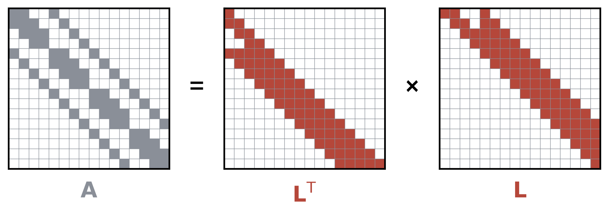
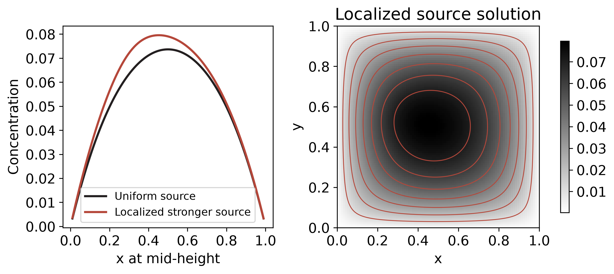

## Learning outcomes

By the end of this seminar, you should be able to:

1. **Solve** a small linear system by Gaussian elimination and back substitution, recording the row operations.
2. **Apply** partial pivoting to the entire augmented matrix and check the answer in the original equations.
3. **Compare** the operation counts for repeated elimination, reusable LU, and Cholesky.
4. **Choose** a solver using a matrix's banded structure and symmetry.

## Connection to the lecture

In [L13](../../units/03/L13/index.qmd), we examined how a direct solver transforms a matrix into forms that are easier to solve. Today we will carry out two Gaussian eliminations by hand, then use the structure of a diffusion problem to solve a system much larger than we could store as a dense array.

For Questions 1 and 2, keep the original matrix and right-hand side beside your working. Write every row operation on the **augmented matrix** $[\mathbf A\mid\mathbf b]$, including changes to the last column. Complete the hand calculation before using the notebook to check it.

## Question 1 · Elimination without row swaps

Solve

$$
\begin{bmatrix}
2&1&-1\\
4&5&0\\
-2&2&7
\end{bmatrix}
\begin{bmatrix}x_1\\x_2\\x_3\end{bmatrix}
=
\begin{bmatrix}5\\14\\-5\end{bmatrix}.
$$

1. Using the first row as the pivot row, eliminate the first-column entries below it. Record both multipliers.
2. Eliminate the remaining entry below the second pivot. Write the resulting upper-triangular system $\mathbf U\mathbf x=\mathbf c$.
3. Use back substitution to find $x_3$, then $x_2$, then $x_1$.
4. Substitute your result into all three **original** equations. What residual do you obtain?

Use the displayed row order for this question. All three pivots are nonzero, and the arithmetic can be kept exact.

::: {.callout-note collapse="true"}
## Worked elimination and back substitution for Question 1

The first-column multipliers are $m_{21}=4/2=2$ and $m_{31}=-2/2=-1$. Apply

$$
R_2\leftarrow R_2-2R_1,\qquad R_3\leftarrow R_3+R_1
$$

to obtain

$$
\left[\begin{array}{rrr|r}
2&1&-1&5\\
0&3&2&4\\
0&3&6&0
\end{array}\right].
$$

Now $m_{32}=3/3=1$, so $R_3\leftarrow R_3-R_2$ gives

$$
\left[\begin{array}{rrr|r}
2&1&-1&5\\
0&3&2&4\\
0&0&4&-4
\end{array}\right].
$$

Back substitution gives

$$
x_3=-1,\qquad
x_2=\frac{4-2(-1)}{3}=2,\qquad
x_1=\frac{5-2+(-1)}{2}=1.
$$

Thus $\mathbf x=(1,2,-1)^{\mathsf T}$ and $\mathbf A\mathbf x-\mathbf b=\mathbf 0$.
:::

## Question 2 · Partial pivoting at two stages

Solve the following system using **partial pivoting** at every elimination stage:

$$
\begin{bmatrix}
0&2&1\\
2&1&-1\\
4&4&1
\end{bmatrix}
\begin{bmatrix}x_1\\x_2\\x_3\end{bmatrix}
=
\begin{bmatrix}0\\-1\\2\end{bmatrix}.
$$

Before calculating, consider the zero in the top-left corner. Does it establish that the matrix is singular, or does it only prevent using that entry as the first pivot?

1. In column 1, choose the entry with the largest absolute value among all three rows. Swap its row into the first position, including the right-hand-side entry.
2. Eliminate below that pivot. Fractions such as $1/2$ can be kept exact.
3. For the second pivot, compare the remaining entries in column 2 **after elimination**. Is another row swap needed?
4. Complete the elimination and back substitution. Verify the answer against the original equations.
5. A classmate swaps the coefficient rows but leaves $\mathbf b$ unchanged. Explain why their answer can solve the transformed equations correctly and still fail the original problem.

::: {.callout-note collapse="true"}
## Both pivot choices and the solution of Question 2

The largest first-column magnitude is 4. Swap $R_1$ and $R_3$:

$$
\left[\begin{array}{rrr|r}
4&4&1&2\\
2&1&-1&-1\\
0&2&1&0
\end{array}\right].
$$

Apply $R_2\leftarrow R_2-\tfrac12R_1$. The third row already has a zero in column 1:

$$
\left[\begin{array}{rrr|r}
4&4&1&2\\
0&-1&-3/2&-2\\
0&2&1&0
\end{array}\right].
$$

In column 2, $|2|>|-1|$, so swap the current $R_2$ and $R_3$. Then the multiplier is $m_{32}=-1/2$, and $R_3\leftarrow R_3+\tfrac12R_2$ gives

$$
\left[\begin{array}{rrr|r}
4&4&1&2\\
0&2&1&0\\
0&0&-1&-2
\end{array}\right].
$$

Back substitution gives $x_3=2$, $x_2=-1$, and $x_1=1$. The original equations evaluate to $0$, $-1$, and $2$, as required. The nonzero pivots establish that this system has a unique solution despite its original zero diagonal entry.

A row swap exchanges two complete equations. Swapping only the coefficients attaches the wrong right-hand side to each equation and changes the problem.
:::

### Check your hand calculations

Select the question and enter your computed vector in the editable cell. The checker evaluates the original equations and displays each residual, without repeating the elimination for you.

::: {.quarto-wasm-local notebook="s06_gaussian_check.edit.py" view="edit" title="Check the residuals of the two hand-elimination answers" height="650" loading="lazy" fullscreen="true"}
Question 1 has solution $(1,2,-1)^{\mathsf T}$ and Question 2 has solution $(1,-1,2)^{\mathsf T}$. Substitution into each original matrix gives its supplied right-hand side exactly. Both residual vectors are zero.
:::

## Question 3 · Why have so many matrix solvers? {.reading-material}

Treat this question as reading material after the hand-elimination practice. In [L13](../../units/03/L13/index.qmd), we met Gaussian elimination, LU, Cholesky, and structured solvers. The reason for having so many choices becomes clear in a two-dimensional diffusion calculation.

Imagine steady diffusion on a square grid with fixed boundary concentrations. At each interior point, the five-point finite-difference equation relates that point to its left, right, lower, and upper neighbours:

$$
4c_{i,j}-c_{i-1,j}-c_{i+1,j}-c_{i,j-1}-c_{i,j+1}=b_{i,j}.
$$

After numbering the grid points, these equations form $\mathbf A\mathbf x=\mathbf b$. For a $1000\times1000$ interior grid, $\mathbf x$ contains **one million unknown concentrations**. The matrix is sparse, symmetric, and positive definite, but a dense copy of it would contain $10^{12}$ entries and require about **8 TB** before any factorization.

In a simulation, we often solve many systems with the **same diffusion matrix** but different source fields:

$$
\mathbf A\mathbf x^{(1)}=\mathbf b^{(1)},\qquad
\mathbf A\mathbf x^{(2)}=\mathbf b^{(2)},\qquad\ldots
$$

What work could we avoid repeating?

### Repeated elimination, reusable LU, and dense Cholesky

Recall the assignment's LU calculation. Once $\mathbf A$ has been factored, each new right-hand side needs only forward and back substitution. For an $n\times n$ dense matrix, L13 gave approximately $\tfrac23n^3$ operations for elimination or LU factorization, and $2n^2$ for the two triangular substitutions.

Suppose we first use **1000 unknowns and 10 different right-hand sides** as a hand estimate:

| Approach | Approximate total operations for $m$ right-hand sides |
|---|---:|
| Start elimination again for every system | $m(\tfrac23n^3+2n^2)$ |
| Factor once with LU and reuse it | $\tfrac23n^3+2mn^2$ |
| Factor once with dense Cholesky and reuse it | $\tfrac13n^3+2mn^2$ |

Substituting $n=1000$ and $m=10$ gives about **6.69 billion**, **687 million**, and **353 million** operations. Reusing a factorization gives the first large saving. Cholesky gives another saving because the diffusion matrix is symmetric positive definite:

$$
\mathbf A=\mathbf L^{\mathsf T}\mathbf L.
$$

Here we use $\mathbf L$ for the **upper-triangular** Cholesky factor. To see the entries, take a $2\times2$ interior grid and number its four points row by row. Each point has two interior neighbours, while its other two neighbours lie on the fixed boundary. The stencil gives the following factorization, with zero entries left blank and the factor entries rounded to two decimal places:

$$
\underbrace{\begin{bmatrix}
4&-1&-1&\\
-1&4&&-1\\
-1&&4&-1\\
&-1&-1&4
\end{bmatrix}}_{\mathbf A}
\approx
\underbrace{\begin{bmatrix}
2&&&\\
-0.5&1.94&&\\
-0.5&-0.13&1.93&\\
&-0.52&-0.55&1.85
\end{bmatrix}}_{\mathbf L^{\mathsf T}}
\underbrace{\begin{bmatrix}
2&-0.5&-0.5&\\
&1.94&-0.13&-0.52\\
&&1.93&-0.55\\
&&&1.85
\end{bmatrix}}_{\mathbf L}.
$$

For example, the first diagonal entry of the product is $2^2=4$, and its first off-diagonal entry is $2(-0.5)=-1$. The factor also contains **fill-in**: its entry $L_{23}\approx-0.13$ is nonzero even though $A_{23}=0$. On larger grids these new entries occupy the band between the original stencil diagonals, as shown below.

{#fig-cholesky-pattern width="100%" fig-alt="Three framed matrix grids show grey A equals red lower-triangular L transpose times red upper-triangular L. The factors contain additional nonzero entries inside the band."}

For **one million unknowns**, the dense estimates become large enough that the choice of method dominates everything else:

| Approach | Approximate operations | Idealized time at 1 TFLOP/s |
|---|---:|---:|
| Fresh dense elimination for two source fields | $1.3\times10^{18}$ | 15 days |
| Dense LU once, then reuse | $6.7\times10^{17}$ | 7.7 days |
| Dense Cholesky once, then reuse | $3.3\times10^{17}$ | 3.9 days |
| Optimized 2D diffusion solve | about $2.0\times10^{7}$ | far below a second of arithmetic |

The final line uses the rectangular-grid structure of the diffusion operator. With fixed boundary values, sine modes diagonalize the five-point matrix, so the notebook can solve the two-dimensional problem by transforming the source field, dividing by known eigenvalues, and transforming back.

### A short calculation with the same 2D matrix and two sources

The notebook supplies two source fields on the same square grid. The first source is uniform, and the second has stronger production in one region. Find the transform solve:

```python
modes = dstn(rhs, type=1, axes=(0, 1), norm="ortho")
solution_modes = modes/eigenvalues[:, :, None]
concentrations = idstn(solution_modes, type=1, axes=(0, 1), norm="ortho")
```

The same eigenvalue grid is used for both right-hand sides. This is the optimized version of the same reuse idea: the matrix structure is known once, and only the source-field data change.

::: {.quarto-wasm-local notebook="s06_diffusion_cholesky.edit.py" view="edit" title="Two-dimensional diffusion with one reused operator" height="850" loading="lazy" fullscreen="true"}
The notebook solves a two-dimensional diffusion problem for two source fields and plots the resulting concentrations. It compares repeated dense elimination, reusable dense LU, dense Cholesky, and the optimized rectangular-grid diffusion solve. The million-unknown case corresponds to a 1000 by 1000 interior grid.
:::

{#fig-diffusion-profiles width="85%" fig-alt="A line plot compares concentration profiles for a uniform source and a localized stronger source, and a contour image shows the two-dimensional concentration field for the localized source."}

**Try:** start with a small grid, then increase the grid size. At $1000\times1000$ interior points, the dense matrix alone would require **8 TB**, while the optimized solve stores only grid-sized arrays for the source fields, solution fields, and transform workspaces.

## Record and discuss

Keep the row operations and answers for Questions 1 and 2. For Question 3, record the operation estimates and explain the separate savings from **reusing a factorization**, **using symmetry through Cholesky**, and **using the two-dimensional diffusion structure directly**.

**Before you leave:** if only $\mathbf b$ changes, which part of the calculation must be repeated? If $\mathbf A$ changes, what must be recalculated?
