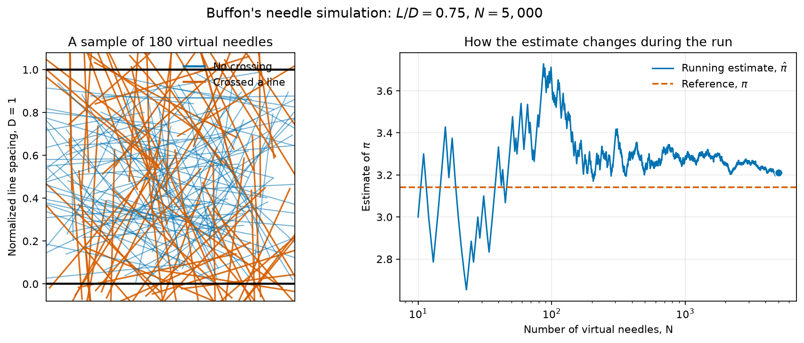

::: {.callout-note}
## Central question

**What happens between asking a materials question and obtaining a number from a computer?**
:::

## Learning outcomes

By the end of this lecture, you should be able to:

1. **Distinguish** a mathematical model, a numerical method, and a computational materials simulation.
2. **Explain** how these three layers work together in a molecular-dynamics calculation.
3. **Recognize** the relationship between traditional numerical methods and computational materials science.
4. **Turn** the geometry of Buffon's needle problem into a reproducible numerical experiment.
5. **Calculate** the absolute and relative percentage error of an estimate when a reference value is known.

## Why do materials engineers model?

An experiment begins with a physical specimen. A computational study begins with a representation of one. Neither route is automatically easier or more reliable; they answer different parts of an engineering question.

A model lets us vary one condition at a time before committing material, equipment, or laboratory time. It can expose quantities that are difficult to measure directly, such as the force on each atom, the concentration inside a diffusion couple, or the stress near a buried interface. It can also connect an observed response to a proposed mechanism. A measured stress–strain curve tells us what the specimen did. A model can help test *why* it behaved that way.

Models are especially useful when they guide decisions. We might screen processing temperatures, compare candidate compositions, or determine which experiment would be most informative. The calculation does not replace the experiment. It helps us decide what to measure and how to interpret the measurement.

Code adds one more benefit. A well-documented program records equations and procedures in an executable form. Another person can run it, inspect its assumptions, change an input, and compare the result with other evidence. In that sense, code can become a reservoir of engineering knowledge.

## Three connected layers of modeling

The word *modeling* is used for several related activities in materials engineering. We will separate them into three layers throughout this course.

A **mathematical model** states which parts of the physical system matter for the question. It identifies the variables, properties, physical laws, geometry, initial conditions, boundary conditions, and assumptions. Its result is usually a set of equations, but choosing those equations already requires engineering judgment.

A **numerical method** turns the mathematical problem into a finite sequence of operations. A derivative may be replaced by a finite difference, a continuous trajectory by discrete timesteps, or an integral by a weighted sum. This is where questions of discretization, convergence, stability, and finite precision enter.

A **computational materials simulation** combines the physical model and numerical method with material data, software, and computing resources. It produces quantities that can be compared, visualized, and interpreted at a chosen length and time scale.

$$
\boxed{
\text{materials question}
\longrightarrow
\text{mathematical model}
\longrightarrow
\text{numerical method}
\longrightarrow
\text{computer simulation}
\longrightarrow
\text{physical interpretation}
}
$$

The arrows do not point only to the right. If the result is inconsistent with an experiment, a known limiting case, or physical reasoning, we return to earlier choices and examine them.

### One example: molecular dynamics

{#fig-md-layers fig-cap="Three layers of a molecular-dynamics calculation. Course illustration created with OpenAI image generation; the gold-nanoparticle melting example is adapted conceptually from Zeni et al. (2021)."}

In @fig-md-layers, the mathematical model describes atoms with positions $\mathbf r_i$, masses $m_i$, and forces obtained from a potential energy $U$:

$$
m_i\frac{\mathrm d^2\mathbf r_i}{\mathrm dt^2}
=
\mathbf F_i
=
-\nabla_i U(\mathbf r_1,\ldots,\mathbf r_N).
$$

These equations describe continuous motion. A computer cannot advance through every instant of continuous time, so the numerical layer introduces a finite timestep $\Delta t$. The velocity-Verlet algorithm uses the current positions, velocities, and accelerations to approximate their values at the next timestep.

The computational simulation implements this repeated update for many atoms and many timesteps. It also supplies an atomic structure, an interatomic model, temperature control, boundary conditions, data collection, and visualization. The example in the figure follows a gold nanoparticle as its atomic structure becomes increasingly liquid-like with temperature, an application adapted from [Zeni et al. (2021)](../references.qmd#ref-zeni2021gold).

Molecular dynamics is therefore not just Newton's equation, not just velocity Verlet, and not just an animation of atoms. It is the combination

$$
\boxed{
\text{physical model}
+
\text{numerical algorithm}
+
\text{computation at scale}
}.
$$

## Numerical methods and computational materials science

A traditional numerical-methods course is often organized by mathematical problem: roots, linear systems, interpolation, integration, optimization, ordinary differential equations, and partial differential equations. A computational materials science course is often organized by physical scale or simulation family: electronic structure, molecular dynamics, Monte Carlo, phase field, finite elements, or thermodynamic databases.

These are two views of the same computation, not competing subjects.

| | Traditional numerical-methods view | Computational materials science view |
|---|---|---|
| Starting question | What algorithm solves this mathematical problem? | What representation can answer this materials question? |
| Organizing language | equations, matrices, derivatives, integrals, errors | electrons, atoms, defects, microstructures, fields, properties |
| Example | integrate a system of ordinary differential equations | advance an atomic trajectory in molecular dynamics |
| Main concern | accuracy, convergence, stability, and cost | physical assumptions, scale, parameters, and interpretation |
| In MATE 374 | learn and judge the numerical kernel | place that kernel inside a materials model and test the result |

A molecular-dynamics program relies on time integration. A phase-field program relies on spatial discretization, time integration, and often linear algebra. A finite-element model may produce a large system $A\mathbf x=\mathbf b$. Monte Carlo uses random sampling rather than a time-integration algorithm. The simulation family tells us what physical representation we chose; the numerical method tells us how the resulting mathematics is calculated.

This course will move between both views. We will study the numerical methods explicitly, but we will keep asking what physical question created the mathematics and what evidence would make the answer believable.

## Choosing an adequate model

A more complicated model is not automatically a better model. The appropriate level of detail depends on the question.

If we need the thermal expansion of a long metal bar over a modest temperature range, a single coefficient may be adequate. Simulating every atom would add cost without necessarily improving the engineering decision. If we instead need to study how a nanoscale defect interacts with a crack tip, the continuum approximation may hide the mechanism of interest.

A useful calculation therefore begins with four plain questions:

1. What do we want to predict or explain?
2. Which variables and physical processes are needed?
3. At what length and time scales do they occur?
4. What comparison will tell us whether the result is credible?

We normally begin with the simplest model that can answer the question. We add detail when evidence shows that an omitted process matters.

### What the computer does not decide

A computer carries out the specified calculation. It does not decide whether the selected equations describe the manufactured material, whether an input property is trustworthy, or whether the result has been interpreted outside the model's range.

The *Titan* pressure-vessel investigation provides an engineering example. Analyses based on idealized geometry and material behaviour could not establish the safety of an as-built composite vessel that accumulated damage over repeated dives. The issue was not a lack of sophisticated software. The physical object and its service history had to be represented and validated adequately ([NTSB, 2025](../references.qmd#ref-ntsb2025titan)).

Software itself is also part of the evidence chain. The Fast16 sabotage framework reportedly altered selected high-rate simulation results only under narrow trigger conditions. Repeating a calculation with the same compromised software could reproduce the same false result ([SentinelOne Labs, 2026](../references.qmd#ref-sentinelone2026fast16)). Independent checks matter because reproducibility within one implementation is not the same as an independent verification.

These examples motivate two questions that will recur throughout the course:

- **Verification:** did we calculate the chosen mathematical problem correctly?
- **Validation:** is that mathematical problem adequate for the physical question?

## Equations, code, and interaction

Python is not the main subject of this course. It is the language we will use to make numerical reasoning visible.

An equation gives a compact mathematical relationship. Code forces us to state how inputs are represented and which operations are carried out. An interactive notebook lets us change those inputs and see the consequences immediately.

$$
\boxed{
\text{equation}
\longrightarrow
\text{code}
\longrightarrow
\text{interactive numerical experiment}
}
$$

You will not always write a program from a blank page. In many activities, a working calculation will be supplied. Your task will be to inspect it, change a meaningful part, check the result, and explain what changed. This is closer to how engineers work with established numerical libraries and simulation software.

## First numerical experiment: Buffon's needle

Buffon's needle problem turns an experiment with random throws into an estimate of $\pi$. It is useful here because the physical picture is simple, the algorithm is short, and the reference value is known.

Imagine equally spaced parallel lines on a floor. The distance between neighbouring lines is $D$. We drop a needle of length $L$, with $L\le D$, without choosing its position or direction. Sometimes the needle crosses a line and sometimes it does not.

Two quantities determine one throw:

- the angle $\theta$ between the needle and the parallel lines;
- the distance $y$ from the needle's centre to the nearest line.

The needle's perpendicular half-length is

$$
\frac{L}{2}|\sin\theta|.
$$

A crossing occurs when the centre is close enough to a line:

$$
y\le \frac{L}{2}|\sin\theta|.
$$

For uniformly random positions and directions, the probability of crossing a line is

$$
P(\text{crossing})=\frac{2L}{\pi D}.
$$

We do not need the full geometric derivation to run the experiment. The important point is that the unknown $\pi$ appears in a probability that we can estimate by counting crossings.

If $C$ needles cross in $N$ throws, then the observed crossing fraction is $C/N$. Replacing the probability by this measured fraction gives

$$
\frac{C}{N}\approx\frac{2L}{\pi D},
$$

and rearranging gives the estimate

$$
\boxed{
\widehat{\pi}=\frac{2LN}{DC}
=\frac{2(L/D)N}{C}
}.
$$

### Random numbers and a reproducible experiment

The browser does not physically drop needles. It generates pseudorandom numbers for the centre position and angle. These numbers behave like random samples for this experiment, but they are produced by a deterministic algorithm.

A **random seed** selects the starting point of that algorithm. The same seed and the same inputs produce the same sequence of virtual throws. A different seed produces a different, but equally valid, sample.

Use your student ID as the seed in the activity. It is used locally in the browser and is not repeated in the displayed result. Do not share a screenshot that exposes your student ID.

### The algorithm

The simulation repeats five operations:

```text
set the random seed
repeat N times:
    generate a random needle centre
    generate a random needle angle
    test whether the needle crosses a line
    record the result
count the crossings and calculate the estimate of π
```

This is an **algorithm**: a finite, ordered procedure that turns the model into a result. The Python program follows these same steps using NumPy arrays so that many throws can be generated and tested together.

### Run the simulation

1. Replace the placeholder seed with your student ID.
2. Choose the ratio $L/D$.
3. Choose the number of throws $N$.
4. Press **Simulate**. Moving a slider alone does not start a new run.
5. Read the needle plot, convergence trend, and error values.

::: {.quarto-wasm-local notebook="buffon_needle.edit.py" height="880" loading="eager" fullscreen="true"}
{fig-cap="Static example from the Buffon's needle activity. Open the HTML version of this page to choose your own seed and simulation settings."}

For this representative run, 2,336 of 5,000 needles crossed a line, giving $\widehat{\pi}=3.21061644$. The absolute error is $6.902\times10^{-2}$ and the relative percentage error is $2.197\%$.
:::

### Reading the result

The left panel checks the geometry of the implementation. A highlighted needle should actually intersect one of the horizontal lines. This visual check is simple, but it can reveal an incorrect crossing condition immediately.

The right panel shows the running estimate. At small $N$, one additional crossing can move the estimate substantially. As the number of throws grows, the movement usually becomes smaller, although a random estimate does not approach $\pi$ smoothly at every step.

Because the reference value is known, we can calculate the **absolute error**

$$
E_{\mathrm{abs}}=|\widehat{\pi}-\pi|
$$

and the **relative percentage error**

$$
E_{\mathrm{rel},\%}
=
\frac{|\widehat{\pi}-\pi|}{\pi}\times100\%.
$$

These two values describe the same discrepancy at different scales. The absolute error uses the units or magnitude of the quantity itself. The relative percentage error compares that discrepancy with the reference value.

## The three layers in the Buffon experiment

Buffon's needle is not a materials simulation, but it contains the same modeling structure.

| Layer | Choice in this experiment |
|---|---|
| Mathematical model | parallel lines, $L\le D$, uniformly random position and orientation, and the crossing probability $2L/(\pi D)$ |
| Numerical method | generate a finite random sample, count crossings, and estimate $\pi$ from the crossing fraction |
| Computation | implement the sampling with NumPy, control the seed and inputs, plot the throws, and report the error |
| Interpretation | decide whether the observed accuracy is adequate and explain how $N$, $L/D$, and the seed affect the result |

The calculation is small, but the habits transfer directly to materials work: state the model, identify the algorithm, control the inputs, inspect the output, compare against evidence, and interpret the result.

## Before the next lecture

Run at least three experiments and record $N$, $L/D$, and the error:

1. Keep the seed and $L/D$ fixed, but increase $N$. Does the error decrease every time?
2. Keep the seed and $N$ fixed, but decrease $L/D$. What happens to the crossing count?
3. Compare your result with a classmate using the same $N$ and $L/D$ but a different seed. Why are the estimates different?

L02 will use these observations to discuss convergence, sampling error, computational effort, and how we judge whether one numerical method is better than another.
