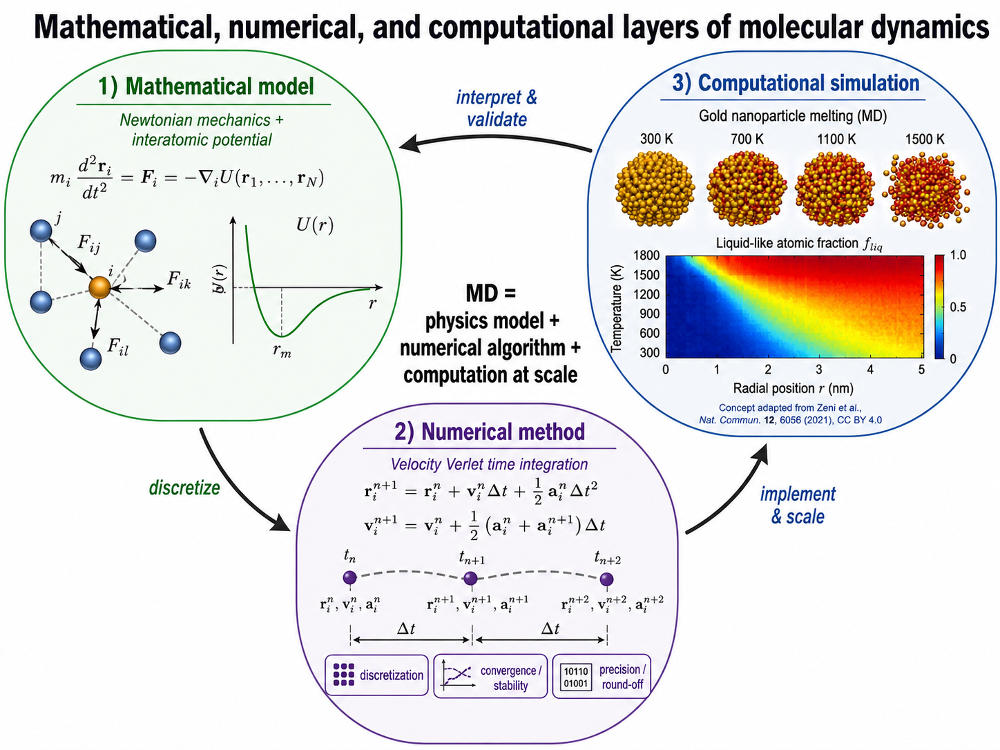
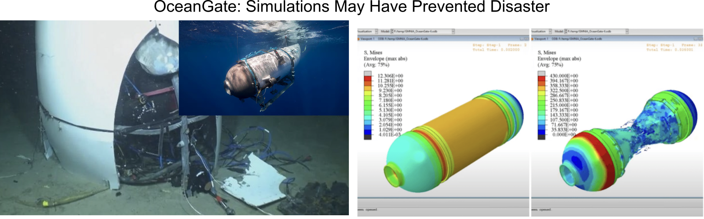
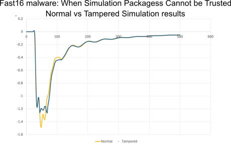
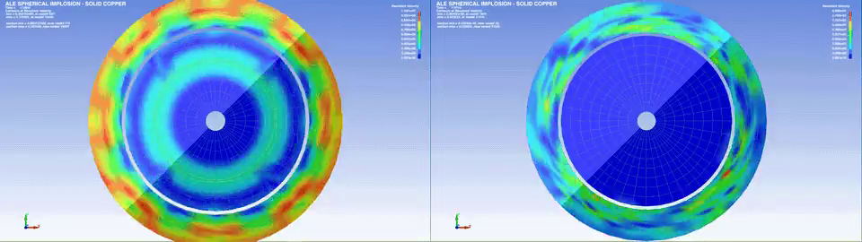

::: {.callout-note}
## Central question

**What happens between asking a materials question and obtaining a number from a computer?**
:::

## Learning outcomes

By the end of this lecture, you should be able to:

1. **Distinguish** a mathematical model, a numerical method, and a computational materials simulation.
2. **Explain** how these three layers work together in a molecular-dynamics calculation.
3. **Recognize** the relationship between traditional numerical methods and computational materials science.
4. **Turn** the geometry of Buffon's needle problem into a reproducible numerical experiment.
5. **Calculate** the absolute and relative percentage error of an estimate when a reference value is known.

## Why do materials engineers model?

An experiment begins with a physical specimen, while a computational study begins with a representation of one. In modern day material discovery, neither route is automatically easier or more reliable; they answer different parts of an engineering question.

A **model** lets us vary one condition at a time before committing material, equipment, or laboratory time. It can expose quantities that are difficult to measure directly, such as the force on each atom, the concentration inside a diffusion couple, or the stress near a buried interface. It can also connect an observed response to a proposed mechanism. A well-known example from your earlier MAT E courses is the measured stress–strain curve, which tells the how hard a material can be. A model can help test *why* it behaved that way.

Models are especially useful when they **guide decisions**. We might screen processing temperatures, compare candidate compositions, or determine which experiment would be most informative. The calculation does not replace the experiment. It helps us decide what to measure and how to interpret the measurement.

**Programmed codes** add one more benefit. A well-documented program (in particular, open-source code) records equations and procedures in an executable form. Another person can run it, inspect its assumptions, change an input, and compare the result with other evidence. In that sense, code can become a reservoir of engineering knowledge.

## Three connected layers of modeling

The word *modeling* is used for several related activities in materials engineering. We will separate them into three layers throughout this course.

- A **mathematical model** states which parts of the physical system matter for the question, by identifying the variables, properties, physical laws, geometry, initial conditions, boundary conditions, and assumptions. Its result is usually a **set of equations**, but choosing those equations already requires engineering judgment.

- A **numerical method** turns the mathematical problem into a **finite sequence of operations**. A derivative may be replaced by a finite difference, a continuous trajectory by discrete timesteps, or an integral by a weighted sum. This is where questions of discretization, convergence, stability, and finite precision enter.

- A **computational materials simulation** combines the physical model and numerical method with material data, software, and computing resources. It produces quantities that can be compared, visualized, and interpreted at a chosen length and time scale.


### One example: molecular dynamics

One well-known example that clearly demonstrates the relationship between mathematical, numerical and computational methods is the molecular dynamics (MD), which we will introduce in the later part of this course.

{#fig-md-layers fig-cap="Three layers of a molecular-dynamics calculation. Course illustration created with OpenAI image generation; the MD simulation example is adapted conceptually from Zeni et al. (2021)."}

In @fig-md-layers, the mathematical model describes atoms with positions $\mathbf r_i$, masses $m_i$, and forces obtained from a potential energy $U$:

$$
m_i\frac{\mathrm d^2\mathbf r_i}{\mathrm dt^2}
=
\mathbf F_i
=
-\nabla_i U(\mathbf r_1,\ldots,\mathbf r_N).
$$

These equations describe continuous motion of atoms, but a computer cannot advance through every instant of continuous time! The numerical layer introduces a finite timestep $\Delta t$. The velocity-Verlet **algorithm** uses the current positions, velocities, and accelerations to approximate their values at the next timestep.

Finally, after the algorithm (numerical methods) for implementing the mathematical equations are defined, the are usually distributed as reusable **computational software**. In the case of MD, the computational simulation implements this repeated update for many atoms and many timesteps. It also supplies an atomic structure, an interatomic model, temperature control, boundary conditions, data collection, and visualization. The example in the figure follows a gold nanoparticle as its atomic structure becomes increasingly liquid-like with temperature, an application adapted from [Zeni et al. (2021)](../references.qmd#ref-zeni2021gold).


## Numerical methods and computational materials science

Textbooks and courses in this area often approach computation from two directions. A numerical-methods course, such as the text by Mmbaga and co-authors, is usually organized around mathematical problems. A computational materials science course, such as LeSar's [*Introduction to Computational Materials Science*](../references.qmd#ref-lesar2013), is usually organized around physical scales and simulation families.

::: {.columns}

::: {.column width="50%"}

### Numerical methods for engineers

**How can we calculate a mathematical problem reliably?**

Typical topics include:

- choosing a model and assessing numerical precision;
- solving nonlinear equations;
- optimization;
- solving systems of equations;
- numerical differentiation and integration;
- ordinary differential equations; and
- partial differential equations.

:::

::: {.column width="50%"}

### Computational materials science

**Which simulation can answer a materials question?**

Typical topics include:

- atomistic structure and molecular motion;
- electronic-structure methods;
- molecular dynamics;
- random sampling and Monte Carlo methods;
- phase-field simulations; and
- finite-element and finite-volume methods.

:::

:::

These are not competing subjects, but rather two views of the same computation. The materials view identifies the physical representation, length and time scales, and quantities of interest. The numerical-methods view explains how the resulting equations are represented and solved.

For example, a molecular-dynamics simulation advances atomic positions using a time-integration method. A phase-field simulation combines spatial discretization, time integration, and often linear algebra. A finite-element model may produce a large system such as $A\mathbf{x}=\mathbf{b}$. A Monte Carlo simulation uses random sampling rather than a time-integration algorithm. In each case, the simulation family tells us what physical model we selected, while the numerical method tells us how the calculation is carried out.

MAT E 374 moves between these two views. We will study numerical methods explicitly, but we will also keep asking what materials question produced the mathematics and what evidence would make the computed answer believable.

## Choosing an adequate model

A more complicated model is not automatically a better model. The appropriate level of detail depends on the question.

If we need the thermal expansion of a long metal bar over a modest temperature range, a single coefficient may be adequate. Simulating every atom would add cost without necessarily improving the engineering decision. If we instead need to study how a nanoscale defect interacts with a crack tip, a continuum model may hide the mechanism of interest.

A useful calculation therefore begins with four plain questions:

1. What do we want to predict or explain?
2. Which variables and physical processes are needed?
3. At what length and time scales do they occur?
4. What comparison will tell us whether the result is credible?

We normally begin with the simplest model that can answer the question. We add detail when evidence shows that an omitted process matters.

### Computational methods for discovery

Advances in electronic-structure software have made large collections of materials calculations possible. Projects such as the [Materials Project](../references.qmd#ref-jain2013materialsproject) organize these calculations into searchable databases. More recently, AI/ML models have been coupled with electronic-structure calculations to screen candidate crystals at an unprecedented scale. The GNoME study, for example, reported millions of candidate structures and used density-functional-theory calculations to evaluate their stability ([Merchant et al., 2023](../references.qmd#ref-merchant2023materials)).

This scale does not remove the need for experiments or careful interpretation. It allows researchers to narrow a vast search space and decide which candidates deserve more detailed simulation, synthesis, and measurement. We will return to electronic-structure methods and AI/ML-assisted materials simulation later in the course.

{fig-alt="A diagram of the GNoME workflow, relative database scales, example crystal structures, and an automated synthesis laboratory."}

### “If only we had run that simulation”

Modeling can guide experiments and reveal possible failure modes before a design is placed in service. However, a computer carries out the calculation it is given. It does not decide whether the equations represent the manufactured object, whether the material properties are trustworthy, or whether damage accumulated during service has changed the system.

The OceanGate *Titan* submersible imploded on June 18, 2023. The subsequent investigation found that its carbon-fibre composite pressure vessel had accumulated delamination and other damage, and that OceanGate had not adequately established the as-built vessel's strength and durability over repeated dives ([NTSB, 2025](../references.qmd#ref-ntsb2025titan)). Analyses based on idealized geometry and material behaviour could not by themselves establish that the damaged vessel was safe.

A later simulation-based reconstruction illustrated how instability could lead to rapid collapse under deep-sea pressure ([Engineering.com, n.d.](../references.qmd#ref-engineeringtitan)). (Side note: such a reconstruction can help explain a plausible failure sequence, but it does not prove that simply running one more simulation would have prevented the disaster.)

{fig-alt="The recovered Titan pressure vessel, the Titan submersible before the accident, and simulated pressure-vessel stress and collapse."}

::: {.callout-important}
## Lesson from *Titan*

A model can be internally sophisticated yet still fail as engineering evidence when its assumptions and validation are weak.
:::

### “What if the computer deceived me?”

A more difficult situation arises when the software itself has been designed to produce misleading results. `Fast16.sys` was a long-lived software-sabotage framework that was targeted to at least one country-wide high-performance computing facilities (most prominently Iran [Constantin, 2026](../references.qmd#ref-constantin2026fast16)). Unlike a traditional error in programming codes (which are usually called a "bug"), `Fast16.sys` was designed originally as a malware that targeted high-precision scientific computing programs ([SentinelOne Labs, 2026](../references.qmd#ref-sentinelone2026fast16)).

Public analyses reported that it targeted particular builds of LS-DYNA and AUTODYN routines in Ansys, and altered selected high-rate or explosive simulations only after narrow trigger conditions were reached ([Symantec Threat Hunter Team, 2026](../references.qmd#ref-symantec2026fast16)). A small, gradual change to an equation-of-state response could remain plausible while corrupting the final coupled simulation.

What's even worse: as all copies of the same software was infected, repeating a calculation on several computers running the same compromised software could reproduce the same false result.

::: {.columns}

::: {.column width="50%"}

{fig-alt="A comparison of normal and tampered simulation results; the curves differ most strongly shortly after the trigger and then appear to converge."}

:::

::: {.column width="50%"}

::: {.content-visible when-format="html"}

```{=html}
<video controls loop muted playsinline preload="metadata" poster="../../../assets/L01-fast16-implosion-poster.png" width="100%" style="aspect-ratio: 460 / 290; object-fit: contain; background: white;" aria-label="Side-by-side spherical implosion simulations showing different results">
  <source src="../../../assets/L01-fast16-implosion.mp4" type="video/mp4">
  Your browser does not support embedded video. <a href="../../../assets/L01-fast16-implosion.mp4">Open the video directly</a>.
</video>
```

:::

::: {.content-visible when-format="pdf"}

{fig-alt="A still frame comparing two spherical implosion simulations."}

:::

:::

:::

*Fast16 could introduce a small change in an intermediate result that propagated into a different coupled simulation.*

::: {.callout-warning}
## A question for every supplied program

If you are given a program and told only to run it, what independent evidence would help you trust its result?
:::

Together, these examples motivate two questions that will recur throughout the course:

- **Verification:** did we calculate the chosen mathematical problem correctly?
- **Validation:** is that mathematical problem adequate for the physical question?

Verification may require comparison with a known case, a limiting value, a convergence study, or an independent implementation. Validation requires comparison with physical evidence and careful attention to the model's intended range.


## Equations, code, and interaction

In MAT E 374, Python is our chosen language for writing small programs and numerical code, but this course is not a "Python for engineering" lecture series. More importantly, each lecture will connect a mathematical statement to its numerical or computational implementation.

An equation expresses a mathematical relationship compactly. Code requires us to specify how the inputs are represented and which operations are carried out. An interactive notebook then lets us change those inputs and observe the consequences immediately.

> **Equation → code → interactive numerical experiment**

You will not always write a program from a blank page. In many activities, a working calculation will be supplied. Your task will be to inspect it, change a meaningful part, check the result, and explain what changed. This is closer to how engineers work with established numerical libraries and simulation software.

## First numerical experiment: Buffon's needle

Buffon's needle problem estimates the mathematical constant $\pi$ through a physical experiment with random throws ([Weisstein, n.d.](../references.qmd#ref-weissteinbuffon)). We will use Buffon's experiment as our first example because the physical picture is simple, the algorithm is short, and the reference value $\pi$ is known.

Imagine equally spaced parallel lines on a floor. The distance between neighbouring lines is $D$. We drop a needle of length $L$, with $L\le D$, without choosing its position or direction. Sometimes the needle crosses a line and sometimes it does not.

.](../../../assets/buffon-needles-visualization.png){fig-alt="Parallel vertical lines separated by distance D, with one needle of length L between the lines and a second needle crossing a line."}

If we throw $N$ needles and observe $C$ crossings, Buffon's result gives the estimate

$$
\boxed{
\widehat{\pi}=\frac{2LN}{DC}
=\frac{2(L/D)N}{C}
}.
$$

Here, $N$ is the total number of needles thrown and $C$ is the number that cross a line.

### Random numbers and a reproducible experiment

The computer program does not physically drop needles! It generates *pseudorandom numbers* for the centre position and angle. These numbers behave like random samples for this experiment, but they are produced by a deterministic algorithm. We will encounter this idea again later when we study Monte Carlo methods.

A **random seed** selects the starting point of that algorithm. The same seed and the same inputs produce the same sequence of virtual throws. A different seed produces a different, but equally valid, sample.

Use your student ID as the seed in the activity. It is used locally in the browser and is not repeated in the displayed result. Do not share a screenshot that exposes your student ID.

### The algorithm

The simulation repeats five operations:

```text
set the random seed
repeat N times:
    generate a random needle centre
    generate a random needle angle
    test whether the needle crosses a line
    record the result
count the crossings and calculate the estimate of π
```

This is an **algorithm**: a finite, ordered procedure that turns the model into a result. The Python program follows these same steps using NumPy arrays so that many throws can be generated and tested together.

### Run the simulation

1. Enter your student ID as the random seed. The activity accepts up to eight digits.
2. Choose the ratio $L/D$.
3. Choose the number of throws $N$.
4. Press **Simulate**. Moving a slider alone does not start a new run.
5. Read the needle plot, convergence trend, and error values.

::: {.quarto-wasm-local notebook="buffon_needle.edit.py" height="880" loading="eager" fullscreen="true"}
{fig-cap="Static example from the Buffon's needle activity. Open the HTML version of this page to choose your own seed and simulation settings."}

For this representative run, 2,336 of 5,000 needles crossed a line, giving $\widehat{\pi}=3.21061644$. The absolute error is $6.902\times10^{-2}$ and the relative percentage error is $2.197\%$.
:::

### Reading the result

The left panel checks the geometry of the implementation. A highlighted needle should actually intersect one of the horizontal lines. This visual check is simple, but it can reveal an incorrect crossing condition immediately.

The right panel shows the running estimate. At small $N$, one additional crossing can move the estimate substantially. As the number of throws grows, the movement usually becomes smaller, although a random estimate does not approach $\pi$ smoothly at every step.

Because the reference value is known, we can calculate the **absolute error**

$$
E_{\mathrm{abs}}=|\widehat{\pi}-\pi|
$$

and the **relative percentage error**

$$
E_{\mathrm{rel},\%}
=
\frac{|\widehat{\pi}-\pi|}{\pi}\times100\%.
$$

These two values describe the same discrepancy at different scales. The absolute error uses the units or magnitude of the quantity itself. The relative percentage error compares that discrepancy with the reference value.

## The three layers in the Buffon experiment

Buffon's needle is not a materials simulation, but it contains the same modeling structure.

| Layer | Choice in this experiment |
|---|---|
| Mathematical model | parallel lines, $L\le D$, uniformly random position and orientation, and the crossing probability $2L/(\pi D)$ |
| Numerical method | generate a finite random sample, count crossings, and estimate $\pi$ from the crossing fraction |
| Computation | implement the sampling with NumPy, control the seed and inputs, plot the throws, and report the error |
| Interpretation | decide whether the observed accuracy is adequate and explain how $N$, $L/D$, and the seed affect the result |

The calculation is small, but the habits transfer directly to materials work: state the model, identify the algorithm, control the inputs, inspect the output, compare against evidence, and interpret the result.

## Before the next lecture

Run at least three experiments and record $N$, $L/D$, and the error:

1. Keep the seed and $L/D$ fixed, but increase $N$. Does the error decrease every time?
2. Keep the seed and $N$ fixed, but decrease $L/D$. What happens to the crossing count?
3. Compare your result with a classmate using the same $N$ and $L/D$ but a different seed. Why are the estimates different?

L02 will use these observations to discuss convergence, sampling error, computational effort, and how we judge whether one numerical method is better than another.
