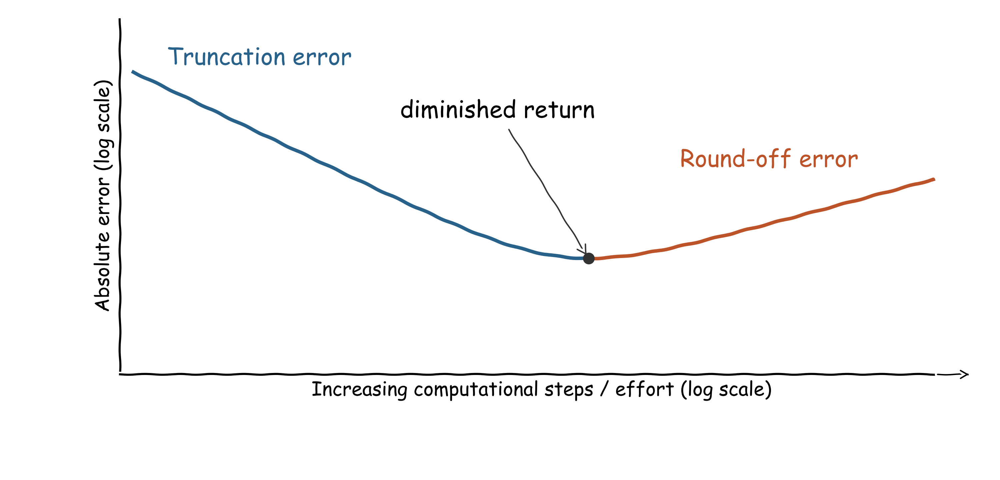

::: {.callout-note}
## Central question

**How are numbers represented in computers, and how does that affect the accuracy of numerical methods?**
:::

## Learning outcomes

By the end of this lecture, you should be able to:

1. **Convert** simple integers and fractions between decimal and binary, and interpret a fixed-width signed integer.
2. **Recover** the exact stored value of a finite float from its integer ratio.
3. **Interpret** the sign, exponent, and fraction fields of `float32` and `float64`, distinguishing range from precision.
4. **Explain** the polygon calculation's loss of accuracy and predict how higher precision changes it.

## Why did the error stop decreasing?

In L02 we compared several methods for estimating $\pi$. For the polygon method, the perimeter approached the circle circumference as we increased the number of sides. The geometry gave us a reasonable expectation: more sides should produce a better estimate. Yet the computed error **eventually rose** at sufficiently large $N$. Two sources of error compete:

- **Finite-approximation error** comes from doing a finite amount of work: keeping only some terms of a series (truncation error), or using a polygon with finitely many sides (geometric approximation error). More terms, more sides, or a faster-converging method can reduce it. This is not the same as choosing a better physical model.
- **Round-off error** comes from storing numbers and performing arithmetic with finite precision. Small differences between exact and stored values can be amplified by later operations, even when the mathematical formula is correct.

{#fig-error-balance fig-alt="Hand-drawn log-log schematic of absolute error against increasing computational steps or effort. Blue truncation error falls more steeply than orange round-off error rises. The combined curve has a minimum marked diminished return." width="96%" fig-align="center"}

Similar behaviour will appear again later when we deal with finite discretization of space. This is a qualitative sketch of a common error balance, not a rule that every numerical method must follow.


To understand round-off, we first need to see how a computer represents a real number. We will use Python's `float` as our example.^[Finite-precision representation is not specific to Python. The same issues arise in other languages and numerical software; the details depend on the number format and the operations used.]

### Your number is not necessarily what you see

Suppose we store three decimal values in Python. Predict the two outputs before running the code:

::: {.quarto-wasm-local notebook="l03_float_sum.edit.py" title="Edit and run a floating-point addition" height="340" loading="eager"}
```{.python code-fold="false"}
print(0.1 + 0.2)
print(0.1 + 0.2 == 0.3)
```

**Static output:** `0.30000000000000004` and `False`.
:::

Select **Edit code** to change the example, then run the cell with **Shift+Enter**. Try `0.5 + 0.25 == 0.75` as well. Why might that comparison behave differently?

What happened? This is not a failure of addition. The stored inputs are close to the decimal values we intended, but they are not exactly those values. The addition also has to **round** its result to an available floating-point number, hence the origin of the name "round-off error".

There is a familiar decimal analogy. If we keep only four decimal places in $1/3$, then $0.3333\times3=0.9999$, not 1. Some numbers have a terminating expansion in a given base; others need infinitely many digits. A finite format can store only some values exactly. As we will see, 0.5 is exact in binary, but 0.1 is not.

::: {.callout-tip}
## Comparing floats: exact or close enough?

`==` tests exact equality of the stored values. That is often too strict for results of numerical calculations. Use `math.isclose` for scalars or `numpy.isclose` for elementwise array comparisons, choosing tolerances that fit the scale and required accuracy of your problem.

```{.python code-fold="false"}
import math
math.isclose(0.1 + 0.2, 0.3, rel_tol=1e-12, abs_tol=1e-15)  # True
```

These tolerances are illustrative, not universal. An absolute tolerance is especially important when comparing a result with zero.
:::

### When a small representation error becomes a disaster

On February 25, 1991, during the first Gulf War, a US Patriot missile battery at Dhahran, Saudi Arabia, failed to track and intercept an incoming Iraqi Scud. The Scud struck a U.S. Army barracks, killing 28 soldiers. The investigation traced the tracking failure to an inaccurate time conversion after the system had operated continuously for about 100 hours ([GAO, 1992](../references.qmd#ref-gao1992patriot)).

What happened? The system counted clock ticks as integers, with each tick representing $1/10$ second. Converting the count to seconds used a truncated binary approximation to $1/10$ in a 24-bit fixed-point calculation. This introduced a conversion bias of about $9.54\times10^{-8}$ seconds per tick, not a fault in the clock's ticking rate. After 100 hours, the time-conversion error had grown to:

$$
n_{\mathrm{ticks}}=100\times3600\times10=3.6\times10^6,
\qquad
\Delta t\approx(3.6\times10^6)(9.54\times10^{-8}\,\mathrm{s})
\approx0.34\,\mathrm{s}.
$$

This sub-second error displaced the radar's predicted search window enough to prevent successful tracking and interception.

::: {.callout-important}
A tiny representation error can matter when multiplied by a large count. For a specified format, rounding mode, and sequence of operations, round-off is **deterministic**, not random noise. We can inspect individual stored values exactly, although predicting how their errors propagate through a long calculation can be difficult. The Patriot case involved fixed-point conversion rather than Python's floating-point format.
:::

## Seeing a number in binary

Modern digital computers represent information using **bits**, each written as 0 or 1.

::: {.columns}
::: {.column width="40%"}
, [CC BY-NC 2.5](https://creativecommons.org/licenses/by-nc/2.5/).](../../../assets/L03-xkcd-1-to-10.png){#fig-binary-joke fig-alt="One person asks: On a scale of 1 to 10, how likely is it that this question is using binary? The other replies: 4? The first asks: What's a 4?" height="230" fig-align="center"}
:::
::: {.column width="60%"}
If you understand the joke, you already have the prerequisite! If not, keep the question in mind: what does `10` mean in binary?
:::
:::

You may have converted positive integers to binary before. A group of bits can also represent a floating-point number, text, or something else. Its meaning depends on the encoding. Let's start with place values.

### Decimal and binary place values

We write $(a_n\cdots a_1a_0)_{10}$ for digits in **base 10**, where $a_i\in\{0,1,\ldots,9\}$. A decimal integer is a weighted sum of powers of ten:

$$
(a_n\cdots a_1a_0)_{10}=\sum_{i=0}^{n}a_i10^i.
$$

For example,

$$
(374)_{10}=3\times10^2+7\times10^1+4\times10^0.
$$

Binary uses the same idea with powers of two. We write $(b_n\cdots b_1b_0)_2$ to identify **base 2**, where every digit is 0 or 1:

$$
(b_n\cdots b_1b_0)_2=\sum_{i=0}^{n}b_i2^i.
$$

For example,

$$
(1101)_2=1\times2^3+1\times2^2+0\times2^1+1\times2^0=13.
$$

How do we find the binary digits? To convert 13 by hand, repeatedly **divide by two**. Record the integer quotient and remainder at each step, then use the quotient as the next dividend. Stop when the quotient is zero.

| Division | Integer quotient | Remainder |
|---|---:|---:|
| $13/2$ | 6 | 1 |
| $6/2$ | 3 | 0 |
| $3/2$ | 1 | 1 |
| $1/2$ | 0 | 1 |

Read the remainders **from bottom to top**: `1101`. Check both directions with Python:

::: {.quarto-wasm-local notebook="l03_integer_binary.edit.py" title="Edit and run integer conversions between decimal and binary" height="340" loading="eager"}
```{.python code-fold="false"}
print(bin(13))          # 0b1101
print(int("1101", 2))   # 13
```
:::

The prefix `0b` marks binary notation; it is not part of the digits. Select **Edit code**, change 13 to another positive integer, and run the cell with **Shift+Enter**. Then change the binary string to check the reverse conversion.

### Fractions and the binary point

The **binary point** plays the same role as the decimal point: it separates the integer part from the fractional part. To its left, places have weights $2^0,2^1,2^2,\ldots$ as we move outward. To its right, places have weights $2^{-1},2^{-2},2^{-3},\ldots$.

For digits $b_i\in\{0,1\}$,

$$
(0.b_1b_2b_3\cdots)_2=\sum_{i=1}^{\infty}b_i2^{-i}.
$$

For example, taking the first and third fractional places gives

$$
(0.101)_2=\frac12+\frac18=0.625.
$$

{#fig-binary-places fig-alt="Binary 1101.101 has nonzero weights 8, 4, 1, one half, and one eighth, summing to 13.625."}


For the reverse conversion of a fraction, repeatedly **multiply** by two. Each integer part supplies the next binary digit; continue with the fractional remainder. For 0.625:

| Multiplication | Integer part (next digit) | Fractional remainder |
|---|---:|---:|
| $0.625\times2=1.25$ | 1 | 0.25 |
| $0.25\times2=0.5$ | 0 | 0.5 |
| $0.5\times2=1.0$ | 1 | 0 |

Read the integer parts **from top to bottom**, in the order produced: `101`. The remainder is now zero, so the conversion terminates:

$$
(0.625)_{10}=(0.101)_2.
$$

Combine this with $(13)_{10}=(1101)_2$ to obtain

$$
\boxed{(13.625)_{10}=(1101.101)_2}.
$$

Check the place values: $8+4+1+1/2+1/8=13.625$.

### What happens with 0.3?

Now try the same procedure for another rational number, 0.3. Predict whether the remainder will reach zero, then work out the sequence:

| Multiplication | Integer part (next digit) | Fractional remainder |
|---|---:|---:|
| $0.3\times2=0.6$ | 0 | 0.6 |
| $0.6\times2=1.2$ | 1 | 0.2 |
| $0.2\times2=0.4$ | 0 | 0.4 |
| $0.4\times2=0.8$ | 0 | 0.8 |
| $0.8\times2=1.6$ | 1 | 0.6 |

What did you observe? The remainder **0.6 appears again**. From that point, the same steps repeat, producing the block `1001` over and over. Reading the digits from top to bottom gives

$$
(0.3)_{10}=(0.0100110011001\ldots)_2=(0.0\overline{1001})_2.
$$

Unlike 0.625, **0.3 cannot be represented by a finite number of binary digits**.

Use the conversion tool from [S02](../../../seminars/S02-number-conversion/index.qmd) below to verify your steps. Enter `0.3`, select **Prepare checks**, and open the fractional-conversion section. The tool uses exact rational arithmetic, so it converts $3/10$, not the floating-point approximation Python stores for `0.3`.

::: {.quarto-wasm-local notebook="s02_number_converter.edit.py" title="Check the repeating binary expansion of 0.3" height="900" loading="eager" fullscreen="true"}
**Static check.** The first eight fractional bits are `01001100`, giving $(0.01001100)_2=76/256=0.296875$. Discarding the remaining bits introduces an absolute error of $0.003125$.
:::

Why does this happen? Write a rational number as $a=p/q$ in lowest terms. A finite binary fraction with $k$ digits after the point has the form $m/2^k$, so its reduced denominator must be a power of two. Conversely, a denominator that is a power of two gives a terminating binary expansion. Here $0.625=5/8$ terminates, but $0.3=3/10$ does not: the denominator 10 contains a factor of 5.

::: {.callout-tip}
## Try the conversion

Write 0.75 in binary, then convert your result back to decimal. Would keeping more binary digits change the answer? How is this different from 0.3?
:::

::: {.callout-note collapse="true"}
## Four bits fit in one hexadecimal digit

Long binary strings are difficult to read. **Hexadecimal**, or base 16, groups four bits into one digit because $2^4=16$. Its digits are `0` to `9`, followed by `A` to `F` for values 10 to 15.

$$
(0010\ 1101)_2=(2D)_{16}=45.
$$

Here `0010` gives `2`, and `1101` gives `D` (13). Python writes the result as `0x2d`. Hexadecimal shortens the notation; it does not change the bits or their precision.
:::

::: {.callout-note collapse="true"}
## What about negative integers?

On paper we can simply write $-13=-(1101)_2$. Python's `bin(-13)` follows that convention and returns `'-0b1101'`. It does not show a fixed-width memory encoding.

A common fixed-width signed-integer encoding is **two's complement**. In eight bits, start with positive 13, invert the bits, then add 1:

```text
+13       00001101
invert    11110010
add 1     11110011   represents -13 as an eight-bit signed integer
```

To read it back, give the leading bit weight $-2^7$ and the remaining bits their ordinary positive weights:

$$
-128+64+32+16+2+1=-13.
$$

The same `11110011` interpreted as an **unsigned** integer is 243. Eight-bit two's complement covers $-128$ to $127$. Python's native `int` is different: it can grow to use more memory rather than having a fixed eight-, 32-, or 64-bit width.

:::

## From a stored fraction to a floating-point number

Computers commonly use three kinds of numerical representation:

- **Integers** represent whole numbers. The counting numbers $0,1,2,\ldots$ are useful for counting atoms, indexing arrays, and recording loop iterations. Signed integers also represent negative whole numbers.
- **Fixed-point numbers** use an agreed, fixed scale. For example, storing an integer number of cents makes `12567` represent 125.67 dollars: the decimal point always belongs two places from the right. A binary fixed-point format instead assigns a fixed number of bits to the fractional part. What is fixed is the point's position, not merely the length of the written number.
- **Floating-point numbers** store a significant part and an exponent, much like scientific notation. The exponent lets the point move, allowing the same format to represent very small and very large magnitudes.

In Python, a literal such as `13` creates an `int`, while `13.625` or `1.3625e1` creates a `float`. Scientific calculations commonly use floating point to approximate real-valued quantities, but a finite format cannot represent every real number exactly.

### Scientific notation in binary

In decimal scientific notation, we can write $13625=1.3625\times10^4$ and $0.0013625=1.3625\times10^{-3}$. The significant digits stay the same; changing the exponent changes the scale.

Binary floating point uses the same idea with powers of two. For example,

$$
(10240)_{10}=(10100000000000)_2=(1.01)_2\times2^{13},
$$

while

$$
(0.75)_{10}=(0.11)_2=(1.1)_2\times2^{-1}.
$$

Both have short significant parts despite their different magnitudes. To normalize a nonzero number with a finite binary expansion, move the binary point until exactly one nonzero digit remains to its left. That digit must be 1, giving

$$
x=\pm(1.Z)_2\times2^p,
$$

where $Z$ denotes the sequence of bits after the point, not a single digit.

The **exponent** $p$ determines the scale. The whole factor $(1.Z)_2$ is the **significand**, while $Z$ contains its **fraction bits**. Some other materials may also use *mantissa* for the significand; we will use *significand* and *fraction bits* to keep the two distinct.

An actual floating-point format limits both the exponent and the number of significant bits. These limits determine its **range** and **precision**, respectively.

### Recover the value Python stored

Python supplies `as_integer_ratio()` for a finite float. It returns an integer numerator $n$ and a positive integer denominator $d$, in lowest terms, such that

$$
x_{\mathrm{stored}}=\frac{n}{d}.
$$

This equality is exact: the ratio describes the bits already stored, not necessarily the decimal number we intended to enter. Because the stored value has a finite binary expansion, $d=2^k$ for some nonnegative integer $k$; a denominator of 1 corresponds to $k=0$.

```python
x = 0.75
numerator, denominator = x.as_integer_ratio()
print(numerator, denominator)   # 3 4
print(bin(numerator))          # '0b11'
```

Since $4=2^2$, move the binary point in `11` two places left:

$$
\frac34=\frac{(11)_2}{2^2}=(0.11)_2=(1.1)_2\times2^{-1}.
$$

The same procedure works for other finite values:

1. Get the stored ratio $n/2^k$; keep the sign separately.
2. Convert $|n|$ to binary.
3. Move the binary point $k$ places left.
4. For a nonzero value, normalize it to $\pm1.Z\times2^p$.

The denominator may be 1 for a large integer. It may be a very large power of two for a small value. Neither changes the procedure. Zero is simply zero and has no leading nonzero digit to normalize.

Now return to `0.3`. What does Python report?

```python
print((0.3).as_integer_ratio())
# (5404319552844595, 18014398509481984)
```

Thus the stored value is

$$
\frac{5404319552844595}{18014398509481984}
=\frac{5404319552844595}{2^{54}}
=\frac{3}{10}-\frac{1}{5\times2^{54}}.
$$

It is slightly smaller than $3/10$, by about $1.11\times10^{-17}$. Recovering the ratio reveals this approximation exactly; it cannot restore the infinite repeating expansion that was rounded on input.


## IEEE 754: sign, exponent, and fraction

The IEEE 754 standard specifies common floating-point formats ([IEEE, 2019](../references.qmd#ref-ieee7542019)). For a **normal, finite** binary number,

$$
\boxed{x=(-1)^s\left(1+\frac{F}{2^t}\right)2^{E-b}}
$$

where $s$ is the sign bit (0 for positive, 1 for negative), $E$ is the unsigned integer stored in the exponent field, $b$ is its **bias**, and $F$ is the unsigned integer formed by the $t$ stored fraction bits. The term $1+F/2^t$ is the same significand we wrote as $(1.Z)_2$.

::: {.callout-tip}
Adding the bias, $E=p+b$, lets an unsigned exponent field encode both negative and positive exponents; the values of $b$ below are written in decimal.
:::

The common formats allocate their bits as follows:

| Format | Sign bits | Exponent bits | Fraction bits $t$ | Bias $b$ | Significant binary digits |
|---|---:|---:|---:|---:|---:|
| `float16` | 1 | 5 | 10 | 15 | 11 |
| `float32` | 1 | 8 | 23 | 127 | 24 |
| `float64` | 1 | 11 | 52 | 1023 | 53 |

The leading 1 is implicit for normal numbers, so it does not require a stored bit. The exponent uses a **bias**, not two's complement. Floats also use a separate sign bit rather than the two's-complement integer encoding above.

For example, we already know $(0.75)_{10}=(1.1)_2\times2^{-1}$. In `float32`, $s=0$ and $E=-1+127=126$, giving

```text
sign    exponent    fraction
0       01111110    10000000000000000000000
```

The stored exponent is $E=126$, so $p=126-127=-1$. The fraction contributes $1/2$. Reading the fields gives

$$
(+1)\times(1+1/2)\times2^{-1}=0.75.
$$

### Flip the bits yourself

Choose a preset or enter a decimal value and select **Store value**. Then flip the bits: the decimal readout updates to match the new bit pattern. Before each click, predict whether the value will change sign, change scale, or change by a small amount.

::: {.quarto-wasm-local notebook="l03_float_bits.py" title="Flip IEEE float32 and float64 bits and decode the decimal value" height="980" loading="eager" fullscreen="true"}
**Static example.** `float32` stores 0.75 as `0 | 01111110 | 10000000000000000000000`. Flipping only the sign bit gives -0.75. Starting instead at 1, turning on the last fraction bit gives $1+2^{-23}$ in `float32` or $1+2^{-52}$ in `float64`.
:::

1. Start at 0.75. Flip the sign bit, then restore it.
2. Change one fraction bit and one exponent bit separately. Compare their effects.
3. Reset to 1 and turn on the last fraction bit. Repeat in the other format.

### Range is not precision

The exponent mainly controls the **range** of magnitudes. The significand controls **precision**, or how closely neighbouring values can be distinguished. `float32` provides roughly **7 significant decimal digits** and `float64` roughly **16**.

::: {.callout-warning}
## Significant digits are not decimal places

These are approximate decimal measures of binary precision for normal values, not a fixed number of digits after the decimal point or a guarantee that every calculation returns that many correct digits. Absolute spacing grows with magnitude, and subnormal values have reduced relative precision.
:::

For normal values in the interval $[2^p,2^{p+1})$, the spacing is

$$
\Delta x=2^{p-t}.
$$

Near 1, that spacing is $2^{-23}$ for `float32` and $2^{-52}$ for `float64`. Near larger powers of two, the spacing is larger. Use `np.finfo(np.float32).eps` to inspect the gap immediately above 1.

Some exponent patterns have special meanings:

| Stored exponent | Fraction | Interpretation |
|---|---|---|
| All zeros | Zero | Signed zero |
| All zeros | Nonzero | Subnormal: $(-1)^s(F/2^t)2^{1-b}$, with no implicit leading 1 |
| Neither all zeros nor all ones | Any | Normal finite value |
| All ones | Zero | Signed infinity |
| All ones | Nonzero | `NaN`, meaning “not a number” |

In the widget, reset to zero and turn on only the last fraction bit. For `float64`, this produces the smallest positive value:

$$
2^{-52}\times2^{-1022}=2^{-1074}\approx4.94\times10^{-324}.
$$

That **does not** mean we have 324 significant decimal digits. Leading zeros locate the number; they are not significant digits. Subnormal numbers also have **less relative precision** as they approach zero. Python's ordinary `float` normally has the same format as NumPy's `float64`, with these same finite limits. Only its `int` can grow to use arbitrarily many digits, subject to available memory.

### Compare two storage precisions

Python's built-in `float` does not offer a precision setting. NumPy lets us choose a floating-point type explicitly:

```python
import numpy as np

x32 = np.float32("0.3")
x64 = np.float64("0.3")
print(float(x32).as_integer_ratio())
# (5033165, 16777216)
print(float(x64).as_integer_ratio())
# (5404319552844595, 18014398509481984)
```

Converting `x32` to Python's `float` preserves its value exactly. It does not turn it into a more accurate approximation to 0.3. Its ratio gives

$$
\frac{5033165}{2^{24}}
=\frac{(10011001100110011001101)_2}{2^{24}}
=(1.0011001100110011001101)_2\times2^{-2}.
$$

`float32` provides **24 significant bit positions**, but this particular value needs only 23 digits when trailing zeros are omitted. `float64` provides **53 significant bit positions**, all of which are needed for its stored approximation to 0.3. The format's capacity and the digits needed to write one value are not always the same. Neither format stores $3/10$ exactly.

::: {.quarto-wasm-local notebook="l03_stored_number.py" title="Recover the exact stored number from its integer ratio" height="900" loading="eager" fullscreen="true"}
**Static example.** Both formats store 0.75 exactly as $3/4$. For 0.3, `float32` stores $5033165/2^{24}$, while `float64` stores $5404319552844595/2^{54}$. Convert the numerator to binary and shift the point by the denominator's exponent to recover each stored binary value.
:::

Start with 0.75, then 0.3. Next compare `1e20` and `1e-30`. Does a very large or very small magnitude necessarily require more significant bits?


## Return to the polygon

Now we can identify what failed in L02. Recall

$$
s_{2N}=\sqrt{2-\sqrt{4-s_N^2}},
\qquad \pi_N=\frac{Ns_N}{2}.
$$

As $N$ increases, $s_N$ decreases. The inner square root becomes very close to 2. Subtracting two nearly equal values exposes the rounding error already present in the intermediate result. This is **cancellation**; it can leave few useful significant digits ([Goldberg, 1991](../references.qmd#ref-goldberg1991floating)).

A short calculation using Python's usual `float64` precision makes the issue visible:

```python
s = 1e-8
print(s * s)          # about 1e-16: easily representable
print(4.0 - s * s)    # 4.0: the small change is lost
```

The recurrence then returns $\sqrt{2-\sqrt4}=0$. The computer could represent the small side length by itself. It could not preserve the much smaller change to a number near 4.

### Does higher precision delay the breakdown?

Keep the polygon recurrence unchanged and vary only the arithmetic precision. Higher precision should reduce the rounding introduced at each step, but does it remove the recurrence's sensitivity? Predict which curve should improve longest before inspecting the plot.

{#fig-polygon-precision fig-alt="Polygon error first decreases and then increases for each precision; the minimum moves later and lower as precision increases."}


Here $k$ counts side doublings, so $N=6\times2^k$. The observed results are:

| Arithmetic | Significant bits | Doubling with smallest observed error | Smallest absolute error | First doubling with zero side length |
|---|---:|---:|---:|---:|
| `float16` | 11 | 2 | $4.87\times10^{-3}$ | 6 |
| `float32` | 24 | 6 | $8.16\times10^{-5}$ | 13 |
| `float64` | 53 | 12 | $8.27\times10^{-9}$ | 28 |
| 128-bit precision (simulated) | 113 | 27 | $9.16\times10^{-18}$ | 57 |

Higher precision **delays the point of diminished return**: we can refine further before round-off outweighs the benefit of adding more sides. It moves the error minimum later and lower, but does not remove the cancellation in the recurrence.

::: {.callout-caution}
## Platform support

Using floating-point formats wider than 64 bits may require platform support.
:::


## Before the next lecture

1. Practice converting integers and fractions between decimal and binary. Which fractions terminate?
2. If Python prints `0.3`, how would you find out what value is actually stored?
3. Why can `float64` represent a value near $10^{-300}$ while retaining only about 16 significant decimal digits?
4. In a materials calculation, two total energies may be large while their difference is small. What would you check before trusting the digits in that difference?
