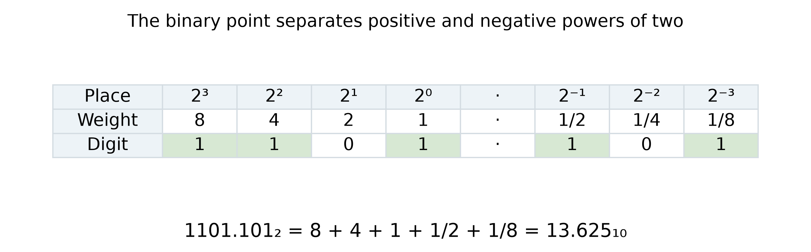
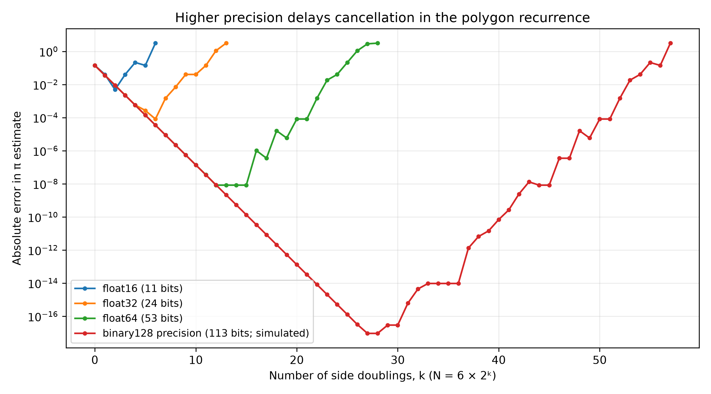

::: {.callout-note}
## Central question

**If the mathematics is correct, why can a calculation become less accurate when we take more steps?**
:::

## Learning outcomes

By the end of this lecture, you should be able to:

1. **Convert** simple integers and fractions between decimal and binary, and interpret a fixed-width signed integer.
2. **Recover** the exact stored value of a finite float from its integer ratio.
3. **Interpret** the sign, exponent, and fraction fields of binary32 and binary64, distinguishing range from precision.
4. **Explain** the polygon calculation's loss of accuracy and predict how higher precision changes it.

## Why did the error stop decreasing?

In L02, the polygon perimeter approached the circle circumference as we increased the number of sides. The geometry gave us a reasonable expectation: more sides should produce a better estimate of $\pi$. Yet the computed error eventually rose.

The mathematical recurrence had not changed. What changed was whether the computer could keep the small differences needed by that recurrence. Before returning to the polygon, we need to look at the numbers themselves.

### Your number is not necessarily what you see

Suppose we store three decimal values in Python. Predict the two outputs before running the code:

```python
print(0.1 + 0.2)
print(0.1 + 0.2 == 0.3)
```

Ordinary Python gives `0.30000000000000004` and `False`. This is not a failure of addition. The stored inputs are close to the decimal values we intended, but they are not exactly those values. The addition also has to round its result to an available floating-point number.

Even printing an input can hide that difference:

```python
x = 0.1
print(x)                  # 0.1
print(format(x, ".17g"))   # 0.10000000000000001
```

A short display is convenient to read. It is not a complete account of the stored value. More printed digits reveal the difference; they do not make the stored number more accurate.

There is a familiar decimal analogy. If we keep only four places in $1/3$, then $0.3333\times3=0.9999$. The finite approximation differs from the original fraction. This does **not** mean that $0.999\ldots$ with infinitely many nines differs from 1, or that Python must return `0.9999` for `(1/3)*3`.

## Seeing a number in binary

Modern digital computers represent information using bits, each written as 0 or 1. A group of bits can represent an integer, a floating-point number, text, or something else. We need to know the interpretation before the bits tell us a value.

### Decimal and binary place values

A decimal integer is a weighted sum of powers of ten:

$$
(374)_{10}=3\times10^2+7\times10^1+4\times10^0.
$$

Binary uses the same idea with powers of two:

$$
(1101)_2=1\times2^3+1\times2^2+0\times2^1+1\times2^0=13.
$$

To convert 13 to binary by hand, divide repeatedly by two and record the remainders:

| Division | Integer quotient | Remainder |
|---|---:|---:|
| $13/2$ | 6 | 1 |
| $6/2$ | 3 | 0 |
| $3/2$ | 1 | 1 |
| $1/2$ | 0 | 1 |

Read the remainders **from bottom to top**: `1101`. Check both directions with Python:

```python
bin(13)          # '0b1101'
int("1101", 2)   # 13
```

The prefix `0b` marks binary notation; it is not part of the digits.

Digits after the binary point represent $2^{-1},2^{-2},2^{-3},\ldots$. For example,

$$
(0.101)_2=\frac12+\frac18=0.625.
$$

{#fig-binary-places fig-alt="Binary 1101.101 has nonzero weights 8, 4, 1, one half, and one eighth, summing to 13.625."}

For the reverse conversion of a fraction, repeatedly multiply by two. Each integer part supplies the next binary digit; continue with the fractional remainder. For 0.625:

$$
0.625\times2=1.25,\qquad
0.25\times2=0.5,\qquad
0.5\times2=1.0.
$$

The integer parts give `101`, and the remainder is now zero. The conversion terminates. In contrast,

$$
0.1=(0.0001100110011\ldots)_2
$$

repeats forever. A fraction in lowest terms has a finite binary expansion only when its denominator is a power of two. Thus $3/4$ terminates, but $1/10$ does not.

::: {.callout-tip}
## Try the conversion

Write 0.75 in binary, then convert your result back to decimal. Would keeping more binary digits change the answer? How is this different from 0.1?
:::

### Four bits fit in one hexadecimal digit

Long binary strings are difficult to read. **Hexadecimal**, or base 16, groups four bits into one digit because $2^4=16$. Its digits are `0` to `9`, followed by `A` to `F` for values 10 to 15.

$$
(0010\ 1101)_2=(2D)_{16}=45.
$$

Python writes this as `0x2d`. Hexadecimal is a shorter way to write the same bits, not a different level of numerical precision.

### What about negative integers?

On paper we can simply write $-13=-(1101)_2$. Python's `bin(-13)` follows that convention and returns `'-0b1101'`. It does not show a fixed-width memory encoding.

A common fixed-width signed-integer encoding is **two's complement**. In eight bits, start with positive 13, invert the bits, then add 1:

```text
+13       00001101
invert    11110010
add 1     11110011   represents -13 as an eight-bit signed integer
```

To read it back, give the leading bit weight $-2^7$ and the remaining bits their ordinary positive weights:

$$
-128+64+32+16+2+1=-13.
$$

The same `11110011` interpreted as an **unsigned** integer is 243. Eight-bit two's complement covers $-128$ to $127$. Python's native `int` is different: it can grow to use more memory rather than having a fixed eight-, 32-, or 64-bit width.

## From a stored fraction to a floating-point number

Writing out every zero would be inconvenient for very large or very small numbers. Floating point uses binary scientific notation. For example,

$$
10240=(10100000000000)_2=(1.01)_2\times2^{13},
$$

while

$$
0.75=(0.11)_2=(1.1)_2\times2^{-1}.
$$

Both have short significant parts despite their different magnitudes. For any nonzero finite binary value, we can move the point to write

$$
x=\pm(1.Z)_2\times2^p.
$$

The exponent $p$ determines where the binary point belongs. The digits in $1.Z$ determine the significant part, called the **significand**. An actual storage format must limit both the exponent and the number of significant digits.

### Recover the value Python stored

Python supplies `as_integer_ratio()` for a finite float. It returns two integers whose ratio is **exactly the stored value**:

```python
x = 0.75
numerator, denominator = x.as_integer_ratio()
print(numerator, denominator)   # 3 4
print(bin(numerator))          # '0b11'
```

Since $4=2^2$, move the binary point in `11` two places left:

$$
\frac34=\frac{(11)_2}{2^2}=(0.11)_2=(1.1)_2\times2^{-1}.
$$

The same procedure works for other finite values:

1. Get the stored ratio $n/2^k$; keep the sign separately.
2. Convert $|n|$ to binary.
3. Move the binary point $k$ places left.
4. For a nonzero value, normalize it to $\pm1.Z\times2^p$.

The denominator may be 1 for a large integer. It may be a very large power of two for a small value. Neither changes the procedure. Zero is simply zero and has no leading nonzero digit to normalize.

For Python's `0.1`, the ratio is

$$
\frac{3602879701896397}{36028797018963968}
=\frac{3602879701896397}{2^{55}}.
$$

This is not $1/10$. The ratio recovers the approximation already stored; it does not recover digits lost when the input was rounded.

### Compare two storage precisions

NumPy lets us choose a floating-point type explicitly:

```python
import numpy as np

x32 = np.float32("0.1")
x64 = np.float64("0.1")
print(x32.dtype)       # float32
print(float(x32).as_integer_ratio())
# (13421773, 134217728)
```

Converting `x32` to Python's `float` here preserves its value exactly. It does not turn it into a more accurate approximation to 0.1. Its ratio gives

$$
\frac{13421773}{2^{27}}
=\frac{(110011001100110011001101)_2}{2^{27}}
=(1.10011001100110011001101)_2\times2^{-4}.
$$

Count from the leading 1: this binary32 value requires **24 significant binary digits**. Binary64 provides **53 significant bit positions**, but its stored approximation to 0.1 ends in a zero bit, so the reduced-ratio procedure needs only 52 digits to write that particular value. The format's capacity and the digits needed by one value are not always the same. Both formats store rounded versions of the repeating binary expansion of $1/10$.

::: {.quarto-wasm-local notebook="l03_stored_number.edit.py" title="Recover the exact stored number from its integer ratio" height="900" loading="eager" fullscreen="true"}
**Static example.** Both formats store 0.75 exactly as $3/4$. For 0.1, `float32` stores $13421773/2^{27}$, while `float64` stores $3602879701896397/2^{55}$. Convert the numerator to binary and shift the point by the denominator's exponent to recover each stored binary value.
:::

Start with 0.75, then 0.1. Next compare `1e20` and `1e-30`. Does a very large or very small magnitude necessarily require more significant bits?

## How IEEE stores the sign, exponent, and fraction

The IEEE 754 standard specifies common floating-point formats ([IEEE, 2019](../references.qmd#ref-ieee7542019)). For a **normal, finite** binary number,

$$
\boxed{x=(-1)^s\left(1+\frac{F}{2^t}\right)2^{E-b}}
$$

where $s$ is the sign bit, $E$ is the unsigned integer stored in the exponent field, $b$ is its bias, and $F$ is the unsigned integer formed by the $t$ stored fraction bits. The term $1+F/2^t$ is the same significand we wrote as $(1.Z)_2$.

| Format | Sign bits | Exponent bits | Fraction bits $t$ | Bias $b$ | Significant binary digits |
|---|---:|---:|---:|---:|---:|
| binary16 / `float16` | 1 | 5 | 10 | 15 | 11 |
| binary32 / `float32` | 1 | 8 | 23 | 127 | 24 |
| binary64 / `float64` | 1 | 11 | 52 | 1023 | 53 |

The leading 1 is implicit for normal numbers, so it does not require a stored bit. The exponent uses a **bias**, not two's complement. Floats also use a separate sign bit rather than the two's-complement integer encoding above.

For 0.75 in binary32,

```text
sign    exponent    fraction
0       01111110    10000000000000000000000
```

The stored exponent is $E=126$, so $p=126-127=-1$. The fraction contributes $1/2$. Reading the fields gives

$$
(+1)\times(1+1/2)\times2^{-1}=0.75.
$$

### Flip the bits yourself

Before each click, predict whether the value will change sign, change scale, or change by a small amount. The buttons below edit the actual bit pattern; the decimal value is decoded from that pattern.

::: {.quarto-wasm-local notebook="l03_float_bits.edit.py" title="Flip IEEE float32 and float64 bits and decode the decimal value" height="980" loading="eager" fullscreen="true"}
**Static example.** Binary32 stores 0.75 as `0 | 01111110 | 10000000000000000000000`. Flipping only the sign bit gives -0.75. Starting instead at 1, turning on the last fraction bit gives $1+2^{-23}$ in binary32 or $1+2^{-52}$ in binary64.
:::

1. Start at 0.75. Flip the sign bit, then restore it.
2. Change one fraction bit and one exponent bit separately. Compare their effects.
3. Reset to 1 and turn on the last fraction bit. Repeat in the other format.

### Range is not precision

The exponent mainly controls the **range** of magnitudes. The significand controls **precision**, or how closely neighbouring values can be distinguished. Binary32 provides roughly 7 significant decimal digits and binary64 roughly 16; neither has the same absolute spacing at every magnitude.

For normal values in the interval $[2^p,2^{p+1})$, the spacing is

$$
\Delta x=2^{p-t}.
$$

Near 1, that spacing is $2^{-23}$ for binary32 and $2^{-52}$ for binary64. Near larger powers of two, the spacing is larger. Use `np.finfo(np.float32).eps` to inspect the gap immediately above 1.

Some exponent patterns have special meanings:

| Stored exponent | Fraction | Interpretation |
|---|---|---|
| All zeros | Zero | Signed zero |
| All zeros | Nonzero | Subnormal: $(-1)^s(F/2^t)2^{1-b}$, with no implicit leading 1 |
| Neither all zeros nor all ones | Any | Normal finite value |
| All ones | Zero | Signed infinity |
| All ones | Nonzero | `NaN`, meaning “not a number” |

In the widget, reset to zero and turn on only the last fraction bit. For binary64, this produces the smallest positive value:

$$
2^{-52}\times2^{-1022}=2^{-1074}\approx4.94\times10^{-324}.
$$

That does not mean we have 324 significant decimal digits. Leading zeros locate the number; they are not significant digits. Subnormal numbers also have **less relative precision** as they approach zero. Python's ordinary `float` is normally binary64, with these same finite limits. Only its `int` can grow to use arbitrarily many digits, subject to available memory.

## Return to the polygon

Now we can identify what failed in L02. Recall

$$
s_{2N}=\sqrt{2-\sqrt{4-s_N^2}},
\qquad \pi_N=\frac{Ns_N}{2}.
$$

As $N$ increases, $s_N$ decreases. The inner square root becomes very close to 2. Subtracting two nearly equal values exposes the rounding error already present in the intermediate result. This is **cancellation**; it can leave few useful significant digits ([Goldberg, 1991](../references.qmd#ref-goldberg1991floating)).

A short binary64 calculation makes the issue visible:

```python
s = 1e-8
print(s * s)          # about 1e-16: easily representable
print(4.0 - s * s)    # 4.0: the small change is lost
```

The recurrence then returns $\sqrt{2-\sqrt4}=0$. The computer could represent the small side length by itself. It could not preserve the much smaller change to a number near 4.

### Does higher precision delay the breakdown?

Keep the recurrence unchanged and vary only the arithmetic precision. Predict which curve should improve longest before inspecting the plot.

{#fig-polygon-precision fig-alt="Polygon error first decreases and then increases for each precision; the minimum moves later and lower as precision increases."}

Here $k$ counts side doublings, so $N=6\times2^k$. The experiment gives:

| Arithmetic | Significant bits | Doubling with smallest observed error | Smallest absolute error | First doubling with zero side length |
|---|---:|---:|---:|---:|
| `float16` | 11 | 2 | $4.87\times10^{-3}$ | 6 |
| `float32` | 24 | 6 | $8.16\times10^{-5}$ | 13 |
| `float64` | 53 | 12 | $8.27\times10^{-9}$ | 28 |
| Simulated binary128 precision | 113 | 27 | $9.16\times10^{-18}$ | 57 |

The minimum is a practical indicator of when further refinement stops helping, not the first occurrence of rounding. **Higher precision delays the failure but does not eliminate cancellation.**

NumPy's `float128` is platform-dependent and unavailable on the Mac used for this test; `longdouble` here has the same precision as `float64`. The fourth curve uses mpmath with 113 significant binary bits to simulate binary128 precision. Its exponent limits are not simulated and are not reached here. Errors are measured against a 200-bit reference for $\pi$, not `np.pi`. Reproduce the experiment with `uv run scripts/polygon_precision.py`.

### About the error minimum

A useful estimate balances decreasing approximation error against growing round-off effects:

$$
E_{\mathrm{approx}}\approx A N^{-p},\qquad
E_{\mathrm{round}}\sim BuN^q,
\qquad
N_*\sim\left(\frac{A}{Bu}\right)^{1/(p+q)}.
$$

Here $u$ is the unit round-off, half the spacing above 1 under round-to-nearest arithmetic. The exponent $q$ depends on the algorithm; convergence rate $p$ alone cannot predict the minimum.

For this polygon recurrence, geometric error decreases as $N^{-2}$. The subtraction tries to recover a quantity of order $N^{-2}$ from numbers of order 1, giving a round-off error scale of roughly $uN^2$ in the estimate of $\pi$. Balancing these scales gives

$$
N_*\sim u^{-1/4},\qquad E_{\min}\sim\sqrt{u},
$$

with constants omitted. Four extra significant binary bits should therefore allow approximately one more side doubling before the error minimum. This is a scale estimate, not a prediction of every fluctuation in the curve. The geometric error continues to decrease beyond the minimum; the **total computed error** no longer follows it.

An alternative to adding precision is to change the formula. Rationalizing the subtraction gives the mathematically equivalent recurrence

$$
s_{2N}=\frac{s_N}{\sqrt{2+\sqrt{4-s_N^2}}}.
$$

It avoids the damaging subtraction and behaves much better at the same precision. The unstable recurrence, not the polygon geometry, caused the breakdown.

## Before the next lecture

1. If Python prints `0.1`, how would you find out what value is actually stored?
2. Why can binary64 represent a value near $10^{-300}$ while retaining only about 16 significant decimal digits?
3. Why does the polygon's binary64 error stop improving well before reaching 15 correct decimal digits?
4. In a materials calculation, two total energies may be large while their difference is small. What would you check before trusting the digits in that difference?

A **precision study** repeats the calculation at higher precision and compares the quantity that matters. Agreement is useful evidence; printing more digits is not. L04 turns to the other limit on large calculations: even when the accuracy is acceptable, how can we make the work finish in a reasonable time?
