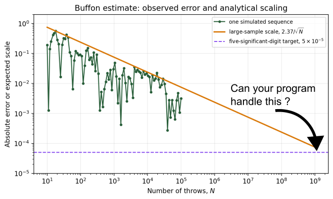
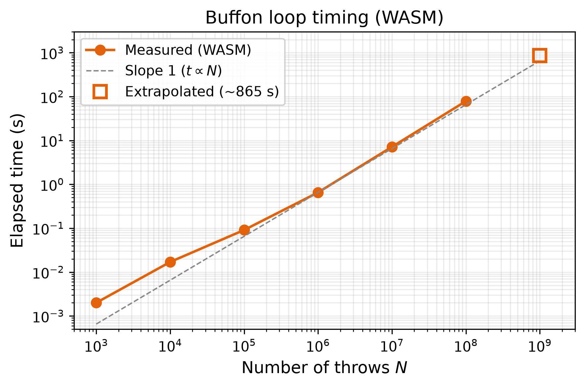
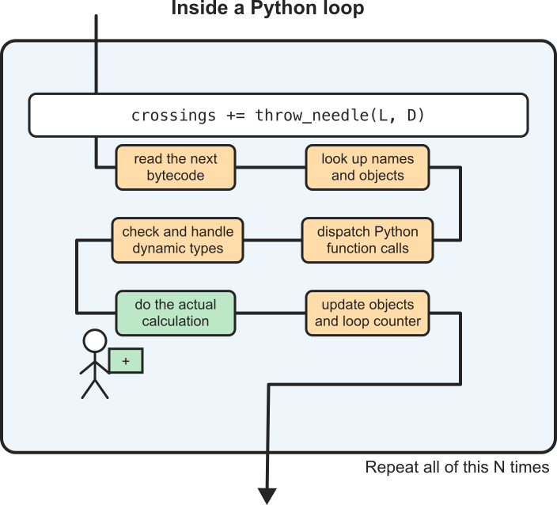
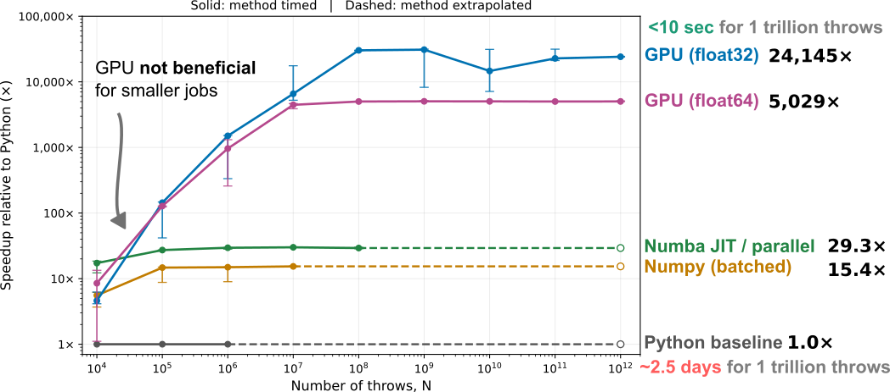

::: {.callout-note}
## Central question

**Given a numerical program, how can we make it run faster as the problem size grows?**
:::

## Learning outcomes

By the end of this lecture, you should be able to:

1. **Measure** execution time and estimate how computational cost scales with problem size $N$.
2. **Distinguish** a pure Python loop from four acceleration strategies: NumPy vectorization, Numba JIT compilation, multi-core CPU parallelism, and GPU acceleration.
3. **Analyze** the trade-off between memory use and execution speed in vectorized calculations.
4. **Explain** why JIT compilation incurs first-call warmup time and why parallel workers need independent random-number streams.
5. **Interpret** a speedup plot, distinguishing measured runtimes from extrapolated estimates.

## The motivation: from $10^6$ to $10^9$ steps

{#fig-buffon-roast fig-alt="A humorous illustration challenging the Buffon simulation to handle a very large number of throws." width="85%"}

In [L02](../L02/index.qmd), we learned that the sampling uncertainty in a Buffon's needle estimate of $\pi$ scales as

$$
\sigma_{\widehat{\pi}} \propto \frac{1}{\sqrt{N}}.
$$

When the needle length equals the line spacing, setting the typical uncertainty to $5 \times 10^{-5}$, the five-significant-digit target from L02, gives

$$
N \sim 10^9\ \text{throws}.
$$

Individual runs still fluctuate around $\pi$; this target describes one standard deviation.

*Question:* If we time a run with $10^5$ or $10^6$ throws, can we estimate how long $10^9$ throws would take?

The function below summarizes the L02 experiment. `throw_needle(L, D, rng)` simulates one needle and returns 1 if it crosses a line, or 0 otherwise. We pass in a random-number generator initialized before the experiment.

```python
def buffon_experiment_python(N, L, D, rng):
    crossings = 0
    for i in range(N):
        crossings += throw_needle(L, D, rng)
    return crossings
```

As in the Molab notebook, all `buffon_experiment_*` functions below return the integer crossing count $C$. We calculate $\widehat{\pi}=2LN/(DC)$ after counting, provided $C>0$.

Each needle throw is **independent** of the others, so we can later divide the throws among workers. In this sequential implementation, their runtimes add together. How long does one throw take?

### Measuring computation time in Python

Measuring how long a block of code takes is called **timing**. Repeating the measurement under controlled conditions is called **benchmarking**. **Profiling** goes one step further: it identifies which functions or lines consume the most time.

Use Python's `time.perf_counter()` to time a function call. Once `throw_needle` and `rng` are defined as shown in the next section:

```python
from time import perf_counter

N = 100_000
L = D = 1.0

start = perf_counter()
crossings = buffon_experiment_python(N, L, D, rng)
elapsed = perf_counter() - start
estimate = 2 * L / D * N / crossings
print(f"{elapsed:.4f} s total; {elapsed / N:.3e} s per throw")
```

::: {.callout-tip}
`time.perf_counter()` uses a high-resolution clock designed for measuring short intervals. Unlike a wall clock, it is not affected when the system time is adjusted, so it is a better choice than `time.time()` for measuring execution time. See the [Python documentation for `time.perf_counter()`](https://docs.python.org/3/library/time.html#time.perf_counter).
:::

To measure the computation itself, keep only the function call inside the timed interval. Put imports, print statements, and plots outside it.

### How long would a billion throws take?

We use the same crossing test as L02, setting the needle length $L$ and line spacing $D$ to 1. The function below implements `throw_needle(L, D, rng)` for $0<L\leq D$. By symmetry, we only need to sample the distance to the nearest line in $[0,D/2]$ and the angle in $[0,\pi/2]$.

```python
import math
import random

rng = random.Random(374)

def throw_needle(L, D, rng):
    distance = 0.5 * D * rng.random()
    angle = 0.5 * math.pi * rng.random()
    return int(distance <= 0.5 * L * math.sin(angle))
```

The random-number generator is initialized outside both functions. Each call to `throw_needle` returns either 0 or 1, and `buffon_experiment_python` adds these results to obtain the crossing count.

Use the demo below to measure the runtime. Move the slider to change $N$, and watch the total time and average time per throw.

::: {.quarto-wasm-local notebook="l04_speed_benchmark.edit.py" title="Time a Buffon loop" height="420" loading="eager" fullscreen="true"}
**Static fallback.** Time the Python experiment with `perf_counter()`, then divide elapsed seconds by $N$. For approximately linear scaling, multiplying $N$ by ten multiplies total time by ten while time per throw stays nearly constant.
:::

I used this browser notebook to record the elapsed time for several values of $N$. Your browser and device will affect the timings; compare the scaling as well as the absolute times.

### Scaling analysis

For a calculation with $N$ repeated steps, a simple runtime model is

$$
t_{\mathrm{total}} \approx N\,\langle t_{\mathrm{step}}\rangle + t_{\mathrm{overhead}},
$$

where $\langle t_{\mathrm{step}}\rangle$ is the average runtime per throw and $t_{\mathrm{overhead}}$ is the fixed cost of calling the function and setting up the loop. The random-number generator is initialized before the timer starts. A log–log plot of the measurements shows the **scaling** of computational time: how $t_{\mathrm{total}}$ changes as $N$ increases.

{#fig-wasm-scaling fig-alt="Log-log plot showing elapsed time vs N from 10^3 to 10^8, closely following a slope-1 reference line, with an extrapolated point at 10^9." width="75%"}

For large $N$, the fixed overhead $t_{\mathrm{overhead}}$ becomes small compared with the time spent throwing needles. We can therefore use the large-$N$ measurements to predict the runtime at $N\approx10^9$. Fitting a straight line to those data (we will learn linear fitting later in the course) and **extrapolating** to $10^9$ throws gives approximately 860 seconds, or about 14 minutes.

Fourteen minutes is feasible, but each Buffon throw requires very little work. A grain-growth sweep on a $1024\times1024$ grid or a molecular dynamics time step involves far more calculations.

## Why are Python loops slow?

Each pass through a Python loop involves more than the arithmetic we wrote. In CPython, the standard Python implementation, source code is first compiled to **bytecode**, which an **interpreter** executes. During the loop, it handles Python objects, checks their types, and dispatches operations and function calls. These tasks add overhead to every throw.

C and C++ programs are usually compiled to **native machine code** before execution. With the numerical types known during compilation, the compiler can generate instructions that operate directly on the stored numbers. NumPy lets us use this compiled approach from Python.

{#fig-python-overhead width="55%" fig-alt="Illustration of the interpreter overhead repeated during a Python loop."}

::: {.callout-important}
## Be careful with pure Python loops!

Most numerical methods repeat operations many times. A Python loop is often the clearest way to explain and test an algorithm, but a large workload usually runs faster when the repeated work is moved into compiled code.
:::

This is the catch behind our earlier advice to "just use Python." A loop that works well for a small test may take too long for tens of thousands of diffusion time steps or millions of interatomic-force calculations.

We will keep the Buffon model fixed and change its implementation to compare acceleration methods. You can return to these examples when your own program needs a speedup.

## Optimization 1: operate on arrays with NumPy

[NumPy](https://numpy.org/doc/stable/user/absolute_beginners.html) is widely used for numerical computing in Python. Its main data structure is an **array**: a collection of values stored with a common data type. A one-dimensional array can hold all our needle positions; a two-dimensional array can hold values on a simulation grid. Types such as `float32` and `float64` specify the binary representation discussed in [L03](../L03/index.qmd). A `float64` array stores each value in eight bytes, without a separate Python object for each number.

**Vectorization** means expressing a calculation through array operations. For example, `0.5 * d` multiplies every element of the array `d` by 0.5, and `np.sin(theta)` evaluates the sine of every angle in `theta`.

For Buffon's experiment, we can generate all positions and angles, compare them element by element, and count the crossings:

:::: {.columns}
::: {.column width="50%"}
### Python loop

Uses `throw_needle` and the generator `rng` defined above.

```python
def buffon_experiment_python(N, L, D, rng):
    crossings = 0
    for i in range(N):
        crossings += throw_needle(L, D, rng)
    return crossings
```
:::
::: {.column width="50%"}
### NumPy arrays

```python
import numpy as np

rng_np = np.random.default_rng(374)

def buffon_experiment_np(N, L, D, rng):
    d = 0.5 * D * rng.random(N)
    theta = 0.5 * np.pi * rng.random(N)
    return int(np.count_nonzero(
        d <= 0.5 * L * np.sin(theta)
    ))
```
:::
::::

Call the NumPy version with `buffon_experiment_np(N, L, D, rng_np)`. Here, `rng.random(N)` returns an array of $N$ random numbers. The comparison produces $N$ Boolean values (`True` or `False`), and `np.count_nonzero` counts the `True` entries.

The repeated work runs inside NumPy's compiled routines. The arrays above store numbers contiguously, and supported operations can use **SIMD** (Single Instruction, Multiple Data) instructions to process several numbers at once. See [NumPy's SIMD documentation](https://numpy.org/doc/stable/reference/simd/index.html).

Wrapping `throw_needle` with [`np.vectorize`](https://numpy.org/doc/stable/reference/generated/numpy.vectorize.html) would still call Python for each element. For a speedup, use array operations such as those above.

::: {.callout-caution}
## Check correctness before timing

Check that the implementations give the same crossing decisions for the same positions and angles. For random runs, compare estimates within sampling uncertainty: Python and NumPy use different random-number generators, so the same seed does not produce identical throws.
:::

Predict how the speedup will change with $N$, then measure both implementations below. Large runs need time and memory; $10^8$ throws may exceed your browser's memory limit.

::: {.quarto-wasm-local notebook="l04_numpy_comparison.edit.py" title="Python loop versus NumPy arrays" height="560" loading="lazy" fullscreen="true"}
**Static fallback.** Time both implementations at the same $N$, with $L=D=1$. The speedup is $t_{\mathrm{Python}}/t_{\mathrm{NumPy}}$. Both perform work proportional to $N$, but NumPy reduces the overhead per throw.
:::

### (Advanced topic) The memory trade-off and batching

The vectorized implementation stores all positions and angles at once. For $N=10^8$ throws:

- `d` uses $10^8\times8\ \text{bytes}=800\ \text{MB}$;
- `theta` uses another $800\ \text{MB}$;
- each temporary `float64` array uses $800\ \text{MB}$, and the Boolean comparison array uses $100\ \text{MB}$.

Here, $1\ \text{MB}=10^6$ bytes; $800\ \text{MB}$ is about $763\ \text{MiB}$. Peak memory depends on which temporary arrays coexist. At $N=10^9$, the positions and angles alone require 16 GB, before any temporary arrays. This can exhaust available memory.

**Batching** divides the throws into smaller groups. We reuse `buffon_experiment_np` to count each batch, then add the counts. Pass in `rng_np` so the generator advances across batches.

```python
def buffon_experiment_np_batched(N, L, D, rng, batch_size):
    crossings = 0
    for start in range(0, N, batch_size):
        chunk = min(batch_size, N - start)
        crossings += buffon_experiment_np(chunk, L, D, rng)
    return crossings
```

Memory use now scales with the batch size rather than $N$. Small batches add more Python calls; large batches need more memory and may make less effective use of the CPU cache. Measure several batch sizes to find which runs fastest on your computer.

In the interactive demo below, choose $N$ and a batch size, then press **Measure**. The demo runs the batched method for up to $10^9$ throws. To avoid a billion-throw Python loop or oversized arrays, it extrapolates the two reference timings from smaller runs and labels them in the plot.

::: {.quarto-wasm-local notebook="l04_numpy_batching.edit.py" title="Batch size and Buffon runtime" height="650" loading="lazy" fullscreen="true"}
**Static fallback.** Compare batch sizes from $10^3$ to $10^6$ at fixed $N$. Very small batches increase loop overhead; larger batches increase working memory. Estimate reference runtimes with $t(N)\approx t(N_0)N/N_0$, and distinguish these estimates from measured times.
:::

### Compare outside the browser

For the remaining comparisons, use the cloud-hosted [Molab notebook](https://molab.marimo.io/notebooks/nb_gicnC6P67qCcKoQTaM4u83). Its **Optimization 1** tab compares the Python loop, full-array NumPy, and batched NumPy on the same machine. Later tabs test compilation and hardware parallelism. Registration is required to duplicate and run the notebook; see the [course introduction](../../../introduction/index.qmd) for setup guidance.

::: {.content-visible when-format="html"}
[](https://molab.marimo.io/notebooks/nb_gicnC6P67qCcKoQTaM4u83)
:::
::: {.content-visible when-format="pdf"}
[Open in Molab](https://molab.marimo.io/notebooks/nb_gicnC6P67qCcKoQTaM4u83)
:::

---

## Optimization 2: Just-in-Time compilation with Numba

A numerical loop can spend much of its runtime on interpreter overhead. **Just-in-time (JIT) compilation** translates a function into native machine code when it is first called. Later calls with the same argument types reuse that compiled version.

[Numba](https://numba.readthedocs.io/en/stable/user/5minguide.html) provides JIT compilation for many numerical Python functions. The `@numba.njit` decorator requests compilation. In this example, we put the throw arithmetic inside the compiled loop and pass in a NumPy random-number generator.

:::: {.columns}
::: {.column width="50%"}
### Python loop

```python
def buffon_experiment_python(N, L, D, rng):
    crossings = 0
    for i in range(N):
        crossings += throw_needle(L, D, rng)
    return crossings
```
:::
::: {.column width="50%"}
### Compiled loop

```python
import numba

@numba.njit
def buffon_experiment_numba(N, L, D, rng):
    crossings = 0
    for i in range(N):
        d = 0.5 * D * rng.random()
        theta = 0.5 * math.pi * rng.random()
        crossings += int(
            d <= 0.5 * L * math.sin(theta)
        )
    return crossings
```
:::
::::

This implementation keeps only the current throw and crossing count in memory. It avoids allocating arrays of length $N$.

### Compare Python and JIT

In the notebook's **Optimizations 2 & 3** tab, run the comparison and inspect **Optimization 2**. Its speedup is measured relative to the Python loop. The compiled function uses `np.random.default_rng(374)`, initialized before timing.

::: {.callout-note collapse="true"}
## Why warmup matters

The first call includes compilation:

$$
T_{\text{first call}} = T_{\text{compile}} + T_{\text{run}}.
$$

For steady-state timing, compile with a small call before starting the timer. Our notebook records warmup separately and reports the median of three timed runs. If a program calls the function only once, compilation time belongs in its total cost.

This serial Numba example receives a NumPy generator and advances its state directly. The parallel version below uses separate random streams for its tasks. See [Numba's supported NumPy features](https://numba.readthedocs.io/en/stable/reference/numpysupported.html).
:::

---

## Optimization 3: multi-core CPU parallelization

Because Buffon's needle throws are independent, we can divide them among CPU cores and add the crossing counts. Independent sampling tasks in other Monte Carlo calculations can be divided in the same way.

Python offers [thread and process pools](https://docs.python.org/3/library/concurrent.futures.html); [mpi4py](https://mpi4py.readthedocs.io/en/stable/) supports MPI communication, and [Dask](https://docs.dask.org/en/stable/) schedules parallel and distributed work. Here we use [Numba's parallel JIT](https://numba.readthedocs.io/en/stable/user/parallel.html).

The notebook's `buffon_experiment_numba_parallel` uses `@numba.njit(parallel=True)` and `numba.prange` to distribute the throws. It handles any remainder when $N$ is not divisible by the worker count. We call it as follows:

```python
workers = 4  # Molab allocates four CPUs to this sandbox.
numba.set_num_threads(workers)
streams = np.random.SeedSequence(374).spawn(workers)
seeds = np.array(
    [stream.generate_state(1)[0] for stream in streams],
    dtype=np.uint32,
)
crossings = buffon_experiment_numba_parallel(N, L, D, seeds)
```

### Compare serial and parallel JIT

In the notebook's **Optimization 3** comparison, speedup is relative to the **serial JIT** loop. Increase the worker count from one to four. At small $N$, task setup and coordination can outweigh the time saved by sharing the work.

::: {.callout-warning}
## Give workers separate random streams

If every worker starts with the same seed, they repeat the same throws. The crossing count grows, but the repeated samples add no independent information. Our notebook uses [NumPy's `SeedSequence.spawn`](https://numpy.org/doc/stable/reference/random/parallel.html) to generate task seeds, including fresh seeds for later batches.
:::

---

## Optimization 4: hardware accelerators (GPUs)

A CPU has relatively few powerful cores suited to sequential work and branching. A **graphics processing unit (GPU)** has many arithmetic units designed to process large groups of data in parallel. Calculations with the same operation repeated across many values can benefit greatly. Matrix operations in machine learning and large language models are prominent examples.

.](../../../assets/L04-cpu-vs-gpu.png){#fig-cpu-gpu width="65%" fig-alt="Schematic showing a CPU with a few large cores and a GPU with many smaller processing units; the counts are illustrative."}

You do not need to write GPU kernels in this course. Many simulation packages already provide GPU implementations. Libraries such as [PyTorch](https://docs.pytorch.org/tutorials/beginner/basics/tensorqs_tutorial.html) also let us express GPU calculations through familiar array operations.

Here is the calculation used in the Molab demo. The generator is initialized outside the function with `torch.Generator(device="cuda").manual_seed(374)`. The input buffers are reused, and the crossing count stays on the GPU until the end.

```python
import torch
@torch.compile(fullgraph=True, dynamic=False)
def crossing_count_torch_compiled(u, v, ratio):
    return torch.sum(u <= ratio * torch.sin(0.5 * math.pi * v), dtype=torch.int64)

def buffon_experiment_pytorch_compiled(N, L, D, rng, batch_size, dtype=torch.float32):
    total = torch.zeros((), device="cuda", dtype=torch.int64)
    u = torch.empty(min(N, batch_size), device="cuda", dtype=dtype)
    v = torch.empty_like(u)
    for start in range(0, N, batch_size):
        chunk = min(batch_size, N - start)
        u[:chunk].uniform_(generator=rng)
        v[:chunk].uniform_(generator=rng)
        total += crossing_count_torch_compiled(u[:chunk], v[:chunk], L / D)
    return int(total.item())
```

The GPU generates the random samples, evaluates the sine, and counts the crossings. For $L=D$, the test is simply $u\leq\sin(\pi v/2)$ with $u,v$ uniform on $[0,1)$. Integer accumulation preserves the count even when the total number of throws is very large.

### The caveat: crossover size

Launching GPU work and synchronizing its result take time. Small arrays may finish faster on the CPU. As $N$ grows, the GPU can spread this overhead over more throws. The **crossover size** is where the GPU first becomes faster than the chosen CPU implementation; it depends on both the hardware and the code.

Our GPU speedup rises strongly between $10^4$ and $10^7$ throws. The GPU samples are generated on the device, so this benchmark avoids transferring large input arrays from CPU memory. The notebook synchronizes the GPU before and after timing to measure completed work.

---

## Final comparison: from days to seconds

The **Final speedup** tab compares four implementations: Python, batched NumPy, parallel Numba, and PyTorch GPU. The **Full simulation** tab extends the experiment to $10^{12}$ throws and lets you compare GPU `float32` and `float64` arithmetic. The **Class figure** tab contains the saved benchmark below.

{#fig-final-scaling width="100%" fig-alt="Speedup from 10,000 to one trillion throws. GPU speedup rises at small problem sizes and reaches about 24,000 times for float32 and 5,000 times for float64; batched NumPy reaches about 15 times and four-worker parallel Numba about 29 times."}

For one trillion throws, the measured Python time per throw predicts approximately **60 hours, or 2.5 days**. On the NVIDIA RTX PRO 6000 used here, the median GPU runtime was **8.99 seconds with float32** and **43.17 seconds with float64**. These correspond to approximately **24,000×** and **5,000×** speedup over the extrapolated Python baseline. The CPU comparison used Molab's four-CPU allocation.

The CPU methods were measured only at manageable sizes: Python through $10^6$, batched NumPy through $10^7$, and parallel Numba through $10^8$. Both GPU precisions were measured through $10^{12}$. Dashed curves assume that time per throw remains constant beyond the measured range. The timing whiskers show why we repeat benchmarks: a single fast or slow run can distort the apparent trend.

### Is float32 accurate enough here?

One float32 run with $10^{12}$ throws gave

$$
\widehat{\pi}=3.141592617,
\qquad
\sigma_{\widehat{\pi}}\approx2.4\times10^{-6}.
$$

Its absolute error is about $3.7\times10^{-8}$, well within the expected sampling variation. As discussed in [L03](../L03/index.qmd), float32 has machine epsilon of about $1.2\times10^{-7}$. This is the relative spacing near 1; it is not a fixed absolute error in every computed result. Here, float32 is used for the samples and crossing test, while the crossing count is accumulated as integers. The final division uses Python's double-precision float.

Float32 is adequate for this demonstration. Repeated runs still fluctuate on the scale of the sampling uncertainty; resolving smaller errors would require checking finite-precision bias.

The same implementation choices matter for diffusion time steps, grain-growth updates, and interatomic-force calculations. First check the calculation, then measure which part needs acceleration.

| Implementation | Repeated work | Main trade-off |
|---|---|---|
| **Python** | Interpreter executes the loop | Clear reference code; high per-step overhead |
| **NumPy arrays** | Compiled array operations | Full arrays require memory proportional to $N$ |
| **Batched NumPy** | Compiled operations on smaller arrays | Batch size balances memory use and loop overhead |
| **Numba JIT** | Compiled scalar loop | Compilation cost on first use |
| **Parallel Numba** | Independent compiled tasks across CPU cores | Coordination overhead and separate random streams |
| **PyTorch GPU** | Batched GPU generation, arithmetic, and counting | Launch overhead, GPU memory, and arithmetic precision |

[Download the class figure (PDF)](../../../assets/L04-final-scaling.pdf) · [Raw benchmark data](../../../data/L04-final-scaling.json)

---

## Summary of Unit 01

Across Unit 01, we covered:

1. **L01:** The three layers—mathematical model, numerical method, and computational simulation.
2. **L02:** Measuring error, distinguishing truncation from statistical sampling, and analyzing convergence ($N^{-p}$).
3. **L03:** Floating-point precision, machine epsilon, binary representation, and catastrophic cancellation.
4. **L04:** Making code practical—vectorization, memory batching, JIT compilation, multi-core parallelism, and GPU acceleration.

In Unit 02, we will use these tools to solve our first major class of engineering problems: finding roots and relaxed states in nonlinear materials systems.
