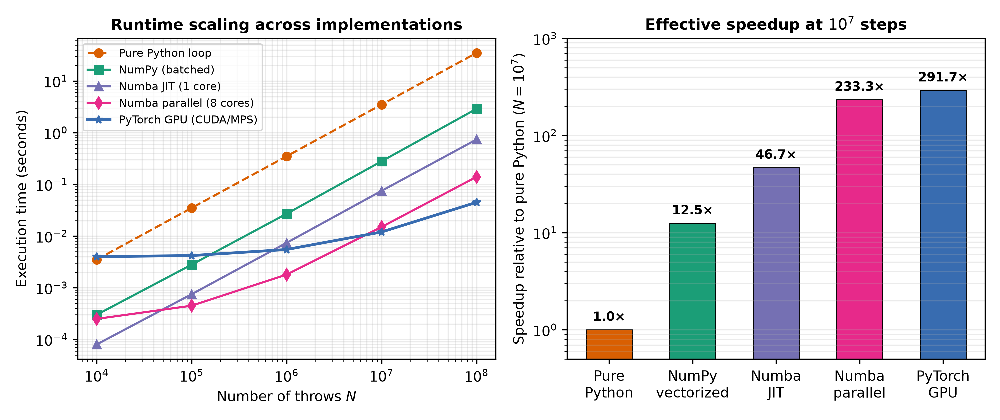

::: {.callout-note}
## Central question

**Given a typical numerical program, how can we make it run faster when problem sizes scale up?**
:::

## Learning outcomes

By the end of this lecture, you should be able to:

1. **Profile** execution time and estimate how computational cost scales with problem size $N$.
2. **Distinguish** five acceleration mechanisms: pure interpreted loops, NumPy array vectorization, Numba JIT compilation, multi-core CPU parallelism, and GPU hardware acceleration.
3. **Analyze** the trade-off between memory overhead and execution speed in vectorized calculations.
4. **Explain** why JIT compilation incurs first-call warmup latency and how random seeds must be managed across parallel workers.
5. **Connect** these acceleration paradigms to large-scale materials grid simulations, including the 2D Ising and Potts microstructure models.

## The motivation: from $10^6$ to $10^9$ steps

{#fig-buffon-roast fig-alt="A humorous illustration challenging the Buffon simulation to handle a very large number of throws." width="85%"}

In [L02](../L02/index.qmd), we learned that calculating numerical $\pi$ via Buffon's needle has a sampling error scaling as:

$$
\sigma_{\widehat{\pi}} \propto \frac{1}{\sqrt{N}}.
$$

For needle length equal to line spacing, setting the typical uncertainty to $5 \times 10^{-5}$ (the five-significant-digit target from L02) gives:

$$
N \approx \left(\frac{2.37}{5 \times 10^{-5}}\right)^2 \approx 2.3 \times 10^9\ \text{throws}.
$$

This is a one-standard-deviation estimate, not a guarantee that any particular run reaches the target.

*Question:* from a run with $10^5$ or $10^6$ throws, can you estimate how long $10^9$ throws would take?

The experiment in L02 can be simplified in Python as follows. The function `throw_needle(L, D)` randomly throws one needle and returns 1 if it crosses a line, or 0 otherwise. We can leave its details aside for now.

```python
def buffon_experiment(N: int, L: float, D: float):
    # Run independent needle throwing N times
    crossings = 0
    for i in range(N):
        crossings += throw_needle(L, D)
    estimate = 2 * L / D * N / crossings
    return estimate
```


As can be observed, each needle throw is **independent** of the others. In a sequential implementation, the time spent on the throws adds up. Independence will also let us divide the work later. The first question we want to ask is how long each step takes.

### Measuring computation time in Python

Measuring a block of code's elapsed time is called **timing**. Repeating measurements under controlled conditions is called **benchmarking**. **Profiling** tools help identify which functions or lines of code take the most computation time.

For simple timing, use Python's `time.perf_counter()` to measure elapsed time. For our Buffon experiment:

```python
from time import perf_counter

N = 100_000
L = D = 1.0

start = perf_counter()
estimate = buffon_experiment(N, L, D)
elapsed = perf_counter() - start
print(f"{elapsed:.4f} s total; {elapsed / N:.3e} s per throw")
```

::: {.callout-tip}
`time.perf_counter()` is designed for timing short intervals, with a high-resolution clock that is not affected by system-clock adjustments. This makes it a better choice than `time.time()` for measuring execution time. See the [Python timing documentation](https://docs.python.org/3/library/time.html#time.perf_counter).
:::

To measure the computation itself, keep only the function call inside the timed interval. Put imports, print statements, and plots outside it.

### How long would a billion throws take?

We use the same crossing test as L02, with needle length $L$ and line spacing $D$ both set to 1. Below is a simple implementation of `throw_needle(L, D)` for $L\leq D$. By symmetry, we sample the distance to the nearest line in $[0,D/2]$ and the angle in $[0,\pi/2]$.

```python
import math
import random

rng = random.Random(374)

def throw_needle(L: float, D: float) -> int:
    distance = 0.5 * D * rng.random()
    angle = 0.5 * math.pi * rng.random()
    return int(distance <= 0.5 * L * math.sin(angle))
```

The random-number generator is initialized outside both functions. Each call to `throw_needle` returns only 0 or 1, which `buffon_experiment` adds to the crossing count.

Use the demo below to measure the timing. Move the slider to change $N$ and see how the total time and average time per throw change.

::: {.quarto-wasm-local notebook="l04_speed_benchmark.edit.py" title="Time a Buffon loop" height="420" loading="eager" fullscreen="true"}
**Static fallback.** Time `buffon_experiment(N, L, D)` with `perf_counter()`, then divide elapsed seconds by $N$. For approximately linear scaling, multiplying $N$ by ten multiplies total time by ten while time per throw stays nearly constant.
:::

On a browser notebook like this, I recorded the following timing:

| Throws, $N$ | WASM elapsed time (s) | Average time per throw (µs) |
|---:|---:|---:|
| $10^3$ | 0.0020 | 2.00 |
| $10^4$ | 0.0170 | 1.70 |
| $10^5$ | 0.0910 | 0.91 |
| $10^6$ | 0.6530 | 0.65 |
| $10^7$ | 7.1560 | 0.72 |
| $10^8$ | 78.6260 | 0.79 |

### Scaling analysis

A simple runtime model is

$$
t_{\mathrm{total}} \approx N\,\langle t_{\mathrm{step}}\rangle + t_{\mathrm{overhead}},
$$

where $\langle t_{\mathrm{step}}\rangle$ is the per-throw cost and $t_{\mathrm{overhead}}$ is a fixed startup cost (function call, loop setup, final division — the random-number generator is initialized before the timer starts). Since the entire $N = 10^3$ run finishes in 2 ms, the overhead is negligible compared with the computation at large $N$.

A log–log plot of the measured data reveals the scaling directly:

{#fig-wasm-scaling fig-alt="Log-log plot showing elapsed time vs N from 10^3 to 10^8, closely following a slope-1 reference line, with an extrapolated point at 10^9." width="75%"}

On a log–log plot, $t \propto N$ is a straight line with slope 1. The measured points track this reference line closely: the scaling is approximately linear with the per-throw cost around $0.65$–$0.79\ \mu$s. The slight curvature at small $N$ reflects engine warmup; the mild steepening at large $N$ may reflect thermal throttling or garbage-collection pauses.

### Extrapolating to $10^9$ throws

From $10^6$ onward, each tenfold increase in $N$ multiplies the runtime by about $11\times$. Extrapolating from the largest measurement:

$$
t(10^9) \approx 78.6\ \text{s} \times 11 \approx 860\ \text{s} \approx \mathbf{14\ \text{min}}.
$$

Fourteen minutes in a browser notebook is feasible but slow, and this is only the Buffon experiment. A grain-growth simulation on a $1024\times1024$ grid or a molecular dynamics calculation performs far more work per step.

*Check:* what could make this extrapolation unreliable? Consider thermal throttling over a 14-minute run, memory-access patterns, and competition from other browser tabs.

## Why are Python loops slow?

Python is excellent for prototyping and versatile for scientific calculations. But a tight numerical loop in the standard Python interpreter does more than the arithmetic we wrote down. It executes bytecode, handles dynamically typed objects, dispatches function calls, and manages the loop counter at every iteration.

For a small amount of work per throw, that overhead can be a substantial part of the runtime. We have measured total time here, not profiled its breakdown, so we cannot assign a percentage to interpreter overhead.

::: {.callout-important}
## A loop is not the problem; where it runs matters

Most numerical methods involve repeated operations. Python loops are useful for explaining and testing an algorithm, but large numerical workloads often benefit from moving those loops into compiled code. Measure first: a loop that already finishes quickly may need no optimization.
:::

For a grain-growth simulation on a $2048\times2048$ grid or a calculation of millions of interatomic forces, execution speed can decide whether the calculation is practical.

We will keep the Buffon probability model fixed and change its implementation. You do not need to memorize every trick; return to these examples when your own program needs a speedup. A better mathematical method for calculating $\pi$ would be a separate, often larger improvement.

## Optimization 1: operate on arrays with NumPy

The crossing test is the same for every throw. Instead of executing it in a Python loop, **vectorization** expresses it as operations on entire arrays of numbers:

```python
import numpy as np

def buffon_numpy(N: int) -> int:
    rng = np.random.default_rng(374)
    d = 0.5 * rng.random(N)
    theta = 0.5 * np.pi * rng.random(N)
    crossings = np.count_nonzero(d <= 0.5 * np.sin(theta))
    return int(crossings)
```

The loop has not disappeared: it runs inside NumPy's compiled routines. These arrays store numbers contiguously, and some operations can use SIMD (Single Instruction, Multiple Data) instructions. Array notation does not automatically mean multiple CPU cores or a GPU.

*Check before comparing speed:* both implementations should give a crossing fraction near $2/\pi$. Their random generators differ, so the same seed does not mean identical throws or exactly equal crossing counts.

### The memory trade-off and batching

Vectorization is fast, but it is not free: it trades **memory for speed**. 

For $N = 10^8$ binary64 (`float64`) numbers:
- `d` takes $10^8 \times 8\ \text{bytes} = 800\ \text{MB}$;
- `theta` takes $800\ \text{MB}$;
- intermediate sine evaluation and boolean masks take several hundred additional megabytes.

Attempting to allocate $N = 10^9$ elements at once would demand over 10 GB of RAM, causing memory errors or slow disk swapping. The engineering solution is **batching** (chunking):

```python
def buffon_numpy_batched(N: int, batch_size: int = 1_000_000) -> int:
    rng = np.random.default_rng(374)
    remaining = N
    crossings = 0
    while remaining > 0:
        cur = min(remaining, batch_size)
        d = 0.5 * rng.random(cur)
        theta = 0.5 * np.pi * rng.random(cur)
        crossings += int(np.count_nonzero(d <= 0.5 * np.sin(theta)))
        remaining -= cur
    return crossings
```

Batching makes working memory scale with the batch size rather than total $N$. With batches of $10^6$, `d` and `theta` together occupy about 16 MB; temporary arrays require additional memory.

*Predict:* if available RAM stays fixed but $N$ increases a thousandfold, which quantity must remain bounded: the total throw count or the batch size?

---

## Optimization 2: Just-in-Time compilation with Numba

What if your algorithm cannot be neatly vectorized with array operations—for example, when each step depends on the previous step?

We can keep the transparent `for` loop and compile it directly to native machine code at runtime using **Numba**:

```python
import numba
import numpy as np

@numba.njit(fastmath=True)
def buffon_numba(N: int, seed: int = 374) -> int:
    np.random.seed(seed)
    crossings = 0
    for _ in range(N):
        d = 0.5 * np.random.random()
        theta = 0.5 * np.pi * np.random.random()
        if d <= 0.5 * np.sin(theta):
            crossings += 1
    return crossings
```

### Is it really fast?

Yes: Numba uses LLVM to generate optimized machine instructions, achieving speeds comparable to native C or Fortran with **$O(1)$ memory overhead** (no large arrays allocated).

However, two critical engineering factors must be understood:

1. **JIT compilation latency (warmup):**  
   The first time `buffon_numba` is called, Numba must inspect the argument types, compile LLVM IR, and generate machine code:
   $$
   T_{\text{first call}} = T_{\text{compile}} + T_{\text{run}}.
   $$
   Subsequent calls reuse the compiled machine code in memory ($T_{\text{later}} \approx T_{\text{run}}$). In benchmarking, always run a small "warmup" call first to measure pure execution time.

2. **Random seeds in compiled code:**  
   Notice `np.random.seed(seed)` inside the function. Numba maintains its own internal random number generator state separate from Python's global state.

---

## Optimization 3: multi-core CPU parallelization

Modern computers have multiple physical CPU cores (typically 4 to 64 cores). Because each needle throw in Buffon's experiment is completely independent, we can divide the work across cores:

```python
@numba.njit(parallel=True, fastmath=True)
def buffon_numba_parallel(N: int, n_threads: int, base_seed: int = 374) -> int:
    chunk = N // n_threads
    crossings = 0
    for t in numba.prange(n_threads):
        # Distinct random seed per thread is essential!
        np.random.seed(base_seed + t)
        local_c = 0
        for _ in range(chunk):
            d = 0.5 * np.random.random()
            theta = 0.5 * np.pi * np.random.random()
            if d <= 0.5 * np.sin(theta):
                local_c += 1
        crossings += local_c
    return crossings
```

::: {.callout-warning}
## Parallel random seed trap
If every worker thread initialized the same random seed, each thread would generate the exact same sequence of needle throws! You would do $4\times$ or $8\times$ the work to compute the exact same numbers. In parallel stochastic calculations, **each worker must receive an independent random stream**.
:::

---

## Optimization 4: hardware accelerators (GPUs)

A CPU contains a few powerful cores optimized for sequential logic and branching. A **Graphics Processing Unit (GPU)** contains thousands of smaller, simpler cores designed for massive data-parallel throughput:

```python
import torch

def buffon_pytorch_gpu(N: int, device: str = "cuda", batch_size: int = 5_000_000) -> int:
    dev = torch.device(device)
    remaining = N
    total_crossings = 0
    while remaining > 0:
        cur = min(remaining, batch_size)
        d = 0.5 * torch.rand(cur, device=dev)
        theta = 0.5 * torch.pi * torch.rand(cur, device=dev)
        total_crossings += (d <= 0.5 * torch.sin(theta)).sum().item()
        remaining -= cur
    if dev.type == "cuda":
        torch.cuda.synchronize()
    return total_crossings
```

### The crossover size

A GPU requires transferring instructions and synchronizing data between host CPU memory and device GPU memory (PCIe bus latency). 

For small $N \le 10^4$, launching a GPU kernel can be *slower* than a simple CPU loop! But as $N$ climbs toward $10^7$ or $10^8$, the GPU outpaces CPU cores by orders of magnitude. The problem size where the GPU becomes faster is called the **crossover size**.

---

## Performance benchmark summary

{#fig-benchmark-scaling fig-cap="Performance benchmark comparing five implementation strategies on modern hardware."}

| Implementation | Primary mechanism | Best suited for | Key limitation / trade-off |
|---|---|---|---|
| **Pure Python** | Interpreted bytecode | Quick prototyping | High interpreter overhead |
| **NumPy array** | Precompiled C/SIMD arrays | Expressive vectorized math | High memory consumption ($O(N)$) |
| **Numba JIT** | LLVM machine code | Loops that cannot be vectorized | First-call compilation delay |
| **Numba parallel** | Multi-threaded CPU (`prange`) | Independent CPU chunks | Thread coordination & PRNG stream care |
| **PyTorch GPU** | Thousands of accelerator cores | Massive data-parallel arrays | Launch overhead & memory transfer |

---

## Materials connection: 2D Ising & Potts microstructure simulation

Why do these acceleration strategies matter in materials science?

Consider the **2D Ising model**, the foundation of magnetic domain evolution, order–disorder transitions in binary alloys, and grain growth (Potts model).

Each site on an $L \times L$ square lattice represents an atomic spin or species $s_i \in \{-1, +1\}$. The total energy is:

$$
E = -J \sum_{\langle i, j \rangle} s_i s_j.
$$

Under the Metropolis Monte Carlo algorithm, individual spin updates depend on the 4 nearest neighbors. If updated sequentially in a double Python loop for a $1024 \times 1024$ lattice (over 1 million sites), one single sweep can take seconds!

### Checkerboard decomposition

Notice that on a square lattice, the sites can be divided into a **checkerboard** of black ($i+j$ even) and white ($i+j$ odd) sites:
- All neighbors of a black site are white sites.
- All neighbors of a white site are black sites.

Because black sites do not interact directly with each other, **all black sites can be updated simultaneously in parallel**, followed by all white sites! 

This checkerboard decomposition allows us to transform a sequential materials simulation into a massively parallel GPU kernel running millions of updates per second.

::: {.quarto-wasm-local notebook="l04_ising_gpu.edit.py" title="2D Ising microstructure evolution" height="750" loading="eager" fullscreen="true"}
**Static fallback.** Checkerboard Metropolis Monte Carlo simulation showing magnetic domain coarsening at and below the critical temperature $T_c \approx 2.269\ J/k_B$.
:::

---

## Run on Molab (Live GPU & JIT Environment)

Browser-based WASM runs inside your client's web browser on a single thread. To run genuine multi-core Numba compilation and PyTorch GPU hardware acceleration, use the hosted Molab notebooks:

::: {.callout-tip}
## Live Molab interactive notebooks

1. [**Buffon Speed Benchmark on Molab**](https://molab.marimo.io/?from=github&url=https://github.com/tiangroup-uofa/mate374-cmpt-methods-mate/blob/main/activities/l04_speed_benchmark.molab.py)  
   Test live Numba JIT compilation, multi-threaded `prange`, and PyTorch CUDA tensors.
2. [**Massive-Scale 2D Ising Microstructure on GPU**](https://molab.marimo.io/?from=github&url=https://github.com/tiangroup-uofa/mate374-cmpt-methods-mate/blob/main/activities/l04_ising_gpu.molab.py)  
   Simulate up to $2048 \times 2048$ lattices (over 4.2 million spins) with real-time domain coarsening on accelerator hardware.
:::

---

## Summary of Unit 01

Across Unit 01, we established the fundamental computational mindset for materials engineers:

1. **L01:** The three layers—mathematical model, numerical method, and computational simulation.
2. **L02:** Measuring error, distinguishing truncation from statistical sampling, and analyzing convergence ($N^{-p}$).
3. **L03:** Floating-point precision, machine epsilon, binary representation, and catastrophic cancellation.
4. **L04:** Making code practical—vectorization, memory batching, JIT compilation, multi-core parallelism, and GPU acceleration.

In Unit 02, we will use these tools to solve our first major class of engineering problems: finding roots and relaxed states in nonlinear materials systems.
