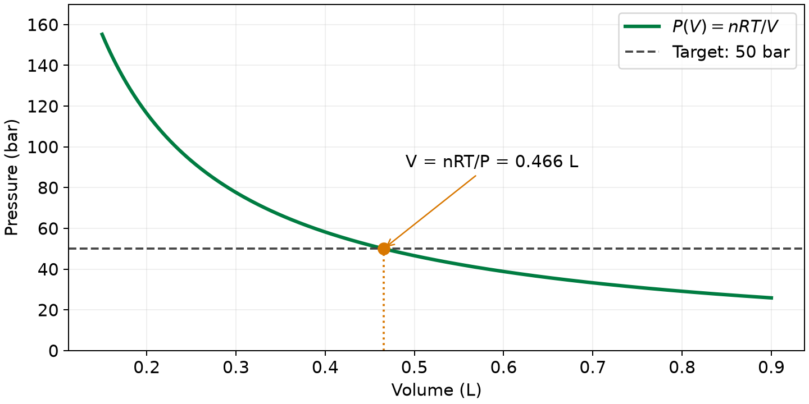
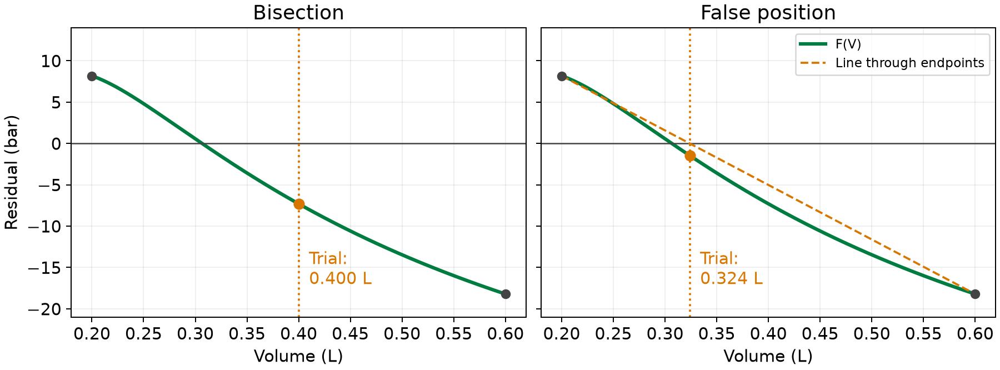

::: {.callout-note}
## Central question

**Given a function $f(x)$, how can we numerically find an $x$ for which $f(x)=0$?**
:::

## Learning outcomes

By the end of this lecture, you should be able to:

1. **Formulate** a root-finding problem from an equation and a desired physical condition.
2. **Explain** why continuity and a sign change guarantee a root inside an interval.
3. **Trace** the steps of bisection and estimate how many halvings are needed for a specified interval width.
4. **Compare** grid search, bisection, and false position by how they choose trial points and how quickly they approach a root.

## If we compress a gas, what is its volume?

::: {.callout-note appearance="simple" style="font-size: 1.15em;"}
Suppose we compress a certain amount of gas at a given temperature and pressure. **What volume will it occupy?**
:::

Many of you have already met the **ideal gas law** in high school or earlier university courses:

$$
PV=nRT.
$$

Let's take **1 mol of gas at 280 K and 50 bar**. Using $R=0.0831446$ L bar mol⁻¹ K⁻¹, how would you solve for $V$?

- **The natural way is to rearrange the equation:**

  $$
  V=\frac{nRT}{P_{\mathrm{target}}}
  =\frac{1\times0.0831446\times280}{50}\ \mathrm{L}
  \approx\boxed{0.466\ \mathrm{L}}.
  $$

- **There is another way: read the answer from a graph.** Plot pressure as a function of volume,

  $$
  P(V)=\frac{nRT}{V},
  $$

  then draw a horizontal line at **50 bar**. Where does that line cross the curve? At about **$V=0.466$ L**, the same answer.

{#fig-ideal-gas fig-alt="Ideal-gas pressure versus volume for one mole at 280 K. The curve intersects the 50 bar horizontal line at about 0.466 litres." width="80%"}

What have we done? In both methods, we started with $P=f(V)$.

1. The first method finds an **inverse function**, $V=f^{-1}(P)$.
2. The second searches the graph for the volume that gives our desired pressure. This **graphical approach** is closer to what we will do numerically.

Rearranging works well here. But can we always invert a function so easily?

## A slightly more complicated gas law

Let's replace the ideal gas law with the **van der Waals equation of state (EOS)**. Experiments had shown that real gases depart from ideal-gas behaviour, especially under compression and near condensation. In **1873**, Johannes Diderik van der Waals proposed an equation that accounted for molecular size and attraction ([Nobel Prize biography](https://www.nobelprize.org/prizes/physics/1910/waals/biographical/)):

$$
\boxed{\left(P+\frac{an^2}{V^2}\right)(V-nb)=nRT.}
$$

The parameters $a$ and $b$ account for intermolecular attraction and molecular size. Here $V$ is the total volume of $n$ moles, which is why we need both the $n^2$ and $n$ terms. See [Poling, Prausnitz, and O'Connell (2001)](../references.qmd#ref-poling2001properties) for the equation of state.

If we write pressure as a function of volume, we get

$$
P(V)=\frac{nRT}{V-nb}-\frac{an^2}{V^2},
\qquad V>nb.
$$

In principle, we could rearrange this into a cubic equation in $V$ and use a formula for its roots. **Hint: how many roots should a cubic have? Do they all have to be real, physical volumes?**

You can already see that the algebra is getting harder! But calculating $P(V)$ for a trial volume is still easy.

To turn the pressure condition into a **root-finding problem**, subtract the pressure we want:

$$
\boxed{F(V)=P(V)-P_{\mathrm{target}}=0.}
$$

We call $F(V)$ the **residual**. A positive residual means the calculated pressure is too high; a negative one means it is too low. We want to find a volume where this difference is zero. For van der Waals, keep the search at $V>nb$; the pressure is undefined at $V=nb$.

## First try: grid search

If we have an idea of where the root might be, why not just try a set of volumes? Divide a search interval into $N$ equal parts, calculate the residual at each grid point, and choose the volume whose residual is closest to zero.

This **grid search** takes only a few lines in NumPy:

```{.python code-fold="false"}
V_grid = np.linspace(V_left, V_right, N + 1)
F_grid = F(V_grid)
V_estimate = V_grid[np.argmin(np.abs(F_grid))]
```

The absolute value matters: we want the residual **closest to zero**, rather than the most negative residual. But does this ensure that we have found a root?

### Where would you search?

Start with the ideal gas law in the demo below. Estimate the volume from the graph, then increase $N$. Switch to van der Waals with the same temperature and pressure. How many intersections can you see now?

::: {.quarto-wasm-local notebook="l05_vdw_root_finding.edit.py" view="app" title="Find gas volumes with a grid search" height="650" loading="eager" fullscreen="true"}
**Static example.** For one mole of CO₂ at 280 K and 50 bar, the ideal gas law gives $V\approx0.466$ L. With $a=3.592$ L² bar mol⁻² and $b=0.04267$ L mol⁻¹, van der Waals gives three roots near 0.0877, 0.1141, and 0.3066 L. A coarse grid can miss the two closely spaced intersections.
:::

How much work does it take to make the grid finer?

For an interval $[a,b]$, the spacing is

$$
\Delta x=\frac{b-a}{N}.
$$

To make the spacing no larger than $\varepsilon_x$, we need

$$
N\geq\frac{b-a}{\varepsilon_x}.
$$

Every extra decimal place needs about ten times as many grid intervals. NumPy makes the evaluations fast, as we saw in L04, but it does not change how many points this search needs.

::: {.callout-important}
## Have we actually found a root?

There is another problem: `argmin` will always pick a point, **even if the function has no root in the interval**. Being the closest sampled value to zero is not enough. Can we find a better way to establish that a root is there?
:::

## A sign change gives us a bracket

Look at a curve that crosses zero. On one side of the crossing it is positive; on the other it is negative. If we can find two points with opposite signs, can we be sure there is a root between them?

::: {.callout-tip}
## Intermediate Value Theorem

If $f$ is **continuous** on $[a,b]$ and $f(a)f(b)<0$, there is **at least one root** inside the interval.
:::

This is the basis of **bracketing methods**, also called **bounded** or **closed-domain methods** for root finding. Continuity matters: a jump or a vertical asymptote can change the sign without passing through zero.

There are two stages. First, find a bracket where the root must lie. A graph or coarse grid search can help with this. Then refine the estimate while keeping a sign-changing bracket.

What would a typical bounded method need?

1. The function $f$ and an initial search boundary $[a,b]$.
2. An upper limit $N_{\max}$ on the number of iterations.
3. A tolerance specifying when the estimate is accurate enough.

In Python, we could give these methods a common interface:

```{.python code-fold="false"}
def root_finding(f, boundary, N_max, tolerance):
    # Refine the estimate inside the bracket.
    # Stop when the chosen tolerance is met, or report non-convergence.
    ...
    return x_s, converged
```

Here `x_s` is the root estimate, and `converged` tells us whether the tolerance was met.

The **tolerance can take different forms**:

- **Absolute residual tolerance:** require $|F(V)|<\varepsilon_P$. For example, the calculated pressure must be within 0.001 bar of the target.
- **Relative residual tolerance:** compare the residual with the target pressure, $|F(V)|/P_{\mathrm{target}}<\varepsilon_{\mathrm{rel}}$. This measures the pressure mismatch as a fraction of the target.
- **Root tolerance:** measure the change in the estimated volume, $|V_k-V_{k-1}|<\varepsilon_V$, instead of the pressure residual. In bisection, we can also stop when the remaining volume bracket is sufficiently narrow.

Choose the quantity and tolerance that fit the accuracy you need.

Here $a$ and $b$ denote interval endpoints; they are separate from the gas parameters in the EOS.

## Bisection: take half each time

The simplest way to refine the bracket is the **bisection method**. Its algorithm works as follows:

1. Start with $[a,b]$. If either endpoint has $f=0$, we have already found a root. Otherwise, check that $f(a)f(b)<0$. If the signs are the same, we need another bracket; this test alone does not tell us whether roots exist inside.
2. Calculate the midpoint as our trial solution:

   $$
   x_s=\frac{a+b}{2}.
   $$

3. Evaluate $f(x_s)$. If it is zero, stop. Otherwise, which half keeps the sign change?
   - If $f(a)f(x_s)<0$, keep $[a,x_s]$.
   - If $f(a)f(x_s)>0$, keep $[x_s,b]$.
4. Use that half as the new interval $[a,b]$.
5. Check the tolerance. If it is met, stop and report the midpoint of the remaining bracket. Otherwise, return to step 2, up to $N_{\max}$ iterations.

Why does this work? Each time we throw away half the interval, the remaining half still has opposite signs at its endpoints. For a continuous function, the root stays inside.

We also know how quickly the interval shrinks. After $k$ halvings of the original interval $[a_0,b_0]$,

$$
\text{bracket width}=\frac{b_0-a_0}{2^k}.
$$

So, to get a bracket no wider than $\varepsilon_x$, we need

$$
\boxed{k\geq\left\lceil\log_2\left(\frac{b_0-a_0}{\varepsilon_x}\right)\right\rceil.}
$$

The midpoint is then at most $\varepsilon_x/2$ from a root. This bounds the error in **$x$**; we check $|f(x_s)|$ separately if we also require a residual tolerance.

For example, shrinking a 0.4 L interval to a width of $10^{-6}$ L takes **19 halvings**. A uniform grid with that spacing needs **400,000 intervals**. Bisection's predictable convergence makes it one of the most reliable root-finding methods ([Kiusalaas, 2013](../references.qmd#ref-kiusalaas2013)).

### Try bisection on the gas problem

Return to one mole of CO₂ at 280 K and 50 bar. Start with $[0.2,0.6]$ L. Before increasing the step number, predict which half we will keep.

::: {.quarto-wasm-local notebook="l05_bisection.edit.py" view="app" title="Step through bisection on the van der Waals equation" height="570" loading="lazy" fullscreen="true"}
**Static example.** Here $F(0.2)>0$ and $F(0.6)<0$.

| Step | Trial volume (L) | Sign of $F$ | Retained bracket (L) |
|---:|---:|---|---|
| 1 | 0.400 | negative | $[0.200,0.400]$ |
| 2 | 0.300 | positive | $[0.300,0.400]$ |
| 3 | 0.350 | negative | $[0.300,0.350]$ |

The large-volume root is approximately 0.3066 L.
:::

Compare a few halvings with the grid search. How much of the original interval remains after five steps?

## Can we choose a better point than the midpoint?

Bisection works, but it uses only the **signs** of the endpoint values. Could their magnitudes help us choose a better trial point?

**Regula falsi**, or **false position**, is one of the oldest recorded approaches to solving equations. Ancient Egyptian scribes used false position in arithmetic problems recorded in the Rhind Mathematical Papyrus, around 1650 BCE ([history of false position](https://en.wikipedia.org/wiki/Regula_falsi#History)).

The modern bracketed method draws a straight line through $(a,f(a))$ and $(b,f(b))$ ([Kiusalaas, 2013](../references.qmd#ref-kiusalaas2013)). If the function is approximately linear near the root, the zero of this line should be a useful estimate:

$$
\boxed{x_s=\frac{af(b)-bf(a)}{f(b)-f(a)}.}
$$

{#fig-false-position fig-alt="Two panels of the same van der Waals residual on 0.2 to 0.6 litres. Bisection tests 0.4 litres; false position tests about 0.324 litres, using a line through the endpoints." width="100%"}

We then keep the subinterval containing the sign change, just as before. The only change in the algorithm is how we choose $x_s$.

Switch the previous demo to **False position** and compare the first few steps. Does the new trial point land closer to the root? It can, especially when the curve is nearly straight. With strong curvature, however, one endpoint can remain fixed for many steps, making false position slower than bisection.

::: {.callout-note}
The useful idea is that we can **approximate the function itself** to guide the search.
:::

In L06, the secant and Newton-Raphson methods will use an estimated slope or a derivative to choose the next point.

## What do we use in SciPy?

There are several improved bracketing methods. We will use their implementations without deriving every variant. SciPy's [`root_scalar`](https://docs.scipy.org/doc/scipy/reference/generated/scipy.optimize.root_scalar.html) provides a common interface ([Virtanen et al., 2020](../references.qmd#ref-virtanen2020scipy)). Its bracketed methods include:

| Method name | Algorithm |
|---|---|
| `bisect` | Bisection |
| `brentq` | Brent's method, combining bisection with interpolation |
| `brenth` | A variant of Brent's method |
| `ridder` | Ridder's method |
| `toms748` | TOMS Algorithm 748 |

All five take a function and a sign-changing `bracket`, with optional `xtol`, `rtol`, and `maxiter` controls.

::: {.callout-tip}
## How do I use it?

If you are unsure how to call the function, read the [SciPy documentation](https://docs.scipy.org/doc/scipy/reference/generated/scipy.optimize.root_scalar.html), or use Python's `help()` function:

```{.python code-fold="false"}
from scipy.optimize import root_scalar
help(root_scalar)
```
:::

For example:

```{.python code-fold="false"}
from scipy.optimize import root_scalar

result = root_scalar(
    F, bracket=[0.2, 0.6], method="brentq",
    xtol=1e-6, maxiter=100,
)
print(result.root, result.converged)
print(F(result.root))
```

`xtol` is an absolute tolerance in the input variable, so here it is in litres. `rtol` sets a relative tolerance. Check `converged` and the residual when reading the result.

Can changing just the method reduce the work? Choose a method below. Keep the bracket and tolerance fixed, then compare the number of **function evaluations** needed to reach the root. Each run returns one volume. Does that mean the equation has only one root?

::: {.quarto-wasm-local notebook="l05_scipy_roots.edit.py" view="app" title="Compare SciPy bracketed root solvers" height="620" loading="lazy" fullscreen="true"}
**Static comparison.** With $[0.2,0.6]$ L and `xtol=1e-6` L, both `bisect` and `brentq` return approximately 0.3066 L. With `rtol=1e-12`, bisection uses 21 function evaluations and Brent's method uses 7. Use `result.function_calls` to compare the work, since methods can evaluate the function more than once per iteration.
:::

## Before the next lecture

Return to the first demo with van der Waals CO₂ at 280 K. Start at 30 bar and increase the pressure to 50 bar. You should now see three intersections. Below the critical temperature, three roots occur over a particular pressure range.

1. How can we find **all three roots**, rather than whichever one a single solver call returns?
2. Could a coarse grid miss two roots lying close together? How would you check?
3. What does each root mean physically? Would you expect all three volumes to be stable states of the gas?
4. What if we haven't found a bracket yet? Could the idea behind regula falsi help us search for a root?

In the next lecture we will lean how to use **open domain** methods to solve the root finding problem.
