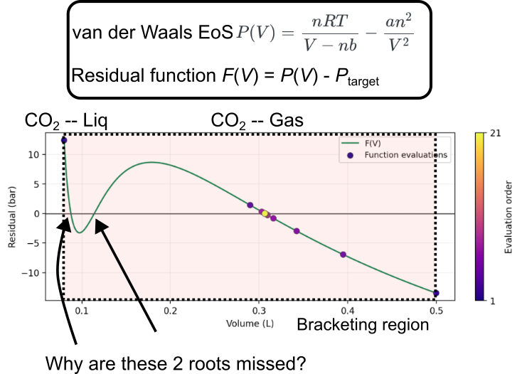
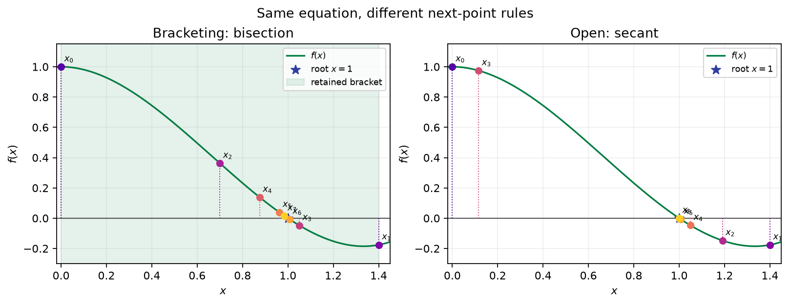
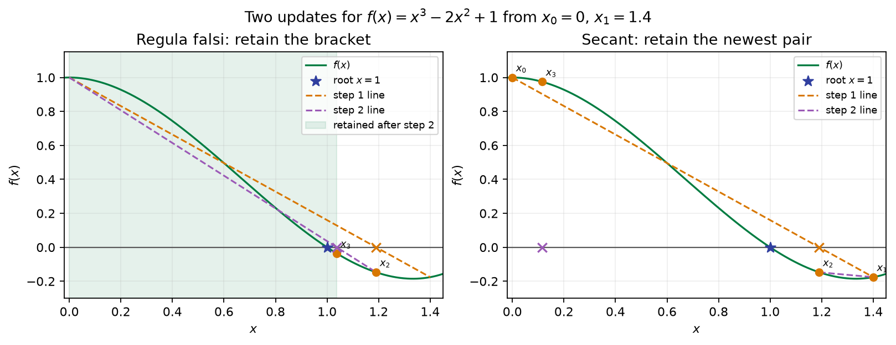
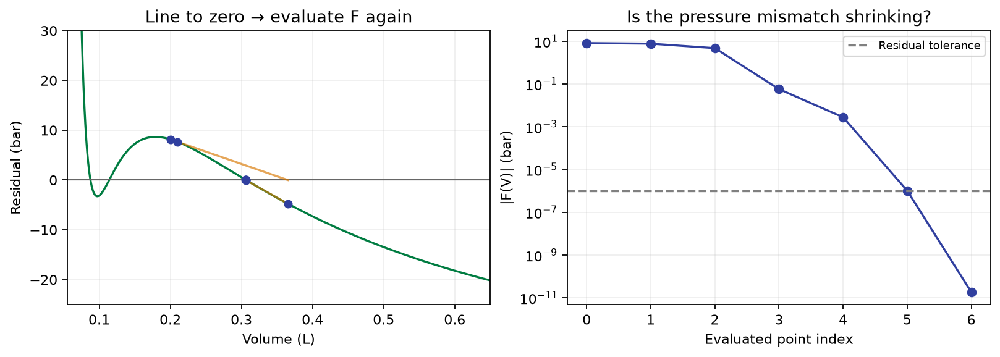
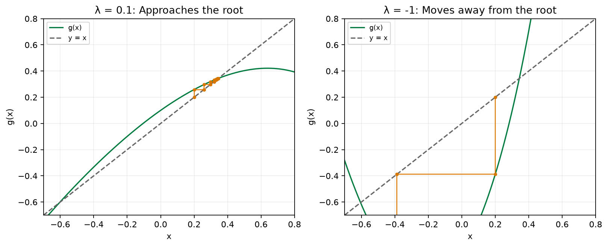

::: {.callout-note}
## Central question

**If we have not found a bracket, how can we choose the next point in a search for a root?**
:::

## Learning outcomes

By the end of this lecture, you should be able to:

1. **Trace** a secant or Newton update using the geometry of a straight line, and explain how nearby function values can provide the local slope.
2. **Diagnose** an open-method failure from its starting points, slopes, domain, and residual history.
3. **Compare** fixed-point rearrangements using cobweb diagrams and the local slope near a root.
4. **Assess** an iterative result using both the change in the estimate and the original residual.

## Motivation for open methods

Return to the van der Waals equation from L05:

$$
P(V)=\frac{nRT}{V-nb}-\frac{an^2}{V^2},
\qquad F(V)=P(V)-P_{\mathrm{target}}.
$$

At a suitable temperature and pressure, $F(V)=0$ has three real roots in the physical domain $V>nb$. As we briefly mentioned in L05, these roots have different physical meanings:

The smallest-volume root is liquid-like, the largest-volume root is gas-like, and the middle root is mechanically unstable.

Suppose we search over one large interval containing all three roots. **Will bisection, or any other single root-finding call, give us all three?**

Before looking at the example, go back to the [L05 grid-search demo](../L05/index.qmd#where-would-you-search) and play with the temperature, pressure, and grid resolution yourself. The figure below shows one example:

{#fig-missed-roots fig-alt="Van der Waals root-finding illustration showing one returned root even though several roots lie in the interval." width="100%"}

A single run of a bracketing method keeps one sign-changing interval and returns one root. To find several roots, we could first scan the domain, then refine each candidate bracket:

1. Evaluate $F$ on a grid.
2. Record neighboring points with opposite signs, and any sampled points where $F=0$.
3. Apply a bracketing method to each sign-changing interval.
4. Refine the grid to check whether we missed closely spaced crossings.

This **incremental search followed by bracketing** is a useful strategy ([Kiusalaas, 2013](../references.qmd#ref-kiusalaas2013)). A sign-change scan can still miss a root that only touches zero, or two crossings within one grid interval.

::: {.callout-note collapse="true"}
## The grid-search test

For grid points $V_0,V_1,\ldots,V_N$, test

$$
F(V_i)F(V_{i+1})<0.
$$

If $F$ is continuous on that subinterval, the sign change guarantees at least one root there. It does not count how many roots the interval contains.
:::

### Do we want to search the entire domain first?

Each grid point costs a function evaluation. With several unknowns, a grid becomes much more expensive: $N$ points along each of $m$ coordinates gives $N^m$ combinations. The one-dimensional sign-change bracket also has no simple equivalent for a general system of equations.

Could a function evaluation tell us **where to try next**? That is the idea behind **open methods**.

| Bracketing methods | Open methods |
|---|---|
| Keep a root inside a shrinking interval. | Use recent values or a local slope to choose the next point. |
| Start with a sign-changing bracket. | Start with one or more guesses. |
| Preserve the bracket's guarantee. | Can approach a root quickly, leave the physical domain, or fail to converge. |

An open method still has to respect the model's physical domain. “Open” means that the algorithm does not maintain a bracket.

For a simple example, consider

$$
f(x)=x^3-2x^2+1.
$$

Starting from $x_0=0$ and $x_1=1.4$, the figure compares the sequence of evaluated points for bisection and secant. Bisection retains a sign-changing bracket; secant uses recent points to choose its next trial.

{#fig-bracketing-vs-open fig-alt="Side-by-side sequences of evaluated points for bisection and secant applied to f of x equals x cubed minus 2x squared plus 1." width="100%"}

## The secant method: false position without the bracket

The [regula falsi (false position) method](../L05/index.qmd#can-we-choose-a-better-point-than-the-midpoint) draws a line through two endpoint values and uses the line's zero as the next trial point. The **secant method** uses the same geometry, but keeps the **two most recent points**, regardless of their signs.

The figure below shows two updates from the same starting pair. Regula falsi retains the sign-changing bracket after each update. Secant keeps the newest pair, even when the pair no longer brackets a root.

{#fig-regula-falsi-vs-secant fig-alt="Side-by-side two-step illustrations of regula falsi retaining a bracket and secant retaining the newest point pair for f of x equals x cubed minus 2x squared plus 1." width="100%"}

If the curve is nearly straight near a root, where would you expect the line to cross zero?

Given $x_{k-1}$ and $x_k$, the next trial point is

$$
\boxed{
x_{k+1}=x_k-f(x_k)
\frac{x_k-x_{k-1}}{f(x_k)-f(x_{k-1})}.
}
$$

Evaluate $f(x_{k+1})$, keep $x_k$ and $x_{k+1}$, and repeat. The two starting points must be distinct, but their difference $x_2-x_1$ can be small. Nearly equal function values make the denominator small and can produce a very large step.

### Follow the line, then evaluate the curve

The demo uses the same fixed vdW residual as L05, with volume in litres and pressure in bar. The secant and Newton loops are written explicitly so you can inspect how each step is chosen.

**Predict:** will starting near the liquid-like root and starting near the gas-like root lead to the same answer?

::: {.quarto-wasm-local notebook="l06_open_methods.edit.py" view="app" title="Trace secant and Newton steps on a fixed van der Waals residual" height="760" loading="lazy" fullscreen="true"}
{fig-alt="A secant-line construction beside a plot of decreasing pressure residual."}

**Static example.** Secant starts of $(0.08,0.085)$, $(0.11,0.12)$, and $(0.20,0.21)$ L approach roots near 0.0876734, 0.1140563, and 0.3065501 L respectively. Starting at $(0.15,0.16)$ L proposes a negative volume and the demo stops with a domain warning.
:::

1. Advance one update at a time. The line crosses zero, but is the **function** zero at that volume?
2. Try the three pairs of starting points listed in the demo. Which root does each reach?
3. Try $(0.15,0.16)$ L. What information in a bracket would have prevented this step?

::: {.callout-warning}
## Starting points matter

Secant can converge quickly when its recent points give a useful slope. It has no general guarantee of reaching a root from arbitrary starting points. Report failed runs as failed runs; moving an invalid point back into the domain would change the algorithm.
:::

## Newton–Raphson: use the tangent

Bring the two points defining a secant line close together. The line approaches the tangent, whose slope is $f'(x_k)$.

**Newton's method** evaluates that local derivative at every new point and uses the tangent's zero:

$$
\boxed{x_{k+1}=x_k-\frac{f(x_k)}{f'(x_k)}.}
$$

The correction divides the current mismatch by the local rate of change. A steep slope needs a small horizontal correction; a shallow slope may send the next point a long way away.

Switch the demo to **Newton**. Start at 0.20 L, then at 0.60 L. Does the tangent always point to a physically admissible volume?

### Do we need an explicit derivative?

Newton's method needs a local slope, but it does not require an analytical expression for that slope. If a program can evaluate $f(x)$, we can estimate the slope from nearby function values. A forward estimate is

$$
f'(x)\approx\frac{f(x+h)-f(x)}{h},
$$

and a centered estimate is

$$
f'(x)\approx\frac{f(x+h)-f(x-h)}{2h}.
$$

For a smooth function, the centered estimate usually gives a better local slope for the same $h$, but it requires function values on both sides of the current point. The current Newton iteration has already evaluated $f(x_k)$. The forward estimate therefore needs one additional function evaluation, and the centered estimate needs two. From scratch, the two estimates use two or three evaluations of $f$, respectively. We then use the estimated slope in the same update:

$$
x_{k+1}\approx x_k-\frac{f(x_k)}{\widehat{f'}(x_k)}.
$$

A centered estimate can be inserted into one Newton step directly:

```{.python code-fold="false"}
def newton_step_from_values(f, x, h):
    fx = f(x)
    slope = (f(x + h) - f(x - h)) / (2 * h)
    return x - fx / slope
```

This is useful when $f$ is a simulation or library call that exposes function values but not derivatives. The points used for the estimate must remain in the physical domain; near a boundary, a one-sided estimate may be the only admissible choice.

The step $h$ matters. A large $h$ measures the curve over a wider interval rather than the local tangent. A very small $h$ subtracts nearly equal function values, so round-off and cancellation can dominate. Smaller $h$ is therefore not always better. We will return to the error and step-size analysis of numerical differentiation later.

**Quick check:** if $f(x_k)$ is already known, how many new function evaluations do the forward and centered estimates require? Would $h=10^{-20}$ necessarily improve the Newton step?

::: {.callout-note collapse="true"}
## Where does the update come from?

The first-order [Taylor approximation](https://en.wikipedia.org/wiki/Taylor_series) at $x_k$ is

$$
f(x_k+\Delta x)
=f(x_k)+f'(x_k)\Delta x+O(\Delta x^2).
$$

Set the linear approximation to zero and solve for $\Delta x$:

$$
\Delta x=-\frac{f(x_k)}{f'(x_k)},
\qquad x_{k+1}=x_k+\Delta x.
$$

This gives the zero of the tangent. We still need to evaluate the original function at the new point.
:::

::: {.callout-note collapse="true"}
## How fast are secant and Newton near a root?

For a sufficiently smooth function near a **simple root** $x_s$, where $f'(x_s)\ne0$, Newton has quadratic local convergence. With signed error $e_k=x_k-x_s$,

$$
e_{k+1}\approx
\frac{f''(x_s)}{2f'(x_s)}e_k^2.
$$

Under the usual local convergence assumptions, the secant method has order $(1+\sqrt5)/2\approx1.618$. Bisection instead halves a guaranteed interval width at every step ([Kiusalaas, 2013](../references.qmd#ref-kiusalaas2013)).

These rates apply once the iterates are sufficiently close. An arbitrary starting point may never reach that region.

Starting secant with two very close points can approximate Newton's **first** update. Later secant updates use the last two iterates, while Newton obtains a new derivative at the current point. Their subsequent histories and convergence rates differ.
:::

### What can go wrong?

- **Zero or small derivative:** the correction is undefined or very large.
- **Poor starting point:** the tangent can send the search toward another root, into a cycle, or outside the physical domain.
- **Unavailable derivative:** use an analytical expression, automatic differentiation, or a numerical slope estimate. The estimate adds function evaluations and step-size, round-off, and domain concerns.
- **Multiple root:** if $f'(x_s)=0$, the simple-root convergence result above no longer applies.

## Open methods in SciPy

SciPy's [`root_scalar`](https://docs.scipy.org/doc/scipy/reference/generated/scipy.optimize.root_scalar.html) uses the same interface as in L05. Its open methods include:

| Method | Starting information | Derivative information |
|---|---|---|
| `secant` | Two guesses, `x0` and `x1` | None |
| `newton` | One guess, `x0` | `fprime`, or a numerical estimate when omitted |
| `halley` | One guess, `x0` | `fprime` and `fprime2` |

Halley's method uses second-derivative information as well. We will use secant and Newton for this lecture.

```{.python code-fold="false"}
from scipy.optimize import root_scalar

secant_result = root_scalar(
    F, method="secant", x0=0.20, x1=0.21,
    xtol=1e-8, maxiter=50,
)
newton_result = root_scalar(
    F, method="newton", x0=0.20, fprime=dF,
    xtol=1e-8, maxiter=50,
)
print(newton_result.root, newton_result.converged)
print(F(newton_result.root))
```

Here `F` and `dF` are the residual and its derivative. `xtol` has the units of the input variable. SciPy can estimate a local slope when `fprime` is omitted for `newton`; supplying `dF` makes the derivative choice explicit and avoids a library-selected numerical step.

Several starting guesses may find several roots, but repeated convergence to one root does not establish that all roots have been found. A grid scan and bracketed reference solves remain useful checks.

## Generalizing to fixed-point iteration

An iterative method produces a sequence

$$
x_0,\ x_1,\ x_2,\ \ldots
$$

For a **one-point iteration**, write the update as

$$
\boxed{x_{k+1}=g(x_k).}
$$

If the sequence converges to $x_s$ and $g$ is continuous there, then $x_s=g(x_s)$. We call $x_s$ a **fixed point**. Newton has this form with $g(x)=x-f(x)/f'(x)$. Secant uses two previous points, so its update needs both as inputs.

A fixed-point iteration alternates between two curves: move vertically to $y=g(x)$, then horizontally to $y=x$. The resulting **cobweb diagram** shows whether successive points approach the intersection or move away.

### How do we construct the iteration?

We can rearrange $f(x)=0$ in many ways. One useful family is

$$
\boxed{g(x)=x-c(x)f(x).}
$$

A root of $f$ is a fixed point wherever $c$ is finite. In the other direction, a fixed point implies $f(x)=0$ only where **$c(x)\ne0$**. A poorly chosen $c$ can therefore introduce extra fixed points.

::: {.callout-important}
Many rearrangements can represent the same equation. Their iterations can behave very differently.
:::

For a dimensionless example, take

$$
f(x)=3x^2-x+e^{2x}-2.
$$

::: {.callout-note collapse="true"}
## Work through the possible rearrangements

| Choice | Iteration $g(x)$ | Domain or check |
|---|---|---|
| $c(x)=\lambda$ | $x-\lambda(3x^2-x+e^{2x}-2)$ | Require $\lambda\ne0$ for equivalence. |
| $c(x)=-x/2$ | $\frac32x^3-\frac12x^2+\frac12xe^{2x}$ | Introduces the extra fixed point $x=0$. |
| $c(x)=1/(3x)$ | $\dfrac{x-e^{2x}+2}{3x}$ | Undefined at $x=0$. |
| Isolate $e^{2x}$ | $\frac12\ln(-3x^2+x+2)$ | Logarithm argument must be positive. |
| Isolate $x^2$ | $\pm\sqrt{(x-e^{2x}+2)/3}$ | Radicand must be nonnegative; each sign selects a branch. |
| Newton, $c(x)=1/f'(x)$ | $x-\dfrac{3x^2-x+e^{2x}-2}{6x-1+2e^{2x}}$ | Denominator must be nonzero. |

For example, $c=1/(3x)$ cancels the leading $x$:

$$
g(x)=x-\frac{3x^2-x+e^{2x}-2}{3x}
=\frac{x-e^{2x}+2}{3x}.
$$

With $\lambda=-1$, the constant-$c$ choice reduces to $g(x)=3x^2+e^{2x}-2$. The algebra is valid, but does the iteration converge?
:::

### Compare the cobwebs

Start at $x_0=0.20$. Compare the constant-$c$ map with $\lambda=0.10$ and $\lambda=-1$. Then try the logarithm, square-root branches, and Newton.

The notebook opens in **Edit code** so that you can see and change `student_map` directly. First predict the behaviour from the displayed equation, then run the cobweb and residual check.

::: {.quarto-wasm-local notebook="l06_fixed_point.edit.py" view="edit" title="Compare fixed-point rearrangements and check the original residual" height="880" loading="lazy" fullscreen="true"}
{fig-alt="Side-by-side cobweb diagrams for a convergent relaxation and a divergent rearrangement."}

**Static example.** From $x_0=0.20$, $g=x-0.10f$ approaches the positive root $x_s\approx0.3438532$. The choice $g=x+f$ moves away. The negative square-root branch approaches the other root, $x_s\approx-0.6046845$. With $c=-x/2$ and $x_0=0$, the iterate never moves, yet $f(0)=-1$.
:::

1. Which maps approach the positive root? Which reach another root or leave their domains?
2. Select $c=-x/2$ and start at zero. Is a motionless cobweb enough evidence of a solution?
3. Edit `student_map` in the notebook to try your own rearrangement. Check its algebra, domain, and the residual at the returned point.

### When does fixed-point iteration converge?

Near an attracting fixed point, an input error becomes a smaller error after applying $g$. The local slope tells us whether this happens:

- $|g'(x_s)|<1$: sufficiently nearby iterates approach the fixed point.
- $|g'(x_s)|>1$: the fixed point is locally repelling.
- $|g'(x_s)|=1$: this test does not decide the outcome.

A negative slope often produces alternating errors; a positive slope often approaches from one side. The green bands in the demo show a **sampled slope condition**, which helps explain the geometry.

::: {.callout-note collapse="true"}
## Local slope versus a convergence guarantee on an interval

For a differentiable map near a fixed point,

$$
e_{k+1}=g(x_s+e_k)-g(x_s)\approx g'(x_s)e_k.
$$

A standard sufficient condition on a closed interval $I$ is:

1. $g(I)\subseteq I$: every update stays in the interval.
2. $|g(x)-g(y)|\le q|x-y|$ for all $x,y\in I$, with a constant $q<1$.

The second condition is a **contraction**, a Lipschitz bound with constant below one. For a continuously differentiable map, a uniform bound $|g'(x)|\le q<1$ on $I$ is sufficient. Together these conditions give a unique fixed point in $I$ and convergence from any starting point there ([Burden, Faires, and Burden, 2016](../references.qmd#ref-burden2016numerical)).

A few sampled derivatives do not prove a uniform bound or that the interval maps into itself. Also, $|g'(x_s)|<1$ is sufficient for local attraction, but is not necessary for every possible convergent iteration.
:::

::: {.callout-note collapse="true"}
## Why is Newton especially effective near a simple root?

For $g(x)=x-f(x)/f'(x),

$$
g'(x)=\frac{f(x)f''(x)}{[f'(x)]^2}.
$$

At a simple root, $f(x_s)=0$ and $f'(x_s)\ne0$, so $g'(x_s)=0$. If $f$ is sufficiently smooth, a small enough neighborhood has the local contraction property. This explains Newton's rapid local convergence and why the starting point still matters.
:::

## When should we stop?

Check two quantities:

1. **Function value:** is $|f(x_k)|$ small enough for the condition we want?
2. **Step:** is $|x_k-x_{k-1}|$ small enough for the resolution we need in $x$?

For the vdW example, the function value is a pressure residual in bar and the step is in litres. Choose their tolerances separately.

A small step with a large function value can mean stagnation or an incorrect fixed-point rearrangement. A small function value with a large step calls for another look at the iteration history. For these demos, we report convergence when **both** tolerances are met, and report domain failures or iteration limits separately.

::: {.callout-note collapse="true"}
## A minimal fixed-point loop

```python
def iterate(g, f, x0, xtol=1e-8, ftol=1e-7, maxiter=60):
    sequence = [x0]
    for _ in range(maxiter):
        next_x = g(sequence[-1])
        if not np.isfinite(next_x):
            return sequence, False
        step = abs(next_x - sequence[-1])
        sequence.append(next_x)
        if step <= xtol and abs(f(next_x)) <= ftol:
            return sequence, True
    return sequence, False
```

This skeleton assumes `g` handles its domain. The demo also reports undefined maps, large iterates, and stagnation explicitly.

For inputs spanning different scales, a mixed step tolerance can be useful:

$$
|x_{k+1}-x_k|\le\varepsilon_{\mathrm{abs}}+
\varepsilon_{\mathrm{rel}}|x_{k+1}|.
$$

Even a small step and function value do not by themselves bound the error in $x$: a flat function can be poorly conditioned. A bracket, slope estimate, or independent reference gives additional evidence.
:::

## Back to the vdW equation

We can now find three roots with separate brackets or suitable starting guesses. **Which volume describes the state the material prefers?**

At the middle root, $(\partial P/\partial V)_T>0$: compressing the model fluid would lower its pressure. This branch has negative isothermal compressibility and is mechanically unstable.

The other two roots pass that local mechanical check. Choosing between them requires a free-energy comparison. In L07, we will connect these same roots to minima and a maximum of a free-energy curve.
