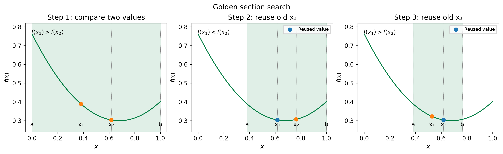
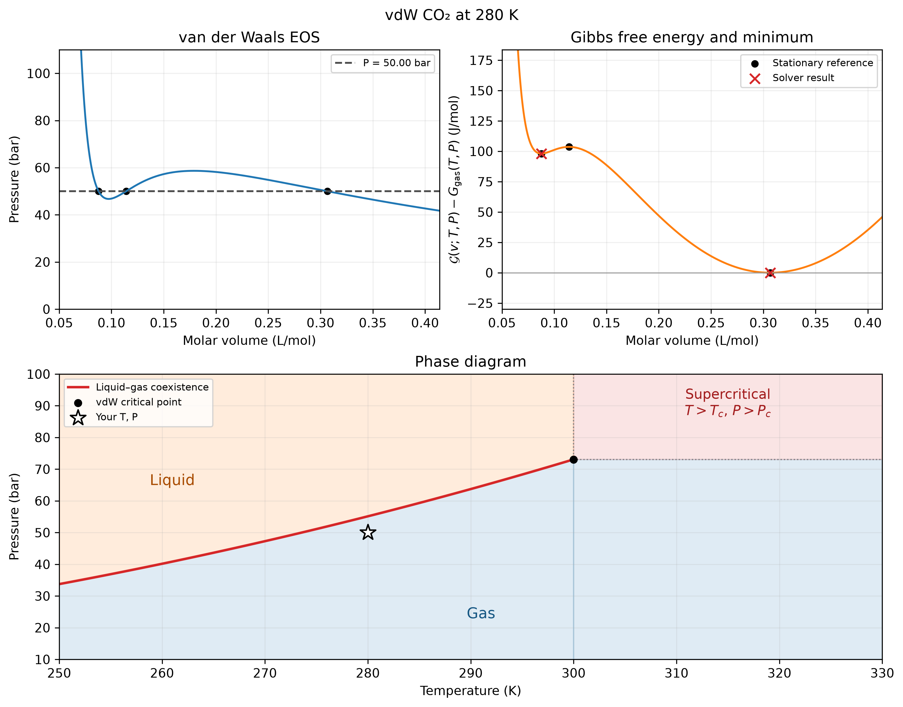

::: {.callout-note}
## Central question

**How can we find minima and maxima of a free-energy curve, then identify the most stable phase?**
:::

## Learning outcomes

By the end of this lecture, you should be able to:

1. **Classify** a stationary point using the local shape and second derivative of a function.
2. **Trace** a golden-section update and explain which part of a unimodal interval can be discarded.
3. **Compare** bounded minimization, Newton–Raphson iteration, and gradient descent by their information requirements, including numerical derivative estimates, and their failure modes.
4. **Identify** stable, metastable, and unstable homogeneous vdW states from their free energies and curvatures at fixed temperature and pressure.

## From the vdW equation to a free-energy curve

In materials science and engineering, a commonly asked question is: for a one-component material at a specified temperature $T$ and pressure $P$, which state is most stable: liquid or gas? This is linked to the unary (one-component) phase diagram.

In L05 and L06, the van der Waals equation of state gave us **possible volumes** for a real gas like CO$_2$. At some conditions, we found a liquid-like root and a gas-like root, with a mechanically unstable root between them. But we know from thermodynamics that, at a given temperature $T$ where liquid–gas coexistence is possible, there is only one pressure, the **saturation pressure** $P_{\mathrm{sat}}$, at which the liquid and gas coexist in equilibrium. Take water as an example: $T\approx373$ K and $P=1$ atm.

::: {.callout-tip}
Two phases can both satisfy the equation of state at the same $T$ and $P$. For them to coexist in equilibrium, their molar Gibbs free energies must also be equal!
:::

To choose between the two candidates, we need to compare their **molar Gibbs free energies** at the same $T$ and $P$ ([Poling, Prausnitz, and O'Connell, 2001](../references.qmd#ref-poling2001properties)).

To simplify, we now use **molar volume** $v=V/n$ (in L/mol). Without diving too deep into the math, the molar free-energy curve $\mathcal G(v;T,P)$ for a vdW gas–liquid system at fixed temperature and pressure is given below. The liquid-like and gas-like states will be distinguished by their volumes.

$$
\boxed{
\mathcal G(v;T,P)
=-RT\ln\!\left(\frac{v-b}{v_{\mathrm{ref}}}\right)
-\frac{a}{v}+Pv+C(T),
\qquad v>b.
}
$$

Here $v_{\mathrm{ref}}$ is a fixed reference volume that makes the logarithm dimensionless. $C(T)$ sets the reference energy: at the same temperature, it cancels when we compare the free energies of two states. This expression retains the dimensional vdW parameters and gives energy **per mole**.

The curve is the molar Helmholtz free energy plus the work term $Pv$ at the imposed pressure. At a stationary volume satisfying the EOS, its value is the molar Gibbs free energy of that homogeneous state.

::: {.callout-note collapse="true"}
## Derivation: from pressure to Helmholtz and Gibbs free energy

The [Helmholtz free-energy relation](https://en.wikipedia.org/wiki/Helmholtz_free_energy), per mole at fixed composition, is

$$
dA_m=-S_m\,dT-P_{\mathrm{EOS}}\,dv.
$$

At fixed temperature,

$$
\left(\frac{\partial A_m}{\partial v}\right)_T=-P_{\mathrm{EOS}}(v,T),
\qquad
P_{\mathrm{EOS}}=\frac{RT}{v-b}-\frac{a}{v^2}.
$$

Integrating **minus** the pressure gives

$$
A_m(v,T)
=-RT\ln\!\left(\frac{v-b}{v_{\mathrm{ref}}}\right)-\frac{a}{v}+C(T).
$$

At imposed external pressure $P$, minimize $\mathcal G=A_m+Pv$. Its derivative is

$$
\boxed{\frac{\partial\mathcal G}{\partial v}=P-P_{\mathrm{EOS}}(v,T).}
$$

Thus every stationary point satisfies the original EOS. The curvature is

$$
\boxed{\frac{\partial^2\mathcal G}{\partial v^2}
=-\left(\frac{\partial P_{\mathrm{EOS}}}{\partial v}\right)_T.}
$$

A descending EOS branch gives a free-energy minimum; the ascending middle branch gives a maximum. The vdW EOS and its thermodynamic use are discussed in [Poling, Prausnitz, and O'Connell (2001)](../references.qmd#ref-poling2001properties).
:::

We can identify three features on the free-energy curve: two minima and one maximum. They coincide with the three EOS roots!

At 280 K, the vdW model gives $P_{\mathrm{sat}}\approx55.129$ bar, where the two minima have the **same free energy**. At higher pressure, the liquid-like well is lower; at lower pressure, the gas-like well is lower. For each pressure in the figure, we subtract the free energy of its gas-like minimum, so that minimum sits at zero. This reference shift preserves the energy difference between the two wells at that pressure.

{#fig-vdw-energy fig-alt="Left: CO2 van der Waals EOS with three imposed pressures and their intersections. Right: corresponding Gibbs free-energy curves in blue, orange, and red, each referenced to its gas-like minimum." width="100%"}

How do we know which phase is more stable at a given $P$ and $T$? The numerical task now has three parts:

1. Find the volumes where the free energy has extrema.
2. Classify the extrema and evaluate the free energy at each minimum.
3. Compare the minima at the same $T$ and $P$ to decide which phase is favoured.

Repeating that comparison at several temperatures and pressures leads to a **phase diagram**. First, how do we find a minimum?

## The optimization problem

A **local minimum** has a value no larger than nearby values. A **global minimum** is the lowest value over the entire admissible domain. Finding an input that minimizes a function is an **optimization problem**. To find a maximum, we can minimize the negative of the function.

We will study one-dimensional minimization so that we can draw the geometry. Many materials calculations use the same ideas with many coordinates: for example, moving atoms to lower the energy of a structure.

::: {.callout-tip}
Training an AI model also involves minimization, often over millions of parameters. The questions remain familiar: what direction should we move, how large a step should we take, and how do we know we have made progress?
:::

Our focus is on smooth **interior** extrema, i.e. extrema away from the endpoints of the function's interval. Apart from the physical domain and search interval, we don't impose additional constraints here. Problems with such restrictions are called **constrained optimization** problems, which you will study in more advanced courses.

### Where are the stationary points?

At a smooth interior minimum or maximum $x_s$, the first derivative is zero, or equivalently, the tangent line at this point is horizontal:

$$
f'(x_s)=0.
$$

The second derivative distinguishes the usual cases:

| At a stationary point | Shape | Classification |
|---|---|---|
| $f''(x_s)>0$ | Curves upward, like a bowl | Local minimum |
| $f''(x_s)<0$ | Curves downward, like a hill | Local maximum |
| $f''(x_s)=0$ | May be flat or change curvature | Further analysis needed |

Think of the slope as you move across the bottom of a bowl: it changes from negative to positive. The second derivative measures that increase in slope.

**Finding $f'=0$ is another root-finding problem!** If we can evaluate the derivative, methods from L05 and L06 can locate stationary points. We still need to determine which kind of point we found.

### If only function values are available

The numerical slope idea from L06 applies to optimization as well. If the objective can be evaluated but its derivatives are not available, a centered slope estimate is

$$
f'(x)\approx\frac{f(x+h)-f(x-h)}{2h}.
$$

For the curvature used by Newton–Raphson, the same three function evaluations give

$$
f''(x)\approx\frac{f(x+h)-2f(x)+f(x-h)}{h^2}.
$$

We do not need the derivation here. The important point is that values of the original function can provide both the slope and curvature needed for a derivative-based update. At a stationary point, a **positive estimated curvature** supports a **local-minimum** interpretation; a negative estimate supports a local-maximum interpretation. Because the curvature estimate divides by $h^2$, it is especially sensitive to round-off and noise. We will return to the error analysis of numerical differentiation later.

## Bounded minimization: golden-section search

Suppose the function we are interested in, $f(x)$, has **exactly one minimum** in $[a,b]$, decreasing toward it and increasing after it. The function is **unimodal** on this interval. We can compare function values inside the interval to discard a part that cannot contain the minimum. This is the basic idea behind bounded minimization, analogous to the bracketing methods in root-finding. A widely used method is **golden-section search** ([Kiefer, 1953](../references.qmd#ref-kiefer1953sequential)).

A single midpoint value does not tell us which side has the lower values (**why?**). Golden-section search evaluates **two interior points**, $x_1<x_2$:

- If $f(x_1)>f(x_2)$, keep $[x_1,b]$.
- If $f(x_1)<f(x_2)$, keep $[a,x_2]$.
- If the values are equal and the function is strictly unimodal, the minimum lies between the two points.

{#fig-golden-section fig-alt="Three successive golden-section intervals: step 1 discards the left end; step 2 reuses the old right point and discards the right end; step 3 reuses the old left point." width="100%"}

**Before looking at the second panel:** which end would you discard, and which function evaluation could you reuse?

The special placement of the points lets us reuse one value after each update. After the first two evaluations, an ordinary update needs only **one new function evaluation**.

Golden-section search places the two points $x_1$ and $x_2$ at fixed fractions of the interval. If its width is $h=b-a$, then

$$
x_1-a=b-x_2=(1-R)h\approx0.382h,
\qquad R=\frac{\sqrt5-1}{2}\approx0.618.
$$

Here $R$ is the reciprocal of the golden ratio, using Kiusalaas's notation. The retained interval has width $Rh$.

::: {.callout-note collapse="true"}
## Why the golden ratio?

Let $h=b-a$ and choose

$$
x_1=b-Rh,\qquad x_2=a+Rh,
\qquad R=\frac{\sqrt5-1}{2}\approx0.618.
$$

Suppose $f(x_1)>f(x_2)$. The new interval is $[x_1,b]$, of width $h'=Rh$. For the old $x_2$ to become the new left interior point,

$$
a+Rh=b-Rh'=a+h-R^2h.
$$

Hence $R^2+R=1$, giving $R=(\sqrt5-1)/2$. This is the reciprocal of the golden ratio $\phi=(1+\sqrt5)/2$.

After $k$ ordinary updates,

$$
h_k=R^k h_0.
$$

To reach width $\varepsilon_x<h_0$ requires

$$
k\ge\left\lceil
\frac{\ln(\varepsilon_x/h_0)}{\ln R}
\right\rceil.
$$

The interval shrinks by about 0.618 each time, compared with 0.5 for a bisection root bracket. The two algorithms use different information: golden section compares function values, while bisection preserves a sign change ([Kiusalaas, 2013](../references.qmd#ref-kiusalaas2013)).
:::

Like bisection in root-finding, golden-section search reduces the interval by a fixed factor at each step. To reduce an initial width $h_0$ to at most $\varepsilon_x<h_0$, it takes

$$
k=\left\lceil\frac{\ln(\varepsilon_x/h_0)}{\ln R}\right\rceil
\approx\left\lceil\frac{\ln(\varepsilon_x/h_0)}{\ln(0.618)}\right\rceil
$$

ordinary updates. This controls the uncertainty in the location of the minimum.

::: {.callout-note}
## How do we know the interval contains one minimum?

A graph, physical reasoning, and an initial scan can identify a candidate well. Three points $a<m<b$ with $f(m)<f(a)$ and $f(m)<f(b)$ bracket an interior minimum of a continuous function, but **do not prove there is only one well**.

For the two-well vdW landscape, split the search at the intervening maximum. Search each well separately, then compare their minima. Passing one large interval to a local minimizer does not guarantee that it will find the lower of two wells.
:::

### Bounded minimization methods in SciPy

In SciPy, use [`minimize_scalar`](https://docs.scipy.org/doc/scipy/reference/generated/scipy.optimize.minimize_scalar.html):

| Method | Search information | Main idea |
|---|---|---|
| `golden` | A minimum bracket | Golden-section interval reduction |
| `brent` | A minimum bracket | Interpolation with golden-section fallback |
| `bounded` | Finite `bounds=(a,b)` | Bounded Brent minimization within the interval |

```{.python code-fold="false"}
from scipy.optimize import minimize_scalar

result = minimize_scalar(
    free_energy, bounds=(v_left, v_right), method="bounded",
    options={"xatol": 1e-8},
)
print(result.x, result.fun, result.success)
```

Here `free_energy(v)` holds $T$ and $P$ fixed. A two-point `bracket` for `golden` or `brent` seeds a downhill search that may expand beyond those points; use `bounded` when the endpoints must be respected. Check the endpoints too if a boundary minimum is possible.

## Open-domain methods

### Newton–Raphson: find a zero of the slope

Apply Newton–Raphson to $f'(x)=0$:

$$
\boxed{x_{k+1}=x_k-\frac{f'(x_k)}{f''(x_k)}.}
$$

This needs the slope $f'$ **and** curvature $f''$! Both can be supplied analytically or estimated from function values as above. Near a well-behaved minimum it can converge quickly, but it can also approach a maximum. Newton–Raphson targets a zero first derivative, so we need to check that the second derivative is positive to confirm a strict local minimum.

For example, SciPy can solve the stationary-point equation directly. Note that we still use `newton` in root-finding, but the residual function becomes the derivative `d_free_energy`!

```{.python code-fold="false"}
from scipy.optimize import root_scalar

stationary = root_scalar(
    d_free_energy, x0=v0, fprime=d2_free_energy,
    method="newton", xtol=1e-8,
)
print(stationary.root, stationary.converged)
print(d2_free_energy(stationary.root))  # Positive at a strict minimum.
```

A zero or small curvature makes the Newton–Raphson step undefined or large. For many-variable energies, the first derivatives form a **gradient** and the second derivatives form a **Hessian matrix**. Computing and solving with that matrix can be expensive ([Nocedal and Wright, 2006](../references.qmd#ref-nocedal2006optimization)).

### Gradient descent: take a step downhill

If curvature (second derivative) is unavailable or hard to calculate, we can use the slope alone, with just a small tweak:

$$
\boxed{x_{k+1}=x_k-\alpha f'(x_k),\qquad \alpha>0.}
$$

This is **gradient descent** in one dimension ([Nocedal and Wright, 2006](../references.qmd#ref-nocedal2006optimization)). What we did was to introduce one adjustable parameter, the step-size parameter $\alpha$, which controls how far we move downhill according to the current slope. When the objective is a black-box calculation, the numerical slope estimate above can supply $f'(x_k)$; the extra evaluations and any noise in them affect the direction of the update.

- Too small: the calculation makes slow progress.
- Too large: the step can overshoot the well and increase the energy or diverge.
- An appropriate step: the energy decreases toward a minimum.

If $f$ and $x$ carry units, $\alpha$ must have units that make $\alpha f'(x)$ an increment in $x$.

::: {.callout-note collapse="true"}
## Connect the step size to L06's fixed-point condition

We can examine gradient descent itself as a fixed-point iteration. For $g(x)=x-\alpha f'(x)$,

$$
g'(x_s)=1-\alpha f''(x_s).
$$

Near a minimum with positive curvature, the **Lipschitz condition** with a constant below one gives the local slope test

$$
|1-\alpha f''(x_s)|<1,
\qquad\text{or}\qquad
0<\alpha<\frac{2}{f''(x_s)}.
$$

For a quadratic well, this gives the exact constant-step convergence range. The vdW free-energy curve is approximately quadratic near each minimum, so the condition provides a local step-size guide. If the step size exceeds $2/f''(x_s)$, small errors grow under the local linear approximation. Practical optimizers often adjust the step using a line search.
:::

::: {.callout-tip}
Choosing a step length matters in both atomic structure relaxation and machine-learning training.
:::

## Hands-on: compare the vdW minima

Use the CO₂ parameters from L05:

- $a=3.592$ L² bar mol⁻² $=0.3592$ Pa m⁶ mol⁻²;
- $b=0.04267$ L mol⁻¹ $=4.267\times10^{-5}$ m³ mol⁻¹;
- $R=8.314462618$ J mol⁻¹ K⁻¹ in the free-energy calculation.

The demo uses the same referenced free energy as @fig-vdw-energy.

**Predict:** pick a temperature. Can you move the pressure so that the two free-energy minima are balanced?

::: {.quarto-wasm-local notebook="l07_co2_free_energy.edit.py" view="app" title="Compare dimensional CO2 free-energy minima and the van der Waals phase boundary" height="1100" loading="lazy" fullscreen="true"}
{fig-alt="A blue EOS curve and orange referenced Gibbs free-energy curve above a phase diagram with a red coexistence line, shaded gas, liquid, and supercritical regions, and the selected temperature and pressure."}

**Static example.** At 280 K and 50 bar, the liquid-like and gas-like minima occur near 0.0876734 and 0.3065501 L/mol. Their free energies differ by $G_{\mathrm{liq}}-G_{\mathrm{gas}}\approx+98.10$ J/mol, so the gas-like state is favoured. Newton–Raphson started at 0.11 L/mol reaches the intervening **maximum** near 0.1140563 L/mol. For this parameter set, the equal-minimum pressure at 280 K is about 55.129 bar.
:::

1. At **280 K and 50 bar**, locate the two minima. Which is lower?
2. Raise pressure to **56 bar**. Has the preferred phase changed?
3. Switch to Newton–Raphson and start at **0.11 L/mol** at 280 K and 50 bar. The solver converges: did it find a minimum?
4. Compare the iteration counts. What does each method evaluate during an iteration?
5. Check the pressure residual at each computed minimum. Does the optimizer's success flag alone establish your chosen pressure tolerance?
6. At one reported stationary volume, use the three-value estimates above to check whether the slope is near zero and inspect the sign of the curvature. Do they agree with the solver's classification?

The bounded demonstration searches one well at a time, using the middle stationary volume to separate the wells when there are three roots. An independent cubic solve provides the stationary-volume reference. Newton–Raphson uses an explicit update and reports steps that leave $v>b$.

### Stable, metastable, or unstable?

At the same $T$ and $P$:

- The **lower minimum** is the stable homogeneous phase among the phases represented by the model.
- A **higher local minimum** is metastable: sufficiently small volume perturbations raise its free energy, although another phase has lower free energy.
- The **intervening maximum** is unstable to volume perturbations.
- **Equal minima** indicate liquid–gas coexistence.

The maximum separates the homogeneous wells. A prediction of a nucleation barrier or lifetime also needs interfacial energy and a model of how a new phase forms.

For a visual connection to the material, watch [CO₂ liquefaction](https://www.youtube.com/watch?v=M2duzKxb1QM):



### Do we always have two minima?

Raise the **temperature $T$** to 310 K, then vary pressure. With these vdW parameters, this is above the model's critical temperature. The landscape has one minimum that moves continuously as pressure changes.

Even below the critical temperature, two minima occur only within a particular pressure range. Seeing one minimum is therefore not enough to conclude that $T>T_c$.

::: {.callout-note collapse="true"}
## What determines the critical point?

At the vdW critical point, the two turning points of the isotherm merge:

$$
\left(\frac{\partial P}{\partial v}\right)_{T_c}=0,
\qquad
\left(\frac{\partial^2P}{\partial v^2}\right)_{T_c}=0.
$$

For $P=RT/(v-b)-a/v^2$, these conditions give

$$
v_c=3b,\qquad
T_c=\frac{8a}{27Rb},\qquad
P_c=\frac{a}{27b^2}.
$$

With the chosen CO₂ parameter set, $T_c\approx299.99$ K and $P_c\approx73.07$ bar. These are predictions of this vdW model. Quantitative comparison with measured CO₂ properties is a separate validation step.
:::

Above $T_c$, compression produces no discontinuous liquid–gas transition. The usual **supercritical** region has both $T>T_c$ and $P>P_c$.

## From minimization to a phase diagram

At a fixed temperature below $T_c$, we can ask another root-finding question:

$$
\boxed{\Delta G(P)=G_{\mathrm{liq}}(T,P)-G_{\mathrm{gas}}(T,P)=0.}
$$

Each evaluation of $\Delta G$ requires finding the two minima at that pressure. The pressure where their values are equal is the **saturation pressure**: liquid and gas coexist there.

Repeat at several temperatures to trace the liquid–gas phase boundary. The demo's bottom plot shows this boundary for the dimensional vdW CO₂ model. The two controls move the chosen $(T,P)$ point across it.

This combines the methods from three lectures:

> **EOS roots → stationary states → free-energy comparison → coexistence pressure.**

## Summary: what are we actually solving?

| Task | Numerical target | Essential check |
|---|---|---|
| Find a possible volume | $P_{\mathrm{EOS}}(v,T)-P=0$ | Residual, domain, and evidence of convergence |
| Locate a stationary state | $\mathcal G'(v)=0$ | Curvature: minimum, maximum, or inconclusive |
| Find a local minimum without derivatives | Compare $\mathcal G$ within a well | Search interval, unimodality, and endpoints |
| Choose the stable phase | Lowest free energy among candidate phases | Compare all relevant minima at the same $T,P$ |
| Locate liquid–gas coexistence | $G_{\mathrm{liq}}-G_{\mathrm{gas}}=0$ | Both phases must exist as minima |

## Before the next lecture

We could calculate the phase boundary at a few temperatures rather than at a million points. **How should we estimate the boundary between those calculated values?**

L08 introduces interpolation between data points. Later, fitting will let us test how well a simple function represents calculated or measured data.
