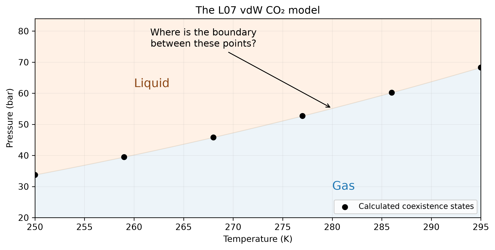
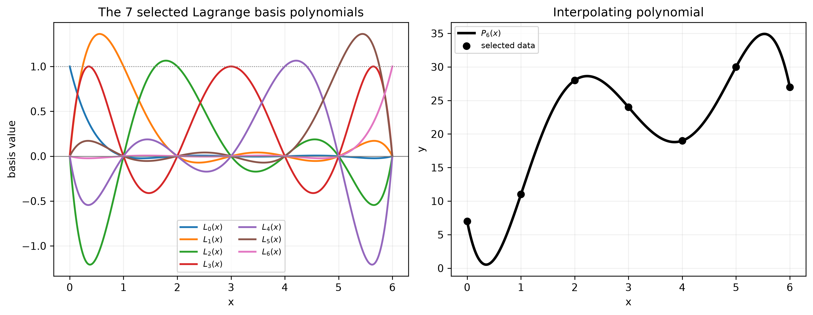
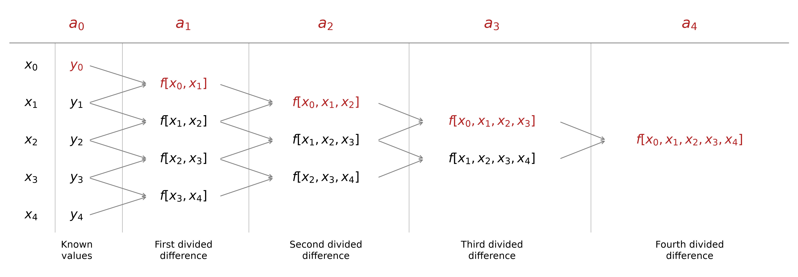
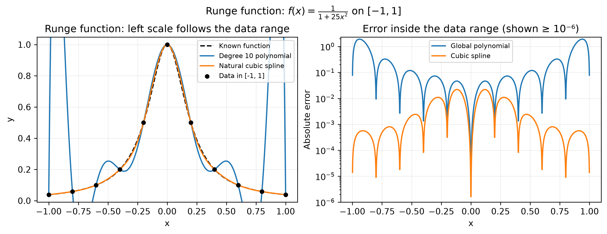
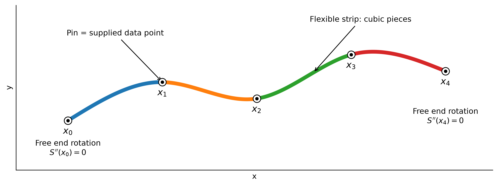
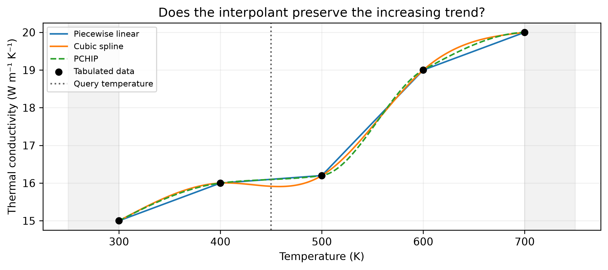
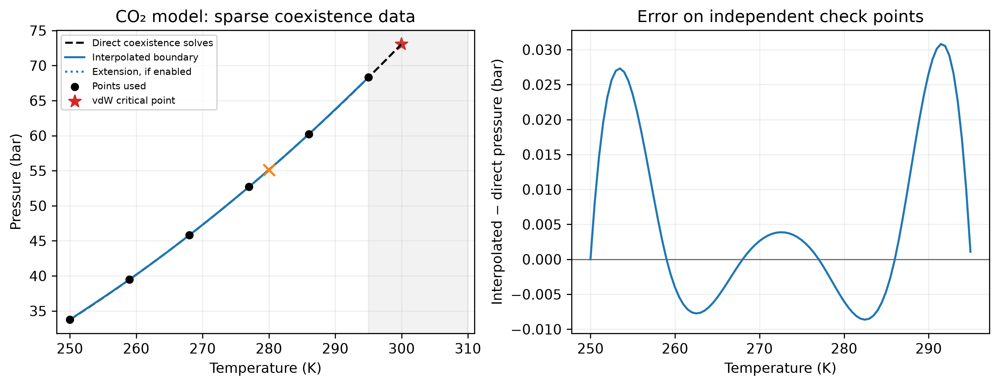

::: {.callout-note}
## Central question

**When we have only a few data points, how can we estimate the values between them?**
:::

## Learning outcomes

By the end of this lecture, you should be able to:

1. **Formulate** interpolation as zero-residual conditions on the unknown coefficients of a function.
2. **Explain** how Lagrange and Newton interpolation construct the same polynomial, and why increasing its degree can make the estimate worse.
3. **Use** NumPy and SciPy to interpolate a table with piecewise linear, cubic-spline, and shape-preserving methods.
4. **Assess** an interpolated phase boundary using independent calculations, physical constraints, and the range of the supplied data.

## From a few equilibrium states to a phase diagram

In L05–L07, we learned how to find possible volumes of a vdW fluid, classify its stationary states, and compare their free energies. At a fixed temperature $T$, the saturation pressure $P$ at liquid–gas coexistence satisfies

$$
\Delta G(T,P)=G_{\mathrm{liq}}(T,P)-G_{\mathrm{gas}}(T,P)=0.
$$

We combined root-finding and minimization to find the temperature–pressure pairs $(T,P)$. Obtaining each pair requires finding the two candidate minima. With enough such $(T,P)$ points, we can trace the phase boundary between the liquid and gas phases of CO$_2$ in a phase diagram.

**Could we now calculate a complete phase diagram?** We could calculate many more points. But how many do we actually need to draw the boundary, or estimate the saturation pressure at one new temperature?

{#fig-phase-points fig-alt="Six calculated saturation pressures between 250 and 295 kelvin, with liquid above and gas below the boundary and an arrow asking where the boundary lies between two points." width="80%"}

Remember the timing tools from [L04](../../01/L04)? Suppose finding one data point $(T,P)$ at liquid–gas coexistence takes $t_{\mathrm{solve}}$. Then calculations at $M$ independent temperatures cost roughly $M t_{\mathrm{solve}}$. This small vdW calculation may be easy enough to repeat a thousand times, but a more detailed model, perhaps with more accurate atomic interactions, could require a much longer simulation for every new point, including evaluations at non-equilibrium pressures. Looking at the smooth phase boundary, could we **calculate a few points carefully and construct a function between them**? We would still check additional points against the original calculation, but we might obtain most of the curve with much less work.

This motivates methods that convert **discrete data points** into **functions with known expressions**, so that future calculations can estimate values at inputs not included in the original data. These methods are broadly called curve fitting. Numerical analysis and data science often use different names for related ideas, so a few distinctions are useful.

The method for matching the data:

- **Exact fitting:** this is often called **interpolation**. The function $\hat f$ must pass through every supplied data point:
  $$
  \hat f(x_i)=y_i.
  $$
- **Curve fitting:** this is often called **regression**. The fitted function does not need to pass through every point exactly. If $r_i=y_i-\hat f(x_i)$ is the residual at point $i$, then $\hat f(x_i)=y_i-r_i$. The fitting method chooses the function's coefficients to reduce an overall measure of these residuals.

The location of the new input:

- **Interpolation:** estimating a value when the input $x$ lies between known inputs, such as $x_i\le x\le x_{i+1}$. Although the word often refers to an interpolating function from exact fitting, a regression function can also be used to estimate a value inside the data range.

  *Example: If we have calculated saturation pressures at 270 and 280 K, estimating the pressure at 275 K is interpolation.*

- **Extrapolation:** estimating a value outside the data range by extending the trend. In practice, a regression function is often used for this purpose.

  *Example: If our highest calculated temperature is 280 K, estimating the pressure at 300 K (close to the critical point) is extrapolation. We are extending a trend into a region where we have no supplied data.*

In L08, we will discuss exact fitting, and in L09, regression.

::: {.callout-important}
## Exact at the data points

Passing through every point does not make the interpolant the exact physical solution between points. It also preserves any errors already present in the supplied data.
:::

Even for this apparently simple liquid–gas phase boundary, three questions should guide our choice in almost any curve-fitting or interpolation task:

1. Does the curve pass through the supplied points?
2. Does it behave sensibly **between** them?
3. What assumptions would justify extending it **beyond** them?

### The connection to root finding

In [L05](../L05), we expressed a physical condition by setting a residual to zero. We can do the same here, but now **every data point gives us an equation**. If $\mathbf a$ denotes the vector of unknown coefficients in our interpolating function, the complete set of conditions is

$$
\boxed{
\mathbf F(\mathbf a)=
\begin{bmatrix}
\hat f(x_0;\mathbf a)-y_0\\
\hat f(x_1;\mathbf a)-y_1\\
\vdots\\
\hat f(x_{N-1};\mathbf a)-y_{N-1}
\end{bmatrix}
=
\begin{bmatrix}0\\0\\\vdots\\0\end{bmatrix}.
}
$$

**Constructing the interpolation function is a root-finding problem with several unknowns.** We need all these residuals to vanish together, so we have a **system of equations**.

For example, suppose we choose $\hat f(x)=a_0+a_1x+a_2x^2$ to pass through three data points. Substituting each known input gives

$$
\begin{cases}
a_0+a_1x_0+a_2x_0^2=y_0,\\
a_0+a_1x_1+a_2x_1^2=y_1,\\
a_0+a_1x_2+a_2x_2^2=y_2.
\end{cases}
$$

We can collect the same three equations into **matrix notation**:

$$
\underbrace{\begin{bmatrix}
1 & x_0 & x_0^2\\
1 & x_1 & x_1^2\\
1 & x_2 & x_2^2
\end{bmatrix}}_{\text{known numbers}}
\underbrace{\begin{bmatrix}a_0\\a_1\\a_2\end{bmatrix}}_{\text{unknown coefficients}}
=
\underbrace{\begin{bmatrix}y_0\\y_1\\y_2\end{bmatrix}}_{\text{known values}}.
$$

Read one row at a time: the first row says $1a_0+x_0a_1+x_0^2a_2=y_0$. Each remaining row gives the condition at another point. The powers of $x_i$ are already numbers, so these equations are **linear in the unknown coefficients** even though the curve contains $x^2$.

::: {.callout-important}
## What is known, and what are we solving for?

- **Known data:** the inputs $x_i$ and their corresponding outputs $y_i$.
- **Function to determine:** the whole curve $\hat f(x)$ between the supplied points. We first choose a form for it, such as $a_0+a_1x+a_2x^2$.
- **Unknowns in the equations:** the coefficients $a_0,a_1,a_2$. Once we know them, we know the function and can evaluate it at any new input.

The symbol $x$ is still the input coordinate of the curve, but the supplied $x_i$ values stay fixed while we calculate the coefficients.
:::

This is our first explicit system of equations in this sequence. We will return to the linear algebra and matrix operations needed to solve systems like this one in the next unit.

### What kinds of functions can we use?

So far we have required the curve to pass through the data, but that condition alone does not tell us what shape to choose. Several families of functions are used in approximation and interpolation:

- **Polynomials** are sums of nonnegative integer powers of $x$:
  $$
  P_m(x)=a_0+a_1x+a_2x^2+\cdots+a_mx^m.
  $$
  The largest power with a nonzero coefficient is the **degree** (or **order**). A degree-one polynomial is a straight line, degree two is a quadratic, and degree three is a cubic. Higher degrees allow more bends in the curve. See the [polynomial examples and terminology](https://en.wikipedia.org/wiki/Polynomial).
- **Rational functions** are ratios of two polynomials, such as
  $$
  R(x)=\frac{a_0+a_1x}{1+b_1x+b_2x^2}.
  $$
  A denominator that approaches zero can produce a very steep rise or a pole. This can be useful when the physical response has that shape, although any poles introduced by the approximation need checking. [Kiusalaas, §3.2](../references.qmd#ref-kiusalaas2013) gives examples of rational interpolation.
- **Trigonometric functions**, such as $1$, $\sin x$, $\cos x$, $\sin 2x$, and $\cos 2x$, naturally describe repeating patterns. Combining them is useful for periodic measurements, such as a property that varies with orientation. Higher frequencies add more oscillations. The [Fourier-series interpretation](https://en.wikipedia.org/wiki/Fourier_series) develops this idea.
- **Special functions** can supply shapes suggested by a physical problem. For example, **Bessel functions** appear in radial heat conduction and vibrations in cylindrical geometry. Functions such as $J_0(\lambda x)$, with a chosen scale $\lambda$, can be useful building blocks for these problems. The [NIST introduction to Bessel functions](https://dlmf.nist.gov/10.2) and [SciPy's Bessel-function plots](https://docs.scipy.org/doc/scipy/reference/generated/scipy.special.jv.html) give a first look at their shapes.

What do these choices have in common? They give us functions with adjustable contributions, so we can change the overall shape to match the data. In a polynomial, the building blocks are $1,x,x^2,\ldots$, and each coefficient controls how much of one block we use. We call these building blocks **basis functions**. Sines and cosines provide another choice of basis, while a rational function combines two polynomial sums through a ratio.

For the phase boundary, we expect a smooth curve over the temperature range we have calculated. We will compare **one polynomial through all the points** with **low-degree polynomial pieces between neighbouring points**. The first approach shows clearly how the coefficients are determined, and the second lets us add data without increasing the degree of every piece.

## One polynomial through the data

### Start with a straight line

For two points $(x_0,y_0)$ and $(x_1,y_1)$, define

$$
\ell_0(x)=\frac{x-x_1}{x_0-x_1},
\qquad
\ell_1(x)=\frac{x-x_0}{x_1-x_0}.
$$

The first function is 1 at $x_0$ and 0 at $x_1$; the second is 0 at $x_0$ and 1 at $x_1$. Therefore,

$$
\boxed{P_1(x)=y_0\ell_0(x)+y_1\ell_1(x).}
$$

At either data point, one term supplies the required value and the other disappears. Between the two points, this is the familiar straight-line interpolation.

**Quick check:** at the midpoint, what are $\ell_0$ and $\ell_1$? What happens to their signs if $x>x_1$, assuming $x_0<x_1$?

::: {.callout-note collapse="true"}
## Midpoint and points outside the interval

Assume $x_0<x_1$. At the midpoint $x=(x_0+x_1)/2$,

$$
\ell_0(x)=\ell_1(x)=\frac12.
$$

If $x>x_1$, then $\ell_0(x)<0$ and $\ell_1(x)>1$, while their sum remains one. One weight is negative and the other is greater than one because the line is being extended beyond the two supplied points. This is extrapolation.
:::

### Lagrange interpolation: one basis function per point

For $N$ points, we can extend the two-point construction by giving each $y_i$ a multiplier that is 1 at its own input and 0 at every other input. Written out, the polynomial becomes

$$
\begin{aligned}
P_{N-1}(x)={}&
y_0\frac{(x-x_1)(x-x_2)\cdots(x-x_{N-1})}
{(x_0-x_1)(x_0-x_2)\cdots(x_0-x_{N-1})}\\[4pt]
&+y_1\frac{(x-x_0)(x-x_2)\cdots(x-x_{N-1})}
{(x_1-x_0)(x_1-x_2)\cdots(x_1-x_{N-1})}\\[4pt]
&+\cdots\\[4pt]
&+y_{N-1}\frac{(x-x_0)(x-x_1)\cdots(x-x_{N-2})}
{(x_{N-1}-x_0)(x_{N-1}-x_1)\cdots(x_{N-1}-x_{N-2})}.
\end{aligned}
$$


These multipliers are the **Lagrange basis functions**, written as $\ell_0,\ell_1,\ldots,\ell_{N-1}$. We can now abbreviate the expression as

$$
\boxed{P_{N-1}(x)=y_0\ell_0(x)+y_1\ell_1(x)+\cdots+y_{N-1}\ell_{N-1}(x).}
$$

The compact notation found in textbooks is

$$
\ell_i(x)=\prod_{\substack{j=0\\j\ne i}}^{N-1}
\frac{x-x_j}{x_i-x_j},
\qquad
P_{N-1}(x)=\sum_{i=0}^{N-1}y_i\ell_i(x).
$$

Here $\prod$ means **multiply the factors**, skipping $j=i$, and $\sum$ means **add the terms**. There are $N-1$ linear factors in each basis function, so each has degree $N-1$. Their weighted sum passes through all the data points ([Kiusalaas, 2013](../references.qmd#ref-kiusalaas2013), §3.2). The Lagrange basis functions have the **cardinal property**

$$
\boxed{
\ell_i(x_j)=
\begin{cases}
1, & j=i,\\
0, & j\ne i.
\end{cases}
}
$$

At its own data input, a basis function equals one. At every other supplied input, it equals zero. This is the property that makes the weighted sum reproduce each $y_i$ exactly. For $N$ distinct inputs, there is exactly **one polynomial of degree at most $N-1$** through the data. Choosing a different function family or allowing a higher degree gives us other possible interpolating curves.

::: {.callout-note collapse="true"}
## A three-point example and the uniqueness argument

Take $(x_i,y_i)=(0,7),(2,11),(3,28)$. The interpolant is

$$
P_2(x)=7\frac{(x-2)(x-3)}{6}
-11\frac{x(x-3)}{2}
+28\frac{x(x-2)}{3}.
$$

At $x=1$, the three basis values are $1/3$, $1$, and $-1/3$, giving $P_2(1)=4$. An interpolated value can lie below all the supplied $y$ values!

Why is the polynomial unique? If two polynomials of degree at most $N-1$ matched the same $N$ points, their difference would have $N$ distinct zeros. A nonzero polynomial of degree at most $N-1$ cannot have that many zeros, so the difference must be identically zero.
:::

The demonstration below uses a seven-point data table. The slider selects the first two through seven points, and the plot shows only the selected points. The left panel displays all $L_i(x)$ basis polynomials for the selected data, while the right panel shows their interpolating polynomial.

::: {.quarto-wasm-local notebook="l08_lagrange.edit.py" view="app" title="Choose data points and inspect the Lagrange basis polynomials" height="820" loading="lazy" fullscreen="true"}
{fig-alt="Two-panel plot showing seven Lagrange basis polynomials on the left and the degree-six interpolating polynomial through seven selected data points on the right."}

**Static example.** With all seven points included, the left panel shows $L_0(x)$ through $L_6(x)$ and the right panel shows the degree-six interpolating polynomial through the selected data.
:::

1. Move the slider from two to seven points. How does the degree of the interpolating polynomial change?
2. Compare the shapes of the individual $L_i(x)$ polynomials as more data points are included.
3. Which parts of the interpolating curve change when a new data point is added?

The Lagrange form does not require us to solve for separate monomial coefficients first. The supplied values $y_i$ already provide the weights for the basis functions. The formula translates directly into two loops: for a fixed index $i$, the first function multiplies the numerator and denominator factors that define $\ell_i(x)$, and the interpolation function multiplies each basis value by its known $y_i$ before adding the terms. The inputs in `x_data` must be distinct so that no denominator is zero, and `x_data` and `y_data` must have the same length:


```{.python code-fold="false"}
# x_data and y_data have the same length; x_data values are distinct.
def lagrange_basis(x, i, x_data):
    numerator = 1.0
    denominator = 1.0
    x_i = x_data[i]

    for j, x_j in enumerate(x_data):
        if i == j:
            continue
        numerator *= x - x_j
        denominator *= x_i - x_j
    return numerator / denominator


def lagrange_interpolation(x, x_data, y_data):
    total = 0.0
    # Each y_i is the coefficient multiplying its basis function.
    for i, y_i in enumerate(y_data):
        total += y_i * lagrange_basis(x, i, x_data)
    return total


x_data = [0.0, 2.0, 3.0]
y_data = [7.0, 11.0, 28.0]
print(lagrange_interpolation(1.0, x_data, y_data))  # 4.0
```

The direct product form makes the construction visible. Repeated products and divisions can become numerically sensitive as the number of points grows. For numerical evaluation, SciPy provides [`BarycentricInterpolator`](https://docs.scipy.org/doc/scipy/reference/generated/scipy.interpolate.BarycentricInterpolator.html), which represents the same Lagrange interpolating polynomial in barycentric form. We supply the input and output data separately:

```{.python code-fold="false"}
from scipy.interpolate import BarycentricInterpolator

x_data = [0.0, 2.0, 3.0]
y_data = [7.0, 11.0, 28.0]
polynomial = BarycentricInterpolator(x_data, y_data)
print(polynomial(1.0))  # Approximately 4.0.
```

### Newton interpolation and divided differences

The Lagrange basis functions are straightforward to implement, but adding a data point changes every basis function. Another popular choice for polynomial interpolation is the **Newton form**, which writes the polynomial as a sequence of terms (here is another method named after Newton!). For a polynomial of degree at most $N-1$, the Newton form is:

$$
\begin{aligned}
P_{N-1}(x)={}&a_0+a_1(x-x_0)+a_2(x-x_0)(x-x_1)+\cdots\\
&+a_{N-1}(x-x_0)(x-x_1)\cdots(x-x_{N-2}).
\end{aligned}
$$

How do we find the coefficients $a_0$ through $a_{N-1}$? Start with the first two points. A straight line through them has slope $(y_1-y_0)/(x_1-x_0)$, so

$$
P_1(x)=y_0+\frac{y_1-y_0}{x_1-x_0}(x-x_0).
$$

Comparing this with $P_1(x)=a_0+a_1(x-x_0)$ gives

$$
\boxed{a_0=y_0,\qquad a_1=\frac{y_1-y_0}{x_1-x_0}.}
$$

To include a third point, we need $a_2$. Its value comes from comparing two slopes, which leads to the idea of **divided differences**.

#### What does $f[x_0,x_1,\ldots]$ mean?

The square brackets name a number calculated from the data at the listed inputs. With one input, $f[x_i]=y_i$. With two inputs, the **first divided difference** is the slope of the line joining those points:

$$
f[x_0,x_1]=\frac{y_1-y_0}{x_1-x_0},
\qquad
f[x_1,x_2]=\frac{y_2-y_1}{x_2-x_1}.
$$

With three inputs, the **second divided difference** is the difference between these two slopes divided by the full input interval:

$$
\boxed{
f[x_0,x_1,x_2]
=\frac{f[x_1,x_2]-f[x_0,x_1]}{x_2-x_0}
=\frac{\dfrac{y_2-y_1}{x_2-x_1}-\dfrac{y_1-y_0}{x_1-x_0}}{x_2-x_0}.
}
$$

This gives $a_2$. A third divided difference uses the difference between two second divided differences in the same way:

$$
f[x_0,x_1,x_2,x_3]
=\frac{f[x_1,x_2,x_3]-f[x_0,x_1,x_2]}{x_3-x_0}.
$$

For an order-$k$ divided difference, there are $k+1$ inputs in the brackets. The general rule is

$$
f[x_i,\ldots,x_{i+k}]
=\frac{f[x_{i+1},\ldots,x_{i+k}]-f[x_i,\ldots,x_{i+k-1}]}{x_{i+k}-x_i}.
$$

Every quantity on the right comes from a previous calculation with fewer points. The successive Newton coefficients are

$$
\boxed{a_0=y_0,\quad a_1=f[x_0,x_1],\quad
 a_2=f[x_0,x_1,x_2],\quad\ldots,\quad
 a_{N-1}=f[x_0,\ldots,x_{N-1}].}
$$

#### The divided-difference table (DDT)

A triangular arrangement keeps track of these calculations. Begin with the known $x_i,y_i$ pairs on the left. Each pair of neighbouring entries produces one entry in the next column, using the difference rule above. The first available entry in each column gives a coefficient, highlighted in red in @fig-divided-differences.

{#fig-divided-differences fig-alt="Five known input-output pairs followed by columns of first, second, third and fourth divided differences. The first entry in each column gives a0 through a4." width="100%"}

For the three points $(0,7),(2,11),(3,28)$ used in the Lagrange example, the numbers are:

| $x_i$ | $y_i$ | First divided difference | Second divided difference |
|---:|---:|---:|---:|
| 0 | 7 | | |
| 2 | 11 | $(11-7)/(2-0)=2$ | |
| 3 | 28 | $(28-11)/(3-2)=17$ | $(17-2)/(3-0)=5$ |

Reading the coefficients gives $a_0=7$, $a_1=2$, and $a_2=5$. Therefore,

$$
P_2(x)=7+2x+5x(x-2),\qquad P_2(1)=4.
$$

This is the same polynomial we obtained from the Lagrange form. Both representations satisfy the same interpolation conditions.

#### What happens when we add a data point?

Now suppose we append $(x_N,y_N)$ to the data. We can keep the existing divided differences and calculate the additional entries involving that point. These give one new coefficient, $a_N=f[x_0,\ldots,x_N]$, and the polynomial becomes

$$
P_N(x)=P_{N-1}(x)+a_N(x-x_0)(x-x_1)\cdots(x-x_{N-1}).
$$

The new term is zero at every old input, so it preserves all the values we have already matched. This makes the Newton form convenient when data arrive one point at a time. With the existing DDT available, appending a point requires work proportional to the current number of points, while rebuilding the whole DDT requires quadratic work.

::: {.callout-tip}
## Adding a point preserves the Newton coefficients

When we append a new data point, **all the existing coefficients $a_0,\ldots,a_{N-1}$ stay unchanged**. We only need the new coefficient $a_N$ and its additional term. The curve between the old points can still change, but it continues to pass through each one.
:::

## Does a higher degree give a better estimate?

The polynomial family has no fixed upper limit on its degree. We could keep adding data points and use more terms to pass through all of them. Trigonometric and other function families can also be extended with more terms. **Does this extra flexibility always improve the values between the data points?**

A classic counterexample is [**Runge's problem**](https://en.wikipedia.org/wiki/Runge%27s_phenomenon). Start with the known function

$$
f(x)=\frac{1}{1+25x^2},\qquad -1\le x\le1,
$$

sample it at equally spaced inputs, and construct one polynomial through all those values. Because we know the original function, we can calculate the interpolation error anywhere in the interval. **Predict:** as we increase from 5 to 11 to 21 points, should the error decrease everywhere?

The experiment separates two ways an interpolating polynomial can mislead us:

1. **Runge's function — error inside the data range.** We sample
   $f(x)=1/(1+25x^2)$ at equally spaced inputs in $[-1,1]$. The polynomial passes through every supplied value, yet its oscillations become large **between** those inputs. This is the classical Runge phenomenon.
2. **Gaussian — error outside the data range.** We sample $f(x)=e^{-5x^2}$ in the same interval. The polynomial can follow this smooth function closely inside $[-1,1]$, while its extension beyond the smallest and largest data inputs can become a poor prediction. That is extrapolation.


::: {.quarto-wasm-local notebook="l08_runge.edit.py" view="app" title="Compare Runge interpolation inside the data range with Gaussian polynomial extrapolation" height="720" loading="lazy" fullscreen="true"}
{fig-alt="The Runge function, degree-ten interpolating polynomial and cubic spline with the left y-axis scaled to the test function's data range; the error plot shows between-point errors above ten to the minus six."}

**Static example (Runge case).** With 11 equally spaced points, the polynomial's maximum error on a dense check grid inside $[-1,1]$ is about 1.92, even though its residual at every data point is near zero.
:::

1. In the **Runge function** case, keep extrapolated regions hidden and increase the number of equally spaced points. Where does the polynomial error become largest?
2. Select the **Gaussian** case and turn on **Show extrapolated regions**. How does the polynomial behave outside the data range compared with its behaviour inside?
3. Keep the point count fixed and cluster the points near the ends. How does their placement affect the two cases?
4. Compare the global polynomial with the cubic spline. Which method gives you a reason to trust a value between the supplied points, and what evidence is still missing?

::: {.callout-important}
## Runge's phenomenon: more points can give a worse polynomial interpolant

**A polynomial can pass through every supplied point and still have large errors between them.** In Runge's example, raising the degree with more equally spaced points produces increasingly large oscillations near the ends of the interval. The data values are exact, so these oscillations arise from the interpolation itself.

A small residual at the supplied points cannot reveal this error. We need additional function values between them, or other physical information about the expected curve, to judge the interpolation. See [Runge's phenomenon](https://en.wikipedia.org/wiki/Runge%27s_phenomenon) for the classical example and the role of point placement.
:::

::: {.callout-tip}
## How many points should one polynomial use?

For a local estimate, begin with a few nearby points and check whether including more actually improves agreement at additional points. If we have many data points, piecewise interpolation lets us use all of them while keeping each polynomial's degree low. When we can choose where to calculate the data, clustering points near the interval ends can also help a global polynomial.

There is no single safe point count for every function. The choice depends on the function's shape, the spacing of the data, and the accuracy we need between points.
:::

## Piecewise interpolation

To avoid the large oscillations that can arise from one high-degree polynomial, we can divide the data range into intervals, use a low-degree polynomial on each interval, and specify how adjacent pieces join. The data locations are called **knots**.

The degree of each piece determines how smoothly we can join them:

- A **linear spline** connects neighbouring points with straight segments. The value is continuous, but the slope generally jumps at a knot. This is often sufficient when the data points are closely spaced.
- A **quadratic spline** uses degree-two pieces and usually requires their slopes to match at each interior knot. The first derivative is then continuous, although the second derivative may jump.
- A **cubic spline** uses degree-three pieces and matches both first and second derivatives at interior knots. We obtain a smooth curve whose slope and curvature vary continuously through the joins.

{#fig-spline-pins fig-alt="A flexible strip through five pins, with differently coloured cubic segments and free end rotations." width="85%"}

::: {.callout-tip}
## Where the name “spline” comes from

A [flat spline](https://en.wikipedia.org/wiki/Flat_spline) is a flexible strip used by draftspeople to draw smooth curves. Holding the strip at selected points lets it bend into a smooth shape between them, giving the mechanical picture behind spline interpolation.
:::

### Which conditions determine the coefficients?

For $N$ points there are $N-1$ intervals. We know the endpoints of each segment, but higher-degree pieces need additional conditions. All three pass through both endpoints of every interval. A **natural cubic spline** uses $S''(x_0)=S''(x_{N-1})=0$. If endpoint slopes are known, we can impose those instead.

| Piece | Unknown coefficients | Conditions at interior knots | Extra end conditions |
|---|---:|---|---:|
| Linear | $2(N-1)$ | Value continuity follows from shared data | 0 |
| Quadratic | $3(N-1)$ | Match first derivatives | 1 |
| Cubic | $4(N-1)$ | Match first and second derivatives | 2 |


**Quick check:** six points define five cubic pieces. How many coefficients are unknown? How many end conditions do we still need after matching values, slopes, and curvatures?

::: {.callout-note collapse="true"}
## Counting the conditions for five cubic pieces

Each cubic has four coefficients, so five pieces give **20 unknown coefficients**. Passing through both endpoints of each piece gives 10 equations. At the four interior knots, matching slopes gives four more equations, and matching second derivatives gives another four:

$$
10+4+4=18.
$$

We still need **two end conditions**. For a natural cubic spline, these set the second derivative to zero at the first and last data points.
:::

### A cubic spline as a system of equations

Let's see what these conditions look like together. For three points $(0,0)$, $(1,1)$, and $(2,0)$, we need two cubic pieces. It is convenient to measure the input of each piece from its left endpoint:

$$
\begin{aligned}
S_0(x)&=a_0x^3+b_0x^2+c_0x+d_0, &&0\le x\le1,\\
S_1(x)&=a_1(x-1)^3+b_1(x-1)^2+c_1(x-1)+d_1,
&&1\le x\le2.
\end{aligned}
$$

There are **eight unknown coefficients**. Passing through the endpoints of both pieces gives four equations. Matching the first and second derivatives at $x=1$ gives two more, and the natural end conditions $S_0''(0)=S_1''(2)=0$ give the final two. Written as one matrix equation, the complete system is

$$
\underbrace{\left[\begin{array}{rrrr|rrrr}
0&0&0&1&0&0&0&0\\
1&1&1&1&0&0&0&0\\
0&0&0&0&0&0&0&1\\
0&0&0&0&1&1&1&1\\ \hline
3&2&1&0&0&0&-1&0\\
6&2&0&0&0&-2&0&0\\ \hline
0&2&0&0&0&0&0&0\\
0&0&0&0&6&2&0&0
\end{array}\right]}_{\text{known }8\times8\text{ matrix}}
\underbrace{\begin{bmatrix}
a_0\\b_0\\c_0\\d_0\\a_1\\b_1\\c_1\\d_1
\end{bmatrix}}_{\text{unknown coefficients}}
=
\underbrace{\begin{bmatrix}0\\1\\1\\0\\0\\0\\0\\0\end{bmatrix}}_{\text{known values}}.
$$

The vertical line separates coefficients belonging to the two pieces. The horizontal lines separate endpoint values, matching derivatives, and end conditions. For example, the fifth row says $3a_0+2b_0+c_0-c_1=0$, which makes the two slopes equal at $x=1$. The zeros show which coefficients have no contribution to a particular condition.

::: {.callout-note collapse="true"}
## The eight spline equations behind the matrix

The first four equations require each piece to pass through its two data points:

$$
\begin{aligned}
S_0(0)=0&\quad\Rightarrow\quad d_0=0,\\
S_0(1)=1&\quad\Rightarrow\quad a_0+b_0+c_0+d_0=1,\\
S_1(1)=1&\quad\Rightarrow\quad d_1=1,\\
S_1(2)=0&\quad\Rightarrow\quad a_1+b_1+c_1+d_1=0.
\end{aligned}
$$

The slopes and second derivatives at the shared knot must agree:

$$
\begin{aligned}
S_0'(1)=S_1'(1)&\quad\Rightarrow\quad3a_0+2b_0+c_0-c_1=0,\\
S_0''(1)=S_1''(1)&\quad\Rightarrow\quad6a_0+2b_0-2b_1=0.
\end{aligned}
$$

The natural end conditions supply the last two equations:

$$
\begin{aligned}
S_0''(0)=0&\quad\Rightarrow\quad2b_0=0,\\
S_1''(2)=0&\quad\Rightarrow\quad6a_1+2b_1=0.
\end{aligned}
$$

Each row of the matrix simply records the coefficient multiplying each unknown in one of these equations. Solving them gives

$$
S_0(x)=-\tfrac12x^3+\tfrac32x,
\qquad
S_1(x)=\tfrac12(x-1)^3-\tfrac32(x-1)^2+1.
$$

You can substitute the three data points and check the derivatives at the joins directly.
:::

With $N$ points, this direct cubic formulation gives $4(N-1)$ equations for $4(N-1)$ coefficients. Six points therefore give a $20\times20$ matrix. For quadratic pieces, the endpoint and slope conditions give $3N-4$ equations for $3N-3$ coefficients, so one additional end condition is needed. This is why interpolation naturally brings us to **systems of linear equations**: many coefficients must satisfy the data and joining conditions together.

### Interpolation in NumPy and SciPy

SciPy's spline functions calculate these coefficients for us. Their internal algorithms also use the structure of the equations to reduce the work. The main choices for this lecture are:

| Task | Python call | Practical choice |
|---|---|---|
| Straight segments | [`np.interp(x_new, x, y)`](https://numpy.org/doc/stable/reference/generated/numpy.interp.html) | Simple table lookup; no smooth slope required |
| One global polynomial | [`BarycentricInterpolator(x, y)`](https://docs.scipy.org/doc/scipy/reference/generated/scipy.interpolate.BarycentricInterpolator.html) | Small, carefully chosen point sets |
| Smooth piecewise cubic | [`CubicSpline(x, y, ...)`](https://docs.scipy.org/doc/scipy/reference/generated/scipy.interpolate.CubicSpline.html) | Continuous first and second derivatives |
| Shape-preserving cubic | [`PchipInterpolator(x, y, ...)`](https://docs.scipy.org/doc/scipy/reference/generated/scipy.interpolate.PchipInterpolator.html) | Preserve monotonicity of monotone data; second derivative may jump |

Before calling a piecewise interpolation function, arrange the data from smallest to largest input, keeping each $x_i$ paired with its $y_i$. The inputs must be distinct and the arrays must contain valid numerical values. If two measurements at the same temperature give different conductivities, we will need to consider their scatter, because a single-valued function can assign only one conductivity to that temperature. This is one reason fitting becomes useful in L09.

Now consider the thermal-conductivity values in the example below. They increase with temperature, so we would like our interpolated curve to preserve that trend. A cubic spline gives a smooth curve, but its joining conditions can produce an overshoot or a short decreasing section between increasing data points. **PCHIP**, short for *piecewise cubic Hermite interpolating polynomial*, chooses its slopes to preserve the monotonicity of the supplied data. Comparing the two methods here will show whether smoothness alone gives us the property variation we expect.

```{.python code-fold="false"}
import numpy as np
from scipy.interpolate import CubicSpline, PchipInterpolator

T = np.array([300., 400., 500., 600., 700.])
conductivity = np.array([15., 16., 16.2, 19., 20.])  # W m⁻¹ K⁻¹
cubic = CubicSpline(T, conductivity, bc_type="natural", extrapolate=False)
pchip = PchipInterpolator(T, conductivity, extrapolate=False)
query_T = 450.
linear_value = np.interp(query_T, T, conductivity, left=np.nan, right=np.nan)
print(linear_value, cubic(query_T), pchip(query_T))
```

{fig-alt="Comparison of three interpolants showing a slight decreasing region in the natural cubic spline." width="85%"}

1. Inspect the interval from 400 to 500 K. Does the cubic preserve the increasing trend?
2. What would the code return if `query_T` were **750 K**? Explain the role of the extrapolation options.
3. If we set `extrapolate=True` for the cubic, what physical evidence would we need to trust the estimate?

::: {.callout-warning}
## What does Python return outside the supplied temperature range?

By default, `CubicSpline` extends its end polynomial beyond the data, while `np.interp` returns the nearest endpoint value. At 750 K, either could produce a number even though our conductivity data end at 700 K. To make this lack of data visible, the code above uses `extrapolate=False` for the SciPy interpolants and `left=np.nan, right=np.nan` for `np.interp`.

If we enable extrapolation, the natural cubic spline continues its last cubic segment. Zero second derivative at the endpoint alone does not make that extension a straight line. A physically motivated fitted model may give us a better reason to extend a trend, provided its assumptions remain valid in the new temperature range.
:::

## Back to the CO₂ phase boundary

We now have a way to estimate the phase boundary between the temperatures we have calculated. Using the same vdW parameters as L07, the demo first calculates coexistence pressures at 4–10 temperatures between 250 and 295 K. These temperature–pressure pairs provide the data for an interpolating function $\hat P_{\mathrm{sat}}(T)$. We can then estimate the pressure at another temperature simply by evaluating that function.

How close is the estimate to the original model's answer? The demo also calculates coexistence pressures at additional temperatures by finding the stationary volumes and solving $G_{\mathrm{liq}}-G_{\mathrm{gas}}=0$. Comparing with these additional calculations tells us how accurately the interpolant describes the boundary between the supplied points.

**Predict:** should an almost invisible difference on the phase diagram guarantee a small free-energy mismatch?

::: {.quarto-wasm-local notebook="l08_co2_interpolation.edit.py" view="app" title="Interpolate a sparse CO2 phase boundary and check the original coexistence condition" height="780" loading="lazy" fullscreen="true"}
{fig-alt="Six calculated CO2 boundary points with a cubic interpolant, the model critical point and pressure errors between the points."}

**Static reference.** At 280 K, the direct solve gives 55.12905 bar, while the six-point natural cubic gives 55.12303 bar. At the interpolated pressure, $\Delta G\approx+0.098$ J/mol. Since 280 K was not one of the six temperatures used to construct the interpolant, this comparison checks a value between the supplied points.
:::

1. At **280 K**, compare linear interpolation, the natural cubic spline, and PCHIP. Check the pressure error and $\Delta G$ at the estimated pressure.
2. Increase the number of calculated points. Which errors change? Does the residual at the supplied points tell the whole story?
3. Compare the time to calculate the original coexistence points with the time to evaluate 1000 interpolated pressures. How would this change the cost of drawing a finely sampled boundary?
4. Move to **305 K** and enable the cubic extension. The model has $T_c\approx299.99$ K. What would a continued liquid–gas coexistence curve mean there?

The vdW liquid–gas boundary ends at its critical point, but the polynomial extension continues because it has no information about that physical limit. This is why we need to interpret the interpolated curve in the context of the model. Agreement with additional solutions of the **same vdW model** checks the interpolation. To judge how well the model describes CO₂ itself, we would compare with measured properties.

### An interpolant can help the original solver

The estimate $\hat P_{\mathrm{sat}}(T)$ can also supply a starting pressure for a new coexistence solve, and interpolated liquid and gas volumes can suggest where to search for the two minima. From those estimates, we can refine the state using the original equations and check whether both minima exist and $G_{\mathrm{liq}}-G_{\mathrm{gas}}$ is sufficiently small. If we choose a bracketing method, we must still find pressures on either side with opposite signs of that free-energy difference.

## Summary: what are we actually solving?

| Stage | Known quantities | Unknown or output | Check |
|---|---|---|---|
| Construct an interpolant | Data and function family | Coefficients | $\hat f(x_i)-y_i=0$ |
| Evaluate between points | Interpolant and new input $x$ | Estimated $y$ | Independent points and physical behaviour |
| Use it to seed a solver | Approximate state | Refined state | Original model residual and domain |
| Extend beyond the table | Data and an extension rule | Extrapolated estimate | Additional physical evidence |

## Before the next lecture

1. Describe Runge's phenomenon in your own words. Why can a zero residual at every data point coexist with a poor curve?
2. How could interpolation help choose a starting point for root finding or minimization? What must still be checked?
3. Suppose repeated measurements scatter around a trend. Should our curve pass through every measured value?
4. A cubic spline through $N$ points introduces many coefficients. If a library did not supply the interpolant, what system of equations would we need to solve?

L09 keeps the data fixed and changes the target: **find coefficients that minimize the overall mismatch**, even when the curve cannot pass through every point.
