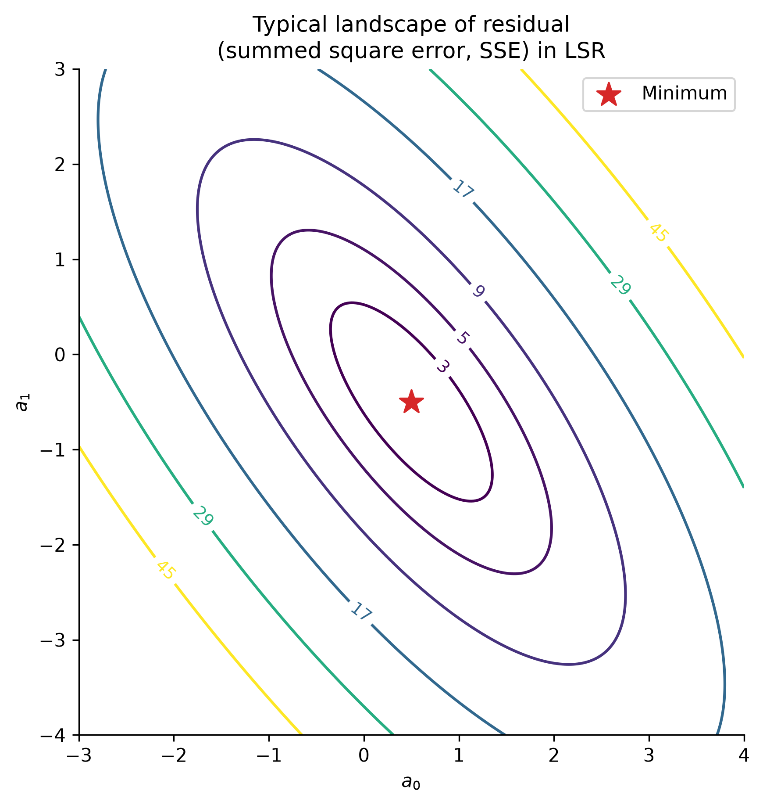
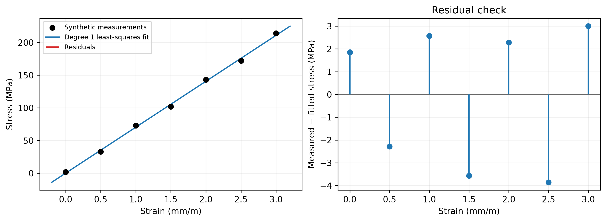
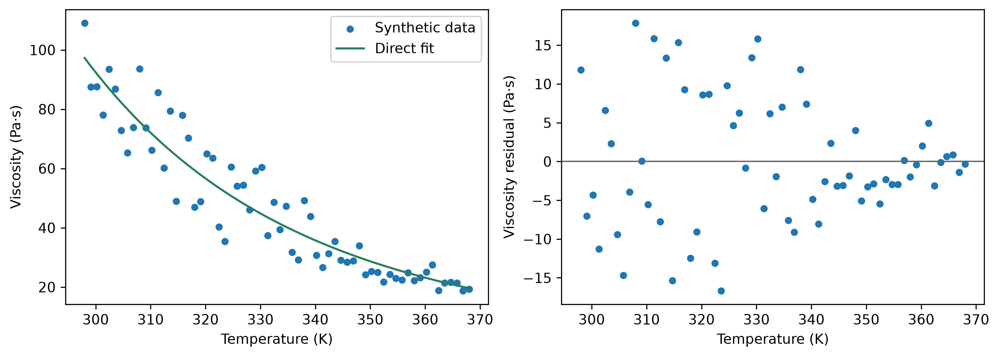

::: {.callout-note}
## Central question

**If a function cannot pass through every data point, how do we choose the coefficients that best represent the data?**
:::

## Learning outcomes

By the end of this lecture, you should be able to:

1. **Formulate** a fitting problem by identifying the known data, unknown parameters, residuals, and objective to minimize.
2. **Fit** a straight line, a low-degree polynomial, and a viscosity power law using NumPy or SciPy.
3. **Compare** a linearized power-law fit with direct nonlinear least squares by the residuals each method minimizes.
4. **Assess** a fitted model using residual patterns, parameter units, data range, and independent checks.

## From interpolation to an overall fit

In [L08](../L08), we constructed functions that passed through every supplied data point using **interpolation**. Given the **exact data points** $(P,T)$ on a phase diagram boundary, we can carefully choose an interpolation method and infer the gas–liquid coexistence pressure at another temperature $T$.

What if the data measurement is not exact? In many real-world engineering scenarios, even repeating the same condition produces fluctuating measurements. For a measured quantity $y$ that depends on one input $x$, we might write

$$
 y_{\mathrm{measured}}(x)=f_{\mathrm{true}}(x)+\text{systematic measurement error}+\text{random noise}.
$$

For example, when measuring the coexistence pressure, a poorly calibrated pressure sensor can shift all readings in the same direction, while small temperature fluctuations can cause the pressure to vary between readings. Interpolating these measurements exactly forces the curve to reproduce both the physical trend and the experimental errors.

### Interpolation or curve fitting?

Recall that a straight line can pass through two points, and a quadratic can pass through three. More generally, $N$ points with distinct inputs determine one polynomial of degree **at most $N-1$**, whether we write it in Lagrange or Newton form. That polynomial has $N$ adjustable coefficients to satisfy the $N$ data values. As we add noisy data, insisting on an exact match can give us an increasingly complicated curve.

The idea of **curve fitting** is to use a formula with fewer parameters, often just a few, to reproduce the overall trend. We first choose the form of the function, often called a **function family**, then adjust its parameters to represent the data overall. The fitted curve may pass through some points, but it is not required to pass through all of them ([Kiusalaas, 2013](../references.qmd#ref-kiusalaas2013), §3.4).

For example, bitumen becomes less viscous as its temperature increases. The synthetic data below illustrate how sample-to-sample differences, small temperature offsets, and measurement noise can obscure this trend. Here we use a synthetic example inspired by an [experimental study of bitumen viscosity](https://www.mdpi.com/1996-1073/12/12/2390) to demonstrate the difference between interpolation and curve fitting. For the curve fitting, we choose a decreasing power law to describe the viscosity:

$$
\mu(T)=\alpha T^{-p},
$$

where the **known data** are measured temperatures $T$ and viscosities $\mu$, and the **unknown parameters** are the scale $\alpha$ and exponent $p$. We use absolute temperature in kelvin and viscosity in $\mathrm{Pa\cdot s}$. A positive $p$ makes the viscosity decrease as temperature increases. The plotted values are generated for this illustration, and the power law describes their trend over the displayed temperature range.

{#fig-viscosity-fitting fig-alt="Three panels show four noisy synthetic viscosity series, an oscillating cubic spline through every point, and a smooth fitted decreasing power law."}

Two decisions are involved when we perform curve fitting:

1. **Choose a model:** a straight line, a polynomial, an Arrhenius law, or another function justified by the problem. An unsuitable function form introduces the [model-form error discussed in L02](../../01/L02/index.qmd#what-errors-appear-in-this-comparison), even if we find its best-fitting parameters.
2. **Choose a measure of mismatch:** what does “best fit” mean for these data?

Curve fitting also offers some benefits compared with exact interpolation:

1. **Physical insights:** when the parameters have physical meaning, fitting estimates properties of the system. For example, fitting the van der Waals parameters $a$ and $b$ to pressure–volume–temperature data estimates the strength of intermolecular attraction and the excluded volume.
2. **Capturing the general trend:** rounding the fitted exponent to $p\approx8$, increasing temperature from $298$ to $308\ \mathrm{K}$ gives $\mu(308)/\mu(298)=(308/298)^{-8}\approx0.77$, a decrease of about **23%**, even when individual measurements look scattered and messy.
3. **Extrapolation:** in [L08, “What does Python return outside the supplied temperature range?”](../L08/index.qmd#what-does-python-return-outside-the-supplied-temperature-range), we saw why extending an interpolant can be unreliable. A fitted model gives a stronger basis for extrapolation when its physical assumptions remain valid beyond the data. For example, early in the COVID-19 pandemic, models fitted to case counts were used to predict growth or decline under current prevention measures. Those predictions depended on assumptions about transmission and behaviour continuing to hold.

::: {.callout-note}
## Two uses of the word interpolation

We can use a fitted curve to predict a value **inside** the sampled input range. That is interpolation in the sense of where the prediction lies. An **interpolating function**, as constructed in L08, has the additional requirement that it pass through every supplied point.
:::

### Underfitting and overfitting

Curve fitting typically uses a few parameters to represent many data points. If the result looks poor, we need to distinguish two possible causes:

1. **The fitting procedure has not converged.** Within the chosen function family, another set of parameters still gives a smaller mismatch. For example, adjusting the slope and intercept of a poorly positioned line can bring it closer to the data.
2. **The function family has unsuitable flexibility.** Even after finding the parameters that minimize the chosen mismatch, a model with too few adjustable features may miss the overall shape (**underfitting**). A model with too much flexibility may follow the noise and predict poorly between measurements or for new data (**overfitting**).

{#fig-fitting-diagnostics fig-alt="Two panels distinguish an unfinished straight-line fit from model choice: a constant underfits curved data, a quadratic captures the trend, and a high-degree polynomial overfits."}

In general, we should check whether the chosen function can reproduce the shape of the data, then consider how many parameters that shape needs. A smaller mismatch on the fitted data alone cannot tell us whether extra parameters capture useful structure. Measurements held out of the fit help us judge whether the improvement carries over to new data.

::: {.callout-tip}
## Von Neumann's elephant

John von Neumann is credited with the remark, “With four parameters I can fit an elephant, and with five I can make him wiggle his trunk.” [The elephant example](https://en.wikipedia.org/wiki/Von_Neumann%27s_elephant) illustrates how adjustable parameters can reproduce an impressive shape without establishing a physical explanation.
:::

## First example: linear regression

The first example we will see is **linear regression**, which you might already have seen in another context. Our purpose is to represent the data using a linear equation (a first-degree polynomial):

$$
\hat f(x)=a_0+a_1x.
$$

- **What are our data?** We are given $N$ pairs $(x_i,y_i)$, where $i=1,2,\ldots,N$ labels the data points. These values are known.
- **What are the unknowns?** The intercept $a_0$ and slope $a_1$ are the two parameters we need to determine.

Two points at distinct inputs determine a line exactly. With more than two points, the data may not lie on one line. We then need a criterion for selecting one line from all possible lines.

In other words, linear regression becomes the following task:

1. Choose the function form $\hat f(x)=a_0+a_1x$, with two unknown parameters.
2. Define a measure of the mismatch between the data and the function.
3. **Minimize** the mismatch by adjusting $a_0$ and $a_1$.
4. Return the best parameters $a_0$ and $a_1$, along with the fitted function $\hat f$.

This is an **optimization problem**, similar to [L07](../L07/index.qmd#the-optimization-problem), with $a_0$ and $a_1$ as the variables.

### How do we measure the mismatch?

At each data point, define the **residual**

$$
\boxed{r_i=y_i-\hat f(x_i).}
$$

A positive residual means the observation is above the fitted curve, and its magnitude has the same units as $y$. This tells us how far the measurement is from our model, while the true experimental error would require knowledge of the true value. In these examples, we treat the input values as accurately known and fit the discrepancies in the output.

How do we measure the mismatch over all data points? A naive way is to add the residuals:

$$
E_{\mathrm{naive}}=r_1+r_2+\cdots+r_N=\sum_{i=1}^{N}r_i.
$$

Will this work? Positive and negative residuals can cancel, giving a small total even when the line misses the data badly. Two useful alternatives are:

- **Absolute error:** add the magnitudes of the residuals.

$$
\begin{aligned}
E_{\mathrm{abs}}
&=|r_1|+|r_2|+\cdots+|r_N|=\sum_{i=1}^{N}|r_i|\\
&=|y_1-(a_0+a_1x_1)|+\cdots+|y_N-(a_0+a_1x_N)|\\
&=\sum_{i=1}^{N}|y_i-(a_0+a_1x_i)|.
\end{aligned}
$$

- **Squared error:** add the squares of the residuals.

$$
\begin{aligned}
E_{\mathrm{sq}}
&=r_1^2+r_2^2+\cdots+r_N^2=\sum_{i=1}^{N}r_i^2\\
&=[y_1-(a_0+a_1x_1)]^2+\cdots+[y_N-(a_0+a_1x_N)]^2\\
&=\sum_{i=1}^{N}[y_i-(a_0+a_1x_i)]^2.
\end{aligned}
$$

**Quick check:** residuals of $+10$ and $-10$ have a sum of zero. What are their absolute-error and squared-error sums? Would you call either point an exact match?

::: {.callout-note collapse="true"}
## Answer: absolute-error and squared-error sums

The absolute-error sum is $|10|+|-10|=20$, and the squared-error sum is $10^2+(-10)^2=200$. Neither point is an exact match, because neither residual is zero.
:::

We commonly use the squared error $E_{\mathrm{sq}}$ as the mismatch measure. Minimizing it is the basis of **least-squares regression (LSR)**. From here on, $E$ refers to this squared-error sum unless stated otherwise.

::: {.callout-important collapse="true"}
## Why square the residuals?

Squaring prevents cancellation and gives a smooth objective when the model is differentiable. It also penalizes large residuals strongly, so an outlier can pull the fit toward itself.

We can also minimize the absolute residuals, which often reduces the influence of large outliers. The absolute-value function has a corner at zero, so this objective requires different optimization tools. The choice between the objectives depends on what we know about the measurements and the prediction we need.
:::

For a straight line, the least-squares problem is therefore

$$
\boxed{\min_{a_0,a_1} E(a_0,a_1),\qquad
E(a_0,a_1)=\sum_{i=1}^{N}(y_i-a_0-a_1x_i)^2.}
$$

## The basics of least squares

### Solution to the linear least-squares problem

For a straight line, $E$ is a **quadratic function** of the two unknown coefficients. Provided the inputs are not all identical, it has **one minimum** in the two-dimensional parameter space $(a_0,a_1)$. How do we find the minimum? Set the partial derivatives of $E$ with respect to $a_0$ and $a_1$ both equal to zero.

Starting from

$$
E(a_0,a_1)=\sum_{i=1}^{N}[y_i-(a_0+a_1x_i)]^2,
$$

the **chain rule** gives a factor of $2[y_i-(a_0+a_1x_i)]$ from the square, multiplied by the derivative of the expression inside. That inner derivative is $-1$ with respect to $a_0$ and $-x_i$ with respect to $a_1$:

$$
\begin{aligned}
\frac{\partial E}{\partial a_0}
&=\sum_{i=1}^{N}2[y_i-(a_0+a_1x_i)](-1)\\
&=-2\sum_{i=1}^{N}(y_i-a_0-a_1x_i)=0,\\[6pt]
\frac{\partial E}{\partial a_1}
&=\sum_{i=1}^{N}2[y_i-(a_0+a_1x_i)](-x_i)\\
&=-2\sum_{i=1}^{N}x_i(y_i-a_0-a_1x_i)=0.
\end{aligned}
$$

How many equations? Just **two**, because this is a two-parameter problem. Dividing each equation by $-2$ and collecting the terms containing $a_0$ and $a_1$ gives

$$
\begin{aligned}
\frac{\partial E}{\partial a_0}=0
&\quad\Longrightarrow\quad
Na_0+\left(\sum_{i=1}^{N}x_i\right)a_1=\sum_{i=1}^{N}y_i,\\[6pt]
\frac{\partial E}{\partial a_1}=0
&\quad\Longrightarrow\quad
\left(\sum_{i=1}^{N}x_i\right)a_0+
\left(\sum_{i=1}^{N}x_i^2\right)a_1=\sum_{i=1}^{N}x_iy_i.
\end{aligned}
$$

Here $\sum_{i=1}^{N}a_0=Na_0$ because the same intercept appears once for each of the $N$ data points. To simplify the notation, define four sums of the known data: $S_x$ and $S_y$ add the inputs and outputs, $S_{xx}$ adds the squared inputs, and $S_{xy}$ adds the input–output products.

$$
\begin{aligned}
S_x&=x_1+x_2+\cdots+x_N, & S_y&=y_1+y_2+\cdots+y_N,\\
S_{xx}&=x_1^2+x_2^2+\cdots+x_N^2, & S_{xy}&=x_1y_1+x_2y_2+\cdots+x_Ny_N.
\end{aligned}
$$

The equations and their matrix form are

$$
\begin{cases}
Na_0+S_xa_1=S_y,\\
S_xa_0+S_{xx}a_1=S_{xy},
\end{cases}
\qquad\Longleftrightarrow\qquad
\underbrace{\begin{bmatrix}N&S_x\\S_x&S_{xx}\end{bmatrix}}_{\text{known }2\times2\text{ matrix}}
\underbrace{\begin{bmatrix}a_0\\a_1\end{bmatrix}}_{\text{unknown coefficients}}
=
\underbrace{\begin{bmatrix}S_y\\S_{xy}\end{bmatrix}}_{\text{known sums}}.
$$

Solving these two equations by basic algebra gives

$$
\boxed{
a_0=\frac{S_{xx}S_y-S_xS_{xy}}{NS_{xx}-S_x^2},\qquad
a_1=\frac{NS_{xy}-S_xS_y}{NS_{xx}-S_x^2}.
}
$$

We will study methods for solving systems of linear equations in more detail in the next unit.

::: {.callout-important}
## The measurements are fixed while we solve for the coefficients

The $N$ pairs $(x_i,y_i)$ are known, so every entry in the matrix and on the right-hand side can already be calculated. We have chosen the function form $\hat f(x)=a_0+a_1x$, and the only unknowns are its two coefficients. Collecting more measurements changes the sums but leaves us with two unknowns.

This gives another connection to **systems of equations**. In L08, the equations required the curve to match each point. Here they express the condition that the overall squared error is minimized.
:::

{#fig-lsr-objective fig-alt="Tilted elliptical contours of a generic quadratic SSE objective on a0 and a1 axes, with a star marking its minimum." width="80%"}

The sum-of-squares objective is nonlinear in the coefficients, but its first-derivative equations are linear. This is why a straight-line fit can be calculated directly, without choosing an iterative starting guess.

::: {.callout-note collapse="true"}
## Derivation of the two least-squares equations and their solution

All $x_i$ and $y_i$ are known. Differentiating with respect to the two unknowns gives

$$
\frac{\partial E}{\partial a_0}
=-2\sum_{i=1}^{N}(y_i-a_0-a_1x_i)=0,
$$

$$
\frac{\partial E}{\partial a_1}
=-2\sum_{i=1}^{N}x_i(y_i-a_0-a_1x_i)=0.
$$

Using the four data sums defined above, the equations become

$$
Na_0+S_xa_1=S_y,\qquad S_xa_0+S_{xx}a_1=S_{xy}.
$$

Solving gives

$$
\boxed{
a_1=\frac{NS_{xy}-S_xS_y}{NS_{xx}-S_x^2},\qquad
a_0=\frac{S_{xx}S_y-S_{xy}S_x}{NS_{xx}-S_x^2}.
}
$$

The denominator is zero when all inputs coincide. In that case, the data cannot determine an independent slope and intercept.

For hand calculation these formulas are useful. With large input offsets, subtraction of nearly equal sums can lose precision. Let $\bar x=(x_1+\cdots+x_N)/N$ and $\bar y=(y_1+\cdots+y_N)/N$ denote the mean input and output. The equivalent centred form is preferable:

$$
a_1=\frac{\sum_i(x_i-\bar x)(y_i-\bar y)}{\sum_i(x_i-\bar x)^2},
\qquad a_0=\bar y-a_1\bar x.
$$

Notice that the fitted line passes through $(\bar x,\bar y)$.
:::

### Fit the line in Python

In practice, we do not need to calculate $S_x$, $S_y$, $S_{xx}$, and $S_{xy}$ ourselves. Python's numerical libraries provide polynomial-fitting functions that calculate the best coefficients directly.

If you have seen older NumPy tutorials, you might be familiar with `numpy.polyfit`:

```{.python code-fold="false"}
import numpy as np

slope, intercept = np.polyfit(x, y, deg=1)
f_hat = np.poly1d([slope, intercept])
residual = y - f_hat(x)
```

`np.polyfit` returns coefficients from **highest power to constant**, meaning $a_1,a_0$ for a straight line. `np.poly1d` turns those coefficients into a function we can evaluate.

NumPy's newer `Polynomial.fit` interface rescales the inputs internally to reduce numerical difficulties from large input values or offsets and returns an object that we can evaluate like a function. This is the interface we will use:

```{.python code-fold="false"}
from numpy.polynomial import Polynomial

f_hat = Polynomial.fit(x, y, deg=1)
intercept, slope = f_hat.convert().coef
residual = y - f_hat(x)  # Evaluate the fitted function at the data inputs.
```

The `.convert()` step expresses the coefficients in the original input coordinate. Its coefficients are ordered from **constant to highest power**, meaning $a_0,a_1,\ldots$. Notice that this is the reverse of the `np.polyfit` convention.

Below is a simple linear regression test using NumPy. We fit a line to seven data points, then calculate the residuals:

::: {.quarto-wasm-local notebook="l09_least_squares.edit.py" view="edit" title="Fit test data and inspect the residuals" height="840" loading="lazy" fullscreen="true"}
```{.python code-fold="false"}
import numpy as np
from numpy.polynomial import Polynomial

x = np.array([0., 0.5, 1., 1.5, 2., 2.5, 3.])
y = np.array([2., 33., 73., 102., 143., 172., 214.])
f_hat = Polynomial.fit(x, y, deg=1)
residual = y - f_hat(x)
print(f_hat.convert().coef)
print(residual)
```

We can also use plotting libraries to show the fitted line and the residual at each data point:

{fig-alt="Linear regression of test data beside a residual plot."}
:::

### How good is the fit?

Once the coefficients are known, we can summarize the residuals with a single number to describe how well $\hat f$ matches the current data. A natural choice is the same squared-error sum used in the least-squares optimization.

- **Sum of squared errors (SSE):** the total squared mismatch over all $N$ data points.

$$
\mathrm{SSE}=r_1^2+r_2^2+\cdots+r_N^2
=\sum_{i=1}^{N}[y_i-\hat f(x_i)]^2.
$$

SSE generally increases as we add more data with a similar level of scatter. To compare the average squared mismatch across datasets of different sizes, divide by the number of points:

- **Mean squared error (MSE):** the squared mismatch per data point, averaged over the dataset.

$$
\mathrm{MSE}=\frac{r_1^2+r_2^2+\cdots+r_N^2}{N}
=\frac{\mathrm{SSE}}{N}.
$$

Taking the square root returns the measure to the units of the output:

- **Root mean squared error (RMSE):**

$$
\mathrm{RMSE}=\sqrt{\frac{r_1^2+r_2^2+\cdots+r_N^2}{N}}
=\sqrt{\mathrm{MSE}}.
$$

We can also summarize the magnitudes of the residuals, even though we used squared residuals to choose the coefficients:

- **Mean absolute error (MAE):**

$$
\mathrm{MAE}=\frac{|r_1|+|r_2|+\cdots+|r_N|}{N}
=\frac{1}{N}\sum_{i=1}^{N}|y_i-\hat f(x_i)|.
$$

RMSE and MAE have the units of the measured output. MSE and SSE have squared units. Averaging removes the direct dependence on dataset size, but comparisons still need similar output scales and measurement conditions.

For the test data above, these measures are straightforward to calculate:

```{.python code-fold="false"}
sse = np.sum(residual**2)
mse = np.mean(residual**2)
rmse = np.sqrt(mse)
mae = np.mean(np.abs(residual))
print(sse, mse, rmse, mae)
```

Other measures describe relative mismatch. The **mean absolute percentage error (MAPE)** averages each absolute residual as a fraction of its observed value:

$$
\mathrm{MAPE}=\frac{100\%}{N}\left(
\left|\frac{r_1}{y_1}\right|+\left|\frac{r_2}{y_2}\right|+\cdots+
\left|\frac{r_N}{y_N}\right|\right).
$$

MAPE can help when percentage errors are meaningful, but it is undefined for a zero observation and can be dominated by observations close to zero.

For linear regression, the familiar **coefficient of determination**, or **R-squared**, compares the squared error with the error from predicting the mean $\bar y=(y_1+\cdots+y_N)/N$:

$$
\boxed{R^2=1-\frac{\sum_{i=1}^{N}[y_i-\hat f(x_i)]^2}{\sum_{i=1}^{N}(y_i-\bar y)^2}.}
$$

For ordinary least squares with an intercept, evaluated on the fitted data, $R^2$ lies between 0 and 1 when the data have nonzero variance. A value near 1 means that little squared variation remains relative to the mean-only prediction.

::: {.callout-warning}
## Check physical meaning as well as $R^2$

The same formula can be calculated for nonlinear models, but its usual linear-regression interpretation does not automatically carry over. It can be negative for a poor prediction or on new data, and is undefined when every observed $y_i$ is identical.

An $R^2$ calculated for $\ln y$ measures a different quantity from one calculated for $y$. Neither establishes that the chosen function describes the underlying physics.
:::

**Rule of thumb: always plot the residuals as well**

- A curved pattern suggests that the chosen model misses a systematic trend.
- A growing spread suggests that the measurement uncertainty changes with the output or input.
- One unusually large residual invites a check of that measurement and the model assumptions.

A residual is small only relative to the accuracy the application needs. Data not used for fitting provide a stronger prediction check than the same data used to choose the coefficients.

### A curved pattern in the residuals

Consider data generated from $y=1+0.4x+0.9x^2+1.2x^3$ with added random noise. A straight-line fit cannot follow the curved trend, so its residuals show a systematic pattern. In the demo, change the polynomial degree from **1 to 10** while keeping the same data. Compare the coefficients, residual shape, and SSE. The plot scales stay fixed so that changes in the scatter remain visible.

::: {.quarto-wasm-local notebook="l09_residual_patterns.edit.py" view="edit" title="Change polynomial degree and inspect residual patterns in noisy cubic data" height="1000" loading="lazy" fullscreen="true"}
```{.python code-fold="false"}
x = np.linspace(-2.0, 2.0, 31)
noise = np.random.default_rng(18).normal(0.0, 0.20, size=x.size)
y = 1.0 + 0.4*x + 0.9*x**2 + 1.2*x**3 + noise

degree = 1  # Change from 1 to 10; compare coefficients and SSE.
f_hat = Polynomial.fit(x, y, deg=degree)
residual = y - f_hat(x)
```

{fig-alt="Three columns compare degree-one, degree-three, and degree-ten polynomial fits to noisy cubic data, with signed residual plots below and fixed response limits from minus 10 to 15."}
:::

**Quick check:** why does the smaller SSE at degree 10 alone give us insufficient evidence to prefer it over degree 3?

## Fitting nonlinear equations

### Method 1: Linearization

A curved relation can sometimes be transformed into a straight line. You have already met a few examples:

- **The power-law error trend in L02:** $E(N)=CN^{-p}$ becomes $\ln E=\ln C-p\ln N$. Plotting $\ln E$ against $\ln N$ gives a straight line with intercept $\ln C$ and slope $-p$.
- **The bitumen viscosity model:** $\mu(T)=\alpha T^{-p}$ becomes $\ln\mu=\ln\alpha-p\ln T$. Here the straight line has intercept $\ln\alpha$ and slope $-p$.
- **The van der Waals equation, with $a$ known:** $(P+a/v^2)(v-b)=RT$ can be rearranged as $v(P+a/v^2)-RT=b(P+a/v^2)$. If we define $X=v(P+a/v^2)-RT$ and $Y=P+a/v^2$, then $Y=X/b$. A line through the origin has slope $1/b$. This construction requires a known $a$ to calculate $X$ and $Y$, and measurement errors can enter both transformed quantities.

For many nonlinear formulas, we can first rewrite the relation in linear terms and perform linear least-squares regression. The resulting coefficients can be calculated directly, avoiding the starting guess and iterative search required for a nonlinear fit. The transformation also changes how measurement errors enter the fitting problem, so we need to examine the residuals in both the transformed and original variables.

@tbl-linearizing-models lists several common transformations. In each row, fit a straight line to the transformed data $(X_i,Y_i)$, then recover the original parameters from its intercept $a_0$ and slope $a_1$.

| Original relation | $X$ | $Y$ | Recover the parameters |
|---|---|---|---|
| $y=bx^m$ | $\ln x$ | $\ln y$ | $b=e^{a_0}$, $m=a_1$ |
| $y=be^{mx}$ | $x$ | $\ln y$ | $b=e^{a_0}$, $m=a_1$ |
| $y=1/(mx+b)$ | $x$ | $1/y$ | $b=a_0$, $m=a_1$ |
| $y=mx/(b+x)$ | $1/x$ | $1/y$ | $m=1/a_0$, $b=a_1/a_0$ |
| $k=Ae^{-E_a/(RT)}$ | $1/T$ | $\ln k$ | $A=e^{a_0}$, $E_a=-Ra_1$ |

: Transformations for fitting a straight line to a nonlinear relation. {#tbl-linearizing-models}

Logarithms require positive values, and reciprocals require nonzero values. For quantities with units, we take logarithms of their numerical values in stated reference units, such as $\ln[T/(1\ \mathrm{K})]$ and $\ln[\mu/(1\ \mathrm{Pa\cdot s})]$. The notation $\ln T$ and $\ln\mu$ below uses this convention.

### Linearization of the bitumen problem

Let's use the bitumen example to follow the calculation step by step.

1. **What nonlinear equation do we want to fit?** The known data are the temperatures $T_i$ and viscosities $\mu_i$. Our chosen function is

   $$
   \hat f(T)=\alpha T^{-p},
   $$

   with unknown parameters $\alpha$ and $p$.

2. **How do we linearize it?** This is the power-law row of @tbl-linearizing-models, with $b=\alpha$ and $m=-p$. Define

   $$
   X_i=\ln T_i,\qquad Y_i=\ln\mu_i.
   $$

   The transformed fitted function is

   $$
   \hat f_{\log}(X)=\ln\alpha-pX=a_0+a_1X.
   $$

   Thus $a_0=\ln\alpha$ and $a_1=-p$.

3. **Use NumPy's polynomial solver.** Convert the data before fitting the line:

   ```{.python code-fold="false"}
   X = np.log(T)
   Y = np.log(mu)
   log_fit = Polynomial.fit(X, Y, deg=1)
   a0, a1 = log_fit.convert().coef
   ```

4. **Recover the original coefficients.** The table gives $\alpha=e^{a_0}$ and $p=-a_1$:

   ```{.python code-fold="false"}
   alpha = np.exp(a0)
   p = -a1

   def f_hat(T):
       return alpha * T**(-p)
   ```

5. **Perform residual analysis.** The fit minimizes the squared log residuals. We can also calculate residuals in the original viscosity units:

   ```{.python code-fold="false"}
   log_residual = Y - log_fit(X)
   residual = mu - f_hat(T)
   ```

The notebook uses the same four synthetic series as the introductory figure, stored as ordinary NumPy arrays. The data, transformation, fit, and recovered parameters are in separate editable cells, with the plotting code collapsed.

::: {.quarto-wasm-local notebook="l09_bitumen_linearized.edit.py" view="edit" title="Fit the bitumen power law by linearizing the data" height="1000" loading="lazy" fullscreen="true"}
The transformed fit gives $p\approx7.7885$ and $\hat f(298\ \mathrm{K})\approx97.45\ \mathrm{Pa\cdot s}$.

{fig-alt="A decreasing power-law curve through scattered viscosity data, beside the signed viscosity residuals."}
:::

### Method 2: Direct nonlinear least squares in Python

We can also fit the nonlinear function directly. This is a multivariable optimization problem in the model parameters $p_0,p_1,\ldots$:

$$
E(p_0,p_1,\ldots)=\sum_{i=1}^{N}\left[y_i-\hat f(x_i;p_0,p_1,\ldots)\right]^2.
$$

The $x_i,y_i$ values remain fixed while the optimizer adjusts the parameters. SciPy provides several interfaces for this calculation:

- [`curve_fit`](https://docs.scipy.org/doc/scipy/reference/generated/scipy.optimize.curve_fit.html) is a convenient choice for a parameterized curve. Supply the model, data, and starting parameters. It constructs the least-squares problem for you.
- [`minimize`](https://docs.scipy.org/doc/scipy/reference/generated/scipy.optimize.minimize.html) accepts a scalar objective function. We can supply the entire squared-error sum ourselves, using a vector of parameters as the optimization variable.
- [`least_squares`](https://docs.scipy.org/doc/scipy/reference/generated/scipy.optimize.least_squares.html) accepts the vector of residuals and provides more control over a least-squares calculation.

For the bitumen model, $\alpha$ is numerically very large when $T$ is in kelvin. We can keep the fitted parameters on more manageable scales by writing the same power law as

$$
\hat f(T)=A\left(\frac{T}{T_{\mathrm{ref}}}\right)^{-p},
\qquad T_{\mathrm{ref}}=298\ \mathrm{K},
\qquad \alpha=A T_{\mathrm{ref}}^p.
$$

Now $A$ is the fitted viscosity at $298\ \mathrm{K}$, in $\mathrm{Pa\cdot s}$, and $p$ is dimensionless. This reparameterization preserves the original viscosity-space objective:

$$
E(A,p)=\sum_{i=1}^{N}\left[\mu_i-A\left(\frac{T_i}{T_{\mathrm{ref}}}\right)^{-p}\right]^2.
$$

The fitting call is

```{.python code-fold="false"}
from scipy.optimize import curve_fit

T_ref = 298.0

def power_law(T, A, p):
    return A * (T / T_ref)**(-p)

parameters, covariance = curve_fit(
    power_law, T, mu, p0=[100.0, 8.0], bounds=(0, [np.inf, 50.0])
)
A, p = parameters
```

Here `p0` supplies the starting values of $A$ and $p$. The bounds require nonnegative parameters and limit the exponent to $50$, a broad range for this example. `covariance` is an approximate parameter-covariance matrix based on the local fit and its error assumptions.

The notebook below also constructs the scalar objective explicitly and passes it to `minimize`. Both calls use the same model, data, starting values, and bounds, so their results should agree when they reach the same minimum.

::: {.quarto-wasm-local notebook="l09_bitumen_direct.edit.py" view="edit" title="Fit the bitumen power law directly with curve_fit and minimize" height="1100" loading="lazy" fullscreen="true"}
```{.python code-fold="false"}
from scipy.optimize import minimize

def objective(parameters):
    return np.sum((mu - power_law(T, *parameters))**2)

result = minimize(
    objective, x0=[100.0, 8.0], method="L-BFGS-B",
    bounds=[(0, None), (0, 50)],
)
print(result.success, result.message)
print(result.x)
```

The direct fit gives $p\approx7.5893$ and $A\approx97.25\ \mathrm{Pa\cdot s}$.

{fig-alt="A directly fitted decreasing power law through the viscosity data, beside the signed viscosity residuals."}
:::

### Compare the two methods

The fitted curves are similar for these data, but their exponents differ. The reason is that the two methods minimize different quantities:

$$
\begin{aligned}
E_{\log}&=\sum_{i=1}^{N}\left[\ln\mu_i-\ln\hat f(T_i)\right]^2,
&&\text{linearized fit},\\
E_{\mu}&=\sum_{i=1}^{N}\left[\mu_i-\hat f(T_i)\right]^2,
&&\text{direct fit}.
\end{aligned}
$$

| Fit | $p$ | $\hat f(298\ \mathrm{K})$ ($\mathrm{Pa\cdot s}$) | Viscosity-space SSE ($\mathrm{(Pa\cdot s)^2}$) | Log-space SSE |
|---|---:|---:|---:|---:|
| Linearized | 7.7885 | 97.45 | 4305.03 | **1.60183** |
| Direct nonlinear | 7.5893 | 97.25 | **4272.26** | 1.63623 |

Each fit gives the smaller value of the objective it minimizes. Since $\ln\mu_i-\ln\hat f(T_i)=\ln[\mu_i/\hat f(T_i)]$, the logarithmic fit compares ratios. For small discrepancies, this is approximately a relative error. The direct fit compares absolute viscosity differences, so the larger viscosities can contribute more strongly to its objective when relative scatter is similar.

A linearized fit can be solved directly when the transformed inputs determine independent coefficients. A nonlinear fit may be more sensitive to starting values, parameter scales, and multiple minima, especially as the number of parameters grows. Linearization avoids that iterative search, but repeated transformed inputs or poorly separated coefficient effects can still prevent a reliable solution. The appropriate fit depends on which error model describes the measurements.

**Quick check:** if the measurements have roughly constant percentage uncertainty, which of these two objectives better reflects that uncertainty?

## (Bonus topic) General linear least squares

The two-coefficient line fit extends to a larger system of equations when we add more coefficients. This connection will return in the next unit.

A model can curve with $x$ and still be **linear in its unknown coefficients**. For example,

$$
\hat f(x)=a_0+a_1x+a_2x^2
$$

is linear in $a_0,a_1,a_2$. More generally,

$$
\boxed{\hat f(x)=a_0\phi_0(x)+a_1\phi_1(x)+\cdots+a_{p-1}\phi_{p-1}(x)
=\sum_{j=0}^{p-1}a_j\phi_j(x).}
$$

The **basis functions** $\phi_j$ are completely specified before fitting. We adjust only their coefficients. Examples include $1,x,x^2$, or $1,\sin x,\cos x$ for a periodic trend.

**Quick check:** which is linear in its unknowns: $a_0+a_1e^{-2x}$, or $a_0e^{-a_1x}$?

### How large is the system?

Here $p$ denotes the number of unknown coefficients. With $N$ data points and $p$ unknown coefficients, form a **design matrix** with one row per point and one column per basis function:

$$
\Phi_{ij}=\phi_j(x_i),\qquad
\Phi\text{ has shape }N\times p.
$$

The predicted data are $\Phi\mathbf a$. We minimize the same sum of squared residuals as before, now with $p$ adjustable coefficients. Usually $N>p$, so there are more observations than coefficients.

NumPy's [`lstsq`](https://numpy.org/doc/stable/reference/generated/numpy.linalg.lstsq.html) handles this general linear problem:

```{.python code-fold="false"}
Phi = np.column_stack([np.ones_like(x), x, x**2])
coefficients, _, rank, singular_values = np.linalg.lstsq(Phi, y, rcond=None)
f_hat_values = Phi @ coefficients
residual = y - f_hat_values
```

This quadratic has three coefficients, regardless of how many data points we collect. `rank == 3` indicates three independent columns at the solver's numerical threshold. If the columns are dependent, the data cannot determine all coefficients independently.

::: {.callout-note collapse="true"}
## From minimization to the normal equations

Taking the derivative with respect to each coefficient gives

$$
\sum_{j=0}^{p-1}\left[\sum_{i=1}^{N}\phi_k(x_i)\phi_j(x_i)\right]a_j
=\sum_{i=1}^{N}\phi_k(x_i)y_i,
\qquad k=0,\ldots,p-1.
$$

In matrix notation,

$$
\boxed{\Phi^\mathsf T\Phi\,\mathbf a=\Phi^\mathsf T\mathbf y.}
$$

These are the **normal equations**, a $p\times p$ system. For a degree-$m$ polynomial, $p=m+1$ and $\phi_j(x)=x^j$. A quadratic gives

$$
\begin{bmatrix}
N & \sum x_i & \sum x_i^2\\
\sum x_i & \sum x_i^2 & \sum x_i^3\\
\sum x_i^2 & \sum x_i^3 & \sum x_i^4
\end{bmatrix}
\begin{bmatrix}a_0\\a_1\\a_2\end{bmatrix}
=
\begin{bmatrix}\sum y_i\\\sum x_i y_i\\\sum x_i^2 y_i\end{bmatrix}.
$$

Every sum on the left and right can be calculated from the supplied data. The three unknown coefficients remain in the central column, giving a $3\times3$ system for this quadratic fit.

For computation, use `lstsq` rather than explicitly forming an inverse of $\Phi^\mathsf T\Phi$. Forming the normal matrix squares the 2-norm condition number for a full-column-rank design matrix, making an already sensitive problem harder to solve accurately.
:::


## Which Python function should I call?

Curve fitting covers more than we can study in a 50-minute class. For the problems introduced here, the following functions provide useful starting points:

| Model or task | Function | What you supply |
|---|---|---|
| Straight line or low-degree polynomial | `Polynomial.fit` or `np.polyfit` | Data and degree |
| Parameterized nonlinear curve | `scipy.optimize.curve_fit` | Model, data, starting parameters; optional uncertainties and bounds |
| General scalar objective | `scipy.optimize.minimize` | Objective function and starting parameters |

For more flexibility in how the model or residuals are constructed:

| Model or task | Function | What you supply |
|---|---|---|
| Specified linear combination of basis functions | `np.linalg.lstsq` | Design matrix and observations |
| Custom residual vector | `scipy.optimize.least_squares` | Residual function and starting parameters |

Always remember, **a minimum does not require the residuals to be zero**. At a smooth, unconstrained interior minimum, the derivatives of the **overall objective** with respect to the parameters are zero. Individual residuals can remain nonzero.

## Summary of topics in Unit 2

Across Unit 02, the computational questions now connect:

| Task | What do we vary? | What do we ask for? |
|---|---|---|
| Root finding | State variable, such as volume | A physical residual equal to zero |
| Optimization | State variable, such as volume | Lowest objective, such as free energy |
| Interpolation | Coefficients of a chosen function | Zero mismatch at every supplied point |
| Regression | Parameters of a chosen model | Minimum overall mismatch with the data |

The next step is to handle **several unknowns together**. The spline coefficients in L08 and the regression coefficients here have already given us examples of systems of equations.

## Before the next lecture

1. Write a least-squares objective for fitting $y=a_0+a_1x+a_2x^2$. Identify every known quantity and unknown coefficient.
2. Explain why fitting $\ln\mu$ and fitting $\mu$ directly can give different exponents $p$, even with the same power law and viscosity data.
3. A degree-six polynomial gives nearly zero residual on seven noisy measurements. What evidence would you need before using it for prediction?
4. You have 100 measurements and a quadratic model. What are the shapes of the design matrix and the normal-equation matrix? Which Python function would you call?
