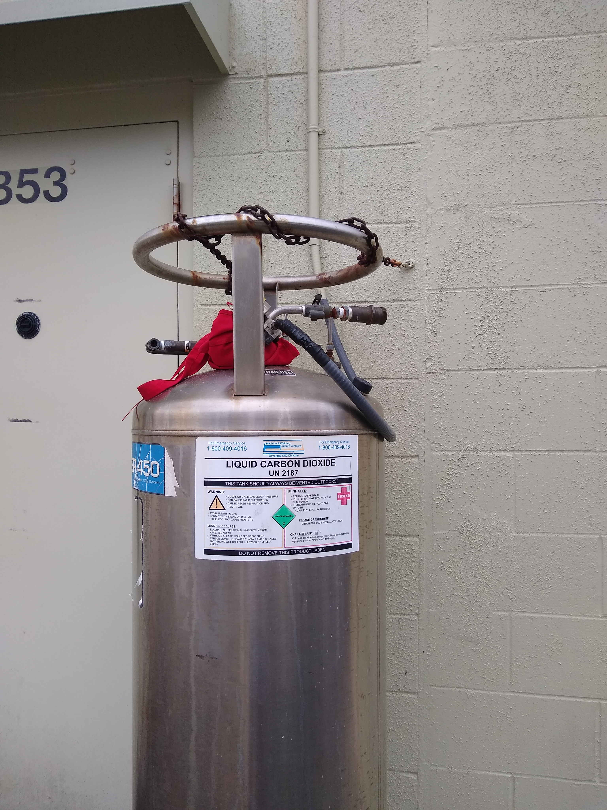
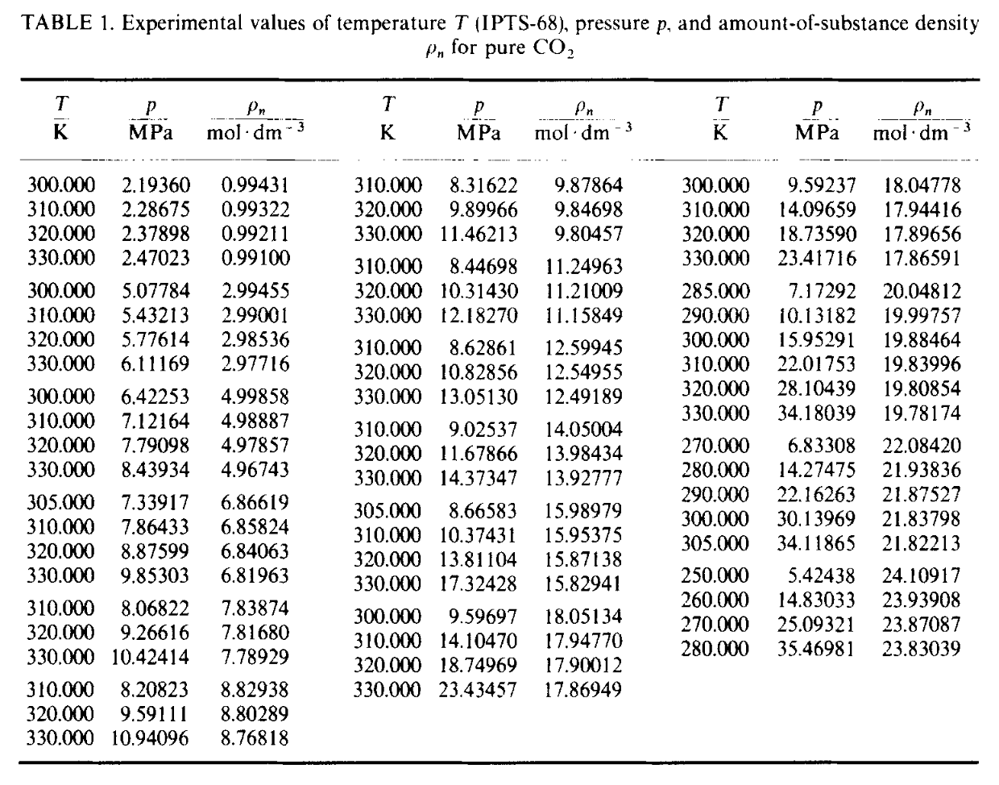

::: {.callout-note}
## Central question

**How can we build an end-to-end Python program that fits van der Waals parameters to CO₂ measurements and predicts its liquid–gas phase boundary?**
:::

## Learning outcomes

By the end of this lecture, you should be able to:

1. **Fit** the two van der Waals parameters to measured pressure–volume–temperature data and judge the fit on states it did not use.
2. **Assemble** a coexistence-pressure calculation in which a root finder repeatedly calls two free-energy minimizations.
3. **Construct** a liquid–gas boundary from a few calculated pressures by interpolation.
4. **Distinguish** checks that verify the numerical calculation from a comparison that tests the model against measured CO₂.

In [L05–L09](../index.qmd), we studied four numerical tasks, mostly through functions of one variable:

- **Root finding:** find $x$ such that $f(x)=0$.
- **Optimization:** find $x$ that minimizes or maximizes $f(x)$. When derivatives are available, solving $f'(x)=0$ identifies stationary points that we can test for minima or maxima.
- **Interpolation:** construct a function $\hat f(x)$ that passes through every given data point $(x_i,y_i)$.
- **Curve fitting:** choose the coefficients of a function $\hat f(x)$ to best describe the data according to an error measure, such as the sum of squared residuals.

Today we combine these methods into **one program** during a live coding demonstration.

## The engineering question

:::: {.columns}
::: {.column width="65%"}
CO₂ is stored and transported as a pressurized fluid in gas cylinders, beverage and fire-suppression systems, and carbon-capture pipelines. Whether it is a gas or a liquid affects how much a vessel holds and whether a compressor or a pump is needed. The **saturation pressure** $P_{\mathrm{sat}}(T)$ is the pressure at which liquid and gas CO₂ can coexist at temperature $T$.

Imagine that your client is Air Liquide. They provide measurements of CO₂ density, pressure, and temperature and ask for a program that predicts $P_{\mathrm{sat}}(T)$ between **250 and 295 K**. We will fit a van der Waals (vdW) model to the measurements, then use it to calculate the liquid–gas boundary.
:::
::: {.column width="35%"}
{fig-alt="An outdoor insulated tank used to store liquid carbon dioxide." width="100%"}
:::
::::

Photo: [Whoisjohngalt, Wikimedia Commons](https://commons.wikimedia.org/wiki/File:A_container_of_liquid_carbon_dioxide.jpg), [CC BY-SA 4.0](https://creativecommons.org/licenses/by-sa/4.0/).

### What are we given?

| | For this lecture |
|---|---|
| **Known data** | CO₂ pressure–volume–temperature measurements from [Ely, Haynes and Bain (1989)](../references.qmd#ref-ely1989isochoric), using 36 states between 300 and 330 K |
| **Model** | The vdW equation of state, with two unknown constants $a$ and $b$ |
| **Wanted** | $P_{\mathrm{sat}}(T)$ between 250 and 295 K, below the temperatures used for fitting |

Ely and colleagues measured CO₂ along lines of nearly constant density by heating a sealed cell and recording its pressure. The table below shows how the measurements were reported. Our data file converts molar density $\rho$ in mol/L to molar volume $v=1/\rho$ in L/mol.

{fig-alt="A table of experimental CO2 temperatures, pressures, and molar densities." width="90%"}

We fit **15 states from four low-density series**, at nominal densities of about 1, 3, 6.9, and 9.9 mol/L, and reserve the other 21 states to test the model. This lets us compare its performance both within and beyond the density range used for fitting.

{fig-alt="Pressure rises with density on each isotherm from 300 to 330 K. The fitting points lie at densities of about 1, 3, 6.9, and 9.9 mol/L. Held-back points extend to 16 mol/L." width="90%"}

### Components of the design problem

#### Part 1: Curve fitting

We start with the vdW equation of state introduced in L05:

$$
P_{\mathrm{vdW}}(T,v;a,b)=\frac{RT}{v-b}-\frac{a}{v^2},
\qquad v=\frac{V}{n}.
$$

The parameter $b$ accounts for the volume excluded by the molecules, while $a/v^2$ accounts for the reduction in pressure due to molecular attraction. With $v$ in L/mol and $P$ in bar, we use $R=0.08314462618\ \mathrm{L\,bar/(mol\,K)}$. The units of $a$ and $b$ are $\mathrm{L^2\,bar/mol^2}$ and L/mol, respectively.

**Sanity check:** What are the model's inputs and output? Which quantities are known, and which do we fit?

::: {.callout-tip collapse="true"}
## Answer: Known states and fitted parameters

Each state supplies two inputs, $T_i$ and $v_i$, and a measured output, $P_i$. The model predicts pressure. We fit one pair of parameters, $a$ and $b$, shared by all 15 states.
:::

#### Part 2: Finding the two minima

Once $a$ and $b$ are fixed, we use the free-energy function from L07:

$$
\mathcal G(v;T,P,a,b)
=-RT\ln\left(\frac{v-b}{v_{\mathrm{ref}}}\right)-\frac{a}{v}+Pv,
\qquad v>b.
$$

Here $v_{\mathrm{ref}}=1\ \mathrm{L/mol}$ makes the logarithm dimensionless. The expression gives energy in L bar/mol, which we multiply by 100 to obtain J/mol. At a suitable subcritical temperature and pressure, this curve has two local minima: a liquid-like state at small molar volume and a gas-like state at large molar volume. We find each minimum in its own volume interval.

**Sanity check:** Which variable does the minimizer change, and which quantities stay fixed during each search?

::: {.callout-tip collapse="true"}
## Answer: Minimize over volume

The minimizer changes $v$, while $T$, $P$, $a$, and $b$ stay fixed. Two searches return $v_{\mathrm{liq}}$ and $v_{\mathrm{gas}}$. Evaluating $\mathcal G$ at these volumes gives $G_{\mathrm{liq}}$ and $G_{\mathrm{gas}}$.
:::

#### Part 3: Root finding

At coexistence, the two minima have equal free energy. We therefore define the residual

$$
\Delta G(P;T,a,b)=G_{\mathrm{liq}}-G_{\mathrm{gas}}
$$

and find the pressure for which $\Delta G=0$. Each trial pressure requires two new volume minimizations.

**Sanity check:** Where did $v$ go? Why can we now solve a problem with pressure as its only unknown?

::: {.callout-tip collapse="true"}
## Answer: Volume is determined inside the pressure calculation

For each trial $P$, the inner minimizations determine both volumes at the chosen $T$. The outer root finder sees only the resulting free-energy difference. Fixing $T$, $a$, and $b$ leaves one unknown, $P_{\mathrm{sat}}$.
:::

#### Part 4: Interpolation

Once we can calculate $P_{\mathrm{sat}}$ at any temperature in our range, interpolation is an optional way to reduce repeated computation. We calculate five pairs $(T_i,P_{\mathrm{sat},i})$ and construct a function $\widehat P_{\mathrm{sat}}(T)$ that passes through them.

**Sanity check:** Looking back at L08, which interpolation methods could represent a smoothly rising saturation-pressure curve?

::: {.callout-tip collapse="true"}
## Answer: Linear, cubic spline, or PCHIP interpolation

Piecewise linear interpolation is a simple starting point. A cubic spline gives a smooth curve, while PCHIP uses piecewise cubic polynomials that preserve monotonicity when the data are monotonic. Compare their predictions with a fresh coexistence calculation between the five temperatures.

We can evaluate any of these interpolators on a grid spaced by 0.01 K. That spacing controls the density of plotted points, while interpolation accuracy depends on the method and the five original calculations.
:::

## The live notebook

We will build the program in the editable notebook and pause after each stage to examine the result. Follow along in class or repeat the calculation at home using the examples below.

::: {.callout-tip}
## Saving your work and finding the completed example

Use **Open in marimo.app** to work in a separate browser session, where you can download your edited notebook. A [completed reference notebook](#reference-notebook-for-after-class) is linked at the end of these notes.
:::

::: {.quarto-wasm-local notebook="l10_phase_diagram.edit.py" view="edit" title="Live demo: fit vdW parameters to CO₂ data and build the liquid–gas boundary" height="1100" loading="lazy" fullscreen="true" marimo-app="true"}
The live notebook provides the data and supporting functions. The examples below show how to assemble the fitting, minimization, root-finding, and interpolation steps.
:::

## Step 1 · Fitting $a$ and $b$ to gas measurements

### The least-squares regression problem

Unlike most examples in L09, each measured state has two known inputs, $T_i$ and $v_i$. We predict its pressure and subtract the measured pressure $P_i$ to obtain a residual. The fit chooses $a$ and $b$ to minimize

$$
\begin{aligned}
S(a,b)&=\bigl[P_{\mathrm{vdW}}(T_1,v_1;a,b)-P_1\bigr]^2
+\bigl[P_{\mathrm{vdW}}(T_2,v_2;a,b)-P_2\bigr]^2+\cdots
+\bigl[P_{\mathrm{vdW}}(T_{15},v_{15};a,b)-P_{15}\bigr]^2\\
&=\sum_{i=1}^{15}\bigl[P_{\mathrm{vdW}}(T_i,v_i;a,b)-P_i\bigr]^2.
\end{aligned}
$$

Using pressure residuals treats $T_i$ and $v_i$ as fixed inputs and gives equal weight to equal pressure errors in bar. We could instead fit density at fixed $T_i,P_i$, but that would require solving the EOS for each predicted density and would define a different fitting objective. The appropriate choice depends on measurement uncertainty. Here, pressure is the directly calculated output of our model and the recorded response in the isochoric experiment.

The model is linear in $a$ but nonlinear in $b$, which appears in a denominator. We use nonlinear least squares directly through [`curve_fit`](https://docs.scipy.org/doc/scipy/reference/generated/scipy.optimize.curve_fit.html). Its model function takes the known inputs first and the fitted parameters afterwards. We pass the two input arrays together as `(T, v)`.

::: {.callout-note}
## Syntax: `curve_fit`

```python
parameters, covariance = curve_fit(model, x_known, y_measured, p0=(guess_a, guess_b))
# model(x_known, a, b): known inputs first, then fitted parameters
```
:::

::: {.callout-tip collapse="true"}
## Example code: The vdW pressure model and parameter fit

```{.python code-fold="false"}
def vdw_pressure(state, a, b):
    T, v = state
    return R*T/(v - b) - a/v**2

(a_fit, b_fit), _ = curve_fit(vdw_pressure, (T_fit, v_fit), P_fit, p0=(3.6, 0.043))
print(f"a = {a_fit:.5f} L² bar/mol²,  b = {b_fit:.6f} L/mol")
```

The second output is the parameter covariance matrix. We assign it to `_` because it is not used in the calculations below.
:::

The fitted values should be approximately

$$
a=3.61938\ \mathrm{L^2\,bar/mol^2},\qquad b=0.042460\ \mathrm{L/mol}.
$$

### How well does the model fit?

Compare the predicted pressure $P_{\mathrm{vdW}}(T_i,v_i)$ with $P_i$ at **all 36 states**, including those held back from the fit. The root-mean-square pressure residual is about **1.53 bar** for the 15 fitting states and **2.50 bar** for the nine held-back states below 10 mol/L. For the twelve denser states, it rises to about **133 bar**. The model captures the low-density trend but performs poorly at high density.

::: {.callout-important}
## Model error at high density

The vdW equation uses a simple excluded-volume correction and a constant attraction parameter. These approximations cannot reproduce the full density dependence of real CO₂. Other equations of state offer more flexibility: the [Peng–Robinson equation](https://doi.org/10.1021/i160057a011) uses a temperature-dependent attraction term, and the [Span–Wagner reference EOS](../references.qmd#ref-span1996co2) was developed specifically to represent CO₂ over a wide range of conditions. Reducing the numerical solver tolerance leaves these vdW modelling assumptions unchanged.
:::

## Step 2 · Minimization: Which volume does CO₂ choose?

We now minimize the free-energy function introduced above. To find both states, we need two separate search intervals. The supplied helper `turning_volumes(T, a, b)` locates $v_1<v_2$, where the vdW isotherm has zero slope. At pressures where both wells exist, the liquid minimum lies between $b$ and $v_1$, and the gas minimum lies beyond $v_2$.

We separate the code into two functions: `find_state_volume` minimizes within one interval, and `phase_volumes` calls it for both states. This keeps the numerical search separate from the choice of liquid and gas intervals.

::: {.callout-note}
## Syntax: `minimize_scalar` with bounds

```python
result = minimize_scalar(fun, bounds=(low, high), args=(T, P, a, b),
                         method="bounded", options={"xatol": 1e-10})
result.x    # volume at the minimum
# fun(v, T, P, a, b): vary v and hold the remaining arguments fixed
```

[`method="bounded"`](https://docs.scipy.org/doc/scipy/reference/generated/scipy.optimize.minimize_scalar.html) keeps the search inside the chosen interval. This matters because we want one minimum from each well. SciPy's `"golden"` and `"brent"` methods accept a bracket rather than hard bounds and can search beyond an initial pair of points. The tighter volume tolerance helps resolve the steep liquid well.
:::

::: {.callout-tip collapse="true"}
## Example code: One bounded search for each phase

```{.python code-fold="false"}
def free_energy(v, T, P, a, b):
    return 100*(-R*T*np.log(v - b) - a/v + P*v)  # J/mol

def find_state_volume(T, P, a, b, bounds):
    result = minimize_scalar(free_energy, bounds=bounds, args=(T, P, a, b),
                             method="bounded", options={"xatol": 1e-10})
    if not result.success:
        raise RuntimeError(result.message)
    return result.x

def phase_volumes(T, P, a, b):
    v1, v2 = turning_volumes(T, a, b)
    v_liq = find_state_volume(T, P, a, b, bounds=(1.0001*b, v1))
    v_gas = find_state_volume(T, P, a, b, bounds=(v2, 5*R*T/P))
    return v_liq, v_gas
```

The logarithm uses the numerical value of volume in L/mol, consistent with $v_{\mathrm{ref}}=1$ L/mol. The liquid interval starts just above $b$ to avoid the singularity. The gas upper limit is five times the ideal-gas volume, beyond the gas minimum for the conditions used here.
:::

After minimization, substitute both volumes into the EOS to check that their pressures agree with the imposed $P$. Two converged searches give two candidate states. Comparing their free energies tells us which state is preferred and whether they coexist.

## Step 3 · Root finding: The pressure where $\Delta G=0$

At fixed $T$, coexistence requires $\Delta G(P)=0$. Our residual function calls `phase_volumes` at each trial pressure and subtracts the two minimum free energies. The supplied `find_pressure_bracket(T, a, b)` gives a pressure interval where both wells exist and $\Delta G$ changes sign.

::: {.callout-note}
## Syntax: `root_scalar` with bisection

```python
result = root_scalar(f, args=(T, a, b), bracket=(low, high), method="bisect")
result.root, result.converged
# f(P, T, a, b): vary P and hold T, a, and b fixed
```

Start with bisection from L05. Then try `method="brentq"`, which retains a sign-changing bracket while using interpolation steps to accelerate convergence. See [`scipy.optimize.root_scalar`](https://docs.scipy.org/doc/scipy/reference/generated/scipy.optimize.root_scalar.html).
:::

::: {.callout-tip collapse="true"}
## Example code: The free-energy residual and saturation-pressure solver

```{.python code-fold="false"}
def delta_G(P, T, a, b):
    v_liq, v_gas = phase_volumes(T, P, a, b)
    return free_energy(v_liq, T, P, a, b) - free_energy(v_gas, T, P, a, b)

def solve_pressure(T, a, b):
    result = root_scalar(delta_G, args=(T, a, b),
                         bracket=find_pressure_bracket(T, a, b), method="bisect")
    if not result.converged:
        raise RuntimeError("The coexistence-pressure solve did not converge.")
    return result.root
```
:::

**Sanity check:** At $T=275$ K, using the fitted $a$ and $b$, you should obtain $P_{\mathrm{sat}}\approx49.32$ bar. Check that $\Delta G$ is close to zero at this pressure and that both phase volumes reproduce it through the EOS.

## Step 4 · From five pressures to a phase boundary

Each root solve repeatedly calls the two minimizers. If we want many points for a phase-boundary plot, we can calculate five saturation pressures and interpolate between them. Start with linear interpolation, then compare a cubic spline and PCHIP using the same five points.

::: {.callout-note}
## Syntax: Equally spaced temperatures with `np.linspace`

```python
T_grid = np.linspace(250, 295, 5)  # five temperatures, including both endpoints
```

[`numpy.linspace`](https://numpy.org/doc/stable/reference/generated/numpy.linspace.html) takes the first value, last value, and number of points. These five temperatures are where we solve the coexistence problem directly.
:::

The following helper gives the three interpolation methods a common interface. It returns a function that we can evaluate at any temperature inside the sampled interval.

::: {.callout-tip collapse="true"}
## Example code: A choice of interpolation methods

```{.python code-fold="false"}
from scipy.interpolate import CubicSpline, PchipInterpolator

def interpolate_boundary(T_nodes, P_nodes, method="linear"):
    if method == "linear":
        return lambda T: np.interp(T, T_nodes, P_nodes, left=np.nan, right=np.nan)
    if method == "cubic":
        return CubicSpline(T_nodes, P_nodes, extrapolate=False)
    if method == "pchip":
        return PchipInterpolator(T_nodes, P_nodes, extrapolate=False)
    raise ValueError("Choose 'linear', 'cubic', or 'pchip'.")
```

Documentation: [`numpy.interp`](https://numpy.org/doc/stable/reference/generated/numpy.interp.html) · [`CubicSpline`](https://docs.scipy.org/doc/scipy/reference/generated/scipy.interpolate.CubicSpline.html) · [`PchipInterpolator`](https://docs.scipy.org/doc/scipy/reference/generated/scipy.interpolate.PchipInterpolator.html).
:::

::: {.callout-note}
## Syntax: Constructing and evaluating the boundary

```python
boundary = interpolate_boundary(T_grid, P_grid, method="linear")
boundary(275.0)    # pressure in bar; returns nan outside the sampled interval
```
:::

::: {.callout-tip collapse="true"}
## Example code: Five coexistence calculations and a dense plotting grid

```{.python code-fold="false"}
T_grid = np.linspace(250, 295, 5)
P_grid = [solve_pressure(T, a_fit, b_fit) for T in T_grid]
boundary = interpolate_boundary(T_grid, P_grid, method="linear")

T_plot = np.linspace(250, 295, 4501)  # spacing of 0.01 K
P_plot = boundary(T_plot)
```
:::

At 275 K, which lies between the five sample temperatures, compare `boundary(275.0)` with a fresh `solve_pressure(275.0, a_fit, b_fit)`. The direct calculation gives about **49.3239 bar**. PCHIP, used in the completed reference notebook, gives **49.3220 bar**, a difference of about 0.002 bar. Repeat the comparison with linear and cubic interpolation to see how much the method matters.

## Answering the engineering question

Our fit gives $a\approx3.61938$ and $b\approx0.042460$, close to the course values $a=3.592$ and $b=0.04267$. A common way to determine vdW parameters is to match the critical temperature and pressure. Here we fitted pressure–volume–temperature data instead, yet the resulting model critical point,

$$
T_c=\frac{8a}{27Rb}\approx303.8\ \mathrm{K},
\qquad P_c=\frac{a}{27b^2}\approx74.4\ \mathrm{bar},
$$

is close to the measured CO₂ values of 304.1 K and 73.8 bar. This agreement is encouraging, but the rest of the phase boundary still needs comparison with experiment.

The table below compares direct vdW coexistence calculations with the CO₂ vapour-pressure correlation of [Span and Wagner (1996)](../references.qmd#ref-span1996co2), which represents experimental saturation data.

| $T$ (K) | vdW, fitted (bar) | vdW, course values (bar) | CO₂ reference (bar) | Fitted vs reference |
|---:|---:|---:|---:|---:|
| 250 | 32.45 | 33.75 | 17.85 | +82% |
| 260 | 38.68 | 40.16 | 24.19 | +60% |
| 270 | 45.60 | 47.28 | 32.03 | +42% |
| 280 | 53.23 | 55.13 | 41.61 | +28% |
| 290 | 61.60 | 63.72 | 53.18 | +16% |

{fig-alt="Pressure against temperature. Both vdW boundaries lie above the CO2 reference curve, with a larger relative discrepancy at lower temperatures. Their critical points lie close to the measured critical point." width="100%"}

The fitted model overpredicts saturation pressure throughout this range. Its relative error grows as temperature decreases, farther from the temperatures used for fitting. Matching the critical point therefore does not establish accuracy along the whole liquid–gas boundary.

The EOS residuals, free-energy difference, and fresh interpolation checks test the **numerical calculation**. Comparing the resulting boundary with experimental data tests the **physical model**. Once the numerical results are stable under tighter tolerances, the large remaining discrepancy points to modelling error. For the client's saturation-pressure predictions, we would need an EOS validated across the required temperature range, such as the CO₂-specific Span–Wagner model.

## Reference notebook for after class

The completed notebook contains the full calculation. Rerun it, change the fitted data set or sample temperatures, and compare the result with the tables above.

[Open the reference notebook](../../../wasm-local/l10_phase_diagram_solution.html){target="_blank"} · [Download the reference notebook](../../../activities/l10_phase_diagram_solution.edit.py){download="l10_phase_diagram_solution.edit.py"} · [Download the CO₂ data (CSV)](../../../data/L10-co2-pvt.csv){download="L10-co2-pvt.csv"}

## What carries over to the next problem?

Even when a curve has one input and one output, constructing it may require solving for several coefficients at once. In interpolation, these coefficients must satisfy all the data-point conditions. In curve fitting, they must jointly minimize the fitting objective. This leads us to **systems of equations**, where several equations share several unknowns:

$$
\begin{aligned}
f_1(x_1,x_2,\ldots,x_n)&=0,\\
f_2(x_1,x_2,\ldots,x_n)&=0,\\
&\ \vdots\\
f_n(x_1,x_2,\ldots,x_n)&=0.
\end{aligned}
$$

Here $x_1,\ldots,x_n$ are the unknowns, and each $f_i$ describes one equation they must satisfy. When the equations are linear, a two-unknown example takes the form

$$
\begin{aligned}
a_{11}x_1+a_{12}x_2&=b_1,\\
a_{21}x_1+a_{22}x_2&=b_2,
\end{aligned}
\qquad\Longleftrightarrow\qquad
\begin{bmatrix}a_{11}&a_{12}\\a_{21}&a_{22}\end{bmatrix}
\begin{bmatrix}x_1\\x_2\end{bmatrix}
=
\begin{bmatrix}b_1\\b_2\end{bmatrix}.
$$

We write this compactly as $A\mathbf{x}=\mathbf{b}$: $A$ contains the known coefficients, $\mathbf{x}$ contains the unknowns, and $\mathbf{b}$ contains the known right-hand sides. In the next unit, we will study matrix operations and methods for solving these systems, then use linear algebra to work with higher-dimensional data, including an introduction to machine learning.
