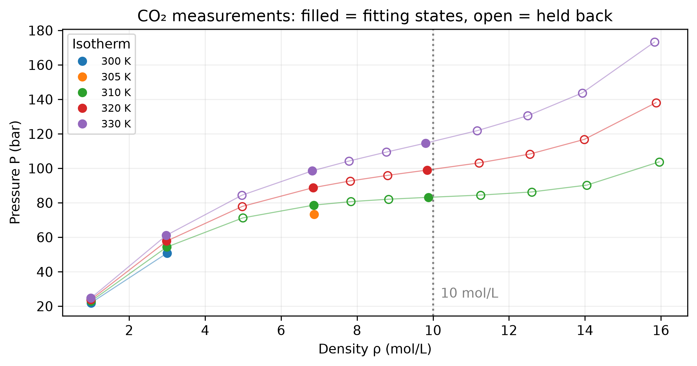

::: {.callout-note}
## Central question

**Using only gas-phase measurements of CO₂ at 300–330 K, can we predict the pressure at which CO₂ condenses between 250 and 295 K, and how far should we trust that prediction?**
:::

## Learning outcomes

By the end of this lecture, you should be able to:

1. **Fit** the two van der Waals parameters to measured pressure–volume–temperature data and judge the fit on states it did not use.
2. **Assemble** a coexistence-pressure calculation in which a root finder repeatedly calls two free-energy minimizations.
3. **Construct** a liquid–gas boundary from a few calculated pressures by interpolation.
4. **Distinguish** checks that verify the numerical calculation from a comparison that tests the model against measured CO₂.

We have already studied each numerical method separately in [L05–L09](../index.qmd). Today we chain them into one program, which I will type live while you watch and predict what each step returns. Each step below gives the SciPy call with a link to its documentation, because the syntax is the easiest part to miss while the code scrolls past. We will spend **35 minutes on the live program and 15 minutes on the Unit 02 Wooclap questions**. The completed notebook is linked at the end of the lecture for you to rerun afterwards.

## The engineering question

CO₂ is stored and moved as a pressurized fluid in gas cylinders, beverage and fire-suppression systems, and carbon-capture pipelines. Whether it arrives as a gas or a liquid decides how much a vessel holds and whether a compressor or a pump is needed. At 280 K, for example, liquid CO₂ is several times denser than the gas at the same pressure. The designer therefore needs the **saturation pressure** $P_{\mathrm{sat}}(T)$: at a fixed temperature, CO₂ is a gas below this pressure and condenses to a liquid above it. Plotted against temperature, $P_{\mathrm{sat}}(T)$ is the liquid–gas boundary of a phase diagram.

Suppose our only measurements come from a laboratory study of CO₂ gas at 300–330 K. None of these states is a liquid, and none lies on the boundary we want. The van der Waals (vdW) equation of state carries information from the measured gas into the region where liquid appears, so we state the task precisely before writing any code:

| | For this lecture |
|---|---|
| **Known data** | 15 measured states $(T_i, v_i, P_i)$ of CO₂ gas, 300–330 K, densities below 10 mol/L |
| **Model** | vdW equation with two unknown constants $a$ and $b$ |
| **Wanted** | $P_{\mathrm{sat}}(T)$ in bar for $250\le T\le 295$ K |
| **Deliverables** | (1) fitted $a,b$ with their pressure error; (2) $P_{\mathrm{sat}}$ at 250, 270, 290 K; (3) a boundary curve from 250 to 295 K; (4) a comparison with measured CO₂ vapour pressures |
| **Acceptance checks** | free-energy difference $|\Delta G|<10^{-4}$ J/mol and EOS residual $<10^{-3}$ bar at each $P_{\mathrm{sat}}$; interpolated boundary within 0.01 bar of a fresh solve at 275 K |

The calculation needs four of our Unit 02 methods, each answering a different question: regression for $a$ and $b$ (step 1), minimization for the two phase volumes (step 2), root finding for the coexistence pressure (step 3), and interpolation for the boundary (step 4).

Steps 2 and 3 are nested. Every trial pressure chosen by the root finder triggers two new minimizations, so one saturation pressure costs a few dozen minimizations. Step 1 runs once, and its $a$ and $b$ enter every later calculation.

## The live notebook

The notebook supplies the data, the limits of the two free-energy wells, the plots, and a check after each step. I type the four cells marked **Live step**, and each check turns green once its step works. Watch for three things in each cell: the physical quantity it returns, the units, and the arguments passed to the SciPy function.

::: {.quarto-wasm-local notebook="l10_phase_diagram.edit.py" view="edit" title="Live demo: fit vdW parameters to CO₂ data and build the liquid–gas boundary" height="1100" loading="lazy" fullscreen="true" marimo-app="true"}
The live notebook provides the data and the supporting functions. The four live cells are typed in class. The code, tables, and figures below give a printable record of every step.
:::

## Step 1 · Fitting $a$ and $b$ to gas measurements

The vdW equation corrects the ideal-gas law in two ways. The constant $b$ removes the volume occupied by the molecules themselves, and the term $a/v^2$ lowers the pressure because neighbouring molecules attract each other:

$$
P_{\mathrm{vdW}}(T,v;a,b)=\frac{RT}{v-b}-\frac{a}{v^2}.
$$

Here $v$ is the molar volume in L/mol, $R=0.08314462618\ \mathrm{L\,bar/(mol\,K)}$, and $P$ is in bar, so $a$ has units of $\mathrm{L^2\,bar/mol^2}$ and $b$ has units of L/mol. The measured density $\rho$ in mol/L gives $v=1/\rho$.

### The measurements

Ely, Haynes and Bain measured CO₂ along lines of nearly constant density, heating a sealed cell of fixed volume and recording its pressure ([Ely et al., 1989](../references.qmd#ref-ely1989isochoric)). Our file contains 36 of their states between 300 and 330 K. We fit the **15 states at the four lowest nominal densities**, about 1, 3, 6.9, and 9.9 mol/L, and hold the other 21 back to test the result.

{fig-alt="Pressure rises with density on each isotherm from 300 to 330 K. The 15 filled fitting points lie at densities of about 1, 3, 6.9, and 9.9 mol/L. Open held-back points extend to 16 mol/L, where the isotherms curve upward steeply." width="90%"}

The upper density limit reflects what the vdW form can represent. Near the critical density of CO₂, about 10.6 mol/L, the measured isotherms flatten and then rise steeply. Two constants cannot follow that shape and the dilute-gas behaviour at the same time. Fitting the gas states therefore asks the model to do what it describes best, and we check afterwards how it behaves beyond that range.

### The least-squares problem

Each measured state $i$ gives one residual, the difference between the model pressure at the measured $T_i$ and $v_i$ and the measured pressure $P_i$. Following L09, we choose $a$ and $b$ to minimize the sum of squared residuals:

$$
\begin{aligned}
S(a,b)&=\bigl[P_{\mathrm{vdW}}(T_1,v_1;a,b)-P_1\bigr]^2+\bigl[P_{\mathrm{vdW}}(T_2,v_2;a,b)-P_2\bigr]^2+\cdots+\bigl[P_{\mathrm{vdW}}(T_{15},v_{15};a,b)-P_{15}\bigr]^2\\
&=\sum_{i=1}^{15}\bigl[P_{\mathrm{vdW}}(T_i,v_i;a,b)-P_i\bigr]^2.
\end{aligned}
$$

The model is linear in $a$ but not in $b$, which appears in a denominator. We therefore use [`curve_fit`](https://docs.scipy.org/doc/scipy/reference/generated/scipy.optimize.curve_fit.html), which minimizes $S$ iteratively from a starting guess. Its model function must take the known inputs first and the fitted parameters after them. Each state has two known inputs, so our model function receives them together as the pair `(T, v)` and unpacks them inside.

::: {.callout-note}
## Syntax: `curve_fit`

```python
parameters, covariance = curve_fit(model, x_known, y_measured, p0=(guess_a, guess_b))
# model(x_known, a, b): known inputs first, then the fitted parameters
```

Documentation: [`scipy.optimize.curve_fit`](https://docs.scipy.org/doc/scipy/reference/generated/scipy.optimize.curve_fit.html). The notebook supplies `T_fit`, `v_fit`, and `P_fit` for the 15 fitting states in K, L/mol, and bar.
:::

::: {.callout-tip collapse="true"}
## Code typed in class: the vdW model and the `curve_fit` call

```{.python code-fold="false"}
def vdw_pressure(state, a, b):
    T, v = state
    return R*T/(v - b) - a/v**2

(a_fit, b_fit), _ = curve_fit(vdw_pressure, (T_fit, v_fit), P_fit, p0=(3.6, 0.043))
print(f"a = {a_fit:.5f} L² bar/mol²,  b = {b_fit:.6f} L/mol")
```

The second output of `curve_fit` is the parameter covariance matrix, which we do not use here, so it is assigned to `_`.
:::

The fit should give

$$
a=3.61938\ \mathrm{L^2\,bar/mol^2},\qquad b=0.042460\ \mathrm{L/mol}.
$$

The notebook compares these values with the course parameters used in L05–L09 and with a fit to all 36 states. The error columns are root-mean-square pressure differences in bar. The last two columns are the model critical point, $T_c=8a/(27Rb)$ and $P_c=a/(27b^2)$. Measured CO₂ has $T_c=304.1$ K and $P_c=73.8$ bar.

| Parameters | $a$ | $b$ | Fitting states (15) | Held back, $\rho<10$ (9) | Held back, $\rho>10$ (12) | $T_c$ (K) | $P_c$ (bar) |
|---|---:|---:|---:|---:|---:|---:|---:|
| Fitted, $\rho<10$ mol/L | 3.61938 | 0.042460 | 1.53 | 2.50 | 133 | 303.8 | 74.4 |
| Course values (L05–L09) | 3.592 | 0.04267 | 2.62 | 1.81 | 145 | 300.0 | 73.1 |
| Fitted to all 36 states | 3.014 | 0.03354 | 4.83 | 5.55 | 7.2 | 320.2 | 99.2 |

The fitted parameters reproduce the 15 fitting states to about 1.5 bar, within 5% at every state. Both dilute parameter sets describe the held-back gas states similarly, and both fail above 10 mol/L, with root-mean-square errors above 100 bar. Including the dense states improves those errors, but the model critical temperature moves to 320 K, where real CO₂ is already supercritical. We keep the dilute fit because it places the critical point within 0.4 K and 0.6 bar of the measured values, which matters for a boundary that ends at that point.

**Discussion:** the fitted set has the smaller error on the fitting states but a larger error on the nine held-back gas states. What does this tell us about judging a fit only on the data used to construct it?

## Step 2 · Minimization: which volume does CO₂ choose?

With $a$ and $b$ fixed, we return to the free-energy function from L07. At fixed temperature $T$ and imposed pressure $P$, the preferred molar volume minimizes

$$
\mathcal G(v;T,P,a,b)
=-RT\ln\left(\frac{v-b}{v_{\mathrm{ref}}}\right)-\frac{a}{v}+Pv,
\qquad v>b.
$$

Here $v_{\mathrm{ref}}=1\ \mathrm{L/mol}$ makes the logarithm dimensionless, so with $v$ in L/mol the code can write `np.log(v - b)`. The expression has units of L bar/mol, and multiplying by 100 returns **J/mol**. A term depending only on $T$ cancels when we compare two volumes.

Below the model's critical temperature, a range of pressures gives $\mathcal G(v)$ two minima: a **liquid-like well** at small volume and a **gas-like well** at large volume. The two wells are separated by the volumes $v_1<v_2$ where the vdW isotherm turns, $\partial P/\partial v=0$. The supplied function `turning_volumes(T, a, b)` returns them, so we can search the liquid well between $b$ and $v_1$ and the gas well beyond $v_2$. A bounded minimizer needs exactly this kind of interval, since it searches only between the limits we give it.

::: {.callout-note}
## Syntax: `minimize_scalar` with bounds

```python
result = minimize_scalar(fun, bounds=(low, high), args=(T, P, a, b),
                         method="bounded", options={"xatol": 1e-10})
result.x    # the volume at the bottom of the well
# fun(v, T, P, a, b): the variable being minimized comes first, args fill the rest
```

Documentation: [`scipy.optimize.minimize_scalar`](https://docs.scipy.org/doc/scipy/reference/generated/scipy.optimize.minimize_scalar.html). The default volume tolerance is too coarse for a steep liquid well, so we set `xatol`.
:::

::: {.callout-tip collapse="true"}
## Code typed in class: the free energy and the two well minima

```{.python code-fold="false"}
def free_energy(v, T, P, a, b):
    return 100*(-R*T*np.log(v - b) - a/v + P*v)  # J/mol

def phase_volumes(T, P, a, b):
    v1, v2 = turning_volumes(T, a, b)
    liquid = minimize_scalar(free_energy, bounds=(1.0001*b, v1), args=(T, P, a, b),
                             method="bounded", options={"xatol": 1e-10})
    gas = minimize_scalar(free_energy, bounds=(v2, 5*R*T/P), args=(T, P, a, b),
                          method="bounded", options={"xatol": 1e-10})
    return liquid.x, gas.x
```

The gas limit $5RT/P$ is five times the ideal-gas volume, safely beyond the gas minimum.
:::

The notebook's slider then sets the trial pressure at 280 K and plots both wells. Their free-energy difference is

$$
\Delta G(P;T,a,b)=\mathcal G(v_{\mathrm{liq}};T,P,a,b)
-\mathcal G(v_{\mathrm{gas}};T,P,a,b),
$$

where both volumes are recalculated at each trial pressure. At 50 bar, the gas well is lower by about 65 J/mol, so CO₂ stays a gas.

**Prediction:** as the pressure rises, which well drops relative to the other? At what pressure do you estimate the two wells have equal depth?

## Step 3 · Root finding: the pressure where $\Delta G=0$

**Coexistence requires $\Delta G=0$:** neither phase is preferred, and liquid and gas can exist together. At fixed $T$, the pressure is the only unknown, so finding $P_{\mathrm{sat}}$ is a one-variable root-finding problem for $\Delta G(P)$. Each evaluation of $\Delta G$ requires the two minimizations from Step 2, so we write it as a function of $P$ that calls `phase_volumes` inside.

A bracketing method needs an interval where $\Delta G$ changes sign (L05). The supplied function `find_pressure_bracket(T, a, b)` returns one: between the two turning-point pressures both wells exist, and $\Delta G$ has opposite signs at the ends.

::: {.callout-note}
## Syntax: `root_scalar` with a bracket

```python
result = root_scalar(f, args=(T, a, b), bracket=(low, high), method="brentq")
result.root, result.converged
# f(P, T, a, b): the unknown comes first, args fill the fixed inputs
```

Documentation: [`scipy.optimize.root_scalar`](https://docs.scipy.org/doc/scipy/reference/generated/scipy.optimize.root_scalar.html). `method="brentq"` selects Brent's bracketing method from L05.
:::

::: {.callout-tip collapse="true"}
## Code typed in class: $\Delta G(P)$ and `solve_pressure`

```{.python code-fold="false"}
def delta_G(P, T, a, b):
    v_liq, v_gas = phase_volumes(T, P, a, b)
    return free_energy(v_liq, T, P, a, b) - free_energy(v_gas, T, P, a, b)

def solve_pressure(T, a, b):
    result = root_scalar(delta_G, args=(T, a, b),
                         bracket=find_pressure_bracket(T, a, b), method="brentq")
    return result.root
```
:::

::: {.callout-note collapse="true"}
## Supported temperature range of the supplied well limits

The supplied `turning_volumes` supports **$0.82\le T/T_c\le0.985$**, where it resolves two distinct wells reliably, and reports an error outside this range. For the fitted parameters that is 249–299 K. At or above $T_c$, distinct liquid and gas volumes disappear.
:::

The check cell then calls `solve_pressure` at three temperatures with the fitted $a$ and $b$ (deliverable 2):

| $T$ (K) | $P_{\mathrm{sat}}$, fitted vdW (bar) |
|---:|---:|
| 250 | 32.4535 |
| 270 | 45.5978 |
| 290 | 61.5985 |

The notebook also checks $|\Delta G|<10^{-4}$ J/mol and the EOS residual $|P_{\mathrm{vdW}}(v)-P|<10^{-3}$ bar at both volumes. These checks test the equations behind the returned pressure. A solver's success flag alone does not show that we supplied the correct physical problem.

## Step 4 · From five pressures to a phase boundary

Each saturation pressure costs dozens of minimizations, so we calculate only five and interpolate between them (L08). We use `PchipInterpolator`, which preserves the increasing trend of these pressures between the sample points, with extrapolation disabled so the curve stops at 250 and 295 K.

::: {.callout-note}
## Syntax: `np.linspace` and `PchipInterpolator`

```python
T_grid = np.linspace(start, stop, number_of_points)            # both ends included
boundary = PchipInterpolator(x_nodes, y_nodes, extrapolate=False)
boundary(275.0)    # evaluate like a function; returns nan outside the nodes
```

Documentation: [`numpy.linspace`](https://numpy.org/doc/stable/reference/generated/numpy.linspace.html) · [`scipy.interpolate.PchipInterpolator`](https://docs.scipy.org/doc/scipy/reference/generated/scipy.interpolate.PchipInterpolator.html)
:::

::: {.callout-tip collapse="true"}
## Code typed in class: five coexistence solves and the PCHIP boundary

```{.python code-fold="false"}
T_grid = np.linspace(250, 295, 5)  # K
P_grid = [solve_pressure(T, a_fit, b_fit) for T in T_grid]
boundary = PchipInterpolator(T_grid, P_grid, extrapolate=False)
```
:::

At 275 K, which is not one of the five sample temperatures, a fresh `solve_pressure` gives 49.3239 bar and the interpolated boundary gives 49.3220 bar. The difference of 0.002 bar passes our acceptance check, so the interpolated curve represents the vdW calculation well between the samples (deliverable 3).

{fig-alt="Pressure against temperature from 245 to 335 K. The measured CO2 saturation curve rises from about 15 bar at 245 K to the critical point at 304 K and 74 bar. Both vdW curves lie well above it at low temperature and approach it near the critical point. The fitting states lie to the right of the critical temperature." width="100%"}

### Answering the engineering question

The final table compares the fitted-model prediction with the measured CO₂ vapour pressure, calculated from the reference correlation of [Span and Wagner (1996)](../references.qmd#ref-span1996co2), which summarizes experimental saturation data (deliverable 4).

| $T$ (K) | vdW, fitted (bar) | vdW, course values (bar) | Measured CO₂ (bar) | Fitted vs measured |
|---:|---:|---:|---:|---:|
| 250 | 32.45 | 33.75 | 17.85 | +82% |
| 260 | 38.68 | 40.16 | 24.19 | +60% |
| 270 | 45.60 | 47.28 | 32.03 | +42% |
| 280 | 53.23 | 55.13 | 41.61 | +28% |
| 290 | 61.60 | 63.72 | 53.18 | +16% |

Every numerical check passed, yet the predicted condensation pressure is 16% too high at 290 K and 82% too high at 250 K. The error grows as we move away from the critical point, which the fit placed almost exactly. The direction of the error matters for design. A vessel held at 250 K and operated below the vdW boundary of 32 bar would be expected to contain gas, but real CO₂ condenses there above 18 bar.

The two vdW parameter sets differ from each other by at most about 2 bar, much less than either differs from the measurements. Refining the fit or tightening the root tolerance therefore cannot remove the discrepancy, which comes from the vdW form itself. Two constants fitted to the gas cannot also describe the dense liquid, whose volume enters $\Delta G$. For the design question, our program is a verified calculation of the vdW boundary and a useful estimate near the critical point. A dependable answer at 250 K needs a more accurate equation of state, and the same program structure applies to it.

**Numerical verification** asks whether the returned pressure satisfies the model's coexistence condition, and our $\Delta G$, EOS, and interpolation checks answer that. **Comparison with experiment** asks whether the model and its parameters predict real CO₂ adequately, and only independent measurements can answer that.

## Reference notebook for after class

The completed notebook contains every cell typed today. Rerun it, change the fitted data set or the sample temperatures, and compare the result with the tables above.

[Open the reference notebook](../../../wasm-local/l10_phase_diagram_solution.html){target="_blank"} · [Download the reference notebook](../../../activities/l10_phase_diagram_solution.edit.py){download="l10_phase_diagram_solution.edit.py"} · [Download the CO₂ data (CSV)](../../../data/L10-co2-pvt.csv){download="L10-co2-pvt.csv"}

## Unit 02 Wooclap · final 15 minutes

We will finish with six questions about method selection, convergence, phase stability, and what our checks establish. Vote individually, discuss a divided result with your neighbour, then explain the reason for your choice.

### Q1 · Which numerical task?

**Matching · 90 seconds.** Match each question to its most direct numerical task. Use each task once: **root finding, minimization, interpolation, regression**.

| Physical or numerical question | Your choice |
|---|---|
| At fixed $T,P$, which volume lies at the bottom of a free-energy well? | |
| At fixed $T$, which pressure makes the two minimum free energies equal? | |
| Which curve passes through five calculated pressures to estimate between them? | |
| Which $a,b$ best represent 15 measured gas states overall? | |

### Q2 · What does the bracket establish?

**Single choice · 60 seconds.** Both free-energy minima exist throughout a pressure interval. Their difference $\Delta G(P)$ is continuous there and has opposite signs at the endpoints. What follows from this information?

A. There is exactly one coexistence pressure in the interval.
B. There is at least one coexistence pressure in the interval.
C. Newton–Raphson converges from every starting pressure in the interval.
D. Every pressure in the interval gives two equally stable phases.

### Q3 · The volume has stopped changing

**Single choice · 60 seconds.** A fixed-point volume calculation gives a step of $10^{-8}$ L/mol and an EOS pressure residual of $2$ bar. The acceptance limits are $10^{-6}$ L/mol and $0.01$ bar, respectively. What should we report?

A. Accepted: the volume step is small enough.
B. Accepted: printing fewer volume digits will remove the discrepancy.
C. Not accepted: the pressure equation is still unsatisfied.
D. No physical solution exists at these conditions.

### Q4 · Two successful minimizations

**Single choice · 75 seconds.** At one subcritical temperature and trial pressure, both volume minimizations converge and pass their local-minimum checks. They give

$$
G_{\mathrm{liq}}=-1200\ \mathrm{J/mol},\qquad
G_{\mathrm{gas}}=-1250\ \mathrm{J/mol}.
$$

Which interpretation is justified within this liquid–gas model?

A. The phases coexist because both minimizations converged.
B. The liquid is favoured because its volume is smaller.
C. The gas is favoured, and this pressure is not the coexistence pressure.
D. One minimization must have failed because the energies differ.

### Q5 · Exact at five temperatures

**Single choice · 60 seconds.** An interpolator reproduces all five calculated saturation pressures. Which additional test most directly checks its accuracy between those temperatures?

A. Print the original pressures with more decimal places.
B. Confirm again that the interpolator passes through the five points.
C. Compare with a fresh coexistence solve at an intermediate temperature.
D. Replace it with a higher-degree polynomial without calculating more points.

### Q6 · Same model, different fitted parameters

**Single choice · 75 seconds.** Two vdW fits use the same 15 CO₂ states. One minimizes squared pressure residuals $(P_{\mathrm{vdW}}-P_i)^2$ and gives $a=3.619$, $b=0.04246$. The other minimizes squared relative residuals $[(P_{\mathrm{vdW}}-P_i)/P_i]^2$ and gives $a=3.671$, $b=0.04309$. Both optimizations converge accurately. Why do the parameters differ?

A. Dividing by $P_i$ changes how each state's discrepancy contributes to the objective.
B. One optimizer must have failed.
C. The relative residuals use fewer data points.
D. They cannot differ if the numerical tolerance is small enough.

::: {.callout-note collapse="true"}
## Wooclap answer key and discussion prompts

Allow about seven minutes for the initial responses and eight for explanations and a revote where useful. Shuffle the matching choices in Wooclap.

| Question | Answer and reasoning | Misconceptions diagnosed | Follow-up |
|---|---|---|---|
| **1 · Apply** | Minimization, root finding, interpolation, regression, in that order. The outer root solver changes pressure, the inner minimizers change volume, and the fit changes $a,b$. | Confusing the unknown of one calculation with another, or exact matching with fitting. | Which inputs stay fixed inside each numerical call? |
| **2 · Understand** | **B.** Continuity and a sign change establish at least one zero. | A assumes uniqueness from a sign change alone. C transfers the bracketing guarantee to an open method. D confuses two minima with equal minima. | Why must the supplied code keep both minima available throughout the bracket? |
| **3 · Analyze** | **C.** The pressure residual is 200 times its tolerance. | A confuses a small step with solving the equation. B confuses display precision with numerical accuracy. D turns an iteration failure into a claim of nonexistence. | Our coexistence residual is tiny, but the CO₂ condensation pressure at 250 K is 82% above the measured value. What should we investigate instead of reducing the solver tolerance? |
| **4 · Analyze** | **C.** The gas has lower free energy and $\Delta G=+50$ J/mol. | A confuses solver convergence with coexistence. B selects by volume rather than free energy. D assumes different local minima indicate an error. | What value must the outer pressure solver make zero? |
| **5 · Evaluate** | **C.** A new temperature tests a prediction where no interpolation condition was imposed. | A substitutes extra digits for evidence. B only rechecks the construction. D assumes more flexibility improves accuracy. | Does agreement with that fresh solve also establish agreement with experiment? |
| **6 · Analyze** | **A.** Relative residuals give the low-pressure states more weight than absolute residuals do, so the minimum of the objective moves. | B treats a changed objective as solver failure. C confuses transformed values with fewer data. D assumes all objectives share a minimum. | Which residual is more appropriate if the pressure uncertainty is roughly proportional to pressure? |

The follow-up to Q3 separates numerical verification from physical validation. The six questions revisit L05–L09 through the steps of today's program.
:::

## What carries over to the next problem?

Our program started from measurements, fitted a model, and then called smaller functions with clear responsibilities to return a quantity we could test. In the upcoming Lennard–Jones work, the physical function will change. Stating the known data and the unknown, selecting the numerical task for each step, and checking the result both numerically and against experiment will remain the same.

**Exit question:** name one check that verifies today's numerical calculation and one comparison that tests its physical prediction.
