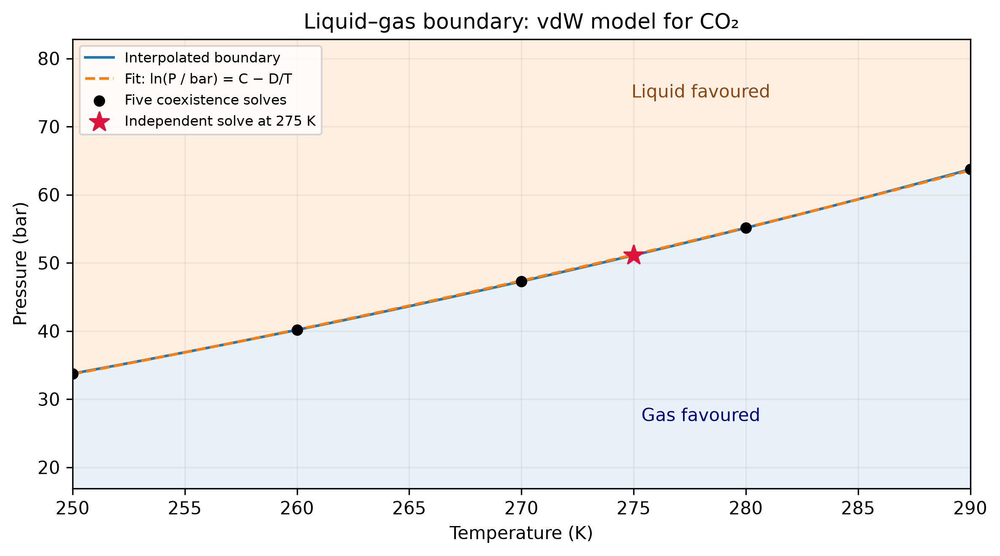

::: {.callout-note}
## Central question

**Can we combine the functions we already know into `solve_pressure(T, a, b)`, then use it to predict liquid–gas boundaries for different substances?**
:::

## Learning outcomes

By the end of this lecture, you should be able to:

1. **Assemble** a coexistence-pressure calculation from supplied functions with specified inputs and outputs.
2. **Construct** a phase boundary from a few calculated pressures using interpolation and a supplied fitted relation.
3. **Assess** the calculation using free-energy residuals, a fresh temperature, and independent vapour-pressure data.

We have already studied the numerical methods in [L05–L09](../index.qmd). Today we will build a working program from them. Work in pairs: one person types while the other checks the physical quantities and the function's output. We will spend **35 minutes on the program and 15 minutes on the Unit 02 Wooclap questions**.

## The physical question

At fixed temperature $T$ and imposed pressure $P$, the preferred volume minimizes the free energy. Recall the vdW free-energy function from L07:

$$
\mathcal G(v;T,P,a,b)
=-RT\ln\left(\frac{v-b}{v_{\mathrm{ref}}}\right)-\frac{a}{v}+Pv,
\qquad v>b.
$$

Here $v_{\mathrm{ref}}=1\ \mathrm{L/mol}$ makes the logarithm dimensionless. We use $R=0.08314462618\ \mathrm{L\,bar/(mol\,K)}$, $v,b$ in L/mol, $P$ in bar, and $a$ in $\mathrm{L^2\,bar/mol^2}$. The expression above has units of L bar/mol, so the supplied Python function multiplies it by 100 to return **J/mol**. A term depending only on $T$ cancels when comparing the two volumes.

Below the model's critical temperature, some pressures give two minima: one liquid-like and one gas-like. Their free-energy difference is

$$
\Delta G(P;T,a,b)=\mathcal G(v_{\mathrm{liq}};T,P,a,b)
-\mathcal G(v_{\mathrm{gas}};T,P,a,b).
$$

The volumes are recalculated at each trial pressure. **Coexistence requires $\Delta G=0$:** neither minimum is preferred. Our outer function therefore takes **known inputs** $T,a,b$ and returns the **unknown saturation pressure** $P_{\mathrm{sat}}$ in bar.

**Prediction:** if $\Delta G>0$, which phase has lower free energy? Which quantity should the outer solver change?

## The scaffold: one function to complete

The intended use is short:

```{.python code-fold="false"}
a, b = 3.592, 0.04267           # CO₂ course parameters
P_sat = solve_pressure(280.0, a, b)
print(P_sat)                    # About 55.129 bar
```

The calculation inside that call has the following structure. We will sketch it together before editing the notebook.

```{mermaid}
flowchart TD
    A["Inputs: T, a, b"] --> B["Supplied pressure interval"]
    B --> C["Try pressure P"]
    C --> D["Supplied code: minimize each free-energy well"]
    D --> E["Return liquid-minus-gas free energy"]
    E --> F{"Is the difference zero within tolerance?"}
    F -- No --> C
    F -- Yes --> G["Return saturation pressure"]
```

| Supplied function | Inputs | Output |
|---|---|---|
| `free_energy(v, T, P, a, b)` | Volume and the current model conditions | Free energy in J/mol |
| `find_phase_volumes(g_func, T, P, a, b)` | A free-energy function and its conditions | The two minimum volumes in L/mol |
| `free_energy_difference_P(P, T, a, b)` | Trial pressure and fixed model inputs | Liquid-minus-gas free energy in J/mol |
| `find_pressure_bracket(T, a, b)` | Fixed model inputs | A pressure interval containing coexistence |

These functions are **supplied and collapsed**. The volume helper uses bounded minimization separately in the two wells. The pressure helper keeps both wells available throughout the search and gives opposite signs of $\Delta G$ at its endpoints. We can now apply `root_scalar` to that difference without repeating the intermediate calculations by hand.

::: {.callout-note collapse="true"}
## Why pass a free-energy function to the minimizer?

`g_func(v)` fixes the current $T,P,a,b$ so the minimizer sees a function of volume alone. This separates evaluating the physical model from minimizing it. A different free-energy model can use the same numerical idea, although its physical domain and the intervals containing each phase must also be reconsidered.

For the vdW model, $T_c=8a/(27Rb)$. This classroom scaffold supports **$0.82\le T/T_c\le0.985$**, where the supplied intervals resolve two distinct wells reliably. It reports an error outside this range. At or above $T_c$, distinct liquid and gas coexistence volumes disappear.
:::

### Paired live coding

Complete the notebook's **`solve_pressure` cell**:

1. Keep the supplied pressure interval and the nested `residual(P)` function.
2. Call `root_scalar` on `residual` using that interval and `method="brentq"`.
3. Check convergence and return the numerical pressure, `result.root`.

Every evaluation of `residual(P)` runs the supplied minimizations. This is how a calculation with several numerical steps becomes a function that another solver can use. Focus on what each call receives and returns. Python documentation or a coding assistant can help with syntax, while the equation, units, and checks remain our responsibility.

[Download the starter](../../../activities/l10_phase_diagram.edit.py){download="l10_phase_diagram.edit.py"} · [Download the completed example](../../../activities/l10_phase_diagram_solution.edit.py){download="l10_phase_diagram_solution.edit.py"}

For saving, use **Open notebook directly** beneath the embed **before editing**, then **Save** or **Ctrl+S / ⌘S** to download your `.py` file. You can also open that file at [marimo.app](https://marimo.app/). Edits in an embedded notebook do not transfer to a new tab. Run the edited cell with **Shift+Enter**, replacing the existing code rather than defining the same function in a second cell.

::: {.quarto-wasm-local notebook="l10_phase_diagram.edit.py" view="edit" title="Complete the saturation-pressure solver and interpolate a phase boundary" height="1100" loading="lazy" fullscreen="true"}
The starter notebook provides all intermediate functions. Complete the pressure-solver and interpolation cells using the replacement blocks below. The CO₂ check pressures and the phase-boundary figure provide a printable reference.
:::

::: {.callout-tip collapse="true"}
## Completed replacement: `solve_pressure`

Copy this entire block into the existing pressure-solver cell. The notebook already imports `root_scalar`.

```{.python code-fold="false"}
def solve_pressure(T, a, b):
    pressure_bracket = find_pressure_bracket(T, a, b)

    def residual(P):
        return free_energy_difference_P(P, T, a, b)

    result = root_scalar(
        residual, bracket=pressure_bracket, method="brentq",
        xtol=1e-8, maxiter=60,
    )
    if not result.converged:
        raise RuntimeError("The coexistence-pressure solve did not converge.")
    return result.root
```
:::

::: {.callout-warning collapse="true"}
## Recovery when an edit fails or the browser stops responding

Save your attempted notebook and the error message so we can inspect them. If necessary, copy the changed cell into a text file. Continue with the completed replacement blocks or [open the completed notebook](../../../wasm-local/l10_phase_diagram_solution.html). The **Reload/reset notebook** button discards unsaved changes in the course embed.

The supplied solvers have iteration limits. Avoid adding unbounded loops: interrupting Python in a browser/WASM session may not recover a stuck calculation. If the tab is unresponsive, reopen the original notebook in a fresh tab and restore your last saved version. The downloadable solution and the printed results below let us continue the discussion.
:::

### Three CO₂ checks

Use the course parameters $a=3.592$ and $b=0.04267$. The supplied trial cell calls your function at three temperatures:

| $T$ (K) | Expected $P_{\mathrm{sat}}$ (bar) |
|---:|---:|
| 250 | 33.747738 |
| 270 | 47.282104 |
| 290 | 63.722026 |

The notebook also checks $|\Delta G|<10^{-4}$ J/mol and the EOS residual $|P_{\mathrm{EOS}}(v)-P|<10^{-3}$ bar at both volumes. These checks test the equations behind the returned pressure. A solver's success flag alone does not show that we supplied the correct physical problem.

## From pressures to a phase boundary

Once one call works, we can reuse it at five temperatures. Complete **`boundary`** using `PchipInterpolator`, with extrapolation disabled. PCHIP preserves the increasing trend of these pressures between sample points.

::: {.callout-tip collapse="true"}
## Completed replacement: the sample table and interpolator

The sample-table cell is already supplied. Copy the final line into the separate `boundary` cell.

```{.python code-fold="false"}
sample_T = np.linspace(trial_T[0], trial_T[-1], 5)
sample_P = np.array([solve_pressure(T, a, b) for T in sample_T])
boundary = PchipInterpolator(sample_T, sample_P, extrapolate=False)
```
:::

At a fixed subcritical temperature, pressures above the coexistence curve favour the liquid and pressures below it favour the gas, within this liquid–gas model. **At 275 K**, compare the interpolated pressure with a fresh `solve_pressure(275, a, b)` calculation. This temperature was omitted from the five-point table, so it tests the curve between the conditions used to construct it.

{fig-alt="CO2 saturation pressure increases with temperature. Five calculated points define an interpolated boundary, with liquid favoured above it and gas below. A dashed fitted curve and a fresh check point nearly coincide with the interpolant." width="100%"}

### A physically motivated fit

Vapour pressure often follows an approximately straight line when we plot $\ln P$ against $1/T$ over a limited temperature range. The supplied fitting cell uses

$$
\ln\left(\frac{P_{\mathrm{sat}}}{1\ \mathrm{bar}}\right)\approx C-\frac{D}{T}.
$$

The **known data** are our five temperatures and calculated pressures. The **chosen form** is a straight line in $1/T$, and the **unknown coefficients** are the dimensionless intercept $C$ and $D$ in kelvin. The fit minimizes squared residuals in log pressure, following L09. It need not pass through each calculated point.

The [Clausius–Clapeyron approximation](https://chem.libretexts.org/Bookshelves/Physical_and_Theoretical_Chemistry_Textbook_Maps/Supplemental_Modules_(Physical_and_Theoretical_Chemistry)/Physical_Properties_of_Matter/States_of_Matter/Phase_Transitions/Clausius-Clapeyron_Equation) gives $D\approx\Delta H_{\mathrm{vap}}/R$ when the vapour is approximately ideal, its volume greatly exceeds the liquid volume, and the enthalpy of vaporization is nearly constant. Near the critical point those assumptions weaken. The notebook compares this fit and the interpolant with the same fresh calculation at 275 K.

**Discussion:** which curve better reproduces the fresh vdW calculation? What additional evidence would tell us whether either curve predicts real CO₂ accurately?

## One solver, many substances

Change the substance selector after the CO₂ checks pass. The notebook changes $a,b$ and chooses trial temperatures below **that model's** critical temperature. The main function stays unchanged. The supplied comparison table also runs eight substances at $T=0.85T_c$, so each pair can examine one substance while the class compares the full table.

| Substance | $a$ (L² bar/mol²) | $b$ (L/mol) |
|---|---:|---:|
| CO₂ | 3.592 | 0.04267 |
| Argon | 1.355 | 0.03201 |
| Nitrogen | 1.370 | 0.03870 |
| Oxygen | 1.382 | 0.03186 |
| Methane | 2.283 | 0.04278 |
| Ethane | 5.562 | 0.06380 |
| Ammonia | 4.225 | 0.03710 |
| Water | 5.536 | 0.03049 |

**Numerical verification** asks whether the returned pressure satisfies the vdW coexistence condition. **Comparison with experiment** asks whether that model and parameter set predict a real substance adequately. For example, at about 128.22 K our argon calculation gives **24.71 bar**, while the selected NIST correlation gives **18.40 bar**. A very small free-energy residual can coexist with a substantial discrepancy from experiment.

The notebook supplies independent vapour-pressure correlations for six substances. Examine the difference column: does making the root tolerance smaller seem likely to remove those discrepancies? These are one-temperature comparisons, so a broader validation would also cover more temperatures and the uncertainty of the property data. The model includes liquid and vapour phases only.

::: {.callout-note collapse="true"}
## Parameter sources and NIST correlation ranges

The [downloadable gas data](../../../data/L10-gases.json) record each source. CO₂ retains the L05–L09 course parameters. The other vdW constants come from this [tabulation](https://en.wikipedia.org/w/index.php?title=Van_der_Waals_constants_(data_page)&oldid=1353718463).

The NIST Chemistry WebBook correlations use $\log_{10}(P/\mathrm{bar})=A-B/(T+C)$ with $T$ in kelvin. These empirical correlations summarize experimental data and are evaluated only within their stated temperature ranges.

| Substance | Selected correlation range (K) | NIST source |
|---|---:|---|
| Argon | 83.78–150.72 | [Drii and Rabinovich](https://webbook.nist.gov/cgi/cbook.cgi?ID=C7440371&Mask=4#Thermo-Phase) |
| Nitrogen | 63.14–126.00 | [Edejer and Thodos](https://webbook.nist.gov/cgi/cbook.cgi?ID=C7727379&Mask=4#Thermo-Phase) |
| Oxygen | 54.36–154.33 | [Brower and Thodos](https://webbook.nist.gov/cgi/cbook.cgi?ID=C7782447&Mask=4#Thermo-Phase) |
| Methane | 90.99–189.99 | [Prydz and Goodwin](https://webbook.nist.gov/cgi/cbook.cgi?ID=C74828&Mask=4#Thermo-Phase) |
| Ammonia | 239.6–371.5 | [Stull](https://webbook.nist.gov/cgi/cbook.cgi?ID=C7664417&Mask=4#Thermo-Phase) |
| Water | 379–573 | [Liu and Lindsay](https://webbook.nist.gov/cgi/cbook.cgi?ID=C7732185&Mask=4#Thermo-Phase) |

CO₂ and ethane have no reference entry here because the selected WebBook Antoine tables do not cover their comparison temperatures. Their entries still check the numerical calculation. The comparison code and data are supplied offline in each notebook.
:::

## Unit 02 Wooclap · final 15 minutes

We will finish with six questions about method selection, convergence, phase stability, and what our checks establish. Vote individually, discuss a divided result with your neighbour, then explain the reason for your choice.



## What carries over to the next problem?

Our program takes physical inputs, calls smaller functions with clear responsibilities, and returns a quantity we can test. In the upcoming Lennard–Jones work, the physical function will change. Identifying the unknown, selecting the numerical task, and checking the result will remain the same.

**Exit question:** name one check that verifies today's numerical calculation and one comparison that tests its physical prediction.
