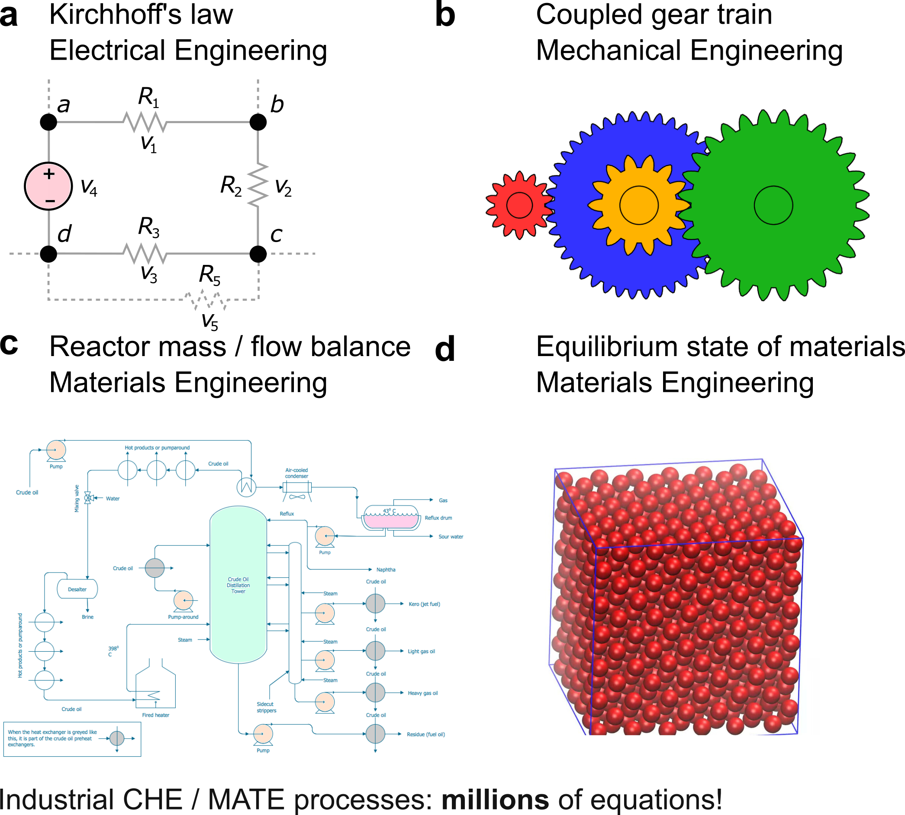
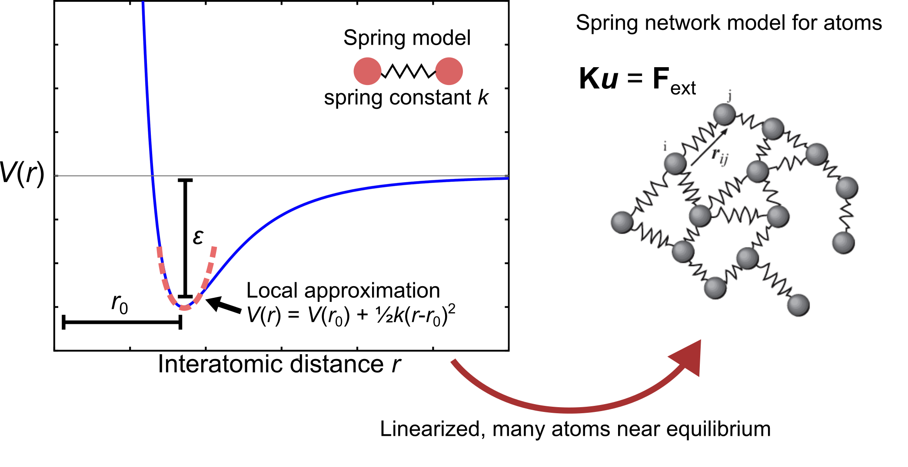
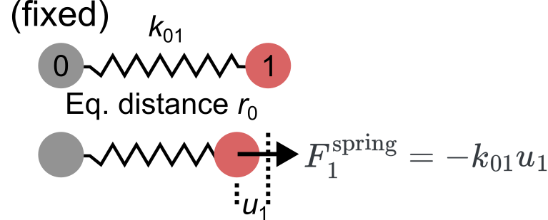
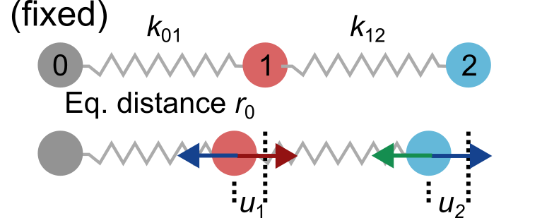
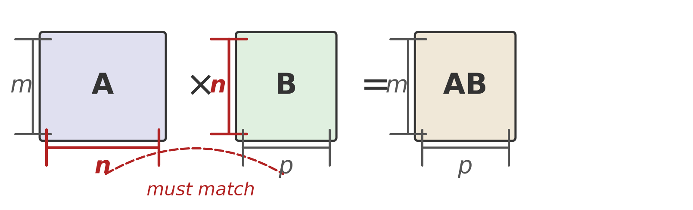

::: {.callout-note}
## Central question

Why does $A\mathbf{x}=\mathbf{b}$ keep appearing in numerical methods, and what does it represent in materials systems?
:::

## Learning outcomes

By the end of this lecture, you should be able to:

1. **Formulate** the force-balance equations for a small harmonic chain.
2. **Calculate** vector and matrix operations with compatible dimensions.
3. **Represent** scalars, vectors, and matrices in NumPy, including explicit row and column shapes.
4. **Solve** a spring-chain equilibrium problem using matrix inversion and check the result by substitution.

## Why systems of equations appear across engineering

In Unit 02, we started with a function of one variable, $f(x)$. Even with just one input variable, finding its interpolation or least-squares coefficients soon brought us to **several equations** with **several unknowns**. The coefficients must satisfy all the equations together.

::: {.callout-tip}
## Independent equations and a unique solution

**Rule of thumb** for linear systems: **N** unknowns + **N independent** equations → a unique solution.
:::

This coupling appears in many engineering fields:

- **Electrical engineering:** Kirchhoff's laws connect currents and voltages in a circuit.
- **Chemical engineering:** mass balances connect flows between reactors.
- **Mechanical engineering:** contact between gears connects their rotational speeds.
- **Materials engineering:** interatomic forces couple the motion of atoms, even in simulations containing millions of them.

**What do these physical problems have in common?**

{#fig-engineering-systems width=100% fig-alt="Four engineering examples: an electrical circuit, coupled gears, a process-flow diagram, and an atomic structure."}

::: {.callout-note}
## Local equations, shared unknowns

We write a balance or constraint for each component, but its unknowns also appear in the equations for other components. A solution must satisfy the equations for the whole system at once.
:::

This lecture is a crash course on linear algebra and matrix operations. We will start with atomic forces, write the coupled equations, then review the scalars, vectors, and matrices needed to solve them in Python.

## From interatomic energy to Hooke's law

### The atomistic problem: many coupled equations

In Assignments [A1](../../../assignments/A1/index.qmd) and [A2](../../../assignments/A2/index.qmd), the pair energy $V(r)$ described how two atoms interact at separation $r$. The [Lennard–Jones potential](https://en.wikipedia.org/wiki/Lennard-Jones_potential), or 12–6 potential, is one example:

$$
V(r)=4\epsilon\left[\left(\frac{\sigma}{r}\right)^{12}-\left(\frac{\sigma}{r}\right)^6\right].
$$

For two atoms, the equilibrium separation is $r_0=\sqrt[6]{2}\sigma$. The well depth is $\epsilon>0$, so $V(r_0)=-\epsilon$. What changes when we have many atoms?

In A1, we considered an atomic cluster. Each of its $N$ atoms has three coordinates, $x_i$, $y_i$, and $z_i$, where $i$ labels the atom. Collecting all coordinates into one vector gives

$$
\mathbf{x}=(x_1,y_1,z_1,x_2,y_2,z_2,\ldots,x_N,y_N,z_N)^T.
$$

The total energy $E_{\mathrm{tot}}(\mathbf{x})$ is a single number, but finding a minimum means adjusting up to $3N$ coordinates:

$$
\mathbf{x}_{\min}=\underset{\mathbf{x}}{\operatorname{arg\,min}}\;E_{\mathrm{tot}}(\mathbf{x}).
$$

Here $\operatorname{arg\,min}$ means the coordinates at which the energy is minimized. At a smooth minimum, the derivative with respect to every freely moving coordinate must vanish. If all coordinates are free, these conditions are

$$
\begin{aligned}
\frac{\partial E_{\mathrm{tot}}}{\partial x_1}=0,\qquad
\frac{\partial E_{\mathrm{tot}}}{\partial y_1}=0,\qquad
\frac{\partial E_{\mathrm{tot}}}{\partial z_1}&=0,\\
&\vdots\\
\frac{\partial E_{\mathrm{tot}}}{\partial x_N}=0,\qquad
\frac{\partial E_{\mathrm{tot}}}{\partial y_N}=0,\qquad
\frac{\partial E_{\mathrm{tot}}}{\partial z_N}&=0.
\end{aligned}
$$

That is a system of $3N$ coupled equations. Moving one atom changes its interactions with others, so these derivatives depend on several atomic coordinates. Vanishing derivatives identify stationary configurations, and an energy minimum also requires stability against small changes in the free coordinates. We will study numerical methods for nonlinear systems in Lecture 14, where matrix operations appear again.

Now imagine pressing an indenter into a metal or applying a shear load. How do the atoms move to balance the external forces? At static equilibrium, the internal and external force components on each freely moving atom must sum to zero:

$$
\begin{aligned}
-\frac{\partial E_{\mathrm{tot}}}{\partial x_1}+F^{\mathrm{ext}}_{1x}&=0,\\
-\frac{\partial E_{\mathrm{tot}}}{\partial y_1}+F^{\mathrm{ext}}_{1y}&=0,\\
&\vdots\\
-\frac{\partial E_{\mathrm{tot}}}{\partial z_N}+F^{\mathrm{ext}}_{Nz}&=0.
\end{aligned}
$$

The unknowns are the new atomic positions. Prescribed positions, such as atoms held at a boundary, replace the corresponding unknowns with known values. To see how these force balances become a linear system, we will restrict motion to one direction and approximate each bond by a spring.

### Linearized model for atomic forces

{#fig-lj-spring width=100% fig-alt="The Lennard–Jones potential near its minimum is approximated by a parabola, leading to a network of atoms connected by harmonic springs."}

Close to equilibrium, we can picture two atoms as masses connected by a spring. Hold atom 0 fixed on the left and let atom 1 move along the bond, with positive displacement to the right. Write its displacement from equilibrium as $u_1=x_1-x_1^{\mathrm{eq}}$. Because atom 0 is fixed, $u_1$ is also the change in bond length. The restoring force on atom 1 is

$$
\boxed{F^{\mathrm{spring}}_1=-k_{01}u_1.}
$$

This is **Hooke's law**. The spring constant $k_{01}=k_{10}>0$ describes the bond between atoms 0 and 1. A positive displacement stretches the bond and produces a force to the left. With energy in eV and distance in Å, the spring constant has units of eV/Ų and force has units of eV/Å. One Å is $10^{-10}$ m, or $0.1$ nm. An energy of 1 eV per particle corresponds to approximately 96.485 kJ/mol.

::: {.callout-note collapse="true"}
## Deriving Hooke's law from the pair energy

Near a smooth minimum, a pair potential can be approximated by a quadratic, connecting it to the [polynomial functions used in fitting](../../02/L09/index.qmd). Expanding about the equilibrium separation $r_0$ gives

$$
V(r_0+u_1)\approx V(r_0)+V'(r_0)u_1+\frac12V''(r_0)u_1^2.
$$

At the minimum, $V'(r_0)=0$. Defining $k_{01}=V''(r_0)$ gives the **harmonic approximation**:

$$
V(r_0+u_1)\approx V(r_0)+\frac12k_{01}u_1^2.
$$

For a minimum with positive curvature, $k_{01}>0$: stretching or compressing the bond raises its energy. A larger curvature means a stiffer bond. Taking the negative derivative gives

$$
F^{\mathrm{spring}}_1=-\frac{dV}{du_1}\approx-k_{01}u_1.
$$
:::

{#fig-single-spring width=65% fig-alt="Reference and displaced configurations of two atoms joined by a spring of stiffness k01, with atom 0 fixed."}

::: {.callout-note collapse="true"}
## Why does force have a minus sign?

A conservative force does work $dW=F\,dr$, while the potential energy changes by $dV=-dW$. Therefore $F=-dV/dr$. Stretching a bond above its equilibrium length produces a force toward smaller separation.
:::

### Two atoms with an external force

Hold atom 0 fixed and pull atom 1 to the right with an external force $F_{\mathrm{ext}}$. The spring extension is $u_1$, so static force balance gives

$$
-k_{01}u_1+F_{\mathrm{ext}}=0.
$$

Rearranging,

$$
\boxed{k_{01}u_1=F_{\mathrm{ext}}.}
$$

**One equation** determines **one unknown**: $u_1=F_{\mathrm{ext}}/k_{01}$.

### Three atoms: two coupled displacements

{#fig-three-atom-spring width=75% fig-alt="Reference and displaced configurations of three atoms joined by springs k01 and k12. Atom 0 is fixed, while atoms 1 and 2 move by u1 and u2."}

Now connect atom 2 to atom 1 with a second spring, $k_{12}$, and apply the external force to atom 2. Atom 0 remains fixed, so $u_0=0$. The spring extensions are $u_1$ and $u_2-u_1$. Atom 1 feels both springs, while atom 2 feels the second spring and the applied force:

$$
\begin{aligned}
\text{Atom 1:}\quad -k_{01}u_1+k_{12}(u_2-u_1)&=0,\\
\text{Atom 2:}\quad -k_{12}(u_2-u_1)+F_{\mathrm{ext}}&=0.
\end{aligned}
$$

Collecting the unknown displacements on the left gives

$$
\begin{aligned}
(k_{01}+k_{12})u_1-k_{12}u_2&=0,\\
-k_{12}u_1+k_{12}u_2&=F_{\mathrm{ext}}.
\end{aligned}
$$

There are **two equations** for **two unknowns**. We can collect their coefficients into a **matrix** and their unknowns into a **vector**:

$$
\underbrace{\begin{bmatrix}k_{01}+k_{12}&-k_{12}\\-k_{12}&k_{12}\end{bmatrix}}_{K}
\underbrace{\begin{bmatrix}u_1\\u_2\end{bmatrix}}_{\mathbf{u}}
=
\underbrace{\begin{bmatrix}0\\F_{\mathrm{ext}}\end{bmatrix}}_{\mathbf{F}}.
$$

Here $K$ is the **stiffness matrix**, $\mathbf{u}$ is the displacement **vector**, and $\mathbf{F}$ is the applied-force **vector**. The two force balances become

$$
\boxed{K\mathbf{u}=\mathbf{F}.}
$$

This is a physical example of $A\mathbf{x}=\mathbf{b}$. With Hooke's law for each bond, the force balances form a **system of linear equations** for the unknown displacements.

::: {.callout-note collapse="true"}
## What makes the force-balance equations linear?

Each unknown displacement is multiplied by a known coefficient, and these contributions are added. There are no products such as $u_1u_2$ or powers such as $u_1^2$. The constants $k_{01}$ and $k_{12}$ belong to the model, the applied force is prescribed, and the displacements are what we calculate. If we retained the full Lennard–Jones force instead of its harmonic approximation, the force balances would generally be nonlinear in the displacements.

Linearity is always judged with respect to the unknowns. For example, fitting $y=a+bx+cx^2$ at known input values leads to equations linear in the unknown coefficients $a$, $b$, and $c$, even though the fitted curve is quadratic in $x$. At $x=2$, the equation is $a+2b+4c=y$. The corresponding matrix row is $[1,2,4]$. This is the same coefficient-collection step we used for the springs.

For a linear system with fixed, invertible $K$, doubling the applied forces doubles the solution displacements. Likewise, adding two applied-force vectors adds their corresponding displacement solutions. This property, called **superposition**, follows from the matrix multiplication rules below.
:::

## Matrices, vectors, and linear systems

You may remember solving small systems with [Cramer's rule](https://en.wikipedia.org/wiki/Cramer%27s_rule), which expresses each unknown as a ratio of determinants. NumPy and SciPy provide functions for solving these systems. We will first review scalars, vectors, matrices, and their operations. For a fuller review, see Jaan Kiusalaas, [*Numerical Methods in Engineering with Python 3*, Chapter 2: Systems of Linear Algebraic Equations](../../02/references.qmd#ref-kiusalaas2013).

### Scalars

A **scalar** is a single number. Energy, pressure, and entropy are examples of scalar physical quantities. In Python, a real-valued scalar can be stored as a `float` or a NumPy floating-point value such as `np.float64`.

### Vectors and their shapes

A physical vector, such as displacement, velocity, or force, has a **magnitude** and, when nonzero, a **direction**. Its components depend on the chosen coordinates. We also use vectors to collect related numbers, such as unknown coefficients or the displacements of several atoms. In our chain, $u_1$ and $u_2$ describe different atoms moving along the same direction.

A vector can be written as a **column** or a **row**. **Transposition**, denoted by $T$, exchanges the two:

$$
\underbrace{\mathbf{a}=\begin{bmatrix}1\\2\\3\end{bmatrix}}_{\text{column vector}},
\qquad
\underbrace{\mathbf{a}^{T}=\begin{bmatrix}1&2&3\end{bmatrix}}_{\text{row vector}}.
$$

In NumPy, `np.array` creates an array and `.shape` reports its dimensions:

::: {.quarto-wasm-local notebook="l11_matrix_basics.edit.py" view="edit" title="Create a scalar, a vector, a row, and a column" height="780" loading="lazy" fullscreen="true"}
A scalar stores one number. The array `[1, 2, 3]` has shape `(3,)`, while `[[1, 2, 3]]` has shape `(1, 3)`. Applying `np.atleast_2d(a)` to the one-dimensional array makes a row. Transposing that row gives a column of shape `(3, 1)`.
:::

::: {.callout-important}
## Why does `a.T` leave my vector unchanged?

A one-dimensional array has no separate row and column axes to exchange. For a one-dimensional `a`, use `row = np.atleast_2d(a)` to make a row and `column = row.T` to make a column. Their shapes are `(1, 3)` and `(3, 1)` in this example.
:::

#### Vector addition, scaling, and products

Addition and scalar multiplication act on each component. For $\mathbf{a}=(1,2,3)^T$ and $\mathbf{b}=(4,5,6)^T$,

$$
\mathbf{a}+\mathbf{b}=\begin{bmatrix}5\\7\\9\end{bmatrix},
\qquad
2\mathbf{a}=\begin{bmatrix}2\\4\\6\end{bmatrix}.
$$

For vector addition, the vectors must have the same number of components. For physical quantities, corresponding components must also use the same coordinate directions and compatible units: two forces can be added, but a force and a displacement cannot.

The **inner product** multiplies corresponding components and adds the results:

$$
\mathbf{a}\cdot\mathbf{b}
=a_1b_1+a_2b_2+a_3b_3
=1(4)+2(5)+3(6)=32.
$$

The result is a scalar. Geometrically, $\mathbf{a}\cdot\mathbf{b}=\|\mathbf{a}\|\,\|\mathbf{b}\|\cos\theta$, where $\theta$ is the angle between the vectors. Perpendicular vectors have zero inner product. The **Euclidean norm**, or length, follows from the inner product of a vector with itself:

$$
\|\mathbf{a}\|=\sqrt{a_1^2+a_2^2+a_3^2}
=\sqrt{\mathbf{a}\cdot\mathbf{a}}.
$$

::: {.quarto-wasm-local notebook="l11_vector_operations.edit.py" view="edit" title="Add vectors, multiply them, and calculate their lengths" height="760" loading="lazy" fullscreen="true"}
For the vectors above, `a + b` gives `[5, 7, 9]` and `2 * a` gives `[2, 4, 6]`. The product `a * b` gives `[4, 10, 18]`, while both `a @ b` and `np.dot(a, b)` give $32$. The length from `np.linalg.norm(a)` is $\sqrt{1^2+2^2+3^2}=\sqrt{14}\approx3.742$.
:::

### Matrices: rows, columns, and entries

A **matrix** is a rectangular array of numbers. A matrix with $m$ rows and $n$ columns has shape $m\times n$:

$$
A=\underbrace{\begin{bmatrix}
a_{11}&a_{12}&\cdots&a_{1n}\\
a_{21}&a_{22}&\cdots&a_{2n}\\
\vdots&\vdots&\ddots&\vdots\\
a_{m1}&a_{m2}&\cdots&a_{mn}
\end{bmatrix}}_{n\text{ columns; }m\text{ rows}}.
$$

The entry $a_{ij}$ is in row $i$, column $j$. In a system $A\mathbf{x}=\mathbf{b}$, the $m$ rows represent equations and the $n$ columns correspond to unknowns. In NumPy, write one list for each row, as in the example below.

::: {.callout-important}
## Row before column

Both shape and indexing use **row, column** order. Mathematical $a_{12}$ is the entry in row 1, column 2. Python indexing starts at zero, so this entry is `A[0, 1]`.
:::

::: {.quarto-wasm-local notebook="l11_matrix_construction.edit.py" view="edit" title="Build a three-by-three matrix from rows or columns" height="900" loading="lazy" fullscreen="true"}
The matrix with rows $[1,2,3]$, $[4,5,6]$, and $[7,8,9]$ has shape `(3, 3)` and `A[0, 1]` is $2$. Stacking those rows with `np.vstack` gives the same matrix. Joining the columns $(1,4,7)^T$, $(2,5,8)^T$, and $(3,6,9)^T$ with `np.hstack` also gives the same matrix.
:::

#### Matrix addition, scaling, and transposition

Matrices of the same shape can be added entry by entry. Multiplying by a scalar scales every entry. For example, let

$$
A=\begin{bmatrix}1&2\\3&4\end{bmatrix},\qquad
B=\begin{bmatrix}5&6\\7&8\end{bmatrix}.
$$

Then

$$
A+B=\begin{bmatrix}6&8\\10&12\end{bmatrix},\qquad
2A=\begin{bmatrix}2&4\\6&8\end{bmatrix}.
$$

A transpose exchanges row and column positions, so $(A^T)_{ij}=A_{ji}$:

$$
A^T=\begin{bmatrix}1&3\\2&4\end{bmatrix}.
$$

In general, transposing an $m\times n$ matrix gives an $n\times m$ matrix. Transposing twice returns the original matrix.

::: {.quarto-wasm-local notebook="l11_matrix_operations.edit.py" view="edit" title="Add, scale, and transpose matrices" height="550" loading="lazy" fullscreen="true"}
For the matrices above, `A + B` adds corresponding entries, `2 * A` doubles each entry, and `A.T` exchanges rows and columns. The first row of $A^T$ is $[1,3]$.
:::

#### Matrix–vector multiplication

Scalar multiplication, such as $2A$, multiplies every entry. Multiplication by a vector instead takes the inner product of each matrix row with that vector. For example,

$$
\begin{bmatrix}1&2&3\\4&5&6\end{bmatrix}
\begin{bmatrix}1\\0\\-1\end{bmatrix}
=
\begin{bmatrix}1(1)+2(0)+3(-1)\\4(1)+5(0)+6(-1)\end{bmatrix}
=
\begin{bmatrix}-2\\-2\end{bmatrix}.
$$

The matrix has three columns, so the input vector needs three components. Its two rows produce two output components. In general, multiplying an $m\times n$ matrix by an $n$-component vector gives an $m$-component vector.

::: {.quarto-wasm-local notebook="l11_matrix_vector.edit.py" view="edit" title="Matrix–vector multiplication with A @ x" height="340" loading="lazy" fullscreen="true"}
`A @ x` gives `[-2, -2]`.
:::

The same product can also be understood one column at a time:

:::: {.callout-note collapse="true"}
## Reading matrix–vector multiplication as a sum of columns

The same matrix–vector product can be read as a weighted combination of the matrix's columns:

$$
\begin{bmatrix}1&2&3\\4&5&6\end{bmatrix}
\begin{bmatrix}x_1\\x_2\\x_3\end{bmatrix}
=x_1\begin{bmatrix}1\\4\end{bmatrix}
+x_2\begin{bmatrix}2\\5\end{bmatrix}
+x_3\begin{bmatrix}3\\6\end{bmatrix}.
$$

Each component of $\mathbf{x}$ multiplies one column of $A$, and the resulting vectors are added. For $\mathbf{x}=(1,0,-1)^T$, the result is the first column minus the third: $(1,4)^T-(3,6)^T=(-2,-2)^T$.

For the small matrix above, try the input vectors $(1,0,0)^T$, $(0,1,0)^T$, and $(0,0,1)^T$. Each selects one column. These **basis vectors** isolate the action of the matrix on one input component at a time. They also explain why the identity matrix has unit columns and leaves any vector unchanged.
::::

#### Matrix–matrix multiplication

Each entry in a matrix product is the inner product of a row from the first matrix and a column from the second. **The number of columns in $A$ must equal the number of rows in $B$.** The product keeps the number of rows from $A$ and the number of columns from $B$:

$$
\underbrace{A}_{m\times n}\;
\underbrace{B}_{n\times p}
=\underbrace{AB}_{m\times p}.
$$

{#fig-matmul-dimensions width=95% fig-alt="A rectangle with m rows and n columns times a rectangle with n rows and p columns gives a rectangle with m rows and p columns. The two n dimensions are highlighted in dark red."}

For example,

$$
\begin{bmatrix}1&2&3\\4&5&6\end{bmatrix}
\begin{bmatrix}1&0\\0&1\\1&1\end{bmatrix}
=
\begin{bmatrix}4&5\\10&11\end{bmatrix}.
$$

The first entry is $1(1)+2(0)+3(1)=4$. The other entries follow the same row–column rule. Here the dimensions are $(2\times3)(3\times2)=2\times2$.

::: {.quarto-wasm-local notebook="l11_matmul.edit.py" view="edit" title="Matrix multiplication with A @ B" height="380" loading="lazy" fullscreen="true"}
`A @ B` gives the $2\times2$ matrix with rows $[4,5]$ and $[10,11]$.
:::

Matrix multiplication generally depends on order: $AB$ and $BA$ can have different shapes and values, and one may be undefined. For example, a $2\times3$ matrix can multiply a $3\times4$ matrix, giving a $2\times4$ result. Reversing the order would require the dimensions 4 and 2 to match, so that product is undefined.

The same dimension rule applies when a row or column vector is stored as a two-dimensional array:

:::: {.callout-note collapse="true"}
## Dimension matching for one-dimensional arrays, rows, and columns

Explicit row and column vectors make the dimension rule especially clear. Using $\mathbf{a}=(1,2,3)^T$ from above,

$$
\underbrace{\mathbf{a}^T}_{1\times3}
\underbrace{\mathbf{a}}_{3\times1}
=\underbrace{\begin{bmatrix}14\end{bmatrix}}_{1\times1},
\qquad
\underbrace{\mathbf{a}}_{3\times1}
\underbrace{\mathbf{a}^T}_{1\times3}
=\underbrace{\begin{bmatrix}1&2&3\\2&4&6\\3&6&9\end{bmatrix}}_{3\times3}.
$$

The first calculation is the inner product expressed using two-dimensional arrays. The second is an **outer product**: its entry in row $i$, column $j$ is $a_i a_j$. Each column is the original vector scaled by one entry of the row vector.

NumPy also accepts a one-dimensional array of shape `(n,)`. For an $m\times n$ matrix, multiplying by this array gives shape `(m,)`. Multiplying by an explicit column of shape `(n, 1)` gives shape `(m, 1)`. The values are the same, but the output is stored differently.

::: {.quarto-wasm-local notebook="l11_matrix_products.edit.py" view="edit" title="Compare matrix products and row–column products" height="850" loading="lazy" fullscreen="true"}
The matrix product above, `A @ B`, has rows $[4,5]$ and $[10,11]$, with shape `(2, 2)`. Reversing the order gives a `(3, 3)` matrix. For $\mathbf{a}=(1,2,3)^T$, `row @ column` gives `[[14]]`, with shape `(1, 1)`, while `column @ row` gives the $3\times3$ outer product shown above. With a one-dimensional array, `a @ a` gives the scalar $14$.
:::
::::

Matrices are often named for the pattern of their entries. The examples below provide a reference for the structures we will encounter in later lectures.

:::: {.callout-note collapse="true"}
## Common matrix structures: explicit examples

The nonzero entries are shown in **bold**.

**Square:** the same number of rows and columns.

$$
A=\begin{bmatrix}\mathbf{1}&\mathbf{2}\\\mathbf{3}&\mathbf{4}\end{bmatrix}.
$$

**Identity:** ones on the diagonal and zeros elsewhere. It leaves a vector unchanged: $I\mathbf{x}=\mathbf{x}$.

$$
I=\begin{bmatrix}\mathbf{1}&0&0\\0&\mathbf{1}&0\\0&0&\mathbf{1}\end{bmatrix}.
$$

**Diagonal:** all entries off the diagonal are zero. This example multiplies the three vector components by 2, 3, and 4, respectively.

$$
D=\begin{bmatrix}\mathbf{2}&0&0\\0&\mathbf{3}&0\\0&0&\mathbf{4}\end{bmatrix}.
$$

**Upper triangular:** entries below the diagonal are zero.

$$
U=\begin{bmatrix}\mathbf{1}&\mathbf{2}&\mathbf{3}\\0&\mathbf{5}&\mathbf{6}\\0&0&\mathbf{9}\end{bmatrix}.
$$

**Lower triangular:** entries above the diagonal are zero.

$$
L=\begin{bmatrix}\mathbf{1}&0&0\\\mathbf{4}&\mathbf{5}&0\\\mathbf{7}&\mathbf{8}&\mathbf{9}\end{bmatrix}.
$$

**Symmetric:** entries on opposite sides of the diagonal match, so $A^T=A$.

$$
A=\begin{bmatrix}\mathbf{2}&\mathbf{1}&0\\\mathbf{1}&\mathbf{3}&\mathbf{4}\\0&\mathbf{4}&\mathbf{5}\end{bmatrix}.
$$

| To create | NumPy |
|---|---|
| Identity | `np.eye(3)` |
| Diagonal | `np.diag([2, 3, 4])` |
| Upper triangular part of $A$ | `np.triu(A)` |
| Lower triangular part of $A$ | `np.tril(A)` |

::: {.quarto-wasm-local notebook="l11_matrix_structures.edit.py" view="edit" title="Create identity, diagonal, triangular, and symmetric matrices" height="760" loading="lazy" fullscreen="true"}
`np.eye(3)` makes the identity matrix above. `np.diag([2, 3, 4])` makes $D$. Taking the upper and lower triangular parts of the matrix with rows $[1,2,3]$, $[4,5,6]$, and $[7,8,9]$ gives $U$ and $L$ above.
:::
::::

## Solving $A\mathbf{x}=\mathbf{b}$ by inversion

For an invertible square matrix, the **inverse** $A^{-1}$ satisfies $A^{-1}A=AA^{-1}=I$. Multiplying both sides of $A\mathbf{x}=\mathbf{b}$ by the inverse gives

$$
A^{-1}A\mathbf{x}=A^{-1}\mathbf{b}
\quad\Longrightarrow\quad
I\mathbf{x}=A^{-1}\mathbf{b}
\quad\Longrightarrow\quad
\boxed{\mathbf{x}=A^{-1}\mathbf{b}.}
$$

This generalizes dividing by a nonzero coefficient in a scalar equation. Not every square matrix has an inverse: if its rows are linearly dependent, the matrix is **singular**. Such a system can have no solution or infinitely many solutions, depending on the right-hand side.

For a $2\times2$ matrix, the inverse can be written explicitly:

$$
A=\begin{bmatrix}a&b\\c&d\end{bmatrix},\qquad
A^{-1}=\frac{1}{ad-bc}\begin{bmatrix}d&-b\\-c&a\end{bmatrix},
\qquad ad-bc\ne0.
$$

The denominator $ad-bc$ is the **determinant**. When $ad-bc=0$, the matrix has no inverse and the system does not have a unique solution.

In NumPy, `np.linalg.inv(A)` computes the inverse. For a floating-point array, `A**-1` takes the reciprocal of each entry instead of computing the matrix inverse. Zero entries have no finite reciprocal.

### Solving the spring chain by inversion

For our two-moving-atom chain, each spring contributes to the stiffness matrix:

$$
K=\begin{bmatrix}k_{01}&0\\0&0\end{bmatrix}
+\begin{bmatrix}k_{12}&-k_{12}\\-k_{12}&k_{12}\end{bmatrix}.
$$

The first spring connects atom 1 to fixed atom 0. The second connects the two moving atoms and contributes to both force balances. Adding the matrices gives $k_{01}+k_{12}$ in the first diagonal entry and $-k_{12}$ in both off-diagonal entries. The matrix is symmetric because the same bond enters both equations.

Its determinant is $(k_{01}+k_{12})k_{12}-k_{12}^2=k_{01}k_{12}$. Positive spring constants therefore give an invertible matrix. Setting either spring constant to zero disconnects at least one moving atom from the fixed boundary, and the determinant becomes zero.

**Exercise: 3 atoms (2 moving).** Set every spring constant to $k=5$ eV/Ų and apply $F_{\mathrm{ext}}=10$ eV/Što the last atom. The stiffness matrix is

$$
K=\begin{bmatrix}10&-5\\-5&5\end{bmatrix},
\qquad
\mathbf{F}=\begin{bmatrix}0\\10\end{bmatrix}.
$$

Compute $K^{-1}$ and multiply $K^{-1}\mathbf{F}$ to find the displacements. Check by substituting back: does $K\mathbf{u}=\mathbf{F}$?

**Exercise: 4 atoms (3 moving).** Add one more atom with the same spring constant. Now $K$ is $3\times3$:

$$
K=\begin{bmatrix}10&-5&0\\-5&10&-5\\0&-5&5\end{bmatrix},
\qquad
\mathbf{F}=\begin{bmatrix}0\\0\\10\end{bmatrix}.
$$

Compute $K^{-1}\mathbf{F}$ and verify the result. What pattern do the displacements follow?

::: {.quarto-wasm-local notebook="l11_linear_solve.edit.py" view="edit" title="Solve the 3-atom and 4-atom chains by matrix inversion" height="850" loading="lazy" fullscreen="true"}
For 3 atoms with $k=5$ and $F_{\mathrm{ext}}=10$, the displacements are $(2,4)$ Å. For 4 atoms the displacements are $(2,4,6)$ Å. Each atom moves $2$ Å further than the one before it, because every spring carries the same load and has the same stiffness. Check: `K @ u - F` is zero to floating-point precision in both cases.
:::

## Explore the spring chain

The interactive demo below assembles the stiffness matrix $K$ from the spring constants you choose and solves $K\mathbf{u}=\mathbf{F}$ for the equilibrium displacements. The editable matrix lists the spring constants between atom pairs, including fixed atom 0. The displayed $K$ contains the force-balance coefficients for the moving atoms. Dashed circles mark the unloaded positions, and displacement labels are in Å. The drawing rescales displacements as inputs change, so compare the numerical values or scale bar.

Start with two moving atoms and compare the displayed matrix with the equations above. Then try the following:

- **Add atoms.** How do the matrix size and the tridiagonal pattern change?
- **Drag a spring constant to zero.** Which entries of $K$ change? Can the system still be solved?
- **Add a spring between non-neighboring atoms** (drag a zero off-diagonal entry in the spring-constant matrix above zero). Which entries of $K$ change?
- **Make one spring much stiffer or much softer than the others.** How do the displacements respond?

::: {.quarto-wasm-local notebook="l11_spring_chain.edit.py" view="app" title="Atomic springs and their force-balance matrix" height="1100" loading="lazy" fullscreen="true" marimo-app="true"}
With two moving atoms, $k_{01}=k_{12}=5$ eV/Ų, and $F_{\mathrm{ext}}=0.5$ eV/Å,

$$
\begin{bmatrix}10&-5\\-5&5\end{bmatrix}
\begin{bmatrix}0.1\\0.2\end{bmatrix}
=
\begin{bmatrix}0\\0.5\end{bmatrix}.
$$

Both springs extend by $0.1$ Å. The second atom moves $0.2$ Å because its displacement includes both extensions.
:::

Each added moving atom adds one displacement unknown and one force-balance equation. For a nearest-neighbor chain, the diagonal of $K$ contains the sum of the stiffnesses attached to each moving atom. The neighboring entries are the negative connecting stiffnesses. All other entries are zero, giving a **tridiagonal** matrix. The fixed atom supplies an essential constraint: without it, shifting every atom by the same amount would leave the spring extensions unchanged, and $K$ would be singular.

In a nearest-neighbor chain, a very soft spring allows large relative displacements of the atoms on either side under a small applied load. In the next lecture, we will use the **condition number** to quantify how relative changes in the applied forces can affect the displacement solution.
