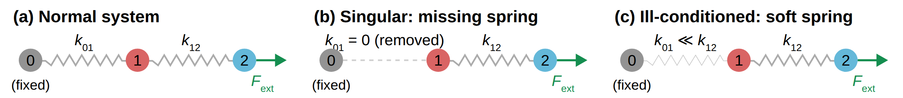

::: {.callout-note}
## Central question

What pitfalls can we encounter when solving $\mathbf{A}\mathbf{x}=\mathbf{b}$, and how can we choose a practical numerical solution?
:::

## Learning outcomes

By the end of this lecture, you should be able to:

1. **Diagnose** singularity and sensitivity in a spring system using its constraints and condition number.
2. **Calculate** equilibrium displacements with NumPy or SciPy and assess them by substitution and comparison with a known solution.
3. **Compare** the work and storage required by dense and banded representations of a spring chain.
4. **Derive** the displacement pattern of an end-loaded spring chain from force balance and use it to check a numerical solution.

## From force balance to a computed displacement

As introduced in L11, this unit uses atomic models, especially bead-and-spring models, to develop systems of equations and matrix operations. We converted a spring model of atomic interactions into a system of linear equations that answers one question: when an external force vector $\mathbf{f}$ is applied, how far does each atom move? The displacements $\mathbf{u}$ satisfy

$$
\mathbf{K}\mathbf{u}=\mathbf{f},
$$

where the stiffness matrix $\mathbf{K}$ contains the spring constants, $\mathbf{u}$ contains the unknown displacements, and $\mathbf{f}$ contains the applied forces. If $\mathbf{K}$ has an inverse $\mathbf{K}^{-1}$, defined by $\mathbf{K}^{-1}\mathbf{K}=\mathbf{I}$ with $\mathbf{I}$ the identity matrix, we can write

$$
\mathbf{u}=\mathbf{K}^{-1}\mathbf{f}.
$$

In NumPy this is a single line, `np.linalg.inv(K) @ f`, once `K` and `f` are entered as arrays by hand or built by a program. Solving a matrix equation might therefore seem simple, and if it were, the next few lectures would not be needed. What are the pitfalls?

::: {.callout-note collapse="true"}
## If you come from MATLAB

If you have worked in MATLAB, you may know the syntax `x = A \ b`. It is tempting to read it as "form the inverse $\mathbf{A}^{-1}$ and multiply by $\mathbf{b}$", but MATLAB solves the system directly without forming the inverse. For a square, nonsingular matrix it corresponds to `np.linalg.solve(A, b)`, and for a rectangular least-squares system to `np.linalg.lstsq(A, b)`. This lecture explains why practical solvers avoid the explicit inverse.
:::

We will use the bead-and-spring chain to explore three toy systems, each raising a different question. In all three, we leave aside how NumPy's algorithm solves the equations, which is the topic of L13, and focus on what the matrix tells us.

| Scenario | Change to the chain | Question we ask | Diagnostic |
|---|---|---|---|
| 1 | One spring disappears | Does a unique solution exist? | Determinant, rank, singular matrix |
| 2 | One spring becomes much weaker than the others | How sensitive is the solution to the matrix and forces? | Condition number |
| 3 | The chain grows to millions of moving atoms | How much computation and storage does the solution require? | Operation count, banded storage |

{#fig-spring-scenarios width=100% fig-alt="Three panels of atoms 0, 1, and 2 joined by springs, with fixed atom 0 and an external force pulling atom 2. Panel a has springs k01 and k12. In panel b, spring k01 is removed. In panel c, spring k01 is much softer than k12."}

Throughout the lecture, atom 0 is fixed and positive displacement points along the chain away from that fixed end. The matrix properties we investigate are independent of our choice of physical units. We therefore write the spring constants, forces, and displacements as numerical values, with a consistent set of units understood.

## Scenario 1: Singular matrices -- when the constraints are insufficient

As briefly mentioned in L11, for a $2\times2$ matrix, the inverse has a familiar explicit form:

$$
\mathbf{A}=\begin{bmatrix}a&b\\c&d\end{bmatrix},
\qquad
\mathbf{A}^{-1}=\frac{1}{ad-bc}
\begin{bmatrix}d&-b\\-c&a\end{bmatrix}.
$$

The denominator $ad-bc$ is the **determinant**, written $\det(\mathbf{A})$ (or simply $|\mathbf{A}|$). If $\det(\mathbf{A}) = 0$, the inverse matrix $\mathbf{A}^{-1}$ does not exist and the square matrix is **singular**. The equations then have either **infinitely many solutions** or **no solution**, depending on their right-hand side.

::: {.callout-note collapse="true"}
## Geometric meaning of the determinant

The determinant is a function that turns an $n\times n$ matrix into a single number. For a $2\times2$ matrix, picture the matrix as a transformation that maps the unit square, spanned by $(1,0)$ and $(0,1)$, to the parallelogram spanned by its columns $(a,c)$ and $(b,d)$. The area of that parallelogram is $|ad-bc|$, so the determinant is the factor by which the transformation stretches areas, and its sign records whether the orientation is flipped. For a $3\times3$ matrix, the determinant is the ratio by which volumes are stretched, and the same idea continues in higher dimensions.

A zero determinant means the transformation squashes space into a lower dimension, such as a plane onto a line. Different vectors then land on the same point, so the transformation cannot be undone and no inverse exists. 3Blue1Brown's video [The determinant](https://www.youtube.com/watch?v=Ip3X9LOh2dk) animates this picture, and [Hannah (1996), "A geometric approach to determinants"](https://doi.org/10.1080/00029890.1996.12004759), *The American Mathematical Monthly* 103, 401–409, develops determinants from this geometric definition.
:::

### Forming a singular matrix

Consider the three-atom chain from L11, with atom 0 fixed and atoms 1 and 2 free to move. When would $\det(\mathbf{K})=0$? Remove the spring between atoms 0 and 1, as in @fig-spring-scenarios (b). Only the bond between atoms 1 and 2 remains, so the two moving atoms float with no connection to the support. With $k_{12}=5$, the stiffness matrix becomes

$$
\mathbf{K}=\begin{bmatrix}5&-5\\-5&5\end{bmatrix},
\qquad
\det(\mathbf{K})=5(5)-(-5)(-5)=0.
$$

**1. Infinitely many solutions**

Consider equal and opposite applied forces:

$$
\begin{aligned}
5u_1-5u_2&=-10,\\
-5u_1+5u_2&=10.
\end{aligned}
$$

The second equation repeats the first with its sign reversed. Both specify $u_2-u_1=2$, so $(u_1,u_2)=(0,2)$, $(1,3)$, and $(-2,0)$ all satisfy the system. The force balance determines the spring extension but leaves the pair's overall translation unconstrained. Picture the two atoms drifting together: with no bond to the wall, they could be near their original positions or far away, and the spring would still have the same extension. Every pair $(u_1,u_2)=(c,c+2)$ satisfies the equations for any shared displacement $c$.

**2. No solution**

Now change the applied forces to $\mathbf{f}=(0,10)^{\mathsf T}$:

$$
5u_1-5u_2=0,
\qquad
-5u_1+5u_2=10.
$$

Adding the equations gives $0=10$, a **contradiction**! Changing only the right-hand side $\mathbf{f}$ has turned infinitely many solutions into none. The pair now has a net external force and no connection to a support that can balance it, so it would accelerate rather than remain in equilibrium.

### Missing bonds in a larger network

Defects in an atomic structure can remove bonds. How can we tell whether the remaining bonds still constrain every atom? @fig-2d-network shows a network arranged in two dimensions inside a fixed wall. We retain one scalar displacement per atom, with each bond resisting the difference between its endpoint displacements. A bond to the wall connects to a displacement fixed at zero.

In (a), several bonds are missing, but every atom still has a path of springs to the wall. The stiffness matrix is nonsingular. In (b), removing the remaining bonds around the centre atom leaves it free to move. The row and column belonging to that atom are zero, so the matrix is singular. In (c), atoms 5 and 8 keep the bond between them but lose every other bond, so the pair together has no path to the wall.

{#fig-2d-network width=100% fig-alt="Three square frames drawn as hatched fixed walls, each enclosing a 3 by 3 grid of moving atoms numbered 1 to 9. In panel a, the atoms are joined to each other and to the wall by springs, with some bonds missing, and the determinant is nonzero. In panel b, the bonds around atom 5 are dashed and atom 5 is blue and isolated, with zero determinant. In panel c, atoms 5 and 8 are blue and joined only to each other, with their other bonds dashed, and the determinant is zero."}

Number the atoms from left to right across each row, starting with 1 at the top left and ending with 9 at the bottom right. The centre atom is 5. For unit spring stiffness, each diagonal entry counts the bonds attached to that atom, including bonds to the wall. An off-diagonal entry is $-1$ when two moving atoms share a bond and zero otherwise. These rules give the following matrices.

::: {.callout-note collapse="true"}
## Complete stiffness matrices for the three networks

For panel (a),

$$
\mathbf{K}_a=\begin{bmatrix}
3&0&0&-1&0&0&0&0&0\\
0&3&-1&0&-1&0&0&0&0\\
0&-1&3&0&0&-1&0&0&0\\
-1&0&0&3&-1&0&0&0&0\\
0&-1&0&-1&3&0&0&-1&0\\
0&0&-1&0&0&3&0&0&-1\\
0&0&0&0&0&0&3&-1&0\\
0&0&0&0&-1&0&-1&3&-1\\
0&0&0&0&0&-1&0&-1&3
\end{bmatrix}.
$$

For panel (b), removing bonds $2$–$5$, $4$–$5$, and $5$–$8$ also reduces the diagonal entries for atoms 2, 4, and 8 by one:

$$
\mathbf{K}_b=\begin{bmatrix}
3&0&0&-1&0&0&0&0&0\\
0&2&-1&0&0&0&0&0&0\\
0&-1&3&0&0&-1&0&0&0\\
-1&0&0&2&0&0&0&0&0\\
0&0&0&0&0&0&0&0&0\\
0&0&-1&0&0&3&0&0&-1\\
0&0&0&0&0&0&3&-1&0\\
0&0&0&0&0&0&-1&2&-1\\
0&0&0&0&0&-1&0&-1&3
\end{bmatrix}.
$$

For panel (c), start again from $\mathbf{K}_a$ and remove bonds $2$–$5$, $4$–$5$, $7$–$8$, and $8$–$9$. Only bond $5$–$8$ remains on atoms 5 and 8:

$$
\mathbf{K}_c=\begin{bmatrix}
3&0&0&-1&0&0&0&0&0\\
0&2&-1&0&0&0&0&0&0\\
0&-1&3&0&0&-1&0&0&0\\
-1&0&0&2&0&0&0&0&0\\
0&0&0&0&1&0&0&-1&0\\
0&0&-1&0&0&3&0&0&-1\\
0&0&0&0&0&0&2&0&0\\
0&0&0&0&-1&0&0&1&0\\
0&0&0&0&0&-1&0&0&2
\end{bmatrix}.
$$

These matrices give $\det(\mathbf{K}_a)=5397$ and $\det(\mathbf{K}_b)=\det(\mathbf{K}_c)=0$. The fifth row and column of $\mathbf{K}_b$ vanish. An applied force on atom 5 gives the impossible equation $0=f_5$ when $f_5\ne0$. When $f_5=0$, its displacement is arbitrary. No row or column of $\mathbf{K}_c$ is zero, but rows 5 and 8 add to zero.
:::

**Can a network be singular without a zero row or column?** Yes. In @fig-2d-network (c), atoms 5 and 8 remain bonded to each other but lose every connection to the rest of the network and the wall. With stiffness $k$ for their shared bond, their rows and columns of the stiffness matrix form the block

$$
\mathbf{K}_{\mathrm{pair}}=\begin{bmatrix}k&-k\\-k&k\end{bmatrix},
\qquad
\mathbf{K}_{\mathrm{pair}}\begin{bmatrix}1\\1\end{bmatrix}
=\begin{bmatrix}0\\0\end{bmatrix}.
$$

Neither row nor column is zero, yet translating both atoms equally produces no restoring force. This unconstrained motion makes the whole network singular. In this scalar spring model with positive stiffnesses, every connected group of moving atoms needs a path to a fixed support.

The argument also works in reverse. If a stiffness matrix turns out to be singular, some group of atoms can move together without stretching any spring, so the network has lost the springs that would hold that group in place. A singular $\mathbf{K}$ is therefore a signal to look for missing bonds or missing supports in the model.

::: {.callout-tip collapse="true"}
## How many independent equations? The rank of a matrix

The **rank** of a matrix is the number of independent rows, which always equals the number of independent columns. An $N\times N$ matrix is nonsingular exactly when its rank is $N$. NumPy computes it with `np.linalg.matrix_rank`:

```python
np.linalg.matrix_rank(K_a)   # 9: all nine equations are independent
np.linalg.matrix_rank(K_b)   # 8: row 5 is zero
np.linalg.matrix_rank(K_c)   # 8: rows 5 and 8 add to zero
```

The difference $N-\text{rank}$ counts the independent free motions. Both singular networks have one: atom 5 alone in (b), and atoms 5 and 8 moving together in (c). For the two-atom chain without its spring to the wall, the rank is 1, and the free motion is the shared translation of the pair. `matrix_rank` uses a small tolerance to decide when a value counts as zero in floating-point arithmetic.
:::

### Why a small determinant needs care

NumPy provides `np.linalg.det` for calculating a determinant. For these small, exact examples, a zero determinant identifies the missing constraint. In floating-point calculations, however, the magnitude of a determinant depends strongly on matrix size and overall scaling.

For an $N\times N$ matrix $\mathbf{M}$, multiplying every entry by 10 gives

$$
\det(10\mathbf{M})=10^N\det(\mathbf{M}).
$$

Each of the $N$ rows contributes a factor of 10. For example, if $N=16$ and $\det(\mathbf{M})=10^{-16}$, then $\det(10\mathbf{M})=1$. This rescaling leaves all dependencies between rows unchanged. Moreover, multiplying both sides of $\mathbf{M}\mathbf{x}=\mathbf{b}$ by 10 gives exactly the same equations and solution. An exactly zero determinant stays zero, but a small nonzero determinant can become large through scaling alone. Its magnitude therefore cannot, by itself, tell us how sensitive the solution is.

## Scenario 2: Ill-conditioned problems -- very weak springs

Instead of removing the spring between atom 1 and the fixed atom 0 entirely, let it become very weak, as in @fig-spring-scenarios (c):

$$
k_{01}=0.001,\qquad k_{12}=5,
\qquad
\mathbf{K}_{\text{weak}}=\begin{bmatrix}5.001&-5\\-5&5\end{bmatrix}.
$$

This matrix is **nonsingular**, so it has an inverse. For comparison, a chain with two equal springs, $k_{01}=k_{12}=5$, has

$$
\mathbf{K}_{\text{equal}}=\begin{bmatrix}10&-5\\-5&5\end{bmatrix}.
$$

Pull the end atom of each chain with a force of 1, $\mathbf{f}=(0,1)^{\mathsf T}$, and calculate the displacements with `np.linalg.inv(K) @ f`.

::: {.quarto-wasm-local notebook="l12_weak_spring.edit.py" view="edit" title="Displacements of the weak-spring and equal-spring chains under an end force" height="420" loading="lazy" fullscreen="true"}
With the very weak spring, $\mathbf{u}=(1000,\,1000.2)^{\mathsf T}$. With two equal springs, $\mathbf{u}=(0.2,\,0.4)^{\mathsf T}$.
:::

Both springs in a chain carry the full end force of 1, so each stretches by $1/k$. The weak spring stretches by $1/0.001=1000$ and carries both atoms with it, while the bond between the moving atoms stretches by only $1/5=0.2$. The weak spring therefore allows much larger displacements under the same end load. An even more striking effect appears when we slightly change the forces.

### A small force change with a large relative effect

Now pull the two moving atoms apart with equal and opposite forces, $\mathbf{f}=(-1,1)^{\mathsf T}$. The net force on the pair is zero, so the spring to the wall carries no force and atom 1 stays in place. Only the bond between atoms 1 and 2 stretches, by $1/5=0.2$, so we expect $\mathbf{u}=(0,0.2)^{\mathsf T}$ for both chains.

What happens if we add only $0.001$ to the force on atom 2, giving $\mathbf{f}=(-1,1.001)^{\mathsf T}$? The pair now feels a small net force, which only the spring to the wall can balance. Calculate the displacements before and after this change for both chains.

::: {.quarto-wasm-local notebook="l12_force_perturbation.edit.py" view="edit" title="Displacements before and after a small force change" height="520" loading="lazy" fullscreen="true"}
For both chains, $\mathbf{f}=(-1,1)^{\mathsf T}$ gives $\mathbf{u}=(0,\,0.2)^{\mathsf T}$, zero to round-off for atom 1. After the change, the weak-spring chain moves to $(1,\,1.2002)^{\mathsf T}$, while the equal-spring chain moves only to $(0.0002,\,0.2004)^{\mathsf T}$.
:::

::: {.callout-important}
## A 0.071% change in force, a 707% change in displacement

With the very weak spring, a force change of about $0.071\%$ changes the displacements by about $707\%$. With two equal springs, the same force change changes the displacements by only about $0.224\%$.
:::

::: {.callout-note collapse="true"}
## Relative changes from vector lengths, and the physical reason for the large response

We compare the size of each change with the size of the original vector, using vector lengths, the 2-norm $\|\cdot\|_2$ defined in the next section. The force change is $\delta\mathbf{f}=(0,0.001)^{\mathsf T}$, so for both chains

$$
\frac{\|\delta\mathbf{f}\|_2}{\|\mathbf{f}\|_2}
=\frac{0.001}{\sqrt{2}}\approx0.000707.
$$

For the weak-spring chain, $\delta\mathbf{u}=(1,1.0002)^{\mathsf T}$ and $\|\mathbf{u}\|_2=0.2$, so

$$
\frac{\|\delta\mathbf{u}\|_2}{\|\mathbf{u}\|_2}
=\frac{\sqrt{1^2+1.0002^2}}{0.2}\approx7.07.
$$

For the equal-spring chain, $\delta\mathbf{u}=(0.0002,0.0004)^{\mathsf T}$, which gives a relative change of about $0.00224$.

The physical reason is the very soft spring. The added net force of $0.001$ must be carried by the spring to the wall, which stretches by $0.001/k_{01}$. With $k_{01}=0.001$ this stretch is 1, and it moves both atoms together by five times the original displacement of atom 2. With $k_{01}=5$, the same net force stretches the spring by only $0.0002$.
:::

- **Well-conditioned problem:** small relative changes in the supplied data cause comparably small relative changes in the solution. The equal-spring chain, with $\mathbf{K}_{\text{equal}}$, is our example.
- **Ill-conditioned problem:** some small relative changes in the supplied data can cause much larger relative changes in the solution. The weak-spring chain, with $\mathbf{K}_{\text{weak}}$, has such a sensitive direction of motion: the shared translation of both atoms, held only by the weak spring.

Sensitivity also matters when the data are rounded. A solver receives finite-precision spring constants and forces, then performs arithmetic with further rounding. An ill-conditioned problem can amplify those small changes **even when the algorithm is implemented correctly**.

::: {.callout-note collapse="true"}
## Round-off during a matrix solve

Round-off occurs during a direct solve even for a well-conditioned system. Dividing by a very small intermediate coefficient can magnify errors already present in the numerator, which is one reason the choice of elimination steps matters. An ill-conditioned system introduces a further difficulty: even small relative errors in the supplied coefficients or forces can produce large relative errors in the solution. In L13, we will examine how pivot selection helps control rounding errors during elimination.
:::

**Your turn:** run the notebook below to print the inverses of both stiffness matrices. How large are the entries of each inverse? What does that mean for a small change in the force?

::: {.quarto-wasm-local notebook="l12_inverse_entries.edit.py" view="edit" title="Inverses of the weak-spring and equal-spring matrices" height="420" loading="lazy" fullscreen="true"}
`np.linalg.inv(K_weak)` gives $\begin{bmatrix}1000&1000\\1000&1000.2\end{bmatrix}$ and `np.linalg.inv(K_equal)` gives $\begin{bmatrix}0.2&0.2\\0.2&0.4\end{bmatrix}$.
:::

::: {.callout-tip collapse="true"}
## Why the entries of the weak-spring inverse matter

The entries of the weak-spring inverse are about 1000, while the entries of the equal-spring inverse are below 1. The inverse multiplies the force, so with the weak spring even a tiny force change is amplified about a thousandfold in the displacements. This is the large jump we found above.
:::

## Measuring sensitivity with the condition number

Printing the inverses showed that the inverse of the weak-spring matrix has much larger entries than the inverse of the equal-spring matrix. To say how much larger, we need a common measure of the size, or magnitude, of a vector or a matrix. Such a measure is called a **norm**. For a vector, the most familiar norm is its length, the **Euclidean norm** or **2-norm**:

$$
\|\mathbf{x}\|_2=\sqrt{x_1^2+x_2^2+\cdots+x_n^2}.
$$

A matrix also has a size. The simplest measure treats all its entries as one long vector and takes the Euclidean length of that vector:

$$
\|\mathbf{A}\|_F=\sqrt{\sum_{i}\sum_{j}a_{ij}^2}.
$$

For a $2\times2$ matrix, this is $\sqrt{a_{11}^2+a_{12}^2+a_{21}^2+a_{22}^2}$. It is called the **Frobenius norm**, and `np.linalg.norm(A)` computes it. There are many other ways to measure the size of a matrix, so below we write $\|\mathbf{A}\|$ for whichever norm we choose.

::: {.callout-note collapse="true"}
## Different ways to measure the size of a vector or a matrix

For a vector, the 2-norm adds the squares of the entries. Two other common choices add the absolute values, $\|\mathbf{x}\|_1=|x_1|+|x_2|+\cdots+|x_n|$, or keep only the largest absolute value, $\|\mathbf{x}\|_\infty=\max_i|x_i|$.

For a matrix, besides the Frobenius norm, a common choice is the **matrix 2-norm**, the largest factor by which the matrix can stretch the length of any vector. The norms give different numbers, but a matrix that is large in one norm is also large in the others.
:::

The **condition number** of a square matrix compares the size of the matrix with the size of its inverse:

$$
\boxed{\kappa(\mathbf{A})=\|\mathbf{A}\|\,\|\mathbf{A}^{-1}\|.}
$$

For a single number $a$, the inverse $1/a$ has size exactly $1/|a|$, so the product is always 1. For a matrix, the condition number asks whether the size of the inverse is close to $1/\|\mathbf{A}\|$, or much larger:

- **$\kappa$ close to 1:** the inverse has about the size $1/\|\mathbf{A}\|$, and small relative changes in the data cause comparably small relative changes in the solution. The problem is well-conditioned.
- **$\kappa\gg1$:** the inverse is much larger than $1/\|\mathbf{A}\|$, and some small relative changes in the data are strongly amplified. The problem is ill-conditioned.

A singular matrix has no inverse, and its condition number is infinite by convention. One common measure uses the 2-norm and is written $\kappa_2$. NumPy computes it with `np.linalg.cond(K)`.

::: {.callout-note}
## How large is too large?
A `float64` number carries about 16 significant digits, and a condition number of $10^p$ can cost up to about $p$ of them. Values of $10^2$ to $10^3$ are therefore still tolerable for most calculations in double precision, while a condition number near $10^{16}$ leaves no reliable digits.
:::

The condition number limits how much a relative change in the forces can grow in the displacements. For $\mathbf{K}\mathbf{u}=\mathbf{f}$,

$$
\frac{\|\delta\mathbf{u}\|}{\|\mathbf{u}\|}
\le
\kappa(\mathbf{K})\,
\frac{\|\delta\mathbf{f}\|}{\|\mathbf{f}\|}.
$$

Check this with the force change from the previous section, a relative change of about $0.000707$. For the weak-spring chain, $\kappa_2\approx20002$, so the displacements can change by at most $20002\times0.000707\approx14.1$, or about $1414\%$. The change we found, $707\%$, lies within this limit. For the equal-spring chain, $\kappa_2\approx6.854$ gives a limit of about $0.0048$, or $0.48\%$, and we found $0.224\%$. Try it out yourself in the notebook below.

::: {.quarto-wasm-local notebook="l12_condition_number.edit.py" view="edit" title="Condition numbers and the limit on the displacement change" height="480" loading="lazy" fullscreen="true"}
`np.linalg.cond` gives $\kappa_2\approx20002$ for the weak-spring matrix and $\kappa_2\approx6.854$ for the equal-spring matrix. With a relative force change of about $0.000707$, the limits on the relative displacement change are about $14.1$ and $0.0048$.
:::

::: {.callout-tip collapse="true"}
## Derivation: The condition-number bound

The matrix norms used for condition numbers, such as the matrix 2-norm, satisfy $\|\mathbf{A}\mathbf{x}\|\le\|\mathbf{A}\|\,\|\mathbf{x}\|$ for every vector $\mathbf{x}$. Suppose $\mathbf{A}$ is fixed and nonsingular, and only $\mathbf{b}$ changes:

$$
\mathbf{A}\mathbf{x}=\mathbf{b},
\qquad
\mathbf{A}(\mathbf{x}+\delta\mathbf{x})
=\mathbf{b}+\delta\mathbf{b}.
$$

Subtract the original equation from the perturbed equation:

$$
\mathbf{A}\delta\mathbf{x}=\delta\mathbf{b},
\qquad
\delta\mathbf{x}=\mathbf{A}^{-1}\delta\mathbf{b}.
$$

Taking norms gives

$$
\|\delta\mathbf{x}\|
\le\|\mathbf{A}^{-1}\|\,\|\delta\mathbf{b}\|.
$$

To turn this absolute-change bound into a relative-change bound, also use

$$
\|\mathbf{b}\|=\|\mathbf{A}\mathbf{x}\|
\le\|\mathbf{A}\|\,\|\mathbf{x}\|.
$$

For a nonzero right-hand side, dividing and combining these inequalities gives

$$
\frac{\|\delta\mathbf{x}\|}{\|\mathbf{x}\|}
\le
\underbrace{\|\mathbf{A}\|\,\|\mathbf{A}^{-1}\|}_{\kappa(\mathbf{A})}
\frac{\|\delta\mathbf{b}\|}{\|\mathbf{b}\|}.
$$

The bound is reached only for the most sensitive direction of $\delta\mathbf{b}$.
:::

### In-class comparison

Which of these matrices is more sensitive? First look at whether their rows nearly repeat the same equation, then calculate their condition numbers in the empty cell of the notebook above.

$$
\mathbf{A}=\begin{bmatrix}1&1\\1&1.001\end{bmatrix},
\qquad
\mathbf{B}=\begin{bmatrix}0.003&3\\1&1\end{bmatrix}.
$$

::: {.callout-tip collapse="true"}
## Condition numbers for the in-class matrices

The results are $\kappa_2(\mathbf{A})\approx4002$ and $\kappa_2(\mathbf{B})\approx3.374$. The nearly repeated rows of $\mathbf{A}$ make it much more sensitive. A single small entry, such as $0.003$ in $\mathbf{B}$, is insufficient to diagnose ill-conditioning.

For the identity matrix, $\kappa_2(\mathbf{I})=1$. Scaling it gives another useful comparison: $\det(10^{-8}\mathbf{I})=10^{-16}$ for a $2\times2$ matrix, yet $\kappa_2(10^{-8}\mathbf{I})=1$. This is why a tiny determinant alone is not a reliable sensitivity test.
:::

## Scenario 3: Computational effort -- solving without forming an inverse

A nonsingular system can still be expensive to solve. The mathematical expression for the inverse of a general matrix is

$$
\mathbf{A}^{-1}=\frac{\operatorname{adj}(\mathbf{A})}{\det(\mathbf{A})},
$$

where the adjugate is the transpose of the cofactor matrix. Each cofactor contains a determinant of a smaller matrix. Recursive expansion by minors quickly becomes impractical, with factorial growth in work for a naive implementation. Numerical libraries instead use matrix factorizations. In particular, `np.linalg.inv` does not recursively construct cofactors.

Even with an efficient library, explicitly forming an inverse computes $N^2$ output entries when our immediate goal may be just $N$ displacements. For a square, nonsingular system, NumPy provides `np.linalg.solve(K, f)`. SciPy also provides `scipy.linalg.solve(K, f)`, with additional options for matrix structure. Both return the unknown vector directly.

For a general dense matrix, factorization has leading-order work proportional to $N^3$. After that factorization, solving for one right-hand side requires work proportional to $N^2$. Computing the entire inverse requires additional work and storage. Dense inversion and a dense solve therefore both have cubic leading-order cost, but a direct solve avoids constructing an unnecessary matrix and is generally the preferred numerical route.

The difference matters even when both answers look identical. Multiplying a computed inverse by the right-hand side adds another rounded operation, and an explicit inverse offers no remedy for ill-conditioning. A direct solver is also affected by conditioning, so we still need to interpret the result and check the residual,

$$
\mathbf{r}=\mathbf{K}\mathbf{u}_{\mathrm{computed}}-\mathbf{f}.
$$

A small residual shows that the computed vector nearly satisfies the supplied equations. If the system is ill-conditioned, it can coexist with appreciable displacement error. For our simple chain, we can additionally compare with the exact displacement pattern derived near the end of this lecture.

### Timing the dense calculation

Press **Run dense benchmark** in the next notebook to time inversion and `solve` for 512, 1,024, and 2,048 moving atoms. Both times grow roughly as $N^3$, and `solve` is faster because it computes one displacement vector instead of every column of the inverse. Extrapolated to a million atoms, the dense calculation would take years and the matrix alone would need 8 TB. The banded storage in the next section changes the scaling itself.

::: {.quarto-wasm-local notebook="l12_dense_solve.edit.py" view="edit" title="Dense spring-chain timing: inverse versus solve" height="850" loading="lazy" fullscreen="true"}
For $N$ moving atoms with identical nearest-neighbor springs, one fixed end, and end force $F$, the reference displacements are $u_i=iF/k$. The benchmark measures 512, 1,024, and 2,048 unknowns and checks both the relative residual and the error against this reference. A degree-one fit to log(time) versus log(size) gives $t\approx cN^p$, which is extrapolated to $N=10^6$. Under cubic scaling, this is about $(10^6/2048)^3\approx1.16\times10^8$ times the cost at 2,048 unknowns. Inversion and a direct dense solve both have cubic leading-order cost, with inversion doing additional work to produce the entire inverse.
:::

## From dense matrices to banded and sparse systems

Dense solving improves on forming an inverse, but it still stores every matrix entry. With $N=10^6$ unknowns and 8 bytes per double-precision entry, the matrix alone occupies

$$
8N^2=8\times10^{12}\ \text{bytes}=8\ \text{TB}.
$$

Factorization can require additional storage. Before attempting such a solve, look at the physical connections represented by the matrix. Our chain couples each moving atom only to its nearest neighbors, so its stiffness matrix is

$$
\mathbf{K}=k\begin{bmatrix}
2&-1&0&\cdots&0\\
-1&2&-1&\ddots&\vdots\\
0&-1&2&\ddots&0\\
\vdots&\ddots&\ddots&\ddots&-1\\
0&\cdots&0&-1&1
\end{bmatrix}.
$$

The last diagonal entry is $k$, because the end atom connects to only one spring. Every other moving atom connects to two. Only the main diagonal and the diagonals immediately above and below it contain nonzero entries. Such a matrix is **tridiagonal**, a special case of a **banded matrix**, whose nonzero entries lie within a limited distance of the main diagonal.

{#fig-tridiagonal width=100% fig-alt="Left, a chain of a fixed atom 0 and moving atoms 1 to 5, each above a column of a 5 by 5 stiffness matrix. The main diagonal holds 2k, ending in k, coloured blue. The upper diagonal holds minus k in green and the lower diagonal holds minus k in red. All other entries are 0. Right, a chain of N atoms above an N by N matrix in which only the three coloured diagonals are filled and the rest is zero."}

Storing three diagonals requires about $3N$ numbers rather than $N^2$. For a million unknowns, that is about 24 MB of double-precision coefficients. Specialized tridiagonal solvers also use work proportional to $N$, so representing the structure changes both the memory requirement and the solve time.

SciPy's `solve_banded` accepts this compact representation. For three moving atoms, the full stiffness matrix and its stored band array are

$$
\mathbf{K}=\begin{bmatrix}2k&-k&0\\-k&2k&-k\\0&-k&k\end{bmatrix},
\qquad
\texttt{ab}=\begin{bmatrix}0&-k&-k\\2k&2k&k\\-k&-k&0\end{bmatrix}.
$$

The middle row of `ab` holds the main diagonal. The top row holds the upper diagonal, shifted one column to the right, and the bottom row holds the lower diagonal. The two corner zeros are unused padding. The call `solve_banded((1, 1), ab, f)` specifies one lower and one upper diagonal. This layout is documented in [SciPy's banded solver reference](https://docs.scipy.org/doc/scipy/reference/generated/scipy.linalg.solve_banded.html).

A **sparse matrix** more generally has relatively few nonzero entries, which need not form a narrow band. Local interactions in a larger network often give sparse matrices even when the geometry is more complicated than a chain. SciPy's sparse arrays and `scipy.sparse.linalg` provide methods for these systems, with a cost that depends on the connection pattern.

### A large chain with compact storage

The notebook starts with 10,000 moving atoms. Increase `N` to a million to measure the banded calculation on your device without creating a dense matrix. Compare the measured time and the reported storage with the dense estimate. The residual is also computed from the three diagonals, so checking the solution does not silently recreate the large dense array.

::: {.quarto-wasm-local notebook="l12_banded_solve.edit.py" view="edit" title="Banded storage and solution of a large spring chain" height="850" loading="lazy" fullscreen="true"}
At $N=10^6$, a dense float64 stiffness matrix needs 8 TB, while a three-row band array needs 24 MB, excluding right-hand sides and solver workspace. With $k=5$ and $F=10^{-7}$, the analytical end displacement is $u_N=NF/k=0.02$. Actual timings depend on the device. Comparing both the residual and the analytical error helps expose rounding effects as the chain grows.
:::

## A check from force balance: the end-loaded chain

How can we check the numbers that `solve` and `solve_banded` return? For the uniform chain, force balance gives the answer directly. Atom 0 is fixed, $N$ atoms can move, every spring has stiffness $k$, and an external force $F_{\mathrm{ext}}$ acts on the last atom. Each unloaded interior atom requires the spring force on its left to equal the spring force on its right. The last spring carries $F_{\mathrm{ext}}$, so every spring in this chain carries that same force. With equal stiffnesses, each extension is therefore

$$
u_1-u_0=u_2-u_1=u_3-u_2=\cdots=u_N-u_{N-1}
=\frac{F_{\mathrm{ext}}}{k}.
$$

Starting from the fixed end $u_0=0$, the extensions accumulate:

$$
\boxed{u_i=i\frac{F_{\mathrm{ext}}}{k},\qquad i=1,2,\ldots,N.}
$$

Here $N$ counts the moving atoms, and $i$ labels an atom's position along the chain. If the spring stiffnesses differ, each spring still carries the same end load, but its extension is $F_{\mathrm{ext}}/k_{j-1,j}$. For example,

$$
u_3=\frac{F_{\mathrm{ext}}}{k_{01}}
+\frac{F_{\mathrm{ext}}}{k_{12}}
+\frac{F_{\mathrm{ext}}}{k_{23}},
\qquad
u_i=\sum_{j=1}^{i}\frac{F_{\mathrm{ext}}}{k_{j-1,j}}.
$$

For the L11 values $k=5$ and $F_{\mathrm{ext}}=10$ with three moving atoms, $\mathbf{u}=(2,4,6)^{\mathsf T}$. Additional connections or forces change the equations, and then we need a general method. L13 shows the one inside `np.linalg.solve`: Gaussian elimination.

## Take-home message

- For a square, nonsingular system, use `np.linalg.solve` to compute the unknown vector directly instead of forming an inverse.
- Missing constraints can make a stiffness matrix singular. A very weak constraint can produce strong sensitivity, which the condition number helps quantify.
- Check the residual and interpret the displacements physically. For an ill-conditioned system, a small residual alone does not guarantee a small solution error.
- Use matrix structure when it is available. A nearest-neighbor chain can be stored and solved as a tridiagonal system with linear memory and work.

## Check your understanding

1. Remove the spring to atom 0 from the two-moving-atom system. Why do balanced forces permit infinitely many displacements, while a nonzero net force permits no static equilibrium?
2. Why does doubling the end force fail to distinguish the well-conditioned and ill-conditioned examples? What did the small perturbation of the balanced force pair reveal instead?
3. If $\kappa_2(\mathbf{A})=10^4$ and the relative change in $\mathbf{b}$ is $10^{-6}$, what upper bound follows for the relative solution change when $\mathbf{A}$ is fixed?
4. For a chain of three moving atoms with stiffnesses $k_{01}=5$, $k_{12}=10$, and $k_{23}=5$ and an end force of 1, predict the displacements from force balance, then check them with `np.linalg.solve`.

## Before next class

`np.linalg.solve` returns the answer without forming an inverse, but what does it actually do? L13 opens the solver: Gaussian elimination by hand, why it must sometimes swap rows, how round-off limits its accuracy, and how recording its steps lets one factorization serve many load cases.
