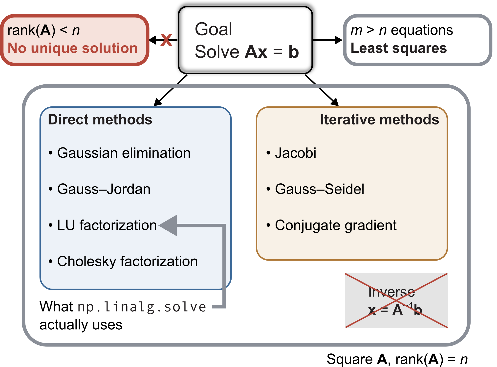
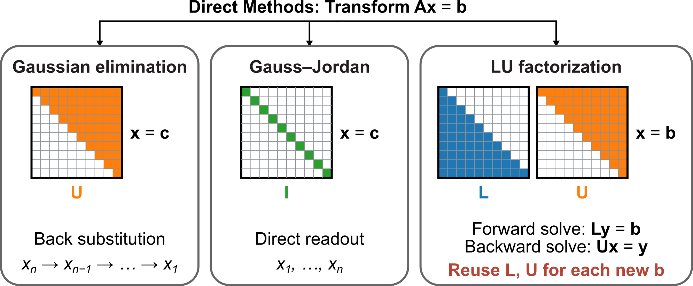
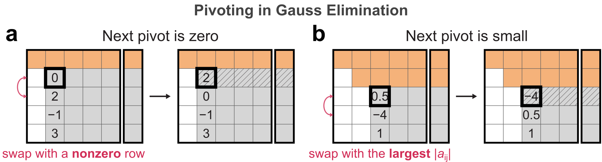
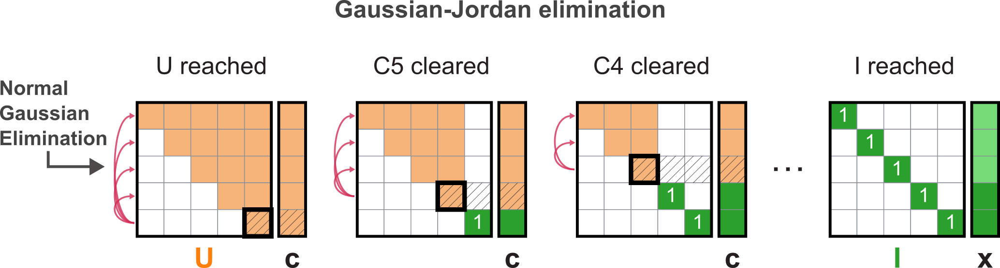
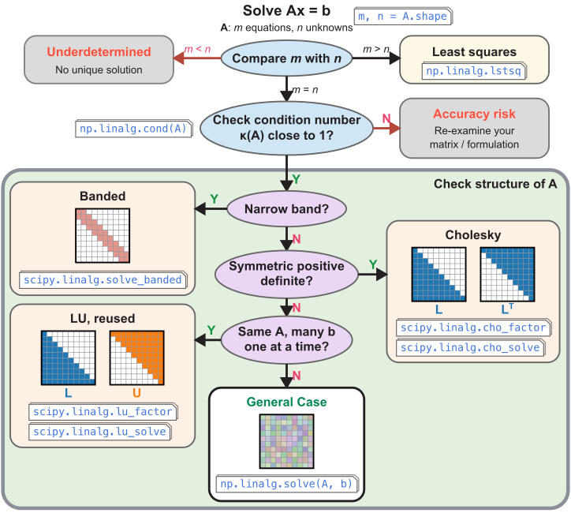

::: {.callout-note}
## Central question

How is a linear system $\mathbf{A}\mathbf{x}=\mathbf{b}$ **actually** solved inside NumPy, and how do we choose the right solver call for a given matrix?
:::

## Learning outcomes

By the end of this lecture, you should be able to:

1. **Solve** a small system by Gaussian elimination and back substitution, and explain what each stage produces.
2. **Explain** why a solver interchanges rows during elimination, using a matrix with a small pivot.
3. **Estimate** the accuracy that double-precision arithmetic allows, using machine precision and the condition number.
4. **Describe** how LU factorization records elimination so that it can be reused.
5. **Compare** the row-operation sequence of a direct method with the residual-based stopping criterion of an iterative method.

## From `solve` to the algorithm behind it

In L12, we found that computing $\mathbf{A}^{-1}\mathbf{b}$ is rarely the best way to obtain $\mathbf{x}$. A call to `np.linalg.solve(A, b)` returns the same displacements with less work! If the matrix $\mathbf{A}$ is special, like the **tridiagonal** stiffness matrix of the spring chain, a specialized banded solver such as `solve_banded` can be much faster.

**Rule of thumb**: none of these routines finds $\mathbf{x}$ by dividing by a matrix. Each one rewrites the system of equations into another system that has the same solution but is much easier to solve.

Numerical methods for linear systems fall into two families, which are designed for somewhat different situations.

- **Direct methods** transform the equations by a fixed sequence of arithmetic operations and reach the solution after a finite number of steps that can be counted in advance. Gaussian elimination is the classic example. In exact arithmetic, a direct method returns the **exact solution**. However, rounding may change the computed result. Each floating-point operation can introduce a small rounding error, and the order and choice of operations affect how those errors accumulate.
- **Iterative methods** start from a guess and repeatedly improve it, much like the fixed-point and Newton iterations from L06. They are designed for **very large sparse matrices**, in which most entries are zero, and they raise questions about convergence and about when to stop.

For a square matrix with full rank, both families can be used to find the unique solution. More generally, with $m$ equations and $n$ unknowns, $\operatorname{rank}(\mathbf{A})<n$ means there is no unique exact solution: the equations may be inconsistent or leave some unknowns free. When $m>n$, we often seek a **least-squares solution**, minimizing $\|\mathbf{A}\mathbf{x}-\mathbf{b}\|^2$ as in data fitting. It is unique when the columns of $\mathbf{A}$ are independent.

{#fig-linear-methods width=90% fig-alt="Overview of direct and iterative methods, with separate branches for rank deficiency and least squares."}

The solvers we call in this course are direct methods, so they are the focus of this lecture. Iterative methods appear briefly at the end.

## Direct methods

In L12, we saw that the structure of a matrix affects how much work a solve requires. Direct methods transform $\mathbf{A}\mathbf{x}=\mathbf{b}$ into systems with simpler structure. Three useful forms are:

- A **diagonal matrix** $\mathbf{D}$ has zeros everywhere off the main diagonal.
- A **lower-triangular matrix** $\mathbf{L}$ has zeros above the main diagonal.
- An **upper-triangular matrix** $\mathbf{U}$ has zeros below the main diagonal.

Can we solve these $3\times3$ systems without calling `np.linalg.solve`?

### Diagonal matrix

$$
\begin{bmatrix}D_{11}&0&0\\0&D_{22}&0\\0&0&D_{33}\end{bmatrix}
\begin{bmatrix}x_1\\x_2\\x_3\end{bmatrix}
=\begin{bmatrix}c_1\\c_2\\c_3\end{bmatrix}.
$$

Each equation gives one unknown directly:

$$
x_1=\frac{c_1}{D_{11}},\qquad x_2=\frac{c_2}{D_{22}},\qquad x_3=\frac{c_3}{D_{33}}.
$$

A unique solution requires every diagonal entry to be nonzero. When all three diagonal entries equal 1, the matrix is the identity $\mathbf{I}$ and the solution is simply $\mathbf{x}=\mathbf{c}$.

### Lower-triangular matrix: forward substitution

For example, this lower-triangular matrix has zeros above its main diagonal:

$$
\begin{bmatrix}L_{11}&0&0\\L_{21}&L_{22}&0\\L_{31}&L_{32}&L_{33}\end{bmatrix}
\begin{bmatrix}x_1\\x_2\\x_3\end{bmatrix}
=\begin{bmatrix}c_1\\c_2\\c_3\end{bmatrix}.
$$

The first row contains only $x_1$. Once it is known, the second row determines $x_2$, and the third determines $x_3$:

$$
\begin{aligned}
x_1&=\frac{c_1}{L_{11}},\\
x_2&=\frac{c_2-L_{21}x_1}{L_{22}},\\
x_3&=\frac{c_3-L_{31}x_1-L_{32}x_2}{L_{33}}.
\end{aligned}
$$

This top-to-bottom procedure is **forward substitution**: solve for $x_1$, then $x_2$, and continue through $x_n$. The subscript $L_{ij}$ identifies the coefficient in row $i$, column $j$. For $n$ unknowns, the same pattern is

$$
x_i=\frac{c_i-\sum_{j=1}^{i-1}L_{ij}x_j}{L_{ii}},\qquad i=1,2,\ldots,n.
$$

::: {.callout-tip collapse="true"}
## Two Python implementations of forward substitution

Both functions below carry out the same forward substitution. The first writes the sum in the numerator as a loop over $j$. The second replaces that loop with a NumPy dot product between the known coefficients of row $i$, `L[i, :i]`, and the unknowns already computed, `x[:i]`. Research code would normally call a library routine such as [`scipy.linalg.solve_triangular`](https://docs.scipy.org/doc/scipy/reference/generated/scipy.linalg.solve_triangular.html), but writing the loop once shows how the formula above turns into a short program.

:::: {.columns}
::: {.column width="50%"}
**Explicit inner loop**

```python
import numpy as np

def forward_substitute_loop(L: np.ndarray, c: np.ndarray):
    x = np.zeros_like(c, dtype=float)
    for i in range(len(c)):
        numerator = c[i]
        for j in range(i):
            numerator -= L[i, j] * x[j]
        x[i] = numerator / L[i, i]
    return x
```
:::

::: {.column width="50%"}
**NumPy dot product**

```python
def forward_substitute_numpy(L: np.ndarray, c: np.ndarray):
    x = np.zeros_like(c, dtype=float)
    for i in range(len(c)):
        x[i] = (c[i] - L[i, :i] @ x[:i]) / L[i, i]
    return x
```
:::
::::
:::

### Upper-triangular matrix: back substitution

For an upper-triangular matrix, all entries below the main diagonal are zero. The system is

$$
\begin{bmatrix}U_{11}&U_{12}&U_{13}\\0&U_{22}&U_{23}\\0&0&U_{33}\end{bmatrix}
\begin{bmatrix}x_1\\x_2\\x_3\end{bmatrix}
=\begin{bmatrix}c_1\\c_2\\c_3\end{bmatrix},
$$

or, equation by equation,

$$
\begin{aligned}
U_{11}x_1+U_{12}x_2+U_{13}x_3&=c_1,\\
U_{22}x_2+U_{23}x_3&=c_2,\\
U_{33}x_3&=c_3.
\end{aligned}
$$

Unlike forward substitution, **back substitution** solves in reverse order: first $x_3$, then $x_2$, and finally $x_1$.

$$
\begin{aligned}
x_3&=\frac{c_3}{U_{33}},\\
x_2&=\frac{c_2-U_{23}x_3}{U_{22}},\\
x_1&=\frac{c_1-U_{12}x_2-U_{13}x_3}{U_{11}}.
\end{aligned}
$$

For $n$ unknowns, back substitution solves in the order $x_n,x_{n-1},\ldots,x_1$:

$$
x_i=\frac{c_i-\sum_{j=i+1}^{n}U_{ij}x_j}{U_{ii}},\qquad i=n,n-1,\ldots,1.
$$

Lower-triangular systems are solved by forward substitution and upper-triangular systems by back substitution. Row $i$ needs one multiplication and one subtraction for each unknown already found, so a complete triangular solve takes on the order of $n^2$ arithmetic operations. Most of the work in a direct method lies in transforming the original system into one of these easier forms.

### Popular direct methods and their final form

| Method | Initial form | Final form | How to obtain the solution |
|---|---|---|---|
| Gaussian elimination | $\mathbf{A}\mathbf{x}=\mathbf{b}$ | $\mathbf{U}\mathbf{x}=\mathbf{c}$ | Back substitution |
| Gauss–Jordan elimination | $\mathbf{A}\mathbf{x}=\mathbf{b}$ | $\mathbf{I}\mathbf{x}=\mathbf{c}$ | Read off $\mathbf{x}=\mathbf{c}$ |
| LU factorization | $\mathbf{A}\mathbf{x}=\mathbf{b}$ | $\mathbf{L}\mathbf{U}\mathbf{x}=\mathbf{b}$ | Solve $\mathbf{L}\mathbf{y}=\mathbf{b}$ forward, then $\mathbf{U}\mathbf{x}=\mathbf{y}$ backward |


{#fig-direct-methods width=100% fig-alt="Gaussian elimination produces upper-triangular U, Gauss–Jordan produces identity I, and LU produces lower- and upper-triangular factors."}

The table also describes what happens inside the solver we call most often. `np.linalg.solve` passes the matrix to LAPACK, a compiled linear-algebra library originally written in Fortran, and its routine computes an **LU factorization** with partial pivoting. LU factorization is built from the row operations of Gaussian elimination, so we begin there and follow how arithmetic on whole equations turns a general matrix into a triangular one. You should be able to carry out a small elimination by hand, including in an exam.

### Gaussian elimination

Gaussian elimination solves $\mathbf{A}\mathbf{x}=\mathbf{b}$ in two phases:

1. **Elimination phase.** Row operations turn every entry below the main diagonal into zero, converting $\mathbf{A}\mathbf{x}=\mathbf{b}$ into an upper-triangular system $\mathbf{U}\mathbf{x}=\mathbf{c}$.
2. **Back-substitution phase.** The triangular system $\mathbf{U}\mathbf{x}=\mathbf{c}$ is solved from $x_n$ upward, exactly as in the previous section.

We label the $n$ equations, which are the rows of the system, as $R_1,R_2,\ldots,R_n$. Each label stands for a whole equation, with both its left-hand side and its right-hand side. The elimination phase uses three **elementary row operations**, and none of them changes the solution:

1. **Swap two equations**, written $R_i\leftrightarrow R_j$.
2. **Multiply an equation by a nonzero number** $k$, written $R_i\leftarrow kR_i$.
3. **Add a multiple of one equation to another**, written $R_i\leftarrow R_i+kR_j$ for $i\ne j$.

The arrow $\leftarrow$ means that the row on the left is replaced by the expression on the right. Operation 3 combines scaling with addition (or subtraction, when $k<0$), and it does almost all of the work in elimination. Consider the two equations

$$
\begin{aligned}
R_1&:\quad x_1+x_2=3,\\
R_2&:\quad 2x_1+3x_2=0.
\end{aligned}
$$

The operation $R_1\leftarrow R_1+R_2$ replaces the first equation by $3x_1+4x_2=3$. The new pair has the same solution, but it is no easier to solve, because both equations still contain both unknowns. A useful operation removes $x_1$ from the second equation:

$$
R_2\leftarrow R_2-\left(\frac{2}{1}\right)R_1
\quad\Longrightarrow\quad
0\,x_1+x_2=-6.
$$

The second equation now gives $x_2=-6$ directly, and substituting it into $R_1$ gives $x_1=3-(-6)=9$, which is Gaussian elimination in miniature. For a larger square system with a unique solution, we repeat such operations column by column, from left to right, until every coefficient below the main diagonal is zero. The original system $\mathbf{A}\mathbf{x}=\mathbf{b}$ has then become

$$
\mathbf{U}\mathbf{x}=\mathbf{c}.
$$

This top-to-bottom sweep is called **forward elimination**. Despite the similar name, it differs from forward substitution: elimination changes the equations, whereas forward substitution solves equations that are already lower triangular. At each stage of the sweep, one row is used to eliminate the entries below it in one column. Its diagonal entry is the **pivot**, and the row is the **pivot row**.

@fig-elimination-steps shows how the work is organized for a $5\times5$ matrix. The first pivot row (hatched) is subtracted, with a suitable multiplier, from each row below it. This creates zeros below $a_{11}$ and changes every remaining entry in those rows, so a block of $4\times4=16$ entries of $\mathbf{A}$ is updated, together with the matching entries of $\mathbf{b}$. The next pivot, $u_{22}$, clears column 2 and updates a $3\times3$ block, and so on until only $\mathbf{U}$ remains.

![Gaussian elimination on a $5\times5$ system $[\mathbf{A}\,|\,\mathbf{b}]$. Grey entries are not yet final, orange rows are finished rows of $[\mathbf{U}\,|\,\mathbf{c}]$, and white entries have been eliminated. The hatched row is the pivot row used in the next step, and the black outline marks its pivot. The arrows show the pivot row being combined with each row below it. ](../../../assets/L13-gauss-elimination-steps.png){#fig-elimination-steps fig-alt="A five-by-five augmented system at the start, after clearing columns one and two, and at the final upper-triangular form. Hatched pivot rows and red arrows indicate elimination below each pivot." width=100%}

**How many operations does Gaussian elimination need?**

The shrinking blocks in @fig-elimination-steps give the answer. We count the operations of naive elimination, which uses each diagonal entry as the pivot and never swaps rows.

- **Elimination phase.** Clearing column 1 changes the $n-1$ rows below the first pivot. In each of those rows, the remaining $n-1$ entries of $\mathbf{A}$ are updated as $a_{ij}\leftarrow a_{ij}-\ell\,a_{1j}$, where $\ell$ is the multiplier for that row. Each update needs one multiplication and one subtraction, which is where the factor 2 below comes from. Column 1 therefore costs about $2(n-1)^2$ operations, column 2 about $2(n-2)^2$, and so on:

  $$
  2\left[(n-1)^2+(n-2)^2+\cdots+1^2\right]\approx\frac{2}{3}n^3.
  $$

  The approximation uses $1^2+2^2+\cdots+m^2=m(m+1)(2m+1)/6\approx m^3/3$. Computing the multipliers and updating $\mathbf{b}$ add only order $n^2$ operations.
- **Back-substitution phase.** As shown for triangular systems, this costs about $n^2$ operations.

For $n=1000$, elimination needs about $7\times10^8$ operations and back substitution about $10^6$. Nearly all the effort goes into eliminating, which explains the cubic scaling in the L12 dense benchmark. The count describes the worst case, in which every entry below the diagonal starts nonzero and must be removed. Many engineering matrices begin with most of those entries already zero. In the tridiagonal stiffness matrix $\mathbf{K}$ of the spring chain, each column has a single nonzero entry below the diagonal, and removing it changes only a few entries of the next row, which is why a banded solver needs only order $n$ operations.

#### Worked example: naive elimination on a $4\times4$ system

Consider the following system of equations:

$$
\begin{aligned}
2x_1+x_2-x_3+x_4&=5,\\
4x_1+5x_2+x_4&=18,\\
-2x_1+5x_2+8x_3&=32,\\
2x_1-2x_2+11x_4&=42.
\end{aligned}
$$

Gaussian elimination works on the **augmented matrix** $[\mathbf{A}\,|\,\mathbf{b}]$, formed by appending the right-hand side as an extra column. Each row then holds a complete equation, so every row operation **must include** the final column, because leaving it out would change the equations and their solution. For this system, the augmented matrix is

$$
\left[\begin{array}{rrrr|r}
2&1&-1&1&5\\
4&5&0&1&18\\
-2&5&8&0&32\\
2&-2&0&11&42
\end{array}\right].
$$

Every elimination step follows the same rule. Suppose $R_i$ is the pivot row with pivot $a_i$, and $R_j$ is a row below it whose entry in the same column is $a_j$. The operation

$$
R_j\leftarrow R_j-\left(\frac{a_j}{a_i}\right)R_i
$$

replaces $a_j$ by $a_j-(a_j/a_i)\,a_i=0$. The ratio $a_j/a_i$ is called the **multiplier**.

**Eliminate column 1.** $R_1$ is the pivot row, with pivot 2. Applying the rule to the three rows below it gives

$$
\begin{aligned}
R_2&\leftarrow R_2-\left(\frac{4}{2}\right)R_1\\
R_3&\leftarrow R_3-\left(\frac{-2}{2}\right)R_1\\
R_4&\leftarrow R_4-\left(\frac{2}{2}\right)R_1
\end{aligned}
\quad\Longrightarrow\quad
\left[\begin{array}{rrrr|r}
2&1&-1&1&5\\
0&3&2&-1&8\\
0&6&7&1&37\\
0&-3&1&10&37
\end{array}\right].
$$

For example, the new $R_2$ is $\bigl(4-2(2),\;5-2(1),\;0-2(-1),\;1-2(1)\;\big|\;18-2(5)\bigr)=(0,\,3,\,2,\,-1\,|\,8)$.

**Eliminate column 2.** $R_2$ is now the pivot row, with pivot 3. The multipliers use the updated entries of column 2:

$$
\begin{aligned}
R_3&\leftarrow R_3-\left(\frac{6}{3}\right)R_2\\
R_4&\leftarrow R_4-\left(\frac{-3}{3}\right)R_2
\end{aligned}
\quad\Longrightarrow\quad
\left[\begin{array}{rrrr|r}
2&1&-1&1&5\\
0&3&2&-1&8\\
0&0&3&3&21\\
0&0&3&9&45
\end{array}\right].
$$

**Eliminate column 3.** $R_3$ is the pivot row, with pivot 3, and only $R_4$ remains below it:

$$
R_4\leftarrow R_4-\left(\frac{3}{3}\right)R_3
\quad\Longrightarrow\quad
\left[\begin{array}{rrrr|r}
2&1&-1&1&5\\
0&3&2&-1&8\\
0&0&3&3&21\\
0&0&0&6&24
\end{array}\right].
$$

We have arrived at the upper-triangular system $\mathbf{U}\mathbf{x}=\mathbf{c}$, with $\mathbf{c}=(5,8,21,24)^{\mathsf T}$.

**Back substitution.** The last equation gives $x_4$, and the rows above it give $x_3$, $x_2$, and $x_1$ in turn:

$$
\begin{aligned}
x_4&=\frac{24}{6}=4,\\
x_3&=\frac{21-(3)(4)}{3}=3,\\
x_2&=\frac{8-(2)(3)-(-1)(4)}{3}=2,\\
x_1&=\frac{5-(1)(2)-(-1)(3)-(1)(4)}{2}=1.
\end{aligned}
$$

Therefore the final solution is $\mathbf{x}=(1,2,3,4)^{\mathsf T}$.

### Partial pivoting

**Case 1: zero pivot.** The naive elimination above worked because every pivot happened to be nonzero. Each step divides by the pivot through the multiplier in

$$
R_j\leftarrow R_j-\left(\frac{a_j}{a_i}\right)R_i,
$$

so a pivot $a_i=0$ stops the method immediately, even when the system has a perfectly good solution. The two equations below have the solution $(1,1)$ and are well conditioned, yet their augmented matrix begins with a zero pivot:

$$
\left[\begin{array}{cc|c}0&1&1\\1&1&2\end{array}\right].
$$

Eliminating $x_1$ from the second row would need the multiplier $1/0$. This situation is called a **zero pivot** [@burden2016numerical]. The simplest remedy is to swap the rows, which puts a nonzero entry in the pivot position:

$$
\left[\begin{array}{cc|c}0&1&1\\1&1&2\end{array}\right]
\xrightarrow{R_1\leftrightarrow R_2}
\left[\begin{array}{cc|c}1&1&2\\0&1&1\end{array}\right].
$$

**Case 2: small nonzero pivot.** A trickier case arises when the pivot is not exactly zero but small. Replace the zero by a small number $\varepsilon$:

$$
\begin{bmatrix}\varepsilon&1\\1&1\end{bmatrix}
\begin{bmatrix}x_1\\x_2\end{bmatrix}
=\begin{bmatrix}1\\2\end{bmatrix}.
$$

For small $\varepsilon$, the exact solution is very close to $(1,1)$, and the condition number stays near $2.6$, so the problem is **well-conditioned**. With $\varepsilon=10^{-4}$, we therefore expect both unknowns to be close to 1. What happens if we eliminate without interchanging rows? The multiplier is $1/\varepsilon$, and the second row becomes

$$
R_2\leftarrow R_2-\left(\frac{1}{\varepsilon}\right)R_1
\quad\Longrightarrow\quad
\left(1-\frac{1}{\varepsilon}\right)x_2=2-\frac{1}{\varepsilon}.
$$

For $\varepsilon=10^{-4}$, this gives

$$
x_2=\frac{2-10^4}{1-10^4}=\frac{9998}{9999}=0.99989999\ldots
$$

If we keep only four significant digits, as we might when working by hand, $x_2$ is recorded as $1.000$. Back substitution in the first row then gives

$$
x_1=\frac{1-(1)x_2}{\varepsilon}=\frac{1-1.000}{10^{-4}}=0,
$$

whereas the exact value is $x_1=10000/9999\approx1.0001$. The rounding error in $x_2$ was only about $10^{-4}$, but it was then divided by the tiny pivot. The huge multiplier swamped the information in the second equation, and dividing by $\varepsilon$ turned a small rounding error in $x_2$ into a complete loss of $x_1$. Double precision keeps about 16 significant digits instead of four, so in `float64` the same failure appears once $\varepsilon$ approaches $10^{-16}$, as quantified in [Further details](#further-details).

Now interchange the rows first, so that the pivot is 1:

$$
\begin{bmatrix}1&1\\\varepsilon&1\end{bmatrix}
\begin{bmatrix}x_1\\x_2\end{bmatrix}
=\begin{bmatrix}2\\1\end{bmatrix},
\qquad
R_2\leftarrow R_2-\left(\frac{\varepsilon}{1}\right)R_1
\quad\Longrightarrow\quad
(1-\varepsilon)\,x_2=1-2\varepsilon.
$$

With $\varepsilon=10^{-4}$, $x_2=0.9998/0.9999$ is again recorded as $1.000$, but back substitution now gives $x_1=2-(1)x_2=1.000$. The small multiplier $\varepsilon$ leaves the information in the second equation intact, and we never divide by a small number, so both values are accurate to the four digits we kept.

The two cases lead to one strategy, called **partial pivoting**. Before eliminating each column, the solver searches that column from the pivot position downward, finds the entry of largest magnitude, and swaps its row into the pivot position. A zero pivot is avoided whenever the column still contains a nonzero entry, and every multiplier satisfies $|a_j/a_i|\le1$, so no row is multiplied by a huge factor before being added to another. The row interchanges are recorded so that the right-hand side can be reordered in the same way. @fig-pivoting shows both situations.

{#fig-pivoting width=100% fig-alt="A zero pivot is exchanged with a row containing 2. A second example exchanges pivot 0.5 with minus 4, the largest available magnitude."}

#### Worked example: partial pivoting at successive columns

Pivot selection is repeated on the **updated** matrix before each column is eliminated. Consider the system

$$
\left[\begin{array}{rrr|r}0&2&1&7\\2&2&1&9\\1&3&4&19\end{array}\right].
$$

**Eliminate column 1.** The entries of column 1 have magnitudes $0$, $2$, and $1$. The largest is in $R_2$, so we swap $R_1$ and $R_2$, including their right-hand sides:

$$
R_1\leftrightarrow R_2
\quad\Longrightarrow\quad
\left[\begin{array}{rrr|r}2&2&1&9\\0&2&1&7\\1&3&4&19\end{array}\right].
$$

The new pivot is 2, and the rule gives

$$
\begin{aligned}
R_2&\leftarrow R_2-\left(\frac{0}{2}\right)R_1\\
R_3&\leftarrow R_3-\left(\frac{1}{2}\right)R_1
\end{aligned}
\quad\Longrightarrow\quad
\left[\begin{array}{rrr|r}2&2&1&9\\0&2&1&7\\0&2&3.5&14.5\end{array}\right].
$$

**Eliminate column 2.** The candidates in column 2 are the entries of $R_2$ and $R_3$, which tie at magnitude 2. We keep $R_2$ as the pivot row, so no swap is needed:

$$
R_3\leftarrow R_3-\left(\frac{2}{2}\right)R_2
\quad\Longrightarrow\quad
\left[\begin{array}{rrr|r}2&2&1&9\\0&2&1&7\\0&0&2.5&7.5\end{array}\right].
$$

**Back substitution** gives

$$
x_3=\frac{7.5}{2.5}=3,\qquad
x_2=\frac{7-(1)(3)}{2}=2,\qquad
x_1=\frac{9-(2)(2)-(1)(3)}{2}=1.
$$

Substituting $\mathbf{x}=(1,2,3)^{\mathsf T}$ into the original equations returns $7$, $9$, and $19$, confirming that the swap changed the order in which the equations were processed while preserving the solution.

### Gauss–Jordan elimination

Gauss–Jordan elimination is **Gaussian elimination taken to the limit**. Besides clearing the entries below each pivot, it clears the entries above each pivot and scales every pivot to 1. The coefficient matrix becomes the identity, so the system reads $\mathbf{I}\mathbf{x}=\mathbf{c}$ and the last column of the augmented matrix is the solution itself. The normalization and the upward clearing can be ordered in several ways. @fig-gauss-jordan shows one arrangement, which starts from the upper-triangular result of forward elimination and works from the last pivot back to the first.

{#fig-gauss-jordan width=100% fig-alt="Four augmented matrix states show upper-triangular U, columns five and four cleared above their pivots, and the final identity matrix with solution x. Red arrows point upward from the pivot row."}

Starting from the triangular system in the pivoting example:

$$
\underbrace{\left[\begin{array}{rrr|r}2&2&1&9\\0&2&1&7\\0&0&2.5&7.5\end{array}\right]}_{[\mathbf{U}\,|\,\mathbf{c}]}
\xrightarrow{R_3\leftarrow R_3/2.5}
\left[\begin{array}{rrr|r}2&2&1&9\\0&2&1&7\\0&0&1&3\end{array}\right].
$$

Clear the entries above the third pivot, then normalize row 2:

$$
\xrightarrow[ R_2\leftarrow R_2-R_3]{R_1\leftarrow R_1-R_3}
\left[\begin{array}{rrr|r}2&2&0&6\\0&2&0&4\\0&0&1&3\end{array}\right]
\xrightarrow{R_2\leftarrow R_2/2}
\left[\begin{array}{rrr|r}2&2&0&6\\0&1&0&2\\0&0&1&3\end{array}\right].
$$

Clear above the second pivot and normalize row 1:

$$
\xrightarrow{R_1\leftarrow R_1-2R_2}
\left[\begin{array}{rrr|r}2&0&0&2\\0&1&0&2\\0&0&1&3\end{array}\right]
\xrightarrow{R_1\leftarrow R_1/2}
\underbrace{\left[\begin{array}{rrr|r}1&0&0&1\\0&1&0&2\\0&0&1&3\end{array}\right]}_{[\mathbf{I}\,|\,\mathbf{x}]}.
$$

The back-elimination steps are basically the same as the back-substitution, we can view Gauss-Jordan just an explicit form showing the back-substitution into the original matrix.

### LU factorization (Reading material)

#### Shared matrix, different right-hand sides

Why keep two triangular factors? In a bead-and-spring model, the stiffness matrix $\mathbf{K}$ stays fixed while different external loads produce different displacements. Solving each load case separately repeats the same elimination on $\mathbf{K}$.

For a small example, collect two right-hand sides as the columns of $\mathbf{B}$ and their solutions as the columns of $\mathbf{X}$:

$$
\underbrace{\begin{bmatrix}2&1&0\\4&3&1\\0&2&3\end{bmatrix}}_{\mathbf{A}}\mathbf{X}
=\underbrace{\begin{bmatrix}4&3\\13&8\\13&2\end{bmatrix}}_{\mathbf{B}}.
$$

Apply $R_2\leftarrow R_2-2R_1$, then $R_3\leftarrow R_3-2R_2$, to both load columns at once:

$$
\left[\begin{array}{rrr|rr}2&1&0&4&3\\4&3&1&13&8\\0&2&3&13&2\end{array}\right]
\longrightarrow
\left[\begin{array}{rrr|rr}2&1&0&4&3\\0&1&1&5&2\\0&0&1&3&-2\end{array}\right].
$$

Back substitution on each column gives

$$
\mathbf{X}=\begin{bmatrix}1&-1/2\\2&4\\3&-2\end{bmatrix}.
$$

The work on $\mathbf{A}$ is shared. LU factorization keeps that work available even when the next load is not yet known.

#### Recording elimination in a $4\times4$ example

Return to the naive-elimination example, which needs no row swaps. Start with $\mathbf{L}=\mathbf{I}$ and a working copy of $\mathbf{A}$. Whenever we subtract $\ell_{ik}$ times pivot row $k$ from row $i$, store that multiplier in position $(i,k)$ of $\mathbf{L}$. The display $[\mathbf{L}\,|\,\text{working matrix}]$ keeps the record beside the elimination:

$$
\left[\begin{array}{rrrr|rrrr}
1&0&0&0&2&1&-1&1\\0&1&0&0&4&5&0&1\\0&0&1&0&-2&5&8&0\\0&0&0&1&2&-2&0&11
\end{array}\right].
$$

After clearing column 1, record the multipliers $2,-1,1$:

$$
\left[\begin{array}{rrrr|rrrr}
1&0&0&0&2&1&-1&1\\2&1&0&0&0&3&2&-1\\-1&0&1&0&0&6&7&1\\1&0&0&1&0&-3&1&10
\end{array}\right].
$$

Column 2 contributes $\ell_{32}=2$ and $\ell_{42}=-1$. Column 3 contributes $\ell_{43}=1$. The final record is

$$
\underbrace{\begin{bmatrix}1&0&0&0\\2&1&0&0\\-1&2&1&0\\1&-1&1&1\end{bmatrix}}_{\mathbf{L}}
\underbrace{\begin{bmatrix}2&1&-1&1\\0&3&2&-1\\0&0&3&3\\0&0&0&6\end{bmatrix}}_{\mathbf{U}}
=\mathbf{A}.
$$

::: {.callout-note collapse="true"}
## Why recording multipliers gives $\mathbf{A}=\mathbf{L}\mathbf{U}$

Elimination subtracts multiples of earlier rows. Reconstruction adds those multiples back: for example, the original third row is $-\mathbf{U}_{1,:}+2\mathbf{U}_{2,:}+\mathbf{U}_{3,:}$. These coefficients form row 3 of $\mathbf{L}$. The identity supplies the coefficient 1 on each row's own contribution.

The left block is a **record of multipliers**. If we instead apply every row operation to the whole augmented matrix $[\mathbf{I}\,|\,\mathbf{A}]$, the result is $[\mathbf{L}^{-1}\,|\,\mathbf{U}]$. Storing the multipliers directly gives the factor needed for forward substitution.
:::

For the original load, the two triangular solves are

$$
\mathbf{L}\mathbf{y}=\begin{bmatrix}5\\18\\32\\42\end{bmatrix}
\quad\Longrightarrow\quad\mathbf{y}=\begin{bmatrix}5\\8\\21\\24\end{bmatrix},
\qquad
\mathbf{U}\mathbf{x}=\mathbf{y}
\quad\Longrightarrow\quad\mathbf{x}=\begin{bmatrix}1\\2\\3\\4\end{bmatrix}.
$$

For $m$ loads, separate factorizations cost about $m(\tfrac23n^3+2n^2)$ operations. Reusing the factors costs only $\tfrac23n^3+2mn^2$. This is the advantage of LU for a fixed stiffness matrix with many load cases. `np.linalg.solve(A, B)` shares one factorization across all columns of `B`.

::: {.callout-note collapse="true"}
## Row swaps and the permutation matrix

Partial pivoting changes the order of the equations. A **permutation matrix** $\mathbf{P}$ is the identity with the same row swaps applied. Multiplying by $\mathbf{P}$ reorders the rows of $\mathbf{A}$ or the entries of $\mathbf{b}$. In the earlier pivoting example, only rows 1 and 2 were exchanged:
$$
\mathbf{P}=\begin{bmatrix}0&1&0\\1&0&0\\0&0&1\end{bmatrix},\qquad
\mathbf{P}\mathbf{A}=\begin{bmatrix}2&2&1\\0&2&1\\1&3&4\end{bmatrix}.
$$

The multipliers were $0$, $1/2$, and $1$, giving

$$
\underbrace{\begin{bmatrix}1&0&0\\0&1&0\\1/2&1&1\end{bmatrix}}_{\mathbf{L}}
\underbrace{\begin{bmatrix}2&2&1\\0&2&1\\0&0&2.5\end{bmatrix}}_{\mathbf{U}}
=
\underbrace{\begin{bmatrix}2&2&1\\0&2&1\\1&3&4\end{bmatrix}}_{\mathbf{P}\mathbf{A}},
\qquad \boxed{\mathbf{L}\mathbf{U}=\mathbf{P}\mathbf{A}}.
$$

For example, the last row of the product is $\tfrac12(2,2,1)+(0,2,1)+(0,0,2.5)=(1,3,4)$. Thus $\mathbf{L}$ records how the eliminated rows are reconstructed, while $\mathbf{P}$ records their order. If a swap occurs later in elimination, the previously recorded multipliers must follow their rows too.

To solve, apply the same row order to $\mathbf{b}$ and perform two triangular substitutions:

$$
\mathbf{L}\mathbf{y}=\mathbf{P}\mathbf{b}=\begin{bmatrix}9\\7\\19\end{bmatrix}
\quad\Longrightarrow\quad
\mathbf{y}=\begin{bmatrix}9\\7\\7.5\end{bmatrix},
\qquad
\mathbf{U}\mathbf{x}=\mathbf{y}
\quad\Longrightarrow\quad
\mathbf{x}=\begin{bmatrix}1\\2\\3\end{bmatrix}.
$$


Permutation records row ordering, independently of the normalization chosen for the triangular factors. Both Doolittle and Crout factorizations can use pivoting. Without row swaps, $\mathbf{P}=\mathbf{I}$.
:::

#### Different forms of LU factorization

An LU factorization is not unique. A matrix with one pair of triangular factors has infinitely many pairs with the same product until we specify the values on the diagonal of one factor, and each convention in the table below fixes that diagonal in a different way. Our multiplier-recording method places a 1 in every diagonal entry of $\mathbf{L}$ and therefore gives the same factors as **Doolittle's factorization**. Optimized Fortran libraries implement a single convention, and LAPACK's LU routine, which `np.linalg.solve` calls, uses the Doolittle convention together with partial pivoting. In the matrix relations below, $\mathbf{P}$ is the permutation matrix that records the row swaps made by partial pivoting, and $\mathbf{P}=\mathbf{I}$ when no swaps are needed.

| Factorization | Constraint | Matrix relation |
|---|---|---|
| Doolittle (the multiplier-recording method) | $L_{ii}=1$ | $\mathbf{P}\mathbf{A}=\mathbf{L}\mathbf{U}$ |
| Crout | $U_{ii}=1$ | $\mathbf{P}\mathbf{A}=\mathbf{L}\mathbf{U}$ |
| Cholesky, for symmetric positive-definite matrices | $\mathbf{U}=\mathbf{L}^{\mathsf T}$, $L_{ii}>0$ | $\mathbf{A}=\mathbf{L}\mathbf{L}^{\mathsf T}$ |

See the [LU decomposition reference](https://en.wikipedia.org/wiki/LU_decomposition) for the conditions under which an LU factorization exists and is unique.

::: {.callout-note collapse="true"}
## Worked $3\times3$ factorizations: Doolittle, Crout, and Cholesky

**Doolittle.** Consider a symmetric example with no required row swaps:

$$
\mathbf{A}=\begin{bmatrix}4&2&2\\2&5&3\\2&3&6\end{bmatrix}.
$$

The first two multipliers are $1/2,1/2$. Clearing column 1 leaves the lower-right block $\begin{bmatrix}4&2\\2&5\end{bmatrix}$, so the last multiplier is $1/2$. Hence

$$
\mathbf{A}=
\underbrace{\begin{bmatrix}1&0&0\\1/2&1&0\\1/2&1/2&1\end{bmatrix}}_{\mathbf{L}_D}
\underbrace{\begin{bmatrix}4&2&2\\0&4&2\\0&0&4\end{bmatrix}}_{\mathbf{U}_D}.
$$

**Crout.** Collect the diagonal entries of $\mathbf{U}_D$ in a diagonal matrix $\mathbf{D}$, here $\mathbf{D}=4\mathbf{I}$, and move them into the lower factor. Since $\mathbf{D}\mathbf{D}^{-1}=\mathbf{I}$, the product is unchanged:

$$
\mathbf{A}=
\underbrace{\begin{bmatrix}4&0&0\\2&4&0\\2&2&4\end{bmatrix}}_{\mathbf{L}_C=\mathbf{L}_D\mathbf{D}}
\underbrace{\begin{bmatrix}1&1/2&1/2\\0&1&1/2\\0&0&1\end{bmatrix}}_{\mathbf{U}_C=\mathbf{D}^{-1}\mathbf{U}_D}.
$$

**Cholesky.** A symmetric matrix is positive definite when $\mathbf{v}^{\mathsf T}\mathbf{A}\mathbf{v}>0$ for every nonzero $\mathbf{v}$. For a supported spring network, half this expression is its elastic energy. Cholesky computes one triangular factor and uses its transpose as the other. Matching entries of $\mathbf{A}=\mathbf{L}_H\mathbf{L}_H^{\mathsf T}$ gives

$$
\begin{aligned}
L_{11}&=\sqrt4=2,& L_{21}&=2/2=1,&L_{31}&=2/2=1,\\
L_{22}&=\sqrt{5-1^2}=2,&L_{32}&=(3-1\cdot1)/2=1,&
L_{33}&=\sqrt{6-1^2-1^2}=2.
\end{aligned}
$$

Therefore

$$
\mathbf{A}=\underbrace{\begin{bmatrix}2&0&0\\1&2&0\\1&1&2\end{bmatrix}}_{\mathbf{L}_H}
\underbrace{\begin{bmatrix}2&1&1\\0&2&1\\0&0&2\end{bmatrix}}_{\mathbf{L}_H^{\mathsf T}}.
$$

All three factorizations solve the same system by two triangular substitutions. For example, $\mathbf{b}=(14,21,26)^{\mathsf T}$ gives $\mathbf{x}=(1,2,3)^{\mathsf T}$. With pivoting the first solve uses $\mathbf{P}\mathbf{b}$. Cholesky needs no pivoting for a positive-definite matrix and costs about $\tfrac13n^3$ operations, half the leading cost of general LU.

In SciPy, [`lu_factor`](https://docs.scipy.org/doc/scipy/reference/generated/scipy.linalg.lu_factor.html) and `lu_solve` provide reusable pivoted LU, while [`cho_factor`](https://docs.scipy.org/doc/scipy/reference/generated/scipy.linalg.cho_factor.html) and `cho_solve` provide reusable Cholesky factors. `np.linalg.cholesky` returns the lower-triangular Cholesky factor directly.
:::

### Demo: direct-solver steps

The notebook animates each row operation of Gaussian elimination, Gauss–Jordan elimination, or LU factorization for a system of order 2 to 6. Compare the three methods on the default random system. Then turn partial pivoting off, set $a_{11}$ to $10^{-4}$, $10^{-8}$, and $10^{-16}$ in turn, and compare the final $\mathbf{x}$ with the exact solution. Very large entries saturate the colour scale, which makes growth caused by a small pivot easy to spot. Relate any loss of accuracy to the large multipliers in the small-pivot example.

::: {.quarto-wasm-local notebook="l13_direct_solvers.edit.py" view="app" title="Step-by-step Gaussian elimination, Gauss–Jordan elimination, and LU factorization with optional partial pivoting" height="900" loading="lazy" fullscreen="true"}
Gaussian elimination reaches $[\mathbf{U}\,|\,\mathbf{c}]$ and back-substitutes, Gauss–Jordan elimination reaches $[\mathbf{I}\,|\,\mathbf{x}]$, and LU factorization stores each multiplier in $\mathbf{L}$ before solving $\mathbf{L}\mathbf{y}=\mathbf{P}\mathbf{b}$ and $\mathbf{U}\mathbf{x}=\mathbf{y}$. A very small $a_{11}$ without pivoting produces large multipliers, and the computed solution departs from the exact one, completely so once $a_{11}$ is about $10^{-16}$ of the other entries. With partial pivoting, the solution remains accurate.
:::

## (Advanced) Iterative methods

Gaussian elimination reaches the solution in a finite sequence of operations in exact arithmetic. Iterative methods instead construct successive approximations, using the fixed-point idea from nonlinear root finding. Row $i$ of the system is

$$
A_{i1}x_1+\cdots+A_{ii}x_i+\cdots+A_{in}x_n=b_i.
$$

For $A_{ii}\ne0$, isolate its diagonal term:

$$
x_i=\frac{b_i-\sum_{j\ne i}A_{ij}x_j}{A_{ii}}.
$$

Start from a guess for every unknown and update one component at a time. **Gauss–Seidel** immediately uses each newly computed component in the remaining updates of the same sweep:

$$
x_i^{(k+1)}=\frac{b_i-\sum_{j<i}A_{ij}x_j^{(k+1)}-\sum_{j>i}A_{ij}x_j^{(k)}}{A_{ii}},
\qquad i=1,\ldots,n.
$$

Here $k$ counts completed sweeps. Monitor both the change $\|\mathbf{x}^{(k+1)}-\mathbf{x}^{(k)}\|$ and the residual $\|\mathbf{b}-\mathbf{A}\mathbf{x}^{(k+1)}\|$, with tolerances scaled to the solution and load. A small change alone can indicate stagnation before the equations are satisfied.

- **Jacobi** uses only values from the previous sweep. Relaxed Jacobi blends that proposed update with the old iterate using a weight $\omega$.
- **Successive over-relaxation (SOR)** weights each Gauss–Seidel update, usually with $1<\omega<2$, to accelerate convergence when the matrix and weight permit it.
- **Conjugate gradient (CG)** applies to symmetric positive-definite systems. It chooses search directions that reduce the associated quadratic energy, using matrix-vector products rather than a dense factorization. See the [SciPy CG reference](https://docs.scipy.org/doc/scipy/reference/generated/scipy.sparse.linalg.cg.html).

Jacobi, Gauss–Seidel, and SOR are developed in more detail in the course textbooks [@mmbaga_computational; @kiusalaas2013].

As in fixed-point root finding, convergence depends on the update rule and the matrix. Strict diagonal dominance is a sufficient condition for both Jacobi and Gauss–Seidel. The starting guess affects the number of sweeps, and a poorly chosen relaxation weight can cause divergence.


### Demo: direct versus iterative methods

The demo places a direct method beside an iterative method on the same banded system:

- **Direct method:** applies row operations to $\mathbf{A}$ and $\mathbf{b}$. For a given method and dimension, the number of steps is determined.
- **Iterative method:** keeps $\mathbf{A}$ and $\mathbf{b}$ fixed while updating the estimate $\mathbf{x}$. The number of updates depends on the matrix and stopping tolerance.

::: {.quarto-wasm-local notebook="l13_direct_vs_iterative.edit.py" view="app" title="Gaussian elimination beside relaxed Jacobi for a banded system" height="880" loading="lazy" fullscreen="true"}
Gaussian elimination applies a finite, dimension-dependent sequence of row operations to $\mathbf{A}$ and $\mathbf{b}$, then back-substitutes. Relaxed Jacobi keeps $\mathbf{A}$ and $\mathbf{b}$ fixed while updating $\mathbf{x}$ until its relative residual meets the chosen tolerance. Its sweep count depends on the matrix and relaxation parameter.
:::

## Further details

::: {.callout-note collapse="true"}
## Round-off and conditioning: the $10^{-16}$ rule of thumb

Partial pivoting selects the largest available entry at every column, without waiting for a pivot to cross a fixed threshold. The small-pivot example shows why relative scale matters.
In L03, we saw that a 64-bit floating-point number stores 53 significant binary digits, roughly 16 decimal digits. The gap between 1 and the next larger stored number is the **machine precision**,

$$
\epsilon_{\mathrm{mach}}=2^{-52}\approx2.2\times10^{-16}.
$$

When two numbers are added, the result is rounded to the nearest stored value, and any part of the smaller number lying more than about 16 digits below the larger one is lost. In Python, `1.0 + 1e-17 == 1.0` returns `True`, and so does `1e20 - 1.0 == 1e20`. This gives a practical rule of thumb for `float64`:

$$
\boxed{\text{A contribution smaller than about }10^{-16}\text{ times the largest term in a sum is lost.}}
$$

Round-off enters a matrix solve in two ways that this rule helps us predict.

**Through the algorithm.** Without pivoting, the second row of the $\varepsilon$ system computes $1-1/\varepsilon$. The 1 carries the information from the original equation, and relative to $1/\varepsilon$ it has size $\varepsilon$. For $\varepsilon=10^{-10}$, the 1 survives with only about six of its digits intact, so $x_1$ comes out with a relative error of about $10^{-16}/10^{-10}=10^{-6}$. Once $\varepsilon$ falls to about $10^{-16}$, the 1 disappears entirely and $x_1$ has no correct digits. In general, the error without pivoting grows as $\epsilon_{\mathrm{mach}}/\varepsilon$, while partial pivoting keeps it at machine precision.

**Through the problem.** Pivoting controls round-off growth in this example, but it cannot remove the sensitivity of the underlying system. The L12 bound says that a relative change in the data can be magnified by up to the condition number $\kappa$ in the solution. Storing $\mathbf{A}$ and $\mathbf{b}$ already introduces relative changes of about $10^{-16}$, and each arithmetic step adds more of the same size. A good solver therefore delivers

$$
\frac{\|\mathbf{x}_{\mathrm{computed}}-\mathbf{x}\|}{\|\mathbf{x}\|}\lesssim\kappa(\mathbf{A})\times10^{-16}.
$$

Equivalently, we lose about $\log_{10}\kappa$ of our 16 significant digits. The weakly anchored spring pair in L12, with $\kappa\approx2\times10^4$, loses about four digits and still gives about twelve correct ones. A matrix with $\kappa\approx10^{12}$ leaves about four. Once $\kappa$ reaches about $10^{16}$, nothing is left, and the matrix is **numerically singular** even if its exact determinant is nonzero. @fig-conditioning-error tests this rule with `np.linalg.solve` on random $6\times6$ matrices whose condition numbers range from 3 to $3\times10^{18}$.

{#fig-conditioning-error fig-alt="Log-log scatter of relative error against condition number from 1 to 10 to the 19. The points rise in a band just below a dotted line through 10 to the minus 16 at kappa equal to 1, reaching errors near 1 at kappa near 10 to the 16 and scattering around 1 beyond it, in a shaded region labelled no correct digits left." width=80%}

A tiny pivot relative to its column can signal an unsafe elimination order, while a large condition number signals sensitivity of the problem itself. For a small dense system, compute `np.linalg.cond(A)` and the residual, and compare $\kappa\times10^{-16}$ with the accuracy the engineering question requires.

:::

## Take-home message

- Gaussian elimination produces an upper-triangular system in about $\tfrac23n^3$ operations. Back substitution then costs about $n^2$.
- Partial pivoting reorders equations to avoid zero pivots and limit elimination multipliers. It controls round-off growth but cannot cure ill-conditioning.
- LU stores elimination for reuse: $\mathbf{P}\mathbf{A}=\mathbf{L}\mathbf{U}$. Each new load requires only two triangular solves, costing about $2n^2$.
- Iterative methods update a guess until the residual meets a tolerance. Their convergence depends on the matrix and update rule.
- For a stable solve in double precision, $\kappa(\mathbf{A})\times10^{-16}$ estimates the relative-error scale. Compare it with the accuracy required by the engineering problem.

### Solver cheat sheet

Use `np.linalg.solve` for a general square, nonsingular system. Keep LU factors for loads arriving one at a time, or pass all loads as columns of `B` in one call. For symmetric positive-definite matrices, Cholesky halves the leading factorization cost. For a narrow band of nonzeros, a banded solver reduces the cost to order $np^2$, where $p$ is the half-bandwidth. A tridiagonal system has $p=1$, giving linear cost in $n$.

{#fig-solver-cheat-sheet fig-alt="Decision chart. Compare m equations with n unknowns: m less than n is underdetermined with no unique solution; m greater than n uses least squares with np.linalg.lstsq. For m equal to n, check whether the condition number kappa(A), from np.linalg.cond(A), is close to 1; if not, there is an accuracy risk, so re-examine the matrix or formulation. If yes, check the structure of A: a narrow band uses scipy.linalg.solve_banded; otherwise a symmetric positive-definite matrix uses Cholesky with scipy.linalg.cho_factor and cho_solve; otherwise the same A with many right-hand sides arriving one at a time uses LU with scipy.linalg.lu_factor and lu_solve; otherwise the general dense case uses np.linalg.solve(A, b)." width=100%}

Compute the residual $\mathbf{r}=\mathbf{b}-\mathbf{A}\mathbf{x}$ for every solve. For small dense systems, `np.linalg.cond(A)` also helps interpret the attainable accuracy. Computing a dense condition number can itself cost cubic work, so large sparse systems need suitable condition estimates.

## Before next class

Practise Gaussian elimination by hand on this system as preparation for the exam. No row swaps are required:

$$
\begin{bmatrix}2&1&0&1\\2&4&1&1\\0&3&3&1\\2&1&2&5\end{bmatrix}
\begin{bmatrix}x_1\\x_2\\x_3\\x_4\end{bmatrix}
=\begin{bmatrix}8\\17\\19\\30\end{bmatrix}.
$$

1. Form $[\mathbf{A}\,|\,\mathbf{b}]$, show each elimination step, and solve by back substitution.
2. Start a multiplier record from $\mathbf{I}$ beside $\mathbf{A}$, as in the worked LU example. Store each multiplier below the diagonal to obtain $\mathbf{L}$ and verify $\mathbf{L}\mathbf{U}=\mathbf{A}$.
3. Solve $\mathbf{L}\mathbf{y}=\mathbf{b}$ followed by $\mathbf{U}\mathbf{x}=\mathbf{y}$, and check your answer in the original equations.
