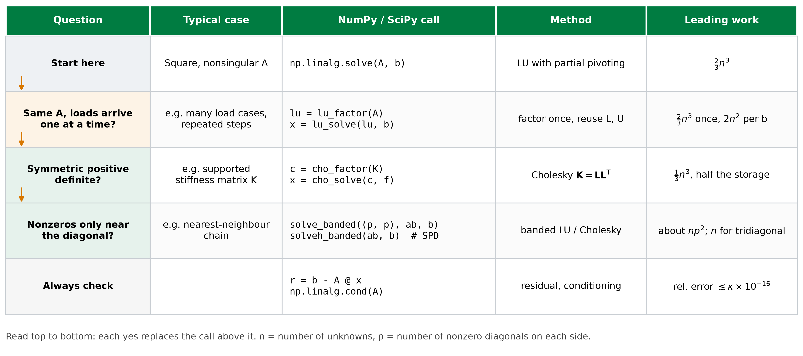

::: {.callout-note}
## Central question

How is a linear system $\mathbf{A}\mathbf{x}=\mathbf{b}$ actually solved inside NumPy, and how do we choose the right solver call for a given matrix?
:::

## Learning outcomes

By the end of this lecture, you should be able to:

1. **Solve** a small system by Gaussian elimination and back substitution, and explain what each stage produces.
2. **Explain** why a solver interchanges rows during elimination, using a matrix with a small pivot.
3. **Estimate** the accuracy that double-precision arithmetic allows, using machine precision and the condition number.
4. **Describe** how LU factorization records elimination so that it can be reused.
5. **Choose** between `solve`, LU, Cholesky, and banded solvers from the structure of a matrix.

## From `solve` to the algorithm behind it

In L12, we found that computing $\mathbf{A}^{-1}\mathbf{b}$ is rarely the best way to obtain $\mathbf{x}$. A call to `np.linalg.solve(A, b)` returns the same displacements with less work, and a banded solver such as `solve_banded` can be faster still when the matrix has a narrow band of nonzero entries. None of these routines finds $\mathbf{x}$ by dividing by a matrix. Each one rewrites the system of equations into another system that has the same solution but is much easier to solve.

Numerical methods for linear systems fall into two families, which are designed for somewhat different situations.

- **Direct methods** transform the equations by a fixed sequence of arithmetic operations and reach the solution after a finite number of steps that can be counted in advance. Gaussian elimination is the classic example. In exact arithmetic, a direct method returns the exact solution. In floating-point arithmetic, every operation is rounded, so the order and choice of operations affect the accuracy.
- **Iterative methods** start from a guess and repeatedly improve it, much like the fixed-point and Newton iterations from L06. They are designed for very large **sparse** matrices, in which most entries are zero, and they raise questions about convergence and about when to stop.

The solvers we call in this course are direct methods, so they are the focus of this lecture. Iterative methods appear briefly at the end.

## Gaussian elimination: how it works

At each step of Gaussian elimination, we add a multiple of one equation to another. For example, $R_2\leftarrow R_2+\tfrac12R_1$ adds half of row 1 to row 2. Adding a multiple of a true equation to another true equation produces a true equation, and the operation can be undone by subtracting the same multiple. The rows change, but their common solution does not.

We apply these operations until every coefficient below the main diagonal is zero. The original system $\mathbf{A}\mathbf{x}=\mathbf{b}$ has then become

$$
\mathbf{U}\mathbf{x}=\mathbf{c},
$$

where $\mathbf{U}$ is an **upper-triangular matrix** and $\mathbf{c}$ is the correspondingly modified right-hand side. From there, we use **back substitution**: solve the last row for $x_n$, substitute it into the row above to find $x_{n-1}$, and continue upward to $x_1$.

@fig-elimination-steps shows how the work is organized for a $5\times5$ matrix. The diagonal entry used to clear a column is called the **pivot**, and its row is the **pivot row**. The first pivot row creates zeros below $a_{11}$, and every remaining entry in the rows below it changes, so the orange block of $4\times4=16$ entries is updated. The next pivot, $u_{22}$, clears column 2 and updates a $3\times3$ block, and so on until only $\mathbf{U}$ remains.

{#fig-elimination-steps fig-alt="Five gridded matrices. The first is all grey. In each later panel, one more row is green, the entries below earlier pivots are white, and a shrinking square block in the lower right is orange: 16, 9, 4, and then 1 entry. The final panel is upper triangular." width=100%}

The shrinking blocks give the cost of elimination. Clearing column $k$ updates a block of $(n-k)^2$ entries, which requires roughly one multiplication and one subtraction per entry. Summing over the column steps gives

$$
2\left[(n-1)^2+(n-2)^2+\cdots+1^2\right]\approx\frac{2}{3}n^3
$$

floating-point operations. Back substitution touches each entry of $\mathbf{U}$ about once, which costs about $n^2$ operations. This is the origin of the cubic scaling measured in the L12 dense benchmark: nearly all the effort goes into eliminating, and very little into substituting.

### Three direct methods and their target forms

Gaussian elimination stops at an **upper-triangular matrix** $\mathbf{U}$, in which every entry below the main diagonal is zero. Its mirror image, a **lower-triangular matrix** $\mathbf{L}$, has every entry above the diagonal equal to zero, and appears in LU factorization later in this lecture. (Gauss–Jordan elimination, an option in the notebook below, continues all the way to the identity matrix, at higher cost.)

### Why triangular systems are easy to solve

Why would a solver work so hard to reach a triangular matrix? Consider a lower-triangular system $\mathbf{L}\mathbf{x}=\mathbf{c}$ with three unknowns, written out in full:

$$
\begin{aligned}
L_{11}x_1 &= c_1,\\
L_{21}x_1+L_{22}x_2 &= c_2,\\
L_{31}x_1+L_{32}x_2+L_{33}x_3 &= c_3.
\end{aligned}
$$

The first equation involves only $x_1$. Once $x_1$ is known, the second equation has only one remaining unknown, $x_2$, and the third then has only $x_3$. Working from the top equation downward, each step is a single division:

$$
x_1=\frac{c_1}{L_{11}},\qquad
x_2=\frac{c_2-L_{21}x_1}{L_{22}},\qquad
x_3=\frac{c_3-L_{31}x_1-L_{32}x_2}{L_{33}}.
$$

This procedure is called **forward substitution**. For row $i$ of an $n\times n$ system, it subtracts the contributions of the unknowns already found and divides by the diagonal entry:

$$
x_i=\frac{1}{L_{ii}}\left(c_i-\sum_{j=1}^{i-1}L_{ij}x_j\right),\qquad i=1,2,\ldots,n.
$$

Back substitution, which we used after Gaussian elimination, is the mirror image. It starts from the last row of $\mathbf{U}$ and works upward:

$$
x_i=\frac{1}{U_{ii}}\left(c_i-\sum_{j=i+1}^{n}U_{ij}x_j\right),\qquad i=n,n-1,\ldots,1.
$$

Both substitutions need about $n^2$ operations and no further elimination. They also require every diagonal entry to be nonzero, which will matter in the next section.

### In-class example: a $3\times3$ system by Gaussian elimination

Solve the following system by hand before reading the solution:

$$
\begin{aligned}
4x_1-2x_2+x_3&=11,\\
-2x_1+4x_2-2x_3&=-16,\\
x_1-2x_2+4x_3&=17.
\end{aligned}
$$

Like a stiffness matrix, the coefficient matrix is symmetric with large diagonal entries, and its numbers keep the hand arithmetic short. The augmented matrix is

$$
\left[\begin{array}{ccc|c}
4&-2&1&11\\
-2&4&-2&-16\\
1&-2&4&17
\end{array}\right].
$$

**Column 1.** The pivot is $a_{11}=4$. To eliminate $-2$ in row 2, the multiplier is $-2/4=-0.5$, so we perform $R_2\leftarrow R_2-(-0.5)R_1$. To eliminate $1$ in row 3, the multiplier is $1/4=0.25$, so $R_3\leftarrow R_3-0.25R_1$:

$$
\left[\begin{array}{ccc|c}
4&-2&1&11\\
0&3&-1.5&-10.5\\
0&-1.5&3.75&14.25
\end{array}\right].
$$

**Column 2.** The new pivot is $3$. The multiplier for row 3 is $-1.5/3=-0.5$, and $R_3\leftarrow R_3-(-0.5)R_2$ gives

$$
\left[\begin{array}{ccc|c}
4&-2&1&11\\
0&3&-1.5&-10.5\\
0&0&3&9
\end{array}\right].
$$

**Back substitution.** Working upward from the last row,

$$
\begin{aligned}
x_3&=\frac{9}{3}=3,\\
x_2&=\frac{-10.5-(-1.5)(3)}{3}=-2,\\
x_1&=\frac{11-(-2)(-2)-(1)(3)}{4}=1.
\end{aligned}
$$

Substituting $\mathbf{x}=(1,-2,3)^{\mathsf T}$ into the three original equations gives $11$, $-16$, and $17$, so the residual is zero.

## Pivoting: why naive elimination is not enough

The elimination above always used the diagonal entry of the current row as the pivot. This naive version divides by whatever number happens to sit there. If a pivot is zero, the method stops immediately, even when the system has a perfectly good solution. The system

$$
\begin{aligned}
0x_1+x_2&=1,\\
x_1+x_2&=2
\end{aligned}
$$

has the solution $(1,1)$, yet its first pivot is $a_{11}=0$. Writing the two equations in the opposite order removes the difficulty. Interchanging rows is a legitimate row operation, because the order in which we list equations does not change their solution.

A small nonzero pivot causes a subtler problem. Replace the zero with $\varepsilon$:

$$
\begin{bmatrix}\varepsilon&1\\1&1\end{bmatrix}
\begin{bmatrix}x_1\\x_2\end{bmatrix}
=\begin{bmatrix}1\\2\end{bmatrix}.
$$

For small $\varepsilon$, the exact solution is very close to $(1,1)$, and the condition number stays near $2.6$, so the problem is well-conditioned. Eliminate without interchanging rows. The multiplier is $1/\varepsilon$, and the second row becomes

$$
\left(1-\frac{1}{\varepsilon}\right)x_2=2-\frac{1}{\varepsilon}.
$$

Take $\varepsilon=10^{-20}$. Both $1-10^{20}$ and $2-10^{20}$ are stored as $-10^{20}$, for a reason we examine in the next section. We obtain $x_2=1$, which is accurate. Back substitution then gives

$$
x_1=\frac{1-x_2}{\varepsilon}=\frac{1-1}{10^{-20}}=0,
$$

which is completely wrong. The huge multiplier swamped the information in the second equation, and dividing by the tiny pivot turned a small rounding error in $x_2$ into a large error in $x_1$.

Now interchange the rows first, so that the pivot is 1:

$$
\begin{bmatrix}1&1\\\varepsilon&1\end{bmatrix}
\begin{bmatrix}x_1\\x_2\end{bmatrix}
=\begin{bmatrix}2\\1\end{bmatrix}.
$$

The multiplier is now $\varepsilon$. The second row becomes $(1-\varepsilon)x_2=1-2\varepsilon$, so $x_2\approx1$, and back substitution gives $x_1=2-x_2\approx1$. Both values are accurate to round-off.

This strategy is called **partial pivoting**. Before eliminating column $k$, the solver searches that column from row $k$ downward, finds the entry of largest magnitude, and swaps its row into the pivot position. Every multiplier then satisfies $|\ell_{ij}|\le1$, so no row is ever multiplied by a huge factor and added to another. The row interchanges are recorded so that the right-hand side can be reordered in the same way. Because the matrix is well-conditioned, the failure without pivoting comes from the order of the arithmetic, not from the problem.

### Direct-solver explorer: elimination, Gauss–Jordan, LU, and pivoting

The notebook animates each row operation of Gaussian elimination, Gauss–Jordan elimination, or LU factorization for a system of order 2 to 6. Compare the three methods on the default random system. Then turn partial pivoting off, set $a_{11}$ to $10^{-4}$, $10^{-8}$, and $10^{-16}$ in turn, and compare the final $\mathbf{x}$ with the exact solution. Very large entries saturate the colour scale, which makes growth caused by a small pivot easy to spot. Note the value at which the answer breaks down, because the next section explains it.

::: {.quarto-wasm-local notebook="l13_direct_solvers.py" title="Step-by-step Gaussian elimination, Gauss–Jordan elimination, and LU factorization with optional partial pivoting" height="900" loading="lazy" fullscreen="true"}
Gaussian elimination reaches $[\mathbf{U}\,|\,\mathbf{c}]$ and back-substitutes, Gauss–Jordan elimination reaches $[\mathbf{I}\,|\,\mathbf{x}]$, and LU factorization stores each multiplier in $\mathbf{L}$ before solving $\mathbf{L}\mathbf{y}=\mathbf{P}\mathbf{b}$ and $\mathbf{U}\mathbf{x}=\mathbf{y}$. A very small $a_{11}$ without pivoting produces large multipliers, and the computed solution departs from the exact one, completely so once $a_{11}$ is about $10^{-16}$ of the other entries. With partial pivoting, the solution remains accurate.
:::

## Round-off in double precision: the $10^{-16}$ rule of thumb

Why did $1-10^{20}$ lose the 1? In L03, we saw that a 64-bit floating-point number stores 53 significant binary digits, roughly 16 decimal digits. The gap between 1 and the next larger stored number is the **machine precision**,

$$
\epsilon_{\mathrm{mach}}=2^{-52}\approx2.2\times10^{-16}.
$$

When two numbers are added, the result is rounded to the nearest stored value, and any part of the smaller number lying more than about 16 digits below the larger one is lost. In Python, `1.0 + 1e-17 == 1.0` returns `True`, and so does `1e20 - 1.0 == 1e20`. This gives a practical rule of thumb for `float64`:

$$
\boxed{\text{A contribution smaller than about }10^{-16}\text{ times the largest term in a sum is lost.}}
$$

Round-off enters a matrix solve in two ways that this rule helps us predict.

**Through the algorithm.** Without pivoting, the second row of the $\varepsilon$ system computes $1-1/\varepsilon$. The 1 carries the information from the original equation, and relative to $1/\varepsilon$ it has size $\varepsilon$. For $\varepsilon=10^{-10}$, the 1 survives with only about six of its digits intact, so $x_1$ comes out with a relative error of about $10^{-16}/10^{-10}=10^{-6}$. Once $\varepsilon$ falls to about $10^{-16}$, the 1 disappears entirely and $x_1$ has no correct digits. In general, the error without pivoting grows as $\epsilon_{\mathrm{mach}}/\varepsilon$, while partial pivoting keeps it at machine precision.

**Through the problem.** Pivoting removes the algorithmic error, but it cannot recover information that the problem itself amplifies. The L12 bound says that a relative change in the data can be magnified by up to the condition number $\kappa$ in the solution. Storing $\mathbf{A}$ and $\mathbf{b}$ already introduces relative changes of about $10^{-16}$, and each arithmetic step adds more of the same size. A good solver therefore delivers

$$
\frac{\|\mathbf{x}_{\mathrm{computed}}-\mathbf{x}\|}{\|\mathbf{x}\|}\lesssim\kappa(\mathbf{A})\times10^{-16}.
$$

Equivalently, we lose about $\log_{10}\kappa$ of our 16 significant digits. The weakly anchored spring pair in L12, with $\kappa\approx2\times10^4$, loses about four digits and still gives about twelve correct ones. A matrix with $\kappa\approx10^{12}$ leaves about four. Once $\kappa$ reaches about $10^{16}$, nothing is left, and the matrix is **numerically singular** even if its exact determinant is nonzero. @fig-conditioning-error tests this rule with `np.linalg.solve` on random $6\times6$ matrices whose condition numbers range from 3 to $3\times10^{18}$.

{#fig-conditioning-error fig-alt="Log-log scatter of relative error against condition number from 1 to 10 to the 19. The points rise in a band just below a dotted line through 10 to the minus 16 at kappa equal to 1, reaching errors near 1 at kappa near 10 to the 16 and scattering around 1 beyond it, in a shaded region labelled no correct digits left." width=80%}

Both routes lead to the same practical check. A pivot or a condition number that differs by a factor of about $10^{16}$ from the other scales in the problem means that double precision can no longer represent the answer. Before trusting a solution, compute `np.linalg.cond(A)` and the residual, and compare $\kappa\times10^{-16}$ with the accuracy the engineering question requires.

## LU factorization: elimination recorded for reuse

In the $3\times3$ example, the multipliers $-0.5$, $0.25$, and $-0.5$ were used once and then discarded. Suppose the spring stiffnesses stay the same but we want the displacements under a second load, or under a hundred different loads. Repeating the elimination would recompute exactly the same multipliers each time, because they depend only on $\mathbf{A}$ and never on $\mathbf{b}$.

LU factorization stores them. Place each multiplier $\ell_{ij}$ in row $i$, column $j$ of a unit lower-triangular matrix, and keep the triangular result of elimination as $\mathbf{U}$. For our example,

$$
\mathbf{L}=\begin{bmatrix}1&0&0\\-0.5&1&0\\0.25&-0.5&1\end{bmatrix},
\qquad
\mathbf{U}=\begin{bmatrix}4&-2&1\\0&3&-1.5\\0&0&3\end{bmatrix}.
$$

Multiplying them recovers the original matrix. The second row of $\mathbf{L}\mathbf{U}$, for example, is $-0.5(4,-2,1)+1(0,3,-1.5)=(-2,4,-2)$, which is the second row of $\mathbf{A}$. With $\mathbf{A}=\mathbf{L}\mathbf{U}$, the system splits into two triangular solves through the intermediate vector $\mathbf{y}=\mathbf{U}\mathbf{x}$:

$$
\mathbf{L}\mathbf{y}=\mathbf{b}\quad\text{(forward substitution)},\qquad
\mathbf{U}\mathbf{x}=\mathbf{y}\quad\text{(back substitution)}.
$$

For $\mathbf{b}=(11,-16,17)^{\mathsf T}$, forward substitution gives $y_1=11$, $y_2=-16-(-0.5)(11)=-10.5$, and $y_3=17-0.25(11)-(-0.5)(-10.5)=9$. This is exactly the modified right-hand side $\mathbf{c}$ from elimination, and back substitution returns $(1,-2,3)^{\mathsf T}$ as before. LU factorization performs the same arithmetic as Gaussian elimination, reorganized so that the part depending only on $\mathbf{A}$ is done once. With partial pivoting, the row interchanges are recorded in a **permutation matrix** $\mathbf{P}$, a rearranged identity matrix, and the factorization becomes $\mathbf{P}\mathbf{A}=\mathbf{L}\mathbf{U}$, with $\mathbf{L}\mathbf{y}=\mathbf{P}\mathbf{b}$.

This is the algorithm behind `np.linalg.solve`: it computes $\mathbf{P}\mathbf{A}=\mathbf{L}\mathbf{U}$ and then performs the two triangular solves. @fig-lu-reuse shows why keeping the factors pays off for several load cases on a dense system with $n=1000$ unknowns. Factoring once costs $\tfrac23n^3$, then about $2n^2$ per load, so a thousand loads cost only about four times as much as one. Forming $\mathbf{A}^{-1}$ also allows reuse, but the inverse itself costs about $2n^3$, three times the factorization.

{#fig-lu-reuse fig-alt="Log-log plot of floating-point operations against number of right-hand sides from 1 to 1000. Repeated elimination rises linearly from about 7 times 10 to the 8 to 7 times 10 to the 11. Forming the inverse starts at 2 times 10 to the 9 and rises slowly. Factor-once starts at about 7 times 10 to the 8 and stays lowest throughout." width=80%}

## Choosing a solver in practice

We rarely write elimination ourselves. The practical skill is recognizing which library call matches the matrix. Every factorization above costs a multiple of $n^3$ for a dense matrix, and each step below either reduces that multiple or removes the cubic term altogether. Work through the questions in order.

1. **Start with `np.linalg.solve(A, b)`.** It performs LU with partial pivoting and is the right default for a square, nonsingular matrix. If all the load cases are known at once, pass them as the columns of a two-dimensional `b`, and the factorization is computed only once.
2. **If the same matrix meets new right-hand sides one at a time, keep the LU factors.** This happens when each load depends on a previous result, as in time stepping or in the nonlinear iterations of L14. Call `lu_factor` once and `lu_solve` for each new vector.
3. **If the matrix is symmetric positive definite, use Cholesky.** A symmetric matrix $\mathbf{K}$ is **positive definite** when $\mathbf{u}^{\mathsf T}\mathbf{K}\mathbf{u}>0$ for every nonzero $\mathbf{u}$. For a spring network, $\tfrac12\mathbf{u}^{\mathsf T}\mathbf{K}\mathbf{u}$ is the elastic energy stored by the displacements $\mathbf{u}$. A network with enough supports stores positive energy under any displacement, so its stiffness matrix is positive definite. The L12 chain without its anchor spring is not, because a rigid translation stores no energy. For a positive-definite matrix, the **Cholesky factorization** $\mathbf{K}=\mathbf{L}\mathbf{L}^{\mathsf T}$ uses the symmetry to compute a single triangular factor. It needs about $\tfrac13n^3$ operations, half those of LU, stores half as many entries, and needs no pivoting.
4. **If the nonzeros lie in a narrow band, use a banded solver.** A matrix with $p$ nonzero diagonals on each side of the main diagonal needs only about $np^2$ operations with `solve_banded`, or with `solveh_banded` when it is also symmetric positive definite. For the tridiagonal chain of L12, $p=1$, and the cost falls from cubic to linear in $n$.

@fig-solver-cheat-sheet collects these steps with the corresponding calls and their leading cost.

{#fig-solver-cheat-sheet fig-alt="A table with five rows. Start here: np.linalg.solve, LU with partial pivoting, two-thirds n cubed. Same A with loads arriving one at a time: lu_factor and lu_solve, two-thirds n cubed once and 2 n squared per right-hand side. Symmetric positive definite, such as a supported stiffness matrix: cho_factor and cho_solve, Cholesky, one-third n cubed and half the storage. Nonzeros only near the diagonal, such as a nearest-neighbour chain: solve_banded or solveh_banded, about n p squared and n for tridiagonal. Always check: residual and np.linalg.cond, relative error at most about kappa times 10 to the minus 16." width=100%}

For the spring chain, the four options look like this. Each returns the same displacements, and the choice changes the work and memory:

```python
import numpy as np
from scipy.linalg import lu_factor, lu_solve, cho_factor, cho_solve

u = np.linalg.solve(K, f)             # default: LU with partial pivoting

lu = lu_factor(K)                     # reuse: factor once ...
u = lu_solve(lu, f)                   # ... then about 2 n^2 per load

c = cho_factor(K)                     # symmetric positive definite: Cholesky
u = cho_solve(c, f)
# banded: solve_banded with the band array from L12, about n work for a chain
```

The final row of the cheat sheet applies to whichever call we choose. Compute the residual $\mathbf{r}=\mathbf{b}-\mathbf{A}\mathbf{x}$ and the condition number, and use $\kappa\times10^{-16}$ to judge how many digits of the answer can be trusted.

## Nice to know: iterative solvers for very large sparse systems

When atoms are connected in two or three dimensions, elimination fills in many entries that were zero in the original sparse matrix, and for models with millions of unknowns the factors may no longer fit in memory. **Iterative solvers** avoid this. They start from a guess and improve it using only products of the original matrix with vectors, stopping when the residual is small enough. The simplest is the **Jacobi method**, which updates each unknown from its own equation. Faster methods, such as **conjugate gradients** for symmetric positive-definite matrices and **GMRES** for general matrices, are in [`scipy.sparse.linalg`](https://docs.scipy.org/doc/scipy/reference/sparse.linalg.html).

The optional notebook below runs Gaussian elimination and a relaxed Jacobi iteration side by side on the same banded system, so you can compare a finite sequence of eliminations with a residual that shrinks sweep by sweep.

::: {.quarto-wasm-local notebook="l13_direct_vs_iterative.py" title="Gaussian elimination beside relaxed Jacobi for a banded system" height="880" loading="lazy" fullscreen="true"}
Gaussian elimination needs one row operation for each nonzero entry below the diagonal, 12 for $n=6$ and 66 for $n=24$, before back substitution. Relaxed Jacobi with $\omega=0.8$ reaches a relative residual of $10^{-4}$ in 23 sweeps for $n=6$ and 66 sweeps for $n=24$, while the generated $n=10$ matrix needs more than 100 sweeps. The sweep count depends on the particular matrix, whereas the direct operation count depends only on the size and band structure.
:::

## Take-home message

- Gaussian elimination reshapes $\mathbf{A}\mathbf{x}=\mathbf{b}$ into $\mathbf{U}\mathbf{x}=\mathbf{c}$ in about $\tfrac23n^3$ operations, and back substitution then solves it in about $n^2$.
- Naive elimination fails on zero or small pivots. Partial pivoting swaps the largest available entry into each pivot position and keeps every multiplier at most 1 in magnitude.
- In `float64`, contributions below about $10^{-16}$ of the largest term are lost. A pivot that small without pivoting, or a condition number of about $10^{16}$, leaves no correct digits. In general, expect a relative error of about $\kappa\times10^{-16}$.
- LU factorization records elimination as $\mathbf{P}\mathbf{A}=\mathbf{L}\mathbf{U}$. In practice, start with `np.linalg.solve`, keep LU factors for repeated solves, use Cholesky for symmetric positive-definite matrices, and use a banded solver when the nonzeros lie near the diagonal.

## Check your understanding

1. Carry out Gaussian elimination and back substitution for the spring chain of L12 with three moving atoms, then write the resulting multipliers as the $\mathbf{L}$ factor. Which calculations would you reuse if the load moved from atom 3 to atom 2?
2. For $\varepsilon=10^{-20}$, explain why elimination without pivoting gives an accurate $x_2$ but an inaccurate $x_1$. Roughly how many correct digits would $x_1$ have for $\varepsilon=10^{-8}$?
3. A stiffness matrix has $\kappa\approx10^{9}$. How many significant digits of the displacements can you expect from `np.linalg.solve`? Would switching to Cholesky improve this?
4. Use the cheat sheet to choose a solver for each case: (a) a $2000\times2000$ dense nonsymmetric matrix with one right-hand side; (b) the stiffness matrix of a supported spring network, solved for 500 load cases that arrive one after another; (c) a nearest-neighbour chain of a million atoms.
5. Why is the stiffness matrix of an unanchored spring chain not positive definite? What happens when you pass it to `cho_factor`, and how does that connect to the singular matrices of L12?

## Next

The spring chain gave us linear equations because the harmonic approximation turned each bond into a Hookean spring. For larger displacements, or for the copper cluster relaxation shown in L11, the forces depend nonlinearly on the atomic positions. L14 returns to that problem. Newton-type methods for a system of nonlinear equations replace the single derivative of L06 with a matrix of partial derivatives, and each step requires solving a linear system with that matrix. The solvers from this lecture become the inner step of a structure relaxation.
