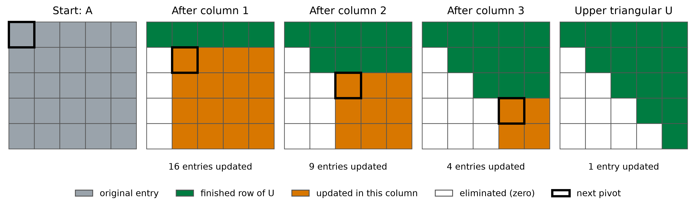
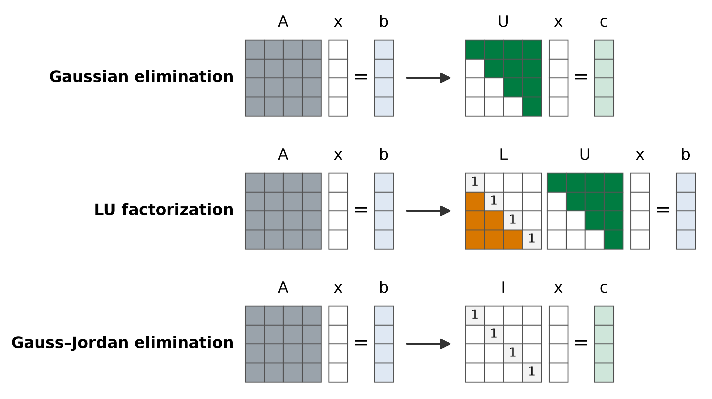
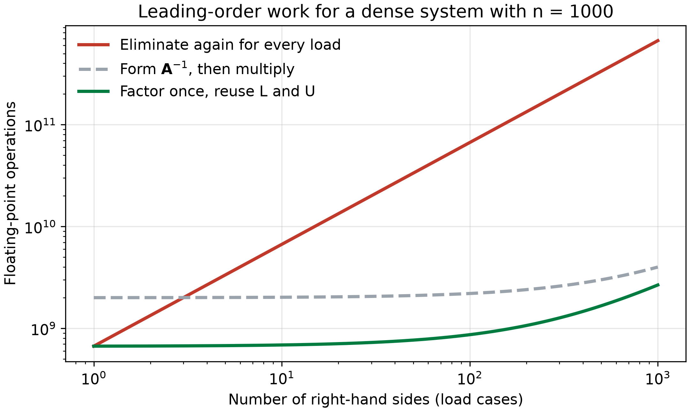
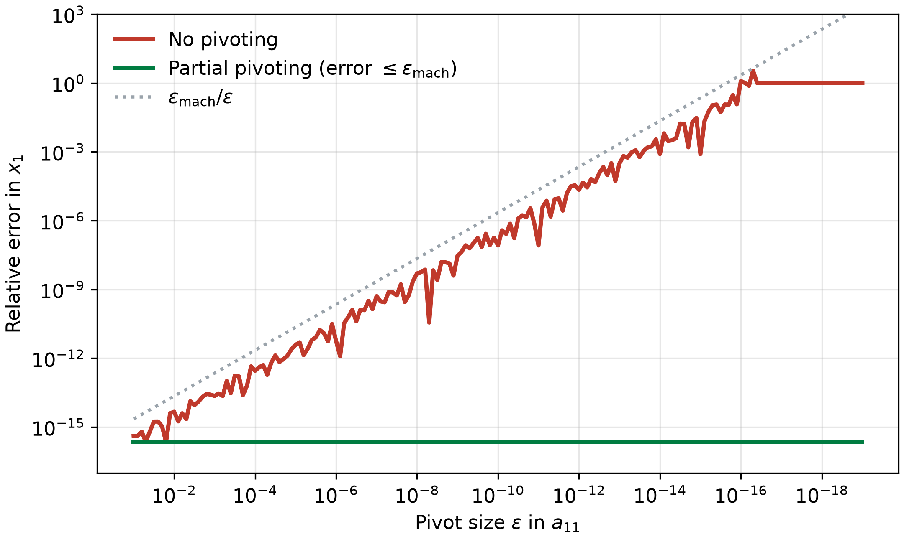
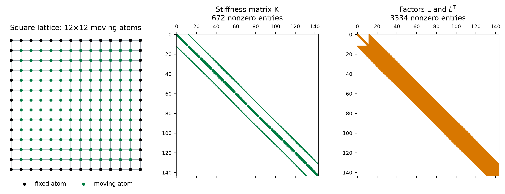

::: {.callout-note}
## Central question

How is a linear system $\mathbf{A}\mathbf{x}=\mathbf{b}$ actually solved inside NumPy, and when would a different kind of solver be the better choice?
:::

## Learning outcomes

By the end of this lecture, you should be able to:

1. **Solve** a small system by Gaussian elimination, forward substitution, and back substitution, and explain what each stage produces.
2. **Construct** the LU factorization of a small matrix from its elimination multipliers and reuse it for several right-hand sides.
3. **Explain** why a solver interchanges rows during elimination, using a matrix with a small pivot.
4. **Carry out** Jacobi iterations and interpret how their residual decreases.
5. **Compare** direct and iterative solvers in terms of work, storage, accuracy, and convergence.

## From `solve` to the algorithm behind it

In L12, we found that computing $\mathbf{A}^{-1}\mathbf{b}$ is rarely the best way to obtain $\mathbf{x}$. A call to `np.linalg.solve(A, b)` returns the same displacements with less work, and a banded solver such as `solve_banded` can be faster still when the matrix has a narrow band of nonzero entries. None of these routines finds $\mathbf{x}$ by dividing by a matrix. Each one rewrites the system of equations into another system that has the same solution but is much easier to solve.

Numerical methods for linear systems fall into two families, which are designed for somewhat different situations.

- **Direct methods** transform the equations by a fixed sequence of arithmetic operations and reach the solution after a finite number of steps that can be counted in advance. Gaussian elimination, which we used in L12 for the spring chain, is the classic example. In exact arithmetic, a direct method returns the exact solution. In floating-point arithmetic, every operation is rounded, so the order and choice of operations affect the accuracy.
- **Iterative methods** start from a guess $\mathbf{x}^{(0)}$ and repeatedly improve it, much like the fixed-point and Newton iterations from L06. Each step typically needs only a product of the matrix with a vector, so these methods are attractive for very large, **sparse** matrices in which most entries are zero. Like any iteration, they raise questions about convergence and about when to stop.

We start with the direct family, because it explains what `np.linalg.solve` does.

## Revisiting Gaussian elimination

At each step of Gaussian elimination, we add a multiple of one equation to another. For example, in the spring chain of L12 we used $R_2\leftarrow R_2+\tfrac12R_1$. Adding a multiple of a true equation to another true equation produces a true equation, and the operation can be undone by subtracting the same multiple. The rows change, but their common solution does not.

We apply these operations until every coefficient below the main diagonal is zero. The original system $\mathbf{A}\mathbf{x}=\mathbf{b}$ has then become

$$
\mathbf{U}\mathbf{x}=\mathbf{c},
$$

where $\mathbf{U}$ is an **upper-triangular matrix** and $\mathbf{c}$ is the correspondingly modified right-hand side. From there, we use **back substitution**: solve the last row for $x_n$, substitute it into the row above to find $x_{n-1}$, and continue upward to $x_1$.

@fig-elimination-steps shows how the work is organized for a $5\times5$ matrix. The first row is used as the **pivot row** to create zeros below $a_{11}$. Every remaining entry in the rows below it changes, so the orange block of $4\times4=16$ entries is updated. The next pivot, $u_{22}$, clears column 2 and updates a $3\times3$ block, and so on until only $\mathbf{U}$ remains.

{#fig-elimination-steps fig-alt="Five gridded matrices. The first is all grey. In each later panel, one more row is green, the entries below earlier pivots are white, and a shrinking square block in the lower right is orange: 16, 9, 4, and then 1 entry. The final panel is upper triangular." width=100%}

The shrinking blocks give the cost of elimination. Clearing column $k$ updates a block of $(n-k)^2$ entries, which requires roughly one multiplication and one subtraction per entry. Summing over the column steps gives

$$
2\left[(n-1)^2+(n-2)^2+\cdots+1^2\right]\approx\frac{2}{3}n^3
$$

floating-point operations. Back substitution touches each entry of $\mathbf{U}$ about once, which costs about $n^2$ operations. This is the origin of the cubic scaling measured in the L12 dense benchmark: nearly all the effort goes into eliminating, and very little into substituting.

## Three direct methods and their target forms

Gaussian elimination is one way to reshape $\mathbf{A}\mathbf{x}=\mathbf{b}$. Two other popular direct methods stop at different target forms:

| Method | Initial form | Final form |
|---|---|---|
| Gaussian elimination | $\mathbf{A}\mathbf{x}=\mathbf{b}$ | $\mathbf{U}\mathbf{x}=\mathbf{c}$ |
| LU factorization | $\mathbf{A}\mathbf{x}=\mathbf{b}$ | $\mathbf{L}\mathbf{U}\mathbf{x}=\mathbf{b}$ |
| Gauss–Jordan elimination | $\mathbf{A}\mathbf{x}=\mathbf{b}$ | $\mathbf{I}\mathbf{x}=\mathbf{c}$ |

: Three popular direct methods, following Kiusalaas, *Numerical Methods in Engineering with Python 3*, Table 2.1. {#tbl-direct-methods}

The matrices in the final forms have the following shapes:

- **Upper-triangular matrix $\mathbf{U}$:** every entry below the main diagonal is zero, $u_{ij}=0$ for $i>j$.
- **Lower-triangular matrix $\mathbf{L}$:** every entry above the main diagonal is zero, $\ell_{ij}=0$ for $i<j$. In the LU factorization used here, its diagonal entries are all 1.
- **Identity matrix $\mathbf{I}$:** ones on the diagonal and zeros elsewhere, so $\mathbf{I}\mathbf{x}=\mathbf{x}$.

@fig-direct-forms compares these target forms. Each method trades a different amount of elimination work against the effort left for the final solve.

{#fig-direct-forms fig-alt="Three rows of matrix diagrams. A full grey matrix A with vectors x and b is transformed into an upper-triangular U with vector c for Gaussian elimination, into a unit lower-triangular L times upper-triangular U for LU factorization, and into the identity matrix with vector c for Gauss–Jordan elimination." width=90%}

### Why triangular systems are easy to solve

Why would a solver work so hard to reach a triangular matrix? Consider a lower-triangular system $\mathbf{L}\mathbf{x}=\mathbf{c}$ with three unknowns, written out in full:

$$
\begin{aligned}
L_{11}x_1 &= c_1,\\
L_{21}x_1+L_{22}x_2 &= c_2,\\
L_{31}x_1+L_{32}x_2+L_{33}x_3 &= c_3.
\end{aligned}
$$

The first equation involves only $x_1$. Once $x_1$ is known, the second equation has only one remaining unknown, $x_2$, and the third then has only $x_3$. Working from the top equation downward, each step is a single division:

$$
x_1=\frac{c_1}{L_{11}},\qquad
x_2=\frac{c_2-L_{21}x_1}{L_{22}},\qquad
x_3=\frac{c_3-L_{31}x_1-L_{32}x_2}{L_{33}}.
$$

This procedure is called **forward substitution**. For row $i$ of an $n\times n$ system, it subtracts the contributions of the unknowns already found and divides by the diagonal entry:

$$
x_i=\frac{1}{L_{ii}}\left(c_i-\sum_{j=1}^{i-1}L_{ij}x_j\right),\qquad i=1,2,\ldots,n.
$$

Back substitution, which we used after Gaussian elimination, is the mirror image. It starts from the last row of $\mathbf{U}$ and works upward:

$$
x_i=\frac{1}{U_{ii}}\left(c_i-\sum_{j=i+1}^{n}U_{ij}x_j\right),\qquad i=n,n-1,\ldots,1.
$$

Both substitutions need about $n^2$ operations and no further elimination. They also require every diagonal entry to be nonzero, which will matter when we discuss pivoting.

## In-class example: a $3\times3$ system by Gaussian elimination

Solve the following system by hand before reading the solution:

$$
\begin{aligned}
4x_1-2x_2+x_3&=11,\\
-2x_1+4x_2-2x_3&=-16,\\
x_1-2x_2+4x_3&=17.
\end{aligned}
$$

Like a stiffness matrix, the coefficient matrix is symmetric with large diagonal entries, and its numbers keep the hand arithmetic short. The augmented matrix is

$$
\left[\begin{array}{ccc|c}
4&-2&1&11\\
-2&4&-2&-16\\
1&-2&4&17
\end{array}\right].
$$

**Column 1.** The pivot is $a_{11}=4$. To eliminate $-2$ in row 2, the multiplier is $-2/4=-0.5$, so we perform $R_2\leftarrow R_2-(-0.5)R_1$. To eliminate $1$ in row 3, the multiplier is $1/4=0.25$, so $R_3\leftarrow R_3-0.25R_1$:

$$
\left[\begin{array}{ccc|c}
4&-2&1&11\\
0&3&-1.5&-10.5\\
0&-1.5&3.75&14.25
\end{array}\right].
$$

**Column 2.** The new pivot is $3$. The multiplier for row 3 is $-1.5/3=-0.5$, and $R_3\leftarrow R_3-(-0.5)R_2$ gives

$$
\left[\begin{array}{ccc|c}
4&-2&1&11\\
0&3&-1.5&-10.5\\
0&0&3&9
\end{array}\right].
$$

**Back substitution.** Working upward from the last row,

$$
\begin{aligned}
x_3&=\frac{9}{3}=3,\\
x_2&=\frac{-10.5-(-1.5)(3)}{3}=-2,\\
x_1&=\frac{11-(-2)(-2)-(1)(3)}{4}=1.
\end{aligned}
$$

Substituting $\mathbf{x}=(1,-2,3)^{\mathsf T}$ into the three original equations gives $11$, $-16$, and $17$, so the residual is zero.

::: {.callout-tip collapse="true"}
## The same $3\times3$ system by Gauss–Jordan elimination

Gauss–Jordan elimination divides each pivot row by its pivot and clears the entries **above** each pivot as well as below. Starting from the upper-triangular form above, scale the rows to make the pivots equal to 1:

$$
\left[\begin{array}{ccc|c}
1&-0.5&0.25&2.75\\
0&1&-0.5&-3.5\\
0&0&1&3
\end{array}\right].
$$

Then clear column 3 with $R_2\leftarrow R_2+0.5R_3$ and $R_1\leftarrow R_1-0.25R_3$, followed by column 2 with $R_1\leftarrow R_1+0.5R_2$:

$$
\left[\begin{array}{ccc|c}
1&0&0&1\\
0&1&0&-2\\
0&0&1&3
\end{array}\right].
$$

The right-hand column is now the solution, and no back substitution is needed. The extra elimination above the diagonal raises the cost to about $n^3$ operations, compared with $\tfrac23n^3$ for Gaussian elimination, which is why solvers usually stop at the triangular form. Gauss–Jordan elimination is still useful for hand calculations, and applying it to $[\mathbf{A}\,|\,\mathbf{I}]$ is a standard way to compute an inverse.
:::

## LU factorization: recording the elimination

In the last section, the multipliers $-0.5$, $0.25$, and $-0.5$ were used once and then discarded. Suppose the spring stiffnesses stay the same but we want the displacements under a second load, or under a hundred different loads. Repeating the elimination would recompute exactly the same multipliers each time, because they depend only on $\mathbf{A}$ and never on $\mathbf{b}$.

LU factorization stores them. Place each multiplier $\ell_{ij}$ in row $i$, column $j$ of a unit lower-triangular matrix, and keep the triangular result of elimination as $\mathbf{U}$. For our example,

$$
\mathbf{L}=\begin{bmatrix}1&0&0\\-0.5&1&0\\0.25&-0.5&1\end{bmatrix},
\qquad
\mathbf{U}=\begin{bmatrix}4&-2&1\\0&3&-1.5\\0&0&3\end{bmatrix}.
$$

Multiplying them recovers the original matrix. The second row of $\mathbf{L}\mathbf{U}$, for example, is $-0.5(4,-2,1)+1(0,3,-1.5)=(-2,4,-2)$, which is the second row of $\mathbf{A}$. Each row of $\mathbf{A}$ is therefore its row of $\mathbf{U}$ plus the multiples of earlier pivot rows that elimination subtracted.

With $\mathbf{A}=\mathbf{L}\mathbf{U}$, the system $\mathbf{L}\mathbf{U}\mathbf{x}=\mathbf{b}$ splits into two triangular solves. Define the intermediate vector $\mathbf{y}=\mathbf{U}\mathbf{x}$:

$$
\begin{aligned}
\mathbf{L}\mathbf{y}&=\mathbf{b}\qquad\text{(forward substitution)},\\
\mathbf{U}\mathbf{x}&=\mathbf{y}\qquad\text{(back substitution)}.
\end{aligned}
$$

For $\mathbf{b}=(11,-16,17)^{\mathsf T}$, forward substitution gives $y_1=11$, $y_2=-16-(-0.5)(11)=-10.5$, and $y_3=17-0.25(11)-(-0.5)(-10.5)=9$. This $\mathbf{y}$ is exactly the modified right-hand side $\mathbf{c}$ we produced during elimination, and back substitution then returns $(1,-2,3)^{\mathsf T}$ as before. LU factorization performs the same arithmetic as Gaussian elimination, reorganized so that the part depending only on $\mathbf{A}$ is done once.

@fig-lu-reuse compares the work for several load cases on a dense system with $n=1000$ unknowns. Eliminating from scratch for every load multiplies the $\tfrac23n^3$ cost by the number of loads. Factoring once costs $\tfrac23n^3$, then about $2n^2$ per additional load, so a thousand load cases cost only about four times as much as one. Forming $\mathbf{A}^{-1}$ also allows reuse, but the inverse itself costs about $2n^3$, three times the factorization, and it adds the extra rounding discussed in L12.

{#fig-lu-reuse fig-alt="Log-log plot of floating-point operations against number of right-hand sides from 1 to 1000. Repeated elimination rises linearly from about 7 times 10 to the 8 to 7 times 10 to the 11. Forming the inverse starts at 2 times 10 to the 9 and rises slowly. Factor-once starts at about 7 times 10 to the 8 and stays lowest throughout." width=80%}

SciPy exposes the two stages separately. A short listing shows the pattern for a spring chain under several loads:

```python
import numpy as np
from scipy.linalg import lu_factor, lu_solve

lu_piv = lu_factor(K)                  # about (2/3) n^3 work, done once
for f in load_cases:                   # each loop pass: about 2 n^2 work
    u = lu_solve(lu_piv, f)
```

A single call to `np.linalg.solve(K, F)` with a two-dimensional `F`, whose columns are the load cases, performs the same factor-once calculation internally.

## Pivoting: choosing which row to divide by

Elimination divides by each pivot. If a pivot is zero, the method stops immediately, even when the system has a perfectly good solution. The system

$$
\begin{aligned}
0x_1+x_2&=1,\\
x_1+x_2&=2
\end{aligned}
$$

has the solution $(1,1)$, yet its first pivot is $a_{11}=0$. Writing the two equations in the opposite order removes the difficulty. Interchanging rows is a legitimate row operation, because the order in which we list equations does not change their solution.

A small nonzero pivot causes a subtler problem. Replace the zero with $\varepsilon$:

$$
\begin{bmatrix}\varepsilon&1\\1&1\end{bmatrix}
\begin{bmatrix}x_1\\x_2\end{bmatrix}
=\begin{bmatrix}1\\2\end{bmatrix}.
$$

For small $\varepsilon$, the exact solution is very close to $(1,1)$, and the condition number stays near $2.6$, so the problem is well-conditioned. Eliminate without interchanging rows. The multiplier is $1/\varepsilon$, and the second row becomes

$$
\left(1-\frac{1}{\varepsilon}\right)x_2=2-\frac{1}{\varepsilon}.
$$

Take $\varepsilon=10^{-20}$. In double precision, $1-10^{20}$ rounds to $-10^{20}$ and $2-10^{20}$ also rounds to $-10^{20}$, because the 1 and the 2 lie far below the roughly 16 significant digits that the large number can carry. We obtain $x_2=1$, which is accurate. Back substitution then gives

$$
x_1=\frac{1-x_2}{\varepsilon}=\frac{1-1}{10^{-20}}=0,
$$

which is completely wrong. The huge multiplier swamped the information in the second equation, and dividing by the tiny pivot turned a small rounding error in $x_2$ into a large error in $x_1$.

Now interchange the rows first, so that the pivot is 1:

$$
\begin{bmatrix}1&1\\\varepsilon&1\end{bmatrix}
\begin{bmatrix}x_1\\x_2\end{bmatrix}
=\begin{bmatrix}2\\1\end{bmatrix}.
$$

The multiplier is now $\varepsilon$. The second row becomes $(1-\varepsilon)x_2=1-2\varepsilon$, so $x_2\approx1$, and back substitution gives $x_1=2-x_2\approx1$. Both values are accurate to round-off.

This strategy is called **partial pivoting**. Before eliminating column $k$, the solver searches that column from row $k$ downward, finds the entry of largest magnitude, and swaps its row into the pivot position. Every multiplier then satisfies $|\ell_{ij}|\le1$, which keeps the rounding errors introduced during elimination from being amplified by large multipliers. @fig-pivoting-error shows the effect across many pivot sizes. Without pivoting, the relative error in $x_1$ grows in proportion to $\epsilon_{\mathrm{mach}}/\varepsilon$ until the answer carries no correct digits. With pivoting, it remains at machine precision.

{#fig-pivoting-error fig-alt="Log-log plot of relative error against pivot size decreasing from 0.1 to 10 to the minus 19. The no-pivoting curve rises along the machine-epsilon-over-epsilon line from about 10 to the minus 15 to 1 at epsilon near 10 to the minus 16, then stays at 1. The partial-pivoting curve stays at machine precision." width=80%}

This example connects to the note on round-off in L12. The matrix is well-conditioned, so the failure lies in the **algorithm**, not in the problem. Elimination without pivoting is numerically unstable for such matrices, while elimination with partial pivoting is stable in practice. The row interchanges are recorded in a **permutation matrix** $\mathbf{P}$, a rearranged identity matrix, so the factorization computed by the solver is

$$
\mathbf{P}\mathbf{A}=\mathbf{L}\mathbf{U}.
$$

The right-hand side must be reordered in the same way before forward substitution, $\mathbf{L}\mathbf{y}=\mathbf{P}\mathbf{b}$.

This is the algorithm behind `np.linalg.solve`. NumPy passes the matrix to `gesv` from [LAPACK](https://www.netlib.org/lapack/), a long-established Fortran linear-algebra library, which computes $\mathbf{P}\mathbf{A}=\mathbf{L}\mathbf{U}$ with partial pivoting and then performs the two triangular solves. SciPy's `lu_factor` calls the same factorization. For a symmetric positive-definite matrix, such as a stiffness matrix with enough supports, `scipy.linalg.solve(K, f, assume_a="pos")` instead uses a **Cholesky factorization** $\mathbf{K}=\mathbf{L}\mathbf{L}^{\mathsf T}$, which needs no pivoting and about half the work of LU. The [SciPy linear-algebra reference](https://docs.scipy.org/doc/scipy/reference/linalg.html) lists these options.

### Direct-solver explorer: elimination, Gauss–Jordan, LU, and pivoting

The notebook animates each row operation of Gaussian elimination, Gauss–Jordan elimination, or LU factorization for a system of order 2 to 6. Compare the three methods on the default random system. Then set $a_{11}$ to $10^{-8}$ or $10^{-16}$, turn partial pivoting off, and compare the final $\mathbf{x}$ with the exact solution. Very large entries saturate the colour scale, which makes growth caused by a small pivot easy to spot.

::: {.quarto-wasm-local notebook="l13_direct_solvers.py" title="Step-by-step Gaussian elimination, Gauss–Jordan elimination, and LU factorization with optional partial pivoting" height="900" loading="lazy" fullscreen="true"}
Gaussian elimination reaches $[\mathbf{U}\,|\,\mathbf{c}]$ and back-substitutes, Gauss–Jordan elimination reaches $[\mathbf{I}\,|\,\mathbf{x}]$, and LU factorization stores each multiplier in $\mathbf{L}$ before solving $\mathbf{L}\mathbf{y}=\mathbf{P}\mathbf{b}$ and $\mathbf{U}\mathbf{x}=\mathbf{y}$. A very small $a_{11}$ without pivoting produces large multipliers, and the computed solution departs from the exact one. With partial pivoting, the solution remains accurate.
:::

## Iterative methods: the Jacobi update

A direct solver finishes in a predictable number of steps, but it must store and update the entries of its factors. For a very large sparse system, that becomes the limiting cost. An iterative method takes a different route: it guesses the solution and improves the guess using only products of $\mathbf{A}$ with vectors.

The simplest iterative method is the **Jacobi method**. Solve each equation for its own diagonal unknown. For our $3\times3$ example,

$$
\begin{aligned}
x_1&=\frac{11+2x_2-x_3}{4},\\
x_2&=\frac{-16+2x_1+2x_3}{4},\\
x_3&=\frac{17-x_1+2x_2}{4}.
\end{aligned}
$$

These equations rearrange the original system. They become an iteration when we insert the current guess on the right-hand side and call the result the next guess. Starting from $\mathbf{x}^{(0)}=(0,0,0)^{\mathsf T}$, the first sweep gives

$$
\mathbf{x}^{(1)}=\left(\frac{11}{4},\frac{-16}{4},\frac{17}{4}\right)^{\mathsf T}=(2.75,-4,4.25)^{\mathsf T}.
$$

Inserting $\mathbf{x}^{(1)}$ into the right-hand sides gives the second sweep:

$$
\begin{aligned}
x_1^{(2)}&=\frac{11+2(-4)-4.25}{4}=-0.3125,\\
x_2^{(2)}&=\frac{-16+2(2.75)+2(4.25)}{4}=-0.5,\\
x_3^{(2)}&=\frac{17-2.75+2(-4)}{4}=1.5625.
\end{aligned}
$$

The iterates overshoot and swing back around the true solution $(1,-2,3)$. After 10 sweeps they are $(0.66,-1.60,2.66)$, and after 30 sweeps $(0.989,-1.987,2.989)$. For a general $n\times n$ system, the Jacobi update for component $i$ is

$$
x_i^{(k+1)}=\frac{1}{a_{ii}}\left(b_i-\sum_{j\ne i}a_{ij}x_j^{(k)}\right),\qquad i=1,2,\ldots,n.
$$

Every component of the new guess uses only the old guess, so all $n$ updates in one sweep are independent of each other and can be computed at once. Each sweep costs roughly one multiplication and one addition for every nonzero entry of $\mathbf{A}$, and the method never changes or adds entries in the matrix.

### When to stop: the residual

An iterative solver must decide when its guess is good enough. We cannot measure the error $\mathbf{x}^{(k)}-\mathbf{x}$ directly because $\mathbf{x}$ is unknown, but we can always compute the **residual**,

$$
\mathbf{r}^{(k)}=\mathbf{b}-\mathbf{A}\mathbf{x}^{(k)}.
$$

A common stopping criterion requires the relative residual $\|\mathbf{r}^{(k)}\|_2/\|\mathbf{b}\|_2$ to fall below a chosen tolerance, such as $10^{-6}$. The Jacobi update can be written with the residual:

$$
\mathbf{x}^{(k+1)}=\mathbf{x}^{(k)}+\omega\,\mathbf{D}^{-1}\mathbf{r}^{(k)},
$$

where $\mathbf{D}$ is the diagonal part of $\mathbf{A}$, so $\mathbf{D}^{-1}\mathbf{r}^{(k)}$ divides each residual component by its diagonal entry. With $\omega=1$, this is exactly the plain Jacobi update above. The **relaxation factor** $0<\omega<1$ takes a shorter step, which can damp the overshooting we saw in the $3\times3$ example. Recall from L12 that a small residual does not guarantee a small error when the matrix is ill-conditioned.

### Does Jacobi always converge?

It does not. Jacobi converges for any starting guess when $\mathbf{A}$ is **strictly diagonally dominant**, meaning that in every row the diagonal entry is larger in magnitude than the sum of the other entries:

$$
|a_{ii}|>\sum_{j\ne i}|a_{ij}|\qquad\text{for every row } i.
$$

This condition is sufficient but not necessary. Our $3\times3$ matrix satisfies it strictly in rows 1 and 3, with $4>3$, and only with equality in row 2, with $4=2+2$. The iteration still converges, as the calculation above shows. Stiffness matrices of spring networks behave in a similar way: the diagonal entry of an atom equals the sum of its spring constants, so it matches the off-diagonal sum exactly for every atom except those attached to a fixed support.

How quickly Jacobi converges depends on the physics of the problem. @fig-jacobi-chain applies it to the spring chain from L12, with 20 moving atoms, $k=5$ eV/Ų, and a force of 1 eV/Šon the free end. The exact displacements form the straight line $u_i=iF/k$.

{#fig-jacobi-chain fig-alt="Left panel: displacement against atom index, with a dashed straight exact line from 0 to 4 angstroms. After 1 sweep only the last atom has moved; after 10 and 50 sweeps displacements are concentrated near the loaded end; after 200 sweeps the profile is curved and below the line; after 1000 sweeps it is close to the line. Right panel: semilog residual curves. The 3 by 3 example and the 5-atom chain fall below 10 to the minus 12 within about 150 and 550 sweeps; the 20-atom chain reaches about 10 to the minus 4.5 after 3000 sweeps; the 80-atom chain remains near 10 to the minus 1." width=100%}

After one sweep, only the loaded atom has moved, because the update of atom $i$ uses only the old displacements of its neighbours. Each further sweep carries the effect of the load one atom farther. Force balance requires the whole chain to stretch, so the profile creeps toward the straight line. The right panel shows the consequence. The 5-atom chain reaches a residual of $10^{-6}$ within a few hundred sweeps, the 20-atom chain needs more than 3000, and the 80-atom chain has barely improved after 3000. A direct solve of the same tridiagonal chain would finish in a few operations per atom.

Faster iterative methods address exactly this weakness. The **conjugate-gradient method**, for symmetric positive-definite matrices, chooses each update direction using information from all previous steps. **Multigrid methods** correct the long-wavelength part of the error on coarser copies of the lattice, where information crosses the structure in a few steps. Both keep the ingredients of Jacobi: a guess, a residual, and updates built from matrix–vector products. SciPy provides conjugate gradients and related methods in [`scipy.sparse.linalg`](https://docs.scipy.org/doc/scipy/reference/sparse.linalg.html).

## Why iterative methods matter: fill-in

If a banded direct solver handles the chain so well, why use iterative methods at all? The answer appears when the atoms are connected in more than one direction. @fig-fill-in shows a square lattice of $12\times12$ moving atoms, each connected by springs to its four nearest neighbours, with the atoms around the edge held fixed. Numbering the atoms row by row gives a $144\times144$ stiffness matrix with only five nonzero diagonals: the atom itself, its left and right neighbours, and its neighbours in the rows above and below, which lie 12 positions away in the numbering.

{#fig-fill-in fig-alt="Left: a 14 by 14 grid of points with black fixed atoms on the boundary and green moving atoms inside. Centre: a 144 by 144 sparsity plot with five thin diagonals, labelled 672 nonzero entries. Right: the factor sparsity plot, a solid orange band about 12 entries wide on each side of the diagonal, labelled 3334 nonzero entries." width=100%}

Elimination destroys most of this sparsity. When a pivot row is subtracted from a row below it, zeros between the diagonals become nonzero, a process called **fill-in**. The factors in @fig-fill-in contain about five times as many nonzero entries as the stiffness matrix. For an $m\times m$ lattice with $n=m^2$ atoms, the band has half-width about $m=\sqrt{n}$, so a banded factorization stores about $n^{3/2}$ entries and needs about $n^2$ operations, and a three-dimensional lattice is worse again. A Jacobi or conjugate-gradient sweep stores only the original five diagonals and costs about $5n$ operations. For finite-element models with millions of unknowns, this difference in storage often decides the choice of solver. Sparse direct solvers reduce fill-in by renumbering the unknowns and remain competitive for many two-dimensional problems.

### Demo: direct elimination beside Jacobi

The next notebook runs Gaussian elimination and relaxed Jacobi side by side on a banded system with three nonzero diagonals on each side of the main diagonal. Press **Play**, then change the matrix dimension and $\omega$. Compare the number of row operations on the left with the number of sweeps needed on the right to reach a relative residual of $10^{-4}$.

::: {.quarto-wasm-local notebook="l13_direct_vs_iterative.py" title="Gaussian elimination beside relaxed Jacobi for a banded system" height="880" loading="lazy" fullscreen="true"}
Gaussian elimination needs one row operation for each nonzero entry below the diagonal, 12 for $n=6$ and 66 for $n=24$, before back substitution. Relaxed Jacobi with $\omega=0.8$ reaches a relative residual of $10^{-4}$ in 23 sweeps for $n=6$ and 66 sweeps for $n=24$, while the generated $n=10$ matrix needs more than 100 sweeps. The sweep count depends on the particular matrix and on $\omega$, whereas the direct operation count depends only on the size and band structure.
:::

## Choosing between direct and iterative solvers

| | Direct (LU, Cholesky) | Iterative (Jacobi, conjugate gradients) |
|---|---|---|
| Result | Solution after a fixed number of steps, accurate to round-off for a well-conditioned system | Approximate solution, improved until the residual meets a tolerance |
| Dense work | About $\tfrac23n^3$ for LU | About $2n^2$ per sweep, multiplied by the number of sweeps |
| Sparse storage | Grows with fill-in | Only the nonzero entries of $\mathbf{A}$ and a few vectors |
| Several right-hand sides | Factor once, reuse $\mathbf{L}$ and $\mathbf{U}$ cheaply | Iterate again for each right-hand side |
| Main risk | Small pivots without pivoting, and memory for large sparse systems | Slow convergence or divergence, depending on the matrix |

: Direct and iterative solvers compared. {#tbl-direct-iterative}

For dense matrices of moderate size, `np.linalg.solve` is the right default, and `scipy.linalg.solve_banded` exploits a narrow band. For very large sparse systems from two- and three-dimensional models, iterative methods from `scipy.sparse.linalg` are often the only practical option.

## Take-home message

- Direct solvers reshape $\mathbf{A}\mathbf{x}=\mathbf{b}$ into triangular or diagonal systems that can be solved by forward and back substitution. Gaussian elimination costs about $\tfrac23n^3$ operations, and each substitution costs about $n^2$.
- LU factorization records the elimination multipliers in $\mathbf{L}$. Factoring once and reusing $\mathbf{L}$ and $\mathbf{U}$ is the efficient way to handle many load cases with the same stiffness matrix.
- Partial pivoting interchanges rows so that each pivot is the largest available entry in its column. It prevents the growth of rounding errors caused by small pivots. `np.linalg.solve` uses LU factorization with partial pivoting through LAPACK.
- Iterative methods such as Jacobi improve a guess until the residual meets a tolerance. Each sweep costs only about as much as a matrix–vector product and stores no fill-in, but the number of sweeps depends on the matrix and can be very large for a long chain.

## Check your understanding

1. Carry out Gaussian elimination and back substitution for the spring chain of L12 with three moving atoms, then write the resulting multipliers as the $\mathbf{L}$ factor. Which multipliers would you reuse if the load moved from atom 3 to atom 2?
2. For $\varepsilon=10^{-20}$, explain in one or two sentences why elimination without pivoting gives an accurate $x_2$ but an inaccurate $x_1$.
3. Perform two Jacobi sweeps by hand for the system $4x_1-x_2=3$ and $-x_1+4x_2=3$, starting from $(0,0)$. Is the matrix strictly diagonally dominant? Compare your iterates with the exact solution.
4. In @fig-jacobi-chain, why does the 80-atom chain converge so much more slowly than the 5-atom chain, even though every row of its stiffness matrix has the same entries?
5. A finite-element model of a turbine blade has two million unknowns and about 30 nonzero entries per row. Estimate the storage for the matrix itself in double precision. Which family of solver would you try first, and what would you check about its result?

## Next

The spring chain gave us linear equations because the harmonic approximation turned each bond into a Hookean spring. For larger displacements, or for the copper cluster relaxation shown in L11, the forces depend nonlinearly on the atomic positions. L14 returns to that problem. Newton-type methods for a system of nonlinear equations replace the single derivative of L06 with a matrix of partial derivatives, and each step requires solving a linear system with that matrix. The solvers from this lecture become the inner step of a structure relaxation.
