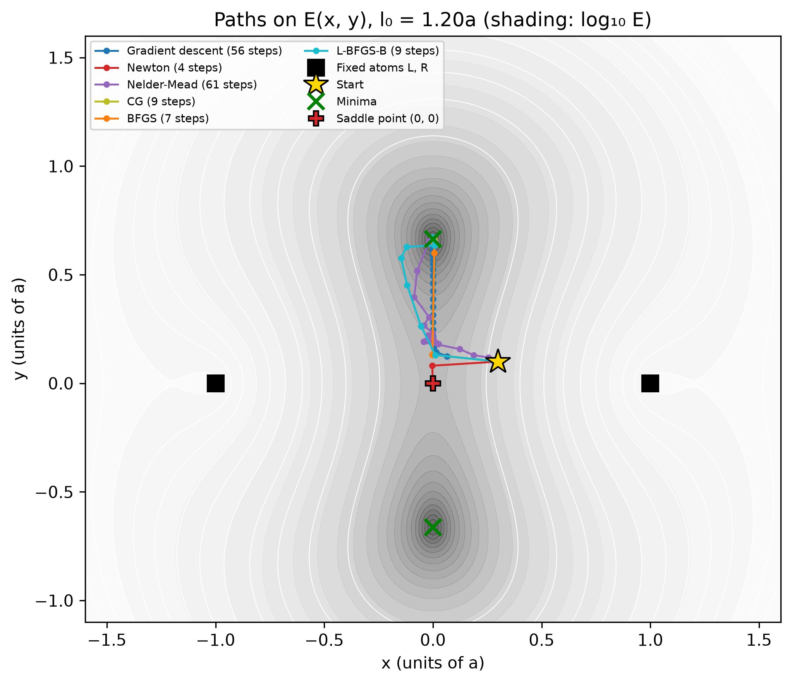

::: {.callout-note}
## Central question

**How can we use systems of equations to find the stable structure of a group of atoms?**
:::

## Learning outcomes

By the end of this lecture, you should be able to:

1. **Explain** why minimizing a quadratic energy reduces to one linear solve, $\mathbf K\mathbf x=\mathbf b$, and why a general interatomic energy does not.
2. **Derive** the multidimensional Newton step $\mathbf H\,\Delta\mathbf x=-\nabla E$ from the one-dimensional Newton method, and state its costs and risks.
3. **Use** `scipy.optimize.minimize` with an energy, a gradient, and a starting point, and compare how different method families choose their steps.
4. **Describe** how BFGS and L-BFGS approximate curvature from previous gradients, extending the secant idea of L06.
5. **Relax** a cluster with an atomistic package by combining a structure, a calculator, and an optimizer.

## From springs to stable structures

In L11–L13, we built a consistent set of tools for a simple model of atoms: each atom joined to its neighbours by a spring. Collecting the force balances gave a linear system, and L12 and L13 showed how a numerical solver finds its solution. The same question appeared in Assignment 1, where we compared shapes of a four-atom argon cluster:

> Given the interatomic energies or forces, can we obtain the structure with the lowest energy?

A structure in which no atom feels a net force is in mechanical equilibrium. Because each force is the negative derivative of the energy, $\mathbf F_i=-\partial E/\partial\mathbf x_i$, equilibrium means that every partial derivative of the total energy is zero. For a stable structure, we want more than equilibrium: we want the energy to be at a minimum. With all atomic coordinates collected in one vector $\mathbf x$, the problem is

$$
\min_{\mathbf x}E(\mathbf x),
\qquad\text{where at the minimum}\qquad
\nabla E(\mathbf x)=\mathbf 0 .
$$

Finding the structure by minimizing its energy is called **relaxation**. The copper cluster animation in L11 was one example. This lecture explains how such a relaxation is computed.

## 1 · A quadratic energy needs one linear solve

Start with the spring chain from L11. For three atoms between a fixed wall and a pulling force $f$, with displacements $u_1,u_2,u_3$ and identical springs of stiffness $k$, the energy is

$$
E=\tfrac12k\,u_1^2+\tfrac12k\,(u_2-u_1)^2+\tfrac12k\,(u_3-u_2)^2-f\,u_3 .
$$

Every term is at most quadratic in the displacements. Any such energy can be written in matrix form,

$$
E(\mathbf x)=\tfrac12\,\mathbf x^{\mathsf T}\mathbf K\,\mathbf x-\mathbf b^{\mathsf T}\mathbf x+C,
$$

where $\mathbf K$ is the symmetric stiffness matrix, $\mathbf b$ collects the external forces, and $C$ is a constant. For the chain, $\mathbf x=(u_1,u_2,u_3)$ and $\mathbf b=(0,0,f)$. Differentiating gives

$$
\nabla E(\mathbf x)=\mathbf K\mathbf x-\mathbf b .
$$

Setting the gradient to zero gives back exactly the system of L11:

$$
\boxed{\mathbf K\mathbf x=\mathbf b}
$$

One call to `np.linalg.solve` finds the minimum. No iteration is needed, because the gradient of a quadratic energy is linear in the unknowns.

### What changes for a real interatomic energy?

The spring model came from a quadratic approximation to the pair potential near its minimum. A Lennard-Jones or Morse potential is not quadratic, and its derivative is not linear in the distance. Even harmonic springs give a non-quadratic energy once atoms can move in more than one direction, because a spring length is the square root of the coordinates.

The example we use throughout this lecture shows this. A middle atom $M=(x,y)$ is joined by two springs to atoms fixed at $L=(-a,0)$ and $R=(a,0)$. Each spring has stiffness $k$ and natural length $l_0$:

$$
E(x,y)=\frac k2\left(r_L-l_0\right)^2+\frac k2\left(r_R-l_0\right)^2,
\qquad r_L=\sqrt{(x+a)^2+y^2},\quad r_R=\sqrt{(x-a)^2+y^2}.
$$

We choose $l_0>a$, so both springs are compressed when $M$ sits midway between $L$ and $R$. The atom lowers its energy by moving off the line to $(0,\pm\sqrt{l_0^2-a^2})$, where both springs reach their natural length. Setting $\nabla E=\mathbf 0$ gives two equations whose unknowns $x$ and $y$ sit inside square roots. There is no matrix $\mathbf K$ to invert. We need an iterative method that improves a guess step by step, as root finding did in Unit 2.

## 2 · Newton's method in many dimensions

In L06, Newton's method found a root of $f(x)$ by replacing the function with its tangent line. To minimize a function of one variable, we apply the same idea to its derivative: we look for $E'(x)=0$, which gives the update

$$
x_{n+1}=x_n-\frac{E'(x_n)}{E''(x_n)} .
$$

Equivalently, near $x_n$ we approximate $E$ by a parabola and jump to its stationary point.

In many dimensions, the second-order Taylor expansion about the current point $\mathbf x_n$ is

$$
E(\mathbf x_n+\Delta\mathbf x)\approx E(\mathbf x_n)+\nabla E(\mathbf x_n)^{\mathsf T}\Delta\mathbf x+\tfrac12\,\Delta\mathbf x^{\mathsf T}\mathbf H(\mathbf x_n)\,\Delta\mathbf x ,
$$

where $\mathbf H$ is the **Hessian**, the symmetric matrix of second derivatives $H_{kl}=\partial^2E/\partial x_k\,\partial x_l$. For two coordinates,

$$
\mathbf H=
\begin{bmatrix}
\dfrac{\partial^2E}{\partial x^2} & \dfrac{\partial^2E}{\partial x\,\partial y}\\[8pt]
\dfrac{\partial^2E}{\partial y\,\partial x} & \dfrac{\partial^2E}{\partial y^2}
\end{bmatrix}.
$$

Setting the gradient of this quadratic model to zero gives the **Newton step**:

$$
\boxed{\mathbf H(\mathbf x_n)\,\Delta\mathbf x=-\nabla E(\mathbf x_n),
\qquad \mathbf x_{n+1}=\mathbf x_n+\Delta\mathbf x .}
$$

Each iteration is a linear system of exactly the kind we solved in L12 and L13. For the quadratic spring energy, $\mathbf H=\mathbf K$ everywhere, and one Newton step from any starting point lands on $\mathbf K\mathbf x=\mathbf b$. For a general energy, Newton repeats the linear solve with a new Hessian at every step, and near a minimum it converges quadratically, as in one dimension.

### Two problems with Newton's method

**Cost.** A structure of $N$ atoms has $3N$ coordinates, so its Hessian is a $3N\times3N$ matrix. For 1000 atoms, that is $3000\times3000=9\times10^6$ second derivatives, or 72 MB of memory, to be recalculated at every step. Solving the system costs about $\tfrac23(3000)^3\approx2\times10^{10}$ floating-point operations per step (L13). For an energy from a quantum mechanical calculation, each second derivative can itself be expensive.

**It finds stationary points, not minima.** Newton's method solves $\nabla E=\mathbf 0$, and every stationary point satisfies that equation. The middle-atom example shows what can go wrong. With $l_0=1.2a$ and a start at $(0.3a,\,0.1a)$, Newton's method converges in four steps to the origin, where both springs are compressed and the atom is balanced but not stable. Started at $(1.5a,\,0.05a)$, it converges to $(l_0,0)$, another stationary point on the axis. In L15, we will see how the Hessian tells these points apart.

$$
\boxed{\text{Newton gives us the idea, but in practice we usually avoid computing the full Hessian.}}
$$

## 3 · What does `scipy.optimize.minimize` need?

A practical minimizer needs three things from us: a starting structure, a function that returns the energy, and, for most methods, a function that returns the gradient. It then decides where to try next:

$$
\boxed{\text{initial coordinates}}
\;\rightarrow\;
\boxed{\text{energy and gradient}}
\;\rightarrow\;
\boxed{\text{new coordinates}}
\;\rightarrow\;\cdots
$$

::: {.callout-note}
## Syntax: `minimize` with an energy and its gradient

```python
from scipy.optimize import minimize

result = minimize(energy, x0, args=(l0,), jac=gradient, method="BFGS")
result.x       # coordinates at the end
result.fun     # energy there
result.nit     # number of iterations
result.success # True when a stopping criterion was met
# energy(x, l0) returns a number, gradient(x, l0) returns an array shaped like x
```

The gradient is passed as `jac`, short for Jacobian. Without it, gradient-based methods estimate the gradient by finite differences, at the cost of extra energy evaluations. See [`scipy.optimize.minimize`](https://docs.scipy.org/doc/scipy/reference/generated/scipy.optimize.minimize.html).
:::

::: {.callout-tip collapse="true"}
## Example code: Energy and gradient of the middle atom

```python
A, K = 1.0, 1.0
FIXED = np.array([[-A, 0.0], [A, 0.0]])    # positions of L and R

def energy(p, l0):
    r = np.linalg.norm(p - FIXED, axis=1)
    return 0.5*K*np.sum((r - l0)**2)

def gradient(p, l0):
    d = p - FIXED                           # one row per spring
    r = np.linalg.norm(d, axis=1)
    return np.sum((K*(r - l0)/r)[:, None]*d, axis=0)
```

Each spring contributes $k(r-l_0)\,\mathbf d/r$ to the gradient, a vector along the spring whose sign depends on whether the spring is stretched or compressed.
:::

The methods available differ mainly in how much information they use to choose the next point. It is useful to think of them as families:

| Method | Basic idea | What it uses |
|---|---|---|
| Nelder–Mead (simplex) | Moves a triangle (in 2D) of trial points by reflecting and shrinking it | Energies only |
| Gradient descent | Steps a fixed distance downhill, $\Delta\mathbf x=-\alpha\nabla E$ | Gradient |
| Conjugate gradient (CG) | Chooses each new direction so that it does not undo progress along earlier ones | Gradient |
| Newton | Solves $\mathbf H\Delta\mathbf x=-\nabla E$ with the exact Hessian | Gradient and Hessian |
| BFGS | Builds an approximate Hessian from previous gradients | Gradient and its history |
| L-BFGS | Keeps only the last few steps of that history | Gradient and a short history |
| FIRE | Moves the atoms like a damped dynamics simulation | Forces (negative gradient) |

The table follows a spectrum of information:

$$
\text{energies only}
\;\rightarrow\;
\nabla E
\;\rightarrow\;
\nabla E+\text{approximate curvature}
\;\rightarrow\;
\text{full Hessian}.
$$

### The same landscape, six paths

The first notebook runs gradient descent and Newton's method written by hand, and four SciPy methods, from the same starting point on the middle-atom landscape. The figure shows their paths for $l_0=1.2a$ starting from $(0.3a,\,0.1a)$.

{#fig-minimizer-paths fig-alt="Contour plot of the energy of a middle atom between two fixed atoms, with minima above and below the origin. Six coloured paths start at the same point to the right of the origin. Newton's path ends at the origin. The others end at the upper minimum, with gradient descent and Nelder-Mead taking many small steps." width="85%"}

| Method | Iterations | SciPy energy evaluations | Ends at |
|---|---:|---:|---|
| Gradient descent ($\alpha=0.4$) | 56 | — | Minimum $(0,\,0.663a)$ |
| Newton | 4 | — | Saddle point $(0,0)$ |
| Nelder–Mead | 61 | 119 | Minimum |
| Conjugate gradient | 9 | 16 | Minimum |
| BFGS | 7 | 13 | Minimum |
| L-BFGS-B | 9 | 14 | Minimum |

Gradient descent and Nelder–Mead reach the minimum but need many small steps. The methods that use curvature, exact or approximate, need fewer than ten. Making $l_0$ closer to $a$ in the notebook makes the valley narrower: gradient descent then needs well over a hundred steps, because a fixed step that is safe across the steep direction is far too small along the gentle one.

::: {.quarto-wasm-local notebook="l14_minimizer_paths.edit.py" view="edit" title="Minimizer paths on the middle-atom energy landscape" height="1000" loading="lazy" fullscreen="true"}
The notebook defines the energy and gradient of the middle atom, writes gradient descent and Newton's method by hand, and records the paths of SciPy's Nelder–Mead, CG, BFGS, and L-BFGS-B methods with a callback. For $l_0=1.2a$ and a start at $(0.3a,\,0.1a)$, Newton's method converges to the saddle point at the origin in four steps, while the other methods reach the minimum at $(0,\,0.663a)$ in 7 to 61 iterations.
:::

## 4 · BFGS: learning the curvature from the gradients

The BFGS method, named after Broyden, Fletcher, Goldfarb, and Shanno, keeps Newton's step but replaces the exact Hessian with an approximation $\mathbf B$:

$$
\mathbf B_n\,\Delta\mathbf x=-\nabla E(\mathbf x_n).
$$

The question it answers is: **can we gradually learn enough about $\mathbf H$ from the positions and gradients we have already evaluated, without calculating any second derivatives?**

In one dimension, L06 already gave an answer. The secant method replaced the derivative with the slope between the last two points. Applied to minimization, the second derivative becomes

$$
E''\approx\frac{E'(x_{n+1})-E'(x_n)}{x_{n+1}-x_n}.
$$

BFGS imposes the same condition in many dimensions. With the step $\mathbf s_n=\mathbf x_{n+1}-\mathbf x_n$ and the change in gradient $\mathbf y_n=\nabla E(\mathbf x_{n+1})-\nabla E(\mathbf x_n)$, the new approximation must satisfy the **secant condition**

$$
\mathbf B_{n+1}\,\mathbf s_n=\mathbf y_n .
$$

One step only tells us how the gradient changes along one direction, so this condition does not determine $\mathbf B$ completely. BFGS makes the smallest correction to the previous $\mathbf B_n$ that satisfies it and keeps the matrix symmetric and positive definite. Each step adds information about one more direction, and after enough steps $\mathbf B$ resembles the true Hessian near the minimum.

Keeping $\mathbf B$ positive definite also solves Newton's second problem. A positive definite $\mathbf B$ makes the step point downhill, and BFGS combines it with a **line search** that only accepts a step if the energy decreases enough. BFGS therefore moves away from the saddle point that trapped Newton's method in the middle-atom example.

**L-BFGS**, the "limited-memory" version, goes one step further. Instead of storing the $3N\times3N$ matrix $\mathbf B$, it stores only the last $m$ pairs $(\mathbf s_n,\mathbf y_n)$, typically 5 to 20, and reconstructs the step from them. The memory grows as $2m\times3N$ numbers rather than $(3N)^2$. For a million atoms, that is the difference between a few hundred megabytes and tens of terabytes. This is why L-BFGS is the standard choice for large structures, and why L16 uses it for a 38-atom cluster.

## 5 · Relaxing structures with an atomistic package

In practice, materials scientists rarely flatten a structure into an array and call `scipy.optimize.minimize` by hand. An atomistic simulation package already knows the atoms and their coordinates, any boundary conditions, how to calculate energies and forces, and which optimizers suit atomic structures. With the [Atomic Simulation Environment (ASE)](https://wiki.fysik.dtu.dk/ase/), a relaxation takes three objects:

```python
from ase import Atoms
from ase.calculators.lj import LennardJones
from ase.optimize import BFGS

atoms = Atoms("Ar13", positions=X)                         # structure
atoms.calc = LennardJones(epsilon=0.0103, sigma=3.40, rc=50.0)   # calculator: E and F
BFGS(atoms).run(fmax=0.001)                                # optimizer, in eV/Å
```

The optimizer stops when the largest force component on any atom is below `fmax`, a criterion with direct physical meaning. Besides BFGS and L-BFGS, ASE offers **FIRE**, the fast inertial relaxation engine of [Bitzek et al. (2006)](https://doi.org/10.1103/PhysRevLett.97.170201). FIRE lets the atoms move like a damped molecular dynamics simulation, speeding up while the forces keep pointing the same way and stopping when they reverse. It uses only forces, which makes it robust for large or awkward structures.

The second notebook relaxes the same randomly displaced 13-atom cluster with all three optimizers. For argon with the Lennard-Jones calculator, each run reaches the icosahedron at $-0.45657$ eV, which is $-44.327\,\varepsilon$, in 58 to 63 steps. For 13 atoms, L-BFGS stores more past steps than the run takes, so its path is identical to BFGS. Switching to copper with the EMT calculator from the L11 animation changes only one line of the program.

{#fig-ase-relaxation fig-alt="Two semilog plots against optimizer step. The energy and largest force of BFGS and LBFGS overlap and fall to the tolerance in 58 steps. FIRE falls more smoothly and reaches the tolerance in 63 steps." width="100%"}

::: {.quarto-wasm-local notebook="l14_ase_relax.edit.py" view="edit" title="Relaxing argon and copper clusters with ASE optimizers" height="1000" loading="lazy" fullscreen="true"}
The notebook builds a displaced cluster from the centre of an icosahedron, attaches a Lennard-Jones calculator for argon or an EMT calculator for copper, and relaxes it with ASE's BFGS, LBFGS, and FIRE optimizers. For 13 argon atoms displaced by up to 0.3 Å, all three optimizers reach $-0.45657$ eV in 58 to 63 steps, with the largest force component below $10^{-3}$ eV/Å.
:::

The workflow to remember is

$$
\boxed{\text{structure}}
\;\rightarrow\;
\boxed{\text{calculator: }E,\ \mathbf F}
\;\rightarrow\;
\boxed{\text{optimizer}}
\;\rightarrow\;
\boxed{\text{relaxed structure}}.
$$

The calculator could be a Lennard-Jones potential today, a Morse potential tomorrow, and eventually density functional theory or a machine-learned potential. The optimization machinery does not depend on where the energy and forces come from.

## What to keep

1. A stable structure minimizes the energy, so all forces, $-\nabla E$, vanish there.
2. For a quadratic (harmonic) energy, $\nabla E=\mathbf K\mathbf x-\mathbf b$, and the minimum is one linear solve.
3. For a general energy, we iterate. Newton's method solves $\mathbf H\Delta\mathbf x=-\nabla E$ at every step. It converges quickly, but the Hessian is expensive, and Newton's method can converge to a saddle point.
4. BFGS learns an approximate Hessian from the secant condition $\mathbf B\mathbf s=\mathbf y$ and keeps every step downhill. L-BFGS keeps only a short history, which makes it suitable for very large structures.
5. Atomistic packages separate the structure, the calculator, and the optimizer, so the same relaxation works with any source of energies and forces.

## Check your understanding

1. Write the energy of the three-atom spring chain in the form $\tfrac12\mathbf x^{\mathsf T}\mathbf K\mathbf x-\mathbf b^{\mathsf T}\mathbf x$. Show that one Newton step from any starting point gives the solution of $\mathbf K\mathbf x=\mathbf b$.
2. Why does the middle-atom energy fail to be quadratic in $x$ and $y$, even though each spring is harmonic?
3. In the notebook, start Newton's method at $(0.3a,\,0.1a)$ and BFGS at the same point. Both stop with a zero gradient. Why does BFGS reach the minimum while Newton reaches the saddle point?
4. Estimate the memory needed for the full BFGS matrix and for L-BFGS with $m=10$ for a structure of $10^5$ atoms. Which method would you choose?
5. An ASE relaxation stops with `fmax=0.05` eV/Å. A classmate tightens it to `0.001` eV/Å and the energy changes by less than 1 meV. What does this tell you about the first result, and when would the tighter tolerance matter?

## Next

Every method in this lecture stops when the gradient is small. A small gradient, however, only tells us that we reached a stationary point. Newton's method found a saddle point in our two-dimensional example, and a perfectly symmetric structure can trap any minimizer at one. In L15, we ask how to confirm that a relaxed structure is really a minimum, which leads us to the Hessian and its eigenvalues.
