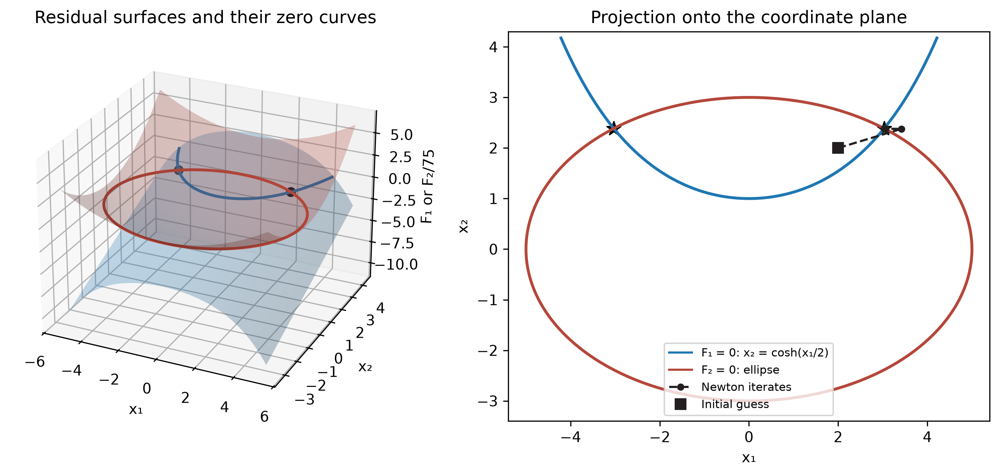
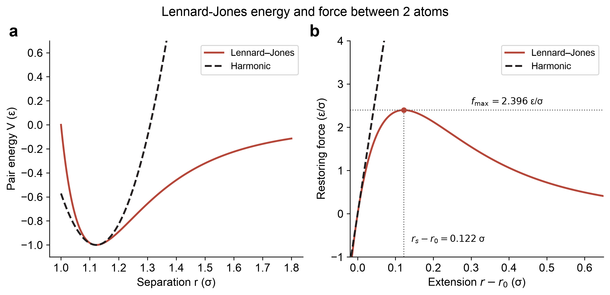
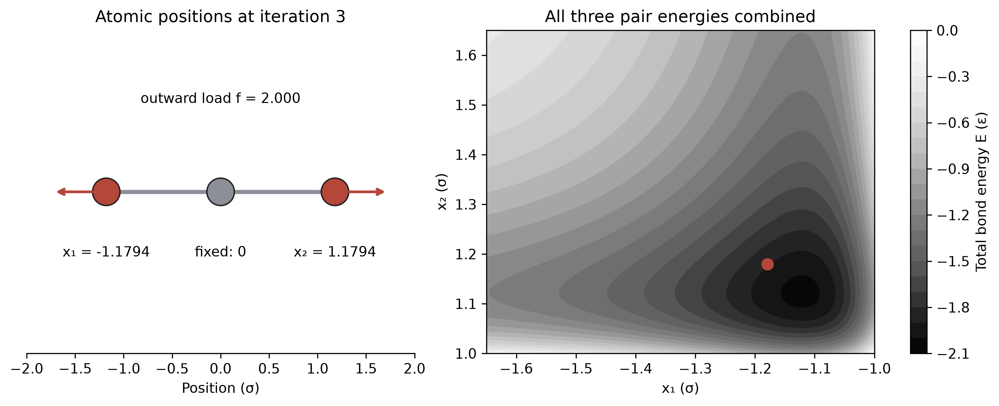
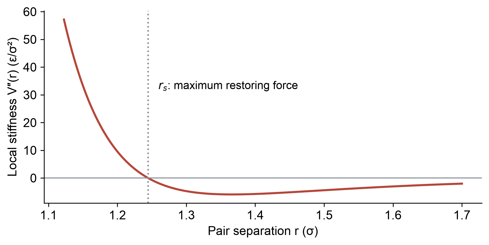

::: {.callout-note}
## Central question

**How far can a chain of atoms be stretched before its bonds break? Can we solve this using NumPy?**
:::

## Learning outcomes

By the end of this lecture, you should be able to:

1. **Formulate** the force balance of an atomic system as coupled nonlinear equations $\mathbf F(\mathbf x;f)=\mathbf 0$.
2. **Derive** the two-dimensional Newton update and identify the entries of its Jacobian.
3. **Solve** a loaded LJ chain with a handwritten Newton loop and `scipy.optimize.root`, checking the force residual.
4. **Interpret** bond softening and a nearly singular Jacobian in relation to the harmonic model and the chain's limiting load.

## How far can we pull an atomic chain?

In L11 and L12, we applied forces to atoms connected by springs and calculated their displacements from $\mathbf K\mathbf u=\mathbf b$. Let us return to that chain model. Before doing any numerical calculation, imagine what happens as we pull harder:

- **How will the distances between the atoms change?** In the bead-and-spring model, the extensions increase proportionally to the applied force.
- **What happens if the force becomes extremely large?** A Hookean spring keeps stretching, with an ever-increasing restoring force.

::: {.callout-important}
## The harmonic spring has no breaking force

From our chemistry and materials perspective, sufficiently strong pulling can break a chemical bond. A harmonic spring simply stretches farther: double the force and its extension doubles. To describe bond breaking, we need an interaction whose restoring force has a limit.
:::

**Our question: what changes when we replace the springs with an interaction that allows the atoms to separate?** We will start with three atoms along a line. The energy and forces can now be nonlinear functions of their positions, so a larger force need not produce a proportionally larger extension. Eventually, there may be no position at which the attraction can balance the pull.

{#fig-chain-experiment width="100%" fig-alt="Left: three atoms on a horizontal line, the middle atom fixed at zero and the outer atoms pulled outward by equal forces. Right: an AC-HRTEM image of a three-atom gold chain joining two supports, with a 1 nm scale bar."}

Atomic chains can actually be imaged during experiments. @hao2026gold studied stretched gold chains using state-of-the-art electron microscopy. We will return to their observations after working out how to solve the force balance.

## From an energy model to coupled force equations

*If we don't use the bead-and-spring model, what can we use?* An interatomic energy model takes the atomic coordinates $\mathbf x$ and returns a single number, the total energy $E$, often together with its derivatives. Experiments can help determine or test such models. The relationship between $E$ and $\mathbf x$ can be complicated and strongly nonlinear, and we will study these energy models in more detail later in the course.

A useful relation to remember from L11 is that a derivative of the energy gives a force. For atoms moving in one dimension, each coordinate $x_i$ has a corresponding internal force:

::: {.callout-note}
## Internal force: the negative derivative of total energy

$$
F_{\mathrm{int},i}(\mathbf x)=-\frac{\partial E}{\partial x_i}.
$$

The partial derivative means that we move atom $i$ while holding the other coordinates fixed. Its units are energy per length.
:::

Let $b_i$ be the applied force on that atom, positive toward increasing $x$. At equilibrium, the **net force** must be zero:

$$
\boxed{F_i(\mathbf x)=b_i-\frac{\partial E}{\partial x_i}=0.}
$$

Here and below, $F_i$ denotes the total force, including the applied load. For $n$ moving coordinates, we have $n$ equations to satisfy simultaneously:

$$
\begin{aligned}
F_1(x_1,x_2,\ldots,x_n)&=b_1-\frac{\partial E}{\partial x_1}=0,\\
F_2(x_1,x_2,\ldots,x_n)&=b_2-\frac{\partial E}{\partial x_2}=0,\\
&\ \vdots\\
F_n(x_1,x_2,\ldots,x_n)&=b_n-\frac{\partial E}{\partial x_n}=0.
\end{aligned}
$$

This is the root-finding problem we saw in Unit 02, extended to a **vector of residuals** $\mathbf F$. The equations are **coupled** because moving one atom can change forces on several atoms. In general, their coefficients depend on the coordinates, so we cannot collect them into one constant matrix and solve the entire nonlinear problem in one linear solve.

### Two equations for the three-atom model

There are three atoms in @fig-chain-experiment, but only **two moving coordinates**. The middle atom is held at zero, the left atom is at $x_1<0$, and the right atom is at $x_2>0$. Equal outward forces have magnitude $f\geq0$, giving $b_1=-f$ and $b_2=+f$.

Without choosing a particular energy model yet, we can write

$$
E=E(x_1,x_2),\qquad
\begin{aligned}
F_1(x_1,x_2;f)&=-f-\frac{\partial E}{\partial x_1}=0,\\
F_2(x_1,x_2;f)&=+f-\frac{\partial E}{\partial x_2}=0.
\end{aligned}
$$

The semicolon separates the unknown coordinates from the prescribed load $f$. Holding the middle atom fixes the position of the chain as a whole. We solve only the two equations for the moving atoms.

### Bracketing and open methods

As in one-variable root finding, we can approach the problem in two ways:

- **Bracketed methods** begin with a region known to contain a root. For a continuous scalar function, opposite endpoint signs guarantee a root in the interval. In several dimensions, we would need a corresponding condition on a region, such as a rectangle in $(x_1,x_2)$.
- **Open methods** begin with a trial point, such as $\mathbf x^{(0)}=(x_1^{(0)},x_2^{(0)})$, and use local function information to improve it. Multidimensional Newton–Raphson is an extension of the method we already know.

::: {.callout-caution}
## What would bracket a simultaneous root?

There is no single positive or negative sign for a vector. Finding a sign change in $F_1$ while holding $x_2$ fixed, and another in $F_2$ while holding $x_1$ fixed, need not give a point where both vanish. Multidimensional bracketing methods require stronger conditions on the region. For our coupled force equations, we will use an open method and examine its convergence.
:::

## Newton's method: a linear system at each step

Suppose the current coordinates are $x_1$ and $x_2$, giving net forces $F_1$ and $F_2$. Our goal is to bring both forces to zero by moving the atoms through $\Delta x_1$ and $\Delta x_2$. Where should they move?

We can use a first-order Taylor expansion in two dimensions. Notice that changing **either coordinate can affect both forces**:

$$
\begin{aligned}
F_1(\mathbf x+\Delta\mathbf x)&\approx F_1(\mathbf x)
+\frac{\partial F_1}{\partial x_1}\Delta x_1
+\frac{\partial F_1}{\partial x_2}\Delta x_2,\\
F_2(\mathbf x+\Delta\mathbf x)&\approx F_2(\mathbf x)
+\frac{\partial F_2}{\partial x_1}\Delta x_1
+\frac{\partial F_2}{\partial x_2}\Delta x_2.
\end{aligned}
$$

All derivatives are evaluated at the current coordinates. Setting the two approximations to zero gives

$$
\underbrace{\begin{bmatrix}
\displaystyle\frac{\partial F_1}{\partial x_1} & \displaystyle\frac{\partial F_1}{\partial x_2}\\[6pt]
\displaystyle\frac{\partial F_2}{\partial x_1} & \displaystyle\frac{\partial F_2}{\partial x_2}
\end{bmatrix}}_{\mathbf J(\mathbf x)}
\begin{bmatrix}\Delta x_1\\\Delta x_2\end{bmatrix}
=-\begin{bmatrix}F_1(\mathbf x)\\F_2(\mathbf x)\end{bmatrix}.
$$

The matrix $\mathbf J$ is the **Jacobian matrix**, or simply the Jacobian. Its entry $J_{ij}=\partial F_i/\partial x_j$ tells us how force $i$ changes when coordinate $j$ changes. Thus row $i$ describes one force, while column $j$ describes the effect of moving one coordinate.

Although the original equations are nonlinear, the equation for the correction is **linear**:

$$
\boxed{\mathbf J(\mathbf x)\,\Delta\mathbf x=-\mathbf F(\mathbf x).}
$$

We therefore use the linear algebra tools from L11–L13:

```python
Delta_x = np.linalg.solve(J, -F)
x = x + Delta_x
```

### Case 1: constant-stiffness springs

For a harmonic system, the net force is $\mathbf F=\mathbf b-\mathbf K\mathbf u$, where $\mathbf u$ is displacement from the unloaded configuration. Therefore

$$
\mathbf J=-\mathbf K,\qquad
-\mathbf K\Delta\mathbf u=-(\mathbf b-\mathbf K\mathbf u),
$$

which rearranges to $\mathbf K(\mathbf u+\Delta\mathbf u)=\mathbf b$. **One Newton correction gives the exact harmonic solution**, provided the constrained stiffness matrix is nonsingular.

For our centre-fixed three-atom chain with just two nearest-neighbour springs, each moving atom is connected to the fixed centre by a spring of stiffness $k$:

$$
\mathbf K=\begin{bmatrix}k&0\\0&k\end{bmatrix},\qquad
\mathbf J=\begin{bmatrix}-k&0\\0&-k\end{bmatrix}.
$$

If an additional spring of stiffness $k_c$ connects the two outer atoms, the matrices become

$$
\mathbf K=\begin{bmatrix}k+k_c&-k_c\\-k_c&k+k_c\end{bmatrix},\qquad
\mathbf J=-\mathbf K.
$$

### Case 2: a changing local stiffness

For general nonlinear forces, the Jacobian changes with the atomic positions. At each point, it acts like a **local spring model**: a small displacement produces approximately $\mathbf J\Delta\mathbf x$ of force change. Solving the linearized equations tells us where this local approximation predicts force balance.

After moving the atoms, the true force will generally still be nonzero because the local approximation changes along the step. We evaluate the force and Jacobian again at the new position and repeat. Thus the multidimensional Newton update is

$$
\boxed{
\begin{aligned}
\mathbf J(\mathbf x^{(m)})\,\Delta\mathbf x^{(m)}&=-\mathbf F(\mathbf x^{(m)}),\\
\mathbf x^{(m+1)}&=\mathbf x^{(m)}+\Delta\mathbf x^{(m)}.
\end{aligned}}
$$

Here $m$ counts iterations, while the subscripts 1 and 2 label coordinates. The local spring constants belong to interactions between atoms and can depend on several coordinates. Off-diagonal entries describe the coupling between coordinates, just as they did in the spring stiffness matrix.

{#fig-newton-tangents width="100%" fig-alt="Two panels with a spring and two atoms above force-versus-displacement plots. The linear force law reaches zero in one step, while the nonlinear curve requires a sequence of tangent steps."}

::: {.callout-note}
## The inverse notation and the actual calculation

It is mathematically convenient to write $\mathbf x^{(m+1)}=\mathbf x^{(m)}-\mathbf J^{-1}\mathbf F$. As in L12, we calculate the correction by solving a linear system with `np.linalg.solve`, without constructing the inverse at every step.
:::

### A Newton–Raphson solver

The core algorithm can be written before choosing the energy or force model. At a fixed load, it needs an initial position, a vector-valued force function, and its Jacobian.

::: {.callout-tip}
## Newton loop for coupled equations

1. Choose an initial position $\mathbf x^{(0)}$.
2. Evaluate $\mathbf F(\mathbf x)$ and $\mathbf J(\mathbf x)$.
3. Solve $\mathbf J\Delta\mathbf x=-\mathbf F$.
4. If the force residual and correction are both small, accept $\mathbf x$.
5. Otherwise, set $\mathbf x\leftarrow\mathbf x+\Delta\mathbf x$ and repeat, up to a maximum number of steps.
:::

The following core is editable in both demos. The notebook versions also record the iteration history and report singular matrices or inadmissible positions.

```python
def newton_raphson_multidim(force, jacobian, x0,
                           ftol=1e-9, xtol=1e-10, max_steps=40):
    x = np.array(x0, dtype=float)
    for m in range(max_steps):
        F = force(x)
        J = jacobian(x)
        Delta_x = np.linalg.solve(J, -F)
        if (np.max(np.abs(F)) < ftol
                and np.max(np.abs(Delta_x)) < xtol):
            return x
        x = x + Delta_x
    raise RuntimeError("Newton iteration did not converge")
```

`ftol` and `xtol` have different units: force and length for the atomic problem. Requiring a small residual prevents a small step from being mistaken for force balance. Close to a simple root, smooth functions and a nonsingular Jacobian give Newton's familiar rapid, quadratic convergence. An unsuitable starting point can instead lead to another root, a singular matrix, or an excessively large step.

## Demo 1: two nonlinear functions

Before supplying atomic forces, let us test the solver on two functions:

$$
\begin{aligned}
F_1(x_1,x_2)&=x_2-\frac12\left(e^{x_1/2}+e^{-x_1/2}\right),\\
F_2(x_1,x_2)&=9x_1^2+25x_2^2-225.
\end{aligned}
$$

A simultaneous root is an intersection of the surfaces $F_1$ and $F_2$ at zero height, where $F_1=F_2=0$. Differentiating gives all four Jacobian entries:

$$
\mathbf J(x_1,x_2)=
\begin{bmatrix}
-\frac14\left(e^{x_1/2}-e^{-x_1/2}\right)&1\\[4pt]
18x_1&50x_2
\end{bmatrix}.
$$

**Predict:** starting near the right-hand intersection, which root should Newton find? What changes if we reverse the sign of the initial $x_1$? Use the 3D residual surfaces and their zero-curve projection to identify the two roots, then inspect the Newton steps.

::: {.quarto-wasm-local notebook="l14_newton_system.edit.py" view="app" title="Newton iteration for two nonlinear equations: surfaces, zero curves, and Jacobian steps" height="1050" loading="lazy" fullscreen="true"}
The two roots are approximately $(x_1,x_2)=(\pm3.03116,2.38587)$. Starting from $(2,2)$ or $(-2,2)$ reaches the corresponding root. At $x_1=0$, the first column of the Jacobian vanishes and the linear solve is singular. The 3D view plots $F_1$ and $F_2/75$ to keep both surfaces visible, while the solver uses the original functions.

{fig-alt="Three-dimensional residual surfaces and a two-dimensional projection showing the two intersections of a hyperbolic cosine curve and an ellipse."}
:::

The start $(0,2)$ gives a useful failure case: both derivatives with respect to $x_1$ are zero there. The linearized equations cannot determine a unique correction even though the nonlinear system has two roots. This is why the starting point matters.

## Demo 2: force balance in an atomic chain

### Nonlinear energies from Lennard–Jones interactions

Now return to the line of atoms. A simple nonlinear model is the pairwise Lennard–Jones (LJ) interaction that we have used earlier in the course. For three atoms, there are three pair contributions:

$$
E(x_1,x_2)=V(-x_1)+V(x_2)+V(x_2-x_1).
$$

The first two terms join each outer atom to the centre. The third joins the two outer atoms. The pair energy takes a positive separation as its input:

$$
V(r)=4\varepsilon\left[\left(\frac{\sigma}{r}\right)^{12}
-\left(\frac{\sigma}{r}\right)^6\right],\qquad
V'(r)=24\varepsilon\left(\frac{\sigma^6}{r^7}-\frac{2\sigma^{12}}{r^{13}}\right).
$$

What differs from the simple spring system?

1. The energy is not parabolic over the full range of separations.
2. Atoms that are not nearest neighbours also interact, although more weakly.
3. The restoring force reaches a maximum and then decreases as the atoms separate.

{#fig-force-models width="100%" fig-alt="Lennard-Jones and harmonic pair energies overlap near their minima. The harmonic force then rises linearly, while the Lennard-Jones restoring force peaks and decreases."}

For example, moving the left atom to the right decreases both separations $-x_1$ and $x_2-x_1$. Differentiating the total energy and adding the applied forces gives

$$
\begin{aligned}
F_1(x_1,x_2;f)&=-f+V'(-x_1)+V'(x_2-x_1)=0,\\
F_2(x_1,x_2;f)&=+f-V'(x_2)-V'(x_2-x_1)=0.
\end{aligned}
$$

These are the two functions supplied to Newton's method. Their derivatives form the Jacobian, with the same diagonal and off-diagonal assembly pattern as a spring system. The full expression is useful when checking the code:

::: {.callout-note collapse="true"}
## Complete Jacobian for the centre-fixed three-atom chain

Write $k_L=V''(-x_1)$, $k_R=V''(x_2)$, and $k_c=V''(x_2-x_1)$. Then

$$
\mathbf J=
\begin{bmatrix}-k_L-k_c&k_c\\k_c&-k_R-k_c\end{bmatrix},\qquad
V''(r)=24\varepsilon\left(\frac{26\sigma^{12}}{r^{14}}-\frac{7\sigma^6}{r^8}\right).
$$

The applied forces are constant at a given load, so their coordinate derivatives are zero. Unlike a Hookean spring constant, $V''(r)$ changes with separation and can become negative.
:::

### Increasing the applied force

We will start from zero force, record the positions, and then gradually increase the pull. To simplify the calculation, use **LJ reduced units**: coordinates in $\sigma$, energy in $\varepsilon$, and force in $\varepsilon/\sigma$.

Newton needs an initial guess. Placing all atoms at zero would give zero separation and a divergent LJ energy. Instead, begin with $(x_1^{(0)},x_2^{(0)})=(-1.12,1.12)$, near the unloaded pair spacing $2^{1/6}\sigma$. The unloaded three-atom chain settles at approximately $(-1.12103,1.12103)\sigma$, slightly closer together because of the outer-pair attraction.

For each increase in force, use the preceding solution as the next initial guess. This procedure is called **continuation**. Small load increments keep the starting point near the branch of solutions already found. The demo lets us compare it with a direct Newton solve from the two typed coordinates.

::: {.quarto-wasm-local notebook="l14_bond_chain.edit.py" view="app" title="Centre-fixed three-atom LJ chain: load, atomic positions, total energy, and Newton iterations" height="1150" loading="lazy" fullscreen="true"}
At $f=2\,\varepsilon/\sigma$, Newton gives $(x_1,x_2)=(-1.179363,1.179363)\sigma$. Both nearest-neighbour bonds have stretched by about 5.2% relative to the unloaded chain. The total internal energy, including the outer pair, is $E=-1.891269\,\varepsilon$. The residual is below $10^{-9}\,\varepsilon/\sigma$. Raising the load toward $2.43683\,\varepsilon/\sigma$ makes the symmetric branch approach its limiting point.

{fig-alt="The centre atom is fixed and the outer two atoms move symmetrically under load. A contour plot of the sum of all three pair energies shows the Newton iterates."}
:::

**In class:** compare $f=0$, $2$, $2.43$, and $2.45$. At each load, inspect the atom positions, the remaining force, and the total bond energy. Turning continuation off makes the effect of the initial guess easier to see. The energy panel shows the total **internal** bond energy $E(x_1,x_2)$. At nonzero load, force balance also includes the work of the applied forces, so the solution shifts away from the minimum of $E$ alone.

### What happens at a large force?

Near the limiting load, Newton's method becomes sensitive because the force changes very little along a particular displacement direction. Compare the converged Jacobians at two loads, in units of $\varepsilon/\sigma^2$:

$$
\begin{aligned}
f=2:\quad &\mathbf J\approx
\begin{bmatrix}-16.90168&-0.17156\\-0.17156&-16.90168\end{bmatrix},
&&\operatorname{cond}_2(\mathbf J)\approx1.02,\\[6pt]
f=2.436:\quad &\mathbf J\approx
\begin{bmatrix}-0.61484&-0.11590\\-0.11590&-0.61484\end{bmatrix},
&&\operatorname{cond}_2(\mathbf J)\approx1.46.
\end{aligned}
$$

The entries have become much smaller, even though the condition number is still modest. At the symmetric branch limit, $f\approx2.436832$ and $x_2=-x_1\approx1.242867$, the Jacobian tends to

$$
\mathbf J_{\mathrm{limit}}\approx
\begin{bmatrix}-0.113443&-0.113443\\-0.113443&-0.113443\end{bmatrix}.
$$

Its rows become identical, so the limiting matrix is singular. Multiplying by the outward displacement vector $(-1,1)^T$ gives zero: to first order, this stretching motion produces no restoring change in net force. Close to this point, solving for the Newton correction becomes increasingly sensitive, and the condition number grows without bound.

For this symmetric branch, the limiting nearest-neighbour bond extension is about **10.9%** relative to the unloaded chain. Above the force maximum, a larger symmetric separation cannot provide enough attraction to balance the pull. A failed Newton solve by itself can also come from a poor initial guess or an overly large load step. Refining the load increments and examining the force maximum lets us distinguish those numerical failures from the physical limit of this model.

### The library version: `scipy.optimize.root`

Once we have supplied `force(x, f)` and `force_jacobian(x, f)`, the library call is short. It is also runnable in the atom demo:

```python
from scipy.optimize import root

result = root(force, x0, args=(f,), jac=force_jacobian, method="hybr")
x = result.x
largest_force = np.max(np.abs(force(x, f)))
```

[`scipy.optimize.root`](https://docs.scipy.org/doc/scipy/reference/generated/scipy.optimize.root.html) solves **vector equations**. Use `root_scalar` when the unknown and residual are scalar. The default `hybr` method is a modified Powell hybrid method, using Newton-like steps with safeguards on their size.

| Information available | Practical starting choice |
|---|---|
| An analytical Jacobian for a small or medium system | `hybr` with `jac=...` |
| A force function whose Jacobian is awkward to derive | `hybr` without `jac`, which estimates derivatives numerically |
| Repeated derivative evaluations are expensive | `broyden1`, which updates a Jacobian approximation from changes in coordinates and residuals |
| A large system where storing a dense Jacobian is costly | `krylov`, which approximates the action of an inverse Jacobian through iterative linear algebra |

These methods have different convergence behaviour. There is no universal guarantee from an arbitrary starting point, so inspect `result.success`, `result.message`, the force residual, and the admissibility of the returned coordinates together. Root finding establishes force balance. Whether that balance is stable will become a central question in L15–L16.

### Extending to seven atoms

With these ingredients, we can build a longer chain. For $N=7$, hold the middle atom and apply equal outward forces to the two ends. Six coordinates remain unknown. Each interacting pair contributes equal and opposite forces, and its derivatives contribute to the Jacobian. After summing those contributions, retain the six rows and columns corresponding to the moving atoms.

The atom notebook includes this general force assembly as `chain_model`. The calculation has the same form:

```python
f = 2.0  # force in ε/σ
positions, evaluate, valid = chain_model(7)
x0 = 2**(1/6) * np.array([-3, -2, -1, 1, 2, 3])

# evaluate(x, f) returns total energy, net forces, and the Jacobian.
force7 = lambda x: evaluate(x, f)[1]
jacobian7 = lambda x: evaluate(x, f)[2]
x, history, ok, message = newton_system(force7, jacobian7, x0, valid=valid)
```

For a loading sweep, first solve at zero force and then reuse each converged solution at the next load. The number of equations and matrix size change, while the Newton update stays the same.

{#fig-chain-pull width="100%" fig-alt="Seven-atom LJ force-extension curve bending away from its harmonic tangent and approaching a load of 2.44262. An inset shows symmetric bond strains of about 10.9, 9.0, 8.9, 8.9, 9.0, and 10.9 percent."}

We can now use a nonlinear solver to answer a materials question: how the chain extends as we pull it, and where the force-balanced branch ends. The following optional analysis explains the bond softening behind this result.

## Analyzing the results: advanced reading

### Bond softening and the limiting load

Why does the bond lose its ability to sustain a larger force? The Jacobian acts like a local stiffness, which changes with the atomic positions. A two-atom LJ pair makes this especially clear. For separation $r$, its local spring constant is

$$
k_{\mathrm{local}}(r)=V''(r)=24\varepsilon\left(\frac{26\sigma^{12}}{r^{14}}-\frac{7\sigma^6}{r^8}\right).
$$

{#fig-local-stiffness width="80%" fig-alt="Second derivative of the Lennard-Jones pair energy against separation, crossing zero at approximately 1.24446 sigma."}

The largest restoring force occurs where $V''(r_s)=0$, at the **inflection point of the pair energy**:

$$
r_s=\left(\frac{26}{7}\right)^{1/6}\sigma,
\qquad f_{\max}=V'(r_s)=2.3964\,\varepsilon/\sigma.
$$

Below this maximum, a positive tensile load intersects the pair restoring-force curve twice: once on its rising side and once on its falling side. At the maximum, these two scalar roots merge. Beyond it, no pair separation balances the pull. The strain at the limiting point is $r_s/r_0-1=10.9\%$, where $r_0=2^{1/6}\sigma$.

For this one-coordinate problem, $J=-V''(r)$ tends to zero. A nonzero $1\times1$ matrix always has condition number one, so its condition number cannot diagnose the approach to zero stiffness. We must also inspect the magnitude of $J$. In a multi-coordinate system, different displacement directions can soften at different rates, as the three-atom matrices showed.

These values describe a quasistatic, zero-temperature, **force-controlled** LJ pair. The boundary conditions matter: prescribing the separation instead would allow us to calculate forces beyond this peak.

### Which bond stretches most?

In the all-pair seven-atom chain, both end bonds stretch more than the interior bonds. Longer-range attractions carry some tension across each cut through the chain. Interior cuts have more of these contributions, so the end bonds carry more of their load through a single nearest-neighbour interaction. With nearest-neighbour interactions alone, every identical bond on the same short-bond branch would instead satisfy the same equation $V'(r)=f$.

The pair limit is $2.3964$, the three-atom chain reaches about $2.437$, and the seven-atom loading sweep reaches about $2.4426\,\varepsilon/\sigma$. Symmetry makes the two ends equally susceptible in this model. A numerical asymmetry or physical perturbation can favour one end, so the symmetric calculation does not select a unique end bond in advance.

### What do the gold chains do?

Return to the image in @fig-chain-experiment. Hao and colleagues observed an approximately linear low-strain regime, but above about 12% the gold chains developed distinct short and long bond lengths. Their observed chains reached strains up to 46%, and changes in atomic configuration accompanied stepwise changes in electrical conductance [@hao2026gold]. A chain can therefore redistribute its extension through structural changes well beyond the first departure from a harmonic law.

Our LJ calculation identifies a force limit for its specified interaction and constraints. Gold's metallic bonding, its supporting electrodes, and the experimental loading conditions determine a different energy landscape. The experimental question is how that landscape produces the observed short–long patterns. Replacing the energy model would change the forces and derivatives supplied to our solver, while preserving the force-balance formulation.

![Long and short bonds in a stretched gold atomic chain: (a) electron-microscopy image with measured bond lengths and (b) a structural model labelling long (L) and short (S) bonds [@hao2026gold]. © 2026 American Chemical Society.](../../../assets/L14-hao-long-short-bonds.png){#fig-gold-long-short width="65%" fig-alt="Electron-microscopy image of a gold atomic chain with successive bond lengths of 0.395, 0.286, 0.391, and 0.298 nanometres, beside a structural model showing alternating long and short bonds between two gold supports."}

## Take-home message

- Coupled nonlinear equations $\mathbf F(\mathbf x)=\mathbf 0$ can be solved by multidimensional Newton–Raphson iteration.
- Each step solves the linear system $\mathbf J\Delta\mathbf x=-\mathbf F$, using a solver such as `np.linalg.solve`.
- The Jacobian tells us how every residual changes with every coordinate. For atomic net forces, it is the negative local stiffness matrix.
- `scipy.optimize.root` supplies practical solvers for vector equations. Check the residual and the returned configuration.
- A nonlinear bond can soften and reach a limiting load, which a constant-stiffness harmonic spring cannot describe.

## Before next lecture

At zero applied force, our short-bond chain settled into a minimum of its internal energy. This prompts another important task in nonlinear atomic systems: **minimizing the energy of a structure**. How could we minimize $E(\mathbf x)$ directly, and how would we know whether a force-balanced structure is actually a minimum? We will take up those questions in L15.
