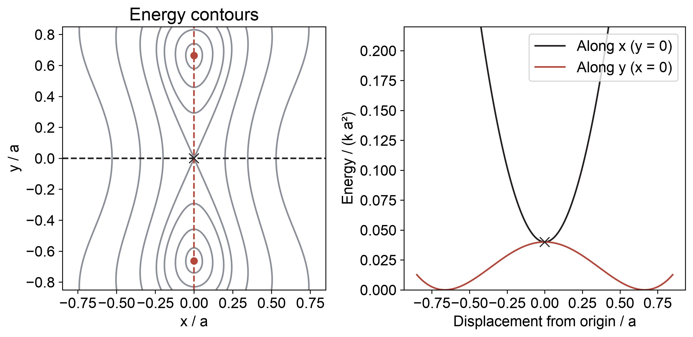
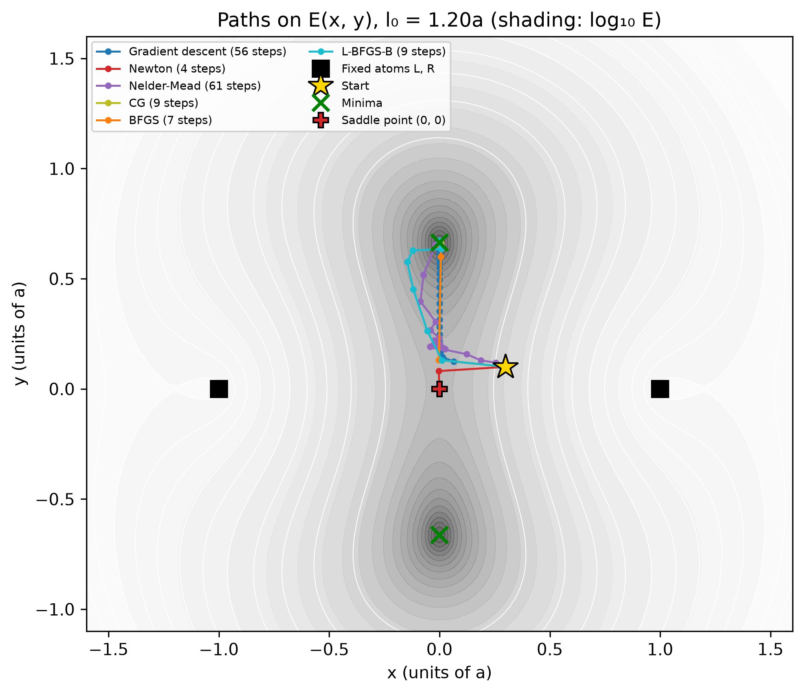
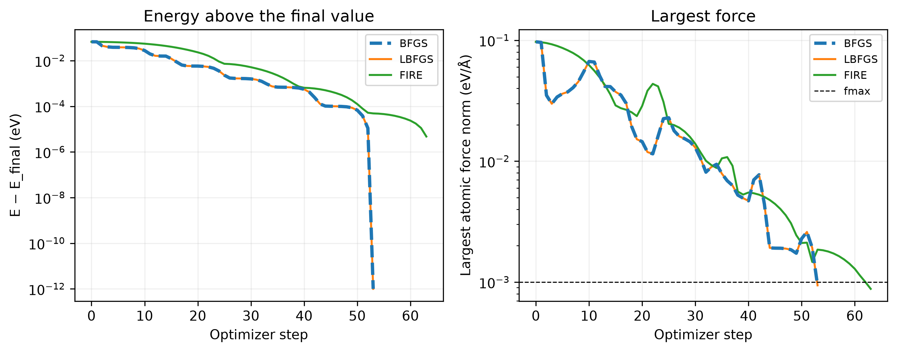

::: {.callout-note}
## Central question

**Given the energy of an atomic system, how can we calculate a stable structure, and where do matrix solves enter the optimization?**
:::

## Learning outcomes

By the end of this lecture, you should be able to:

1. **Derive** the Newton equation $\mathbf H\Delta\mathbf x=-\nabla E$ from force balance and identify the Hessian.
2. **Compare** the constant Hessian of a quadratic energy with the changing Hessian of a geometrically nonlinear spring system.
3. **Minimize** a supplied two-coordinate energy with SciPy, choosing the energy and derivative inputs appropriate to the method.
4. **Distinguish** a local minimum from a saddle point using the energy changes around a converged structure.

## From force balance to energy minimization

In L14, we demonstrated how to solve a non-linear system of equations by demonstrating chain of atoms under external force. We're solving a sets of equations

F_i (\matbbf) = F_int_i(\mathbf) - f_i = 0

And we showed that using newton's method on high-dimesions, it is possible to convert to a linear matrix solving problem wen updating each step from a guess

xm+1 = x_m + Delta x
J Delta x = -F(x)

Newton's method did this by repeatedly solving a linear system involving the Jacobian of the force. We wanted to note $J$ is the jacobian of the net force, and it needs to be updated everytime. 

One direct extension to this is when external force f = 0, what do we solve is now essentially the local minimum structure. Since we showed 

F_int_i = -\partial E/\partial x_i

solving F_i = F_int_i = 0 is basically related to solve

partial E/partial x_i = 0
...

This is a **relaxation problem**, which is the core to any materials simulations. Relaxing the force of a system, is equivalent to find the **minimization** of the total energy of an atomistic system. 

<box this -->

Relaxation in force <-->  minimize energy
(second row) Solve \partia E/\partialx  minE

<call-out tip
Newtonian vs Hamiltonian views (just anecdote)

Historically there are newtonian and hamiltonian ways od describing a many body system; in laymen's words
- newtonian (force analysis): knowing all the forces in the many bodies
- hamiltonian (): ...
>

### Recapping local vs global minima

We have briefly seen this concept in both lecture 07 and assignment 1. In a many atom / high-dimensional coordination system, solving force = 0 does not necessariely ean we could find the structure with energy lowest from all possible geometries.

- Local minimum: this is a position x_m, that moving any infinitely small displacement Delta x from it, will cause energy to increase.
  *howver*, local mimimum does not guarenteem there wil be pos, that a large enough displacement  x_m + Delta x will have lower energy
- Global minimum: lowest energy among all allowed configurations (e.g. search all possible values (x1, x2, ... xN))

For higher dimension structures, it is very likely an initial pos only get to a local minimum. changing a different start point will likely go down to a better minimum, but to trly find the global minimum, is a hard task and beyond this course's context. For interested, please see methods like <basin hopping> <genetic algorithm> <enhanced sampling>.

### Ensuring minimum: second derivative

From the minimization in 1D, we know that the having f'(x) = 0 is not enough, we have to have f''(x) > 0 to ensure it's indeed a minimum. 

The same thing occurs for minimization in higher dimension as well. We want the second derivative of energy to be positive in **all directions** to make sure it's minimum. This is a slightly different focus of problem, so we will discuss it in L16 using the concept of eigenvalue analysis.

## Minimization of energy: the Newton-Raphson Approach


For this class, let's consider a slightly more interesting question: 3 atoms in a line, with the end atoms fixed, the middle atom able to move freely in either x- or y- directions. The total energy between the aomts E(x, y) has a generally non-linear form, that we will not reveal first. 


### 2D system basic concepts
There are some concepts in the vector calculus that may find useful. Using the 2D coordinate (x, y)


**Gradient**, is basically a vector \nabla E = [\partial E/partial x, \partial E/\partial y]

In the case of 2 free coordinates, the internal force F(x, y) just F(x, y) = -nabla E = [-partal / partial x, -partial / partial y]

The gradient tells us how large the internal force, and geometrically the local slope of the energy "surface"

**Hessian matrix**, which is matrix of second derivative with respect to the energy. 

H = [partial^2 E/partial x^2, ...;...;;...]

the hessian matrix tells us about the curvature of the energy surface. Numerically, it is just the negative of the Jacboan matrix of force

H = -J_F = ...

we used the notation J_F to say its jacobian of the force, just to be distinct.

There are many ways to intuitively understand the hessian, for example
1. it means how fast the energy will increase in different directions (larger magnitude of hessian --> quicker )
2. it means the local curvature (how bended) the energy surface is (larger magnitude of hessian --> more bended)
3. for atomic systems it is related to the local spring constant (larger magnitude of hessian--> stiffer)

<callout fold why?


the energy near **the minimum** can be approximated using the taylor's expansion method

E(Delta x, Delta y) = E_min + 1/2Delta x^THDelta x <and in expandedform>

a higher magnitude <in fact what? norm? determinant? eigenvalue?> will mean the energy increase steep

>

### Minimization in newton's method

Recall that in newton's method, we need to solve 

J_F \Delta x = -F(x)

in energy's term, we just write

H \Delta x = \nabla E(x)

and that is all what we need to minimize. in 2D, basically

[2D matrix of hessian] Delta x = [2 row nabla E]

why bother rewrite the equation again? We can show that it is basically just knowing 

E(x, y) as a scalar, and then we can minimize everything from this multi-dimensional energy function

<call out: relation to 1D newton method

in lecture 7 we said newton's method builds on both 1d and 2d derivative f' and f''

x_m+1 = x_m - f'/f''

analogously in multidim

x = xm - H^-1 E

although in fact we do not solve the inverse of hessian
>

## Miniminzation in Numpy library

Newton's method is cool, and we can indeed use scipy.optimize.newton  to do it. 

In many cases the gradient and hessian might be difficult to write explicitly, scipy provides many other functions to do this

scipy.optimize.minimize will be very good at it

You have already use it for minimizing the fitting coefficients in assignemtn 2. to optimize the atomic sturctures, similar can also be used

<show minimize and its table usage>


## Demo: One moving atom with two coordinates

Let's reveal out toy system!
<for this system let's don't say which kind of energy E form we would have, even though could use spring>

<fix this demo, so that student can artificial make atoms apart, and see how newton try to find the minima>

<the supplied atomic system will use a dropdown to reveal what energy form used, including spring const, LJ, and a cheap morse>

<we don't show how to minimize a real atom systems yet! no bfgs etcetc>

<for each system, we will provide the function for gradient and hessian>

Ask students  to predict where the minimum will be, by changing the parameter a (whether initially compressed or stretched, they shall see the diff)


{#fig-spring-geometry width="90%" fig-alt="Two fixed atoms connected by springs to a middle atom. At the origin the springs are compressed. The second panel shows the middle atom above the line at one minimum and a mirror minimum below it."}

For this exercise, take three supplied functions as the model:

| Function | Input | Output |
|---|---|---|
| `energy(p, l0)` | Position `p = [x, y]`, natural length | One energy |
| `gradient(p, l0)` | The same inputs | Two first derivatives |
| `hessian(p, l0)` | The same inputs | A $2\times2$ matrix |


### Two minima visible from the geometry

The energy is a sum of squares and cannot be negative. It reaches zero if both spring lengths equal $l_0$. Equal distances from $L$ and $R$ require $x=0$, and then

$$
a^2+y^2=l_0^2
\quad\Longrightarrow\quad
(x,y)=\left(0,\pm\sqrt{l_0^2-a^2}\right).
$$

For $a=1$ and $l_0=1.2$, these points are $(0,\pm0.6633)$. They are the two lowest-energy configurations. This geometric answer gives us a reference for the numerical calculation, even though the solver itself will only evaluate the supplied functions.

{#fig-energy-sections width="100%" fig-alt="An energy contour map with minima above and below the origin, beside energy profiles along the horizontal and vertical axes showing opposite curvatures at the origin."}

### Applying the Newton loop

Begin at $\mathbf p_0=(0.3,0.1)$. Evaluate the gradient, solve with the current Hessian, and update the position. The editable notebook implements this loop:

```python
p = np.array([0.3, 0.1])
for iteration in range(50):
    g = gradient(p, l0)
    if np.linalg.norm(g) < 1e-10:
        break
    delta_p = np.linalg.solve(hessian(p, l0), -g)
    p = p + delta_p
```

The call to `hessian` belongs *inside* the loop because its entries depend on the position. Keeping the initial Hessian would define a different iteration. In either case, check the final gradient and whether the loop reached its iteration limit before accepting the answer.

For this starting point, Newton approaches $(0,0)$ in four corrections. The forces cancel there, but its energy is $k(a-l_0)^2=0.04$ in units with $a=k=1$. We already found configurations with zero energy. Why has Newton stopped between them?

## Minimization with SciPy

<many of this part should be moved above...>

The force-balance Newton loop searches for a zero gradient. An optimization method also uses energy values to decide which trial steps to accept. For example, a line search can shorten a proposed step until it gives a sufficient energy decrease. This provides a way to direct the search toward a nearby minimum.

In L07, `minimize_scalar` took one scalar variable. Here the energy still returns one number, but its input is an array of coordinates, so we use [`scipy.optimize.minimize`](https://docs.scipy.org/doc/scipy/reference/generated/scipy.optimize.minimize.html):

```python
from scipy.optimize import minimize

result = minimize(energy, [0.3, 0.1], args=(l0,),
                  jac=gradient, method="BFGS")
result.x       # final coordinates
result.fun     # energy at those coordinates
result.success # whether this method's stopping criterion was met
result.message # explanation of termination
```

The keyword `jac` supplies the first derivative of the objective. Since the objective is a scalar energy, that derivative is the gradient vector. The Hessian would be supplied separately as `hess` for methods that use it. BFGS does not require an explicit Hessian.

### What information do the methods need?

| Method | How it chooses a step | Information supplied |
|---|---|---|
| Nelder–Mead | Compares energies at a triangle of points in 2D, reflecting, expanding, or shrinking it | Energy only |
| Gradient descent | Moves along $-\nabla E$, with a selected step length | Gradient |
| Newton stationary-point iteration | Solves $\mathbf H\Delta\mathbf x=-\nabla E$ | Gradient and Hessian |
| BFGS | Builds a curvature approximation from successive gradients and uses a line search | Energy and gradient |
| L-BFGS-B | Uses a limited history of gradients and can impose coordinate bounds | Energy and gradient |
| Nonlinear conjugate gradient (CG) | Combines the current downhill direction with information from the previous direction | Energy and gradient |

Nelder–Mead provides a derivative-free choice [@nelder1965simplex]. BFGS needs gradient information but can estimate it by finite differences when we omit `jac`. That avoids supplying a derivative function, at the cost of additional energy evaluations. For many atomic coordinates, calculators that provide forces efficiently make gradient-based methods especially useful.

Gradient descent and the plain Newton iteration in the table are handwritten comparisons in our notebook. SciPy's `minimize` offers named Newton-related methods with their own line-search or trust-region procedures, rather than a method named simply `Newton`.

### Six paths on the same landscape

No need here

{#fig-minimizer-paths width="95%" fig-alt="Contours of the two-minimum energy landscape with paths for gradient descent, Newton, Nelder-Mead, CG, BFGS and L-BFGS-B. Newton ends at the origin and the other paths end above it."}

The paths in @fig-minimizer-paths show that the method changes both the route and the endpoint. From $(0.3,0.1)$, BFGS reaches approximately $(0,0.6633)$, whereas Newton ends at the origin. Gradient descent takes many smaller steps. A step length small enough to remain controlled across a steep direction can give slow progress along a shallow valley.

::: {.quarto-wasm-local notebook="l15_minimizer_paths.edit.py" view="edit" title="Newton and SciPy minimizers on a two-coordinate atomic energy" height="1000" loading="lazy" fullscreen="true"}
The notebook supplies the energy, gradient, and Hessian of the middle atom. Handwritten gradient descent and Newton loops are compared with SciPy's Nelder–Mead, CG, BFGS, and L-BFGS-B. With $l_0=1.2a$ and initial position $(0.3a,0.1a)$, Newton reaches the origin in four corrections, while the other methods reach the upper minimum near $(0,0.6633a)$. Changing the starting point reveals the dependence of the final structure on the search path.
:::

**In class:** start above the horizontal axis, then below it. Predict which minimum a downhill method will reach. Finally, start exactly at the origin. Does a method supplied with a zero gradient have a direction in which to begin?

### How BFGS approximates curvature

Newton constructs a full Hessian at every position. BFGS instead uses the gradients already calculated along its path. If the last displacement was $\mathbf s=\mathbf x^{(m+1)}-\mathbf x^{(m)}$ and the gradient changed by $\mathbf y=\mathbf g^{(m+1)}-\mathbf g^{(m)}$, an approximate Hessian $\mathbf B$ is updated to satisfy

$$
\mathbf B\mathbf s=\mathbf y.
$$

This is the multidimensional counterpart of estimating a derivative from a secant slope. The displacement and gradient change give curvature information along the direction actually travelled. With suitable curvature and line-search conditions, BFGS maintains an approximation that gives downhill search directions. For this example it avoids the saddle reached by the unrestricted Newton step.

A dense Hessian for 1000 freely moving atoms has $3000\times3000$ entries. Constructing and solving with that matrix repeatedly can dominate the calculation. **Limited-memory BFGS** stores a short history of displacements and gradient changes instead of the full matrix. These methods let us extend the same optimization idea to far more coordinates without explicitly building every second derivative.

## The stationary point between the minima

At the origin, the two compressed springs push equally in opposite directions, so the gradient is exactly zero. Move the atom slightly in $x$: one spring becomes more compressed and the other less compressed. Their net force pushes it back, and the energy rises. Move it slightly in $y$: both springs lengthen toward their natural length, lowering the energy and pushing the atom farther from the origin.

The origin is a **saddle point**. A saddle has directions in which the energy rises and directions in which it falls. The two cuts in @fig-energy-sections make that distinction visible even though both first derivatives vanish at their intersection. Newton met its root-finding goal there, but the atom can still reduce its energy by moving vertically.

A minimizer can also stop at a saddle, particularly when an exactly symmetric starting configuration gives no downhill gradient. Its success flag records an algorithmic stopping criterion. Depending on the method, this can involve gradient size, step size, or changes in energy. We must interpret that criterion before drawing a conclusion about structural stability.

## From the middle atom to an atomic cluster

A cluster has more coordinates, but a minimizer still needs the same basic information: an energy, its gradient, and a starting structure. Atomistic packages arrange these through a structure object, an energy-and-force calculator, and an optimizer. The calculator may evaluate a pair potential or a much more detailed electronic-structure model.

The [Atomic Simulation Environment](https://ase-lib.org/) provides these objects. The editable example below starts with 13 argon atoms near an icosahedron, displaces them, and relaxes the cluster with BFGS, LBFGS, and FIRE. **FIRE**, the fast inertial relaxation engine, moves atoms using forces and an adaptive, damped dynamical update. This is an extension of the two-coordinate exercise: the optimizer now moves 39 coordinates, while the LJ calculator supplies energies and forces. ASE's `fmax` criterion uses the largest **force-vector norm on an atom**, in eV/Å.

{#fig-ase-relaxation width="100%" fig-alt="Two convergence plots for ASE BFGS, LBFGS and FIRE, showing energy above the final value and the recorded force measure against optimization step."}

::: {.quarto-wasm-local notebook="l15_ase_relax.edit.py" view="edit" title="Extension: relaxing a displaced atomic cluster with ASE" height="950" loading="lazy" fullscreen="true"}
The notebook combines an atomic structure, an LJ calculator for argon or an EMT calculator for copper, and ASE optimizers. In the supplied 13-atom argon case, all three methods reach approximately $-0.4566$ eV. The optimizer stops when the maximum norm of an atomic force is below $10^{-3}$ eV/Å. The same division between physical model and numerical optimizer applies to larger structures.
:::

The central difficulty now becomes harder to inspect by eye. For the middle atom, two plotted energy cuts revealed the saddle. A cluster can move along combinations of many coordinates, so we need a matrix-based way to find any downhill displacement that remains after relaxation.

## What to keep

1. The gradient is $\nabla E$, the force is $-\nabla E$, and the force Jacobian is $-\mathbf H$.
2. Newton's stationary-point equation is $\mathbf H\Delta\mathbf x=-\nabla E$. It reaches the minimum in one step for the supported harmonic chain's quadratic energy.
3. Harmonic springs can still give a position-dependent Hessian when their lengths depend nonlinearly on Cartesian coordinates.
4. `minimize` accepts a vector of coordinates and a scalar energy. Methods differ in whether they use energies, gradients, or Hessians.
5. Zero force establishes a stationary point. Energy changes around that point distinguish a minimum from a saddle.

## Check your understanding

1. Why is the Jacobian of the net force the negative of the Hessian of the energy?
2. Explain why the two-dimensional spring system needs an updated Hessian even though both spring constants remain fixed.
3. Find the two zero-energy configurations for $l_0=1.3a$ without running an optimizer.
4. A calculator supplies only energies. Which method in the table can use them directly, and how could BFGS obtain the gradient information it needs?
5. Why can Newton converge to the origin of the compressed spring system? What additional observation shows that this point is unstable?

## Next

For one atom moving in a plane, we can draw the energy and find a downhill direction. L16 asks how to make that test using the Hessian, including when the stable and unstable directions no longer line up with the coordinate axes. The resulting eigenvalue problem provides a stability test for high-dimensional structures.
