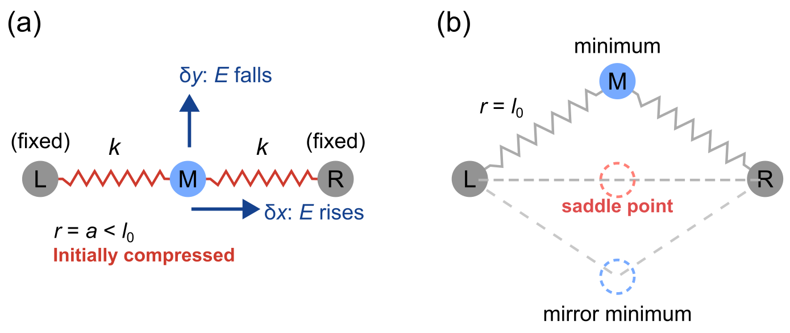
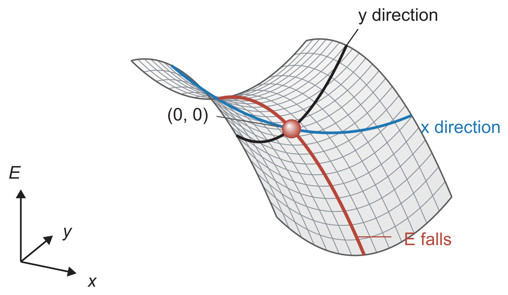

::: {.callout-note}
## Central question

**Given the energy of an atomic system, how can we calculate a stable structure, and where do matrix solves enter the calculation?**
:::

## Learning outcomes

By the end of this lecture, you should be able to:

1. **Relate** force relaxation to energy minimization, and explain why a structure with zero force need not be an energy minimum.
2. **Derive** the Newton equation $\mathbf H\Delta\mathbf x=-\nabla E$ from the force-balance Newton step of L14, and identify the gradient and Hessian of an energy.
3. **Apply** Newton's method to a supplied two-coordinate atomic energy, and explain how compressed and stretched bonds change its result.
4. **Choose** a `scipy.optimize.minimize` method according to whether the energy model supplies energies, gradients, or Hessians.

## From force balance to energy minimization

In [L14](../L14/index.qmd), we pulled a chain of atoms with applied forces and asked where the atoms would come to rest. Atom $i$ feels the applied force $b_i$ and the internal force $-\partial E/\partial x_i$ from its bonds. At equilibrium, every net force vanishes:

$$
F_i(\mathbf x)=b_i-\frac{\partial E}{\partial x_i}=0,\qquad i=1,2,\ldots,n.
$$

For the nonlinear bond models in L14, these equations are coupled and nonlinear. Newton's method approximated them by a linear system at the current coordinates $\mathbf x^{(m)}$,

$$
\mathbf J(\mathbf x^{(m)})\,\Delta\mathbf x^{(m)}=-\mathbf F(\mathbf x^{(m)}),\qquad
\mathbf x^{(m+1)}=\mathbf x^{(m)}+\Delta\mathbf x^{(m)},
$$

where $\mathbf J$ is the Jacobian of the net force, with entries $J_{ij}=\partial F_i/\partial x_j$. Moving the atoms changes the local stiffness, so the Jacobian has to be evaluated again at every step.

Now remove the applied forces by setting every $b_i=0$. Only the forces from the bonds remain, and equilibrium requires

$$
\frac{\partial E}{\partial x_1}=0,\quad
\frac{\partial E}{\partial x_2}=0,\quad\ldots,\quad
\frac{\partial E}{\partial x_n}=0.
$$

In **structural relaxation**, we move the atoms to lower their energy until the remaining forces are sufficiently small. This is a routine step in atomistic simulation, used to answer questions such as:

- **Crystal structure:** What is the equilibrium atomic spacing in an fcc crystal? Here, we also vary the unit-cell size to minimize the energy.
- **Surface relaxation:** How do the surface atoms rearrange when a metal is cut and their neighbours on one side are removed?
- **Defect formation:** When one atom is removed from a crystal, how do the surrounding atoms rearrange around the vacancy?
- **Molecular adsorption:** Where does a gas molecule bind on a catalyst surface, and how does it orient itself?

{#fig-relaxation-tasks width=100% fig-alt="Four atomic models in a two-by-two layout: an fcc unit cell, a layered surface slab, an atomic plane with a central vacancy, and a CO molecule above a metal surface."}

These tasks involve different geometries, but the atomic forces all follow from the same relation, $F_i=-\partial E/\partial x_i$. Searching for a stable arrangement therefore leads us to minimize the smooth energy function $E(x_1,\ldots,x_n)$ over the allowed coordinates:

::: {.callout-tip}
## Relaxation and minimization

|              | Relaxing the forces                                                  | Minimizing the energy                                  |
|--------------|----------------------------------------------------------------------|--------------------------------------------------------|
| **Goal**     | Find $\mathbf x$ with $F_i=-\partial E/\partial x_i=0$ for every $i$ | Find the $\mathbf x$ at which $E(\mathbf x)$ is lowest |
| **Solution** | Solve the $n$ equations $\partial E/\partial x_i=0$                  | Solve $\displaystyle\min_{\mathbf x}E(\mathbf x)$      |
:::


::: {.callout-tip}
## Forces and energies: two descriptions of mechanics

Newton's laws describe a system of particles through forces: once we know the force on every particle, we can follow its motion. In the late 18th and 19th centuries, Lagrange and Hamilton reformulated mechanics around energies. A scalar function of the kinetic and potential energies determines the motion, and the forces follow from derivatives of the potential energy. Our table is a small example of this idea, since one function $E(\mathbf x)$ contains every force as a derivative. Atomistic simulation and quantum chemistry codes work with the energy description throughout.
:::

### Local and global minima

We met these terms for one variable in [L07](../../02/L07/index.qmd) and compared candidate structures of a small argon cluster in Assignment 1. With many coordinates, they become:

- **Local minimum:** a structure $\mathbf x^*$ for which every sufficiently small displacement $\Delta\mathbf x$ raises the energy, $E(\mathbf x^*+\Delta\mathbf x)>E(\mathbf x^*)$. A larger displacement may still reach a lower energy.
- **Global minimum:** the structure with the lowest energy among all allowed configurations, that is, among all possible values of $(x_1,x_2,\ldots,x_n)$.

{#fig-local-global-minima width=100% fig-alt="A two-coordinate energy surface above its matching one-dimensional section. A gray ball rests in the shallower left well, a local minimum, and a red ball rests in the deeper right well, the global minimum."}

A relaxation starts from a guessed structure and moves to a nearby stationary point. A cluster of $N$ atoms has $3N$ coordinates, and its number of local minima grows very rapidly with $N$. Starting from a different structure may lead to a lower minimum, but proving that we have found the global minimum is a much harder search problem, beyond the scope of this course. Three widely used strategies, for those interested, are:

- **Basin hopping** repeatedly displaces the atoms at random, relaxes the new structure, and decides whether to keep the new minimum by comparing energies. SciPy provides it as [`scipy.optimize.basinhopping`](https://docs.scipy.org/doc/scipy/reference/generated/scipy.optimize.basinhopping.html).
- **Genetic algorithms** keep a population of relaxed structures, build new candidates by combining parts of low-energy structures and mutating them, and retain the lowest-energy results. [Further reading](https://en.wikipedia.org/wiki/Genetic_algorithm).
- **Enhanced-sampling molecular dynamics**, such as metadynamics, lets the atoms move at finite temperature and adds a bias energy that discourages them from revisiting configurations, so the system escapes one basin and explores others. [Further reading](https://en.wikipedia.org/wiki/Metadynamics).

### The second-derivative test in many dimensions

How can we test whether the solution is a minimum?

- **One variable:** For a scalar function $f(x)$, use the second-derivative test from [L07](../../02/L07/index.qmd). After solving $f'(x)=0$, check whether $f''(x)>0$. If so, the solution is a local minimum.
- **Several variables:** After finding a point where all first derivatives vanish, check whether the second derivative is positive along **every direction**. If so, the solution is a local minimum.

We will work through this check later in this lecture and follow up in Lecture 16.

## Newton's method for energy minimization

Consider an atom that can move freely in the $x$ and $y$ directions, with energy $E(x,y)$.

### The gradient and the Hessian

The **gradient** collects the first derivatives of the energy into a vector:

$$
\nabla E=\begin{bmatrix}\dfrac{\partial E}{\partial x}\\[2ex]\dfrac{\partial E}{\partial y}\end{bmatrix},
\qquad
\mathbf F=-\nabla E=\begin{bmatrix}-\dfrac{\partial E}{\partial x}\\[2ex]-\dfrac{\partial E}{\partial y}\end{bmatrix}.
$$

Its magnitude is the steepest local slope of the energy surface, and it points in the direction in which the energy increases fastest. The internal force on the atom is the negative gradient, so it points downhill.

The **Hessian** collects the second derivatives into a matrix:

$$
\mathbf H=\begin{bmatrix}
\dfrac{\partial^2E}{\partial x^2} & \dfrac{\partial^2E}{\partial x\,\partial y}\\[2ex]
\dfrac{\partial^2E}{\partial y\,\partial x} & \dfrac{\partial^2E}{\partial y^2}
\end{bmatrix}.
$$

For a smooth energy, the order of differentiation does not matter, so the two off-diagonal entries are equal and $\mathbf H$ is symmetric. With $n$ coordinates, the Hessian is an $n\times n$ matrix with entries $H_{ij}=\partial^2E/\partial x_i\,\partial x_j$.

The Hessian is closely related to the Jacobian of L14. Without applied forces, $F_i=-\partial E/\partial x_i$, and differentiating once more gives $\partial F_i/\partial x_j=-\partial^2E/\partial x_j\,\partial x_i$. We write $\mathbf J_F$ for the Jacobian of the force to keep the two matrices distinct:

$$
\mathbf J_F=\begin{bmatrix}
\dfrac{\partial F_x}{\partial x} & \dfrac{\partial F_x}{\partial y}\\[2ex]
\dfrac{\partial F_y}{\partial x} & \dfrac{\partial F_y}{\partial y}
\end{bmatrix}
=-\mathbf H.
$$

The Hessian can be pictured in three equivalent ways:

1. **Change in slope:** It tells us how the energy gradient changes when we move the atom.
2. **Energy curvature:** It describes how sharply the energy surface bends along different directions. Near a minimum, a direction with larger positive curvature has a more tightly curved energy well.
3. **Local stiffness:** For atoms, it acts as a matrix of local spring constants, since $-\mathbf H\Delta\mathbf x$ approximates the change in force caused by a small displacement $\Delta\mathbf x$.

In @fig-gradient-hessian, the gradient points uphill and the force points downhill. The two energy cuts through the marked atom show how the Hessian describes different stiffnesses along $x$ and $y$.

![Gradient, force, and curvature for $E(x,y)=\tfrac12x^2+2y^2$, in arbitrary units. (a) At the marked atom $P=(0.8,0.45)$, the gradient $\nabla E$ and force $\mathbf F=-\nabla E$ point in opposite directions. Both arrows use the same display scale. The logarithmic colour scale runs from dark (low energy) to yellow (high energy) and brings out energy differences near the minimum. The dashed cuts pass through $P$. (b) Energy change $\Delta E$ relative to $P$ for a displacement $s$ along each cut. The red point marks the same atom at $s=0$. The $y$ direction has higher curvature ($H_{yy}=4$) than the $x$ direction ($H_{xx}=1$).](../../../assets/L15-gradient-hessian.png){#fig-gradient-hessian width=100% fig-alt="Left: a viridis energy heatmap, dark at the minimum and yellow at high energy, with short opposing gradient and force arrows at atom P. Right: x and y energy cuts through P, marked by a red point at zero displacement and zero energy change. The y cut has higher curvature."}

For the harmonic chain in L14, the energy is quadratic in the displacements, $E=\tfrac12\mathbf u^{\mathsf T}\mathbf K\mathbf u$, so the Hessian is the stiffness matrix, $\mathbf H=\mathbf K$, at every position. This is why one Newton correction solved that chain exactly. For general bonds, the Hessian changes as the atoms move.

::: {.callout-tip collapse="true"}
## Energy increase near a minimum: the quadratic Taylor term

Expand the energy about $(x,y)$ for a small displacement $(\Delta x,\Delta y)$:

$$
E(x+\Delta x,\,y+\Delta y)\approx E
+\frac{\partial E}{\partial x}\Delta x+\frac{\partial E}{\partial y}\Delta y
+\frac12\left(\frac{\partial^2E}{\partial x^2}\Delta x^2
+2\frac{\partial^2E}{\partial x\,\partial y}\Delta x\,\Delta y
+\frac{\partial^2E}{\partial y^2}\Delta y^2\right),
$$

with every derivative evaluated at $(x,y)$. In matrix form, with $\Delta\mathbf x=(\Delta x,\Delta y)^{\mathsf T}$,

$$
E(\mathbf x+\Delta\mathbf x)\approx E(\mathbf x)+\nabla E^{\mathsf T}\Delta\mathbf x+\tfrac12\,\Delta\mathbf x^{\mathsf T}\mathbf H\,\Delta\mathbf x .
$$

At a minimum $\mathbf x_{\min}$, the gradient vanishes and the energy increase is

$$
E(\mathbf x_{\min}+\Delta\mathbf x)-E_{\min}\approx\tfrac12\,\Delta\mathbf x^{\mathsf T}\mathbf H\,\Delta\mathbf x .
$$

Move a distance $s$ along a unit direction $\mathbf u$, so that $\Delta\mathbf x=s\mathbf u$. The increase is $\tfrac12(\mathbf u^{\mathsf T}\mathbf H\mathbf u)\,s^2$, a one-dimensional parabola whose curvature $\mathbf u^{\mathsf T}\mathbf H\mathbf u$ plays the role of $f''$ along that direction. The direction $\mathbf u=(1,0)$ gives $\partial^2E/\partial x^2$, and $\mathbf u=(0,1)$ gives $\partial^2E/\partial y^2$. Which directions give the largest and smallest curvatures, and how large are they? These are the eigenvectors and eigenvalues of $\mathbf H$, the subject of L16.
:::

### The Newton step for a stationary point

Substitute $\mathbf F=-\nabla E$ and $\mathbf J_F=-\mathbf H$ into the Newton equation of L14:

$$
(-\mathbf H)\,\Delta\mathbf x=-(-\nabla E)
\quad\Longrightarrow\quad
\mathbf H\,\Delta\mathbf x=-\nabla E .
$$

Starting from a guess $\mathbf x^{(0)}$, each Newton step evaluates the derivatives at the current coordinates and solves

$$
\boxed{\mathbf H(\mathbf x^{(m)})\,\Delta\mathbf x^{(m)}=-\nabla E(\mathbf x^{(m)}),\qquad
\mathbf x^{(m+1)}=\mathbf x^{(m)}+\Delta\mathbf x^{(m)}.}
$$

For the middle atom, each step solves the $2\times2$ linear system

$$
\begin{bmatrix}
\dfrac{\partial^2E}{\partial x^2} & \dfrac{\partial^2E}{\partial x\,\partial y}\\[2ex]
\dfrac{\partial^2E}{\partial x\,\partial y} & \dfrac{\partial^2E}{\partial y^2}
\end{bmatrix}
\begin{bmatrix}\Delta x\\ \Delta y\end{bmatrix}
=-\begin{bmatrix}\dfrac{\partial E}{\partial x}\\[2ex] \dfrac{\partial E}{\partial y}\end{bmatrix},
$$

with all derivatives evaluated at the current position. Why rewrite the force equation in this form? Every quantity now comes from one scalar function: the first derivatives of $E$ give the right-hand side, and the second derivatives give the matrix. Any energy model that supplies these derivatives can be relaxed with the same loop.

The Taylor expansion above gives a second view of the same step. Near $\mathbf x^{(m)}$, the energy is approximated by the quadratic model $E+\nabla E^{\mathsf T}\Delta\mathbf x+\tfrac12\Delta\mathbf x^{\mathsf T}\mathbf H\Delta\mathbf x$. Setting the derivative of this model with respect to $\Delta\mathbf x$ to zero gives $\nabla E+\mathbf H\Delta\mathbf x=\mathbf 0$, which is the Newton equation. **Each Newton step jumps to the stationary point of the local quadratic model.** When the model curves upward in every direction, that point is the bottom of a bowl. Otherwise, it can be a saddle or a hilltop of the model, and the step need not lower the energy.

::: {.callout-tip}
## Relation to the one-dimensional Newton minimizer

In L07, Newton's method for a minimum of $f(x)$ used both derivatives:

$$
x_{m+1}=x_m-\frac{f'(x_m)}{f''(x_m)}.
$$

The many-coordinate version replaces $f'$ by $\nabla E$ and $f''$ by $\mathbf H$, giving $\mathbf x^{(m+1)}=\mathbf x^{(m)}-\mathbf H^{-1}\nabla E$. As in L14, this inverse is notation only. We compute the correction by solving $\mathbf H\Delta\mathbf x=-\nabla E$, for example with `np.linalg.solve`.
:::

## Minimization with SciPy

The Newton loop needs the full Hessian at every step. For a complicated energy model, the second derivatives can be difficult to derive.

::: {.callout-tip}
## Numerical derivatives in the next unit

Computing derivatives numerically, including gradients, Hessians, and Jacobians, is the focus of our next unit!
:::

For many atoms, the Hessian also becomes large: 1000 freely moving atoms give a $3000\times3000$ matrix to build and solve at every step. SciPy offers two kinds of tools for these problems.

### Formulating as multivariable root solving

::: {.callout-note appearance="simple" icon="false"}
**Key function:** [`scipy.optimize.root`](https://docs.scipy.org/doc/scipy/reference/generated/scipy.optimize.root.html)
:::

The stationary-point conditions $\partial E/\partial x_i=0$ are a system of equations, so `root` from L14 applies directly, with the gradient as the function and the Hessian as its Jacobian:

```python
from scipy.optimize import root

result = root(gradient, [0.3, 0.1], args=(a,), jac=hessian)
```

Like our Newton loop, `root` looks for any point where the gradient vanishes, including a saddle.

### Formulating as multivariable minimization

::: {.callout-note appearance="simple" icon="false"}
**Key function:** [`scipy.optimize.minimize`](https://docs.scipy.org/doc/scipy/reference/generated/scipy.optimize.minimize.html)
:::

You have seen `scipy.optimize.minimize` in Assignment 2, where it adjusts the LJ parameters to minimize the fitting error. Here the variables are atomic coordinates and the objective is the energy:

```python
from scipy.optimize import minimize

result = minimize(energy, [0.3, 0.1], args=(a,), jac=gradient, method="BFGS")
result.x        # final coordinates
result.fun      # energy at those coordinates
result.success  # whether the method's stopping criterion was met
result.message  # explanation of termination
```

The keyword `jac` supplies the first derivative of the objective. Since the objective is a scalar energy, that derivative is the gradient vector. Methods that use a Hessian receive it through `hess`.

### Why the method name?

The argument `method="BFGS"` selects the algorithm that `minimize` uses. Plain Newton steps can overshoot, approach a saddle, or fail when the Hessian is singular. SciPy offers more flexible methods that control the step length, approximate the curvature from successive gradients, or work with energy values alone. BFGS, for example, builds an approximation to the inverse Hessian and searches along each proposed direction for a step that sufficiently lowers the energy.

| Information supplied | `method=` | How the method chooses its steps | Algorithm reference |
|---|---|---|---|
| Energy only | `"Nelder-Mead"` | Compares energies at the corners of a triangle of trial points (in 2D), then reflects, expands, contracts, or shrinks the triangle | [@nelder1965simplex] |
| Energy and gradient | `"CG"` | Combines the current gradient with the previous search direction, then searches for a downhill step | [Nonlinear conjugate gradient](https://en.wikipedia.org/wiki/Nonlinear_conjugate_gradient_method) |
| Energy and gradient | `"BFGS"` | Updates an approximate inverse Hessian from changes in position and gradient, then searches for a downhill step | [BFGS](https://en.wikipedia.org/wiki/Broyden%E2%80%93Fletcher%E2%80%93Goldfarb%E2%80%93Shanno_algorithm) |
| Energy and gradient, with optional bounds | `"L-BFGS-B"` | Uses a short history of position and gradient changes to avoid storing a dense inverse Hessian, and can keep coordinates within given limits | [Limited-memory BFGS](https://en.wikipedia.org/wiki/Limited-memory_BFGS) |
| Energy, gradient, and Hessian | `"Newton-CG"`, `"trust-exact"` | Uses curvature with a line search or a limit on step size to seek energy-lowering steps | [@nocedal2006optimization] |

If we omit `jac` for a gradient-based method, SciPy estimates the gradient by finite differences, at the cost of extra energy evaluations. More derivative information usually means fewer steps, while each step costs more to compute. @nocedal2006optimization describe these methods in detail.

## Demo: one moving atom with two coordinates

Now we reveal the toy system. The fixed atoms sit at $L=(-a,0)$ and $R=(a,0)$, and the middle atom is at $M=(x,y)$. The energy is the sum of two pair energies,

$$
E(x,y)=\phi(r_L)+\phi(r_R),\qquad
r_L=\sqrt{(x+a)^2+y^2},\quad r_R=\sqrt{(x-a)^2+y^2}.
$$

The notebook offers three bond models. Each pair energy has its lowest value at the bond length $l_0=1.2$, and all three have the same stiffness there, $\phi''(l_0)=1$, so they agree for small displacements from $l_0$. They differ when a bond is stretched far from $l_0$:

- **Harmonic spring**, $\phi(r)=\tfrac12k(r-l_0)^2$ with $k=1$. The energy keeps rising however far the spring is stretched, so the bond never breaks.
- **Lennard-Jones**, $\phi(r)=4\varepsilon\left[(\sigma/r)^{12}-(\sigma/r)^6\right]$ with $\varepsilon=0.02$ and $\sigma=l_0/2^{1/6}$. As in L14, the energy levels off at zero once the atoms are far apart, so the bond can break.
- **Morse**, $\phi(r)=D\left[\left(1-e^{-\alpha(r-l_0)}\right)^2-1\right]$ with well depth $D=0.02$ and range parameter $\alpha=5$. Philip Morse introduced this [exponential form](https://en.wikipedia.org/wiki/Morse_potential) for the bond of a diatomic molecule. Like LJ, it levels off at zero for large separations, and its repulsive wall is softer than the $r^{-12}$ term.

All three functions take the same inputs:

| Function | Input | Output |
|---|---|---|
| `energy(p, a)` | Position `p = [x, y]` and half-separation `a` of the fixed atoms | One energy |
| `gradient(p, a)` | The same inputs | Two first derivatives |
| `hessian(p, a)` | The same inputs | A $2\times2$ matrix |

**Predict before running:** where should the middle atom settle when the fixed atoms are close together ($a=1.0$, so both bonds are compressed at the origin)? Where should it settle when they are pulled apart ($a=1.25$ or $a=1.6$)? Does your answer depend on the bond model?

### Compressed bonds: two minima from the geometry

{#fig-spring-geometry width="90%" fig-alt="Two fixed atoms connected by springs to a middle atom. At the origin the springs are compressed. The second panel shows the middle atom above the line at one minimum and a mirror minimum below it."}

We will use the spring potential as an example. The springs are initially compressed, so moving the atom away from the origin in the $y$ direction lets them lengthen and lowers the energy. At either minimum, both springs have their natural length $l_0$. These two positions lie on $x=0$, and simple geometry gives

$$
a^2+y^2=l_0^2
\quad\Longrightarrow\quad
(x,y)=\left(0,\pm\sqrt{l_0^2-a^2}\right).
$$

{#fig-energy-sections width="100%" fig-alt="An energy contour map with labelled true minima above and below the origin and a labelled saddle point at the origin, beside energy profiles along the horizontal and vertical axes showing opposite curvatures at the saddle. The Hessian at the origin, with entries 2, 0, 0, and minus 0.4, is printed beside the profiles."}

There is an interesting point to notice at $(0,0)$: Newton's method may stop there because the forces cancel, even though it is not an energy minimum. Its energy is higher than that of the two minima in @fig-energy-sections. The energy cuts along $x$ and $y$ tell different stories: the energy rises along $x$ but falls along $y$! This is a **saddle point**, shaped locally like a saddle or a Pringles chip. We will discuss saddle points in more detail next class.

::: {.callout-tip collapse="true"}
## Derivation of the Hessian at the origin for any pair energy

At the origin, both bonds lie along the $x$-axis and have length $a$. Displace the middle atom by a small $\Delta x$. One bond shortens to $a-\Delta x$ and the other lengthens to $a+\Delta x$. Expanding each pair energy to second order, the first-order changes cancel, and

$$
\phi(a-\Delta x)+\phi(a+\Delta x)\approx2\phi(a)+\phi''(a)\,\Delta x^2 ,
$$

so $\partial^2E/\partial x^2=2\phi''(a)$. Now displace it by $\Delta y$. Both bonds lengthen to $\sqrt{a^2+\Delta y^2}\approx a+\Delta y^2/(2a)$, and

$$
2\,\phi\!\left(a+\frac{\Delta y^2}{2a}\right)\approx2\phi(a)+\frac{\phi'(a)}{a}\,\Delta y^2 ,
$$

so $\partial^2E/\partial y^2=2\phi'(a)/a$. The energy is unchanged when $x\to-x$ or $y\to-y$, so the mixed derivative vanishes at the origin. For the compressed springs in @fig-energy-sections, $\phi''(a)=k=1$ and $\phi'(a)=k(a-l_0)=-0.2$, which give

$$
\mathbf H(0,0)=\begin{bmatrix}2 & 0\\ 0 & -0.4\end{bmatrix}.
$$
:::

::: {.callout-tip collapse="true"}
## Extension: how the nonlinear bond model changes stability

When $a>l_0$, both bonds are stretched at the origin and pull the middle atom outward along the axis. Now $\phi'(a)>0$, so $\partial^2E/\partial y^2=2\phi'(a)/a$ is positive. The sign of $\partial^2E/\partial x^2=2\phi''(a)$ depends on the bond model:

- For the **harmonic spring**, $\phi''=k$ for every separation, so the origin is a minimum whenever $a>l_0$.
- For **LJ** and **Morse**, $\phi''(r)$ changes sign at an inflection point $r_s$, the separation where the restoring force of a stretched bond is largest (L14). For our parameters, $r_s=(26/7)^{1/6}\sigma\approx1.33$ for LJ and $r_s=l_0+\ln2/\alpha\approx1.34$ for Morse. When $a>r_s$, the energy curves downward along $x$ at the origin, so the origin becomes a saddle.

Combining the two diagonal entries gives the type of the origin for each range of $a$:

| Separation of the fixed atoms | Harmonic springs | LJ and Morse bonds |
|---|---|---|
| $a<l_0$ | Saddle, with minima at $\left(0,\pm\sqrt{l_0^2-a^2}\right)$ | Saddle, with the same two minima |
| $l_0<a<r_s$ | Minimum | Minimum |
| $a>r_s$ | Minimum | Saddle, with minima on the axis near each fixed atom |

Over most of the range of $a$ in the notebook, the origin of the LJ and Morse systems is a saddle. It holds the atom only when $1.2<a<r_s\approx1.33$. Off-axis minima exist only for compressed bonds. For $a>l_0$, moving the atom off the axis stretches both bonds further, so it cannot lower the energy.
:::

::: {.quarto-wasm-local notebook="l15_newton_relax.edit.py" view="app" title="Newton's method for one atom between two fixed atoms" height="660" loading="lazy" fullscreen="true"}
The notebook runs Newton's method from a chosen starting point. A step selector highlights the current atom, its Hessian, gradient, and Newton correction, with energy cuts through that position. For compressed harmonic springs, the two minima lie at $x=0$, $y=\pm\sqrt{l_0^2-a^2}$. Newton can also stop at the origin, where the forces vanish but a displacement along $y$ lowers the energy. The notebook also includes LJ and Morse bonds for comparison, and its colour map uses a logarithmic energy scale so that the steep repulsive walls do not wash out the wells. A coloured status line reports whether the run converged to a true minimum (green) or a saddle point (brown), or failed to converge (red).
:::

![Newton paths with compressed bonds in all three models: $a=1.0$ and $l_0=1.2$. The same two starting positions are used in each panel. Diamonds mark starts and stars mark stopping points. The red path reaches the saddle at the origin in every model. The blue path reaches the lower minimum for harmonic springs and the upper minimum for LJ and Morse. Colours show the energy above the lowest value on the map on a logarithmic scale, so the steep repulsive walls around the fixed atoms and the shallow wells appear on the same map.](../../../assets/L15-newton-paths.png){#fig-newton-paths width="100%" fig-alt="Three equally sized energy maps for compressed harmonic, Lennard-Jones, and Morse bonds at a equals 1. Each has diamond starting points and star stopping points. Bright yellow discs around the fixed atoms mark the steep repulsive walls for LJ and Morse."}

## Take-home message

1. Relaxing the forces to zero solves $\nabla E=\mathbf 0$. Minima, maxima, and saddle points all satisfy these equations.
2. The gradient is $\nabla E$, the force is $-\nabla E$, and the Jacobian of the force is $-\mathbf H$.
3. Newton's step solves $\mathbf H\Delta\mathbf x=-\nabla E$ and jumps to the stationary point of the local quadratic model. For a quadratic energy, such as the harmonic chain of L14, one step gives the exact answer.
4. Plain Newton steps can end on a saddle point or run away along a flat energy tail. Check the final gradient, the energy, and the curvature around the result.
5. `minimize` methods differ in whether they use energies, gradients, or Hessians. They accept steps that lower the energy, but their success flag reports only their stopping criterion.

## Before next class

How do we know whether a stationary point is a saddle or a minimum, and how can we reliably find the directions in which the energy rises or falls? Consider this Hessian:

$$
\mathbf H=\begin{bmatrix}0.8 & 1.2\\ 1.2 & 0.8\end{bmatrix}.
$$

Every entry is positive, yet the energy surface below has a saddle point at the origin. We will use the Hessian to answer these questions in Lecture 16.

{#fig-tilted-saddle width="100%" fig-alt="A saddle-shaped energy surface rotated relative to the x and y axes, with a marked stationary point at the origin and a downhill diagonal path."}
