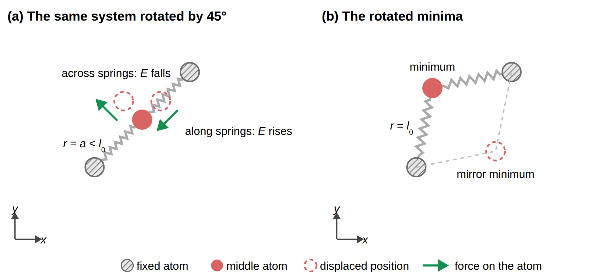
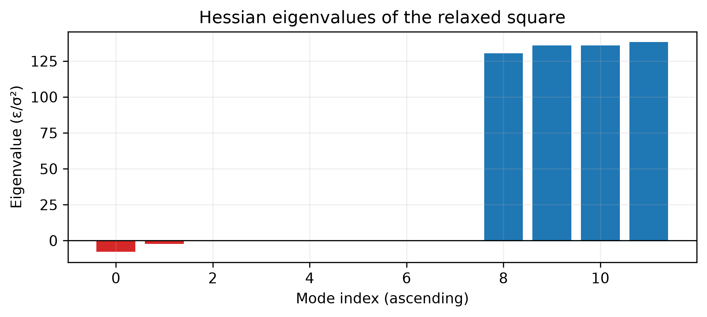

::: {.callout-note}
## Central question

**How can eigenvalues of the Hessian tell us whether a stationary atomic structure is a minimum, even when it has too many coordinates to visualize?**
:::

## Learning outcomes

By the end of this lecture, you should be able to:

1. **Explain** why the eigenvectors of a Hessian are the directions in which the energy curves without coupling, and why each eigenvalue is the curvature along its eigenvector.
2. **Solve** the eigenvalue problem $\mathbf H\mathbf v=\lambda\mathbf v$ for a $2\times2$ matrix by hand, and for larger matrices with `np.linalg.eigh`.
3. **Classify** a relaxed atomic structure from the signs of its Hessian eigenvalues, accounting for rigid translations and rotations.
4. **Lower** the energy of a structure stuck on a saddle point by following the eigenvector of a negative eigenvalue and relaxing again.

## The question left open in L15

In [L15](../L15/index.qmd), one atom moved between two fixed atoms joined to it by compressed springs. Newton's method reached the origin, where the forces cancel. The energy rose for a horizontal displacement but fell for a vertical one, so that stationary point was a saddle. Two mirror minima lay above and below the line of the fixed atoms.

The Hessian records those curvatures. With fixed atoms at $(-a,0)$ and $(a,0)$, its value at the origin is

$$
\mathbf H_0=\begin{bmatrix}2k&0\\0&2k(1-l_0/a)\end{bmatrix}
=k\begin{bmatrix}2&0\\0&-0.4\end{bmatrix}
\qquad (l_0=1.2a).
$$

The positive entry describes the restoring response along the springs. The negative entry describes the energy decrease across them. Because this matrix is diagonal, the two directions are easy to read. The difficulty begins when the coordinates are coupled.

## Rotate the geometry, keeping the axes fixed

Rotate the two fixed atoms by $45^\circ$ about the origin while keeping the laboratory $x$- and $y$-axes unchanged. The moving atom still has two coordinates, and the springs have the same stiffness and natural length. Before calculating anything, predict where the two minima will move.

{#fig-spring-rotated width="90%" fig-alt="Two fixed atoms on a diagonal joined by compressed springs to a middle atom. Displacement along their diagonal is restoring, while displacement across it is unstable. A second panel shows the two rotated minima."}

Rotation carries the old minima $(0,\pm0.6633a)$ to approximately $(-0.4690a,0.4690a)$ and $(0.4690a,-0.4690a)$. A numerical minimizer supplied with the rotated energy still finds these positions. The geometry changes the function being evaluated, but the optimization algorithm needs no new instructions.

At the origin, however, the Hessian now reads

$$
\mathbf H=k\begin{bmatrix}0.8 & 1.2\\1.2 & 0.8\end{bmatrix}.
$$

Both diagonal entries are positive. Moving along the $x$-axis alone raises the energy, and moving along the $y$-axis alone does too. Yet the origin is the same saddle, so there must be a combined displacement that lowers the energy. The off-diagonal entries describe precisely this coupling: moving in $x$ changes the force in $y$, and conversely.

::: {.callout-tip collapse="true"}
## Derivation of the spring Hessian and its rotation

For one spring, let $\mathbf d$ point from its fixed end to the moving atom, let $r=|\mathbf d|$, and let $\hat{\mathbf n}=\mathbf d/r$. Differentiating $\tfrac12 k(r-l_0)^2$ gives gradient $k(r-l_0)\hat{\mathbf n}$ and Hessian

$$
\mathbf H_{\mathrm{spring}}=k\left[\hat{\mathbf n}\hat{\mathbf n}^{\mathsf T}
+\left(1-\frac{l_0}{r}\right)(\mathbf I-\hat{\mathbf n}\hat{\mathbf n}^{\mathsf T})\right].
$$

At the origin both springs have length $a$. Their directions are opposite, so they give the same outer product $\hat{\mathbf n}\hat{\mathbf n}^{\mathsf T}$. For an angle $\theta$ to the $x$-axis, add their contributions using $\hat{\mathbf n}=(\cos\theta,\sin\theta)^{\mathsf T}$:

$$
\mathbf H=2k\begin{bmatrix}
1-(l_0/a)\sin^2\theta & (l_0/a)\sin\theta\cos\theta\\
(l_0/a)\sin\theta\cos\theta & 1-(l_0/a)\cos^2\theta
\end{bmatrix}.
$$

Setting $\theta=0$ gives the diagonal matrix. At $45^\circ$, $\sin^2\theta=\cos^2\theta=1/2$, giving the matrix with entries $0.8k$ and $1.2k$.
:::

## The eigenvalue problem

### Curvature along any direction

Near a stationary point $\mathbf x^*$, the gradient term of the Taylor expansion vanishes, and a small displacement $\delta\mathbf x$ changes the energy by

$$
E(\mathbf x^*+\delta\mathbf x)-E(\mathbf x^*)\approx\tfrac12\,\delta\mathbf x^{\mathsf T}\mathbf H\,\delta\mathbf x .
$$

For a unit direction $\mathbf d$, the curvature along that direction is $\mathbf d^{\mathsf T}\mathbf H\mathbf d$. Choosing $\mathbf d=(1,0)$ picks out $H_{xx}$, and $\mathbf d=(0,1)$ picks out $H_{yy}$. For the rotated spring, the direction $\mathbf d=(1,-1)/\sqrt2$ gives

$$
\mathbf d^{\mathsf T}\mathbf H\mathbf d=\tfrac12\,k\,(0.8-1.2-1.2+0.8)=-0.4k<0,
$$

which reveals the downhill direction that the diagonal entries hide. Strictly positive curvature in **every** nonzero direction is sufficient to establish a strict local minimum. A negative curvature proves that a downhill direction remains. Zero curvature requires more care, since higher-order terms can then decide the behaviour. We need a systematic way to find the largest and smallest curvatures instead of testing directions individually.

### Eigenvectors and eigenvalues

Near a force-balanced structure, the linearized force is

$$
\mathbf F(\mathbf x^*+\delta\mathbf x)\approx-\mathbf H\delta\mathbf x.
$$

A general displacement can produce a force pointing along a different line. We seek special displacement directions along which the force remains parallel or antiparallel to the displacement. Write $\delta\mathbf x=q\mathbf u$, with $q$ the displacement amplitude and $\mathbf u$ a unit direction. If

$$
\boxed{\mathbf H\mathbf u=\lambda\mathbf u,}
$$

then $\mathbf F\approx-\lambda q\mathbf u$. Along that direction, the whole matrix acts like a single spring constant $\lambda$. A positive $\lambda$ gives a restoring force. A negative $\lambda$ gives a force that amplifies the displacement.

- An **eigenvector** $\mathbf u\ne\mathbf 0$ specifies a direction whose line is preserved by the matrix. Multiplying it by any nonzero number gives another eigenvector for the same direction.
- The associated **eigenvalue** $\lambda$ is the multiplier in $\mathbf H\mathbf u=\lambda\mathbf u$. A negative multiplier reverses the vector, and a zero multiplier maps it to zero.

For a unit eigenvector, $\mathbf u^{\mathsf T}\mathbf H\mathbf u=\lambda\mathbf u^{\mathsf T}\mathbf u=\lambda$. Thus the eigenvalue is also the energy curvature along that direction, and the energy change is approximately $\tfrac12\lambda q^2$. We have recovered both the local spring law and its quadratic energy.

### The general matrix problem

The same definition applies to any square matrix $\mathbf A$:

$$
\mathbf A\mathbf u=\lambda\mathbf u
\quad\Longleftrightarrow\quad
(\mathbf A-\lambda\mathbf I)\mathbf u=\mathbf 0.
$$

This resembles the homogeneous systems of L12. An invertible matrix would give only $\mathbf u=\mathbf 0$, which contains no direction and is excluded from the definition. We therefore look for values of $\lambda$ that make $\mathbf A-\lambda\mathbf I$ singular:

$$
\boxed{\det(\mathbf A-\lambda\mathbf I)=0.}
$$

For a general $2\times2$ matrix this expands to

$$
\det\begin{bmatrix}a-\lambda&b\\c&d-\lambda\end{bmatrix}
=(a-\lambda)(d-\lambda)-bc
=\lambda^2-(a+d)\lambda+(ad-bc)=0.
$$

We first solve this quadratic for the eigenvalues. For each one, substitute it back into $(\mathbf A-\lambda\mathbf I)\mathbf u=\mathbf 0$ and find a nonzero vector. The determinant of an $n\times n$ matrix gives a degree-$n$ polynomial in $\lambda$. It has $n$ roots over the complex numbers counting multiplicities, although there can be fewer distinct eigenvalues. A general real matrix can have complex eigenvalues. The real symmetric Hessian has real eigenvalues, which is why they can serve as signed curvatures.

### Worked example: the rotated spring Hessian

With $\mathbf H=k\begin{bmatrix}0.8&1.2\\1.2&0.8\end{bmatrix}$ and $\lambda$ measured in units of $k$,

$$
\det\begin{bmatrix}0.8-\lambda & 1.2\\ 1.2 & 0.8-\lambda\end{bmatrix}
=(0.8-\lambda)^2-1.2^2=0
\quad\Rightarrow\quad
\lambda=0.8\pm1.2 .
$$

The eigenvalues are $\lambda_1=-0.4k$ and $\lambda_2=2.0k$, the same as for the unrotated system. Write their unit eigenvectors as $\mathbf v_1$ and $\mathbf v_2$. For $\lambda_1$, the first row of $(\mathbf H-\lambda_1\mathbf I)\mathbf v=\mathbf 0$ reads $1.2v_x+1.2v_y=0$, so $\mathbf v_1=(-1,1)/\sqrt2$. For $\lambda_2$, it reads $-1.2v_x+1.2v_y=0$, so $\mathbf v_2=(1,1)/\sqrt2$. The stable direction $\mathbf v_2$ lies along the spring axis $\mathbf n=(1,1)/\sqrt2$, and the unstable direction $\mathbf v_1$ is perpendicular to it. Either sign of each eigenvector describes the same line. Normalizing the vector to length one fixes its magnitude, but still leaves this sign freedom.

The eigenvalues did not change when we rotated the system. Only the eigenvectors turned with it. The eigenvalues describe the physics, while the matrix entries also depend on our choice of axes.

### Why the eigenvectors answer the question

For a real symmetric matrix such as $\mathbf H$, we can choose a complete set of mutually perpendicular unit eigenvectors, including when eigenvalues repeat. They form a new set of axes. Measured along those axes, with coordinates $q_1,q_2,\ldots$, the coupling disappears and the energy change becomes a sum of independent terms:

$$
\tfrac12\,\delta\mathbf x^{\mathsf T}\mathbf H\,\delta\mathbf x=\tfrac12\left(\lambda_1q_1^2+\lambda_2q_2^2+\cdots+\lambda_nq_n^2\right).
$$

This is the diagonal case we could read at a glance, recovered for any Hessian. The rule for classifying a stationary point follows directly:

| Eigenvalues of $\mathbf H$ | Energy near the point | Stationary point |
|---|---|---|
| All positive | Rises in every direction | Local minimum |
| Some positive, some negative | Rises in some directions and falls in others | Saddle point |
| All negative | Falls in every direction | Local maximum |

A matrix whose eigenvalues are all positive is called **positive definite**, the property that Cholesky factorization required in L13. For the spring system, `cho_factor` fails at the origin and succeeds at either minimum.

{#fig-compressed-spring fig-alt="Two contour plots of the middle-atom energy. Left, fixed atoms on the x-axis, minima above and below the origin, a red arrow pointing up and a blue arrow pointing right. Right, the same landscape rotated by 45 degrees, with fixed atoms on the diagonal, minima on the other diagonal, and the arrows rotated with them." width="90%"}

### Computing eigenvalues in practice

For a $2\times2$ matrix, $\det(\mathbf H-\lambda\mathbf I)=0$ is a quadratic equation that we can solve by hand. For the $3N\times3N$ Hessian of a cluster, we use a library routine.

::: {.callout-note}
## Syntax: Eigenvalues of a symmetric matrix with `np.linalg.eigh`

```python
values, vectors = np.linalg.eigh(H)   # H must be symmetric
values           # eigenvalues in ascending order
vectors[:, 0]    # unit eigenvector for values[0]: the eigenvectors are COLUMNS
```

[`np.linalg.eigh`](https://numpy.org/doc/stable/reference/generated/numpy.linalg.eigh.html) is designed for symmetric (Hermitian) matrices and guarantees real eigenvalues and perpendicular eigenvectors. The general `np.linalg.eig` also works for nonsymmetric matrices, but it does not sort its output and may return complex numbers.
:::

The determinant equation explains the eigenvalue problem, but numerical libraries use matrix algorithms rather than expanding a large characteristic polynomial. After computing a pair $(\lambda,\mathbf u)$, check it by evaluating $\mathbf H\mathbf u-\lambda\mathbf u$.

A finite-difference Hessian can have small asymmetries from truncation and rounding. Check that they shrink appropriately when changing the difference step. Averaging $\mathbf H$ with its transpose then removes that small numerical asymmetry before `eigh`. A large asymmetry can indicate an incorrect gradient or derivative calculation and needs investigation.

::: {.quarto-wasm-local notebook="l16_saddle_eigen.edit.py" view="edit" title="Hessian, eigenvectors, and a Cholesky test for the compressed spring" height="1000" loading="lazy" fullscreen="true"}
The notebook builds the $2\times2$ Hessian of the compressed spring system by central differences, compares it with the analytical matrix, and diagonalizes it with `np.linalg.eigh`. At $\theta=45^\circ$ and $l_0=1.2a$, it gives $\mathbf H=k\begin{bmatrix}0.8&1.2\\1.2&0.8\end{bmatrix}$ with eigenvalues $-0.4k$ and $2.0k$, and eigenvectors perpendicular and parallel to the spring axis. Energy profiles along the $x$- and $y$-axes rise in both directions, while the profile along the first eigenvector falls. Cholesky factorization fails at the origin and succeeds at the minimum.
:::

## From one atom to a cluster

For a cluster of $N$ atoms, the Hessian is $3N\times3N$, and the same rule applies with one adjustment. If we translate the whole cluster or rotate it rigidly, no distance between atoms changes, and neither does the energy. At a stationary configuration, an isolated nonlinear cluster therefore has three translational and three rotational zero modes, giving six zero eigenvalues. (A linear molecule has only two distinct rotations, and therefore five.) In the spring system, the fixed atoms removed these motions, which is why every eigenvalue there was nonzero.

A relaxed cluster is a local minimum when, apart from the six zero eigenvalues, all $3N-6$ remaining eigenvalues are positive. In floating-point arithmetic the "zero" eigenvalues come out as small numbers such as $10^{-6}$, so in practice we use a tolerance appropriate to the stiffness scale and derivative accuracy. Additional zero modes can represent internal flexibility. Their stability needs higher-order information or direct energy tests.

### The four-atom square from A1

In Assignment 1, the tetrahedron was the lowest of three four-atom argon shapes. What happens if we hand a perfect square to a minimizer? Using LJ reduced units, with energies in $\varepsilon$ and lengths in $\sigma$, BFGS stops after five iterations at $E=-4.480620\,\varepsilon$, with a gradient below $10^{-8}$ and `success = True`. The structure is still a flat square. By symmetry, every force lies in the plane of the square, so nothing pushes any atom out of it, and the minimizer only adjusts the side length.

The $12\times12$ Hessian tells a different story:

{#fig-square-eigenvalues fig-alt="Bar chart of twelve eigenvalues in ascending order: two negative bars near minus 7.9 and minus 2.2, six bars at zero, and four positive bars between 130 and 138." width="70%"}

Two eigenvalues are negative, $\lambda_1=-7.86$ and $\lambda_2=-2.22\,\varepsilon/\sigma^2$, so the square is a saddle point with two independent downhill directions. Their eigenvectors show what they are:

- **Mode 1** keeps the atoms in the plane and shears the square into a rhombus.
- **Mode 2** moves the atoms perpendicular to the plane: two opposite corners rise while the other two sink, folding the square.

Displacing the atoms a short distance along an eigenvector and relaxing again follows that downhill path:

| Path | Energies along the path ($\varepsilon$) | Structures |
|---|---|---|
| Follow mode 1 | $-4.4806\ \rightarrow\ -5.0734\ \rightarrow\ -6.0000$ | Square → flat rhombus (a saddle with one negative eigenvalue) → tetrahedron |
| Follow mode 2 | $-4.4806\ \rightarrow\ -6.0000$ | Square → tetrahedron |

Both paths end at the tetrahedron, with all six pair distances equal to $2^{1/6}\sigma$ and a Hessian with six zero and six positive eigenvalues. On the first path, the flat rhombus is another saddle, so we repeat the eigenvalue test after every relaxation.

::: {.quarto-wasm-local notebook="l16_cluster_check.edit.py" view="edit" title="Checking a relaxed four-atom cluster with Hessian eigenvalues" height="1000" loading="lazy" fullscreen="true"}
The notebook relaxes a perfect four-atom square with BFGS, which stops at $-4.480620\,\varepsilon$ with `success = True`. Its $12\times12$ finite-difference Hessian has two negative, six zero, and four positive eigenvalues. Following the in-plane mode passes through a flat rhombus at $-5.073421\,\varepsilon$, which still has one negative eigenvalue, and reaches the tetrahedron at $-6\,\varepsilon$. Following the out-of-plane mode reaches the tetrahedron directly.
:::

## Thirteen argon atoms: a stationary point that is not a minimum

For the four-atom square, we could still guess the downhill motions by eye. In larger clusters we cannot, and the eigenvalue test becomes the reliable check. In L15, ASE relaxed 13 randomly displaced argon atoms to the icosahedron. A natural alternative starting guess is a piece of the argon crystal itself: the face-centred cubic (fcc) lattice. One atom and its 12 nearest neighbours in fcc form a **cuboctahedron**, a shape with square and triangular faces.

By symmetry, every force in the perfect cuboctahedron points along a line through the central atom, so a minimizer only changes the size of the cluster. In LJ reduced units, it stops at $E=-40.884494\,\varepsilon$ with a tiny gradient and `success = True`. The Hessian is $39\times39$, and it is built column by column from central differences of the gradient, as in the notebooks above. Its eigenvalues are

- one negative eigenvalue, $\lambda_1=-10.99\,\varepsilon/\sigma^2$;
- six zero eigenvalues, from rigid translation and rotation;
- 32 positive eigenvalues.

The cuboctahedron is therefore a saddle point. Displacing the atoms along the eigenvector of $\lambda_1$, by $0.1\sigma$ in total, and relaxing again leads to the **icosahedron** at $-44.326801\,\varepsilon$, the structure ASE found in L15. Its Hessian has six zero and 33 positive eigenvalues, so it is a minimum.

{#fig-lj13-hessian fig-alt="Left, a 13-atom cuboctahedron. Centre, a 13-atom icosahedron. Right, the 39 Hessian eigenvalues of each in ascending order: the cuboctahedron has one negative value, six near zero, and the rest positive. The icosahedron has six near zero and the rest positive." width="100%"}

The positive eigenvalues carry more information than their signs. Each one measures the stiffness of the structure along its eigenvector. For small displacements from a minimum, Newton's second law reads $m\,\ddot{\delta\mathbf x}=-\mathbf H\,\delta\mathbf x$, and along each eigenvector the atoms oscillate on their own, like a single mass on a spring of stiffness $\lambda_k$, with angular frequency

$$
\omega_k=\sqrt{\frac{\lambda_k}{m}} .
$$

For the argon icosahedron, the 33 vibrations lie between 16 and 60 cm⁻¹, in the far infrared. The eigenvectors are the **normal modes** of the cluster, the patterns in which its atoms vibrate together.

## Wrapping up Unit 3

Unit 3 began with atoms joined by harmonic springs, whose equilibrium displacements solved one linear system, $\mathbf K\mathbf u=\mathbf f$ (L11–L13). With a full pair potential, the force balance became a system of nonlinear equations, which Newton's method solves one linear system at a time, using the Jacobian ([L14](../L14/index.qmd)). Asking for a stable structure turned the problem into energy minimization, where the Jacobian of the gradient is the Hessian and optimization methods use energy information to guide their steps ([L15](../L15/index.qmd)). The eigenvalues of that Hessian tell us whether the result is a minimum. A structure relaxation in a research code chains the same operations:

$$
\text{structure}
\;\rightarrow\; E,\ \nabla E
\;\rightarrow\; \text{minimizer}
\;\rightarrow\; \mathbf H\mathbf v=\lambda\mathbf v
\;\rightarrow\; \text{minimum, or a downhill mode to follow}.
$$

## What to keep

1. Positive curvature in every nonzero direction establishes a strict local minimum. A negative direction rules one out, while zero curvature can require higher-order analysis.
2. The eigenvectors of $\mathbf H$ are the directions in which the energy curves without coupling, and each eigenvalue is the curvature along its eigenvector. The eigenvalues do not depend on the choice of axes.
3. All eigenvalues positive means a minimum (a positive definite Hessian, which Cholesky can test). Mixed signs mean a saddle point, and the eigenvector of a negative eigenvalue points downhill.
4. At a stationary isolated nonlinear cluster, six rigid-motion modes have zero eigenvalues. Positive curvatures in the remaining directions establish a local minimum apart from those rigid motions.
5. A minimizer that reports success may still have stopped on a saddle point. Following a negative mode and relaxing again lowers the energy, and the test is repeated after each relaxation.

## Check your understanding

1. Find the eigenvalues of $\mathbf H$ for $\theta=30^\circ$ and $l_0=1.2a$ without calculating the matrix entries. Then use the notebook to check your answer and the directions of the eigenvectors.
2. A relaxed cluster of 20 atoms has a Hessian with 6 eigenvalues of magnitude below $10^{-5}$, one eigenvalue of $-0.02$, and 53 positive eigenvalues. What would you report, and what would you do next?
3. The cuboctahedron relaxation reports `success = True` and a tiny gradient. What additional calculation shows that it is not a stable structure, and how does the result tell you to lower the energy?
4. Why does the flat rhombus on the path from the square to the tetrahedron need its own eigenvalue test, even though it was reached by following a downhill mode?
5. A linear molecule such as CO$_2$ has five rigid-motion zero modes instead of six. Which rotation produces no atomic displacement, and therefore adds no independent mode?

## Next

The vibrations at the end of this lecture came from Newton's second law, $m\,\ddot{\mathbf x}_i=\mathbf F_i$, with the forces we have been sending to zero. Instead of moving the atoms downhill until the forces vanish, we can let them move under those forces and watch a structure vibrate, cross barriers, and change shape. Unit 4 turns to how materials change with time, which leads us to ordinary differential equations.
