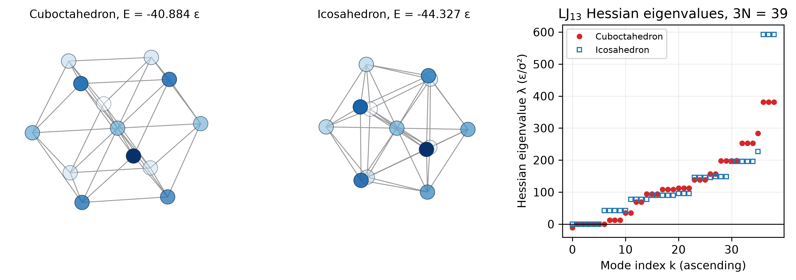
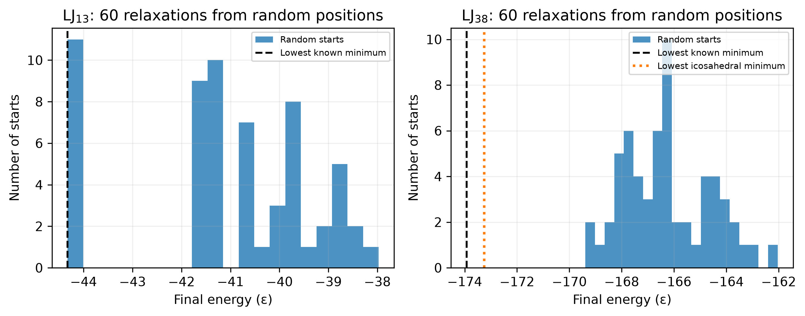
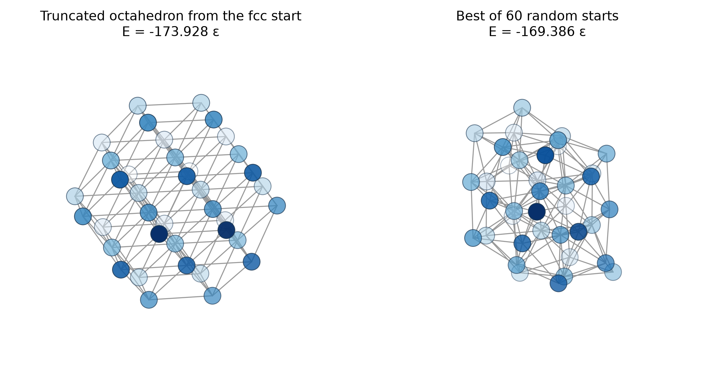
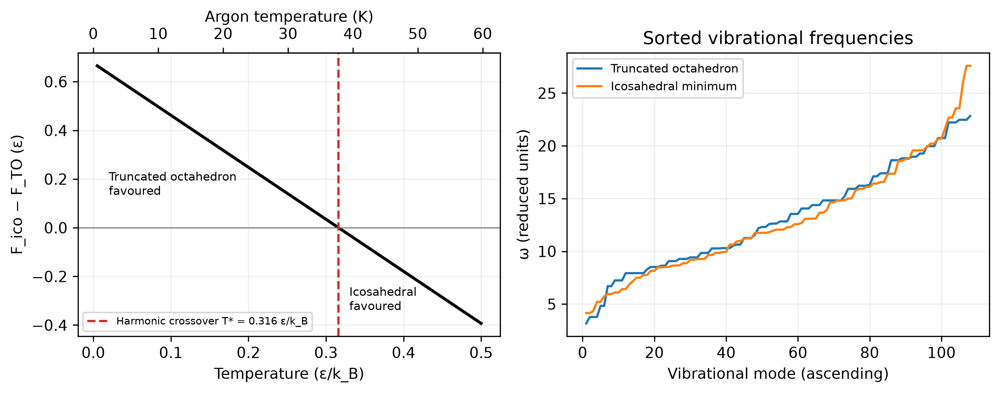

::: {.callout-note}
## Central question

**Which structure does a cluster of 38 argon atoms adopt, and can the answer change with temperature?**
:::

## Learning outcomes

By the end of this lecture, you should be able to:

1. **Represent** an atomic cluster as an $N\times3$ coordinate matrix and a flat vector of $3N$ unknowns.
2. **Calculate** the Lennard-Jones energy and its gradient for all atom pairs with NumPy broadcasting.
3. **Relax** a cluster with a minimizer, and distinguish a local minimum from the global minimum using several starting structures.
4. **Check** a relaxed structure with its Hessian eigenvalues and convert them to vibrational frequencies.
5. **Estimate** the vibrational entropy and harmonic free energy of two competing minima, and the temperature at which they exchange stability.

## Wrapping up Unit 3

Unit 3 began with atoms joined by harmonic springs, whose equilibrium displacements solved $\mathbf{K}\mathbf{u}=\mathbf{f}$ (L11–L13). With a full pair potential, finding a structure became a minimization over many coordinates ([L14](../L14/index.qmd)), and checking that a minimizer really found a minimum led us to the Hessian and its eigenvalues ([L15](../L15/index.qmd)). This lecture puts the pieces into **one program**, the same way L10 closed Unit 2:

$$
\text{coordinates}
\;\rightarrow\; E(\mathbf x)
\;\rightarrow\; \text{minimization}
\;\rightarrow\; \text{multiple minima},
$$

and then, at each minimum,

$$
\mathbf H=\nabla^2E
\;\rightarrow\; \mathbf H\mathbf v=\lambda\mathbf v
\;\rightarrow\; \text{basin curvature and vibrational entropy}
\;\rightarrow\; \boxed{F(T)=E-TS}.
$$

## The materials question

Small clusters of atoms sit between a molecule and a crystal. When argon or xenon expands through a nozzle into vacuum, it cools and condenses into clusters of many sizes, and mass spectra show unusually abundant sizes, or **magic numbers**, at $N=13$, 55, and 147 ([Echt, Sattler and Recknagel, 1981](https://doi.org/10.1103/PhysRevLett.47.1121)). These are the sizes at which atoms complete concentric icosahedral shells, even though bulk argon and xenon crystallize in the face-centred cubic (fcc) structure. A small cluster can prefer a structure that its crystal never adopts, because so many of its atoms lie at the surface.

We describe argon with the Lennard-Jones (LJ) potential from Assignments 1 and 2,

$$
V(r)=4\varepsilon\left[\left(\frac{\sigma}{r}\right)^{12}-\left(\frac{\sigma}{r}\right)^{6}\right],
\qquad \varepsilon=0.0103\ \mathrm{eV},\quad \sigma=3.40\ \text{Å},
$$

whose minimum, $V=-\varepsilon$, lies at $r_m=2^{1/6}\sigma\approx3.82$ Å. In A1, the four-atom tetrahedron won because all six of its pair distances can equal $r_m$ at once. For 38 atoms, not every pair can sit at $r_m$, and the best compromise is no longer obvious.

The program works in **LJ reduced units**: energies in $\varepsilon$, lengths in $\sigma$, masses in the atomic mass $m$, and temperatures in $\varepsilon/k_B$, so that $V(r)=4\left(r^{-12}-r^{-6}\right)$. For argon, one temperature unit is $\varepsilon/k_B=119.5$ K. Published lowest energies, such as those in the [Cambridge Cluster Database](https://doye.chem.ox.ac.uk/jon/structures/LJ.html), use the same units, so we can compare our results with them directly.

### The coordinate matrix, energy, and gradient

The positions of $N$ atoms form a matrix with one row per atom,

$$
\mathbf{X}=
\begin{bmatrix}
x_1 & y_1 & z_1\\
x_2 & y_2 & z_2\\
\vdots & \vdots & \vdots\\
x_N & y_N & z_N
\end{bmatrix},
\qquad
\mathbf{x}=(x_1,y_1,z_1,\;x_2,y_2,z_2,\;\ldots,\;z_N).
$$

A minimizer expects the flat vector $\mathbf x$ of length $3N$, which is 114 variables for LJ$_{38}$. In NumPy, `X.ravel()` produces $\mathbf x$ and `x.reshape(N, 3)` recovers $\mathbf X$.

The total energy adds one LJ term for every pair,

$$
E(\mathbf x)=\sum_{i<j}V(r_{ij}),\qquad r_{ij}=\lvert\mathbf x_i-\mathbf x_j\rvert,
$$

so for three atoms it is $V(r_{12})+V(r_{13})+V(r_{23})$. Moving atom $i$ changes only the distances $r_{ij}$ that involve it, and the chain rule, with the separation vector $\mathbf d_{ij}=\mathbf x_i-\mathbf x_j$, gives

$$
\frac{\partial E}{\partial\mathbf x_i}
=\sum_{j\neq i}\frac{V'(r_{ij})}{r_{ij}}\,\mathbf d_{ij},
\qquad V'(r)=-\frac{48}{r^{13}}+\frac{24}{r^{7}}.
$$

Each term points along the line joining the two atoms. The force on atom $i$ is $\mathbf F_i=-\partial E/\partial\mathbf x_i$.

**Sanity check:** How many pairs of atoms does LJ$_{38}$ have? How many entries does its Hessian have?

::: {.callout-tip collapse="true"}
## Answer: Pair count and Hessian size for 38 atoms

There are $N(N-1)/2=38\times37/2=703$ pairs. The Hessian is $3N\times3N=114\times114$, with 12,996 entries.
:::

## The live notebook

We build the program step by step in the notebook below. Its controls change the number of atoms and the starting structure. Use **Open in marimo.app** to work in a separate browser session where you can download your edited notebook.

::: {.quarto-wasm-local notebook="l16_lj_cluster.edit.py" view="edit" title="Live demo: relax an LJ cluster, test its stability, and compare free energies" height="1100" loading="lazy" fullscreen="true" marimo-app="true"}
The notebook builds an LJ cluster as an $N\times3$ coordinate matrix, evaluates its energy and gradient with NumPy broadcasting, relaxes it with L-BFGS-B, and diagonalizes a finite-difference Hessian. For 38 atoms cut from an fcc crystal around an octahedral hole, one relaxation gives the truncated octahedron at $-173.928427\,\varepsilon$, a local minimum with six zero and 108 positive Hessian eigenvalues. Sixty relaxations from random positions all end at higher energies, with the best at $-169.39\,\varepsilon$. The lowest icosahedral minimum lies $0.676\,\varepsilon$ above the truncated octahedron but has $2.14\,k_B$ more vibrational entropy, so in the harmonic approximation the two free energies cross at $0.316\,\varepsilon/k_B$, about 38 K for argon.
:::

## Step 1 · Building a starting structure

A natural starting guess for argon is a piece of its own crystal. In the fcc lattice with cube edge $a=\sqrt2\,r_m$, the atoms sit at $\tfrac a2(i,j,k)$ for integers $i,j,k$ with an even sum, and nearest neighbours are $r_m$ apart. To cut a cluster, we generate a block of lattice points with `np.meshgrid`, keep those with an even sum, and keep the $N$ closest to a chosen centre using `np.argsort`:

- **Centred on an atom:** the atom and its 12 nearest neighbours form a 13-atom **cuboctahedron**.
- **Centred on an octahedral hole** at $(a/2,0,0)$: the nearest shells hold 6, 8, and 24 lattice points, so $N=38$ atoms form a complete **truncated octahedron**, with square and hexagonal faces.

The notebook also generates **random** starting positions inside a sphere for comparison.

## Step 2 · Energy and gradient with broadcasting

In A1, we evaluated the cluster energy with two nested loops over atoms. Broadcasting moves those loops into compiled NumPy code:

```python
d = X[:, None, :] - X[None, :, :]     # shape (N, N, 3)
```

The two views of `X` have shapes $(N,1,3)$ and $(1,N,3)$. NumPy stretches both to $(N,N,3)$, so `d[i, j]` is the separation vector $\mathbf x_i-\mathbf x_j$ for every pair at once. Its norm along the last axis is the $N\times N$ distance matrix,

$$
\mathbf r=
\begin{bmatrix}
0 & r_{12} & r_{13} & \cdots\\
r_{12} & 0 & r_{23} & \cdots\\
r_{13} & r_{23} & 0 & \cdots\\
\vdots & & & \ddots
\end{bmatrix},
$$

in which each pair appears twice. The energy keeps only the entries above the diagonal, whose indices `np.triu_indices(N, k=1)` returns. The gradient keeps every pair, because atom $i$ feels a force from every partner, and sets the diagonal to infinity so that an atom exerts no force on itself.

::: {.callout-tip collapse="true"}
## Example code: Vectorized LJ energy and gradient in reduced units

```python
def pair_separations(X):
    d = X[:, None, :] - X[None, :, :]        # (N, N, 3) separation vectors
    r = np.linalg.norm(d, axis=-1)           # (N, N) distance matrix
    return d, r

def lj_energy(X):
    d, r = pair_separations(X)
    i, j = np.triu_indices(len(X), k=1)      # each pair once
    inv6 = r[i, j]**-6
    return np.sum(4*(inv6*inv6 - inv6))

def lj_gradient(X):
    d, r = pair_separations(X)
    np.fill_diagonal(r, np.inf)              # no self-interaction
    inv6 = r**-6
    dV_dr = (-48*inv6*inv6 + 24*inv6)/r
    return np.sum((dV_dr/r)[:, :, None]*d, axis=1)   # (N, 3)
```
:::

The analytical gradient is easy to get wrong by a sign or a factor of $r$, so the notebook compares a few of its entries with central differences of the energy, $[E(\mathbf x+h\mathbf e_k)-E(\mathbf x-h\mathbf e_k)]/2h$.

## Step 3 · Relaxing all coordinates with `minimize`

We use [`scipy.optimize.minimize`](https://docs.scipy.org/doc/scipy/reference/generated/scipy.optimize.minimize.html) with the L-BFGS-B method from L14. The two `lambda` functions translate between the flat vector of the minimizer and the $N\times3$ matrix of our energy functions.

::: {.callout-tip collapse="true"}
## Example code: Relaxing a cluster from its coordinate matrix

```python
def relax(X0):
    N = len(X0)
    result = minimize(lambda x: lj_energy(x.reshape(N, 3)), X0.ravel(),
                      jac=lambda x: lj_gradient(x.reshape(N, 3)).ravel(),
                      method="L-BFGS-B",
                      options={"gtol": 1e-6, "ftol": 1e-12, "maxiter": 5000})
    return result.x.reshape(N, 3), result
```
:::

Starting from the 38 atoms around an octahedral hole, the relaxation converges in nine iterations to

$$
E=-173.928427\,\varepsilon=-1.791\ \mathrm{eV},
$$

the lowest energy known for LJ$_{38}$. The fcc start was already close, and relaxation only adjusted the bond lengths.

## Step 4 · Checking the minimum and its vibrations

As in L15, we build the $114\times114$ Hessian column by column from central differences of the gradient and diagonalize it with `np.linalg.eigh`. The truncated octahedron has six zero eigenvalues (rigid translation and rotation) and 108 positive ones, so it is a local minimum.

The test matters. The 13-atom cuboctahedron, cut from fcc around an atom, is a stationary point by symmetry: the minimizer stops there at $-40.884494\,\varepsilon$ with `success = True`. Its Hessian has one negative eigenvalue, $-10.99\,\varepsilon/\sigma^2$. Pushing the atoms along that eigenvector and relaxing again leads to the **icosahedron** at $-44.326801\,\varepsilon$, the first magic-number cluster.

{#fig-lj13-hessian fig-alt="Left, a 13-atom cuboctahedron. Centre, a 13-atom icosahedron. Right, the 39 Hessian eigenvalues of each in ascending order: the cuboctahedron has one negative value, six near zero, and the rest positive. The icosahedron has six near zero and the rest positive." width="100%"}

At a minimum, each positive eigenvalue also gives a vibration. For small displacements, Newton's second law is $m\,\ddot{\delta\mathbf x}=-\mathbf H\,\delta\mathbf x$, and each eigenvector oscillates on its own with angular frequency

$$
\omega_k=\sqrt{\frac{\lambda_k}{m}} .
$$

For the argon truncated octahedron, the 108 vibrations lie between 7.8 and 56.2 cm⁻¹, in the far infrared.

## Step 5 · Local and global minima

The fcc start found the lowest known LJ$_{38}$ energy in one relaxation, but only because we guessed well. Without that guess, we relax many random starting structures and look at where they end.

::: {.callout-tip collapse="true"}
## Example code: Relaxing many random starts

```python
def multistart(N, n_starts):
    energies, structures = [], []
    for seed in range(n_starts):
        X, result = relax(random_cluster(N, seed=seed))
        energies.append(result.fun)
        structures.append(X)
    return energies, structures
```
:::

{#fig-multistart fig-alt="Two histograms of final energies. For 13 atoms, one group lies at the lowest known energy near minus 44.3 and the rest between minus 42 and minus 38. For 38 atoms, all final energies lie between about minus 169.4 and minus 162, well above the lowest known minimum at minus 173.9 and the lowest icosahedral minimum at minus 173.3." width="100%"}

For 13 atoms, about one start in six reaches the icosahedron. For 38 atoms, the 60 relaxations spread over many local minima between $-169.4\,\varepsilon$ and $-162\,\varepsilon$, and none comes within $4\,\varepsilon$ of the truncated octahedron. Every one of them is a genuine local minimum, with a small gradient and positive Hessian eigenvalues. The minimizer did its job, but it cannot know that lower minima exist elsewhere.

{#fig-lj38-structures fig-alt="Two 38-atom clusters. Left, an ordered truncated octahedron with straight rows of atoms and square and hexagonal faces. Right, a disordered compact cluster." width="85%"}

The low-energy structures of LJ$_{38}$ fall into two families, or **funnels**: the fcc truncated octahedron and a much larger group of icosahedral-like structures, separated by a high energy barrier ([Doye, Miller and Wales, 1999](https://doi.org/10.1063/1.477902)). Random starts almost always fall into the icosahedral funnel. Global optimization methods such as **basin hopping** ([Wales and Doye, 1997](https://doi.org/10.1021/jp970984n), available as [`scipy.optimize.basinhopping`](https://docs.scipy.org/doc/scipy/reference/generated/scipy.optimize.basinhopping.html)) repeatedly perturb and relax a structure to escape such traps. We used it to find the lowest icosahedral structure, at $-173.252378\,\varepsilon$, which the notebook supplies.

## Step 6 · Which structure wins at finite temperature?

The icosahedral minimum lies only $0.676\,\varepsilon$ above the truncated octahedron. At 0 K, the lower energy wins. At finite temperature, the atoms vibrate inside their basin, and the shape of the basin starts to matter.

### Basin width from the eigenvalues

A displacement $s$ along a mode with eigenvalue $\lambda_k$ raises the energy by $\tfrac12\lambda_k s^2$. At temperature $T$, the Boltzmann factor gives the probability of that displacement as

$$
p(s)\propto\exp\!\left(-\frac{\lambda_k s^2}{2k_BT}\right),
$$

a Gaussian of width $\sqrt{k_BT/\lambda_k}$. A small eigenvalue means a wide, gently curved basin in which the atoms can spread over more positions, and therefore a larger **vibrational entropy**.

### The harmonic free energy

Treating each of the $3N-6$ modes as a classical harmonic oscillator, with free energy $k_BT\ln(\hbar\omega/k_BT)$, gives the free energy of one minimum:

$$
F(T)=E_{\min}+k_BT\sum_{k=7}^{3N}\ln\frac{\hbar\omega_k}{k_BT},
\qquad \omega_k=\sqrt{\lambda_k/m}.
$$

The sum skips the six zero eigenvalues. $E_{\min}$ comes from the minimizer, and the entropy comes from the eigensolver. Comparing the icosahedral (ico) and truncated octahedral (TO) minima, $\hbar$ cancels and

$$
\Delta F=F_{\text{ico}}-F_{\text{TO}}=\Delta E-T\,\Delta S,
\qquad
\Delta S=\frac{k_B}{2}\left(\sum_k\ln\lambda_k^{\text{TO}}-\sum_k\ln\lambda_k^{\text{ico}}\right).
$$

::: {.callout-tip collapse="true"}
## Example code: Harmonic free energy of one minimum

```python
HBAR_ARGON = 0.0297   # hbar in LJ reduced units for argon

def harmonic_free_energy(T, E, eigenvalues, hbar=HBAR_ARGON):
    omega = np.sqrt(eigenvalues[6:])              # skip the six zero modes
    T = np.asarray(T, dtype=float)
    return E + T*(np.sum(np.log(hbar*omega)) - len(omega)*np.log(T))
```
:::

| | Truncated octahedron | Lowest icosahedral minimum |
|---|---:|---:|
| Energy ($\varepsilon$) | $-173.928427$ | $-173.252378$ |
| $\sum_k\ln\lambda_k$ over 108 modes | 538.669 | 534.392 |
| Geometric-mean frequency (reduced units) | 12.108 | 11.870 |

The icosahedral basin is softer. Its frequencies are only about 2% lower on average, but over 108 modes this adds up to

$$
\Delta S=\tfrac12(538.669-534.392)\,k_B=2.14\,k_B,
$$

and the free energies cross at

$$
T^*=\frac{\Delta E}{\Delta S}=\frac{0.676\,\varepsilon}{2.14\,k_B}=0.316\,\varepsilon/k_B\approx38\ \mathrm K\ \text{for argon}.
$$

Below $T^*$ the fcc structure is favoured, and above it the icosahedral structure is favoured: a **solid–solid transition** in a cluster of 38 atoms, driven by the curvature of the energy landscape.

{#fig-free-energy fig-alt="Left, a straight line of free-energy difference against temperature, falling from 0.68 epsilon at zero temperature through zero at 0.316 epsilon per kB, about 38 K. Right, two nearly overlapping sorted frequency curves, with the icosahedral curve slightly lower over most of the middle range." width="100%"}

This estimate uses one minimum from each funnel and treats each basin as a parabola. The icosahedral funnel contains many more low-lying minima, and each one adds entropy to that side, so a calculation that includes them places the transition at a lower temperature.

### Kinetics: reaching the favoured structure

Thermodynamics tells us which structure is favoured, not how quickly the cluster gets there. To change funnels, the cluster must cross the barrier between them, a thermally activated process whose rate falls as $\exp(-\Delta E^{\ddagger}/k_BT)$. At low temperature, where the fcc structure is favoured, crossings are rare, and a cluster that condensed into the icosahedral funnel can stay there for a long time, just as our random starts stayed in the basin they first reached.

## Answering the materials question

Within the LJ model, the most stable arrangement of 38 argon atoms at low temperature is the truncated octahedron, a fragment of the fcc crystal, at $E=-173.928\,\varepsilon=-1.791$ eV. The gradient check, the converged gradient, and the Hessian eigenvalues confirm that it is a minimum, and the Cambridge Cluster Database confirms that no lower one is known. Above a crossover temperature, which our harmonic two-minimum estimate places at about 38 K, the softer icosahedral structures are favoured.

LJ$_{38}$ is small enough that we computed every step from coordinates to free energy in a browser, yet it already shows how structure, optimization, the energy landscape, entropy, kinetics, and thermodynamics compete. That competition is what makes it a standard model system.

## What to keep

1. A cluster is an $N\times3$ matrix for the physics and a vector of $3N$ unknowns for the minimizer. Broadcasting computes all pair separations and distances at once.
2. A minimizer finds the local minimum downhill from its start. Finding the global minimum depends on the starting structures and on a wider search.
3. The Hessian eigenvalues confirm a minimum (six zeros, all others positive) and give the vibrational frequencies $\omega_k=\sqrt{\lambda_k/m}$.
4. Small eigenvalues mean a wide basin and a large vibrational entropy, so the harmonic free energy $F=E-TS$ combines the minimizer's energy with the eigensolver's entropy.
5. Two structures exchange stability where $\Delta F=\Delta E-T\Delta S=0$. Whether the favoured structure is reached depends on the barrier between them.

## Check your understanding

1. The cuboctahedron relaxation reports `success = True` and a tiny gradient. What additional calculation shows that it is not a stable structure, and how does the result tell you to lower the energy?
2. A classmate relaxes 20 random starts of LJ$_{38}$ and reports the lowest energy as the most stable structure. What would you ask them to check?
3. The two LJ$_{38}$ minima differ in geometric-mean frequency by only 2%. Why does this produce an entropy difference of $2.14\,k_B$? How would $\Delta S$ change for a cluster with twice as many atoms and the same 2% difference?
4. A cluster cooled quickly to 5 K is observed to be icosahedral, although the fcc structure has the lower free energy there. Is the calculation wrong? Explain using the two funnels.

## Next

The forces we coded today are exactly what a molecular dynamics simulation needs. Instead of sending the atoms downhill until the forces vanish, we can let them move according to $m\,\ddot{\mathbf x}_i=\mathbf F_i$ and watch the cluster vibrate, cross barriers, and change structure. Unit 4 turns to how materials change with time, which leads us to ordinary differential equations.
